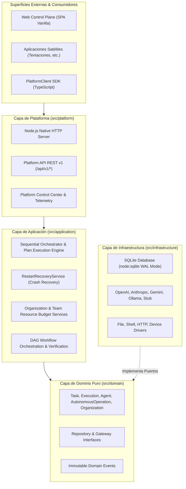

# Architecture Specification (v1.4.0)

## 1. Architectural Principles and Dependency Direction

The AI Operating Platform follows **Hexagonal Architecture (Ports and Adapters)** and **Clean Architecture** with strict inward dependency rules:

```text
Interfaces / Platform (HTTP REST API, Web SPA, SDK)
        ↓
Application Layer (Use Cases, Orchestrators, Recovery, Services)
        ↓
Domain Layer (Aggregates, Policies, Value Objects, Domain Events)
        ↑
Infrastructure Layer (SQLite WAL, Model Gateways, Tool Adapters)
```

The inward arrow toward the domain is strict: Application and Infrastructure depend on Domain interfaces and ports, never the reverse.

---

## 2. Structural Layer Boundaries



---

## 3. Domain Inventory & Subsystems

| Subsystem | Responsibility | Architectural Boundary |
| :--- | :--- | :--- |
| **Task & Execution System** | Finite state machines for `Task` and atomic `Execution`. | Domain pure; 0 infrastructure dependencies. |
| **Agent & Capability Registry** | First-class agent identities, tool whitelists, memory scopes. | Domain ports; SQLite WAL adapter with OCC versioning. |
| **Model Gateways** | Uniform model invocation contract across OpenAI, Anthropic, Gemini, Ollama, and Stub. | Pure application ports; network adapters in infrastructure. |
| **Tool Gateway & Runtime** | Validated, sandboxed tool dispatch with schema checks and prototype pollution guards. | Application runtime; local and process adapters in infrastructure. |
| **Autonomous Operations** | Bounded autonomy engine (`AutonomousOperation`, `AutonomyBudget`, `PlanExecutionEngine`). | Multi-step plan execution with strict step, time, and tool limits. |
| **Durable Persistence** | Relational SQLite persistence with WAL mode, schema v3, and transactions. | See `docs/PERSISTENCE_ARCHITECTURE.md`. |
| **Crash Recovery & Reconciliation** | Automated reconciliation of orphan executions/tasks on startup. | `RestartRecoveryService` (see `docs/PERSISTENCE_ARCHITECTURE.md`). |
| **Virtual Organization & Budgets** | Organizations, Areas, Teams, and multidimensional resource quotas (`TeamResourceBudget`). | Fail-closed quota enforcement and concurrency control. |
| **Workflow DAG & Verification** | Governed workflow DAG orchestration with Segregation of Duties. | Producer $\neq$ Verifier $\neq$ Approver invariant. |
| **Platform API & Client SDK** | REST endpoints (`/api/v1/*`) and typed TypeScript SDK (`PlatformClient`). | Decoupled client consumption for satellite apps. |
| **Web Control Plane** | Browser interface SPA with bilingual support (`es-419` / `en`) and 0 `innerHTML`. | Native DOM sanitization. |

---

## 4. Execution Lifecycle Flow

1. **Submission:** A task or autonomous operation is submitted via Platform API or `PlatformClient`.
2. **Authorization & Governance:** `PolicyGateway` and `TeamResourceBudget` evaluate permissions and remaining quotas fail-closed.
3. **Execution & Context:** `CoreRuntime` / `PlanExecutionEngine` creates an immutable `ExecutionContext` correlated by `traceId`, `taskId`, and `executionId`.
4. **Tool & Model Invocations:** Invocations pass through schema validators, secret redactors, and resource counters.
5. **Durable Persistence & Events:** Aggregate state updates are persisted with optimistic concurrency checks (`version = version + 1`) and immutable events are appended to `SqliteEventStore`.
6. **Recovery Safety:** If a crash interrupts processing, `RestartRecoveryService` at next boot transitions non-terminal records to `FAILED` / `CANCELLED` with audit logs.

For physical codebase details, consult [`docs/REPOSITORY_MAP.md`](docs/REPOSITORY_MAP.md) and [`docs/PROJECT_NOMENCLATURE.md`](docs/PROJECT_NOMENCLATURE.md).
