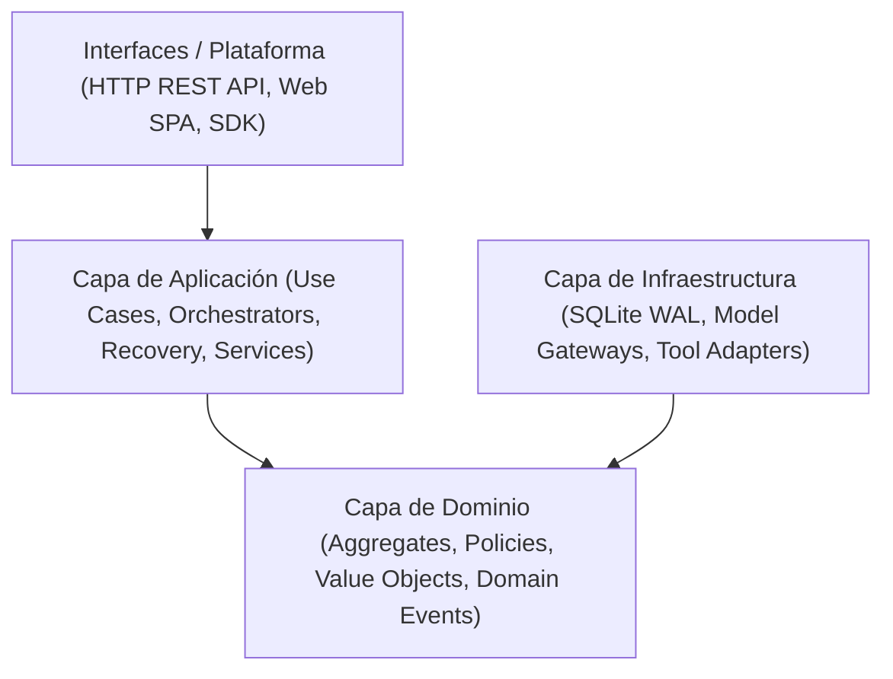
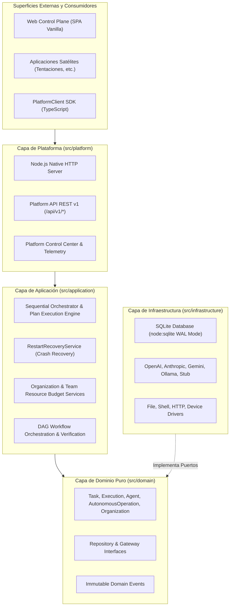

# Especificación de Arquitectura (v1.4.0)

## 1. Principios Arquitectónicos y Dirección de Dependencias

La AI Operating Platform sigue la **Hexagonal Architecture (Ports and Adapters)** y la **Clean Architecture** con reglas estrictas de dependencia hacia adentro.

```mermaid
flowchart TD
    Interfaces["Interfaces / Plataforma (HTTP REST API, Web SPA, SDK)"]
    Application["Capa de Aplicación (Use Cases, Orchestrators, Recovery, Services)"]
    Domain["Capa de Dominio (Aggregates, Policies, Value Objects, Domain Events)"]
    Infrastructure["Capa de Infraestructura (SQLite WAL, Model Gateways, Tool Adapters)"]

    Interfaces --> Application
    Application --> Domain
    Infrastructure --> Domain
```

La flecha hacia adentro hacia el dominio es estricta. La aplicación y la infraestructura dependen de las interfaces y puertos del dominio, nunca al revés.

---

## 2. Límites Estructurales de Capas

```mermaid
flowchart TD
    subgraph ClientLayer["Superficies Externas y Consumidores"]
        WebSPA["Web Control Plane (SPA Vanilla)"]
        SatelliteApps["Aplicaciones Satélites (Tentaciones, etc.)"]
        SDK["PlatformClient SDK (TypeScript)"]
    end

    subgraph PlatformLayer["Capa de Plataforma (src/platform)"]
        HttpServer["Node.js Native HTTP Server"]
        ApiV1["Platform API REST v1 (/api/v1/*)"]
        ControlCenter["Platform Control Center & Telemetry"]
    end

    subgraph AppLayer["Capa de Aplicación (src/application)"]
        Orchestration["Sequential Orchestrator & Plan Execution Engine"]
        Recovery["RestartRecoveryService (Crash Recovery)"]
        VirtualOrg["Organization & Team Resource Budget Services"]
        WorkflowGov["DAG Workflow Orchestration & Verification"]
    end

    subgraph DomainLayer["Capa de Dominio Puro (src/domain)"]
        Aggregates["Task, Execution, Agent, AutonomousOperation, Organization"]
        Ports["Repository & Gateway Interfaces"]
        Events["Immutable Domain Events"]
    end

    subgraph InfraLayer["Capa de Infraestructura (src/infrastructure)"]
        SqliteEngine["SQLite Database (node:sqlite WAL Mode)"]
        ModelGateways["OpenAI, Anthropic, Gemini, Ollama, Stub"]
        ToolAdapters["File, Shell, HTTP, Device Drivers"]
    end

    ClientLayer --> PlatformLayer
    PlatformLayer --> AppLayer
    AppLayer --> DomainLayer
    InfraLayer -.->|Implementa Puertos| DomainLayer
```

---

## 3. Inventario de Dominio y Subsistemas

| Subsistema | Responsabilidad | Límite Arquitectónico |
| :--- | :--- | :--- |
| **Task & Execution System** | Máquinas de estados finitos para `Task` y `Execution` atómica. | Dominio puro; 0 dependencias de infraestructura. |
| **Agent & Capability Registry** | Identidades de agentes de primera clase, listas blancas de herramientas, ámbitos de memoria. | Puertos de dominio; adaptador SQLite WAL con versionado OCC. |
| **Model Gateways** | Contrato uniforme de invocación de modelos a través de OpenAI, Anthropic, Gemini, Ollama y Stub. | Puertos de aplicación puros; adaptadores de red en infraestructura. |
| **Tool Gateway & Runtime** | Despacho de herramientas validado y en sandbox con verificaciones de esquema y guardias de prototype pollution. | Tiempo de ejecución de aplicación; adaptadores locales y de procesos en infraestructura. |
| **Autonomous Operations** | Motor de autonomía limitada (`AutonomousOperation`, `AutonomyBudget`, `PlanExecutionEngine`). | Ejecución de plan de múltiples pasos con límites estrictos de pasos, tiempo y herramientas. |
| **Durable Persistence** | Persistencia relacional SQLite con modo WAL, esquema v3 y transacciones. | Ver `docs/PERSISTENCE_ARCHITECTURE.md`. |
| **Crash Recovery & Reconciliation** | Conciliación automatizada de ejecuciones/tareas huérfanas al inicio. | `RestartRecoveryService` (ver `docs/PERSISTENCE_ARCHITECTURE.md`). |
| **Virtual Organization & Budgets** | Organizaciones, Áreas, Equipos y cuotas de recursos multidimensionales (`TeamResourceBudget`). | Aplicación de cuotas de fallo cerrado y control de concurrencia. |
| **Workflow DAG & Verification** | Orquestación de DAG de flujo de trabajo gobernada con Segregación de Funciones. | Invariante: Productor $\neq$ Verificador $\neq$ Aprobador. |
| **Platform API & Client SDK** | Endpoints REST (`/api/v1/*`) y SDK de TypeScript tipado (`PlatformClient`). | Consumo de cliente desacoplado para aplicaciones satélites. |
| **Web Control Plane** | SPA de interfaz de navegador con soporte bilingüe (`es-419` / `en`) y 0 `innerHTML`. | Sanitización de DOM nativa. |

---

## 4. Flujo del Ciclo de Vida de Ejecución

1. **Envío:** Una tarea o operación autónoma se envía a través de la Platform API o el `PlatformClient`.
2. **Autorización y Gobernanza:** `PolicyGateway` y `TeamResourceBudget` evalúan los permisos y las cuotas restantes con fallo cerrado.
3. **Ejecución y Contexto:** El `CoreRuntime` / `PlanExecutionEngine` crea un `ExecutionContext` inmutable correlacionado por `traceId`, `taskId` y `executionId`.
4. **Invocaciones de Herramientas y Modelos:** Las invocaciones pasan por validadores de esquema, redactores de secretos y contadores de recursos.
5. **Persistencia Duradera y Eventos:** Las actualizaciones de estado del agregado se persisten con comprobaciones de concurrencia optimista (`version = version + 1`). Los eventos inmutables se añaden al `SqliteEventStore`.
6. **Seguridad de Recuperación:** Si un fallo interrumpe el procesamiento, el `RestartRecoveryService` en el próximo arranque transiciona los registros no terminales a `FAILED` / `CANCELLED` con registros de auditoría.

Para detalles físicos de la base de código, consulta [`docs/REPOSITORY_MAP.md`](docs/REPOSITORY_MAP.md) y [`docs/PROJECT_NOMENCLATURE.md`](docs/PROJECT_NOMENCLATURE.md).
