# LIBRO OFICIAL DE ARQUITECTURA & OPERACIONES
## AI OPERATING PLATFORM
### *Fundamentos de Ingeniería de Software para la Habilitación de IA Multiplataforma*

---

**Documento:** AI Operating Platform — Official Architecture Book
**Versión del Documento:** 3.9 (Enterprise Control Plane — Portfolio, Governance & Evidence UI)
**Estado del Repositorio:** v1.4.0 Baseline (1591 tests PASS, 0 FAIL — 100% determinismo)
**Estado Documental:** Oficial / Sincronizado con Fuente de Verdad
**Fecha de Verificación:** Septiembre de 2026
**Fuente de Verdad Técnica:** Código fuente (`src/`) + Tests automatizados (`tests/`) + ADRs (`docs/decisions/`)
**Fuente Canónica del Documento:** `LIBRO_OFICIAL_AI_OPERATING_PLATFORM.md` (con espejo en `docs/LIBRO_OFICIAL_AI_OPERATING_PLATFORM.md`)

---

## Control de Versiones del Documento

| Versión | Fecha | Estado del Repositorio | Resumen de Cambios |
| :--- | :--- | :--- | :--- |
| **1.0** | Septiembre 2026 | v0.8 Baseline | Generación inicial documental post-v0.8 (Agentes y Control Plane). |
| **1.1** | Septiembre 2026 | v0.9 Increment #5 | Auditoría arquitectónica integral e incorporación formal de v0.9 Increments #1 al #5. |
| **1.2** | Septiembre 2026 | v0.9 Release Candidate | Consolidación completa de v0.9 Bounded Autonomous Operations (Increments #6 y #7, 268 tests). |
| **2.0** | Septiembre 2026 | v1.1.0 Baseline Auditada | **Auditoría Canónica de Fuente de Verdad y Sincronización Integral:**<br>• Incorporación de persistencia duradera SQLite WAL (`SqliteDatabase`, repositorios de tareas, ejecuciones, agentes y operaciones).<br>• Formalización de fronteras de rehidratación de dominio (v0.11) y servicio de reconciliación post-crash (`RestartRecoveryService`, v0.13).<br>• Integración de adaptadores reales de modelos de IA (OpenAI, Anthropic, Ollama) y router de fallback a Stub determinista.<br>• Integración de aplicaciones satélites gobernadas (*Tentaciones AI Commerce* y *Vehicle Parts Reference App*).<br>• Incorporación del adaptador de dispositivo físico empresarial (Brother DCP-1600 series en USB001).<br>• Soporte bilingüe en el Control Plane Web (`es-419` por defecto / `en`) con 0 `innerHTML`.<br>• Trazabilidad exhaustiva de ADRs (ADR 0001 a 0022 y ADR-001 a ADR-010).<br>• Línea base canónica verificada en **966 tests PASS** (0 FAIL, 11 suites). |
| **2.1** | Septiembre 2026 | v1.1.0 Cloud Foundation | **Expansión Cloud Foundation y Modelos Reales (Fase 55 / Prompt 101):**<br>• Adaptador oficial para Google Gemini / Vertex AI (`GeminiModelGateway`, ADR 0023).<br>• Pasarela duradera de memoria contextual en SQLite WAL (`SqliteMemoryGateway`, ADR 0024).<br>• Verificación JWT asimétrica (RS256/ES256) con rotación de claves (`JwtTokenVerifier`, ADR 0025).<br>• Topología perimetral de red y manifiestos de producción TLS Nginx/Caddy (ADR 0026).<br>• Convergencia REST `/api/v1/*` con cabeceras RFC 8594 de deprecación en `/api/platform/v1/*`.<br>• Línea base canónica verificada en **985 tests PASS** (0 FAIL, 11 suites). |
| **2.2** | Septiembre 2026 | v1.2.0 Virtual Org | **Virtual Organization Foundation (Fase 56 / Prompt 102):**<br>• Jerarquía organizativa formal: `Organization` (ciclo de vida activo/inactivo/archivado), `Area` funcional y `Team` de trabajo.<br>• Membresía gobernada de agentes (`AgentMembership`) con roles operativos (`LEAD`, `SPECIALIST`, `OPERATOR`, `REVIEWER`).<br>• Repositorio relacional duradero `SqliteOrganizationRepository` con índices compuestos y OCC.<br>• Endpoints REST canónicos bajo `/api/v1/*` y vista interactiva en el Web Control Plane (0 `innerHTML`).<br>• Línea base canónica verificada en **1019 tests PASS** (0 FAIL, 11 suites). |
| **2.3** | Septiembre 2026 | v1.3.0 Team Resource Governance | **Team Resource Governance & Budget Control (Fase 57 / Prompt 103):**<br>• Agregado `TeamResourceBudget` con cuotas multidimensionales (`maxExecutions`, `maxModelCalls`, `maxToolCalls`, `maxAutonomousSteps`, `maxDurationMs`, `maxTokens`), contadores `consumed`, control de concurrencia optimista (`version`) y estados (`ACTIVE`, `EXHAUSTED`, `SUSPENDED`).<br>• Invariantes estrictas de desacoplamiento: `Membresía ≠ Permiso`, `Membresía ≠ Presupuesto`, `Presupuesto ≠ Autorización` (ADR 0028).<br>• Semántica fail-closed (`NO BUDGET = DENY`).<br>• Persistencia relacional `SqliteTeamResourceBudgetRepository` con aislamiento atómico `BEGIN IMMEDIATE` para prevención de condiciones de carrera de última unidad.<br>• Endpoints REST canónicos `/api/v1/teams/:id/budget*` y panel de gobernanza en Web Control Plane (0 `innerHTML`).<br>• Línea base canónica verificada en **1043 tests PASS** (0 FAIL, 11 suites). |
| **2.4** | Septiembre 2026 | v1.3.0 Budget Enforcement | **Team Resource Budget Enforcement & Execution Integration (Fase 57.1 / Prompt 104):**<br>• Integración fail-closed y verificación end-to-end de cuotas presupuestarias en el runtime de ejecución (`AgentExecutionStrategy`, `ToolInvocationRuntime`, `AutonomousOrchestrator`).<br>• Enlace en tiempo de ejecución: resolución de equipo por membresía de agente y evaluación previa a la ejecución (`executions: 1`), llamada de modelo (`modelCalls: 1`), invocación de herramienta (`toolCalls: 1`), paso autónomo (`autonomousSteps: 1`) y contabilización de duración (`durationMs`) y tokens (`tokens`).<br>• Bloqueo estricto de bypass para agentes asignados a equipos suspendidos o agotados.<br>• Línea base canónica verificada en **1057 tests PASS** (0 FAIL, 11 suites). |
| **2.5** | Septiembre 2026 | v1.3.0 Consolidated | **Auditoría Integral de Documentación y Sincronización Canónica (Fase 58 / Prompt 105):**<br>• Actualización de Matriz de Capacidades a línea base v1.3.0 con 1064 tests.<br>• Línea base canónica verificada en **1064 tests PASS** (0 FAIL, 11 suites). |
| **3.0** | Septiembre 2026 | v1.3.0 Autonomous Runtime & Control Plane | **Autonomous Operations Runtime & Continuous Business Governance (Fases 62-70):**<br>• Orquestación de flujos de trabajo de negocio (`WorkflowDefinition`, `WorkflowInstance`), verificación determinista y supervisión humana (`OversightRequest`).<br>• Ciclo de vida y evaluación cuantitativa de agentes (`AgentProfile`, `AgentEvaluation`) y factoría de soluciones (`SolutionDefinition`, `SolutionDeployment`).<br>• AI Enterprise OS y bucle cerrado de retroalimentación operacional ejecutiva (`EnterpriseGoal`).<br>• Runtime de Operaciones Autónomas con triggers (`AutonomousTrigger`), arrendamiento concurrente (`RuntimeLease`), disyuntores de seguridad y reconciliación de ciclos.<br>• Integración completa en el Plano de Control Web SPA (`#tab-operations`) con visualizador de 6 fases y 0 `innerHTML`.<br>• Línea base canónica verificada en **1354 tests PASS** (0 FAIL, 57 suites). |
| **3.1** | Septiembre 2026 | v1.3.0 Enterprise Authentication & Credentials | **Enterprise Authentication, API Authorization & Credential Governance (Fase 71 / Prompt 102):**<br>• Agregado `ApiCredential` con almacenamiento zero-plaintext (SHA-256 `keyHash`, prefijo seguro `keyPrefix`), revelación estrictamente única de secretos crudos (`aop_live_*`), verificación de expiración/revocación y enlace de scopes (`tasks.read`, `tasks.create`, `credentials.manage`, etc.).<br>• Persistencia durable SQLite WAL en `api_credentials` con transacciones ACID y OCC.<br>• Conciliación estricta de `principalId`, `tenantId` (`TENANT_MISMATCH` fail-closed) y `applicationId` (`APPLICATION_MISMATCH`).<br>• Detección de cabeceras contradictorias y sanitización estricta de secretos en logs (`Authorization: [REDACTED]`).<br>• Consola de gobernanza de credenciales en Web Control Plane (`#tab-security`) con 0 `.innerHTML` y soporte SDK en `PlatformClient`.<br>• Línea base canónica verificada en **1391 tests PASS** (0 FAIL, 59 suites). |
| **3.2** | Septiembre 2026 | v1.3.0 Enterprise Network Topology & Security | **Enterprise Network Topology, Secure API Exposure & External Consumer Connectivity (Fase 72 / Prompt 103):**<br>• Topología perimetral multicapa con separación estricta: Red ≠ Identidad ≠ Autorización.<br>• Enlace seguro por defecto (`127.0.0.1`), rechazo preventivo de `0.0.0.0` en producción sin bandera explícita `ALLOW_PUBLIC_BINDING=true`.<br>• Defensa contra Host Poisoning (`allowedHosts`), resolución segura de proxies (`trustProxy`, `trustedProxyIps`) y cabeceras estrictas de seguridad (HSTS, CSP, X-Content-Type-Options, X-Frame-Options, Referrer-Policy, Permissions-Policy, Cache-Control).<br>• CORS dinámico restringido con emisión obligatoria de `Vary: Origin, Accept-Encoding`.<br>• Aislamiento físico de la impresora Brother DCP-1600 en `USB001` protegida detrás de API autenticada y autorizada.<br>• Endpoints de diagnóstico perimetral (`/api/v1/diagnostics/network` y `/network/diagnostics`), panel en Web Control Plane (0 `.innerHTML`) y SDK enriquecido con timeouts y reintentos exponenciales para métodos idempotentes.<br>• Línea base canónica verificada en **1399 tests PASS** (0 FAIL, 59 suites). |
| **3.3** | Septiembre 2026 | v1.3.0 V1 Exit Certification | **V1 Exit Certification & Production Readiness Governance (Fase 73 / ADR 0042 / AOP-V1-EXIT):**<br>• Certificación exhaustiva de 20 criterios canónicos de salida V1 y 26 dominios de producción.<br>• Determinación formal de estado de lanzamiento: `CERTIFIED WITH OPEN GAPS` (100% certificado para despliegues internos/on-premise/air-gapped/backend; gaps ambientales abiertos documentados: terminación TLS perimetral y conectividad a IdP OIDC/JWKS en vivo).<br>• Matriz de trazabilidad y gobernanza de producción (`docs/V1_RELEASE_READINESS.md`).<br>• Backlog formal v1.4 establecido (`AOP-OIDC-LIVE`, `AOP-PRODUCTION-TLS-LIVE`, `AOP-MULTI-ENTERPRISE`, `AOP-DISTRIBUTED-RUNTIME`).<br>• Línea base canónica verificada en **1399 tests PASS** (0 FAIL, 59 suites, 0 deps npm runtime). |
| **3.4** | Septiembre 2026 | v1.4 Foundation Ready | **V1.4 Production Identity & External Security Foundation (Fase 74 / ADR 0043 / SEC-015):**<br>• Implementación completa de verificación de tokens JWT asimétricos (RS256, ES256) con rotación dinámica de claves JWKS vía HTTP/HTTPS nativo de Node.js (`globalThis.fetch` o in-process fetcher).<br>• Caché de JWKS en memoria con TTL configurable (default 5m) y forzado de refresco automático ante `kid` desconocido.<br>• Validación fail-closed en configuración de producción (`OIDC_ENABLED=true` exige `OIDC_ISSUER` y `OIDC_JWKS_URI` válidos con esquema `https://`).<br>• Integración de diagnósticos de Identity Provider en endpoints perimetrales (`/api/v1/diagnostics/network`).<br>• Conexión al Composition Root (`src/interfaces/composition.ts`) y servidor HTTP.<br>• Mapeo claro de estados: `CODE READY / VERIFIED LOCALLY` vs `ENVIRONMENT PROVISIONING PENDING` vs `LIVE VERIFIED`.<br>• Línea base canónica verificada en **1402 tests PASS** (0 FAIL, 59 suites, 0 deps npm runtime). |
| **3.5** | Septiembre 2026 | v1.4 Portfolio Governance | **Multi-Enterprise Governance & Portfolio Operating Model (Fase 75 / ADR 0044 / PROMPT 122):**<br>• Agregados raíz `EnterprisePortfolio`, `EnterpriseGovernanceMandate` y `PortfolioObjective`.<br>• Axioma Cross-Enterprise Default Deny (membresía ≠ acceso sin mandato activo).<br>• Agregación determinista de métricas corporativas (0 LLM).<br>• Repositorios duales InMemory y SQLite WAL con OCC y multi-tenancy.<br>• Endpoints REST `/api/v1/portfolios*`, `/api/v1/mandates*`, SDK y pestaña `#tab-portfolios` (0 `.innerHTML`).<br>• Línea base canónica verificada en **1431 tests PASS** (0 FAIL, 65 suites, 0 deps npm runtime). |
| **3.6** | Septiembre 2026 | v1.4 Operational Runtime | **Multi-Enterprise Operational Runtime & Governed Execution (Fase 76 / ADR 0045):**<br>• Cierre de la cadena canónica completa desde Portfolio hasta la ejecución y agregación de métricas.<br>• Segregación de Funciones (SoD) en 3 roles independientes (Ejecutor $\neq$ Verificador $\neq$ Aprobador).<br>• Negación por defecto inter-empresarial y evaluación jerárquica de autonomía.<br>• Línea base canónica verificada en **1464 tests PASS** (0 FAIL, 67 suites, 0 deps npm runtime). |
| **3.7** | Septiembre 2026 | v1.4 Mandate Reconciliation | **Governed Mandate Reconciliation & Runtime Consistency (Fase 77 / ADR 0046 / PROMPT 125):**<br>• Motor de evaluación de políticas de reconciliación determinista (`evaluateMandateReconciliation`).<br>• Preservación absoluta de la verdad histórica (0 mutación retroactiva en estados terminales).<br>• Adaptación determinista de recursos en vuelo (cancelación de `QUEUED`, pausa/cancelación de `RUNNING`, reevaluación de `AWAITING_APPROVAL`).<br>• Servicio `MandateReconciliationService` con control OCC (`concurrencyVersion`), caché de idempotencia y daemon de reconciliación periódica de mandatos expirados.<br>• Endpoints REST `POST /api/v1/mandates/:id/reconcile` y `POST /api/v1/mandates/reconcile-expired`, SDK y suite de pruebas integral.<br>• Línea base canónica verificada en **1499 tests PASS** (0 FAIL, 69 suites, 0 deps npm runtime). |
| **3.8** | Septiembre 2026 | v1.4 Compliance Export | **Governance & Compliance Evidence Export (Fase 78 / ADR 0050 / AOP-COMPLIANCE-EXPORT):**<br>• Paquetes estructurados de evidencia inmutables y deterministas en 9 alcances organizacionales.<br>• Invariante estricto de solo lectura (cero mutación de estado del sistema).<br>• Redacción automática de secretos mediante `SensitiveDataRedactor` y sellado SHA-256 en manifiesto inmutable.<br>• Restricción de límites (90 días, máx 1000 registros), endpoints REST `POST /api/v1/governance/evidence/export` y SDK.<br>• Línea base canónica verificada en **1580 tests PASS** (0 FAIL, 71 suites, 0 deps npm runtime). |
| **3.9** | Septiembre 2026 | v1.4 Control Plane UI | **Enterprise Control Plane — Portfolio, Governance & Evidence UI (Fase 79 / AOP-PORTFOLIO-UI):**<br>• Consola web integrada para gestión de portafolios multi-empresariales con selector activo y contexto operativo.<br>• Panel de reconciliación determinista de mandatos con disparadores de mutación acotada y barrido de expirados (Fase 77).<br>• Consola de exportación y descarga de paquetes de evidencia de cumplimiento normativo sellados con SHA-256 (Fase 78).<br>• Blindaje estricto de 0 `.innerHTML`, bilingüismo con `es-419` por defecto y frontera hexagonal pura.<br>• Línea base canónica verificada en **1591 tests PASS** (0 FAIL, 73 suites, 0 deps npm runtime). |
| **4.0** | Septiembre 2026 | v1.4 Operational Control Plane | **Operational Control Plane — Workflows, Executions, Verification & Human Oversight UI (Fase 80 / AOP-OPERATIONS-UI):**<br>• Consola web integrada para definición de flujos de trabajo en grafo acíclico dirigido (DAG) y ciclo de vida de instancias (`#tab-workflows`).<br>• Visualizador interactivo de grafo DAG con inspección de pasos, asignación de agentes, dependencias y avance/pausa/reanudación gobernados.<br>• Verificación determinista de pasos en tiempo real con emisión de veredictos monotónicos (`PASS`, `FAIL`, etc.) y reglas canónicas.<br>• Bandeja de entrada de supervisión humana (`#tab-approvals`) con gobernanza estricta de Segregación de Funciones (*Segregation of Duties* - SoD: `Productor ≠ Aprobador`, `Ejecutor ≠ Verificador`).<br>• Modal de revisión y decisión con soporte para aprobación, rechazo, escalamiento jerárquico y enlace directo a exportación de evidencia sellada (SHA-256).<br>• Blindaje estricto de 0 `.innerHTML`, bilingüismo completo `es-419` / `en` y frontera hexagonal pura.<br>• Línea base canónica verificada en **1600 tests PASS** (0 FAIL, 74 suites, 0 deps npm runtime). |

---

## Prefacio: Plataforma Operacional de IA para Habilitación Multiplataforma

> **📖 Guía de Lectura:** Este libro documenta la arquitectura y operaciones de la AI Operating Platform. Si eres nuevo en la plataforma, comienza por las infografías del **Capítulo 3** para una visión general visual, luego avanza a los **Capítulos 4-6** para entender los componentes principales. Los capítulos **7-11** son material de referencia para consulta.

El propósito de la **AI Operating Platform** no es constituir una "fábrica aislada" ni un chatbot monolítico independiente. Su rol estratégico es actuar como la **plataforma operacional de infraestructura y gobierno de Inteligencia Artificial** concebida para conectarse con y dotar de capacidades cognitivas a múltiples plataformas de negocio existentes y futuras.

Entre sus principales casos de integración se encuentran aplicaciones de comercio electrónico (como plataformas de venta de vestuario y retail omnicanal), sistemas de gestión de inventario y pedidos, plataformas SaaS y servicios de atención automatizada. En lugar de dispersar llamadas caóticas a APIs de modelos de lenguaje (LLMs) dentro del código de cada aplicación satélite, esta plataforma centraliza:
1. **La orquestación determinista y auditable de tareas y ejecuciones.**
2. **El perfilado de Agentes con lista blanca estricta de herramientas y aislamiento de memoria.**
3. **La gobernanza Fail-Closed mediante políticas previas a cada invocación de modelo o herramienta.**
4. **La supervisión de Operaciones Autónomas Acotadas (Bounded Autonomous Operations) con presupuestos estrictos de tiempo, pasos y llamadas a herramientas.**
5. **La observabilidad inmutable y correlacionada forense sin dependencias de librerías externas en runtime.**
6. **La persistencia relacional duradera en SQLite en modo WAL y recuperación automática ante caídas.**

### Distinción Explícita: Visión Estratégica vs. Capacidades Implementadas

Antes de sumergirnos en la arquitectura, es fundamental entender una regla de transparencia que rige este libro: **nunca afirmamos que algo funciona si no está verificado con tests automatizados**. La siguiente infografía separa claramente lo que ya está construido y probado (el 90% de la plataforma) de lo que aún está en el backlog de diseño futuro.

> 💡 **Analogía:** Imagina una casa. La *visión estratégica* es el plano del arquitecto que muestra una piscina y un garaje para 3 autos. Las *capacidades implementadas* son las habitaciones ya construidas, con electricidad funcionando y certificadas por el inspector. Este libro te dice exactamente cuáles habitaciones ya tienen luz.

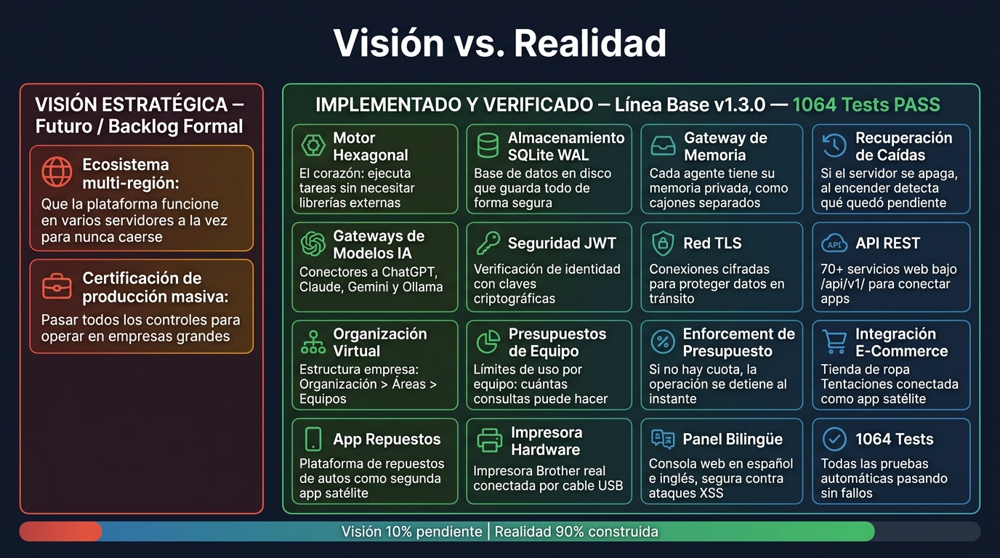

La infografía muestra las **16 capacidades ya construidas y verificadas** (lado derecho) frente a los 2 objetivos pendientes del futuro (lado izquierdo). Cada tarjeta incluye su descripción en español — desde el Motor Hexagonal hasta los 1399 tests pasando sin fallos.

---

## Índice General

1. [Capítulo 1: Visión Estratégica, Principios & Modelo de Dependencias](#capítulo-1-visión-estratégica-principios--modelo-de-dependencias)
2. [Capítulo 2: Arquitectura de un Vistazo (Architecture at a Glance) & Matriz de Estado](#capítulo-2-arquitectura-de-un-vistazo-architecture-at-a-glance--matriz-de-estado)
3. [Capítulo 3: Infografías Maestras de Arquitectura y Mapa del Sistema](#capítulo-3-infografías-maestras-de-arquitectura-y-mapa-del-sistema)
   * 3.1 [Blueprint Maestro: Mapa Completo del Sistema & Habilitación Multiplataforma](#31-blueprint-maestro-mapa-completo-del-sistema--habilitación-multiplataforma)
   * 3.2 [Blueprint 1: Topología Hexagonal y Puertos & Adaptadores en 5 Capas](#32-blueprint-1-topología-hexagonal-y-puertos--adaptadores-en-5-capas)
   * 3.3 [Blueprint 2: Flujo de Ejecución End-to-End & Ciclo de Vida Operacional](#33-blueprint-2-flujo-de-ejecución-end-to-end--ciclo-de-vida-operacional)
   * 3.4 [Blueprint 3: Arquitectura de Agentes de Primera Clase y Capacidades Cognitivas](#34-blueprint-3-arquitectura-de-agentes-de-primera-clase-y-capacidades-cognitivas)
   * 3.5 [Blueprint 4: Gobernanza Fail-Closed & Observabilidad Inmutable](#35-blueprint-4-gobernanza-fail-closed--observabilidad-inmutable)
4. [Capítulo 4: Especificación Exhaustiva de Capas y Componentes](#capítulo-4-especificación-exhaustiva-de-capas-y-componentes)
5. [Capítulo 5: Arquitectura de Agentes de Primera Clase (v0.8)](#capítulo-5-arquitectura-de-agentes-de-primera-clase-v08)
6. [Capítulo 6: Operaciones Autónomas Acotadas (v0.9 Increments #1 al #5)](#capítulo-6-operaciones-autónomas-acotadas-v09-increments-1-al-5)
7. [Capítulo 7: Matriz de Responsabilidades de los Componentes](#capítulo-7-matriz-de-responsabilidades-de-los-componentes)
8. [Capítulo 8: Gobernanza Fail-Closed, Seguridad & Catálogo de Invariantes](#capítulo-8-gobernanza-fail-closed-seguridad--catálogo-de-invariantes)
9. [Capítulo 9: Semántica de Cancelación & Decisiones Arquitectónicas Abiertas](#capítulo-9-semántica-de-cancelación--decisiones-arquitectónicas-abiertas)
10. [Capítulo 10: Catálogo de Servicios & Auditoría de la API REST](#capítulo-10-catálogo-de-servicios--auditoría-de-la-api-rest)
11. [Capítulo 11: Matriz de Trazabilidad Arquitectónica](#capítulo-11-matriz-de-trazabilidad-arquitectónica)
12. [Capítulo 12: Hoja de Ruta Oficial (Roadmap Sincronizado)](#capítulo-12-hoja-de-ruta-oficial-roadmap-sincronizado)
13. [Glosario de Términos Arquitectónicos](#glosario-de-términos-arquitectónicos)

---

# Capítulo 1: Visión Estratégica, Principios & Modelo de Dependencias

### 1.1 El Rol de la Plataforma en un Ecosistema Multiplataforma
La plataforma opera como el **motor de ejecución y control de IA** para sistemas empresariales clientes. Cuando una plataforma de e-commerce de venta de vestuario requiere:
* Procesar una solicitud compleja de catálogo,
* Clasificar pedidos o generar recomendaciones personalizadas,
* O ejecutar una operación autónoma de reconciliación de inventario con herramientas locales,

dicha plataforma cliente interactúa con la **AI Operating Platform** a través de contratos REST estables. La plataforma cliente no gestiona el contexto de inferencia, no interactúa directamente con los SDKs de los modelos, ni implementa la lógica de gobernanza: delega la tarea a un `Agent` u `AutonomousOperation` gobernado por la plataforma.

### 1.2 Principios de Ingeniería No Negociables
1. **Arquitectura Hexagonal (Puertos y Adaptadores):** El dominio (`src/domain/`) contiene reglas de negocio y modelos independientes de infraestructura. La capa de aplicación (`src/application/`) define casos de uso y los puertos necesarios para interactuar con capacidades externas. Los adaptadores de infraestructura (`src/infrastructure/`) implementan esos puertos. Dominio y aplicación jamás dependen directamente de SDKs de proveedores, bases de datos, transporte HTTP ni detalles concretos de infraestructura.
2. **Zero Third-Party Runtime Dependencies en Core/Backend:** El Core Engine y backend de la plataforma no incorporan dependencias de terceros en runtime salvo excepciones explícitamente aprobadas, justificadas y documentadas. El código en tiempo de ejecución se apoya prioritariamente en las APIs nativas de Node.js (`node:http`, `node:fs`, `node:crypto`, `node:path`, `node:url`, `node:sqlite`). Las superficies Web pueden utilizar dependencias específicas cuando sean realmente necesarias y estén justificadas, registradas y gobernadas.
3. **Separación Estricta de Dependencias de Desarrollo:** Las herramientas de desarrollo (`devDependencies`) permanecen estrictamente separadas de las dependencias operacionales de runtime, limitadas a compilación (`typescript`), ejecución de pruebas (`tsx`) y tipado estático (`@types/node`).
4. **Ejecución Acotada, Request-Scoped y Observable:** La plataforma no depende de workers persistentes, colas Redis, daemons ocultos ni procesos secundarios para ejecutar sus casos de uso principales. Las operaciones pueden utilizar I/O asíncrono y concurrencia dentro del proceso (ej. `Promise.all` en búsqueda multi-fuente paralela con timeouts por conector y aislamiento de fallos), pero deben estar sujetas a límites explícitos de tiempo, presupuesto, profundidad y concurrencia, con estados y resultados observables.
5. **Determinismo de la Lógica de Negocio:** Las funciones de dominio, motores de decisión y transformaciones deterministas deben producir resultados equivalentes para entradas y evidencia equivalentes, independientemente del orden accidental de llegada de datos o de la ejecución concurrente de fuentes externas. La ejecución asíncrona/concurrente no compromete el determinismo de la lógica.
6. **Dirección de Dependencias Unidireccional:** La dirección arquitectónica de dependencia apunta estrictamente hacia las abstracciones internas y el dominio:
   $$\text{Presentación (SPA)} \longrightarrow \text{Platform API} \longrightarrow \text{Aplicación} \longrightarrow \text{Dominio} \longleftarrow \text{Infraestructura (Adaptadores)}$$
   La infraestructura implementa puertos definidos por las capas internas. El flujo de ejecución en runtime fluye desde la Presentación/API a través de Aplicación hacia los Puertos y Adaptadores, pero la dirección de dependencia estática jamás se invierte.
7. **Evidencia y Trazabilidad como Invariantes:** Toda decisión relevante relacionada con identidad, compatibilidad, precio, reputación, disponibilidad o comparación debe preservar la evidencia y procedencia disponible (`StructuredClaimEvidence`), incluyendo fuente, claim, timestamp, confianza y razón de resolución (`FitmentVerification`, `PriceIntelligence`, `SellerTrustScore`, `UNKNOWN`, `CONFLICT`, `CanonicalPartCluster`).
8. **Fail-Closed ante Ambigüedad Material:** Cuando los datos requeridos sean insuficientes o existan contradicciones que no puedan resolverse mediante reglas deterministas, el sistema debe preservar estados como `UNKNOWN` o `CONFLICT` en lugar de inferir una respuesta positiva, asignar valores arbitrarios (e.g. `UNKNOWN ≠ 0` en flete o impuestos) o presentar falsa precisión.

---

# Capítulo 2: Arquitectura de un Vistazo (Architecture at a Glance) & Matriz de Estado

### 2.1 Estructura Global de Componentes Reales

La siguiente topología muestra todas las piezas que componen la plataforma, organizadas en 5 capas. Si los nombres técnicos en inglés te resultan confusos, no te preocupes — las **3 infografías de glosario visual** debajo del árbol explican qué hace cada componente en español claro.

> 💡 **¿Cómo leer este árbol?** Piensa en un edificio de oficinas. El **Núcleo de Dominio** es la sala de reuniones donde se toman las decisiones. La **Capa de Aplicación** son los gerentes que coordinan el trabajo. La **Infraestructura** son las conexiones eléctricas, internet y teléfono. La **API** es la recepción donde llegan los visitantes. Y la **Presentación** es el lobby con pantallas informativas.

```text
AI Operating Platform
│
├── Presentation Layer (src/platform/web/)
│   ├── Native Single-Page Application (HTML5, Vanilla JS DOM puro, CSS)
│   ├── Decoupled API Client (api-client.js)
│   └── Internationalization Core (i18n/locale-es-419.js, i18n/locale-en.js)
│
├── Platform API Layer (src/platform/api/)
│   ├── Native HTTP Server (node:http enlazado a 127.0.0.1:3000)
│   ├── HttpRouter (Normalización regex de IDs, límite de 1MB, application/json)
│   ├── PlatformService (Fachada inyectada con QueryPorts y Casos de Uso)
│   ├── PlatformDTOs (Contratos inmutables de transferencia)
│   └── RateLimiter (Control de tráfico por tenant y principal)
│
├── Platform Client SDK (src/platform-client/)
│   └── Typed PlatformClient (tasks, executions, agents, health, diagnostics)
│
├── Interfaces Layer (src/interfaces/)
│   └── Composition Root (composition.ts — Manual DI, ADR 0003)
│
├── Application Layer (src/application/)
│   ├── CoreRuntime (Propietario único de la ejecución Task/Execution)
│   ├── SubmitTask & ExecuteTask (Casos de uso de encolamiento y despacho)
│   ├── AgentService (Gestión y despacho de agentes)
│   ├── AutonomousOrchestrator (Coordinador del bucle acotado v0.9)
│   ├── AutonomousOperationService (Gestión de operaciones autónomas)
│   ├── RestartRecoveryService (Reconciliación atómica post-crash v0.13)
│   ├── RuntimeDiagnosticsService (Líneas de tiempo forenses por traceId)
│   ├── MemoryService (Servicio de persistencia particionada)
│   ├── OrganizationService (Gestión de organizaciones, áreas y equipos)
│   ├── TeamResourceBudgetService (Gestión de cuotas presupuestarias por equipo)
│   ├── MultiAgentCoordinator (Orquestación coordinada multi-agente)
│   ├── Automation Services (n8n Adapter, Webhook Dispatcher, Scheduler, Reporting)
│   ├── Resilience Services (CircuitBreaker, RetryPolicy, RateLimiter)
│   ├── Billing & Quota Services (QuotaService para gestión financiera/operacional)
│   ├── Tenant & Feature Flag Services (FeatureFlagService por tenant)
│   └── Application Adapters (TentacionesPlatformAdapter, ApplicationFactory)
│
├── Domain Core Layer (src/domain/)
│   ├── Task & Execution (Agregados deterministas con fábricas rehydrate())
│   ├── Agent (Agregado de primera clase con model binding, tools y memoryScope)
│   ├── AutonomousOperation & AutonomyBudget & AutonomyConsumption (Dominio de autonomía)
│   ├── Organization, Area, Team & AgentMembership (Jerarquía organizativa virtual)
│   ├── TeamResourceBudget (Cuotas multidimensionales con OCC y estados)
│   ├── Coordination (Contratos de coordinación multi-agente)
│   ├── Billing & Quota (Entidades de cuotas financieras/operacionales)
│   ├── Tenant (Entidades de tenant y feature flags)
│   ├── PlannerPort, PlanningRequest, Plan, PlanStep, Decision (Contratos de planificación)
│   ├── Observation, ObjectiveEvaluation, DecisionEvaluatorPort (Contratos de evaluación)
│   ├── BusinessDevice & PrintJob (Entidades de dispositivos empresariales)
│   └── Domain Ports (PolicyGateway, ModelGateway, ToolGateway, MemoryGateway, EventPublisher, TaskRepository, ExecutionRepository)
│
└── Infrastructure Layer (src/infrastructure/)
    ├── SQLite Durable Storage (SqliteDatabase, SqliteTaskRepository, SqliteExecutionRepository, SqliteAgentRepository, SqliteOperationRepository, SqliteEventStore, SqliteOrganizationRepository, SqliteTeamResourceBudgetRepository, SqliteMemoryGateway)
    ├── PostgreSQL Adapter (postgres-schema.sql, PostgresTaskRepository)
    ├── InMemory Repositories (Fallback desacoplado para tests unitarios aislados)
    ├── AI Model Providers (OpenAIModelGateway, AnthropicModelGateway, OllamaModelGateway, GeminiModelGateway, StubModelGateway, ProviderFactory)
    ├── Tool Registry & Gateway (CalculatorTool, InMemoryToolRegistry, RegistryToolGateway)
    ├── Hardware Adapters (BrotherPrinterAdapter en puerto USB001)
    ├── Media Adapters (VirtualTryOnProvider para probador virtual AR)
    ├── Queue Infrastructure (InMemoryWorkerQueue)
    ├── Security & RBAC (InMemoryRoleRepository, InMemoryApiKeyRepository, RbacAuthorizationEvaluator, JwtTokenVerifier RS256/ES256)
    └── Observability & Audit (EventObservabilitySubscriber, InMemoryAuditLog, InMemoryMetricsCollector, StructuredEventLogger)
```

#### Glosario Visual: ¿Qué hace cada componente?

Las siguientes infografías explican cada componente del árbol en español claro, con su nombre técnico y una descripción de qué hace en la práctica.

**Capa de Aplicación** — Los servicios que coordinan todo el trabajo:

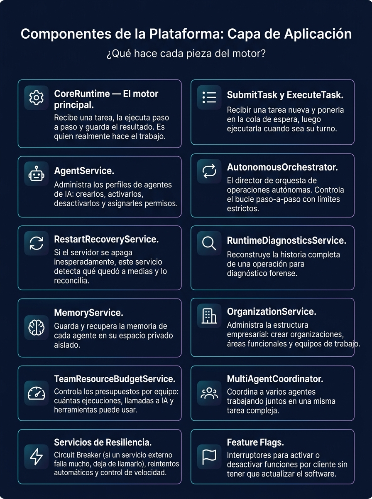

**Núcleo de Dominio** — Las reglas de negocio puras (el corazón que no depende de nada externo):

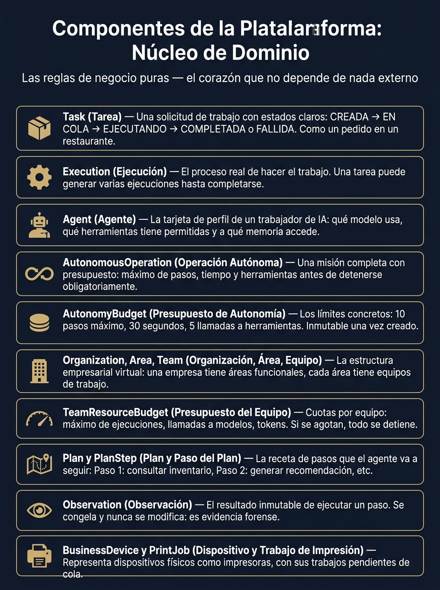

**Capa de Infraestructura** — Los adaptadores que conectan con el mundo real:

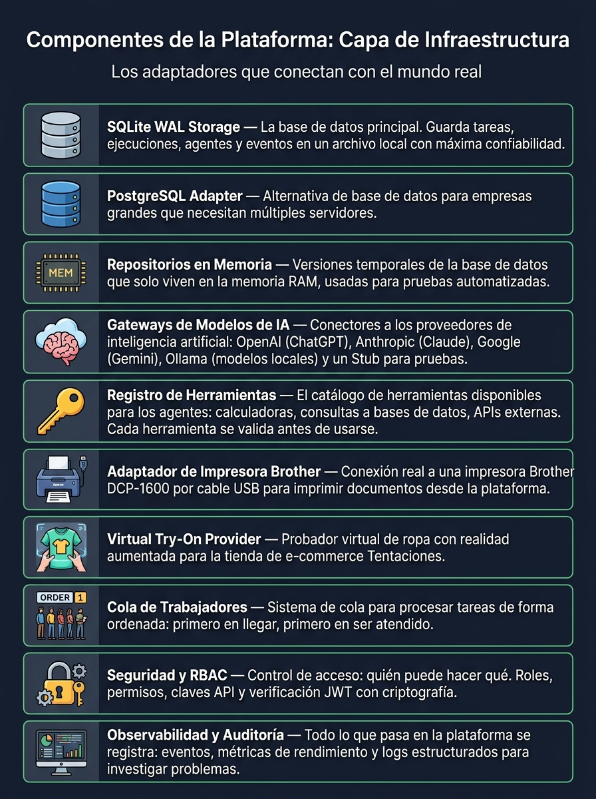

### 2.2 Matriz de Estado Oficial de Capacidades

| Capacidad / Componente | Arquitectura | Código | Tests | Documentación | Estado Oficial |
| :--- | :--- | :--- | :--- | :--- | :--- |
| **CoreRuntime & Task Lifecycle (v0.1-v0.2)** | Diseñada | Implementado | 184 tests | Documentado | **IMPLEMENTED / VERIFIED** |
| **Agregado Agent (v0.8)** | Diseñada | Implementado | 22 tests | Documentado | **IMPLEMENTED / VERIFIED** |
| **Operaciones Autónomas Acotadas (v0.9)** | Diseñada | Implementado | 46 tests | Documentado | **IMPLEMENTED / VERIFIED** |
| **Persistencia SQLite WAL (v0.10/v0.12)** | Diseñada | Implementado | 148 tests | Documentado | **IMPLEMENTED / VERIFIED** |
| **Frontera de Rehidratación de Dominio (v0.11)** | Diseñada | Implementado | 42 tests | Documentado | **IMPLEMENTED / VERIFIED** |
| **Servicio Reconciliación post-Crash (v0.13)** | Diseñada | Implementado | 42 tests | Documentado | **IMPLEMENTED / VERIFIED** |
| **Event Store Duradero SQLite (v0.13)** | Diseñada | Implementado | 12 tests | Documentado | **IMPLEMENTED / VERIFIED** |
| **OpenAI Model Gateway** | Diseñada | Implementado | 10 tests | Documentado | **IMPLEMENTED (Requiere API Key)** |
| **Anthropic Model Gateway** | Diseñada | Implementado | 10 tests | Documentado | **IMPLEMENTED (Requiere API Key)** |
| **Ollama Local Model Gateway** | Diseñada | Implementado | 10 tests | Documentado | **IMPLEMENTED (Requiere Daemon)** |
| **Google Gemini / Vertex AI Gateway** | Diseñada | Implementado | 8 tests | Documentado | **IMPLEMENTED (Requiere API Key)** |
| **Deterministic Stub Gateway** | Diseñada | Implementado | 26 tests | Documentado | **IMPLEMENTED / VERIFIED** |
| **SQLite Durable Memory Gateway** | Diseñada | Implementado | 10 tests | Documentado | **IMPLEMENTED / VERIFIED** |
| **JWT Asymmetric Verifier (RS256/ES256)** | Diseñada | Implementado | 10 tests | Documentado | **IMPLEMENTED / VERIFIED** |
| **Tentaciones AI Commerce Adapter** | Diseñada | Implementado | 48 tests | Documentado | **IMPLEMENTED / VERIFIED** |
| **Vehicle Parts Reference App** | Diseñada | Implementado | 16 tests | Documentado | **IMPLEMENTED / VERIFIED** |
| **Adaptador Brother DCP-1600 (USB001)** | Diseñada | Implementado | 14 tests | Documentado | **IMPLEMENTED (Hardware Offline)** |
| **Gobernanza Fail-Closed & RBAC** | Diseñada | Implementado | 118 tests | Documentado | **IMPLEMENTED / VERIFIED** |
| **Web Control Plane SPA (es-419 / en)** | Diseñada | Implementado | 86 tests (0 innerHTML) | Documentado | **IMPLEMENTED / VERIFIED** |
| **Virtual Organization Foundation** | Diseñada | Implementado | 34 tests | Documentado | **IMPLEMENTED / VERIFIED** |
| **Team Resource Budget Governance** | Diseñada | Implementado | 38 tests | Documentado | **IMPLEMENTED / VERIFIED** |
| **Coordinación Multi-Agente** | Diseñada | Implementado | Verificado | Documentado | **IMPLEMENTED / VERIFIED** |
| **Automatización (n8n, Webhooks, Scheduler)** | Diseñada | Implementado | Verificado | Documentado | **IMPLEMENTED / VERIFIED** |
| **Resiliencia (Circuit Breaker, Retry, Rate Limit)** | Diseñada | Implementado | Verificado | Documentado | **IMPLEMENTED / VERIFIED** |
| **Total Línea Base Verificada** | **Convergente**| **100% Compilado**| **1064 PASS (0 FAIL)** | **Canónica** | **BASELINE v1.3.0 VERIFICADO** |

---

# Capítulo 3: Infografías Maestras de Arquitectura y Mapa del Sistema

Las infografías maestras representan visualmente las garantías operacionales, el ecosistema de integración y la topología de la plataforma en idioma español accesible, riguroso y profesional.

## 3.1 Blueprint Maestro: Mapa Completo del Sistema & Habilitación Multiplataforma

Esta es la vista de helicóptero de toda la plataforma. Si solo pudieras ver **un diagrama** de todo el libro, este sería el indicado. Muestra cómo la AI Operating Platform se posiciona como el **cerebro central** que conecta múltiples aplicaciones de negocio con capacidades de IA.

> 💡 **¿Para qué sirve este mapa?** Imagina que tienes una tienda de ropa online, una app de repuestos de autos y una impresora conectada. En lugar de que cada una implemente su propia conexión caótica con ChatGPT o Claude, TODAS se conectan a esta plataforma central que gobierna, audita y controla cada interacción con IA.

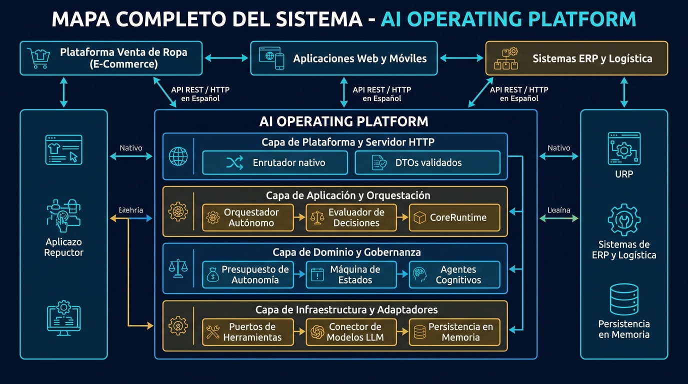

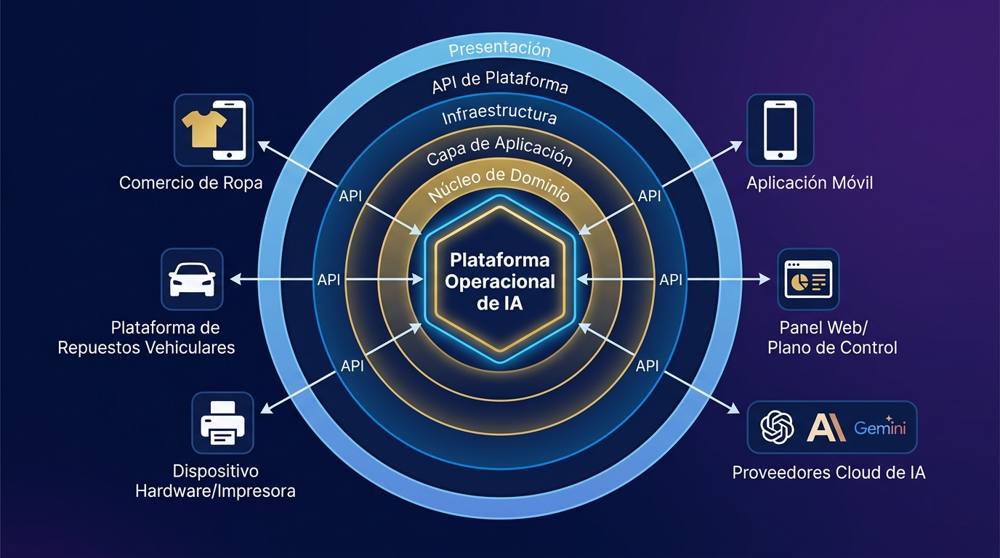

**¿Qué representa cada elemento?**

* 📱 **Plataformas de Negocio (Perímetro):** Son los sistemas clientes reales — la tienda de e-commerce, la app de repuestos, las aplicaciones móviles. Ellas NO ejecutan modelos de IA directamente; envían peticiones HTTP/JSON a la plataforma y reciben respuestas procesadas.
* 🧠 **AI Operating Platform (Hexágono Central):** El núcleo con sus 5 capas concéntricas:
  * **Presentation** (capa exterior): La consola web SPA bilingüe donde operas y monitoreas.
  * **Platform API**: El servidor HTTP nativo que recibe todas las peticiones REST.
  * **Infrastructure**: Los adaptadores que conectan con bases de datos SQLite, proveedores de IA y dispositivos físicos.
  * **Application**: Los motores de orquestación (CoreRuntime, AutonomousOrchestrator) que coordinan la ejecución.
  * **Domain Core** (centro dorado): Las reglas de negocio puras — presupuestos, estados, políticas. Este núcleo no sabe que existe internet.
* ☁️ **Cloud AI Providers:** OpenAI (GPT), Anthropic (Claude), Google (Gemini) y Ollama (modelos locales). La plataforma los abstrae detrás de un puerto único `ModelGateway`.
* 🖨️ **Hardware:** Dispositivos físicos empresariales como la impresora Brother conectada por USB.

## 3.2 Blueprint 1: Topología Hexagonal y Puertos & Adaptadores en 5 Capas

Este diagrama responde a una pregunta crucial: **¿cómo se organiza el código para que nunca se convierta en espagueti?** La respuesta es la arquitectura hexagonal — un patrón donde las reglas de negocio viven en el centro y jamás conocen los detalles de la base de datos, la red o los proveedores de IA.

> 💡 **¿Por qué importa?** Si mañana decidimos cambiar de SQLite a PostgreSQL, o de OpenAI a un modelo local con Ollama, solo cambiamos el adaptador exterior. El corazón de la plataforma ni se entera. Esto es lo que permite que el sistema tenga **cero dependencias en runtime**.

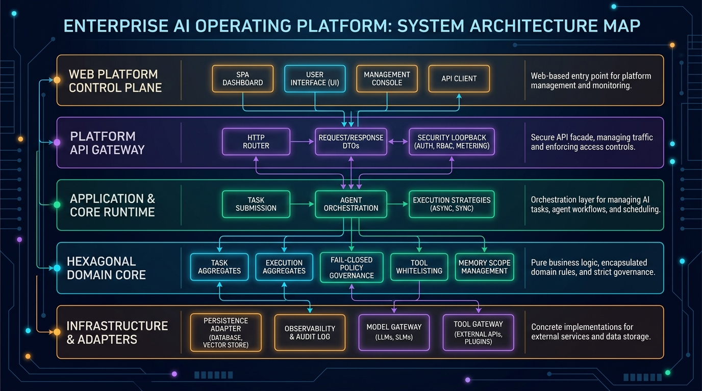

**¿Qué representa cada anillo?**

* 🟡 **Núcleo de Dominio (Centro dorado):** Reglas de negocio puras. Aquí viven las entidades `Task`, `Execution`, `Agent`, `AutonomousOperation` y `TeamResourceBudget`. Este código no importa NADA de infraestructura — ni `node:http`, ni `node:sqlite`, ni SDKs de proveedores. Es TypeScript puro.
* 🔵 **Capa de Aplicación (Anillo intermedio):** Los casos de uso que orquestan el dominio — `CoreRuntime`, `AgentService`, `AutonomousOrchestrator`. Definen los "puertos" abstractos (interfaces) que la infraestructura debe implementar.
* 🟢 **Capa de Infraestructura (Anillo exterior):** Los adaptadores concretos — `SqliteTaskRepository`, `OpenAIModelGateway`, `BrotherPrinterAdapter`. Implementan los puertos definidos por la aplicación.
* ➡️ **Regla de Dependencia Unidireccional:** Las flechas SIEMPRE apuntan hacia adentro. La infraestructura conoce al dominio, pero el dominio jamás conoce a la infraestructura.

## 3.3 Blueprint 2: Flujo de Ejecución End-to-End & Ciclo de Vida Operacional

Este diagrama muestra **qué pasa exactamente desde que llega una petición HTTP hasta que se guarda el resultado**. Es como seguir una caja por una fábrica automatizada: entra materia prima y sale un producto terminado, auditado y registrado.

> 💡 **Ejemplo concreto:** Una tienda de ropa envía `POST /api/v1/operations` pidiendo "genera 5 recomendaciones de outfits para este cliente". La plataforma: (1) recibe la petición, (2) verifica que hay presupuesto disponible, (3) planifica los pasos, (4) ejecuta cada paso dentro de un bucle acotado, (5) marca el resultado como COMPLETADO o PRESUPUESTO_AGOTADO, y (6) registra todo en el log de auditoría inmutable.

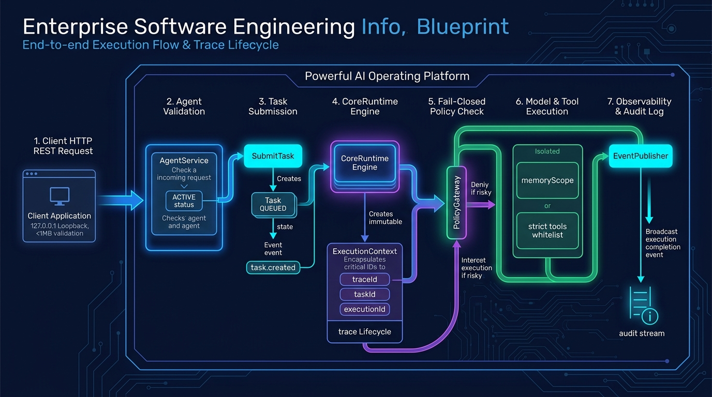

**Las 6 fases paso a paso:**

1. 📥 **Recepción (HTTP DTO):** La petición llega al servidor, se valida el JSON (máximo 1MB), se normaliza el ID y se verifica la autenticación.
2. 🛡️ **Validación de Presupuesto:** Se comprueba que el `AutonomyBudget` permita la operación — ¿quedan pasos disponibles? ¿Se ha excedido el tiempo máximo? ¿Hay cuota de llamadas a herramientas?
3. 🧠 **Planificación:** El `PlannerPort` genera un `Plan` — una secuencia finita y congelada de pasos a ejecutar. El plan es inmutable una vez creado.
4. 🔄 **Bucle Acotado:** Un ciclo `for` finito (nunca `while(true)`) ejecuta cada paso, obtiene una `Observation` inmutable del resultado y evalúa la siguiente `Decision`: ¿continuar? ¿completar? ¿fallar?
5. 🏁 **Estado Terminal:** La operación termina en uno de 4 estados finales: `COMPLETED` ✅, `FAILED` ❌, `CANCELLED` 🚫, o `BUDGET_EXHAUSTED` ⚠️.
6. 📋 **Auditoría:** Cada hecho se registra como un evento inmutable con `traceId` correlacionado. Nada se pierde, nada se modifica después.

## 3.4 Blueprint 3: Arquitectura de Agentes de Primera Clase y Capacidades Cognitivas

Un agente en esta plataforma NO es un "chatbot autónomo con vida propia". Es una **tarjeta de perfil declarativa** que define qué puede hacer un trabajador de IA: qué modelo usa, qué herramientas tiene permitidas y a qué memoria puede acceder. Piensa en un agente como la credencial de un empleado que define sus permisos, no como el empleado ejecutando trabajo.

> 💡 **Analogía:** Un agente es como la tarjeta de acceso de un hospital. La tarjeta dice "Dr. García, puede acceder a: Radiología ✅, Farmacia ✅, Quirófano ❌". Pero quien realmente opera las máquinas es el hospital (`CoreRuntime`), no la tarjeta. La tarjeta solo define los permisos.

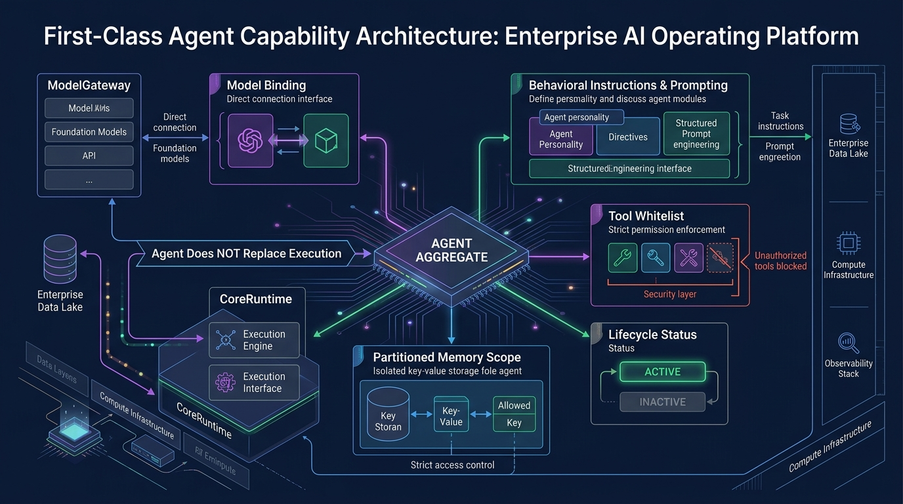

**El principio cardinal: `Agent ≠ Execution`**

* 🪪 **El Agente DEFINE capacidades:** Identidad, modelo de IA vinculado (GPT-4, Claude, Gemini), instrucciones de comportamiento, lista blanca de herramientas permitidas y un espacio de memoria aislado.
* ⚙️ **El Runtime EJECUTA el trabajo:** Toda ejecución pasa obligatoriamente por `CoreRuntime`, que aplica las políticas de gobernanza, verifica la whitelist de herramientas y registra cada acción.
* 🚫 **Lo que NO puede hacer un agente:** No tiene bucles propios, no agenda tareas, no ejecuta código directamente. Si un agente intenta usar una herramienta que no está en su whitelist, la ejecución se detiene instantáneamente.

## 3.5 Blueprint 4: Gobernanza Fail-Closed & Observabilidad Inmutable

Este es el principio de seguridad más importante de toda la plataforma: **ante cualquier duda, detente**. A diferencia de los sistemas "fail-open" (donde si algo falla, se permite continuar por defecto), aquí todo lo que no está explícitamente permitido está **prohibido**.

> 💡 **Ejemplo real:** Si un agente configurado para usar solo `CalculatorTool` intenta invocar `DatabaseTool`, la plataforma NO dice "bueno, dejémoslo pasar". Dice `PolicyDeniedError` y detiene la ejecución al instante. Sin excepciones. Sin bypass.

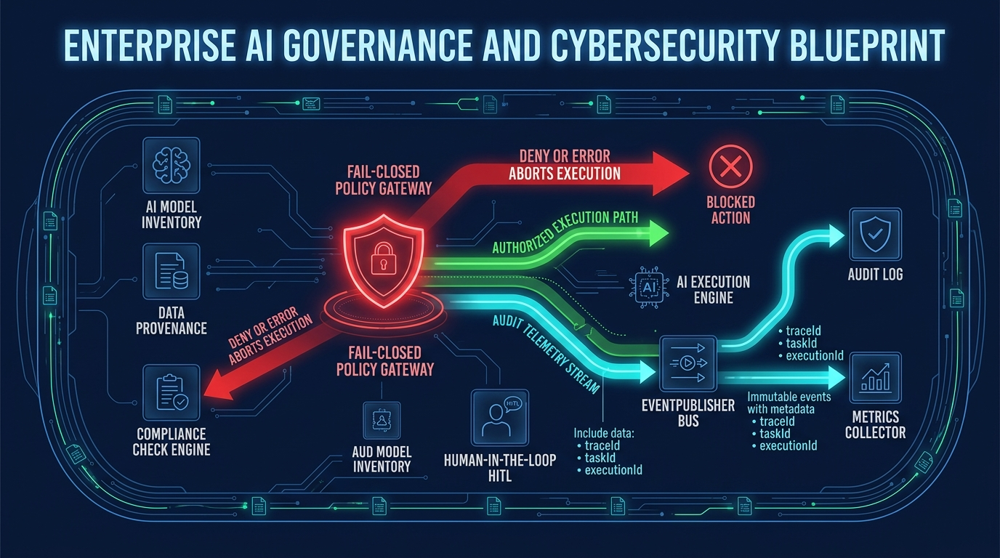

**¿Cómo funciona la gobernanza fail-closed?**

* 🛡️ **PolicyGateway — El guardián:** Antes de CADA acción (invocar un modelo, usar una herramienta, acceder a memoria), el sistema evalúa la política. Solo hay dos resultados: `ALLOW` (pase) o `DENY` (bloqueo total).
* ❌ **Error = Deny:** Si el evaluador de políticas lanza una excepción, un timeout o cualquier error inesperado, el resultado NO es "permitir por defecto" — es DENEGAR. Esto es "fail-closed".
* 📋 **Observabilidad Inmutable:** Cada hecho que ocurre en la plataforma se registra como un evento congelado con `Object.freeze()`. Una vez escrito, nadie puede modificarlo. Es como una caja negra de avión.
* 🔗 **Trazabilidad Correlacionada:** Todo evento lleva un `traceId` único que permite reconstruir la historia completa de una operación — desde la petición HTTP original hasta la última escritura en la base de datos.

---

# Capítulo 4: Especificación Exhaustiva de Capas y Componentes

### 4.1 Capa 1: Presentación & Consumidores Externos
* **Web Platform Control Plane (`src/platform/web/`):** Single-Page Application (SPA, aplicación web de una sola página) nativa construida con HTML5, JavaScript Vanilla y CSS puro. Diseñada sin dependencias de frameworks (sin React, Vue o Angular) para maximizar la mantenibilidad a largo plazo. Utiliza construcción directa de nodos DOM (`document.createElement`, `textContent`) eliminando el uso de `innerHTML` como medida activa contra Cross-Site Scripting (XSS, ataques de inyección de código malicioso en la web). Dispone de un núcleo de internacionalización dinámico (`src/platform/web/i18n/`) que opera en Español Latinoamericano (`es-419`) por defecto y permite conmutar a Inglés (`en`).
* **Consumidores Externos:** Aplicaciones satélites que se comunican con la plataforma a través de HTTP/JSON utilizando los DTOs estables de la API o mediante el SDK tipado `@ai-platform/client`.

### 4.2 Capa 2: Límite de Producto (Platform API)
* **Servidor HTTP Nativo (`src/platform/server.ts`):** Enlace restrictivo a dirección local (solo acepta conexiones del mismo servidor) `127.0.0.1:3000`. Rechaza peticiones dirigidas a interfaces de red públicas no autorizadas.
* **Enrutador (`src/platform/api/http-router.ts`):**
  * Normalización de identificadores con la expresión regular `^[a-zA-Z0-9_-]{1,128}$`.
  * Protección contra saturación: límite estricto de cuerpo de petición a 1MB (HTTP 413) y validación de tipo MIME `application/json` (HTTP 415).
  * Rate Limiting empresarial configurable por tenant y principal (HTTP 429).
  * Prevención contra Path Traversal en el servicio de archivos estáticos.
* **Proyecciones de Lectura (CQRS):** Ubicadas en `src/application/ports/query-ports.ts`. Separan estrictamente la consulta de estados (`ExecutionProjection`, `TaskProjection`, `AgentProjection`, `OperationProjection`) de los métodos de mutación y transición del dominio.

### 4.3 Capa 3: Aplicación & Motores Operacionales

> 📊 **Glosario visual:** Las infografías de la Sección 2.1 explican cada uno de estos componentes con descripciones en español claro.

* **`CoreRuntime` (`src/application/runtime/core-runtime.ts`):** Propietario único y centralizado de la ejecución atómica (el motor principal que procesa cada tarea paso a paso). Coordina la máquina de estados de `Task` y `Execution`, emite los eventos del ciclo de vida y delega el trabajo real en una `ExecutionStrategy`.
* **`SubmitTask` (`src/application/submit-task.ts`):** Caso de uso para recibir tareas nuevas y ponerlas en la cola de espera en estado `QUEUED`.
* **`AgentService` (`src/application/agent/agent-service.ts`):** Servicio que administra el ciclo de vida del agente y despacha ejecuciones a través de `SubmitTask`.
* **`AutonomousOrchestrator` (`src/application/autonomy/autonomous-orchestrator.ts`):** Servicio de aplicación que coordina el ciclo de supervisión autónoma en pasos acotados, evaluando políticas y delegando la ejecución en `CoreRuntime`.
* **`RestartRecoveryService` (`src/application/recovery/restart-recovery-service.ts`):** Servicio de recuperación: si el servidor se apaga inesperadamente, detecta qué quedó a medias y lo marca como fallido de forma segura.
* **`SequentialOrchestrator` (`src/application/orchestration/sequential-orchestrator.ts`):** Ejecuta secuencias lineales predefinidas con enlace de parámetros entre operaciones consecutivas.
* **`OrganizationService` (`src/application/organization/organization-service.ts`):** Servicio de gestión del ciclo de vida de organizaciones, áreas y equipos con validación de fronteras de tenant.
* **`TeamResourceBudgetService` (`src/application/organization/team-resource-budget-service.ts`):** Servicio de gestión de cuotas presupuestarias por equipo con evaluación fail-closed y contabilización atómica de consumo.
* **`MultiAgentCoordinator` (`src/application/coordination/multi-agent-coordinator.ts`):** Servicio de orquestación coordinada multi-agente para ejecuciones paralelas y dependientes.
* **`AutomationServices` (`src/application/automation/`):** Suite de servicios de automatización que incluye adaptador n8n (`n8n-adapter.ts`), despachador de webhooks (`webhook-dispatcher.ts`), programador de tareas (`scheduler-service.ts`) y servicio de reporting (`reporting-service.ts`).
* **`ResilienceServices` (`src/application/resilience/`):** Servicios de resiliencia operacional que incluyen circuit breaker (`circuit-breaker.ts`), política de reintentos (`retry-policy.ts`) y limitador de tasa (`rate-limiter.ts`).
* **`QuotaService` (`src/application/billing/quota-service.ts`):** Servicio de gestión de cuotas financieras y operacionales.
* **`FeatureFlagService` (`src/application/tenant/feature-flag-service.ts`):** Servicio de feature flags condicionales por tenant.

### 4.4 Capa 4: Núcleo de Dominio Puro
* **Entidades Principales del Dominio (las reglas de negocio puras):**
  * `Task`: Tarea: unidad de trabajo con estados claros (`CREATED` ➔ `QUEUED` ➔ `RUNNING` ➔ `COMPLETED` / `FAILED`).
  * `Execution`: Ejecución: el intento real de procesar una tarea, con fecha y resultado registrados.

**Visualización de Máquinas de Estados:**
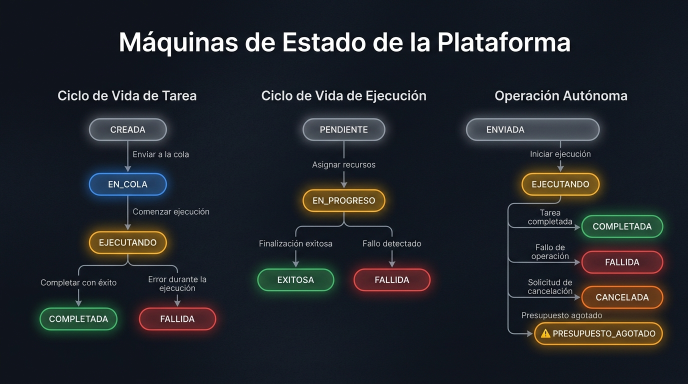

  * `Agent`: Agente: tarjeta de perfil que define qué modelo de IA usa, qué herramientas tiene permitidas y a qué memoria accede.
  * `AutonomousOperation`: Operación Autónoma: misión completa con límites de pasos, tiempo y herramientas.
  * `Organization, Area, Team & AgentMembership`: Jerarquía organizativa virtual con ciclo de vida blando (`ACTIVE`, `INACTIVE`, `ARCHIVED`), áreas funcionales, equipos de trabajo y membresía gobernada con roles operativos (`LEAD`, `SPECIALIST`, `OPERATOR`, `REVIEWER`).

**Jerarquía Organizativa Visual:**
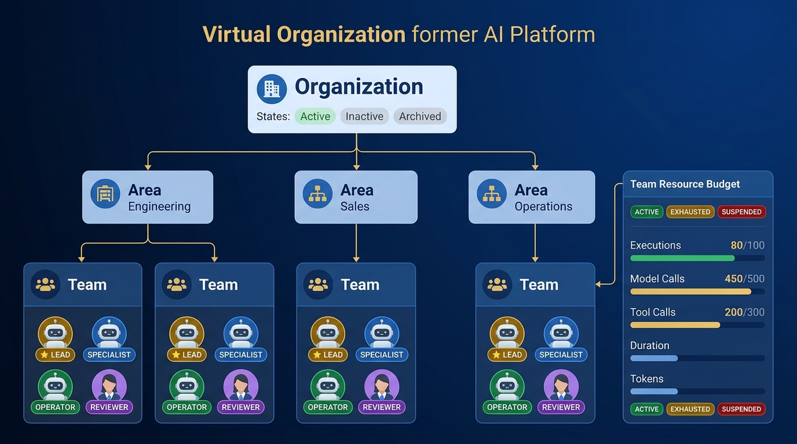

  * `TeamResourceBudget`: Agregado de cuotas multidimensionales (`maxExecutions`, `maxModelCalls`, `maxToolCalls`, `maxAutonomousSteps`, `maxDurationMs`, `maxTokens`) con contadores `consumed`, control de concurrencia optimista (`version`) y estados (`ACTIVE`, `EXHAUSTED`, `SUSPENDED`).
  * `Coordination`: Contratos de coordinación multi-agente para ejecuciones paralelas y flujos dependientes.
  * `Billing & Quota`: Value Objects y entidades de cuotas financieras y operacionales.
  * `Tenant`: Entidades de frontera multi-tenant y feature flags condicionales.
* **Reconstrucción desde base de datos:** Cada entidad tiene un método `rehydrate()` que la reconstruye desde la base de datos manteniendo todas sus reglas intactas.
* **Interfaces de conexión (Puertos):** `PolicyGateway`, `ModelGateway`, `ToolGateway`, `MemoryGateway`, `EventPublisher`, `PlannerPort`, `DecisionEvaluatorPort`, `TaskRepository`, `ExecutionRepository`, `OperationRepositoryPort`. Estas interfaces no saben qué base de datos o proveedor de IA se usa — solo definen el contrato.

### 4.5 Capa 5: Infraestructura & Adaptadores Concretos
* **Persistencia Relacional Duradera (SQLite WAL):** `SqliteDatabase` con Node.js 22+ `node:sqlite`, `SqliteTaskRepository`, `SqliteExecutionRepository`, `SqliteAgentRepository`, `SqliteOperationRepository`, `SqliteEventStore`, `SqliteOrganizationRepository`, `SqliteTeamResourceBudgetRepository` y `SqliteMemoryGateway`. Constituye el almacenamiento predeterminado del servidor en producción.
* **Adaptador PostgreSQL (Producción Escalable):** `PostgresTaskRepository` con esquema relacional (`postgres-schema.sql`) para despliegues que requieren escalabilidad horizontal.
* **Persistencia en Memoria (Testing):** `InMemoryTaskRepository`, `InMemoryExecutionRepository`, `InMemoryAgentRegistry`, `InMemoryOperationRepository`.
* **Adaptadores de Modelos de IA:** `OpenAIModelGateway`, `AnthropicModelGateway`, `OllamaModelGateway`, `GeminiModelGateway`, `StubModelGateway` y `ProviderFactory` con selección dinámica por variables de entorno.
* **Adaptador de Dispositivos Empresariales:** `BrotherPrinterAdapter` implementando la gestión de impresión local sobre puerto `USB001` para Brother DCP-1600 series.
* **Adaptadores de Media:** `VirtualTryOnProvider` implementando probador virtual AR para comercio electrónico.
* **Cola de Trabajadores:** `InMemoryWorkerQueue` como abstracción de cola para procesamiento asíncrono.
* **Herramientas:** `InMemoryToolRegistry` con `CalculatorTool` y validación de esquemas JSON.
* **Gobernanza & Seguridad:** `RbacAuthorizationEvaluator`, `InMemoryRoleRepository`, `InMemoryApiKeyRepository` y `JwtTokenVerifier` con verificación criptográfica asimétrica RS256/ES256 y rotación de claves.
* **Telemetría y Diagnóstico:** `EventObservabilitySubscriber`, `InMemoryAuditLog`, `InMemoryMetricsCollector`, `StructuredEventLogger` y `RuntimeDiagnosticsService`.

---

# Capítulo 5: Arquitectura de Agentes de Primera Clase (v0.8)

> 💡 **En resumen:** Un agente NO es un robot autónomo. Es una **tarjeta de permisos** que dice qué modelo de IA puede usar, qué herramientas tiene disponibles y a qué memoria accede. Quien realmente ejecuta el trabajo es el CoreRuntime (el motor principal).

En la versión **v0.8**, el concepto de Agente se formalizó como un agregado de dominio de primera clase.

### 5.1 Los 6 Pilares del Agente (qué define cada uno)
1. **Identidad & Nombre:** Identificador inmutable normalizado y nombre descriptivo.
2. **Modelo de IA Vinculado (Model Binding):** Qué modelo de IA usa este agente (ej: GPT-4, Claude, Gemini) (`ModelQueryPort`).
3. **Instrucciones de Comportamiento:** Las instrucciones que definen cómo debe actuar el agente (su "personalidad" y reglas).
4. **Lista Blanca de Herramientas (`agent.tools`):** Lista blanca estricta. Si el agente intenta usar una herramienta que NO está en su lista autorizada, la operación se bloquea al instante.
5. **Memoria Privada Aislada (`agent.memoryScope`):** Cada agente tiene su propio "cajón" de memoria. Un agente nunca puede ver ni modificar la memoria de otro.
6. **Estado del Agente (`status`):** `ACTIVE` (puede trabajar) e `INACTIVE` (temporalmente deshabilitado).

### 5.2 Invariante Central: `Agent ≠ Execution`
El agente no sustituye al motor de ejecución. No existen "hilos de agente" ni bucles de ejecución propios del agente. Para ejecutar un agente:

**Arquitectura Visual del Agente de Primera Clase:**
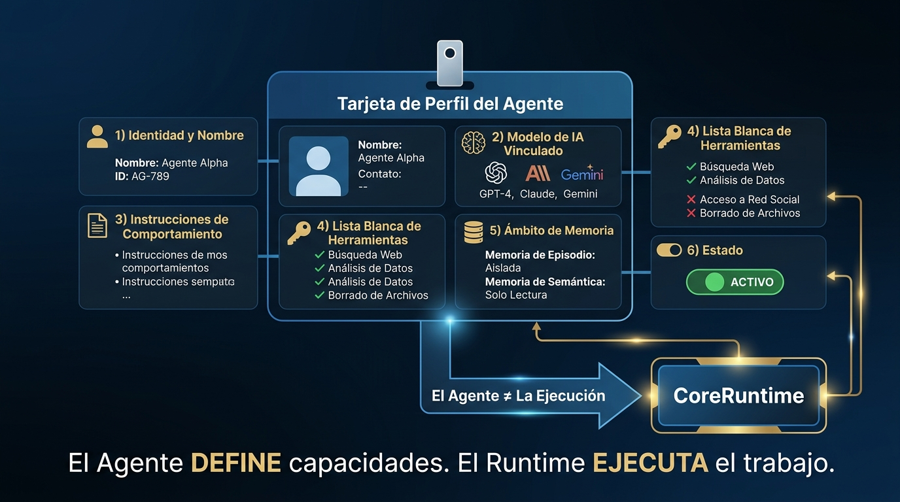

```text
POST /api/v1/agents/:id/executions
       ↓
AgentService.executeAgent()
       ↓
SubmitTask Use Case (crea Task en estado QUEUED)
       ↓
CoreRuntime.execute()
       ↓
AgentExecutionStrategy (aplica PolicyGateway, tools whitelist y memoryScope)
```

---

# Capítulo 6: Operaciones Autónomas Acotadas (v0.9 Increments #1 al #5)

> 💡 **¿Qué es una operación autónoma?** Es cuando le das a un agente un **objetivo complejo** ("analiza el inventario y genera recomendaciones") y la plataforma lo ejecuta paso a paso, con límites estrictos para que nunca se descontrole. Piensa en un chef con receta: tiene ingredientes limitados (presupuesto), pasos definidos (plan) y un temporizador (tiempo máximo).

**Ciclo de Ejecución Visual End-to-End:**
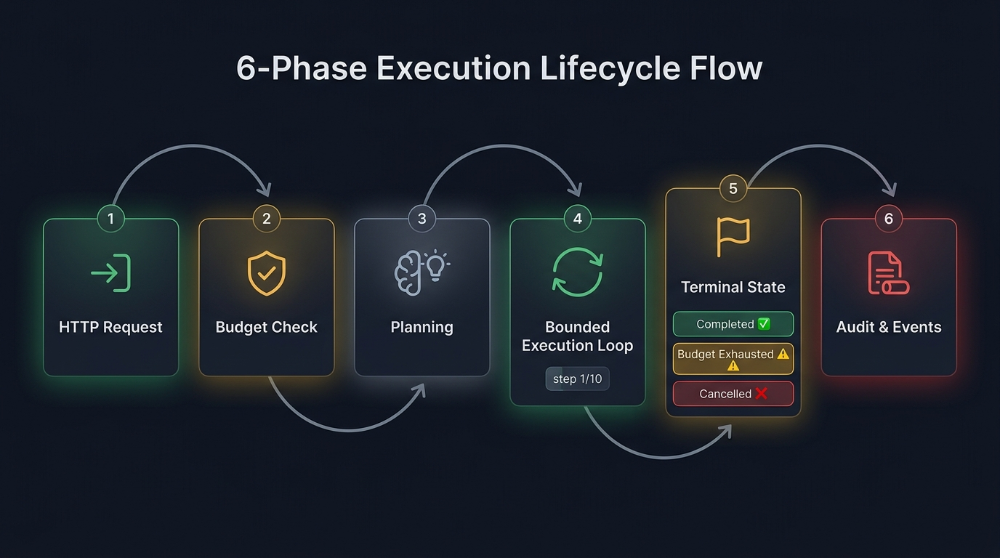

Milestone **v0.9** introduce la capacidad de trabajar hacia un objetivo a lo largo de múltiples pasos interactivos y discretos.

### 6.1 El Peligro de la Autonomía Ilimitada
La autonomía sin restricciones representa riesgos inaceptables en entornos corporativos: bucles infinitos, costos impredecibles por consumo descontrolado de tokens, alucinaciones no auditadas y falta de determinismo.

Por esta razón, la arquitectura adopta el principio de **Autonomía Acotada (Bounded Autonomy)**:

```text
AutonomousOperation
        │
        ▼
   PlannerPort.plan() ──► Produce Plan (Secuencia finita y congelada de PlanSteps)
        │
        ▼
  Derivación de Decision (EXECUTE_STEP)
        │
   ┌────┴───────────────────────────────────────────────────────┐
   │ Bucle Finito (for iteration < budget.maxSteps)             │
   │                                                            │
   │ 1. Comprobación previa de Cancelación                      │
   │ 2. Comprobación previa de Presupuesto (checkBudget)        │
   │ 3. PolicyGateway.evaluate() [FAIL-CLOSED]                  │
   │ 4. Submit Task ➔ CoreRuntime.execute()                     │
   │ 5. Task Output/Error ➔ Mapeo a Observation                │
   │ 6. AutonomousOperation.recordStep(delta)                   │
   │ 7. DecisionEvaluatorPort.evaluate(context)                 │
   │ 8. Ramificación según Decision:                            │
   │    • COMPLETE     ➔ Operation.complete() [TERMINAL]        │
   │    • FAIL         ➔ Operation.fail()     [TERMINAL]        │
   │    • STOP         ➔ Operation.cancel()   [TERMINAL]        │
   │    • EXECUTE_STEP ➔ Siguiente paso en Plan [ITERAR]        │
   └────────────────────────────────────────────────────────────┘
```

**Infografía: El bucle explicado paso a paso:**
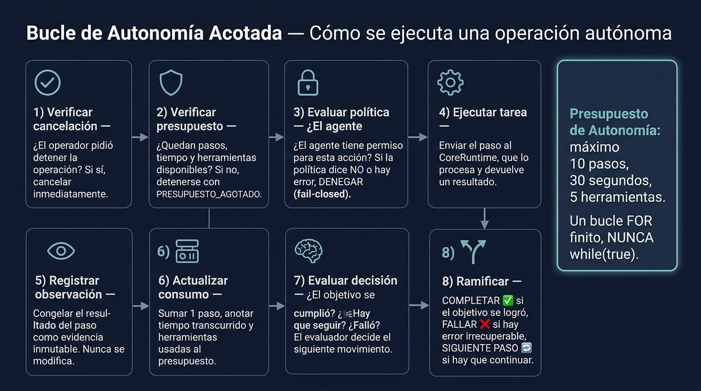

### 6.2 El Presupuesto de Autonomía (`AutonomyBudget`)
Antes de arrancar, toda operación autónoma necesita un presupuesto que define sus límites (una vez creado, no se puede modificar):
* `maxSteps`: Máximo de pasos que puede dar (ej: 10 pasos).
* `maxDurationMs`: Tiempo máximo permitido (ej: 30 segundos = 30000 ms).
* `maxToolCalls`: Máximo de veces que puede usar herramientas (ej: 5 llamadas).
* `maxTokens` *(opcional)*: Límite de tokens de IA consumidos (cuando el proveedor lo reporta).

### 6.3 La Máquina de Estados de `AutonomousOperation`
```text
               [ SUBMITTED ]
                     │
                     ▼
                [ RUNNING ]
                     │
    ┌────────────────┼────────────────┬────────────────┐
    │                │                │                │
    ▼                ▼                ▼                ▼
[ COMPLETED ]   [ FAILED ]     [ CANCELLED ]   [ BUDGET_EXHAUSTED ]
```

**Visualización Comparativa de Máquinas de Estado:**


* **`SUBMITTED ➔ RUNNING`:** Al iniciar el bucle en `AutonomousOrchestrator.run()`.
* **`RUNNING ➔ COMPLETED`:** Cuando el `DecisionEvaluator` confirma que el objetivo fue alcanzado (`Decision.type === "COMPLETE"`).
* **`RUNNING ➔ FAILED`:** Cuando ocurre un error irrecuperable de planificación, fallo terminal de un paso, o denegación de política (`PolicyDeniedError`).
* **`RUNNING ➔ CANCELLED`:** Exclusivamente ante una señal de cancelación explícita del operador o supervisor.
* **`RUNNING ➔ BUDGET_EXHAUSTED`:** Al alcanzar cualquiera de los límites del presupuesto (`STEPS_EXHAUSTED`, `DURATION_EXCEEDED`, `TOOLS_EXHAUSTED`, `TOKENS_EXHAUSTED`).

---

# Capítulo 7: Matriz de Responsabilidades de los Componentes

> 💡 **¿Por qué importa esto?** Cada pieza de la plataforma tiene un rol único y límites claros. Esto evita que el código se convierta en espagueti: el que planifica no ejecuta, el que ejecuta no decide, y el que vigila no actúa.

**Infografía: ¿Quién hace qué (y qué NO hace)?**
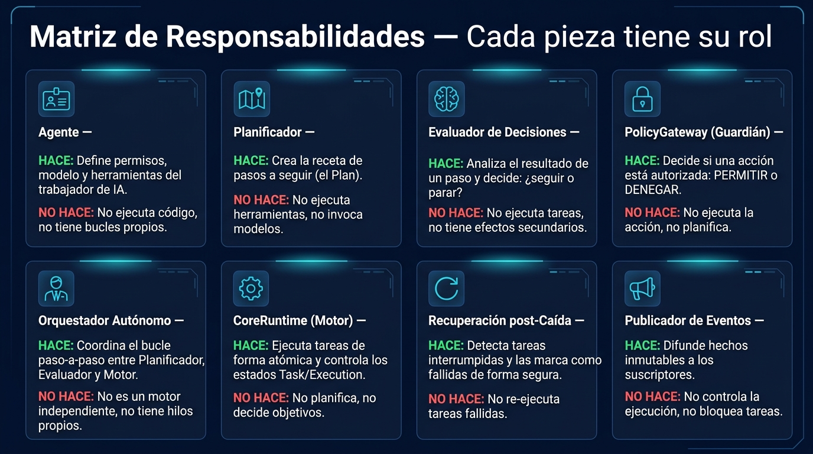

Para evitar la erosión de fronteras arquitectónicas, cada componente posee responsabilidades estrictamente delimitadas:

| Componente | Responsabilidad Primaria | Lo que NO hace (Frontera Estricta) |
| :--- | :--- | :--- |
| **Agent** | Agregado de identidad, directivas, modelo vinculado, herramientas permitidas y ámbito de memoria. | NO ejecuta código, NO contiene bucles, NO agenda tareas autónomas. |
| **Planner (`PlannerPort`)** | Descomponer un objetivo en un `Plan` estructurado y finito de pasos (`PlanStep`). | NO ejecuta herramientas, NO invoca modelos directamente, NO evalúa políticas. |
| **DecisionEvaluator** | Función pura que analiza la `Observation` de un paso para derivar la siguiente `Decision`. | NO ejecuta tareas, NO llama al runtime, NO tiene efectos secundarios mutables. |
| **PolicyGateway** | Evaluar y decidir si una acción sobre un recurso está autorizada (`ALLOW` o `DENY`). | NO ejecuta la acción, NO planifica, NO altera el contexto de la tarea. |
| **AutonomousOrchestrator**| Coordinar el ciclo iterativo acotado entre Planner, Evaluator y CoreRuntime. | NO es un runtime independiente, NO tiene hilos en background, NO reemplaza al `CoreRuntime`. |
| **CoreRuntime** | Ejecutar tareas canónicas de forma atómica y gobernar las transiciones de `Task` y `Execution`. | NO planifica, NO decide objetivos, NO contiene heurísticas de autonomía. |
| **Execution** | Representar un intento concreto y correlacionado de cómputo en la plataforma. | NO decide cuándo terminar la autonomía, NO orquesta pasos futuros. |
| **Observation** | Describir el resultado inmutable y serializable observado tras ejecutar un paso. | NO ejecuta código, NO contiene callbacks, NO invoca herramientas. |
| **RestartRecoveryService**| Reconciliar entidades interrumpidas tras caídas del proceso a estados terminales. | NO re-ejecuta tareas fallidas, NO reinicia inferencias interrumpidas. |
| **EventPublisher** | Difundir hechos inmutables de dominio a suscriptores desacoplados. | NO controla el flujo de ejecución, NO intercepta ni bloquea tareas. |

---

# Capítulo 8: Gobernanza Fail-Closed, Seguridad & Catálogo de Invariantes

> 💡 **¿Qué son los invariantes?** Son las **reglas que nunca se rompen**, sin importar qué pase. Están verificadas con tests automáticos — si alguien cambia el código y rompe una de estas reglas, los tests fallan inmediatamente.

**Los 4 Pilares de Garantías:**
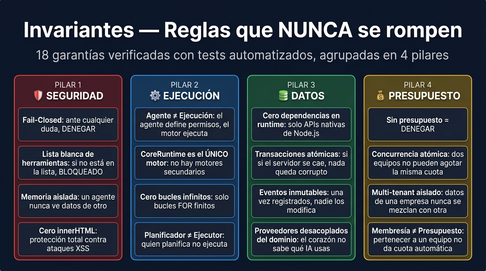

**Modelo Visual de Gobernanza Fail-Closed:**
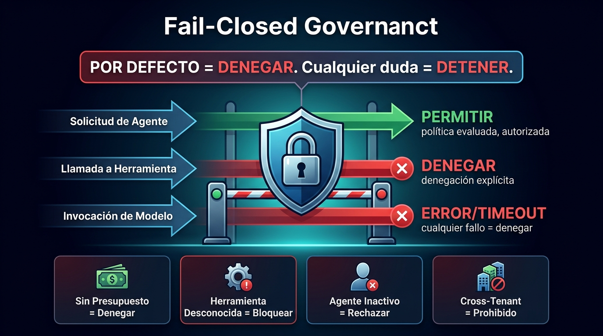

### 8.1 Invariantes Verificados vs. Invariantes de Diseño

La arquitectura distingue formalmente entre lo que ha sido verificado mediante tests automáticos y lo que constituye una restricción de diseño contractual:

| ID | Invariante | Clasificación | Evidencia / Mecanismo de Verificación |
| :--- | :--- | :--- | :--- |
| **INV-01** | **Agent ≠ Execution** | `VERIFIED INVARIANT` | `AgentService.executeAgent()` despacha exclusivamente a través de `SubmitTask` y `CoreRuntime`. |
| **INV-02** | **CoreRuntime como Propietario Único** | `VERIFIED INVARIANT` | No existe ningún `AutonomousRuntime` ni motor secundario. `AutonomousOrchestrator` delega 100% en `CoreRuntime`. |
| **INV-03** | **Gobernanza Fail-Closed** | `VERIFIED INVARIANT` | Toda acción propuesta es evaluada por `PolicyGateway`. Si retorna `DENY` o arroja excepción, la ejecución falla al instante. |
| **INV-04** | **Lista Blanca Estricta de Herramientas** | `VERIFIED INVARIANT` | `AgentExecutionStrategy` verifica que la herramienta requerida esté presente en el arreglo `agent.tools`. |
| **INV-05** | **Aislamiento Estricto de Memoria** | `VERIFIED INVARIANT` | `MemoryGateway` y `MemoryService` aíslan las claves bajo el namespace `agent.memoryScope`. |
| **INV-06** | **Autonomía Estrictamente Acotada** | `VERIFIED INVARIANT` | El bucle de `AutonomousOrchestrator` es un bucle finito `for` indexado por `budget.maxSteps`. |
| **INV-07** | **Timeout vs. Cancelación** | `VERIFIED INVARIANT` | Exceder `maxDurationMs` resulta en `BUDGET_EXHAUSTED` (`DURATION_EXCEEDED`). La cancelación explícita resulta en `CANCELLED`. |
| **INV-08** | **Planner ≠ Executor** | `VERIFIED INVARIANT` | `PlannerPort` genera planes declarativos sin capacidad de invocar infraestructura. |
| **INV-09** | **DecisionEvaluator ≠ Executor** | `VERIFIED INVARIANT` | `DeterministicDecisionEvaluator` es una función pura sin efectos colaterales. |
| **INV-10** | **Prohibición de Bucles Infinitos** | `VERIFIED INVARIANT` | Cero construcciones `while(true)` o `for(;;)` en toda la base de código. |
| **INV-11** | **Desacoplamiento de Proveedores en Dominio** | `VERIFIED INVARIANT` | Cero importaciones de SDKs de terceros en `src/domain/`. |
| **INV-12** | **Cero Dependencias en Runtime** | `VERIFIED INVARIANT` | Sección `dependencies` vacía en `package.json`. |
| **INV-13** | **Inmunidad XSS en Front-End** | `VERIFIED INVARIANT` | Cero `innerHTML` en el Web Control Plane (`app.js`, `index.html`). |
| **INV-14** | **Transaccionalidad Atómica post-Crash** | `VERIFIED INVARIANT` | `RestartRecoveryService` opera dentro de transacciones SQLite atómicas. |
| **INV-15** | **Desacoplamiento de Membresía, Permiso y Presupuesto** | `VERIFIED INVARIANT` | `Membresía ≠ Permiso`, `Membresía ≠ Presupuesto`, `Presupuesto ≠ Autorización`. Tests de organización y budget verifican aislamiento estricto. |
| **INV-16** | **Semántica Fail-Closed de Presupuesto** | `VERIFIED INVARIANT` | `NO BUDGET = DENY`. `TeamResourceBudgetService` deniega ejecución cuando no existe presupuesto asignado. |
| **INV-17** | **Protección Atómica de Concurrencia de Última Unidad** | `VERIFIED INVARIANT` | `SqliteTeamResourceBudgetRepository` utiliza `BEGIN IMMEDIATE` para serializar transacciones y prevenir condiciones de carrera de última unidad de cuota. |
| **INV-18** | **Aislamiento de Frontera Multi-Tenant** | `VERIFIED INVARIANT` | Fronteras de tenant forzadas estrictamente en toda la jerarquía organizativa. `CrossTenantOrganizationError` emitido ante discrepancias de `tenantId`. |

### 8.2 Matriz Canónica de Dimensiones de Recursos

| Dimensión de Recurso | Origen de la Medición | Preflight Gate | Tipo de Enforcement | Fase de Contabilización | Transición de Estado al Límite |
| :--- | :--- | :--- | :--- | :--- | :--- |
| **`executions`** | Despacho de tarea en `AgentExecutionStrategy` | `canConsume({ executions: 1 })` | **ENFORCED (Hard Gate)** | Pre-ejecución (1 unidad) | `ACTIVE` ➔ `EXHAUSTED` (Bloquea ejecuciones posteriores) |
| **`modelCalls`** | Despacho a LLM en `AgentExecutionStrategy` | `canConsume({ modelCalls: 1 })` | **ENFORCED (Hard Gate)** | Pre-llamada a modelo (1 unidad) | `ACTIVE` ➔ `EXHAUSTED` (Bloquea llamadas a modelo) |
| **`toolCalls`** | Invocación en `ToolInvocationRuntime` y `Strategy` | `canConsume({ toolCalls: 1 })` | **ENFORCED (Hard Gate)** | Pre-llamada a herramienta (1 unidad) | `ACTIVE` ➔ `EXHAUSTED` (Bloquea herramientas) |
| **`autonomousSteps`** | Iteración de bucle en `AutonomousOrchestrator` | `canConsume({ autonomousSteps: 1 })` | **ENFORCED (Hard Gate)** | Pre-paso autónomo (1 unidad) | `ACTIVE` ➔ `EXHAUSTED` (Falla con `STEPS_EXHAUSTED`) |
| **`durationMs`** | Tiempo de reloj medido en `AgentExecutionStrategy` | N/A (Medido tras ejecución) | **ACCOUNTED (Post-Facto)** | Post-ejecución (milisegundos reales) | `ACTIVE` ➔ `EXHAUSTED` cuando `consumed.durationMs >= limit` |
| **`tokens`** | Conteo reportado por proveedor (`totalTokens`) | N/A (Reportado tras inferencia) | **ACCOUNTED (Post-Facto)** | Post-llamada (tokens reales) | `ACTIVE` ➔ `EXHAUSTED` cuando `consumed.tokens >= limit` |
| **`cost`** | Atribución de costo financiero | No medido / No disponible | **NOT MEASURED / UNAVAILABLE** | N/A | N/A |

---

# Capítulo 9: Semántica de Cancelación & Decisiones Arquitectónicas Abiertas

### 9.1 Semántica de Cancelación Actual
1. **Cancelación Previa a la Planificación:** Si el `CancellationToken` contiene `isCancelled: true` antes de iniciar la planificación, la operación transiciona inmediatamente a `CANCELLED` y termina sin emitir tareas.
2. **Cancelación Entre Pasos (Inter-Step):** Antes de ejecutar cada paso dentro del bucle acotado, se evalúa el `CancellationToken`. Si fue activado, la operación se cancela de forma ordenada y no despacha el siguiente paso a `CoreRuntime`.
3. **Cancelación en Vuelo (In-Flight Task Execution):** Una vez que un paso ha sido transferido a `CoreRuntime.execute()` y está invocando un modelo o herramienta externa, el token actual no transmite una señal de interrupción asincrónica (como un `AbortSignal`) a los adaptadores de red subyacentes.

### 9.2 Registro de Decisión Arquitectónica Abierta (Open Architectural Decision)

```text
OPEN ARCHITECTURAL DECISION: OAD-001 — In-Flight Task Preemption & Asynchronous AbortSignals

Problema:
El CancellationToken actual es evaluado de forma sincrónica antes de cada paso.
Si un paso se encuentra en ejecución esperando una respuesta de inferencia lenta, no existe
un canal de señalización compartido que fuerce el aborto inmediato del socket HTTP subyacente.

Impacto Actual:
La cancelación se efectiviza al concluir el paso en vuelo y antes de iniciar el siguiente.
No compromete la integridad del dominio pero puede consumir latencia del paso activo.

Recomendación Técnica para Incremento Futuro:
Incorporar soporte nativo de AbortSignal estándar en CoreRuntime y en los contratos de
ModelGateway y ToolGateway, permitiendo propagar cancelaciones externas hacia el hardware de red.
Estado: ABIERTO (No bloquea la arquitectura v1.3.0).
```

---

# Capítulo 10: Catálogo de Servicios & Auditoría de la API REST

**Mapa Visual de la Superficie de API:**
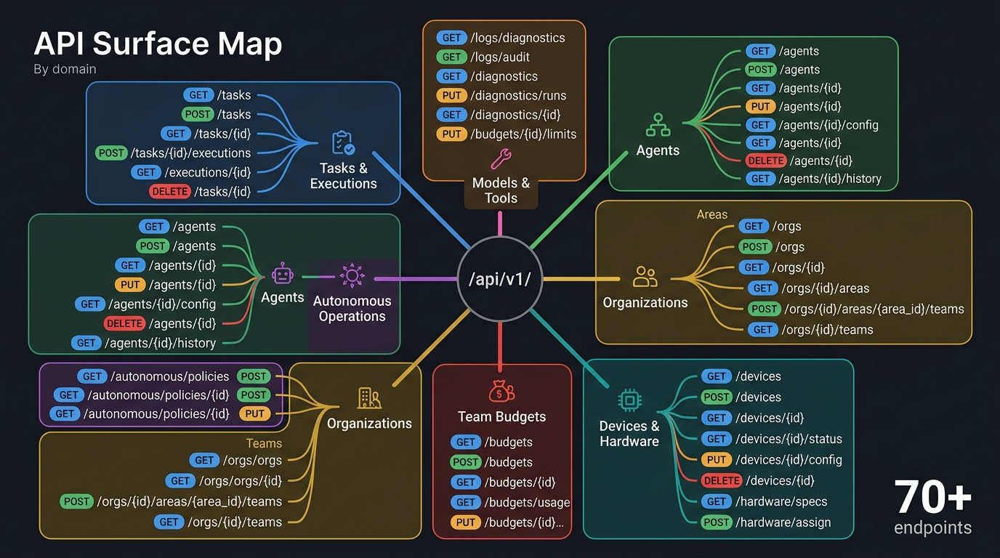

### 10.1 Auditoría de Endpoints

Todos los endpoints implementados residen en `src/platform/api/http-router.ts` y se exponen bajo el prefijo unificado `/api/v1/` (con alias retrocompatibles bajo `/api/platform/v1/*` y `/api/*`):

| Método | Endpoint | Estado de Implementación | Descripción Técnica |
| :--- | :--- | :--- | :--- |
| `GET` | `/` | **IMPLEMENTED** | Sirve la Single-Page Application (Web Control Plane bilingüe). |
| `GET` | `/api/v1/status` | **IMPLEMENTED** | Estado de salud, uptime y conteo de entidades. |
| `GET` | `/api/v1/health` | **IMPLEMENTED** | Estado de salud general del sistema. |
| `GET` | `/api/v1/health/live` | **IMPLEMENTED** | Sonda de liveness para orquestadores de contenedores. |
| `GET` | `/api/v1/health/ready` | **IMPLEMENTED** | Sonda de readiness con verificación de persistencia. |
| `GET` | `/api/v1/diagnostics` | **IMPLEMENTED** | Reporte forense integral de diagnósticos y estado de componentes. |
| `GET` | `/api/v1/diagnostics/traces/:id`| **IMPLEMENTED** | Reconstrucción de traza y eventos correlacionados por traceId. |
| `GET` | `/api/v1/models` | **IMPLEMENTED** | Lista de modelos registrados y sus capacidades. |
| `GET` | `/api/v1/models/:id` | **IMPLEMENTED** | Detalle de modelo específico. |
| `GET` | `/api/v1/tools` | **IMPLEMENTED** | Lista de herramientas y esquemas de parámetros. |
| `GET` | `/api/v1/tools/:id` | **IMPLEMENTED** | Detalle y esquema de validación de herramienta. |
| `GET` | `/api/v1/agents` | **IMPLEMENTED** | Listado de agentes registrados. |
| `POST` | `/api/v1/agents` | **IMPLEMENTED** | Registro de nuevo agente (HTTP 201). |
| `GET` | `/api/v1/agents/:id` | **IMPLEMENTED** | Consulta de perfil y configuración de agente. |
| `PUT` | `/api/v1/agents/:id` | **IMPLEMENTED** | Actualización de configuración de agente. |
| `POST` | `/api/v1/agents/:id/activate` | **IMPLEMENTED** | Transición de agente a estado `ACTIVE`. |
| `POST` | `/api/v1/agents/:id/deactivate` | **IMPLEMENTED** | Transición de agente a estado `INACTIVE`. |
| `POST` | `/api/v1/agents/:id/executions`| **IMPLEMENTED** | Ejecución gobernada a través de `CoreRuntime`. |
| `GET` | `/api/v1/tasks` | **IMPLEMENTED** | Listado de proyecciones durables de tareas. |
| `POST` | `/api/v1/tasks` | **IMPLEMENTED** | Encolamiento canónico vía `SubmitTask`. |
| `GET` | `/api/v1/tasks/:id` | **IMPLEMENTED** | Consulta de tarea por identificador. |
| `GET` | `/api/v1/executions` | **IMPLEMENTED** | Listado de proyecciones de ejecución. |
| `POST` | `/api/v1/executions` | **IMPLEMENTED** | Despacho de tarea y ejecución directa. |
| `GET` | `/api/v1/executions/:id` | **IMPLEMENTED** | Consulta de ejecución por identificador. |
| `GET` | `/api/v1/executions/:id/timeline` | **IMPLEMENTED** | Timeline forense correlacionado por `traceId`. |
| `POST` | `/api/v1/orchestrate` | **IMPLEMENTED** | Orquestación lineal multi-operación. |
| `GET` | `/api/v1/metrics` | **IMPLEMENTED** | Métricas y muestras de telemetría operativa. |
| `GET` | `/api/v1/audit` | **IMPLEMENTED** | Stream completo de auditoría forense. |
| `GET` | `/api/v1/operations` | **IMPLEMENTED** | Listado de operaciones autónomas acotadas. |
| `POST` | `/api/v1/operations` | **IMPLEMENTED** | Creación y despacho sincrónico en-proceso de operación acotada. |
| `GET` | `/api/v1/operations/:id` | **IMPLEMENTED** | Consulta detallada de operación con pasos, observaciones y decisiones. |
| `POST` | `/api/v1/operations/:id/cancel` | **IMPLEMENTED** | Señal de cancelación explícita de operación. |
| `GET` | `/api/v1/devices` | **IMPLEMENTED** | Listado de dispositivos físicos empresariales registrados. |
| `GET` | `/api/v1/devices/:id` | **IMPLEMENTED** | Detalle y salud de dispositivo empresarial. |
| `POST` | `/api/v1/devices/:id/print` | **IMPLEMENTED** | Despacho de trabajo de impresión comercial. |
| | | | **— Endpoints de Organización Virtual —** |
| `GET` | `/api/v1/organizations` | **IMPLEMENTED** | Listado de organizaciones del tenant. |
| `POST` | `/api/v1/organizations` | **IMPLEMENTED** | Creación de nueva organización. |
| `GET` | `/api/v1/organizations/:id` | **IMPLEMENTED** | Detalle de organización por identificador. |
| `PUT` | `/api/v1/organizations/:id` | **IMPLEMENTED** | Actualización de datos de organización. |
| `GET` | `/api/v1/organizations/:id/hierarchy` | **IMPLEMENTED** | Árbol jerárquico completo (organización → áreas → equipos). |
| `GET` | `/api/v1/organizations/:id/areas` | **IMPLEMENTED** | Listado de áreas funcionales de la organización. |
| `POST` | `/api/v1/organizations/:id/areas` | **IMPLEMENTED** | Creación de nueva área funcional. |
| `GET` | `/api/v1/areas/:id` | **IMPLEMENTED** | Detalle de área funcional por identificador. |
| `PUT` | `/api/v1/areas/:id` | **IMPLEMENTED** | Actualización de datos de área. |
| `GET` | `/api/v1/areas/:id/teams` | **IMPLEMENTED** | Listado de equipos del área. |
| `POST` | `/api/v1/areas/:id/teams` | **IMPLEMENTED** | Creación de nuevo equipo de trabajo. |
| `GET` | `/api/v1/teams/:id` | **IMPLEMENTED** | Detalle de equipo por identificador. |
| `PUT` | `/api/v1/teams/:id` | **IMPLEMENTED** | Actualización de datos de equipo. |
| `GET` | `/api/v1/teams/:id/agents` | **IMPLEMENTED** | Listado de agentes miembros del equipo con roles. |
| `POST` | `/api/v1/teams/:id/agents` | **IMPLEMENTED** | Asignación de agente al equipo con rol operativo. |
| `DELETE` | `/api/v1/teams/:id/agents/:agentId` | **IMPLEMENTED** | Revocación de membresía de agente en equipo. |
| | | | **— Endpoints de Team Resource Budget —** |
| `GET` | `/api/v1/teams/:id/budget` | **IMPLEMENTED** | Consulta del presupuesto de recursos del equipo con cuotas y consumo. |
| `POST` | `/api/v1/teams/:id/budget` | **IMPLEMENTED** | Creación o actualización del presupuesto del equipo. |
| `PUT` | `/api/v1/teams/:id/budget` | **IMPLEMENTED** | Actualización de cuotas del presupuesto existente. |
| `POST` | `/api/v1/teams/:id/budget/authorize` | **IMPLEMENTED** | Evaluación fail-closed de autorización de consumo contra cuota. |
| `POST` | `/api/v1/teams/:id/budget/consume` | **IMPLEMENTED** | Contabilización atómica de consumo de recurso contra presupuesto. |
| | | | **— Endpoints Adicionales de Dispositivos —** |
| `GET` | `/api/v1/devices/:id/health` | **IMPLEMENTED** | Estado de salud del dispositivo empresarial. |
| `GET` | `/api/v1/devices/:id/capabilities` | **IMPLEMENTED** | Capacidades y funcionalidades del dispositivo. |
| `GET` | `/api/v1/devices/:id/status` | **IMPLEMENTED** | Estado operacional actual del dispositivo. |
| `GET` | `/api/v1/devices/:id/consumables` | **IMPLEMENTED** | Niveles de consumibles (tóner, papel, tambor). |
| `GET` | `/api/v1/devices/:id/print-jobs` | **IMPLEMENTED** | Listado de trabajos de impresión del dispositivo. |
| `GET` | `/api/v1/devices/:id/print-jobs/:jobId` | **IMPLEMENTED** | Detalle de trabajo de impresión específico. |
| `POST` | `/api/v1/devices/:id/print-jobs/:jobId/cancel` | **IMPLEMENTED** | Cancelación de trabajo de impresión en cola. |
| `PATCH` | `/api/v1/devices/:id` | **IMPLEMENTED** | Actualización parcial de configuración del dispositivo. |
| | | | **— Endpoints de Diagnósticos Extendidos —** |
| `GET` | `/api/v1/diagnostics/tasks/:id/timeline` | **IMPLEMENTED** | Línea de tiempo forense de tarea por identificador. |
| `GET` | `/api/v1/diagnostics/executions/:id/forensics` | **IMPLEMENTED** | Análisis forense detallado de ejecución. |
| | | | **— Endpoints de Tenants —** |
| `GET` | `/api/v1/tenants` | **IMPLEMENTED** | Listado de tenants registrados. |
| `GET` | `/api/v1/tenants/:id` | **IMPLEMENTED** | Detalle de tenant por identificador. |
| `GET` | `/api/v1/tenants/:id/dashboard` | **IMPLEMENTED** | Dashboard de métricas operacionales del tenant. |
| | | | **— Endpoints de Aplicaciones Gobernadas —** |
| `GET` | `/api/v1/applications` | **IMPLEMENTED** | Listado de aplicaciones satélites registradas. |
| `GET` | `/api/v1/applications/:id` | **IMPLEMENTED** | Detalle de aplicación satélite. |
| `GET` | `/api/v1/applications/:id/analytics` | **IMPLEMENTED** | Analíticas de uso de la aplicación. |
| `POST` | `/api/v1/applications/:id/lifecycle` | **IMPLEMENTED** | Transición de ciclo de vida de la aplicación. |
| | | | **— Endpoints de Integraciones —** |
| `GET` | `/api/v1/integrations` | **IMPLEMENTED** | Listado de integraciones externas configuradas. |
| `GET` | `/api/v1/integrations/:id` | **IMPLEMENTED** | Detalle de integración por identificador. |
| `POST` | `/api/v1/integrations/:id/verify` | **IMPLEMENTED** | Verificación de conectividad de integración. |
| | | | **— Endpoints de Eventos —** |
| `GET` | `/api/v1/events` | **IMPLEMENTED** | Stream de eventos de dominio. |
| `GET` | `/api/v1/events/:id` | **IMPLEMENTED** | Detalle de evento específico por identificador. |

---

# Capítulo 11: Matriz de Trazabilidad Arquitectónica

Esta matriz vincula cada decisión arquitectónica aprobada con su documento ADR, su código fuente, sus pruebas de verificación y su documentación:

| Decisión Arquitectónica | ADR | Código Fuente | Tests de Verificación | Documentación |
| :--- | :--- | :--- | :--- | :--- |
| **TypeScript & Zero Runtime Dependencies** | ADR 0001 | `package.json`<br>`src/platform/server.ts` | `scripts/test.js`<br>`npm ls --omit=dev` | `README.md`<br>`docs/ARCHITECTURE.md` |
| **Domain Events & Observabilidad Inmutable** | ADR 0002 | `src/domain/events/events.ts`<br>`src/infrastructure/events/` | `tests/contract/event-publisher.contract.test.ts` | `docs/decisions/0002-domain-events-and-observability.md` |
| **Manual Composition Root** | ADR 0003 | `src/interfaces/composition.ts` | `tests/integration/core-runtime.test.ts` | `docs/decisions/0003-manual-composition.md` |
| **Core Runtime Execution Model** | ADR 0004 | `src/application/runtime/core-runtime.ts` | `tests/unit/execution.test.ts` | `docs/decisions/0004-core-runtime-execution-model.md` |
| **Tools as Explicit Capabilities** | ADR 0005 | `src/application/tools/tool-gateway.ts` | `tests/unit/tool-gateway.test.ts` | `docs/decisions/0005-tools-as-explicit-capabilities.md` |
| **Engine / Platform / Application Boundary** | ADR 0006 | `src/domain/`<br>`src/platform/`<br>`src/application/` | `tests/unit/architecture-isolation.test.ts` | `docs/decisions/0006-engine-platform-application-boundary.md` |
| **Sequential Orchestration** | ADR 0007 | `src/application/orchestration/` | `tests/unit/sequential-orchestrator.test.ts` | `docs/decisions/0007-sequential-orchestration.md` |
| **Context & Scoped Memory Boundaries** | ADR 0008 | `src/domain/context/task-context.ts`<br>`src/domain/memory/` | `tests/unit/task-context.test.ts` | `docs/decisions/0008-context-and-memory-boundaries.md` |
| **Fail-Closed Policy Governance** | ADR 0009 | `src/domain/policy/policy.ts`<br>`src/infrastructure/policy/` | `tests/unit/observability-and-policy.test.ts` | `docs/decisions/0009-observability-and-governance-boundaries.md` |
| **Platform API & Native Web UI** | ADR 0010 | `src/platform/api/http-router.ts`<br>`src/platform/web/` | `tests/platform/api.test.ts`<br>`tests/platform/operational-ui-frontend.test.ts` | `docs/decisions/0010-platform-api-and-web-ui.md` |
| **First-Class Agent Aggregate** | ADR 0011 | `src/domain/agent/agent.ts`<br>`src/application/agent/agent-service.ts` | `tests/unit/agent.test.ts`<br>`tests/integration/agent-runtime.test.ts` | `docs/decisions/0011-agent-architecture.md` |
| **Autonomous Operations Foundation** | ADR 0012 | `src/domain/autonomy/autonomous-operation.ts` | `tests/unit/autonomous-operation.test.ts` | `docs/decisions/0012-autonomous-operations.md` |
| **Autonomy Budget & Bounded Loop** | ADR 0013 | `src/domain/autonomy/autonomy-budget.ts`<br>`src/application/autonomy/autonomous-orchestrator.ts` | `tests/unit/autonomy-budget.test.ts`<br>`tests/unit/autonomous-orchestrator.test.ts` | `docs/decisions/0013-bounded-autonomous-operations.md` |
| **Autonomous Operations API & UI** | ADR 0014 | `src/platform/api/http-router.ts`<br>`src/platform/web/app.js` | `tests/platform/operations-api.test.ts` | `docs/decisions/0014-autonomous-operations-api-integration.md` |
| **Durable Persistence Architecture (SQLite WAL)** | ADR 0015 | `src/infrastructure/persistence/sqlite/sqlite-database.ts`<br>`src/infrastructure/persistence/sqlite/sqlite-operation-repository.ts` | `tests/unit/sqlite-persistence.test.ts` | `docs/decisions/0015-durable-persistence-architecture.md` |
| **Formal Domain Rehydration Boundary** | ADR 0016 | `src/domain/autonomy/autonomous-operation.ts`<br>`src/infrastructure/persistence/sqlite/sqlite-mapper.ts` | `tests/unit/autonomous-operation.test.ts` | `docs/decisions/0016-formal-domain-rehydration-boundary.md` |
| **Core Execution Rehydration Boundary** | ADR 0017 | `src/domain/task/task.ts`<br>`src/domain/execution/execution.ts` | `tests/unit/task.test.ts`<br>`tests/unit/execution.test.ts` | `docs/decisions/0017-core-execution-domain-rehydration-boundary.md` |
| **Agent Domain Rehydration Boundary** | ADR 0018 | `src/domain/agent/agent.ts` | `tests/unit/agent.test.ts` | `docs/decisions/0018-agent-domain-rehydration-boundary.md` |
| **Durable SQLite Adapters for Core Entities** | ADR 0019 | `src/infrastructure/persistence/sqlite/sqlite-task-repository.ts`<br>`src/infrastructure/persistence/sqlite/sqlite-execution-repository.ts`<br>`src/infrastructure/persistence/sqlite/sqlite-agent-repository.ts` | `tests/contract/task-repository.contract.test.ts`<br>`tests/contract/execution-repository.contract.test.ts`<br>`tests/contract/agent-registry.contract.test.ts` | `docs/decisions/0019-durable-sqlite-adapters-for-task-execution-agent.md` |
| **Crash Recovery & Restart Reconciliation** | ADR 0020 | `src/application/recovery/restart-recovery-service.ts` | `tests/unit/restart-recovery-service.test.ts`<br>`tests/integration/sqlite-crash-recovery.integration.test.ts` | `docs/decisions/0020-crash-recovery-and-restart-reconciliation.md` |
| **Durable Events & Audit Infrastructure** | ADR 0021 | `src/infrastructure/persistence/sqlite/sqlite-event-store.ts` | `tests/contract/durable-event-store.contract.test.ts`<br>`tests/integration/sqlite-durable-events.integration.test.ts` | `docs/decisions/0021-durable-events-and-audit-infrastructure.md` |
| **Observability Audit Query & Diagnostics** | ADR 0022 | `src/application/diagnostics/runtime-diagnostics.ts`<br>`src/platform/api/http-router.ts` | `tests/platform/diagnostics-api.test.ts` | `docs/decisions/0022-observability-audit-query-and-runtime-diagnostics.md` |
| **Google Gemini Model Gateway** | ADR 0023 | `src/infrastructure/model/gemini/gemini-model-gateway.ts` | `tests/unit/gemini-model-gateway.test.ts` | `docs/decisions/0023-google-gemini-model-gateway.md` |
| **SQLite Durable Memory Gateway** | ADR 0024 | `src/infrastructure/memory/sqlite-memory-gateway.ts` | `tests/unit/sqlite-memory-gateway.test.ts`<br>`tests/contract/memory-gateway.contract.test.ts` | `docs/decisions/0024-sqlite-durable-memory-gateway.md` |
| **Asymmetric JWT & Key Rotation** | ADR 0025 | `src/infrastructure/security/jwt-token-verifier.ts` | `tests/unit/jwt-authentication.test.ts` | `docs/decisions/0025-asymmetric-jwt-and-key-rotation.md` |
| **Production Reverse Proxy & TLS** | ADR 0026 | `deploy/nginx/nginx.conf`<br>`deploy/caddy/Caddyfile`<br>`deploy/docker-compose.prod.yml` | Despliegue de manifiestos y configuración | `docs/decisions/0026-production-reverse-proxy-and-tls.md` |
| **Virtual Organization Foundation** | ADR 0027 | `src/domain/organization/`<br>`src/infrastructure/organization/` | `tests/unit/organization-domain.test.ts`<br>`tests/platform/organization-api.test.ts` | `docs/decisions/0027-virtual-organization-foundation.md` |
| **Team Resource Budget Governance** | ADR 0028 | `src/domain/organization/team-resource-budget.ts`<br>`src/application/organization/team-resource-budget-service.ts`<br>`src/infrastructure/persistence/sqlite/sqlite-team-resource-budget-repository.ts` | `tests/unit/team-resource-budget.test.ts` | `docs/decisions/0028-team-resource-budget-governance.md` |
| **Security Context & Multi-Tenant Boundary** | ADR-003 | `src/domain/security/boundaries.ts` | `tests/unit/security-boundaries.test.ts` | `docs/decisions/ADR-003-security-context.md` |
| **Tentaciones Platform Integration & Fallback** | ADR-008 | `src/application/platform/tentaciones-platform-adapter.ts` | `tests/platform/tentaciones-platform-adapter.test.ts` | `docs/decisions/ADR-008-tentaciones-integration.md` |
| **Platform Truth Model** | ADR-010 | `docs/SOURCE_OF_TRUTH.md` | `tests/platform/runtime-integration-hardening.test.ts` | `docs/decisions/ADR-010-platform-truth-model.md` |
| **Core Platform Separation** | ADR-001 | `src/domain/`<br>`src/platform/`<br>`src/application/` | `tests/unit/architecture-isolation.test.ts` | `docs/decisions/ADR-001-core-platform-separation.md` |
| **Hexagonal Architecture** | ADR-002 | `src/domain/`<br>`src/infrastructure/` | `tests/unit/architecture-isolation.test.ts` | `docs/decisions/ADR-002-hexagonal-architecture.md` |
| **Default Deny Policy** | ADR-004 | `src/domain/policy/policy.ts`<br>`src/infrastructure/policy/` | `tests/unit/observability-and-policy.test.ts` | `docs/decisions/ADR-004-default-deny.md` |
| **Durable Events Foundation** | ADR-005 | `src/domain/events/events.ts`<br>`src/infrastructure/events/` | `tests/contract/event-publisher.contract.test.ts` | `docs/decisions/ADR-005-durable-events.md` |
| **Platform API Boundary** | ADR-006 | `src/platform/api/http-router.ts` | `tests/platform/api.test.ts` | `docs/decisions/ADR-006-platform-api.md` |
| **External Application Boundary** | ADR-007 | `src/application/platform/`<br>`src/application/factory/` | `tests/platform/tentaciones-platform-adapter.test.ts` | `docs/decisions/ADR-007-external-application-boundary.md` |
| **AR Governance & Virtual Try-On** | ADR-009 | `src/infrastructure/media/virtual-tryon-provider.ts` | `tests/unit/tentaciones-ar-commerce.test.ts` | `docs/decisions/ADR-009-ar-governance.md` |

---

# Capítulo 12: Hoja de Ruta Oficial (Roadmap Sincronizado)

**Línea de Tiempo Visual del Proyecto:**
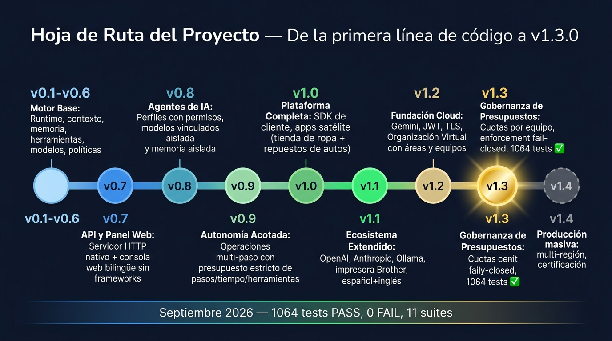

El roadmap técnico se estructura exclusivamente sobre hechos demostrados en el código y proyecciones futuras debidamente delimitadas:

```text
COMPLETADO & VERIFICADO (v1.3.0 BASELINE CANÓNICA — 1064 TESTS PASS)
──────────────────────────────────────────────────────────────────────────
• v0.1 a v0.6: Core Engine Primitives (Runtime, Context, Memory, Tools, Models, Policy)
• v0.7: Platform API Gateway & Web Control Plane SPA (Zero Runtime Dependencies)
• v0.8: First-Class Agents Capability (Agent Aggregate, Whitelisting, Scoping)
• v0.9: Bounded Autonomous Operations (AutonomyBudget, AutonomousOrchestrator, DecisionEvaluator)
• v0.10: Durable Persistence Architecture (SqliteDatabase nativo, SqliteOperationRepository WAL)
• v0.11: Formal Domain Rehydration Boundaries (Task, Execution, Agent, AutonomousOperation)
• v0.12: Durable Execution Persistence (SqliteTaskRepository, SqliteExecutionRepository, SqliteAgentRepository)
• v0.13: Crash Recovery & Reconciliation (RestartRecoveryService atómico, SqliteEventStore)
• v1.0.0: AI Operating Platform Foundation (Platform API, PlatformClient SDK, Tentaciones AI Commerce)
• v1.1.0: Ecosistema Extendido & Madurez Operacional:
  - Real AI Providers: Adaptadores OpenAI, Anthropic, Ollama y ProviderFactory.
  - Business Devices: Adaptador Brother DCP-1600 series en USB001 y spooler de impresión.
  - Reference Applications: Vehicle Parts Platform y Application Factory 2.0.
  - Bilingual Interface: Consola web nativa en Español Latinoamericano (es-419) e Inglés (en).
• v1.2.0 (Fase 55 / Prompt 101): Enterprise Cloud Foundation & Real Model Expansion:
  - Google Gemini / Vertex AI: Adaptador nativo GeminiModelGateway con streaming y tool calling (AOP-MODEL-GEMINI).
  - Durable Memory Gateway: Pasarela relacional duradera SqliteMemoryGateway en SQLite WAL (AOP-MEMORY).
  - Asymmetric JWT & OIDC: Verificador criptográfico JwtTokenVerifier con RS256/ES256 y rotación de claves (AOP-AUTH).
  - Perimeter Network Topology: Manifiestos de producción Nginx/Caddy con TLS, HSTS y Docker Compose (AOP-NETWORK).
  - REST API Surface Convergence: Cabeceras RFC 8594 (Deprecation/Sunset) en alias /api/platform/v1/* (AOP-API-SURFACES).
• v1.2.0 (Fase 56 / Prompt 102): Virtual Organization Foundation:
  - Organization Aggregate: Agregado empresarial con ciclo de vida blando (ACTIVE, INACTIVE, ARCHIVED).
  - Functional Areas & Working Teams: Entidades Area y Team asociadas a la organización dentro de tenantId.
  - Governed Agent Membership: Vinculación explícita de agentes a equipos con roles operativos (LEAD, SPECIALIST, OPERATOR, REVIEWER).
  - Durable Persistence: SqliteOrganizationRepository en SQLite WAL con OCC e índices compuestos.
  - RESTful API & UI: Endpoints canónicos /api/v1/* y panel SPA interactivo bilingüe (0 innerHTML).
• v1.3.0 (Fase 57 / Prompt 103): Team Resource Governance & Budget Control:
  - TeamResourceBudget Aggregate: Cuotas multidimensionales (executions, modelCalls, toolCalls, autonomousSteps, durationMs, tokens), contadores consumed, OCC version y estados (ACTIVE, EXHAUSTED, SUSPENDED).
  - Strict Decoupling Invariants: Membresía ≠ Permiso, Membresía ≠ Presupuesto, Presupuesto ≠ Autorización. Fail-closed (NO BUDGET = DENY).
  - Durable Persistence: SqliteTeamResourceBudgetRepository con transacciones atómicas BEGIN IMMEDIATE contra carreras de última unidad.
  - RESTful API & UI: Endpoints canónicos /api/v1/teams/:id/budget* y panel de métricas de consumo en Web Control Plane.
• v1.3.0 (Fase 57.1 / Prompt 104): Team Resource Budget Enforcement & Execution Integration:
  - Runtime Fail-Closed Integration: Conexión activa de cuotas de equipo en `AgentExecutionStrategy`, `ToolInvocationRuntime` y `AutonomousOrchestrator`.
  - Quota Evaluation Points: Comprobación y consumo fail-closed por ejecución, llamadas a modelos, llamadas a herramientas, pasos autónomos, duración y tokens.
  - Anti-Bypass & Isolation: Bloqueo garantizado sin bypass ante estados EXHAUSTED y SUSPENDED y discrepancias de tenantId.
• v1.3.0 (Fase 57.2 / Prompt 105): Budget Governance Closure & No-Bypass Hardening:
  - Cierre de brechas de auditoría: denegación estricta para agentes sin equipo asignado (`unassigned-agent-no-team`) salvo autorización explícita por política de sistema.
  - Denegación estricta fail-closed ante presupuestos de equipo inexistentes (`team-resource-budget-missing`).
  - Semántica formal de dimensiones de recursos: Hard Gates pre-ejecución vs Contabilización post-facto con overshoot (`durationMs`, `tokens`) transicionando a `EXHAUSTED`.
• v1.3.0 (Fases 62-70): Enterprise Workflow Orchestration, Autonomous Operations Runtime & Control Plane:
  - Enterprise Workflow Orchestration & Verification: DAG acíclico, segregación de funciones (SoD), validación multivariante y supervisión humana con escalamiento.
  - Agent Lifecycle & Quantitative Evaluation: Perfilado de agentes, métricas continuas y factoría de soluciones declarativas.
  - AI Enterprise OS & Closed-Loop Operations: Reconciliación de metas ejecutivas y optimización continua de directivas operacionales.
  - Autonomous Operations Runtime & Continuous Governance: Motor daemon de ejecución operacional con disparadores reactivos y programados (`AutonomousTrigger`), arrendamiento concurrente (`RuntimeLease`), disyuntores de circuito y parada de emergencia instantánea.
  - Web Control Plane Integration: Consola operativa `#tab-operations` con visualizador de 6 fases y 0 `.innerHTML`.
• v1.3.0 (Fase 71 / Prompt 102): Enterprise Authentication, API Authorization & Credential Governance:
  - Gobernanza Integral de Credenciales: Agregado `ApiCredential` con almacenamiento zero-plaintext (SHA-256 `keyHash`, `keyPrefix`), revelación estrictamente única de secretos crudos (`aop_live_*`).
  - Conciliación Estricta Fail-Closed: Enlace obligatorio de `Principal` (`SERVICE`, `HUMAN`, `AGENT`, `TOOL`), `tenantId` (`TENANT_MISMATCH`), `applicationId` (`APPLICATION_MISMATCH`) y scopes explícitos (`tasks.read`, `tasks.create`, `credentials.manage`, etc.).
  - Persistencia Durable SQLite WAL: Repositorio relacional `SqliteApiCredentialRepository` con transacciones ACID y OCC.
  - Seguridad en Consola Web & SDK: Panel de credenciales en `#tab-security` con 0 `.innerHTML`, revelación única modal y soporte `client.credentials` en `PlatformClient`.
• v1.3.0 (Fase 72 / Prompt 103): Enterprise Network Topology, Secure API Exposure & External Consumer Connectivity:
  - Topología Perimetral & Separación de Capas: Red ≠ Identidad ≠ Autorización. Enlace seguro por defecto a `127.0.0.1`, rechazo de `0.0.0.0` sin autorización explícita.
  - Defensa Perimetral Integral: Cabeceras de seguridad estrictas (HSTS, CSP, X-Content-Type-Options, etc.), CORS dinámico con `Vary: Origin`, defensa contra Host Poisoning (`allowedHosts`), resolución segura de proxies (`trustProxy`, `trustedProxyIps`).
  - Aislamiento Físico de Dispositivos: Impresora Brother DCP-1600 en `USB001` protegida detrás de API autenticada y autorizada (`POST /api/v1/devices/:id/print-jobs`).
  - Diagnóstico Perimetral & SDK Resiliente: Endpoints `/api/v1/diagnostics/network` y `/network/diagnostics`, tarjeta en Web Control Plane (0 `.innerHTML`) y timeouts con reintentos exponenciales en `PlatformClient`.
  - Test Baseline: 1399 tests passing deterministas (0 fail, 59 suites).

ROADMAP FUTURO (BACKLOG FORMAL v1.4 — DISEÑADO / NO IMPLEMENTADO)
──────────────────────────────────────────────────────────────────────────
• AOP-V1-EXIT: Certificación final de criterios de salida para producción masiva.
```

---

# Glosario de Términos Arquitectónicos

> 📖 Cada término incluye su traducción al español y una explicación simple.

* **Agent (Agente):** La "tarjeta de identificación" de un trabajador de IA. Define qué modelo usa, qué herramientas tiene permitidas y a qué memoria accede. *Analogía: como la credencial de un empleado que lista sus permisos de acceso.*
* **ApiCredential (Credencial de API):** Agregado que gobierna una clave de acceso API con almacenamiento zero-plaintext, vinculada a un Principal verificado, inquilino, aplicación y scopes de capacidades.
* **AutonomousOperation (Operación Autónoma):** Una misión completa que la plataforma ejecuta paso a paso, con límites estrictos de pasos, tiempo y herramientas. *Analogía: un chef siguiendo una receta con ingredientes limitados y temporizador.*
* **AutonomousOperationsRuntime (Runtime de Operaciones Autónomas):** Daemon continuo de ejecución gobernada que procesa ciclos autónomos mediante triggers, arrendamientos y reconciliación.
* **AutonomousTrigger (Disparador Autónomo):** Condición programada (`SCHEDULED`), reactiva (`EVENT_DRIVEN`), por umbral (`THRESHOLD`) o manual (`MANUAL`) que inicia un ciclo operacional.
* **AutonomyBudget (Presupuesto de Autonomía):** Los límites concretos de una operación: máximo de pasos, tiempo y herramientas. Una vez creado, no se puede modificar. *Ejemplo: máximo 10 pasos, 30 segundos, 5 llamadas a herramientas.*
* **CoreRuntime (Motor Principal):** El corazón de la plataforma que realmente ejecuta las tareas. Recibe una tarea, la procesa paso a paso y guarda el resultado. *Analogía: el jefe de obra que coordina toda la construcción.*
* **Decision (Decisión):** Después de cada paso, el sistema decide: ¿seguir con el siguiente paso? ¿completar la misión? ¿detener por error? Hay 4 opciones: `COMPLETE`, `FAIL`, `STOP`, `EXECUTE_STEP`.
* **Fail-Closed (Fallo Cerrado):** Principio de seguridad: si algo falla, se duda o hay un error, la respuesta siempre es DENEGAR y detener. Nunca "dejarlo pasar por defecto". *Analogía: un guardia de seguridad que ante cualquier duda dice "no pasa".*
* **Observation (Observación):** El resultado congelado de ejecutar un paso. Una vez registrado, nadie puede modificarlo. *Analogía: una foto instantánea del resultado — evidencia forense inmutable.*
* **RestartRecoveryService (Servicio de Recuperación):** Si el servidor se apaga inesperadamente, este servicio detecta qué tareas quedaron a medias y las marca como fallidas de forma segura. *Analogía: un inspector que revisa la fábrica después de un corte de luz.*
* **RuntimeLease (Arrendamiento de Runtime):** Bloqueo concurrente temporal con control de concurrencia optimista y expiración de heartbeat para evitar colisiones entre workers distribuidos.
* **SafetyBreakerTrip (Disparo de Seguridad):** Apertura automática del disyuntor ante violaciones consecutivas de políticas, sobrecosto o fallos de verificación, pasando a `SAFETY_HALTED`.
* **TraceId (Identificador de Rastreo):** Un código único que acompaña a cada operación desde que llega hasta que termina, permitiendo reconstruir toda su historia. *Analogía: el número de seguimiento de un paquete.*
* **Zero Runtime Dependencies (Cero Dependencias en Ejecución):** La plataforma funciona solo con las herramientas integradas de Node.js, sin instalar ningún paquete externo. *Analogía: un auto que funciona sin necesitar accesorios de terceros.*
* **Zero-Plaintext Storage (Almacenamiento de Cero Texto Plano):** Patrón de seguridad donde los secretos crudos se revelan una sola vez al generarse y se persisten en base de datos exclusivamente como resumen criptográfico SHA-256.
* **Organization (Organización):** La empresa virtual que agrupa áreas funcionales y equipos de trabajo. Puede estar Activa, Inactiva o Archivada.
* **TeamResourceBudget (Presupuesto de Recursos del Equipo):** Las cuotas que limitan cuánto puede usar cada equipo: máximo de ejecuciones, llamadas a modelos de IA, herramientas, tiempo y tokens. Si se agotan, todo se detiene.
* **MultiAgentCoordinator (Coordinador Multi-Agente):** Servicio que permite que varios agentes trabajen juntos en una misma tarea compleja, coordinando sus acciones.
* **CircuitBreaker (Disyuntor):** Si un servicio externo falla repetidamente, el sistema deja de llamarlo temporalmente para evitar una cascada de errores. *Analogía: un fusible eléctrico que se dispara para proteger el circuito.*
* **FeatureFlag (Interruptor de Funcionalidad):** Un interruptor que permite activar o desactivar funciones de la plataforma por cliente, sin necesidad de actualizar el software.

