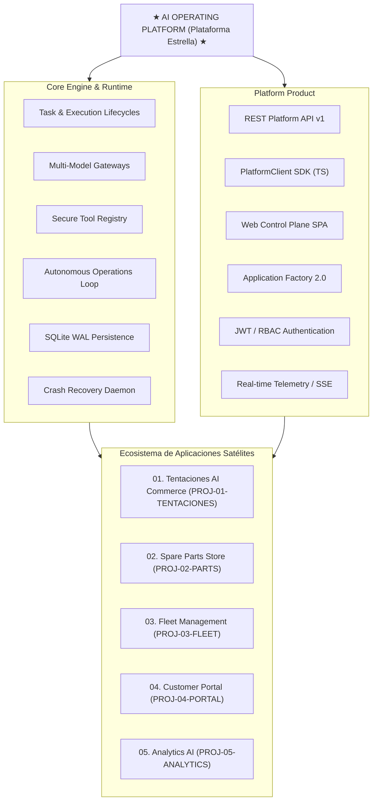

# Visión Estratégica del Producto (v1.4.0)

## 1. ¿Qué es la AI Operating Platform?

La **AI Operating Platform** es una infraestructura operativa fundamental. Sirve para ejecutar, orquestar, persistir, gobernar, observar y exponer capacidades de inteligencia artificial en sistemas empresariales. Es una **plataforma de ingeniería**. No es un chatbot, un patio de pruebas de prompts o un simple envoltorio de proveedor LLM.

---

## 2. Principios Arquitectónicos Centrales

1. **Separación Hexagonal Estricta:** El núcleo del dominio no importa dependencias de infraestructura. Tiene cero SDKs de proveedores y cero controladores de bases de datos. Todas las capacidades externas se consumen mediante puertos de dominio tipados.
2. **Independencia de Proveedor:** Existen adaptadores intercambiables para OpenAI, Anthropic, Google Gemini y demonios Ollama locales. Están respaldados por un enrutador de reserva determinista (`StubModelGateway`).
3. **Gobernanza de Fallo Cerrado (*Default-Deny*):** Toda invocación de herramienta y llamada a modelo requiere una autorización positiva explícita. Las violaciones detienen la ejecución antes del consumo de recursos.
4. **Persistencia Relacional Duradera y Recuperación de Fallos:** Se utiliza SQLite Write-Ahead Logging atómico (`node:sqlite`). Cuenta con control de concurrencia optimista (`version`), rehidratación de agregados inmutables (`Object.freeze`) y conciliación de arranque automatizada mediante el `RestartRecoveryService`.
5. **Topología de Aplicación Desacoplada (Arquitectura A):** Las aplicaciones comerciales independientes viven en sus propios repositorios autónomos. Consumen la inteligencia de la plataforma estrictamente a través de contratos HTTP/SSE autenticados y el SDK `PlatformClient`.
6. **Gobernanza Multi-Empresarial y Organizaciones Virtuales:** Se soportan organizaciones jerárquicas, áreas funcionales y equipos dedicados. Hay cuotas de presupuesto de recursos (tokens, duración, llamadas a herramientas, pasos). Se incluye orquestación de DAG de flujo de trabajo con segregación de funciones (Ejecutor $\neq$ Verificador $\neq$ Aprobador).
