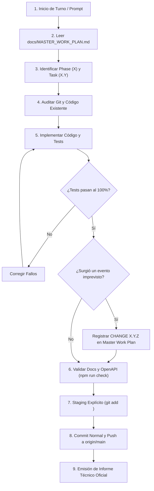

# Protocolo Operativo Canónico para Agentes de IA (Agent Operating Protocol)

> **AI Operating Platform — Guía de Comportamiento, Gobernanza y Ejecución para Agentes y Desarrolladores**  
> **Documento de Referencia Canónica:** `docs/AGENT_OPERATING_PROTOCOL.md`  
> **Línea Base:** v1.4.0 Baseline  
> **Idioma Oficial:** Español Latinoamericano (`es-419`) con identificadores técnicos canónicos en inglés  
> **Última Actualización:** 2026-09-24  

---

## 1. Misión del Protocolo

Este documento establece las directivas permanentes, invariantes de seguridad, jerarquía de verdad y protocolos de ciclo de vida que **TODO agente de IA o desarrollador DEBE seguir obligatoriamente** al interactuar con el repositorio `johangonzahenri/ai-operating-platform`.

---

## 2. Los Diez Mandamientos Operativos del Agente

1. **Consulta Previa Obligatoria**: Antes de realizar cualquier acción o modificación, leer [`docs/MASTER_WORK_PLAN.md`](./MASTER_WORK_PLAN.md), identificar la Fase activa ($X$), la Tarea activa ($X.Y$) y los cambios imprevistos registrados ($X.Y.Z$).
2. **Jerarquía Estricta de Verdad**: La realidad técnica prevalece siempre:
   $$\text{Código en } \texttt{src/} > \text{Tests / Evidencia} > \text{Git} > \text{Docs Oficiales} > \text{Roadmap} > \text{Excel}$$
3. **No Inventar Estados**: Jamás marcar una tarea o iniciativa como `DONE` a menos que exista código fuente funcional, pruebas automatizadas en verde (`npm test`) y evidencia verificable.
4. **Semántica de Indexación de 3 Niveles**:
   - $X$ = Fase (ej. 140)
   - $X.Y$ = Tarea planificada (ej. 140.3)
   - $X.Y.Z$ = Cambio imprevisto, ajuste o descubrimiento (ej. 140.2.1)
   - *Estrictamente prohibido un 4to nivel (ej. $X.Y.Z.W$).*
5. **Inmutabilidad Histórica**: Nunca renumerar, eliminar o reinterpretar retrospectivamente fases o tareas ya cerradas.
6. **Frontera Sagrada de Desacoplamiento (Platform vs Application)**:
   ```text
   AI OPERATING PLATFORM (Core Engine) != SATELLITE APPLICATIONS (Tentaciones, Spare Parts)
   ```
   Las aplicaciones satélites consumen la plataforma exclusivamente a través del SDK `@ai-platform/client` o la API REST/SSE especificada en OpenAPI 3.1. Las aplicaciones **NUNCA** importan archivos de `src/engine/`, `src/domain/`, repositorios SQLite o base de datos de plataforma.
7. **Gobernanza Fail-Closed (Default-Deny)**: Toda operación o acceso sin autenticación/autorización positiva debe rechazarse de inmediato.
8. **Seguridad e Higiene del DOM**: En interfaces de usuario web (SPA), queda estrictamente prohibido el uso de `.innerHTML` o `eval()`. Toda manipulación del DOM debe realizarse con APIs seguras (`textContent`, `createElement`, `setAttribute`, `classList`).
9. **Disciplina Git Rigurosa**:
   - Prohibido el uso de `git commit --amend`, `git push --force` o `git reset --hard`.
   - Staging siempre explícito (`git add <archivos>`), jamás `git add .` a ciegas.
   - Confirmar sincronización remota: `HEAD == origin/main`, working tree 100% limpio.
10. **Checklist Obligatorio de Cierre**: No declarar cerrada ninguna fase sin haber satisfecho las 15 compuertas de calidad del Checklist Global de [`docs/MASTER_WORK_PLAN.md`](./MASTER_WORK_PLAN.md).

---

## 3. Flujo de Trabajo Operativo Paso a Paso



---

## 4. Registro de Cambios Imprevistos (`X.Y.Z`)

Si durante la ejecución de una tarea $X.Y$ surge un hallazgo técnico no planificado, discrepancia documental o adaptación de alcance:

1. **NO** inventar una fase nueva automáticamente.
2. Identificar la tarea $X.Y$ afectada.
3. Crear una entrada formal $X.Y.Z$ en la sección "Cambios Surgidos" de la tarea en [`docs/MASTER_WORK_PLAN.md`](./MASTER_WORK_PLAN.md) utilizando la plantilla oficial:
   ```markdown
   - **X.Y.Z — [Título del Cambio]**:
     - *Tipo*: `CHANGE`
     - *Fecha*: YYYY-MM-DD
     - *Detectado durante*: Tarea X.Y
     - *Origen*: [Causa raíz o descubrimiento]
     - *Motivo*: [Justificación de la necesidad]
     - *Impacto*: [Efecto en código o contratos]
     - *Decisión*: [Resolución adoptada]
     - *Estado*: `DONE`
   ```

---

## 5. Arquitectura del Portafolio Satélite

| Identificador | Proyecto | Repositorio | Tipo | Estado | Rol Arquitectural |
| :--- | :--- | :--- | :--- | :--- | :--- |
| **`PROJ-00`** | AI Operating Platform | `ai-operating-platform` | Parent Platform | `LIVE / BASELINE v1.4` | Núcleo de orquestación, gobernanza, persistencia WAL, API OpenAPI 3.1 y streaming SSE. |
| **`PROJ-01`** | Tentaciones AI Commerce | `tentaciones-ai-commerce` | Satellite App | `LIVE / STABLE` | E-Commerce boutique con recomendación IA y probador virtual AR (congelado / protegido). |
| **`PROJ-02`** | Spare Parts Store | `spare-parts-store` | Satellite App | `PLANNED (Fases 141-149)` | Buscador y comparador inteligente de repuestos automotrices multi-fuente. |
| **`PROJ-03`** | Fleet Management | `fleet-management` | Satellite App | `BACKLOG` | Gestión telemática y optimización de flotas logísticas. |
| **`PROJ-04`** | Customer Portal | `customer-portal` | Satellite App | `BACKLOG` | Portal omnicanal de soporte y triaje autónomo con supervisión humana. |
| **`PROJ-05`** | Analytics AI | `analytics-ai` | Satellite App | `BACKLOG` | Inteligencia ejecutiva, pronósticos y agregación de KPIs sin alucinación. |

---

## 6. Comandos Canónicos de Verificación

```bash
# Compilar TypeScript en modo estricto
npm run build

# Ejecutar suite integral de 1656 pruebas automatizadas
npm test

# Validar integridad estructural del Master Work Plan
npm run plan:check

# Validar contrato formal OpenAPI 3.1
npm run api:check

# Validar consistencia de documentación y fuente de verdad
npm run docs:check

# Ejecutar pipeline completo de verificación
npm run check
```
