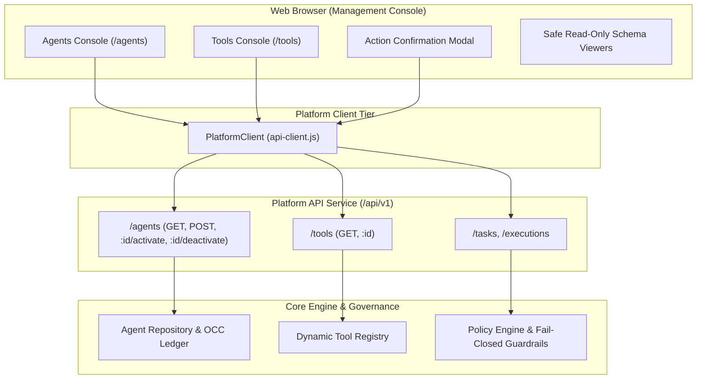

# Agent & Tool Management Console Architecture & Specification

## 1. Executive Summary

The **Agent & Tool Management Console** is the operational surface within Phase 16 that provides comprehensive administration, introspection, and governance over autonomous AI agents and runtime tool capabilities in the **AI Operating Platform**.

In accordance with the fundamental platform invariant:
$$\text{CORE ENGINE} \neq \text{PLATFORM PRODUCT} \neq \text{APPLICATIONS}$$

The Web Management Console operates as a pure client of the public Platform API (`/api/v1` and `/api/platform/v1`) via `PlatformClient`. It never directly accesses backend database layers, execution engines, or internal domain models.

---

## 2. Architecture & Data Flow

---

## 3. Agents Management Console (`/agents`)

### 3.1 Catalog View
- **Multi-Field Filtering & Instant Search**: Live substring filtering across agent name, unique ID, assigned model gateway, and memory partition scope.
- **Status Filtering**: Filter by `ALL`, `ACTIVE`, and `INACTIVE` states.
- **Rich Telemetry Table**: Displays display name, code identifier, status badge, version badge (`v1`, `v2`), model gateway, authorized tool count + chip previews, and memory scope.
- **Direct Administrative Actions**:
  - **View Detail**: Inspect full agent definition, relationship matrix, and execution history.
  - **Activate / Deactivate**: Toggles availability with confirmation modal safeguards to prevent accidental state corruption.

### 3.2 Agent Detail & Capability Inspector (`/agents/:id`)
- **Metadata Summary Grid**: ID, Name, Status, Version, Model Gateway, Memory Scope, and Created Timestamp.
- **Declarative System Prompt Viewer**: High-contrast read-only code display of agent instructions.
- **Agent ↔ Tool Capability Matrix**: Dynamic visual reconciliation comparing the agent's authorized tools ($\checkmark$ Green) against all registered platform tools ($\times$ Muted).
- **Recent Task Activity Ledger**: Chronological table of the latest 5 execution tasks dispatched to this agent.
- **Direct Dispatch Sandbox**: Form to trigger real governed executions via `POST /api/v1/agents/:id/executions`.

---

## 4. Tools Management Console (`/tools`)

### 4.1 Catalog & Capability Matrix
- **Dual Representation**:
  - **Data Table**: Tabular view with tool ID, display name, version, risk level, execution mode, human approval status, and description.
  - **Card Grid**: Modern visual cards with prominent risk badges, mode badges, approval gate tags, and quick-action contract inspection buttons.
- **Advanced Filtering**:
  - **Search**: Case-insensitive search across tool ID, name, description, and version.
  - **Risk Level**: `ALL`, `LOW`, `MEDIUM`, `HIGH`, `CRITICAL`.
  - **Execution Mode**: `ALL`, `READ_ONLY`, `IDEMPOTENT`, `SIDE_EFFECTING`, `DESTRUCTIVE`.

### 4.2 Tool Detail & Safe Schema Inspector (`/tools/:id`)
- **Overview Metrics**: Tool ID, Display Name, Version, Risk Level badge, Execution Mode badge, Human Approval requirement, and Execution Timeout ($ms$).
- **Safe Read-Only Schema Viewers**:
  - **Input Schema**: Clean structural property table (Parameter Name, Type, Required/Optional badge, Description) and formatted JSON code display.
  - **Output Schema**: Contract summary and formatted JSON output structure.
- **Zero Execution from Management UI**: Tools are strictly managed and observed in the Tool Management Console. Invocation only occurs through authorized agents under fail-closed security policies.
- **Audit & Governance Notice**: Explains how tool calls are monotonically tracked and correlated in SQLite WAL storage.

---

## 5. Security Invariants & Frontend Hardening

1. **Zero `innerHTML` / `outerHTML` / `eval`**: All DOM nodes are created with `document.createElement` and text nodes populated via `.textContent` to guarantee zero XSS vulnerability surface.
2. **Fail-Closed State Changes**: Destructive or operational state mutations (e.g. agent deactivation) trigger an explicit modal confirmation dialog.
3. **No Direct Execution Bypass**: Tool execution cannot be triggered without a validated agent context and autonomy budget.
4. **Architectural Isolation**: Client assets import zero internal domain or infrastructure modules.
