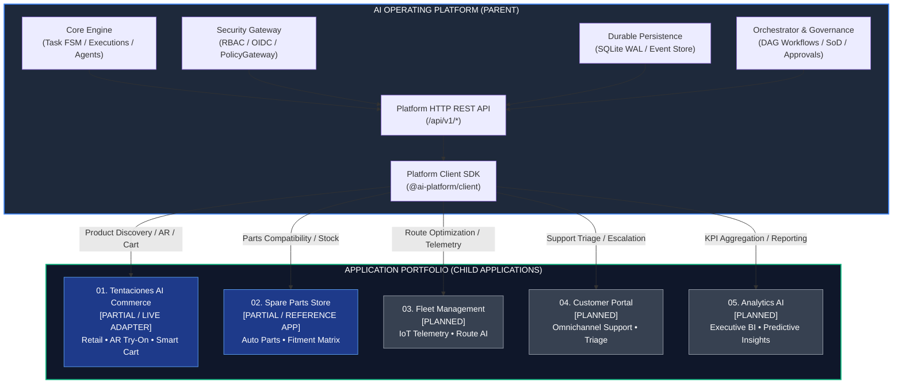

# Mapa Arquitectónico del Portafolio de Aplicaciones (AI Application Portfolio Map)
## Relación Padre-Hijo, Nomenclatura e Integración de Ecosistema

---

## 1. Topología Jerárquica del Ecosistema

```text
========================================================================================
                          AI OPERATING PLATFORM (PARENT / PLATFORM)
                 Motor Central • Persistencia WAL • Gobernanza • API REST
========================================================================================
                                           │
                    ┌──────────────────────┴──────────────────────┐
                    │  Platform HTTP REST API & Security Gateway  │
                    │             (/api/v1/* • Zero-Trust)        │
                    └──────────────────────┬──────────────────────┘
                                           │
                    ┌──────────────────────┴──────────────────────┐
                    │  Platform Client SDK (@ai-platform/client)  │
                    │        Tipado • Fallback • Idempotencia     │
                    └──────────────────────┬──────────────────────┘
                                           │
   ┌───────────────────┬───────────────────┼───────────────────┬───────────────────┐
   │                   │                   │                   │                   │
   ▼                   ▼                   ▼                   ▼                   ▼
┌─────────────┐ ┌─────────────┐ ┌─────────────┐ ┌─────────────┐ ┌─────────────┐
│ 01. COMMERCE│ │ 02. PARTS   │ │ 03. FLEET   │ │ 04. PORTAL  │ │ 05. ANALYTICS│
│ Tentaciones │ │ Spare Parts │ │ Fleet Mgmt  │ │ Customer    │ │ Analytics AI│
│ AI Commerce │ │ Store       │ │ & Logistics │ │ Portal & Bot│ │ & BI Exec   │
└─────────────┘ └─────────────┘ └─────────────┘ └─────────────┘ └─────────────┘
```

---

## 2. Diagramas de Arquitectura (Mermaid)

### 2.1. Mapa Jerárquico del Portafolio



### 2.2. Flujo de Invocación Canónico (Application → Core Engine)

```mermaid
flowchart LR
    subgraph CHILD["Child Application"]
        UI["Application UI / Storefront"]
        AppEngine["App Business Logic"]
        UI --> AppEngine
    end

    subgraph INTEGRATION["Integration Boundary"]
        AppAdapter["App Platform Adapter<br/>(e.g., TentacionesAdapter)"]
        SDK["PlatformClient SDK<br/>(@ai-platform/client)"]
        AppEngine --> AppAdapter
        AppAdapter --> SDK
    end

    subgraph REST_API["Platform Boundary"]
        HTTPRouter["HTTP REST Router<br/>(/api/v1)"]
        PolicyGate["PolicyGateway & RBAC"]
        SDK -->|HTTP / TLS / Bearer Token| HTTPRouter
        HTTPRouter --> PolicyGate
    end

    subgraph CORE["Parent Platform Engine"]
        TaskEngine["Task & Execution FSM"]
        MultiAgent["Agent Coordinator"]
        SQLite["SQLite WAL & Event Store"]
        PolicyGate --> TaskEngine
        TaskEngine --> MultiAgent
        TaskEngine --> SQLite
    end

    style CHILD fill:#1e293b,stroke:#3b82f6,color:#ffffff
    style INTEGRATION fill:#0f172a,stroke:#8b5cf6,color:#ffffff
    style REST_API fill:#064e3b,stroke:#10b981,color:#ffffff
    style CORE fill:#312e81,stroke:#6366f1,color:#ffffff
```



---

## 3. Matriz de Repositorios y Nomenclatura

| ID Proyecto | Nombre Canónico | Repositorio Local | Repositorio GitHub Propuesto | Estado Actual | Integración Plataforma |
| :--- | :--- | :--- | :--- | :--- | :--- |
| **PROJ-00-PLATFORM** | `ai-operating-platform` | `IA_Work/` | `johangonzahenri/ai-operating-platform` | **`IMPLEMENTED`** (v1.4.0) | Plataforma Padre (Core Engine + API + Web UI) |
| **PROJ-01-TENTACIONES** | `tentaciones-ai-commerce` | `src/application/platform/` | `johangonzahenri/tentaciones-ai-commerce` | **`PARTIAL`** (Adapter + Engine) | `TentacionesPlatformAdapter` + Webpay Demo + AR |
| **PROJ-02-SPAREPARTS** | `spare-parts-store` | `tests/unit/vehicle-parts*` | `johangonzahenri/spare-parts-store` | **`PARTIAL`** (Reference App) | `PlatformClient` + Compatibility Engine |
| **PROJ-03-FLEET** | `fleet-management` | Por crear | `johangonzahenri/fleet-management` | **`PLANNED`** | IoT Agent Coordinator + Route Optimizer |
| **PROJ-04-PORTAL** | `customer-portal` | Por crear | `johangonzahenri/customer-portal` | **`PLANNED`** | Support Agent Profile + Triage Workflows |
| **PROJ-05-ANALYTICS** | `analytics-ai` | Por crear | `johangonzahenri/analytics-ai` | **`PLANNED`** | Executive Metric Harvester + Reporting Service |

---

## 4. Convenciones de Nomenclatura Estandarizadas

Para evitar ambigüedades técnicas y mantener consistencia en CI/CD, despliegues y documentación:

* **Repository Name**: Formato `kebab-case` minúsculo sin prefijos numéricos (ej. `tentaciones-ai-commerce`).
* **Application ID**: Identificador kebab-case sin espacios utilizado en headers de API y JWT scopes (ej. `tentaciones-commerce`, `spare-parts-store`).
* **Project ID**: Formato `PROJ-XX-NOMBRE` para seguimiento en Tableros Kanban y Roadmap Maestro (ej. `PROJ-01-TENTACIONES`).
* **Tenant ID**: Formato `tenant-<app-slug>` para particionamiento estricto en SQLite WAL (ej. `tenant-tentaciones`, `tenant-spareparts`).
* **Documentation ID**: Formato `DOC-APP-XX` vinculado al registro canónico `docs/APPLICATION_REGISTRY.md`.

---

## 5. Estrategia de Repositorios (Separated Repos vs Monorepo)

### Comparativa Arquitectónica:

| Criterio | Repositorios Separados (Polyrepo) | Monorepo / Workspaces | Decisión para el Portafolio |
| :--- | :--- | :--- | :--- |
| **Aislamiento de Código** | Total: Las aplicaciones hijas no pueden importar accidentalmente código interno del Core Engine. | Medio: Requiere linters estrictos para evitar acoplamiento indebido. | **Polyrepo** (Garantiza el desacoplamiento estricto de la plataforma). |
| **Visibilidad de Portafolio** | Alta: Cada repositorio en GitHub muestra un producto claro con su propio README y demo. | Concentrada: Toda la solución está en un solo repo grande. | **Polyrepo** (Óptimo para portafolio profesional y demos comerciales). |
| **Ciclo de Versiones** | Independiente: Cada app avanza de versión sin forzar bumps en la plataforma. | Sincronizado o complejo: Requiere herramientas pesadas como Lerna/Turborepo. | **Polyrepo** (SemVer desacoplado). |
| **CI/CD y Despliegues** | Pipelines ligeros y aislados por proyecto. | Pipelines largos que reconstruyen múltiples paquetes. | **Polyrepo** (Despliegues rápidos y fallos contenidos). |
| **Consumo del SDK** | Vía paquete `@ai-platform/client` o submodule git. | Vía workspace references (`workspace:*`). | **Polyrepo** (Fuerza el uso de contratos REST públicos). |

**Decisión Oficial**: Estrategia **Multi-Repository (Polyrepo)** para aplicaciones comerciales, manteniendo `ai-operating-platform` como el repositorio padre de infraestructura y gobernanza.

---

## 6. Hoja de Ruta Conceptual del Portafolio

```text
Fase 82: Formalización del Portafolio & Project Factory Map [COMPLETADA]
   │
   ├─► Fase 83: Project 01 — Tentaciones AI Commerce (Standalone App Setup & UI Storefront)
   │
   ├─► Fase 84: Project 02 — Spare Parts Store (Standalone App Setup & Parts Catalog)
   │
   ├─► Fase 85: Project 03 — Fleet Management (IoT Telemetry & Route Optimization)
   │
   ├─► Fase 86: Project 04 — Customer Portal (Omnichannel Helpdesk & Ticket Triage)
   │
   └─► Fase 87: Project 05 — Analytics AI (Executive BI & Real-Time Reporting Hub)
```
