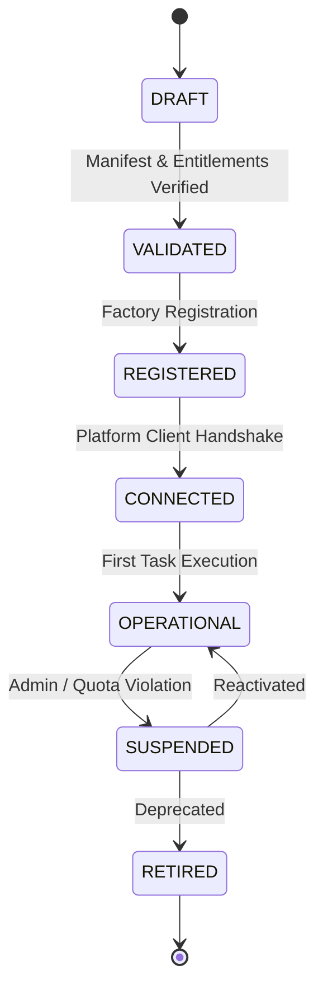

# AI Application Factory — Architecture & Developer Guide

> **Standardized generation, validation, entitlement governance, and lifecycle management for AI Operating Platform consumer applications.**

---

## 1. Overview & Architectural Principle

The **AI Application Factory** enables software teams to build and onboard new domain-specific AI applications on top of the AI Operating Platform with **zero modifications to Core Engine internals**:

$$\text{CORE ENGINE} \neq \text{PLATFORM PRODUCT} \neq \text{APPLICATIONS} \neq \text{EXTERNAL SERVICES}$$

- **The Platform Owns:** Autonomous task orchestration, multi-agent planning, model routing with dynamic fallback, tool execution sandboxes, default-deny RBAC, tenant isolation, and crash-resilient event persistence.
- **The Application Owns:** Domain business entities, customer catalogs, user experience, shopping carts, and domain-specific state machines.

---

## 2. Application Skeleton & Templates

The factory generates a complete, production-ready application skeleton containing:

```text
generated-application/
├── application.json             # Validated Application Manifest
├── src/
│   ├── adapter.ts              # Typed PlatformClient integration
│   ├── health.ts               # Health & readiness probe contracts
│   ├── observability.ts        # Correlation & trace context propagation
│   └── index.ts                # Application entry point
├── tests/
│   └── integration.test.ts     # Health & contract verification test
└── README.md                   # Developer onboarding instructions
```

---

## 3. Application Manifest Schema (`application.json`)

```json
{
  "applicationId": "vehicle-parts-platform",
  "name": "Vehicle Parts & Diagnostics Platform",
  "version": "1.0.0",
  "runtime": "node",
  "capabilities": [
    "product.discovery",
    "product.recommendation",
    "product.compare",
    "cart.assistance"
  ],
  "requiredFeatures": ["tasks", "executions"],
  "tenantRequirements": {
    "minPlan": "PRO",
    "requiredCapabilities": ["product.discovery"]
  },
  "minimumPlatformVersion": "1.1.0",
  "environment": "production"
}
```

### Manifest Validation Rules
The `ApplicationValidator` rejects any candidate manifest violating security invariants:
1. **Invalid ID:** Must match `^[a-z0-9_-]{3,64}$`.
2. **Invalid SemVer:** Must follow semantic versioning (`1.0.0`).
3. **Empty Capabilities:** Must declare at least one platform capability.
4. **Secret Leakage Prevention:** Disallows any credential keywords (`password`, `secret`, `sk-`, `bearer `, `private_key`).

---

## 4. Capability Entitlement Hierarchy

Capabilities are governed through a multi-tier entitlement hierarchy:

$$\text{Application} \longrightarrow \text{Tenant} \longrightarrow \text{Plan (FREE / PRO / BUSINESS / ENTERPRISE)} \longrightarrow \text{Capability Risk Tier} \longrightarrow \text{Policy Gateway}$$

| Capability ID | Domain Category | Risk Tier | Required Plan | Authorized Endpoints |
| :--- | :--- | :--- | :--- | :--- |
| `product.discovery` | `COMMERCE` | `LOW` | `FREE` | `POST /api/v1/tasks`, `POST /api/v1/orchestrate` |
| `product.recommendation` | `COMMERCE` | `LOW` | `FREE` | `POST /api/v1/tasks`, `POST /api/v1/orchestrate` |
| `product.compare` | `COMMERCE` | `LOW` | `FREE` | `POST /api/v1/tasks` |
| `cart.assistance` | `COMMERCE` | `MEDIUM` | `FREE` | `POST /api/v1/tasks` |
| `ar.fitting_room` | `AR_3D` | `MEDIUM` | `PRO` | `POST /api/v1/tasks`, `GET /api/v1/tools` |
| `automation.execute` | `AUTOMATION` | `HIGH` | `PRO` | `POST /api/v1/operations`, `POST /api/v1/tasks` |
| `report.generate` | `CORE` | `LOW` | `BUSINESS` | `GET /api/v1/metrics`, `GET /api/v1/events` |

---

## 5. Application Test Harness (7 Criteria Gate)

Before an application transitions to `REGISTERED` or `OPERATIONAL`, it must pass the `ApplicationTestHarness`:

1. **Identity:** Valid identifier conforming to system naming rules.
2. **Authentication:** Valid API Key or Service Token bound to an active tenant.
3. **Authorization:** Tenant plan entitles all requested capabilities.
4. **Capabilities:** Valid cataloged capability definitions.
5. **Health:** Responding health probe with component status.
6. **Version:** SemVer compatibility with current platform runtime.
7. **Observability:** Explicit propagation of `applicationId`, `tenantId`, `requestId`, and `correlationId`.

---

## 6. Application Lifecycle States



- **`SUSPENDED` / `RETIRED` State Security:** When an application is suspended, all capability access is revoked immediately fail-closed.
