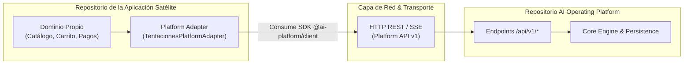

# Guía de Integración para Aplicaciones Satélites (Application Integration Guide)

Esta guía establece el contrato canónico de integración para construir, validar y conectar aplicaciones satélites independientes con la **AI Operating Platform**.

---

## 1. Topología y Principio de Desacoplamiento

Toda aplicación satélite (como `01. Tentaciones AI Commerce` o `02. Spare Parts Store`) debe operar bajo el principio de **soberanía de dominio**:



### Lo que la Aplicación Satélite Conserva:
* Sus propias bases de datos (catálogo, clientes, órdenes de compra).
* Su propia lógica de checkout, carritos e inventarios.
* Su propia interfaz de usuario y pasarelas de pago.

### Lo que la Plataforma Provee:
* Inteligencia de búsqueda y recomendación multimodal.
* Orquestación de agentes autónomos y flujos de trabajo DAG.
* Control de cuotas y auditoría forense con sellado criptográfico.

---

## 2. Paso a Paso de Integración

### Paso 1: Manifiesto de la Aplicación (`manifest.json`)
La aplicación declara sus capacidades requeridas y metadatos:
```json
{
  "applicationId": "app-tentaciones-01",
  "name": "Tentaciones AI Commerce",
  "version": "1.8.1",
  "category": "E-Commerce",
  "tenantId": "tenant-enterprise-01",
  "capabilities": [
    "product.discovery",
    "product.recommendation",
    "cart.assistance",
    "ar.fitting"
  ],
  "minimumPlatformVersion": "1.4.0"
}
```

### Paso 2: Creación del Adaptador de Plataforma
```typescript
import { createPlatformClient, PlatformClient } from "@ai-platform/client";

export class TentacionesPlatformAdapter {
  private readonly client: PlatformClient;

  constructor(options: { baseUrl: string; apiKey?: string; tenantId?: string }) {
    this.client = createPlatformClient({
      baseUrl: options.baseUrl,
      apiKey: options.apiKey,
      tenantId: options.tenantId ?? "tenant-enterprise-01",
      applicationId: "app-tentaciones-01",
    });
  }

  async discoverProducts(naturalQuery: string): Promise<any> {
    const task = await this.client.tasks.create({
      agentId: "fashion-discovery-agent",
      input: { query: naturalQuery },
    });

    const execution = await this.client.tasks.execute(task.taskId);
    return execution.result;
  }
}
```

### Paso 3: Arnés de Validación de Cumplimiento (`ApplicationHarness`)
Antes de desplegar en producción, ejecute las pruebas de conformidad con el arnés:
1. `identity`: Manifiesto válido con versión semántica.
2. `authentication`: Cabeceras de autenticación válidas.
3. `capabilities`: Compatibilidad demostrada en la matriz de capacidades.
4. `observability`: Correlación de `traceId` en todas las interacciones.

---

## 3. Ejemplo Canónico de Referencia

Consulte el código de referencia en:
* Repositorio oficial satélite: `https://github.com/johangonzahenri/tentaciones-ai-commerce`
* Ejemplo mínimo funcional en este repositorio: `examples/hello-ai-application/`
