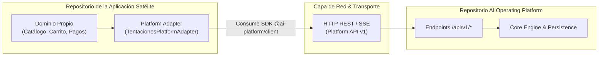

# Guía de Integración para Aplicaciones Satélites (Application Integration Guide)

Esta guía establece el contrato canónico de integración para construir, validar y conectar aplicaciones satélites independientes con la **AI Operating Platform**.

---

## 1. Topología y Principio de Desacoplamiento

Toda aplicación satélite (como `01. Tentaciones AI Commerce` o `02. Spare Parts Store`) debe operar bajo el principio de **soberanía de dominio**:



### Lo que la Aplicación Satélite Conserva:
* Sus propias bases de datos (catálogo, clientes, órdenes de compra).
* Su propia lógica de checkout, carritos e inventarios.
* Su propia interfaz de usuario y pasarelas de pago.

### Lo que la Plataforma Provee:
* Inteligencia de búsqueda y recomendación multimodal.
* Orquestación de agentes autónomos y flujos de trabajo DAG.
* Control de cuotas y auditoría forense con sellado criptográfico.

---

## 2. Paso a Paso de Integración

### Paso 1: Manifiesto de la Aplicación (`manifest.json`)
La aplicación declara sus capacidades requeridas y metadatos:
```json
{
  "applicationId": "app-tentaciones-01",
  "name": "Tentaciones AI Commerce",
  "version": "1.8.1",
  "category": "E-Commerce",
  "tenantId": "tenant-enterprise-01",
  "capabilities": [
    "product.discovery",
    "product.recommendation",
    "cart.assistance",
    "ar.fitting"
  ],
  "minimumPlatformVersion": "1.4.0"
}
```

### Paso 2: Creación del Adaptador de Plataforma
```typescript
import { createPlatformClient, PlatformClient } from "@ai-platform/client";

export class TentacionesPlatformAdapter {
  private readonly client: PlatformClient;

  constructor(options: { baseUrl: string; apiKey?: string; tenantId?: string }) {
    this.client = createPlatformClient({
      baseUrl: options.baseUrl,
      apiKey: options.apiKey,
      tenantId: options.tenantId ?? "tenant-enterprise-01",
      applicationId: "app-tentaciones-01",
    });
  }

  async discoverProducts(naturalQuery: string): Promise<any> {
    const task = await this.client.tasks.create({
      agentId: "fashion-discovery-agent",
      input: { query: naturalQuery },
    });

    const execution = await this.client.tasks.execute(task.taskId);
    return execution.result;
  }
}
```

### Paso 3: Arnés de Validación y Certificación de 9 Puntos (`runReferenceAppCertification`)
Antes de desplegar en producción, ejecute las pruebas de conformidad y certificación evaluando las 9 dimensiones canónicas:
1. `identity`: Manifiesto válido con `applicationId`, `tenantId`, `name`, y versión semántica.
2. `health`: Sondeo de salud plataforma (`/api/v1/health`) retornando estado `HEALTHY`.
3. `authentication`: Cabeceras de autenticación válidas (`Authorization: Bearer <token>` o `X-API-Key: <key>`).
4. `authorization`: Resolución de entitlements y contexto de seguridad del tenant.
5. `capabilities`: Verificación de que todas las capacidades declaradas en el manifiesto estén activas en el catálogo (`/api/v1/capabilities`).
6. `version`: Validación de compatibilidad semántica contra `minimumPlatformVersion`.
7. `observability`: Propagación estricta de `traceId` en todas las interacciones de tareas y operaciones.
8. `openApi`: Alineación 1:1 con contratos formales OpenAPI 3.1 (`docs/openapi.yaml`).
9. `sse`: Consumo de eventos en tiempo real mediante SSE (`/api/v1/events/stream`) con filtrado por tenant y reconexión resiliente con `Last-Event-ID`.

---

## 3. Invariantes Arquitecturales y Reglas de Integración

### Lo que las Aplicaciones Externas DEBEN hacer (SHOULD / MUST):
* **MUST**: Consumir la plataforma exclusivamente a través del SDK oficial `@ai-platform/client` o contratos OpenAPI 3.1 REST/SSE.
* **MUST**: Utilizar `create-aop-app init` para inicializar el proyecto y `create-aop-app doctor` para validar el manifiesto antes de desplegar.
* **MUST**: Incluir `traceId` en todas las llamadas y suscribirse a eventos en tiempo real usando el canal SSE con `tenantId` y `applicationId`.
* **SHOULD**: Mantener un `LiveEventManager` desacoplado con buffer circular para absorber picos de eventos y sanitizar datos sensibles en cliente.

### Lo que las Aplicaciones Externas NUNCA DEBEN hacer (MUST NOT):
* **MUST NOT**: Importar módulos internos de la plataforma (`src/engine/*`, `src/domain/*`, repositorios, bases de datos o stores internos).
* **MUST NOT**: Modificar el esquema de base de datos de la plataforma ni asumir persistencia compartida.
* **MUST NOT**: Conectarse a servicios de la plataforma eludiendo la autenticación y las políticas del Security Context.

---

## 4. Aplicación de Referencia Canónica (`examples/reference-consumer/`)

La plataforma provee una aplicación de referencia completamente certificada e interactiva:

* **Directorio**: `examples/reference-consumer/`
* **Manifiesto**: `examples/reference-consumer/application.json`
* **Adaptador Tipado**: `examples/reference-consumer/src/adapter.ts` (`ReferenceConsumerPlatformAdapter`)
* **Gestor de Eventos SSE**: `examples/reference-consumer/src/live-events.ts` (`LiveEventManager`)
* **Motor de Certificación**: `examples/reference-consumer/src/certification.ts` (`runReferenceAppCertification`)
* **Dashboard Web**: Accesible en runtime en `/reference-app` o `/reference-consumer`.

Para ejecutar la verificación:
```bash
# Validar manifiesto
node dist/src/platform-client/create-aop-app.js doctor examples/reference-consumer/application.json

# Ejecutar suite de pruebas de certificación
node --test dist/tests/contract/reference-consumer-certification.test.js
```
