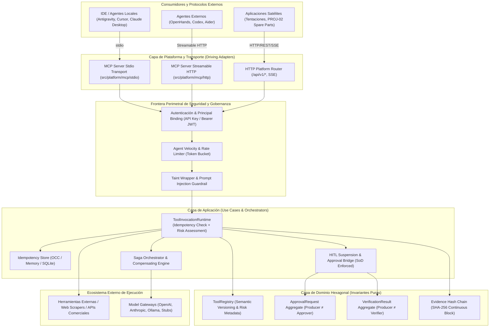
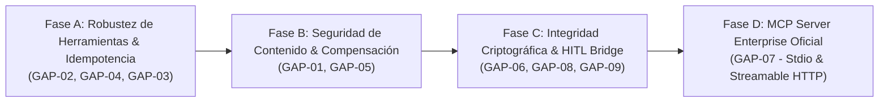

# Transversal Architectural Audit & Hardening Plan
## AI Operating Platform — Multi-Agent Runtime, MCP, HITL, Tool Governance, Evidence & Security

> **Documento Canónico de Auditoría y Directivas de Hardening Arquitectónico**  
> **Autoridad:** Principal Software Architect / Enterprise AI Systems Architect / Security Architect  
> **Línea Base del Sistema:** v1.4.0 Baseline (`HEAD` commit `64ed25424a4df40e50609bb00601ecae0c8cfa19`)  
> **Fecha de Emisión:** 2026-09-25  
> **Estado:** VIGENTE / FORMALIZADO  
> **Referencia en Plan Maestro:** Tarea `1.1.2` (`docs/MASTER_WORK_PLAN.md`)

---

## 1. Resumen Ejecutivo

Durante la revisión estratégica transversal de la **AI Operating Platform**, se contrastaron un conjunto de propuestas de mejora recibidas desde auditorías externas contra la realidad fáctica del código fuente (`src/`), los tests automatizados (`tests/`, 1754 tests passing al 100%), las especificaciones OpenAPI 3.1 (`docs/openapi.yaml`) y la arquitectura hexagonal vigente.

El repositorio exhibe una madurez técnica excepcional:
- **Segregación estricta de funciones (SoD)**: Los agregados `ApprovalRequest` y `VerificationResult` ya aplican `SelfVerificationError` y `SelfApprovalError` a nivel de invariante de dominio inmutable (Producer ≠ Verifier ≠ Approver).
- **Herramientas tipadas y versionadas**: `ToolRegistry` ya soporta registro y resolución multi-versión (`findById(id, version)`), políticas de riesgo (`LOW`, `MEDIUM`, `HIGH`, `CRITICAL`) y timeout adaptativo.
- **Idempotencia perimetral y de servicios**: El HTTP Router, el motor de impresión Brother, el exportador de evidencia y la conciliación de mandatos ya usan tokens de idempotencia.
- **Defensa en profundidad y sandbox**: `GovernedModelRouter` filtra inyecciones regex, el `WebToolGateway` aísla URLs locales (SSRF protection) y el control de presupuesto (`AutonomyBudget`, `TeamResourceBudget`) rige el consumo acumulado de tokens, llamadas a modelos y tools.

Sin embargo, **se han confirmado 9 brechas arquitectónicas objetivas** que requieren formalización y blindaje enterprise antes de la adopción masiva de satélites y protocolos abiertos como MCP (Model Context Protocol). Ninguna de estas brechas requiere invalidar el trabajo completado; todas se integran como un plan ordenado y no disruptivo en el Plan Maestro Operativo (`docs/MASTER_WORK_PLAN.md`, Tarea `1.1.2`).

---

## 2. Metodología de Auditoría y Criterio de Verdad

En estricta conformidad con `docs/SOURCE_OF_TRUTH.md`:
$$\text{Código Fuente en } src/ > \text{Tests Automatizados} > \text{Historial Git} > \text{Documentación} > \text{Roadmap}$$

1. **Inspección de Código**: Verificación manual y estática de tipos, clases, métodos y decoradores en `src/domain/`, `src/application/`, `src/infrastructure/` y `src/platform/`.
2. **Contraste con Protocolos Reales**: Contraste con el estándar oficial de **Model Context Protocol (MCP)** al estado del arte 2026 (especificación 2026-07-28, SDK TypeScript v2 modular `@modelcontextprotocol/server` y `@modelcontextprotocol/client` basados en Node Streamable HTTP y stdio).
3. **Clasificación Rigurosa**:
   - `ALREADY_IMPLEMENTED`: La capacidad ya existe en el código y está validada por tests.
   - `PARTIALLY_COVERED`: Existen fundamentos o mecanismos similares, pero falta completar la cobertura formal.
   - `CONFIRMED_GAP`: Brecha real comprobada; el código no posee la protección o funcionalidad reclamada.
   - `NOT_APPLICABLE / REJECTED`: Sugerencia que viola los 8 principios de ingeniería del repositorio (ej. dependencias terceras en Core o bypass de arquitectura hexagonal).

---

## 3. Matriz de Brechas Confirmadas vs Estado Real

| ID | Área / Dimensión | Aseveración / Propuesta | Realidad en Código | Clasificación | Prioridad |
| :--- | :--- | :--- | :--- | :--- | :--- |
| **GAP-01** | Prompt Injection & Taint Tracking | Los datos externos fluyen a los agentes sin separación estricta de instrucción y datos. | `GovernedModelRouter` tiene filtros regex (`ignore all previous instructions`), pero no existe etiquetado de procedencia (*taint tracking*) para datos ingeridos por herramientas web/scraping que pasan entre agentes. | `CONFIRMED_GAP` | **HIGH** |
| **GAP-02** | Tool Idempotency & Replay Cache | Las herramientas carecen de protección contra re-ejecución en reintentos y timeouts. | `ToolRequest` y `ToolExecutionContext` reciben y propagan `idempotencyKey`, pero `ToolInvocationRuntime` **NO ejecuta deduplicación previa a `tool.execute()`**. Si una llamada se reintenta, el efecto secundario se ejecuta dos veces. | `CONFIRMED_GAP` | **CRITICAL** |
| **GAP-03** | Agent Velocity & Blast Radius | Los agentes pueden generar bucles rápidos de llamadas a herramientas externas. | `TeamResourceBudget` y `AutonomyBudget` controlan cuotas acumuladas (total tokens, total tool calls), pero carecen de limitador de velocidad (*sliding window burst rate limit*) por agente para llamadas a terceros. | `CONFIRMED_GAP` | **HIGH** |
| **GAP-04** | Tool Semantic & Schema Versioning | Falta política semántica de evolución de esquemas y anotaciones de ejecución en herramientas. | `ToolRegistry` maneja versiones string (`"1.0.0"`), pero falta `schemaVersion`, validación de breaking changes y anotaciones explícitas de comportamiento (`readOnlyHint`, `destructiveHint`, `idempotentHint`, `openWorldHint`). | `PARTIALLY_COVERED` | **MEDIUM** |
| **GAP-05** | Saga / Compensación Distribuida | No hay compensación ante fallos en planes multi-paso. | El motor `PlanExecutionEngine` y `WorkflowOrchestratorService` marcan fallos de forma segura (fail-closed), pero no orquestan reversiones compensatorias automáticas para herramientas con efectos colaterales. | `CONFIRMED_GAP` | **HIGH** |
| **GAP-06** | Integridad Criptográfica de Evidencia | Los paquetes de evidencia no demuestran continuidad temporal encadenada. | `EvidenceExportManifest` genera un checksum SHA-256 canónico del paquete actual, pero no implementa encadenamiento criptográfico (`previousPackageHash`) para auditar omisión o reordenamiento cronológico de auditorías. | `CONFIRMED_GAP` | **MEDIUM** |
| **GAP-07** | Protocolo MCP y Fronteras de Plataforma | Se requiere exponer herramientas y prompts vía MCP sin romper los límites de Core. | El repositorio cuenta con cero dependencias de MCP. La especificación oficial es 2026-07-28 y el SDK v2 (`@modelcontextprotocol/server`) debe situarse en la capa de Plataforma/Producto, consumiendo puertos de aplicación sin tocar el dominio. | `CONFIRMED_GAP` | **HIGH** |
| **GAP-08** | HITL & Segregación de Funciones (SoD) | Se debe evitar que quien produce una acción sea quien la verifique o apruebe. | **Ya implementado en Core**: `SelfVerificationError` y `SelfApprovalError` se evalúan en dominio inmutable. Falta únicamente el puente de suspensión asíncrona hacia protocolos externos (e.g., `input_required` en MCP / eventos SSE). | `ALREADY_IMPLEMENTED` (Core SoD) / `PARTIALLY_COVERED` (Async Bridge) | **MEDIUM** |
| **GAP-09** | Observabilidad & Trazabilidad W3C | Falta propagación de trazas distribuidas interoperables entre procesos. | El contexto del sistema propaga `traceId`, `requestId` y `correlationId`, pero no implementa serialización y deserialización estándar W3C Trace Context (`traceparent` y `tracestate`). | `PARTIALLY_COVERED` | **MEDIUM** |

---

## 4. Auditoría Detallada por Dimensión

### 4.1. Gobernanza de Herramientas y Evolución de Esquemas (GAP-04)
- **Realidad**: `src/domain/tools/tool-registry.ts` define `ToolDefinition` con `id`, `name`, `description`, `version?: string`, `inputSchema`, `outputSchema`, `permissions`, `riskLevel` (`LOW`, `MEDIUM`, `HIGH`, `CRITICAL`), `executionMode`, `timeoutMs`, `requiresApproval`, `metadata`. Soporta registro concurrente de versiones y resolución determinista (`findById(id, version)`).
- **Brecha Confirmada**: La evolución de esquemas JSON Schema no valida compatibilidad hacia atrás. Una herramienta que altere un campo obligatorio en una versión menor puede romper planes almacenados. Se requiere una política semántica estricta (`MAJOR.MINOR.PATCH`) donde `MAJOR` indica ruptura de esquema, y la adición de hints semánticos para modelos de lenguaje:
  - `readOnlyHint: boolean` (la herramienta solo lee datos, sin mutación externa).
  - `destructiveHint: boolean` (la herramienta elimina, muta irreversiblemente o transacciona valor monetario).
  - `idempotentHint: boolean` (la herramienta garantiza el mismo resultado ante el mismo input y clave).
  - `openWorldHint: boolean` (la herramienta interactúa con la internet pública o entidades de confianza variable).

### 4.2. Idempotencia y Replay Protection en Runtime (GAP-02)
- **Realidad**: `ToolRequest` y `ToolExecutionContext` contienen `idempotencyKey?: string`. El HTTP Router (`src/platform/api/idempotency-engine.ts`) y `DeviceService` usan almacenes de idempotencia.
- **Brecha Confirmada**: `ToolInvocationRuntime.invokeTool()` (`src/application/tools/tool-invocation-runtime.ts`) recibe la solicitud pero **no consulta un `IdempotencyStore` antes de ejecutar `tool.execute()`**. Si un agente reintenta una herramienta de red o de base de datos debido a un timeout transitorio de red, la operación se ejecuta nuevamente en destino.
- **Recomendación Enterprise**: Integrar `IdempotencyPort` en `ToolInvocationRuntime`. Si la clave de idempotencia ya fue procesada exitosamente dentro del TTL, retornar inmediatamente el `ToolInvocationResult` en caché con metadata `cachedReplay: true`. Si está en ejecución activa (`IN_FLIGHT`), denegar invocación concurrente concurrente conflictiva (`409 Conflict / ConcurrencyError`).

### 4.3. Blast Radius y Rate Limiting por Agente (GAP-03)
- **Realidad**: `TeamResourceBudget` (`src/application/organization/team-resource-budget-service.ts`) rastrea presupuestos agregados acumulativos (`maxTokens`, `maxCostUSD`, `maxToolInvocations`). El HTTP Router cuenta con `RateLimiter` para peticiones HTTP entrantes.
- **Brecha Confirmada**: No existe un limitador de velocidad de ventana deslizante (*sliding window token bucket*) asignado a cada agente individual para sus llamadas de salida. Un bucle infinito en un agente autónomo puede agotar 10,000 llamadas a una API externa en 30 segundos antes de que el presupuesto global diario detenga la operación, provocando bloqueos de IP o cargos elevados por ráfaga.
- **Recomendación Enterprise**: Implementar `AgentVelocityLimiter` con algoritmo leaky/token bucket por instancia de agente (e.g., máximo 10 llamadas a herramientas por minuto y máximo 2 llamadas destructivas por minuto).

### 4.4. Aislamiento de Datos, Taint Tracking e Inyección de Prompts (GAP-01)
- **Realidad**: `GovernedModelRouter` filtra patrones conocidos de inyección de prompts (`ignore all previous instructions`, etc.) y limita el tamaño del prompt.
- **Brecha Confirmada**: Los datos devueltos por conectores web (`WebToolGateway`), scraping de repuestos o APIs de terceros entran a la memoria del agente como texto plano. No existe discriminación estructural entre instrucciones de sistema y contenido no confiable (*untrusted external payload*). Un atacante que controle una página web scrapeda puede inyectar texto malicioso que el agente interprete como orden ejecutiva.
- **Recomendación Enterprise**: Implementar un envoltorio de frontera (*Taint Wrapper*): todo output de herramientas con `openWorldHint = true` debe encapsularse en bloques delimitados con metadatos de procedencia (`<untrusted_external_content provenance="web_tool" sha256="...">...</untrusted_external_content>`) y etiquetarse con nivel de confianza `UNTRUSTED_EXTERNAL`, impidiendo su paso directo al contexto del sistema del planificador.

### 4.5. Arquitectura de Compensación / Saga para Operaciones Multi-Paso (GAP-05)
- **Realidad**: `PlanExecutionEngine` y `WorkflowOrchestratorService` ejecutan pasos secuenciales o en DAG. Ante un error en el paso $K$, la ejecución se detiene y se registra el estado `FAILED`.
- **Brecha Confirmada**: Si los pasos $1$ a $K-1$ ejecutaron mutaciones (e.g., reservar repuesto en almacén, bloquear fondos, enviar correo), el sistema queda en un estado inconsistente. No existe registro de acciones de compensación (*compensating actions*) ni orquestador de Saga.
- **Recomendación Enterprise**: Formalizar el contrato `CompensableTool`:
  ```typescript
  export interface CompensableTool<TInput, TOutput, TCompensationInput> extends Tool<TInput, TOutput> {
    compensate(context: ToolExecutionContext, input: TCompensationInput): Promise<ToolInvocationResult>;
  }
  ```
  El planificador debe registrar un log transaccional de compensación (Saga Log inmutable en SQLite). Ante un fallo, el orquestador invoca la reversión en orden inverso ($K-1 \dots 1$).

### 4.6. Integridad Criptográfica y Encadenamiento de Evidencia (GAP-06)
- **Realidad**: `EvidenceExportService` calcula el hash SHA-256 de cada paquete exportado (`EvidenceExportManifest.checksumSha256`).
- **Brecha Confirmada**: Los paquetes son autónomos. Un actor malicioso con acceso a la base de datos o al almacenamiento de archivos podría eliminar un paquete de evidencia intermedio (e.g., el paquete del día martes) sin que el paquete del día miércoles evidencie la falta del paquete previo.
- **Recomendación Enterprise**: Implementar encadenamiento de bloques criptográficos (*Evidence Hash Chain*): cada manifiesto de exportación debe incluir `previousPackageHashSha256` y `packageSequenceNumber`, permitiendo a los auditores verificar la inmutabilidad y continuidad cronológica estricta de toda la historia de auditoría de la plataforma.

### 4.7. Protocolo MCP (Model Context Protocol) y Fronteras Hexagonales (GAP-07)
- **Realidad**: El repositorio no contiene ninguna dependencia de `@modelcontextprotocol/sdk` ni código relacionado con MCP.
- **Estado Oficial MCP (2026)**:
  - Especificación formal vigente: **2026-07-28**.
  - SDK Oficial de TypeScript v2: Dividido modularmente en `@modelcontextprotocol/server` y `@modelcontextprotocol/client` (con `zod` como motor de validación de esquemas).
  - Transportes estándar: `StdioServerTransport` (comunicación por subprocess stdio para IDEs como Antigravity, VS Code, Cursor) y `StreamableHttpServerTransport` / SSE (para servidores remotos y satélites).
  - Métodos centrales: `tools/list`, `tools/call`, `resources/list`, `resources/read`, `prompts/list`, `prompts/get`, y extensiones HITL (`notifications/message`, `roots/list`).
- **Invariante de Arquitectura**: MCP no es el núcleo del negocio de la plataforma; es una **interfaz de comunicación perimetral**. Por lo tanto:
  1. No debe residir en `src/domain/` ni en `src/application/`.
  2. Debe ubicarse exclusivamente en la capa de Plataforma/Producto (`src/platform/mcp/` o paquete satellite `@ai-platform/mcp-server`).
  3. El servidor MCP debe actuar como un adaptador primario (Driving Adapter) que expone las herramientas registradas en `ToolRegistry` invocando a través de `ToolInvocationRuntime`, respetando RBAC, autenticación de tokens y políticas de seguridad fail-closed.
  4. Queda terminantemente prohibido que un manejador MCP consulte directamente la base de datos SQLite o modifique agregados de dominio sin pasar por los casos de uso oficiales.

### 4.8. HITL, Suspensión Asíncrona y Segregación de Funciones (GAP-08)
- **Realidad**: La Segregación de Funciones (SoD) ya está estrictamente blindada en el código:
  - `SelfVerificationError`: Quien produce una ejecución o paso de workflow no puede ser el verificador.
  - `SelfApprovalError`: Quien solicita una aprobación no puede ser quien la autorice; quien ejecuta la operación no puede ser el aprobador.
- **Brecha Parcial**: Cuando una herramienta con `requiresApproval: true` es invocada desde un cliente externo (como una sesión MCP o un agente satélite), la ejecución debe suspenderse de manera no bloqueante. Se requiere formalizar el protocolo de suspensión asíncrona:
  - Emitir evento `tool.invocation.approval_required` con token temporal de aprobación.
  - Suspender el hilo de ejecución devolviendo un estado `SUSPENDED_AWAITING_APPROVAL`.
  - Reanudar deterministamente tras el callback de aprobación verificado por un aprobador distinto (cumpliendo SoD).

### 4.9. Trazabilidad W3C y OpenTelemetry Interoperable (GAP-09)
- **Realidad**: El sistema propaga `traceId` en los contextos internos.
- **Brecha Parcial**: Las cabeceras externas no siguen el estándar W3C Trace Context.
- **Recomendación Enterprise**: Adoptar el formato W3C para `traceparent` (`00-{traceId}-{spanId}-{traceFlags}`) en el cliente SDK (`@ai-platform/client`), en el enrutador HTTP y en los transportes MCP, asegurando que cualquier agente externo pueda correlacionar sus tramos de telemetría con los eventos internos de la plataforma.

---

## 5. Arquitectura Objetivo: Multi-Agent Runtime + MCP + HITL Enterprise



---

## 6. Secuencia Canónica de Implementación (Roadmap Técnico)

Para no desestabilizar la plataforma ni generar regresiones en los 1754 tests existentes, la implementación de estas mejoras se planifica en **4 fases secuenciales estrictas**:



1. **Fase A: Robustez de Invocación, Idempotencia y Rate Limiting de Agentes**:
   - Integrar `IdempotencyPort` con deduplicación y caché en `ToolInvocationRuntime`.
   - Extender metadatos de herramientas con `schemaVersion` y hints de ejecución (`readOnlyHint`, `destructiveHint`, etc.).
   - Implementar `AgentVelocityLimiter` (límite de ráfaga y velocidad de salida por agente).
2. **Fase B: Taint Tracking, Fronteras de Confianza y Saga Orchestrator**:
   - Implementar `TaintWrapper` para aislar datos no confiables provenientes de herramientas externas.
   - Definir contrato `CompensableTool` y motor de compensación de planes fallidos.
3. **Fase C: Continuidad Criptográfica de Evidencia, W3C Tracing y HITL Bridge**:
   - Agregar `previousPackageHashSha256` y encadenamiento en `EvidenceExportService`.
   - Estandarizar serialización y propagación de cabeceras W3C `traceparent`.
   - Implementar puente de suspensión y reanudación asíncrona para herramientas que requieran aprobación humana.
4. **Fase D: Servidor MCP Enterprise Oficial de Plataforma**:
   - Adoptar `@modelcontextprotocol/server` oficial v2 en `src/platform/mcp/`.
   - Implementar transportes Stdio y Streamable HTTP.
   - Exponer el catálogo de herramientas y prompts gobernados respetando autenticación, SoD y límites de velocidad.

---

## 7. Registro de Tarea en el Plan Maestro Operativo

De acuerdo con el protocolo de gobernanza, este conjunto de mejoras queda incorporado en `docs/MASTER_WORK_PLAN.md` como:

- **Tarea 1.1.2 — Auditoría y Hardening del Runtime Multi-Agente / MCP / HITL**:
  - Estado Técnico: `PLANNED`
  - Estado Operativo: `READY`
  - Sub-tracks estructurados mediante listas de verificación para respetar el límite de profundidad estricto de 3 niveles (`X.Y.Z`).

---

## 8. Conclusión

La arquitectura actual de la **AI Operating Platform** posee cimientos de grado enterprise excepcionales, incluyendo ya la separación estricta de tareas (SoD), persistencia duradera relacional y observabilidad en tiempo real. 

Las 9 brechas identificadas representan refinamientos necesarios para llevar el runtime multi-agente, la gobernanza de herramientas y la integración del protocolo MCP al máximo estándar de seguridad, predictibilidad y cumplimiento regulatorio del mercado internacional de IA.
