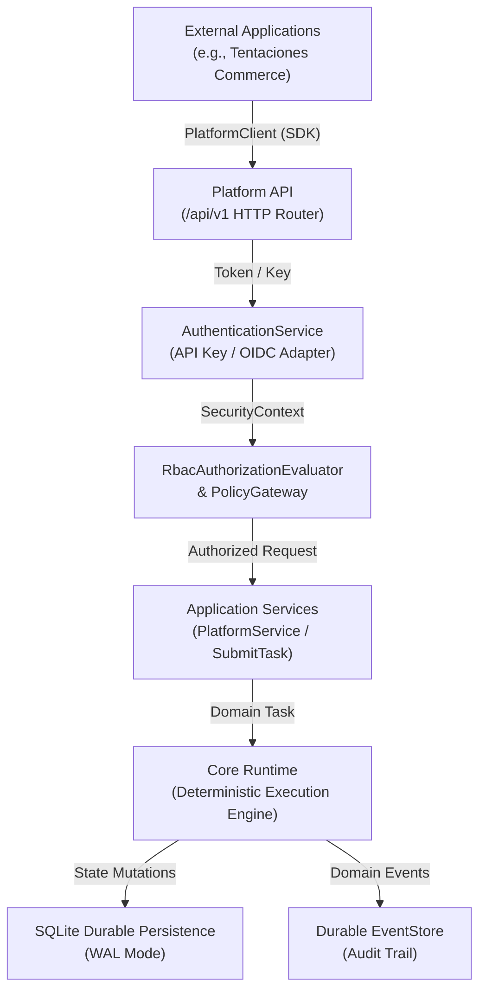
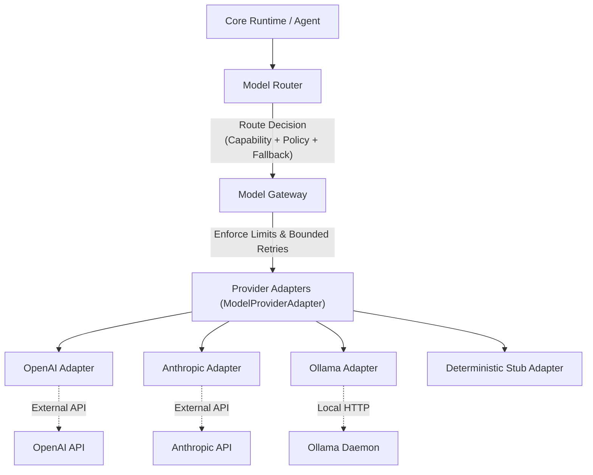

# AI Operating Platform — Architecture Reference

## 1. Architectural Philosophy

The AI Operating Platform is governed by the structural principle:

```text
CORE ENGINE ≠ PLATFORM PRODUCT ≠ APPLICATIONS
```

Applications (such as Tentaciones E-Commerce) are consumers of the Platform API and are never embedded into the Core Engine.



---

## 2. Layer Definitions

1. **Applications Layer**: External client systems (Tentaciones, future vehicle commerce, automation apps). They interact solely via `PlatformClient` and public REST endpoints.
2. **Platform API Layer (`/api/v1`)**: HTTP interface providing authentication, RBAC authorization, tenant isolation, idempotency caching, request validation, and error sanitization.
3. **Application Service Layer**: Platform use cases (`PlatformService`, `SubmitTask`, `RestartRecoveryService`, `AutonomousOperationService`) coordinating domain entities.
4. **Core Engine Runtime**: Agnostic of HTTP and network protocols. Enforces task lifecycles, agent policies, tool dispatching, and model gateways.
5. **Infrastructure & Persistence**: SQLite durable storage, OCC concurrency controls, and Durable EventStore.

---

## 4. Real Intelligence Runtime / Model Gateway Architecture

The Core Runtime interacts with AI inference providers exclusively through the vendor-neutral `ModelGateway` and `ModelRouter` contracts. The Core Engine never imports external model SDKs, endpoints, or vendor-specific HTTP clients.



### Invariants:
- **Provider Abstraction**: Core Domain contains zero knowledge of OpenAI, Anthropic, or Ollama SDKs or HTTP transports.
- **Model Capabilities**: Gateway asserts explicit capabilities (`TEXT_GENERATION`, `STRUCTURED_OUTPUT`, `TOOL_CALLING`) before dispatching requests.
- **Fail-Closed Security**: Calls enforce `SecurityContext` permissions and model allowlists; unauthorized or credential-missing calls reject fail-closed without leaking secrets.
- **Deterministic Testing**: Testing environment defaults to offline, mockable adapters with zero network dependency.

---

## 5. Structural Boundaries & Isolation Guarantees

- **Zero Core Bypass**: No external client or HTTP handler may invoke `CoreRuntime` directly without passing through `AuthenticationService`, `RbacAuthorizationEvaluator`, and `PlatformService`.
- **Zero Framework Leakage in Domain**: Domain entities (`Task`, `Agent`, `Principal`, `Plan`) have zero imports from HTTP or Express libraries.
- **Tenant Isolation**: Cross-tenant requests are denied fail-closed with `404 Not Found` responses to prevent ID enumeration attacks.

---

## 6. LLM Planner & Structured Planning (Prompt 53)

The LLM Planner architecture adheres to strict deterministic separation of concerns:
- **Proposal-Only LLM**: The model generates declarative plans via `ModelGateway.generateStructured` against `PLAN_JSON_SCHEMA`.
- **Deterministic Validation**: `PlanValidator` uses Kahn's algorithm to enforce DAG properties, topological order, and lack of cycles, while rejecting prototype pollution and forbidden security keys.
- **Pre-execution Policy Gate**: `PlanPolicyValidator` confirms that all steps, tools, and actions are authorized for the calling agent fail-closed before execution starts.

