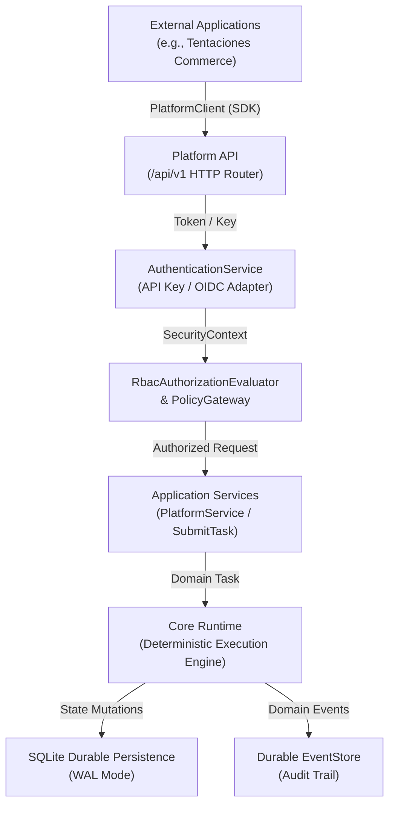

# AI Operating Platform — Architecture Reference

## 1. Architectural Philosophy

The AI Operating Platform is governed by the structural principle:

```text
CORE ENGINE ≠ PLATFORM PRODUCT ≠ APPLICATIONS
```

Applications (such as Tentaciones E-Commerce) are consumers of the Platform API and are never embedded into the Core Engine.



---

## 2. Layer Definitions

1. **Applications Layer**: External client systems (Tentaciones, future vehicle commerce, automation apps). They interact solely via `PlatformClient` and public REST endpoints.
2. **Platform API Layer (`/api/v1`)**: HTTP interface providing authentication, RBAC authorization, tenant isolation, idempotency caching, request validation, and error sanitization.
3. **Application Service Layer**: Platform use cases (`PlatformService`, `SubmitTask`, `RestartRecoveryService`, `AutonomousOperationService`) coordinating domain entities.
4. **Core Engine Runtime**: Agnostic of HTTP and network protocols. Enforces task lifecycles, agent policies, tool dispatching, and model gateways.
5. **Infrastructure & Persistence**: SQLite durable storage, OCC concurrency controls, and Durable EventStore.

---

## 3. Structural Boundaries & Isolation Guarantees

- **Zero Core Bypass**: No external client or HTTP handler may invoke `CoreRuntime` directly without passing through `AuthenticationService`, `RbacAuthorizationEvaluator`, and `PlatformService`.
- **Zero Framework Leakage in Domain**: Domain entities (`Task`, `Agent`, `Principal`, `Plan`) have zero imports from HTTP or Express libraries.
- **Tenant Isolation**: Cross-tenant requests are denied fail-closed with `404 Not Found` responses to prevent ID enumeration attacks.
