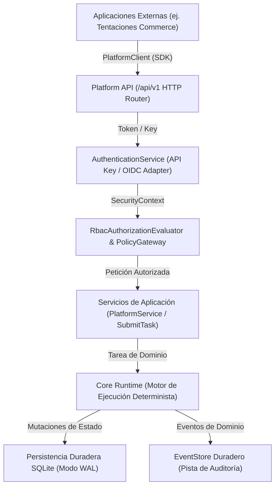
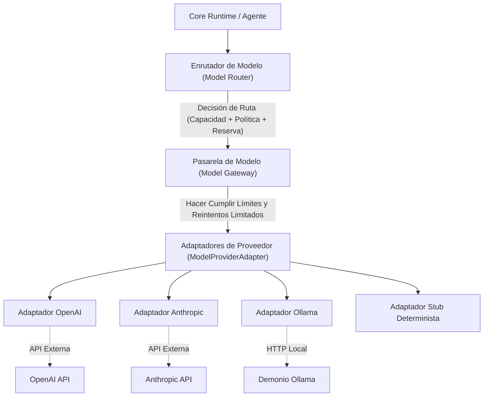

# AI Operating Platform — Referencia de Arquitectura

## 1. Filosofía Arquitectónica

La AI Operating Platform está gobernada por el siguiente principio estructural:

```text
CORE ENGINE ≠ PLATFORM PRODUCT ≠ APPLICATIONS
```

Las aplicaciones (como Tentaciones E-Commerce) son consumidoras de la Platform API. Nunca se integran dentro del Core Engine.


```mermaid
flowchart TD
    App["Aplicaciones Externas (ej. Tentaciones Commerce)"] -->|"PlatformClient (SDK)"| API["Platform API (/api/v1 HTTP Router)"]
    API -->|"Token / Key"| AuthN["AuthenticationService (API Key / OIDC Adapter)"]
    AuthN -->|"SecurityContext"| AuthZ["RbacAuthorizationEvaluator & PolicyGateway"]
    AuthZ -->|"Petición Autorizada"| Svc["Servicios de Aplicación (PlatformService / SubmitTask)"]
    Svc -->|"Tarea de Dominio"| Core["Core Runtime (Motor de Ejecución Determinista)"]
    Core -->|"Mutaciones de Estado"| Persist["Persistencia Duradera SQLite (Modo WAL)"]
    Core -->|"Eventos de Dominio"| Events["EventStore Duradero (Pista de Auditoría)"]
```

---

## 2. Definiciones de Capas

1. **Capa de Aplicaciones**: Sistemas clientes externos (Tentaciones, futuro comercio de vehículos, aplicaciones de automatización). Interactúan únicamente a través del `PlatformClient` y endpoints REST públicos.
2. **Capa de Platform API (`/api/v1`)**: Interfaz HTTP que proporciona autenticación, autorización RBAC, aislamiento de inquilinos, almacenamiento en caché de idempotencia, validación de solicitudes y sanitización de errores.
3. **Capa de Servicio de Aplicación**: Casos de uso de la plataforma (`PlatformService`, `SubmitTask`, `RestartRecoveryService`, `AutonomousOperationService`) que coordinan las entidades de dominio.
4. **Core Engine Runtime**: Agnóstico de HTTP y protocolos de red. Hace cumplir ciclos de vida de tareas, políticas de agentes, despacho de herramientas y pasarelas de modelos.
5. **Infraestructura y Persistencia**: Almacenamiento duradero SQLite, controles de concurrencia OCC y Durable EventStore.

---

## 4. Tiempo de Ejecución de Inteligencia Real / Arquitectura de Pasarela de Modelo

El Core Runtime interactúa con los proveedores de inferencia de IA exclusivamente a través de los contratos neutrales `ModelGateway` y `ModelRouter`. El Core Engine nunca importa SDKs de modelos externos, endpoints o clientes HTTP específicos de proveedores.


```mermaid
flowchart TD
    Core["Core Runtime / Agente"] --> MR["Enrutador de Modelo (Model Router)"]
    MR -->|"Decisión de Ruta (Capacidad + Política + Reserva)"| MG["Pasarela de Modelo (Model Gateway)"]
    MG -->|"Hacer Cumplir Límites y Reintentos Limitados"| PA["Adaptadores de Proveedor (ModelProviderAdapter)"]
    PA --> OA["Adaptador OpenAI"]
    PA --> AA["Adaptador Anthropic"]
    PA --> OLL["Adaptador Ollama"]
    PA --> ST["Adaptador Stub Determinista"]
    OA -.->|"API Externa"| OAI["OpenAI API"]
    AA -.->|"API Externa"| ANT["Anthropic API"]
    OLL -.->|"HTTP Local"| OL["Demonio Ollama"]
```

### Invariantes:
- **Abstracción de Proveedor**: El dominio central no tiene conocimiento de los SDKs de OpenAI, Anthropic u Ollama, ni de los transportes HTTP.
- **Capacidades de Modelo**: La pasarela afirma capacidades explícitas (`TEXT_GENERATION`, `STRUCTURED_OUTPUT`, `TOOL_CALLING`) antes de despachar las solicitudes.
- **Seguridad Default-Deny**: Las llamadas aplican permisos de `SecurityContext` y listas permitidas de modelos. Las llamadas no autorizadas o sin credenciales se rechazan con fallo cerrado sin filtrar secretos.
- **Pruebas Deterministas**: El entorno de pruebas usa adaptadores simulados sin conexión por defecto, con cero dependencia de red.

---

## 5. Límites Estructurales y Garantías de Aislamiento

- **Cero Elusión del Núcleo**: Ningún cliente externo o manejador HTTP puede invocar al `CoreRuntime` directamente sin pasar por el `AuthenticationService`, `RbacAuthorizationEvaluator` y `PlatformService`.
- **Cero Fuga de Frameworks en el Dominio**: Las entidades de dominio (`Task`, `Agent`, `Principal`, `Plan`) tienen cero importaciones de bibliotecas HTTP o Express.
- **Aislamiento de Inquilinos**: Las solicitudes entre inquilinos se deniegan con fallo cerrado y respuestas `404 Not Found` para prevenir ataques de enumeración de ID.

---

## 6. Planificador LLM y Planificación Estructurada (Prompt 53)

La arquitectura del Planificador LLM se adhiere a una separación determinista estricta de responsabilidades:
- **LLM Solo Para Propuestas**: El modelo genera planes declarativos a través de `ModelGateway.generateStructured` contra el `PLAN_JSON_SCHEMA`.
- **Validación Determinista**: El `PlanValidator` usa el algoritmo de Kahn para imponer propiedades DAG, orden topológico y ausencia de ciclos. Rechaza prototype pollution y claves de seguridad prohibidas.
- **Puerta de Política Pre-ejecución**: El `PlanPolicyValidator` confirma que todos los pasos, herramientas y acciones están autorizados para el agente llamador con fallo cerrado antes de que comience la ejecución.

---

## 7. Registro Dinámico de Herramientas y Tiempo de Ejecución de Invocación (Prompt 54)

- **Ejecución Sin Elusión**: El modelo propone, el validador verifica, la política autoriza y el tiempo de ejecución ejecuta. Los modelos no pueden ejecutar herramientas directamente.
- **Registro Dinámico y Versionado**: `InMemoryToolRegistry` provee versionado semántico (`toolId@version`), prevención de colisiones por duplicados y descubrimiento público seguro (redactando secretos sensibles).
- **Seguridad y Autorización Previa**: El `ToolInvocationRuntime` evalúa permisos RBAC, SecurityBoundaries y reglas de PolicyGateway antes de despachar la ejecución.
- **Barrera de Aprobación Humana**: Las herramientas de riesgo `CRITICAL` imponen estrictamente tokens de aprobación con humanos en el ciclo (human-in-the-loop).
- **Ejecución de Plan Topológico**: El `PlanExecutionEngine` programa los pasos DAG topológicamente, pasa dependencias de salida, maneja tokens de cancelación y aplica estados de fallo en cascada (`SKIPPED`) de forma segura.

---

## 8. Platform Product / Arquitectura de Web Console (Prompt 56)

- **Desacoplamiento Estricto de Capas**: Gobernado por `CORE ENGINE ≠ PLATFORM PRODUCT ≠ APPLICATIONS`. La Web Platform es puramente un cliente consumidor de la Platform API pública (`/api/v1`) a través del `PlatformClient`.
- **Cero Importaciones Internas**: Los activos web y los controladores de cliente contienen cero dependencias directas de las capas de dominio, tiempo de ejecución de aplicación o persistencia.
- **Navegación y Observabilidad Empresarial**: Web Console integrada que abarca Operaciones de Plataforma, Dashboard, Agentes, Operaciones, Ejecuciones, Modelos, Herramientas, Gobernanza y Aplicaciones.
- **Sistema de Diseño Nativo y Seguridad**: Tema claro por defecto (`--bg-primary: #f8fafc`) con soporte de modo oscuro. Prevención estricta de XSS mediante construcción directa de DOM (`document.createElement` / `textContent`) con cero evaluación de `innerHTML` inseguro.
