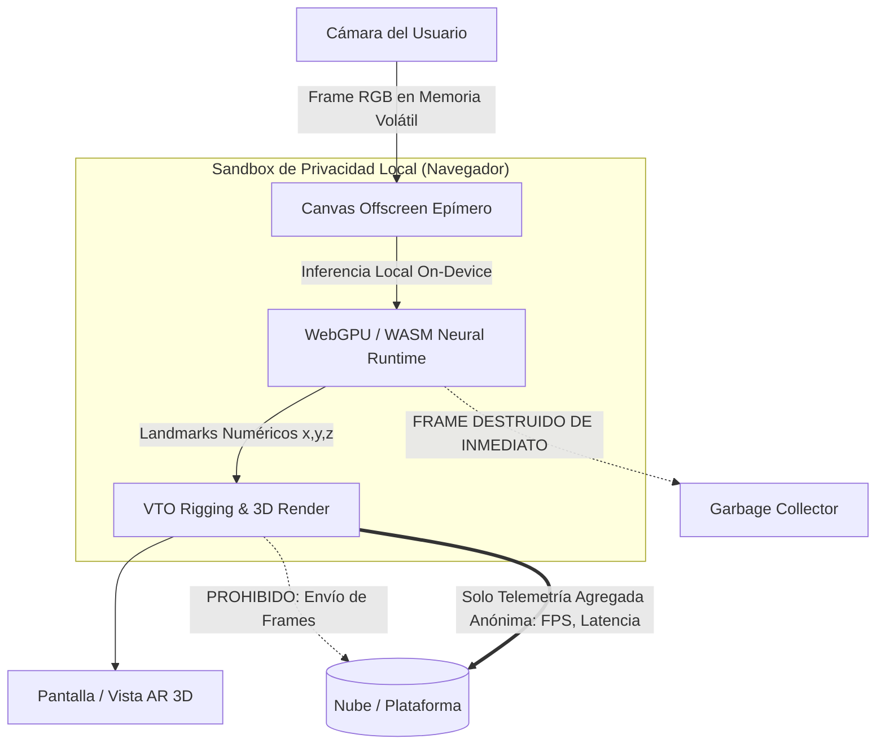
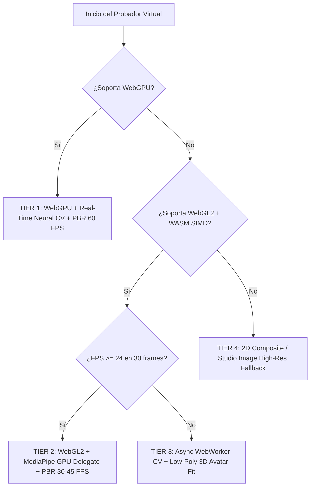
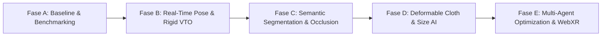

# AR 3D AI Computer Vision & Spatial Commerce Architecture
## Tentaciones Virtual Try-On (VTO) & Cross-Platform Spatial Intelligence

```text
================================================================================
AI OPERATING PLATFORM — STRATEGIC WORKSTREAM SPECIFICATION
================================================================================
Iniciativa:     AOP-TENTACIONES-AR-3D-AI
Área:           01 Tentaciones AI Commerce
Clasificación:  Strategic / Cross-Portfolio Capability
Prioridad:      HIGH
Estado:         PLANNED / RESEARCH & ARCHITECTURE BASELINE
Alineación:     Application Integration Guide (docs/APPLICATION_INTEGRATION_GUIDE.md)
                Agent Operating Protocol (docs/AGENT_OPERATING_PROTOCOL.md)
================================================================================
```

---

## 1. Misión y Principios Arquitectónicos

### 1.1 Misión Estratégica
Evolucionar el módulo de **Probador Virtual AR 3D de Tentaciones** desde un visor de modelos 3D estáticos o anclados a planos hacia un sistema de **AI-Powered Virtual Try-On (VTO) y Spatial Commerce** en tiempo real. 

La arquitectura combina visión computacional de baja latencia en el navegador, inferencia neuronal on-device acelerada por hardware (WebGPU/WASM), segmentación semántica de prendas y cuerpo, estimación de pose 3D con tracking temporal filtrado, oclusión dinámica y renderizado fotorrealista en WebGL2/WebXR.

### 1.2 Principio de Desacoplamiento de Responsabilidades
Para evitar la degradación de rendimiento y la mezcla de capas de abstracción, el sistema separa de manera estricta:

```text
+-------------------------------------------------------------------------------+
|                           TENTACIONES APPLICATION                             |
|        (UI/UX, Carrito, Catálogo de Productos, Interacción de Usuario)        |
+---------------------------------------+---------------------------------------+
                                        |
                            @ai-platform/client SDK
                                        |
+---------------------------------------v---------------------------------------+
|                         AR 3D AI RUNTIME ENGINE                               |
|                                                                               |
|  [Computer Vision]       [AI Inference]         [Spatial & VTO Engine]        |
|  - Camera Stream         - WebGPU / ONNX Web    - Pose Kinematics             |
|  - Frame Preprocessing   - MediaPipe Tasks      - Dynamic Scaling             |
|  - Color Space / Tensor  - Quantized INT8/FP16  - Elastic Garment Rigging     |
|                                                                               |
|  [3D Asset Pipeline]     [Rendering & XR]       [Agent Orchestration]         |
|  - glTF 2.0 / GLB        - WebGL2 / WebXR       - Performance Watchdog        |
|  - Draco / Meshopt       - Three.js Engine      - Fitment Verification        |
|  - PBR Sheen / Velvet    - Stencil Occlusion    - Async Style Advisor         |
+---------------------------------------+---------------------------------------+
                                        |
                               Platform REST / SSE
                                        |
+---------------------------------------v---------------------------------------+
|                         AI OPERATING PLATFORM CORE                            |
|             (Governance, Telemetry, Asset Storage, Agent Gateway)             |
+-------------------------------------------------------------------------------+
```

```text
AR / XR Rendering ≠ Computer Vision ≠ AI Inference ≠ 3D Asset Pipeline ≠ Virtual Try-On Logic ≠ Agent Orchestration
```

---

## 2. Benchmark Tecnológico Exhaustivo

Se evaluaron tecnologías contemporáneas bajo 14 dimensiones de ingeniería para determinar la pila técnica óptima sin depender de popularidad superficial.

| Tecnología | Rol en el Pipeline | Soporte Móvil | Aceleración Hardware | Latencia Inferencia | Tamaño / Overhead | Privacidad On-Device | Veredicto & Estrategia |
| :--- | :--- | :--- | :--- | :--- | :--- | :--- | :--- |
| **MediaPipe Tasks (Vision)** | Pose, Landmarks, Face, Selfie Seg. | Excelente (iOS/Android) | WebGPU / GPU Delegate / WASM SIMD | 8ms - 22ms | 3MB - 12MB | 100% Local (Zero network) | **CORE TIER 1**: Detección de pose (BlazePose 33) y segmentación de cuerpo en tiempo real. |
| **ONNX Runtime Web** | Modelos Custom (Clothing Parsing, Depth) | Muy Bueno | WebGPU / WASM Execution Providers | 15ms - 45ms | 5MB (Runtime) + Modelo | 100% Local | **CORE TIER 1**: Modelos especializados de segmentación de prendas (LIP/ATR) y profundidad monocular. |
| **WebGPU** | Pipeline de Cómputo e Inferencia | Moderno (Chrome 113+, Safari 18+) | GPU Direct Compute | < 10ms | 0MB (Nativo) | 100% Local | **PRIMARY ACCELERATOR**: Prioridad para inferencia de tensores y sombreado de materiales complejos. |
| **WebGL2 / WASM SIMD** | Fallback de Renderizado y Cómputo | Universal (98.5% cobertura) | GPU Raster / CPU Multi-thread | 25ms - 60ms | 0MB (Nativo) | 100% Local | **UNIVERSAL FALLBACK**: Garantiza funcionamiento fluido en dispositivos de gama media y baja. |
| **WebXR Device API** | Sesiones AR Inmersivas | Android Chrome / Meta Quest | ARCore / Native Tracking | < 5ms (Tracking) | 0MB (Nativo) | Aislado por Sandbox | **OPTIONAL ENHANCER**: Para anclaje espacial de calzado y accesorios en el entorno real. |
| **Three.js (r160+)** | Motor de Renderizado 3D y PBR | Universal | WebGL2 / WebGPU (Node Material) | < 2ms (Draw Call) | ~600KB | N/A (Frontend) | **CORE 3D ENGINE**: Carga de GLB/glTF, shaders PBR de tela (`MeshPhysicalMaterial`), oclusión por stencils. |
| **Diffusion-based VTO (Server-side)** | Generación Neural de Imagen 2D | N/A (Cloud) | GPU Server (NVIDIA A10G) | 1500ms - 4000ms | N/A (API) | Requiere envío de fotograma | **ASYNC COMPOSITOR (TIER 4)**: Solo para fotos de alta resolución estáticas bajo consentimiento explícito. |

---

## 3. Matriz de Capacidades de Visión Computacional

Cada capacidad funcional requerida por el probador virtual se categoriza formalmente según su madurez y viabilidad técnica:


### 3.1 Detalle de Capacidades

| Capacidad | Estado | Enfoque Técnico | Latencia Target | Dispositivos Soportados |
| :--- | :--- | :--- | :--- | :--- |
| **Person Detection** | `AVAILABLE` | BlazeFace / BlazePose SSD Detector | 4 - 8 ms | Universal |
| **Pose Estimation** | `AVAILABLE` | MediaPipe BlazePose (33 keypoints 3D en coordenadas métricas) | 10 - 18 ms | Desktop, Mobile Mid/High |
| **Body Landmarks** | `AVAILABLE` | Holistic Landmarks (Hombros, Codos, Muñecas, Cadera, Rodillas, Tobillos) | 12 - 20 ms | Desktop, Mobile Mid/High |
| **Person Segmentation** | `AVAILABLE` | Selfie Segmentation (Máscara binaria continua de primer plano) | 6 - 12 ms | Universal |
| **Clothing Segmentation** | `PROTOTYPE` | ONNX MobileNetV3-UNet entrenado en CIHP (Parsing de torso, piernas, brazos) | 25 - 40 ms | WebGPU Desktop & Mobile High |
| **Spatial Tracking** | `AVAILABLE` | Kalman Filter + One-Euro Filter para supresión de jitter en landmarks | < 1 ms | Universal (CPU puro) |
| **Monocular Depth** | `EXPERIMENTAL` | MiDaS v2.1 Small / Depth Anything V2 cuantizado en ONNX WebGPU | 35 - 55 ms | WebGPU High-End |
| **Dynamic Occlusion** | `PROTOTYPE` | Stencil Buffer 3D generado a partir de la máscara de segmentación de extremidades | < 2 ms | WebGL2 / WebGPU |
| **3D Garment Alignment** | `PROTOTYPE` | Transformación afín 3D (Escala, Rotación, Traslación) anclada a vectores de hombro/cadera | < 2 ms | Universal |
| **Camera FOV Estimation** | `AVAILABLE` | Estimación heurística de distancia focal a partir de relación distancia interpupilar/hombros | < 1 ms | Universal |
| **Gesture Interaction** | `AVAILABLE` | Detección de gestos (Swipe para cambiar color, Pinch para ajustar talla) | 5 - 10 ms | Universal |
| **Virtual Try-On (Rigid)** | `AVAILABLE` | Gafas, Joyería, Calzado, Relojes, Bolsos | 3 - 5 ms | Universal |
| **Virtual Try-On (Cloth)** | `PROTOTYPE` | Malla 3D deformable con rigging lineal mapeado a landmarks articulares | 12 - 20 ms | Desktop, Mobile Mid/High |

---

## 4. Matriz de Evaluación de Modelos Neuronales

| Modelo | Tarea Principal | Formato / Runtime | Tamaño en Memoria | Precisión | FPS Target (Mobile) |
| :--- | :--- | :--- | :--- | :--- | :--- |
| **BlazePose Full (v0.10)** | 33 Landmarks 3D | TFLite / MediaPipe WASM+GPU | 6.8 MB | FP16 | 45 - 60 FPS |
| **BlazePose Heavy** | Landmarks alta precisión | TFLite / MediaPipe WebGPU | 26.2 MB | FP16 | 25 - 35 FPS |
| **Selfie Segmenter** | Máscara de silueta humana | TFLite / MediaPipe GPU | 1.2 MB | INT8 | 60 FPS |
| **Clothing-Parsing-Lite** | Segmentación semántica prendas | ONNX Web (WebGPU/WASM) | 4.6 MB | INT8 Quantized | 30 - 45 FPS |
| **MiDaS Small Depth** | Mapa de profundidad relativo | ONNX Web | 14.8 MB | FP16 | 20 - 30 FPS |
| **OneEuro-Tracker** | Estabilización cinemática | TypeScript Nativo | 0.05 MB | Float64 | > 1000 FPS |

---

## 5. Modelo de Privacidad y Seguridad de Datos (Zero-Retention Architecture)

El procesamiento de datos de cámara humana y siluetas corporales exige las máximas garantías de privacidad por diseño (*Privacy by Design & Default*):



### Invariantes de Privacidad
1. **Zero Raw Frame Transmission**: Ningún fotograma de video o imagen sin procesar abandona la memoria RAM volátil del navegador del cliente en los Tiers 1, 2 y 3.
2. **Landmark Ephemerality**: Las coordenadas de pose y medidas antropométricas inferidas se descartan en el ciclo de vida del frame ($16.6\text{ ms}$) y nunca se persisten en `localStorage`, `IndexedDB` ni cookies sin consentimiento explícito del usuario.
3. **Hardware Stream Teardown**: Al pausar, minimizar la pestaña o salir del probador, el `MediaStreamTrack` de la cámara se finaliza inmediatamente (`track.stop()`), apagando el LED de actividad de la cámara del dispositivo.
4. **No Biometric Identification**: El sistema no realiza reconocimiento facial ni calcula firmas biométricas unívocas que permitan identificar al individuo.

---

## 6. Arquitectura de Fallback y Degradación Elegante

El sistema detecta dinámicamente las capacidades de hardware y adapta el pipeline para evitar bloqueos o tasas de cuadros inaceptables:



### Definición de Tiers de Ejecución

| Nivel | Render Engine | CV / AI Runtime | Comportamiento VTO | Experiencia de Usuario |
| :--- | :--- | :--- | :--- | :--- |
| **Tier 1 (Ultra/High)** | Three.js WebGPU + NodeMaterial | WebGPU Direct Compute (FP16) | Tracking 60 FPS, deformación elástica de tela, oclusión dinámica por extremidad y sombras de contacto. | Experiencia AR VTO completa en tiempo real. |
| **Tier 2 (Standard)** | Three.js WebGL2 | WebGL / WASM SIMD (INT8) | Tracking 30-45 FPS, deformación rígida articulada, oclusión simplificada. | Fluida y precisa en la mayoría de smartphones. |
| **Tier 3 (Budget/Low-End)** | Three.js WebGL1/Canvas | Web Worker Asíncrono (10 Hz) | Interpolación de pose a 30 FPS, avatar 3D calibrado estático o semi-dinámico. | Permite ver talla y calce sin congelar el dispositivo. |
| **Tier 4 (Static Fallback)** | Canvas 2D Composite | Sin inferencia de cámara | Superposición fotográfica 2D calibrada sobre foto subida o avatar estándar. | Garantiza conversión comercial aún en navegadores restringidos. |

---

## 7. Multi-Agent AI: Orquestación y Gobernanza Fuera del Loop Visual

Para no penalizar el bucle de renderizado en tiempo real ($60\text{ Hz} \equiv 16.6\text{ ms}$ por frame), los agentes de inteligencia artificial operan de manera asíncrona o supervisora:

```text
+-------------------------------------------------------------------------------+
|               REAL-TIME VISUAL LOOP (Deterministic CV & Shaders)              |
|                     [60 FPS / < 16.6ms Budget per Frame]                      |
|                                                                               |
|   Camera Frame ---> Pose Inference ---> OneEuro Smoothing ---> Mesh Transform |
+-------------------------------------------------------------------------------+
                                        ^
                   Telemetry / Samples  |  Parametric Adjustments
                                        v
+-------------------------------------------------------------------------------+
|                 ASYNC AGENT SUPERVISORY LAYER (Off-Main-Thread)               |
|                                                                               |
|  [AR_VISION_AGENT]        [PERFORMANCE_AGENT]       [VTO_ALIGNMENT_AGENT]     |
|  - Analiza iluminación    - Watchdog de FPS y RAM   - Calibra stretch de tela |
|  - Sugiere compensación   - Activa degradación      - Verifica ratio talla    |
|                                                                               |
|  [VTO_VERIFICATION_AGENT] [3D_ASSET_AGENT]          [STYLE_ADVISOR_AGENT]     |
|  - Evalúa artefactos      - Optimiza LOD / Draco    - Recomienda accesorios   |
+-------------------------------------------------------------------------------+
```

### Roles y Responsabilidades de Agentes Especializados

1. **`PERFORMANCE_AGENT`**:
   - Monitorea latencia de inferencia y consumo de memoria heap cada 2 segundos.
   - Ejecuta transiciones automáticas de Tier (Tier 1 $\rightarrow$ Tier 2 $\rightarrow$ Tier 3) si la tasa de cuadros cae por debajo de 24 FPS durante 3 segundos consecutivos.
2. **`AR_VISION_AGENT`**:
   - Analiza el histograma de iluminación ambiental y balance de blancos de la escena.
   - Ajusta dinámicamente las luces PBR (`DirectionalLight` y `AmbientLight`) en Three.js para igualar el entorno físico del usuario con la prenda 3D.
3. **`VTO_ALIGNMENT_AGENT`**:
   - Valida la plausibilidad física de la relación entre las dimensiones estimadas del cuerpo del usuario y las tablas de medidas de la prenda.
   - Calcula el índice de confianza de talla (ej. *Talla M: 92% match en hombros, 85% match en largo*).
4. **`VTO_VERIFICATION_AGENT`**:
   - Detecta anomalías visuales (mallas que atraviesan el cuerpo, inversiones de normales o pérdida severa de tracking).
   - Corrige parámetros de anclaje de forma suave e imperceptible para el usuario.
5. **`3D_ASSET_AGENT`**:
   - Gestiona la precarga inteligente de niveles de detalle (LOD 0, LOD 1, LOD 2) y texturas KTX2/Basis Universal según el ancho de banda y la resolución de pantalla.

---

## 8. Pipeline de Assets 3D y Mejoras de Renderizado Fotorrealista

Para lograr una apariencia realista de materiales textiles sin saturar la GPU móvil:

### 8.1 Especificaciones de Asset 3D Estándar
- **Formato Contenedor**: glTF 2.0 binario (`.glb`).
- **Compresión Geométrica**: Draco Compression o Meshoptimizer (`KHR_meshopt_compression`) para reducir el peso de descarga en más del 70% (target: $< 2.5\text{ MB}$ por prenda completa).
- **Texturas**: Formato GPU nativo Basis Universal (`.ktx2` con `KHR_texture_basisu`), permitiendo descompresión directa en VRAM (ASTC en iOS/Android, BC7 en Desktop).

### 8.2 Extensiones de Materiales Físicos (PBR)
- **`KHR_materials_sheen`**: Simula el brillo rasante de terciopelo, seda, algodón y telas de sastrería.
- **`KHR_materials_clearcoat`**: Utilizado para cuero pulido, accesorios metálicos y acabados de calzado.
- **`KHR_materials_transmission` & `KHR_materials_volume`**: Para lentes de sol y telas semitransparentes.

---

## 9. Propuesta de Integración con `@ai-platform/client`

La aplicación cliente (Tentaciones) consume el runtime a través de una interfaz limpia y fuertemente tipada:

```typescript
import { PlatformClient } from '@ai-platform/client';
import { ARVisionSession, VTOConfiguration } from '@ai-platform/client/ar';

// 1. Inicializar cliente estándar
const client = new PlatformClient({
  baseUrl: 'https://api.platform.internal',
  apiKey: process.env.PLATFORM_API_KEY,
});

// 2. Configurar sesión de Virtual Try-On
const vtoConfig: VTOConfiguration = {
  productUrn: 'urn:tentaciones:ar:apparel:jacket-leather-black@1.0.0',
  targetContainerId: 'vto-viewport',
  preferredTier: 'AUTO_DETECT',
  privacyLevel: 'ZERO_RETENTION_ON_DEVICE',
  enableOcclusion: true,
  enableDynamicLighting: true,
};

// 3. Iniciar sesión de visión AR
const session = await client.ar.createSession(vtoConfig);

// 4. Suscribirse a eventos de inferencia y gobernanza
session.on('trackingStateChange', (state) => {
  console.log(`Estado de tracking: ${state.status}, Confianza: ${state.confidence}`);
});

session.on('sizeRecommendation', (rec) => {
  console.log(`Talla sugerida por IA: ${rec.recommendedSize} (${rec.fitConfidence}% match)`);
});

session.on('performanceTierTransition', (event) => {
  console.warn(`Transición automática a ${event.currentTier} debido a carga térmica/GPU`);
});

// 5. Iniciar loop de renderizado y cámara
await session.start();
```

---

## 10. Roadmap Estratégico de Implementación



1. **Fase A — Spikes Técnicos y Benchmarks de Rendimiento (Foco Actual)**:
   - Prototipado de MediaPipe Pose + Three.js en entorno móvil y de escritorio.
   - Pruebas de degradación de WebGPU a WebGL2/WASM SIMD.
   - Validación de la política de privacidad Zero-Retention.
2. **Fase B — VTO Rígido y Calibración Antropométrica**:
   - Soporte para calzado, gafas, relojes y accesorios de cabeza.
   - Algoritmo de filtrado cinemático One-Euro para eliminar temblores de cámara.
3. **Fase C — Segmentación Semántica y Oclusión Dinámica**:
   - Integración de modelo ONNX de segmentación de prendas en Web Worker.
   - Oclusión de brazos y piernas delante de la prenda probada.
4. **Fase D — Simulación de Deformación Textil y Recomendación de Talla**:
   - Ajuste elástico de mallas 3D sobre siluetas corporales.
   - Motor determinista de cálculo de medidas corporales relativas.
5. **Fase E — Supervisión Multi-Agente y Certificación WebXR**:
   - Integración con `PERFORMANCE_AGENT` y `AR_VISION_AGENT`.
   - Compatibilidad completa con sesiones WebXR Immersive AR en dispositivos compatibles.

---

## 11. Riesgos Técnicos y Estrategias de Mitigación

| Riesgo Técnico | Impacto | Probabilidad | Estrategia de Mitigación |
| :--- | :--- | :--- | :--- |
| **Throttling Térmico en Smartphones** | Caída abrupta de FPS tras 60s de uso continuo. | Alta | Reducción dinámica de resolución de renderizado ($0.75\times$) y espaciado de inferencia neuronal (ej. inferir pose cada 2 frames e interpolar). |
| **Variabilidad de Iluminación** | Pérdida de tracking en entornos con contraluz o baja luz. | Media | Detección automática por `AR_VISION_AGENT` y notificación amigable en pantalla (*"Mejora la iluminación para una prueba más precisa"*). |
| **Diferencias de Safari iOS vs Chrome Android** | WebGPU no disponible o permisos restrictivos de cámara. | Media | Fallback transparente a WebGL2 + WASM SIMD garantizado en el Tier 2. |
| **Distorsión Perspectiva de Lente Frontal (Selfie)** | Deformación aparente de hombros por lente gran angular. | Alta | Algoritmo de compensación de distorsión focal basado en distancia pupila-cámara estimada. |

---

## 12. Conclusión Arquitectónica
La estrategia **AR 3D AI Deepening (`AOP-TENTACIONES-AR-3D-AI`)** posiciona a Tentaciones y a la AI Operating Platform en la vanguardia del comercio espacial inteligente. Al basar la solución en inferencia local acelerada, separación estricta de dominios, respeto total a la privacidad del usuario y degradación elegante garantizada, el sistema ofrece una experiencia inmersiva de nivel industrial lista para escalar de manera sostenible y reproducible.
