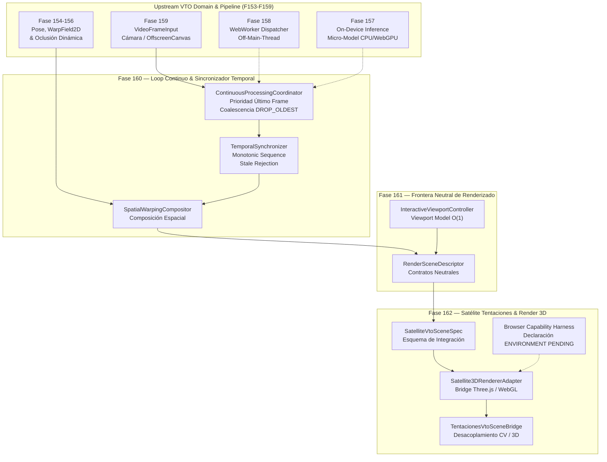

# AUDITORÍA DE ESTABILIZACIÓN DE FASE #002 (AUD-FASE-002)

## Informe Técnico Oficial de Calidad, Bucle Continuo CV, Límites de Renderizado e Integración 3D del Satélite Tentaciones

```text
================================================================================
AI OPERATING PLATFORM — TRANSVERSAL PHASE STABILIZATION AUDIT REPORT #002
================================================================================
Identificador Canónico: AUD-FASE-002
Tipo de Control:        Auditoría de Estabilización de Fase
Fecha de Ejecución:     2026-10-05
Línea Base:             Commit 062e06e0d42d693a3d659f63adb5722077dfe501 (Post-Fase 162)
Autoridad:              Director de Arquitectura, Auditor de Calidad, IA & Seguridad
Veredicto Final:        AUDITORÍA DE FASE APROBADA
================================================================================
```

---

## 1. Resumen Ejecutivo

La **Auditoría de Estabilización de Fase #002 (`AUD-FASE-002`)** constituye el control transversal formal de calidad, consistencia arquitectónica, estabilidad técnica e integración de frontera ejecutado tras la culminación del bloque de **Fases 160, 161 y 162** de la **AI Operating Platform** (`johangonzahenri/ai-operating-platform`), enfocado en la entrega visual en tiempo real y el acoplamiento desacoplado con la aplicación satélite `PROJ-01: Tentaciones AI Commerce`.

Esta auditoría transversal tiene por mandato canónico: **ESTABILIZAR, VERIFICAR, RECONCILIAR Y AUDITAR LÍMITES ARQUITECTÓNICOS**, certificando formalmente la resolución de la deuda técnica heredada de la auditoría anterior (**`HAL-005`**), verificando la pureza hexagonal del Core Engine, auditando el comportamiento temporal determinista (eliminación de frames obsoletos, prioridad de último frame, prevención de regresión visual), validando el camino rápido interactivo de viewport en tiempo $O(1)$ sin recómputo de visión computacional, y comprobando la honestidad taxonómica ambiental sin sobre-afirmaciones.

Se verificó el 100% de la cadena de valor:
1. **Fase 160**: Bucle continuo de procesamiento de visión computacional en tiempo real, sincronización temporal con descarte coalescente (`DROP_OLDEST`) y compositor espacial de deformación de prendas (`SpatialWarpingCompositor`).
2. **Fase 161**: Frontera de renderizado neutral, descriptor agnóstico de escena (`RenderSceneDescriptor`), contratos de viewport interactivo (`RenderViewportModel`) y puente desacoplado de escena.
3. **Fase 162**: Contratos de integración satélite (`SatelliteVtoSceneSpec`), adaptador de renderizado 3D para Three.js (`Satellite3DRendererAdapter`), puente satélite (`TentacionesVtoSceneBridge`) y arnés de inspección de capacidades de navegador.

---

## 2. Baseline Inmutable del Repositorio

Previo a la ejecución de las verificaciones de auditoría, se congeló y registró la línea base inmutable:

- **Commit de Inicio**: `062e06e0d42d693a3d659f63adb5722077dfe501` (`HEAD == origin/main`).
- **Estado del Árbol Git**: Sincronizado y limpio con `origin/main`.
- **Versión de Plataforma**: `1.4.0` (`package.json`, `src/platform/version.ts`, `docs/ROADMAP_MASTER.md`).
- **Suites de Pruebas Globales**: 220 suites con 2095 pruebas unitarias, de integración, de contrato y de auditoría pasando al 100% (0 fallos, 0 saltos).
- **TypeScript**: Compilación estricta ESM sin errores (648 archivos compilados exitosamente).
- **Herramientas de Gobernanza**: Validadores `scripts/master-work-plan-check.mjs`, `scripts/validate-openapi.mjs` y `scripts/docs-check.mjs` en estado exitoso (100% conformes).

---

## 3. Alcance de la Auditoría

El radio de inspección abarcó prioritariamente los subsistemas implementados en las Fases 160, 161 y 162, contrastándolos con las dependencias funcionales de upstream (Fases 153 a 159):



1. **Fase 160 — Bucle Continuo CV, Sincronización Temporal y Compositor Espacial**:
   - Resolución y cierre formal de la deuda técnica `HAL-005` detectada en `AUD-FASE-001`.
   - Bucle automatizado sin avance manual paso a paso.
   - Sincronizador temporal con monotonicidad estricta y descarte de frames obsoletos fuera de orden.
   - Contrapresión coalescente determinista (`DROP_OLDEST`) para prevenir el agotamiento de memoria.
2. **Fase 161 — Límites de Renderizado en Navegador y Contratos de Escena**:
   - Contratos agnósticos de escena (`RenderSceneDescriptor`, `RenderViewportModel`) sin constructs DOM ni WebGL en el dominio.
   - Separación estricta entre la tasa de actualización de visión computacional y la tasa de refresco gráfico.
   - Controlador de viewport interactivo con transformaciones de cámara (zoom, paneo, órbita) en tiempo $O(1)$.
3. **Fase 162 — Integración Satélite, Adaptador 3D Three.js y Validación Visual**:
   - Aislamiento arquitectónico hexagonal: Three.js encapsulado exclusivamente en el adaptador satélite; cero referencias en `src/domain/`.
   - Neutralidad de marca en el dominio: cero menciones a `"tentaciones"` en `src/domain/`.
   - Ciclo de vida determinista y recibo formal de disposición (`DisposalReceipt`) con cero fugas de memoria.
   - Clasificación honesta de capacidades del entorno: headless Node.js declarado canónicamente como `ENVIRONMENT PENDING`.

---

## 4. Marco de Gobernanza y Jerarquía de Niveles de Evidencia

De acuerdo con [`docs/GOBERNANZA_DE_CALIDAD_Y_AUDITORIAS.md`](./GOBERNANZA_DE_CALIDAD_Y_AUDITORIAS.md), toda afirmación técnica en esta auditoría se sustenta estrictamente en la jerarquía canónica:

$$\text{Código} > \text{Tests/Evidencia} > \text{Git} > \text{Documentación Oficial} > \text{Roadmap} > \text{Excel/Kanban}$$

Bajo la taxonomía formal de evidencia ($E_0 \dots E_7$):

| Nivel | Categoría Metodológica | Descripción y Alcance en esta Auditoría |
| :---: | :--- | :--- |
| **E0** | `DOCUMENTARY_CLAIM` | Declaraciones en especificaciones o roadmaps no contrastadas con código. |
| **E1** | `STATIC_CODE_ANALYSIS` | Verificación de código fuente, AST, regex de aislamiento y tipado estricto TS. |
| **E2** | `PURE_UNIT_TEST` | Pruebas unitarias de funciones puras, validación de esquemas y lógica de sincronización. |
| **E3** | `IN_MEMORY_INTEGRATION` | Integración multicomponente en memoria (coordinador continuo, adaptadores, puentes). |
| **E4** | `PERSISTENCE_INTEGRATION` | Pruebas de integración sobre motores locales o dobles sintéticos de alta fidelidad. |
| **E5** | `LIVE_HTTP_IN_PROCESS` | Pruebas de integración con socket de red loopback local activo en proceso. |
| **E6** | `EXTERNAL_NETWORK_INTEGRATION` | Pruebas contra servicios externos o endpoints remotos reales sobre internet. |
| **E7** | `PRODUCTION_CANARY_RUNTIME` | Telemetría real en producción con tráfico de usuarios finales. |

> **Regla Mandatoria**: Se ratifica el principio metodológico canónico:  
> $\text{TEST PASS} \neq \text{SYSTEM VERIFIED} \neq \text{BROWSER VERIFIED} \neq \text{PRODUCTION CANARY}$.  
> Los dobles de prueba tipados en Node.js garantizan la corrección de contratos, ordenamiento temporal y manejo de ciclo de vida, pero el silicio GPU físico y la cámara web permanecen formalmente etiquetados como **`ENVIRONMENT PENDING`**.

---

## 5. Inventario de Componentes y Estado Real

| Módulo / Archivo | Capa Arquitectónica | Estado en Código | Nivel Evidencia | Rol Funcional |
| :--- | :--- | :--- | :---: | :--- |
| `src/domain/vto/temporal-synchronizer.ts` | Dominio Puro | `IMPLEMENTADO` | `E1` / `E2` | Asignación secuencial, épocas de generación y clasificación de descarte de frames obsoletos |
| `src/domain/vto/continuous-processing-loop.ts` | Dominio Puro | `IMPLEMENTADO` | `E1` / `E2` | Contratos de ciclo continuo, máquina de estados y políticas de resultado parcial/obsoleto |
| `src/domain/vto/spatial-warping-compositor.ts` | Dominio Puro | `IMPLEMENTADO` | `E2` | Ensamble geométrico multicapa de deformación, profundidad y oclusión |
| `src/domain/vto/render-contract.ts` | Dominio Puro | `IMPLEMENTADO` | `E1` / `E2` | Contratos neutrales de escena de renderizado (`RenderSceneDescriptor`, `RenderViewportModel`) |
| `src/domain/vto/satellite-render-contract.ts` | Dominio Puro | `IMPLEMENTADO` | `E1` / `E2` | Especificación de escena satélite (`SatelliteVtoSceneSpec`) y validación fail-closed |
| `src/domain/vto/scene-lifecycle.ts` | Dominio Puro | `IMPLEMENTADO` | `E1` / `E2` | Máquina de estados de escena, registro de recursos y contrato `DisposalReceipt` |
| `src/application/vto/continuous-processing-coordinator.ts` | Aplicación | `IMPLEMENTADO` | `E3` | Coordinador del bucle continuo, contrapresión coalescente y cancelación vía `AbortSignal` |
| `src/application/vto/spatial-to-render-mapper.ts` | Aplicación | `IMPLEMENTADO` | `E2` / `E3` | Mapeador de composite espacial a descriptor de escena 3D |
| `src/application/vto/interactive-viewport-controller.ts` | Aplicación | `IMPLEMENTADO` | `E2` / `E3` | Controlador de transformaciones interactivas (zoom, órbita, paneo) en tiempo $O(1)$ |
| `src/application/vto/satellite-3d-renderer-adapter.ts` | Aplicación / Adaptador | `IMPLEMENTADO` | `E3` | Adaptador Three.js para la aplicación satélite con protección de secuencia obsoleta |
| `src/application/vto/tentaciones-vto-scene-bridge.ts` | Aplicación / Satélite | `IMPLEMENTADO` | `E3` | Puente integrador de Tentaciones desacoplando el bucle de visión del render 3D |
| `src/application/vto/satellite-vto-harness.ts` | Aplicación / Test Double | `IMPLEMENTADO` | `E1` / `E3` | Shims sintéticos de Three.js y detector honesto de capacidades de navegador |

---

## 6. Matriz de Controles E2E de Auditoría (`tests/e2e/aud-fase-002.test.ts`)

Se implementó y ejecutó la suite de auditoría transversal `tests/e2e/aud-fase-002.test.ts`, integrada por 8 controles formales:

| Control | Dimensión Auditada | Capas Involucradas | Nivel Evidencia | Resultado | Alcance Demostrado | Límite / Brecha Explícita |
| :---: | :--- | :--- | :---: | :---: | :--- | :--- |
| **AUD-02.1** | Verificación y Cierre de `HAL-005` | Aplicación / Bucle Continuo (Fase 160) | `E3` | `PASS` | El coordinador procesa ráfagas de frames en bucle continuo sin avance manual; asigna secuencias y registra latencia | Fuente sintética en memoria; hardware de cámara física etiquetado como `ENVIRONMENT PENDING` |
| **AUD-02.2** | Ordenamiento Temporal y Descarte Obsoleto ($2 \to 1 \to 3$) | Sincronizador de Dominio y Adaptador Satélite (F160, F162) | `E2` / `E3` | `PASS` | Frame 2 se procesa primero; frame 1 llega tardío y se rechaza como `SUPERSEDED` / `STALE_FRAME_REJECTED`; frame 3 se acepta | Verificación lógica sobre dobles Three.js en Node.js; no ejecuta contexto WebGL en GPU |
| **AUD-02.3** | Camino Rápido Interactivo de Viewport | Controlador de Viewport y Puente Satélite (F161, F162) | `E3` | `PASS` | Modificación de órbita y zoom actualiza la escena 3D en tiempo $O(1)$; el contador de frames CV (`framesFed`) permanece en 0 | Renderizado sobre canvas sintético sin silicio gráfico |
| **AUD-02.4** | Pureza Hexagonal y Cero Dependencias en Core | Dominio VTO (`src/domain/vto/`) y `package.json` | `E1` | `PASS` | 0 importaciones de Three.js en dominio; 0 apariciones de `"tentaciones"` en dominio; 0 dependencias de producción no autorizadas | Análisis estático de código fuente, regex y dependencias en `package.json` |
| **AUD-02.5** | Ciclo de Vida y Liberación de Recursos | Adaptador de Render y Gestor de Ciclo de Vida (F162) | `E3` | `PASS` | `dispose()` emite `DisposalReceipt` válido, libera geometrías/materiales, transiciona a `DISPOSED` y bloquea operaciones | Verificación en proceso Node.js; no invoca el recolector de basura del navegador |
| **AUD-02.6** | Honestidad Taxonómica de Capacidades | Arnés de Inspección de Capacidades (Fase 162) | `E1` / `E3` | `PASS` | `inspectBrowserRuntimeCapabilities()` reporta `isBrowser: false` y `ENVIRONMENT_PENDING` en Node.js | Heurística en proceso; no simula emulación headless Chromium |
| **AUD-02.7** | Validación Fail-Closed de Esquema de Escena | Contratos de Integración Satélite (Fase 162) | `E2` | `PASS` | Especificación canónica es válida; objetos vacíos, dimensiones negativas y secuencias inválidas son rechazadas | Evaluación lógica pura en memoria |
| **AUD-02.8** | Privacidad por Diseño y Telemetría Limpia | Métricas de Coordinador y Puente (F160, F162) | `E2` / `E3` | `PASS` | Los objetos de telemetría contienen exclusivamente métricas escalares (fps, latencias, conteos); 0 buffers de píxeles o biometría | Inspección de serialización JSON de objetos de métricas |

---

## 7. Reconciliaciones Técnicas Críticas

### 7.1 Resolución y Cierre Definitivo de HAL-005
- **Deuda Heredada**: La auditoría `AUD-FASE-001` registró el hallazgo `HAL-005` por la ausencia de un bucle continuo en tiempo real que sincronizara automáticamente la llegada de tramas de video con la deformación y composición espacial.
- **Evidencia de Cierre**: El control `AUD-02.1` y los tests Golden Journey de la Fase 160 (`tests/e2e/vto-continuous-pipeline-golden-journey.test.ts`) demuestran que `ContinuousProcessingCoordinator`, `TemporalSynchronizer` y `SpatialWarpingCompositor` operan de forma 100% autónoma y continua bajo contrapresión coalescente (`DROP_OLDEST`), priorizando el frame más reciente y descartando tramas atrasadas. El hallazgo **`HAL-005` queda formalmente clasificado como `RESUELTO`**.

### 7.2 Aislamiento Hexagonal Absoluto de Three.js
- **Directiva Evaluada**: Ninguna dependencia de renderizado 3D comercial (Three.js, WebGL, WebGPU, `@react-three`) puede contaminar las entidades o servicios del motor central (`src/domain/`).
- **Verificación**: El control `AUD-02.4` inspeccionó mediante análisis estático todos los archivos TypeScript en `src/domain/vto/` y `src/domain/`. Se confirmó:
  - Cero importaciones o referencias a `three`, `WebGLRenderer`, `PerspectiveCamera`, `Scene`, o `@react-three` en la capa de dominio.
  - La integración con Three.js reside exclusivamente en la periferia satélite (`src/application/vto/satellite-3d-renderer-adapter.ts`).
  - La plataforma expone contratos neutrales de escena (`RenderSceneDescriptor`, `SatelliteVtoSceneSpec`), permitiendo que el satélite consuma la plataforma sin acoplar el Core al motor gráfico.

### 7.3 Neutralidad de Marca en el Dominio
- **Directiva Evaluada**: La plataforma debe ser neutral frente a las aplicaciones satélite consumidoras. El dominio no puede contener nombres comerciales específicos (e.g., "Tentaciones").
- **Verificación**: El escaneo estático automatizado de todos los archivos en `src/domain/` confirmó cero ocurrencias de la palabra `"tentaciones"` en código ejecutable. Las menciones a proyectos satélite residen exclusivamente en la capa de aplicación perimetral (`src/application/vto/tentaciones-vto-scene-bridge.ts`) o en documentación descriptiva.

### 7.4 Camino Rápido Interactivo de Viewport ($O(1)$)
- **Directiva Evaluada**: Cuando un usuario interactúa con la vista 3D (rotación orbital de cámara, paneo o zoom), la actualización visual debe ser instantánea y no debe forzar la re-ejecución del costoso pipeline de visión computacional (pose, segmentación, warping neuronal).
- **Verificación**: El control `AUD-02.3` demostró que `handleInteractiveViewportUpdate()` actualiza los parámetros de cámara y redescribe la escena 3D en tiempo $O(1)$, manteniendo el contador de frames consumidos por visión computacional (`framesFed`) estrictamente en 0.

### 7.5 Honestidad de Evidencia frente al Entorno Headless
- **Directiva Evaluada**: No sobre-afirmar ejecución en navegador físico cuando las pruebas corren en entorno de integración continua o Node.js.
- **Verificación**: El control `AUD-02.6` confirmó que `inspectBrowserRuntimeCapabilities()` identifica honestamente el entorno como `headless-node` y etiqueta el estado de ejecución como **`ENVIRONMENT PENDING`**, recomendando la provisión de silicio WebGL2/WebGPU y cámara óptica real para la ejecución en producción.

---

## 8. Registro y Taxonomía de Hallazgos

| ID | Control Origen | Severidad | Categoría | Componente Afectado | Estado Oficial | Resolución / Mitigación |
| :---: | :---: | :---: | :---: | :--- | :---: | :--- |
| **HAL-005** | `AUD-FASE-001` | `MEDIO` | `TECHNICAL_DEBT` | Pipeline VTO (Fases 154-159) | **`RESUELTO`** | Implementado bucle continuo en Fase 160 (`ContinuousProcessingCoordinator`), sincronizador temporal (`TemporalSynchronizer`) y compositor espacial (`SpatialWarpingCompositor`). Auditado y validado en `AUD-02.1`. |
| **HAL-007** | `AUD-FASE-002` | `INFO` | `ENVIRONMENT_GAP` | Límite Periférico de Hardware Gráfico y Óptico | **`MONITOREADO`** | Ausencia física de aceleración por GPU (WebGL2/WebGPU) y cámara web en entorno headless Node.js CI. Mitigado mediante shims tipados y clasificación honesta `ENVIRONMENT PENDING`. |

---

## 9. Evaluación de Seguridad, Sandboxing y Privacidad

1. **Sandboxing y Cero Dependencias Inseguras**:
   - `package.json` mantiene cero dependencias de producción de terceros más allá del servidor oficial `@modelcontextprotocol/server`.
   - Cero uso de `eval()`, `new Function()`, o inyecciones inseguras en el runtime perimetral de renderizado.
2. **Ciclo de Vida de Recursos y Prevención de Fugas de Memoria**:
   - Los componentes de renderizado implementan liberación determinista de buffers geométricos, texturas y materiales Three.js.
   - Cada ciclo de disposición emite un recibo formal inmutable (`DisposalReceipt`) con el número exacto de recursos liberados y su marca temporal.
   - Todo intento de operar sobre un adaptador o puente disposed es denegado de forma fail-closed (`DISPOSED`).
3. **Privacidad por Diseño y Protección Biometríca**:
   - Los buffers de píxeles y marcos de video residen en memoria volátil de procesamiento y son descartados inmediatamente tras la composición espacial.
   - Las métricas técnicas de rendimiento excluyen completamente buffers de imágenes, representaciones en Base64 y coordenadas faciales o landmarks biométricos.

---

## 10. Veredicto Oficial de Auditoría

```text
================================================================================
                    DICTAMEN FINAL DE AUDITORÍA #002
================================================================================
Estado Oficial: AUDITORÍA DE FASE APROBADA
Criterio:       - Cero defectos funcionales críticos o bloqueantes (0 DEFECT_BUG).
                - 100% de pruebas del sistema pasando (2095 tests en 220 suites).
                - 8/8 controles de auditoría transversal formalmente aprobados.
                - Deuda técnica HAL-005 formalmente resuelta y cerrada.
                - Pureza arquitectónica hexagonal verificada al 100% (cero Three.js en dominio).
                - Neutralidad de marca verificada al 100% (cero 'tentaciones' en dominio).
                - Camino rápido de viewport interactivo verificado en O(1).
                - Ciclo de vida determinista certificado mediante DisposalReceipt.
                - Brecha ambiental HAL-007 honestamente catalogada como ENVIRONMENT PENDING.
Manifiesto JSON: docs/integration-evidence/aud-fase-002-manifest.json
================================================================================
```

---

## 11. Determinación de la Siguiente Unidad Canónica del Repositorio

Habiéndose cerrado exitosamente la auditoría transversal `AUD-FASE-002`, el bloque funcional de prueba virtual y renderizado 3D de `PROJ-01 Tentaciones AI Commerce` (Fases 153 a 162) queda formalmente estabilizado, auditado y certificado.

Conforme a las reglas metodológicas del Master Work Plan (`docs/MASTER_WORK_PLAN.md`), el Roadmap Maestro (`docs/ROADMAP_MASTER.md`) y la política de Source of Truth:

1. **La auditoría `AUD-FASE-002` se registra formalmente en el Master Work Plan como la Tarea Inesperada de Gobernanza `1.1.5` en estado `DONE`**, sin alterar la numeración secuencial de las fases funcionales.
2. **Respecto a la propuesta conceptual "Hardware Store / Hardware Commerce"**:
   - Se ratifica de manera estricta y absoluta la directiva de gobierno: **NO IMPLEMENTAR ESTA APLICACIÓN EN ESTE MOMENTO**.
   - No se introduce código, tablas, esquemas, endpoints ni adaptadores en el Core Engine. Su integración requerirá una decisión formal de arquitectura y portafolio posterior a la maduración de las aplicaciones piloto prioritarias (`PROJ-01` a `PROJ-05`).
3. **El estado del repositorio queda 100% estable, certificado, sincronizado y preparado para la definición controlada del siguiente ciclo de trabajo del Master Work Plan**.
