# AUDITORÍA DE ESTABILIZACIÓN DE FASE #003 (AUD-FASE-003)

## Informe Técnico Oficial de Calidad, Certificación MVP VTO, Pasarela de Integración y Formalización de Flotas

```text
================================================================================
AI OPERATING PLATFORM — TRANSVERSAL PHASE STABILIZATION AUDIT REPORT #003
================================================================================
Identificador Canónico: AUD-FASE-003
Tipo de Control:        Auditoría de Estabilización de Fase
Fecha de Ejecución:     2026-10-06
Línea Base Inicial:     Commit 9544c47ada0de1cfe0f8d3784bf4c7dc613941f2 (Post-Fase 165)
Autoridad:              Director de Arquitectura, Auditor Principal de Calidad,
                        Auditor de Seguridad, Líder QA/E2E, Arquitecto de Plataforma
Veredicto Final:        AUDITORÍA DE FASE APROBADA CON DEUDA TÉCNICA
================================================================================
```

---

## 1. Resumen Ejecutivo

La **Auditoría de Estabilización de Fase #003 (`AUD-FASE-003`)** constituye el control transversal formal de calidad, seguridad, integridad arquitectónica y consistencia documental ejecutado tras la culminación del ciclo compuesto por las **Fases 163, 164 y 165** de la **AI Operating Platform** (`johangonzahenri/ai-operating-platform`).

Conforme a la cadencia metodológica establecida en [`docs/GOBERNANZA_DE_CALIDAD_Y_AUDITORIAS.md`](./GOBERNANZA_DE_CALIDAD_Y_AUDITORIAS.md) (1 auditoría cada 3-4 fases funcionales completadas), habiéndose cerrado `AUD-FASE-002` tras la Fase 162, la presente auditoría asume la responsabilidad canónica de:

1. **Auditar la Certificación MVP de Tentaciones VTO (Fase 163)**: Confirmar que el dictamen `MVP CERTIFIED WITH OPEN ENVIRONMENTAL GAPS` se mantenga honesto, sin sobre-afirmaciones de certificación física de hardware en silicio o cámara en entornos headless CI.
2. **Auditar el Endurecimiento de la Pasarela HTTP de Plataforma (Fase 164)**: Verificar los controles perimétricos reales de autenticación, autorización fail-closed, aislamiento multi-tenant, coincidencia de aplicación, alineación con OpenAPI 3.1 y telemetría SSE reactiva.
3. **Auditar la Pureza de Frontera y Formalización de Flotas (Fase 165)**: Ratificar la invariante $\text{Core Engine} \neq \text{Platform Product} \neq \text{Applications}$, confirmando que `PROJ-03 Fleet Management` se mantuvo como una formalización conceptual rigurosa con **cero código, cero modelos de dominio y cero tablas en el Core Engine**, sin contaminar `PLATFORM_CAPABILITY_CATALOG`.
4. **Resolver la Discrepancia del Conteo Canónico de Pruebas (HAL-008)**: Investigar, clasificar y corregir la deriva documental entre la suite real en ejecución (2130 tests) y el valor estático histórico congelado (2073 tests), actualizando la línea base global a **2138 tests PASS** en 242 suites con la incorporación del arnés E2E de auditoría.
5. **Diferenciar con Rigor la Telemetría SSE (HAL-009)**: Distinguir formalmente entre la publicación de eventos en el bus interno y el ciclo de vida de conexión HTTP SSE dedicado para VTO.

---

## 2. Línea Base Inmutable del Repositorio

Previa y posterior a las verificaciones de auditoría, se registró la siguiente línea base verificada:

* **Commit Base de Partida**: `9544c47ada0de1cfe0f8d3784bf4c7dc613941f2` (`HEAD == origin/main`).
* **Estado del Árbol Git**: Sincronizado y limpio con `origin/main`.
* **Versión de Plataforma**: `1.4.0` (`package.json`, `src/platform/version.ts`, `docs/ROADMAP_MASTER.md`).
* **Suites de Pruebas Globales**: 242 suites con 2138 pruebas automatizadas pasando al 100% (0 fallos, 0 saltos, 0 cancelaciones).
* **TypeScript**: Compilación estricta ESM sin errores (652 archivos compilados exitosamente).
* **Herramientas de Gobernanza**:
  * `scripts/master-work-plan-check.mjs`: 100% estructuralmente conforme (27 fases, 172 tareas, 9 registros de cambio).
  * `scripts/validate-openapi.mjs`: 100% conforme (75 rutas, 92 operationIds únicos, 163 referencias `$ref` resueltas limpiamente).
  * `scripts/docs-check.mjs`: 100% consistente (reconciliado a 2138 tests PASS).

---

## 3. Alcance Transversal de la Auditoría

El radio de inspección abarcó exhaustivamente el bloque de Fases 163 a 165:

```mermaid
flowchart TD
    subgraph F163["Fase 163: Certificación MVP Tentaciones VTO"]
        C9["Arnés de 9 Dimensiones<br/>runTentacionesVtoCertification()"]
        GJ163["Golden Journey E2E Multi-Fase<br/>F153 -> F162"]
        GAP["GAP-ENV-01 / HAL-007<br/>ENVIRONMENT PENDING"]
    end

    subgraph F164["Fase 164: Platform Integration Gateway Hardening"]
        GW["Platform Gateway HTTP /api/v1/vto/tryon"]
        AUTH["Security Enforcement<br/>401 Unauthenticated · 403 Insufficient Scope"]
        ISOL["Tenant & App Isolation<br/>403 TENANT_MISMATCH · 403 APPLICATION_MISMATCH"]
        OAPI["OpenAPI 3.1 Parity<br/>submitVirtualTryOn"]
        SSE["SSE Telemetry Emission<br/>vto.tryon.started · completed · failed"]
    end

    subgraph F165["Fase 165: PROJ-03 Fleet Management Formalization"]
        Charter["Product Charter<br/>PROJ_03_FLEET_PRODUCT_CHARTER.md"]
        Spec["IoT Telemetry Spec<br/>FLEET_TELEMETRY_SPECIFICATION.md"]
        Purity["Invariante de Pureza Core Engine<br/>0 Fleet Logic en src/domain/"]
        CapMap["Capability Decoupling<br/>0 Fleet en PLATFORM_CAPABILITY_CATALOG"]
    end

    subgraph AUD03["AUD-FASE-003: Arnés E2E & Estabilización"]
        E2E["tests/e2e/aud-fase-003.test.ts (8 tests PASS)"]
        Reconcile["Reconciliación Test Count (2138 PASS)"]
        AuditDoc["docs/AUDITORIA_FASE_003.md"]
    end

    C9 & GJ163 & GAP --> E2E
    GW & AUTH & ISOL & OAPI & SSE --> E2E
    Charter & Spec & Purity & CapMap --> E2E
    E2E --> Reconcile --> AuditDoc
```



---

## 4. Matriz de Cobertura de Auditoría y Niveles de Evidencia

Se aplicó la taxonomía de evidencia canónica del repositorio:
* **E0**: Reclamación Documental
* **E1**: Análisis Estático de Código y Verificación AST
* **E2**: Prueba Unitaria Pura en Memoria
* **E3**: Integración en Memoria Multi-Componente
* **E4**: Integración de Persistencia / Contrato Formal E2E
* **E5**: Invocación HTTP en Vivo sobre Loopback en Proceso
* **E6**: Integración de Red Externa
* **E7**: Runtime Canario en Producción Física

| Área Funcional / Control | Subsistema Implementado | Evidencia | Nivel | Estado | Limitaciones Explícitas |
| :--- | :--- | :--- | :---: | :---: | :--- |
| **PROJ-01 VTO Cert** | `runTentacionesVtoCertification` (F163) | `tests/contract/tentaciones-vto-certification.test.ts` | **E4** | **VERIFICADO** | Dobles de contexto WebGPU/Canvas sintéticos; GPU física pendiente |
| **PROJ-01 Gateway Auth** | `POST /api/v1/vto/tryon` Auth Guard (F164) | `tests/unit/tentaciones-vto-gateway-hardening.test.ts` | **E5** | **VERIFICADO** | Binding en `127.0.0.1` en proceso; proxy perimetral TLS externo diferido |
| **Tenant Isolation** | Reconciliación de tenant en header/payload | `tests/e2e/aud-fase-003.test.ts` | **E5** | **VERIFICADO** | Aislamiento en base relacional única particionada |
| **Application Isolation**| Reconciliación de applicationId | `tests/e2e/aud-fase-003.test.ts` | **E5** | **VERIFICADO** | Restringido a credenciales con metadatos asociados |
| **Scope Enforcement** | Mapeo `vto.tryon`, `vto.*`, `ar.fitting_room` | `tests/e2e/aud-fase-003.test.ts` | **E3/E5**| **VERIFICADO** | Permisos evaluados por PolicyGateway y verificador de API Keys |
| **SSE Telemetry Pub** | Publicación de eventos VTO en EventStream | `tests/unit/tentaciones-vto-gateway-hardening.test.ts` | **E5** | **VERIFICADO** | Eventos emitidos al bus interno en memoria |
| **SSE HTTP Lifecycle** | Conexión viva `GET /events/stream` VTO | `src/application/observability/event-stream-adapter.ts` | **E5** | **PARCIAL** | Validado a nivel plataforma genérico (F137); no con cliente VTO exclusivo (HAL-009) |
| **OpenAPI 3.1 Parity** | Ruta `/vto/tryon` y esquemas VTO | `scripts/validate-openapi.mjs` | **E1/E4**| **VERIFICADO** | 100% rutas y componentes validados sintáctica y referencialmente |
| **PROJ-02 Containment** | Aislamiento entre VTO y Spare Parts | `tests/e2e/aud-fase-003.test.ts` | **E5** | **VERIFICADO** | Credencial VTO rechazada con 403 en `/spareparts/search` |
| **PROJ-03 Purity** | Pureza Core Engine ante Flotas (F165) | `tests/e2e/aud-fase-003.test.ts` | **E1** | **VERIFICADO** | 0 modelos fleet en `src/domain/`, 0 tablas en SQLite, 0 endpoints |
| **PROJ-03 Charter** | Ficha de Producto y Telemetría IoT (F165) | `docs/PROJ_03_FLEET_PRODUCT_CHARTER.md` | **E0/E1**| **VERIFICADO** | Formalización documental completada; estado `PLANNED / FORMALIZED` |
| **Documentación** | Conteo de tests y estados sincronizados | `scripts/docs-check.mjs` | **E1** | **VERIFICADO** | Reconciliada discrepancia histórica 2073 -> 2138 tests (HAL-008) |

---

## 5. Controles Específicos Ejecutados (AUD-03.1 a AUD-03.8)

Implementados en [`tests/e2e/aud-fase-003.test.ts`](../tests/e2e/aud-fase-003.test.ts):

### AUD-03.1: MVP Certification Invariant & Honest Environmental Boundaries (Fase 163)
* **Nivel de Evidencia:** **E4**
* **Comportamiento Verificado:** La ejecución de `runTentacionesVtoCertification()` evalúa de forma determinista las 9 dimensiones (`identity`, `domainPurity`, `microModel`, `workerProtocol`, `temporalMonotonicity`, `computationalDecoupling`, `hexagonalDecoupling`, `resourceLifecycle`, `privacyByDesign`), reportando 100% PASS.
* **Gobernanza de Release:** El estado oficial emitido es estrictamente `MVP_CERTIFIED_WITH_OPEN_ENVIRONMENTAL_GAPS`. Se verifica que la brecha `GAP-ENV-01 / HAL-007` se encuentre registrada con `status: OPEN_ENVIRONMENTAL_GAP` y `blockerForPhysicalRelease: true`, impidiendo cualquier afirmación deshonesta de certificación en producción física.

### AUD-03.2: Platform Integration Gateway Fail-Closed Security Enforcement (Fase 164)
* **Nivel de Evidencia:** **E5**
* **Comportamiento Verificado:** Peticiones HTTP en vivo contra `POST /api/v1/vto/tryon`:
  1. Solicitud sin credenciales API es rechazada inmediatamente con `HTTP 401 UNAUTHORIZED` (`NO_CREDENTIALS_PROVIDED`).
  2. Solicitud con credencial válida pero carente de scopes (`scopes: ["tasks.read"]`) es rechazada fail-closed con `HTTP 403 INSUFFICIENT_SCOPE`.
  3. Solicitud con credencial autorizada (`scopes: ["vto.tryon"]`) es procesada con `HTTP 200 SUCCESS`.

### AUD-03.3: Multi-Tenant & Application Isolation Gating (Fase 164)
* **Nivel de Evidencia:** **E5**
* **Comportamiento Verificado:**
  1. Inyección de `tenantId` cruzado en el cuerpo JSON (`tenantId: "tenant-injected-attacker"`) contra la identidad del llamador autenticado (`tenant-tentaciones`) resulta en rechazo inmediato `HTTP 403 TENANT_MISMATCH`.
  2. Inyección de cabecera `X-Application-Id` discrepante con los metadatos de la credencial registrada resulta en rechazo inmediato `HTTP 403 APPLICATION_MISMATCH`.

### AUD-03.4: Scope and Capability Reconciliation & Privilege Containment
* **Nivel de Evidencia:** **E3 / E5**
* **Comportamiento Verificado:**
  1. En `PLATFORM_CAPABILITY_CATALOG` (`application-contract.ts`), `vto.tryon` y `ar.fitting_room` residen en la categoría `AR_3D` con plan mínimo `PRO`, mapeados al endpoint `POST /api/v1/vto/tryon`.
  2. En `http-router.ts`, los permisos `vto.tryon`, `vto.*`, `ar.fitting_room` y `vto:read` son reconciliados de forma determinista para autorizar la acción `vto.tryon`.
  3. **Contención de Privilegios:** Una credencial restringida a `vto.tryon` es rechazada con `HTTP 403 INSUFFICIENT_SCOPE` al intentar acceder a rutas de otras aplicaciones satélites (`POST /api/v1/spareparts/search`).

### AUD-03.5: Core Engine Purity & Zero Contamination from PROJ-03 Fleet Management (Fase 165)
* **Nivel de Evidencia:** **E1**
* **Comportamiento Verificado:** Inspección estática del código fuente demostrando que:
  1. El directorio `src/domain/` contiene **cero** módulos de flotas, logística o telemetría vehicular.
  2. `PLATFORM_CAPABILITY_CATALOG` contiene **cero** capacidades de flota (`fleet.telemetry`, `route.optimization`, `dispatch.agent`, `maintenance.predictive` no están presentes).
  3. Las migraciones SQLite WAL contienen **cero** tablas de vehículos o telemetría.

### AUD-03.6: PROJ-03 Fleet Management Formalization Integrity & Scope Boundaries (Fase 165)
* **Nivel de Evidencia:** **E0 / E1**
* **Comportamiento Verificado:** Los artefactos canónicos [`docs/PROJ_03_FLEET_PRODUCT_CHARTER.md`](./PROJ_03_FLEET_PRODUCT_CHARTER.md) y [`docs/FLEET_TELEMETRY_SPECIFICATION.md`](./FLEET_TELEMETRY_SPECIFICATION.md) existen, declaran formalmente la fecha de formalización, excluyen explícitamente el control vehicular remoto Drive-by-Wire, definen contratos de telemetría fuertemente tipados (`TelemetryEnvelope`, `TelemetryPosition`, `VehicleDiagnostics`), y mantienen el Golden Journey de flotas como `PLANNED / NOT IMPLEMENTED`.

### AUD-03.7: OpenAPI 3.1 Specification Parity & Schema Integrity
* **Nivel de Evidencia:** **E1 / E4**
* **Comportamiento Verificado:** `docs/openapi.yaml` declara formalmente la ruta `/vto/tryon` con `operationId: submitVirtualTryOn`, esquema de seguridad `apiKeyAuth` y referencias a esquemas componentes (`VirtualTryOnApiRequest`, `VirtualTryOnApiResponse`, `GarmentApiReference`, `BodyProfileApiReference`), sin rutas anticipadas o prematuras para flotas.

### AUD-03.8: SSE Telemetry Event Publication, Trace Correlation & Privacy Isolation (Fase 164)
* **Nivel de Evidencia:** **E5**
* **Comportamiento Verificado:** Cada invocación de `POST /api/v1/vto/tryon` emite eventos de ciclo de vida `vto.tryon.started` y `vto.tryon.completed` correlacionados por `traceId` en `EventStreamAdapter`. Cumple rigurosamente con *Privacy by Design*: los payloads telemáticos no contienen datos ópticos crudos (`userImage`, buffers de píxeles o imágenes).

---

## 6. Hallazgos de Auditoría (Audit Findings)

### HAL-008: Discrepancia del Conteo Canónico de Pruebas Documentadas (2130 vs 2073 -> 2138)
* **Identificador:** `HAL-008`
* **Severidad:** `BAJO`
* **Tipo:** `TECHNICAL_DEBT` / `STALE_DOCUMENTATION`
* **Componentes Afectados:** `scripts/docs-check.mjs`, `README.md`, `LIBRO_OFICIAL_AI_OPERATING_PLATFORM.md`, `docs/LIBRO_OFICIAL_AI_OPERATING_PLATFORM.md`, `docs/TEST_REGISTRY.md`, `CONTRIBUTING.md`, `DEVELOPMENT.md`.
* **Descripción Factual:** Al finalizar la Fase 165, el ejecutor nativo de Node.js reportaba **2130 pruebas automatizadas aprobadas en 241 suites**, mientras que el validador documental `scripts/docs-check.mjs` verificaba igualdad estricta contra un literal congelado (`const CANONICAL_TEST_COUNT = '2073'`), reflejando la línea base previa de la Fase 161 (hito de internacionalización `es-419`). Las Fases 162 (22 tests), AUD-FASE-002 (8 tests), 163 (18 tests) y 164 (17 tests) habían incorporado 57 nuevas pruebas que nunca fueron actualizadas en la constante estática ni en los documentos espejo.
* **Causa Raíz:** El script `docs-check.mjs` realizaba una comparación puramente sintáctica entre archivos documentales y su propia constante estática, sin contrastar el resultado dinámico del ejecutor `node --test`.
* **Resolución Ejecutada Durante AUD-FASE-003:**
  1. Con la adición de la suite de auditoría transversal `tests/e2e/aud-fase-003.test.ts` (8 pruebas), el conteo real exacto ascendió a **2138 tests PASS en 242 suites**.
  2. Se actualizó la constante `CANONICAL_TEST_COUNT = '2138'` en `scripts/docs-check.mjs`.
  3. Se sincronizó el conteo factual a 2138 en `README.md`, `LIBRO_OFICIAL_AI_OPERATING_PLATFORM.md`, `docs/LIBRO_OFICIAL_AI_OPERATING_PLATFORM.md`, `docs/TEST_REGISTRY.md`, `CONTRIBUTING.md` y `DEVELOPMENT.md`.
  4. La suite de verificación `node scripts/docs-check.mjs` ahora valida 2138 tests con 100% de consistencia.
* **Estado:** **`RESUELTO`**.

---

### HAL-009: Ambigüedad en la Clasificación de Evidencia de Telemetría SSE para VTO
* **Identificador:** `HAL-009`
* **Severidad:** `BAJO`
* **Tipo:** `EVIDENCE_OVERCLAIM` / `TECHNICAL_DEBT`
* **Componentes Afectados:** `docs/TENTACIONES_PLATFORM_INTEGRATION.md`, `tests/unit/tentaciones-vto-gateway-hardening.test.ts`.
* **Descripción Factual:** En la entrega de Fase 164, se reportó la verificación de Server-Sent Events (SSE) para VTO bajo nivel E5. La inspección técnica rigurosa demuestra que lo verificado directamente a nivel HTTP es la **publicación de eventos en el bus interno (`eventStream.publishEvent`)** desencadenada por `POST /api/v1/vto/tryon`. No obstante, la conexión HTTP persistente (`GET /api/v1/events/stream`), la entrega continua en stream de eventos `vto.*`, la reconexión con cabecera `Last-Event-ID` y el buffer de repetición dependen de la infraestructura genérica de SSE de la plataforma (Fase 137, `tests/unit/event-stream-adapter.test.ts`), sin existir una suite E2E que mantenga un cliente SSE exclusivo de VTO escuchando concurrentemente durante la inferencia.
* **Impacto:** Bajo. La infraestructura SSE transversal funciona y está probada en Fase 137, pero clasificarla como "SSE VTO 100% verificado E5 en conexión viva" constituye una leve sobre-afirmación técnica.
* **Resolución / Acción Correctiva:**
  1. Reclasificado honestamente en el presente informe y en el manifiesto de evidencia (`docs/integration-evidence/aud-fase-003-manifest.json`):
     - **Publicación de Eventos VTO (`vto.tryon.started`, `completed`, `failed`):** `VERIFICADO (E5)`
     - **Ciclo de Vida de Conexión HTTP SSE Viva dedicada para VTO con Replay `Last-Event-ID`:** `PARCIALMENTE VERIFICADO (HEREDADO DE PLATAFORMA FASE 137)`
  2. Registrado como deuda técnica menor en `docs/TECHNICAL_DEBT.md` para ser reforzado con una prueba de cliente SSE concurrente en una fase de integración satélite posterior.
* **Estado:** **`DOCUMENTADO Y RECLASIFICADO HONESTAMENTE`**.

---

## 7. Desglose de Auditoría Profunda: Server-Sent Events (SSE)

Para garantizar la máxima transparencia en la observabilidad reactiva de la plataforma:

| Dimensión SSE | Estado de Verificación | Evidencia Técnica | Observaciones Arquitectónicas |
| :--- | :---: | :--- | :--- |
| **Event Publication** | **VERIFICADO (E5)** | `tentaciones-vto-gateway-hardening.test.ts` (test 5.1/5.2), `aud-fase-003.test.ts` (test AUD-03.8) | Invocación HTTP genera y publica eventos tipados en `EventStreamAdapter`. |
| **HTTP SSE Connection** | **VERIFICADO EN PLATAFORMA** | `event-stream-adapter.test.ts` (Fase 137) | Endpoint `GET /api/v1/events/stream` opera con headers `text/event-stream`. |
| **Event Delivery** | **VERIFICADO EN PLATAFORMA** | `reference-consumer-certification.test.ts` (Fase 138) | Formato canónico SSE (`id: ...\nevent: ...\ndata: ...\n\n`). |
| **Event ID Allocation** | **VERIFICADO (E3)** | `event-stream-adapter.test.ts` | IDs UUIDv4 asignados monótonamente en cada evento publicado. |
| **Disconnect & Cleanup** | **VERIFICADO EN PLATAFORMA** | `event-stream-adapter.test.ts` | Desconexión de socket libera el listener de eventos sin fugas. |
| **Reconnect & Last-Event-ID** | **VERIFICADO EN PLATAFORMA** | `event-stream-adapter.test.ts` | Clientes que reconectan con `Last-Event-ID` recuperan eventos del replay buffer. |
| **Replay Buffer & Dedup** | **VERIFICADO EN PLATAFORMA** | `event-stream-adapter.test.ts` | Buffer circular de tamaño acotado (máx 100 eventos en memoria). |
| **Tenant Isolation SSE** | **VERIFICADO (E3/E5)** | `event-stream-adapter.test.ts`, `aud-fase-003.test.ts` | Payload telemático contiene `tenantId`; aislamiento fail-closed verificado. |
| **Trace Correlation** | **VERIFICADO (E5)** | `aud-fase-003.test.ts` (test AUD-03.8) | `traceId` propagado desde `X-Trace-Id` / W3C Traceparent a todos los eventos. |

---

## 8. Seguridad Transversal, Aislamiento y Gobernanza de Scopes

1. **Principio Fail-Closed y Default-Deny:** Confirmado plenamente. Cualquier intento de invocación perimétrica sin credencial o con credencial sin scopes de VTO resulta en rechazo inmediato (401 / 403) sin ejecutar cómputo de inferencia ni emitir telemetría engañosa.
2. **Aislamiento Multi-Tenant:** Confirmado plenamente. Inyecciones de tenant ajeno en el cuerpo de la petición son rechazadas con `HTTP 403 TENANT_MISMATCH`.
3. **Aislamiento de Aplicaciones:** Confirmado plenamente. Inyecciones de `applicationId` ajeno a los metadatos de la credencial registrada son rechazadas con `HTTP 403 APPLICATION_MISMATCH`.
4. **Seguridad del DOM:** Confirmado plenamente. Cero `.innerHTML`, cero `.outerHTML`, cero `eval()`, cero `document.write()` en todo el repositorio.
5. **Redacción de Datos Sensibles:** Confirmado plenamente. La telemetría no incluye imágenes ni buffers ópticos de usuario, garantizando *Privacy by Design*.

---

## 9. Arquitectura de Dominio vs Plataforma vs Satélites (Invariante F165)

Se ratifica formalmente la pureza de la frontera arquitectónica:

$$\text{Core Engine} \neq \text{Platform Product} \neq \text{Applications}$$

* **Core Engine (`src/domain/`, `src/infrastructure/`)**: No contiene una sola línea de lógica de negocio de flotas, ningún modelo de despacho vehicular, ninguna tabla SQLite para telemetría IoT y ninguna dependencia de bibliotecas telemáticas.
* **Platform Product (`src/platform/api/`, `src/platform/client/`)**: Expone endpoints universales gobernados (`/api/v1/tasks`, `/api/v1/workflows`, `/api/v1/events/stream`). El catálogo `PLATFORM_CAPABILITY_CATALOG` contiene únicamente capacidades de plataforma (`vto.tryon`, `ar.fitting_room`, `product.discovery`, `task.execute`), sin capacidades propietarias de flotas.
* **Aplicación Satélite PROJ-03 (`docs/PROJ_03_FLEET_PRODUCT_CHARTER.md`)**: Sus capacidades (`fleet.telemetry`, `route.optimization`, `maintenance.predictive`, `dispatch.agent`) residen conceptualmente en su dominio satélite y consumirán la plataforma mediante `@ai-platform/client` cuando se inicie su implementación.

---

## 10. Estado Canónico de Brechas Ambientales y Candidatos Excluidos

1. **`GAP-ENV-01 / HAL-007` (Aceleración WebGPU / Cámara Óptica en Entorno Físico):**
   * **Estado:** **`OPEN / ENVIRONMENT PENDING`**.
   * **Dictamen:** Permanece abierta honestamente. Ningún test de CI afirma haber ejecutado en un navegador físico con GPU real; se utilizan dobles sintéticos tipados deterministas de prueba (`createSyntheticThreeEnvironment`, `SimulatedFrameSource`).
2. **`Hardware Store / Ferretería Industrial`:**
   * **Estado:** **`CONCEPTUAL CANDIDATE / STRICTLY OUT OF SCOPE`**.
   * **Dictamen:** Cero artefactos creados, cero referencias añadidas, cero código introducido. Permanece en el backlog conceptual de la Sección 37 del MWP.

---

## 11. Quality Gate y Resultados de Verificación

```text
============================================================
  AI OPERATING PLATFORM — FINAL QUALITY GATE VERIFICATION
============================================================
1. Compilación TypeScript:
   Build complete: 652 files compiled successfully, 0 errors.

2. Suite Completa de Pruebas:
   ℹ suites 242
   ℹ tests 2138
   ℹ pass 2138
   ℹ fail 0
   ℹ cancelled 0
   ℹ skipped 0
   ℹ duration_ms ~86.5s

3. Verificador de Plan Maestro (scripts/master-work-plan-check.mjs):
   ✓ 27 Fases, 172 Tareas, 9 Registros de cambio identificados.
   ✓ Jerarquía estrictamente acotada a máx 3 niveles (X.Y.Z).
   ✓ Master Work Plan validation PASSED (100% compliant).

4. Validador de Contratos OpenAPI (scripts/validate-openapi.mjs):
   ✓ 75 rutas, 92 operationIds únicos, 163 referencias resueltas.
   ✓ OpenAPI 3.1 specification validation PASSED (100% compliant).

5. Validador Documental y Fuente de Verdad (scripts/docs-check.mjs):
   ✓ PLATFORM_VERSION 1.4.0 verificado.
   ✓ 18 documentos canónicos verificados.
   ✓ Hash SHA-256 idéntico entre copias raíz y docs de LIBRO_OFICIAL.
   ✓ Conteo canónico de 2138 tests PASS verificado en README, LIBRO_OFICIAL y TEST_REGISTRY.
   ✓ 62 ADRs trazables en docs/DECISIONS.md.
   ✓ 0 .innerHTML en código web.
   ✓ All checks PASSED! Documentation is 100% consistent.
============================================================
```

---

## 12. Deuda Técnica Gestionada (Remaining Debt)

| ID de Deuda | Componente | Descripción | Impacto | Próximo Hito de Atención |
| :--- | :--- | :--- | :---: | :--- |
| **`GAP-ENV-01 / HAL-007`** | Perimetral / VTO | Validación en navegador físico con WebGPU y cámara óptica | Medio (Físico) | Entorno de Pruebas E2E en Hardware Real (Pre-Release Público) |
| **`HAL-009`** | Observabilidad / VTO | Prueba de cliente HTTP SSE concurrente con `Last-Event-ID` exclusivo de VTO | Bajo (Técnico) | Fase de Integración Perimétrica de Satélites |
| **`AOP-OIDC-LIVE`** | Seguridad | Conexión en vivo con Identity Provider externo (Okta/Auth0/Keycloak) | Medio | Backlog v1.5 |
| **`AOP-PRODUCTION-TLS-LIVE`** | Infraestructura | Terminación TLS en proxy físico de borde (Nginx/Caddy) | Medio | Despliegue en Servidor Físico |

---

## 13. Dictamen Oficial de Auditoría

Habiéndose verificado que:
1. El 100% de las 242 suites y 2138 pruebas automatizadas pasan limpiamente sin fallos ni omisiones.
2. La pasarela HTTP de Tentaciones VTO (F164) cumple rigurosamente con los controles perimétricos de autenticación, autorización, aislamiento multi-tenant y OpenAPI 3.1.
3. La formalización de Flotas (F165) preservó de manera inmaculada la pureza del Core Engine, sin contaminaciones cruzadas ni dependencias prematuras.
4. La discrepancia histórica de conteo de pruebas (HAL-008) fue investigada, documentada y resuelta en toda la documentación canónica.
5. Las limitaciones ambientales (`GAP-ENV-01 / HAL-007`) se mantienen abiertas con absoluta honestidad.

Se emite el siguiente dictamen oficial:

```text
================================================================================
                               DICTAMEN OFICIAL:
               AUD-FASE-003 APROBADA CON DEUDA TÉCNICA
================================================================================
El conjunto funcional compuesto por las Fases 163, 164 y 165 se certifica como
ARQUITECTÓNICAMENTE ÍNTEGRO, ESTABLE, SEGURO Y VERIFICABLE.
El repositorio AI Operating Platform se encuentra ESTABILIZADO y PREPARADO
para continuar con su evolución de portafolio hacia la siguiente unidad canónica.
================================================================================
```

---

## 14. Determinación de la Siguiente Unidad Canónica

Conforme a la regla de gobernanza:

$$\text{F163} \longrightarrow \text{F164} \longrightarrow \text{F165} \longrightarrow \text{AUD-FASE-003} \longrightarrow \textbf{DETERMINACIÓN} \longrightarrow \text{F166}$$

No se implementa código funcional de Fase 166 dentro de esta auditoría.

### Determinación Técnica:
Habiéndose estabilizado las Fases 163 a 165 y aprobado formalmente `AUD-FASE-003`, la siguiente unidad canónica del Plan de Trabajo Maestro corresponde a:

> **FASE 166 — PROJ-03 FLEET MANAGEMENT:**  
> **Modelo de Dominio Satélite, Agregados de Flotas, Entidades de Vehículos y Máquinas de Estado de Activos**

*Línea B — Expansión del Portafolio Satélite (`AOP-FLEET-LOGISTICS`).*

---

*Fin del Informe Técnico Oficial de Auditoría `docs/AUDITORIA_FASE_003.md`.*
