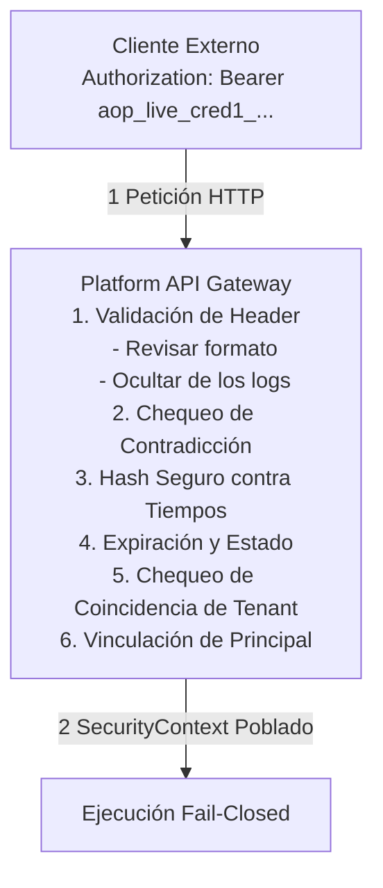

# Arquitectura de Autenticación de API Empresarial (`AOP-AUTH-01`)

## 1. Visión General y Principios Arquitectónicos

La **AI Operating Platform (AOP)** implementa autenticación de API de confianza cero y de nivel empresarial para todos los consumidores externos, servicios, operadores y subsistemas autónomos.



### Invariantes Principales
1. **$Authentication \neq Authorization$**: Establecer la prueba criptográfica de la identidad del llamador no otorga autoridad para realizar operaciones o acceder a recursos arbitrarios.
2. **$Identity \neq Authority$**: La identidad verifica quién llama (`Principal`, `tenantId`, `applicationId`); la autoridad gobierna qué capacidades se otorgan (`scopes`, `RBAC`).
3. **$Autonomy \neq Authority$**: Los agentes autónomos y los disparadores operan estrictamente dentro de límites de capacidad delimitados.
4. **Cero Almacenamiento en Texto Plano**: Las claves de API en bruto (`aop_live_<credId>_<secret>`) se generan criptográficamente y se presentan estrictamente una vez al cliente. Solo se persisten hashes SHA-256 seguros contra tiempos (`keyHash`) y prefijos seguros para visualización (`keyPrefix`).
5. **Límite Fail-Closed**: Cualquier petición no autenticada, expirada, revocada, malformada o de tenant cruzado a endpoints protegidos es rechazada de inmediato.

---

## 2. Esquemas de Autenticación Soportados

La plataforma soporta nativamente los siguientes esquemas de encabezados sobre el loopback HTTP (127.0.0.1:3000):

| Esquema de Header | Formato | Descripción |
| :--- | :--- | :--- |
| `Authorization: Bearer <API_KEY>` | `Bearer aop_live_<credId>_<secret>` | Formato estándar Bearer OAuth2/OIDC para llamadas de servicio a servicio |
| `X-API-Key: <API_KEY>` | `aop_live_<credId>_<secret>` | Header directo de clave de API para clientes SDK y consumidores automatizados |
| `X-Agent-Token: <TOKEN>` | Token Firmado JWT / HMAC | Intercambio de tokens interno para despacho de subagentes y nodos de trabajo |

### Rechazo de Headers Contradictorios
Si una petición proporciona múltiples headers de autenticación contradictorios (ej. `Authorization: Bearer keyA` y `X-API-Key: keyB` apuntando a credenciales conflictivas), el gateway rechaza la petición con `400 BAD_REQUEST` (`CONTRADICTORY_AUTH_HEADERS`) para prevenir la delegación de identidad ambigua.

---

## 3. Lista Blanca de Endpoints Públicos vs. Protegidos

### Rutas Públicas (No Requieren Autenticación)
- `GET /api/v1/health`, `GET /health`
- `GET /api/v1/health/live`, `GET /health/live`, `GET /liveness`
- `GET /api/v1/health/ready`, `GET /health/ready`, `GET /readiness`
- `GET /api/v1/status`, `GET /status`
- `GET /api/v1/diagnostics`
- Activos estáticos del Web Control Plane (`/`, `/index.html`, `/app.js`, `/styles.css`, `/i18n/*`)

### Rutas Protegidas (Autenticación Estricta y Verificación de Capacidades)
Todos los endpoints de negocio y del plano de control en `/api/v1/*` requieren credenciales autenticadas:
- Tareas (`/api/v1/tasks`, `/api/v1/tasks/:id/execute`, `/api/v1/tasks/:id/cancel`)
- Ejecuciones (`/api/v1/executions/*`)
- Operaciones Autónomas (`/api/v1/operations/*`, `/api/v1/autonomous/*`)
- Dispositivos e Impresión de Hardware (`/api/v1/devices/*`, `/api/v1/printing/*`)
- Organización y Equipos Virtuales (`/api/v1/organizations/*`, `/api/v1/teams/*`)
- Flujos de Trabajo y Soluciones (`/api/v1/workflows/*`, `/api/v1/solutions/*`)
- Gobernanza de Credenciales (`/api/v1/credentials/*`)
- Eventos y Flujos de Auditoría (`/api/v1/events/*`, `/api/v1/audit/*`)

---

## 4. Reconciliación de Tenant y Aplicación

Los llamadores externos a menudo proporcionan headers de enrutamiento contextuales (`X-Tenant-Id`, `X-Application-Id`).
El gateway de la plataforma reconcilia estrictamente estos headers contra el `SecurityContext` verificado:

- Si `X-Tenant-Id` difiere del `credential.tenantId` autenticado, el gateway devuelve `403 FORBIDDEN` (`TENANT_MISMATCH`).
- Si `X-Application-Id` difiere del `credential.applicationId` autenticado, el gateway devuelve `403 FORBIDDEN` (`APPLICATION_MISMATCH`).

```json
{
  "error": "Authenticated tenant does not match X-Tenant-Id header",
  "status": 403,
  "code": "TENANT_MISMATCH",
  "requestId": "req_88a91c0b",
  "correlationId": "corr_229f0a",
  "timestamp": "2026-09-19T20:30:00.000Z"
}
```

---

## 5. Contexto de Seguridad y Modelo de Principal

Tras una autenticación exitosa, el gateway instancia un `SecurityContext` inmutable:

```typescript
export interface SecurityContext {
  readonly principal: Principal;
  readonly authenticated: boolean;
  readonly tenantId: string;
  readonly correlationId: string;
  readonly requestId?: string;
  readonly metadata?: {
    readonly credentialId: string;
    readonly applicationId: string;
    readonly keyPrefix: string;
    readonly scopes: readonly string[];
  };
}
```

Este contexto se propaga hacia abajo a través de todos los casos de uso, registradores de auditoría y evaluadores de políticas.
