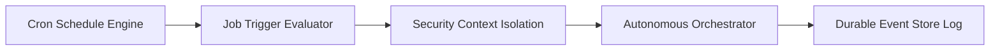

# AUTOMATION & INTEGRATION ECOSYSTEM

## 1. Visión General

El ecosistema de automatización de la AI Operating Platform v1.1 proporciona una capa de integración bidireccional segura para orquestación externa, webhooks criptográficos, tareas programadas (cron) y conectividad con plataformas como **n8n**, **Zapier**, **Make** y canales de mensajería empresarial.

$$\text{External Triggers (n8n, Webhooks, Cron)} \longleftrightarrow \text{Platform Automation Port} \longleftrightarrow \text{Autonomous Orchestrator}$$

---

## 2. Inbound & Outbound Webhooks con HMAC SHA-256

Todos los webhooks salientes son firmados criptográficamente mediante el encabezado `X-Platform-Signature-256`:

$$\text{Signature} = \text{HMAC-SHA256}(\text{secretKey}, \text{rawPayloadString})$$

Las peticiones entrantes validan ventana temporal contra ataques de replay:
- Timestamp máximo permitido de desfase: 300 segundos (5 minutos).
- Bloqueo preventivo en caso de discrepancia en la firma HMAC.

---

## 3. Conector Oficial de n8n

El conector `n8n-nodes-ai-operating-platform` expone:
1. **Trigger Node**: Recibe eventos en tiempo real (`order.placed`, `ar.tryon_completed`, `agent.alert`, `inventory.low`).
2. **Action Node**: Invoca operaciones autónomas gobernadas, genera reportes ejecutivos y consulta el registro de assets AR.

---

## 4. Motor de Tareas Programadas (Scheduler Engine)

El programador de tareas en tiempo real permite la ejecución periódica basada en sintaxis cron estándar de 5 campos (`minute hour day month day-of-week`).

