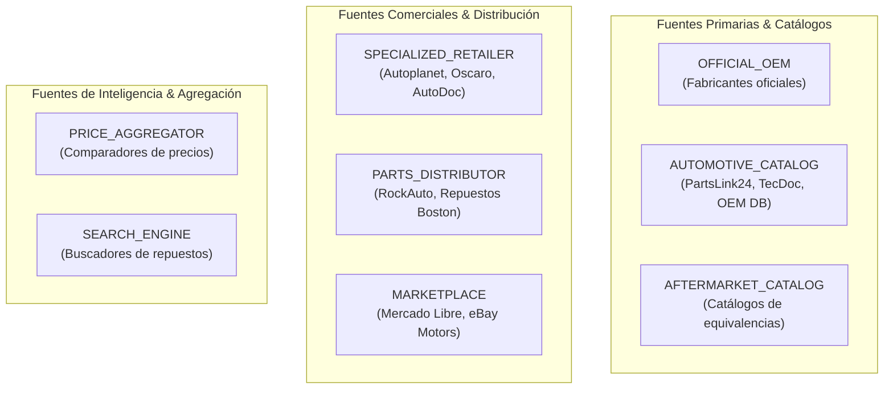

# Mapa de Fuentes Automotrices — PROJ-02 Spare Parts

> **Documento Canónico de Inteligencia, Taxonomía y Cobertura de Fuentes**  
> **Línea Base:** v1.4.0 Baseline | **Fase:** Fase 142 (`AOP-SPAREPARTS-SEARCH`)  
> **Idioma Oficial:** Español Latinoamericano (`es-419`) con identificadores técnicos en inglés  

---

## 1. Visión y Propósito de la Capa de Fuentes

El producto satélite **PROJ-02 — Spare Parts Search & Comparison** basa su propuesta de valor en una realidad medible y verificable:
$$\text{Fuentes Configuradas} \to \text{Fuentes Disponibles} \to \text{Fuentes Consultadas} \to \text{Resultados con Evidencia}$$

No promete *“buscar en todo Internet de forma mágica”*, sino consultar de forma determinista y paralela fuentes estructuradas, distribuidores oficiales, retailers especializados y catálogos de despiece OEM.

---

## 2. Taxonomía de Tipos de Fuente

---

## 3. Matriz de Fuentes Canónicas Investigadas (Muestra F142)

| ID de Fuente | Nombre Comercial | Región | Tipo de Fuente | Método de Acceso | Cobertura Vehicular | Soporte Fitment | Soporte Precios | Calidad de Evidencia | Estado Operativo |
| :--- | :--- | :--- | :--- | :--- | :--- | :--- | :--- | :--- | :--- |
| `mercadolibre-cl` | Mercado Libre Chile | `CL` | `MARKETPLACE` | `OFFICIAL_API` (OAuth2) | Universal (`ALL`) | `DEGRADED` (Texto/Atributos) | `SUPPORTED` (CLP) | 0.92 | `AVAILABLE` |
| `autoplanet-cl` | Autoplanet Chile | `CL` | `SPECIALIZED_RETAILER` | `STRUCTURED_DATA` | Multimarca Líder CL | `SUPPORTED` (Marca/Modelo/Año) | `SUPPORTED` (CLP) | 0.90 | `AVAILABLE` |
| `repuestos-boston-cl` | Repuestos Boston | `CL` | `PARTS_DISTRIBUTOR` | `WEB_PAGE` (Limpio) | Asiático / Americano | `SUPPORTED` (Catálogo OEM) | `SUPPORTED` (CLP) | 0.88 | `AVAILABLE` |
| `rockauto-global` | RockAuto LLC | `US / GLOBAL` | `PARTS_DISTRIBUTOR` | `STRUCTURED_DATA` | Universal Exhaustivo | `SUPPORTED` (Despiece Motor) | `SUPPORTED` (USD + Envío CL) | 0.95 | `AVAILABLE` |
| `ebay-motors` | eBay Motors | `US / GLOBAL` | `MARKETPLACE` | `OFFICIAL_API` (ePID) | Universal | `SUPPORTED` (ePID / KType) | `SUPPORTED` (USD) | 0.91 | `AVAILABLE` |
| `autodoc-europe` | AutoDoc SE | `EU / GLOBAL` | `SPECIALIZED_RETAILER` | `STRUCTURED_DATA` | Universal (TecDoc) | `SUPPORTED` (TecDoc KType) | `SUPPORTED` (EUR) | 0.92 | `AVAILABLE` |
| `oem-catalog-reference` | OEM Catalog DB | `GLOBAL` | `AUTOMOTIVE_CATALOG` | `PUBLIC_API` | Universal Fabricantes | `SUPPORTED` (OEM Diagrams) | `UNSUPPORTED` (Catálogo Puro) | 0.98 | `AVAILABLE` |

---

## 4. Dimensiones del Modelo de Confianza (`SourceTrustRating`)

1. **`sourceReliability` (0.0 a 1.0):** Estabilidad del endpoint, tasa de éxito histórica y consistencia de red.
2. **`dataCompleteness` (0.0 a 1.0):** Porcentaje de campos estructurados provistos (SKU, OEM, marca, especificaciones).
3. **`fitmentConfidence` (0.0 a 1.0):** Nivel de certeza de la relación pieza-vehículo (declaración del vendedor vs catálogo oficial).
4. **`priceFreshnessHours` (Horas):** Frecuencia de actualización de precios y disponibilidad de stock.
5. **`evidenceQualityScore` (0.0 a 1.0):** Capacidad de proporcionar URLs directas, capturas y afirmaciones verificables.

---

## 5. Políticas de Acceso y Seguridad de Fuentes

* **Sin Evasión:** Prohibición estricta de bypass de CAPTCHAs, spoofing o evasión de protecciones anti-bot.
* **Rate Limiting:** Respeto de límites por minuto configurados en `SourceAccessPolicy`.
* **Aislamiento:** La consulta a fuentes externas se ejecuta bajo `WebToolGateway` con `allowedDomains` explícitos.
