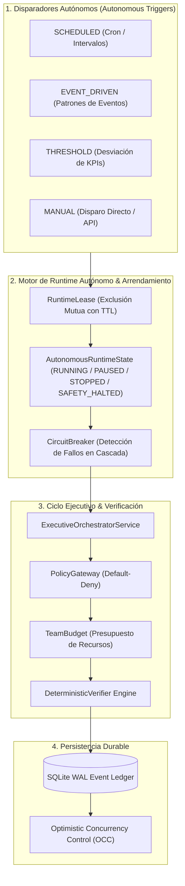

# Tiempo de Ejecución de Operaciones Autónomas (Autonomous Operations Runtime)

## 1. Visión General y Propósito Arquitectural

El **Autonomous Operations Runtime** es el subsistema de la plataforma responsable de la ejecución continua, programada y orientada a eventos de ciclos operativos de negocio sin requerir intervención humana latente para el disparo operacional, pero manteniendo una gobernanza estricta, determinista y a prueba de fallos (*fail-closed*).

### Invariante Fundamental de la Plataforma
$$\text{Trigger} \neq \text{Decision} \neq \text{Plan} \neq \text{Execution}$$
$$\text{Autonomía} \neq \text{Autoridad}$$

El runtime autónomo opera bajo el principio de **Cero Soberanía de IA CEO**. Un disparador (*trigger*) únicamente despierta o agenda la necesidad de evaluar una situación; la formulación de decisiones, la planificación y la ejecución continúan requiriendo:
1. **Identidad Confiable y Alcance de Tenant (`tenantId`).**
2. **Autoridad Explícita (`Authority`).**
3. **Validación de Políticas de Gobernanza (`PolicyGateway`).**
4. **Presupuesto Acotado (`AutonomyBudget` y `TeamResourceBudget`).**
5. **Elegibilidad y Verificación de Agentes (`AgentProfile`).**
6. **Segregación de Funciones y Verificación Determinista (`DeterministicVerifier`).**
7. **Supervisión Humana Obligatoria para Niveles Críticos (`Human Oversight`).**
8. **Trazabilidad Inmutable en el Libro de Eventos (`SqliteEventStore WAL`).**

---

## 2. Componentes Principales del Dominio Autónomo

### 2.1. AutonomousTrigger (`src/domain/autonomous/autonomous-trigger.ts`)
Representa una regla declarativa de disparo con los siguientes tipos soportados:
- **`SCHEDULED`**: Disparo por expresión cron o intervalos temporales (ej. evaluación matutina de estrategias).
- **`EVENT_DRIVEN`**: Disparo reactivo ante la persistencia de un evento de dominio específico (ej. `order.cancelled`, `stock.depleted`).
- **`THRESHOLD`**: Disparo ante la violación de umbrales en métricas de negocio o telemetría.
- **`MANUAL`**: Disparo explícito bajo demanda emitido por operadores o pruebas de integración.

### 2.2. RuntimeLease (`src/domain/autonomous/runtime-lease.ts`)
Garantiza la exclusión mutua distribuida (*distributed mutual exclusion*) para evitar ejecuciones concurrentes conflictivas del mismo objetivo o ciclo sobre la misma entidad:
- **`holderId`**: Identificador del nodo o proceso que posee el arrendamiento.
- **`resourceKey`**: Clave del recurso bloqueado (ej. `lease:enterprise:growth-2026`).
- **`ttlMs`**: Tiempo de vida del arrendamiento (evita bloqueos perpetuos por caída del proceso).
- **`version`**: Control de concurrencia optimista (*OCC*).

### 2.3. AutonomousRuntimeState (`src/domain/autonomous/autonomous-runtime-state.ts`)
Mantiene y controla los estados formales del ciclo de vida del demonio:
- **`STOPPED`**: Runtime inactivo. No consume ciclos ni evalúa disparadores.
- **`RUNNING`**: Demonio en ejecución activa continua.
- **`PAUSED`**: Operaciones temporalmente suspendidas para mantenimiento o revisión.
- **`SAFETY_HALTED`**: Detención automática de emergencia provocada por el **Circuit Breaker** tras superar el umbral de fallos consecutivos (`failureThreshold`). Requiere resolución y desbloqueo explícito (`resumeRuntime`).

---

## 3. Contratos de API de la Plataforma (`/api/v1/autonomous/*`)

| Método | Endpoint | Descripción | Requiere Autorización |
|---|---|---|---|
| `GET` | `/api/v1/autonomous/runtime` | Obtiene el estado actual del daemon, arrendamientos activos y telemetría. | Sí |
| `POST` | `/api/v1/autonomous/runtime/start` | Inicia el runtime autónomo en segundo plano. | Sí (Admin) |
| `POST` | `/api/v1/autonomous/runtime/stop` | Detiene el runtime de manera ordenada. | Sí (Admin) |
| `POST` | `/api/v1/autonomous/runtime/pause` | Pausa temporalmente el despacho de nuevos ciclos. | Sí (Admin) |
| `POST` | `/api/v1/autonomous/runtime/resume` | Reanuda el runtime o limpia el estado de `SAFETY_HALTED`. | Sí (Admin) |
| `GET` | `/api/v1/autonomous/triggers` | Lista los disparadores autónomos registrados. | Sí |
| `POST` | `/api/v1/autonomous/triggers` | Registra un nuevo disparador declarativo. | Sí (Policy-Checked) |
| `POST` | `/api/v1/autonomous/triggers/:id/enable` | Habilita un disparador deshabilitado. | Sí |
| `POST` | `/api/v1/autonomous/triggers/:id/disable` | Deshabilita temporalmente un disparador. | Sí |
| `POST` | `/api/v1/autonomous/triggers/:id/fire` | Dispara manualmente la ejecución inmediata de un disparador. | Sí |

---

## 4. Gobernanza y Seguridad en el Plano de Control Web

La interfaz de usuario del Plano de Control Web (`src/platform/web/index.html` y `app.js`) proporciona:
1. **Consola de Estado del Demonio**: Visualización en vivo de estados (`RUNNING`, `PAUSED`, `SAFETY_HALTED`), arrendamientos activos y disparos del circuit breaker.
2. **Gestor de Disparadores Autónomos**: Panel interactivo con validación de esquemas y controles de activación/desactivación inmediata.
3. **Explorador de Ciclos Autónomos**: Reconstrucción paso a paso de la cadena de 6 fases: Disparador &rarr; Decisión &rarr; Plan &rarr; Ejecución &rarr; Verificación &rarr; Gobernanza.
4. **Centro de Incidentes de Seguridad**: Visibilidad inmediata de suspensiones automáticas por presupuesto excedido o conflicto de arrendamiento.
5. **Higiene DOM Estricta**: Construcción 100% libre de vulnerabilidades XSS mediante APIs DOM seguras (**0 `.innerHTML`**).
