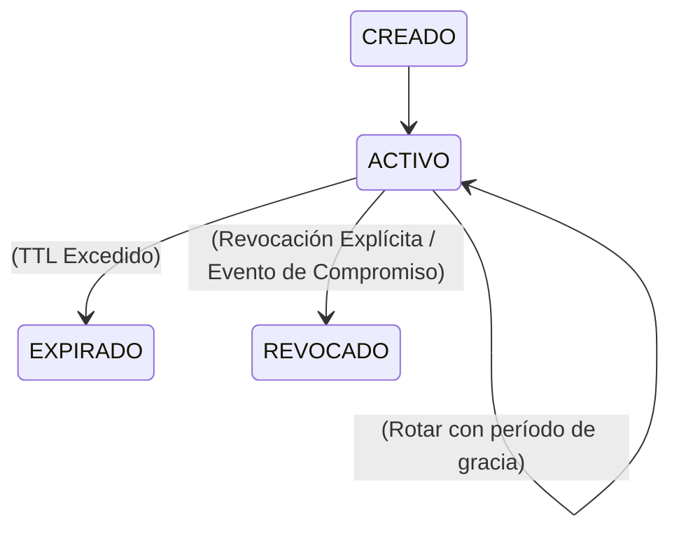

# Gobernanza de Credenciales de API y Almacenamiento Cero-Texto-Plano (`AOP-AUTH-03`)

## 1. Visión General y Postura de Seguridad

El **Subsistema de Gobernanza de Credenciales de API** gestiona el ciclo de vida criptográfico completo de las credenciales de la plataforma.

---

## 2. Modelo de Almacenamiento Cero-Texto-Plano

Para prevenir fugas de secretos a través de volcados de base de datos, logs o salidas de depuración, las claves de API en bruto nunca se almacenan en disco:

1. **Generación de Claves**:
   - `credentialId`: `cred_<16_hex_entropy>`
   - `secretEntropy`: `crypto.randomBytes(32).toString('hex')` (256 bits)
   - `rawKey`: `aop_live_<credentialId>_<secretEntropy>`
   - `keyPrefix`: `aop_live_<credentialId_first_8>`
   - `keyHash`: `SHA-256(rawKey)` (codificado en hex)
2. **Presentación de Uso Único**:
   - La `rawKey` se devuelve en el payload de respuesta estrictamente una vez en la creación inicial o rotación.
3. **Almacenamiento**:
   - El motor de persistencia durable (SQLite WAL) almacena estrictamente: `id`, `principalId`, `principalType`, `tenantId`, `applicationId`, `name`, `keyPrefix`, `keyHash`, `status`, `scopes`, `createdAt`, `expiresAt`, `revokedAt`, `lastUsedAt`, `version`.
4. **Verificación**:
   - La verificación extrae el ID/hash de la petición entrante y realiza una comparación de hash segura contra tiempos a través de `crypto.timingSafeEqual()`.

---

## 3. Estrategias de Rotación y Migración Sin Tiempo de Inactividad

La plataforma soporta rotación de credenciales sin interrupciones:

- **Revocación Inmediata (`gracePeriodMs: 0`)**: Revoca instantáneamente la clave antigua y activa la nueva. Recomendado para sospechas de compromiso de claves.
- **Migración con Período de Gracia (`gracePeriodMs > 0`)**: Retiene la clave antigua en un estado de gracia activo por una duración definida (ej. 1 hora, 24 horas, 7 días) mientras activa la nueva clave inmediatamente. Permite a los consumidores distribuidos rotar claves sin tiempo de inactividad del servicio.

---

## 4. Registro de Auditoría y Eventos de Dominio

Todo evento del ciclo de vida de credenciales publica eventos de dominio durables a SQLite WAL:

| Tipo de Evento | Agregado | Payload |
| :--- | :--- | :--- |
| `auth.credential.created` | `credentialId` | `principalId`, `tenantId`, `applicationId`, `keyPrefix`, `scopes`, `expiresAt` |
| `auth.credential.used` | `credentialId` | `principalId`, `tenantId`, `applicationId`, `requestId` |
| `auth.credential.rotated` | `credentialId` | `oldCredentialId`, `newCredentialId`, `gracePeriodMs` |
| `auth.credential.revoked` | `credentialId` | `principalId`, `tenantId`, `reason`, `revokedAt` |
| `auth.authentication.failed` | `credentialId` | `code`, `reason`, `requestId` |

---

## 5. Consola de Gobernanza del Web Control Plane

Los operadores pueden ver, crear, rotar y revocar credenciales directamente en el **Web Control Plane** bajo **Security Center** (`#tab-security`):
- Visualización en tiempo real del estado de la clave, último uso y scopes.
- Modal seguro para copiado de clave de uso único.
- Revocación instantánea con modales de confirmación.
- Seguridad estricta del DOM: cero `innerHTML` en todos los flujos de renderizado.
