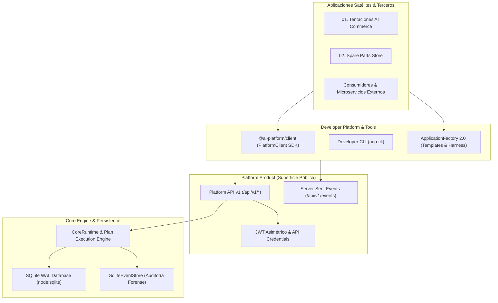

# Plataforma para Desarrolladores — AI Operating Platform (Developer Platform)

Este documento describe la **Developer Platform** de la AI Operating Platform, formalizando los contratos de integración, el SDK de cliente, la fábrica de aplicaciones satélites (`ApplicationFactory`) y las herramientas CLI.

---

## 1. Arquitectura de la Developer Platform

La Developer Platform es la capa de producto que permite a desarrolladores internos y externos consumir, gobernar y extender las capacidades de la plataforma sin acoplarse a los detalles internos del motor ni a la base de datos subyacente.



### Regla Fundamental de Aislamiento
```text
SATELLITE APPLICATION → PLATFORM SDK → PLATFORM API → CORE ENGINE
```
Las aplicaciones satélites **NUNCA** acceden directamente a:
* Bases de datos SQLite ni archivos `.db`.
* Entidades de dominio internas o servicios privados.
* Repositorios de infraestructura o controladores de hardware.

---

## 2. Componentes Principales

| Componente | Ubicación en Código | Propósito |
| :--- | :--- | :--- |
| **`PlatformClient` SDK** | `src/platform-client/index.ts` | SDK fuertemente tipado en TypeScript con reintentos exponenciales, timeouts, propagación de correlación y gestión de errores. |
| **Developer CLI (`aop-cli`)** | `src/platform-client/cli.ts` | Utilidad de línea de comandos para inspección de salud, listado de agentes, consulta de tareas y exportación de evidencias. |
| **Application Factory CLI (`create-aop-app`)** | `src/platform-client/create-aop-app.ts` | Herramienta CLI de andamiaje y verificación automatizada de aplicaciones satélites gobernadas ([Ver Guía](./APPLICATION_FACTORY_CLI.md)). |
| **`ApplicationFactory` 2.0 Engine** | `src/application/factory/application-generator.ts` | Motor generador de andamiaje (*scaffolding*), validación de manifiestos, comprobación de derechos (entitlements) y arnés de pruebas de conformidad. |
| **Motor de Compatibilidad** | `src/domain/application/application-trust.js` | Verificación declarativa de capacidades requeridas vs provistas y cálculo de nivel de confianza (`ApplicationTrustLevel`). |

---

## 3. Autenticación y Credenciales

El SDK soporta dos mecanismos de autenticación:

1. **Credenciales API (`apiKey`):**
   Claves con prefijo `aop_live_*` almacenadas mediante hash SHA-256 en la base de datos de plataforma. Se envían mediante la cabecera `X-API-Key` o `Authorization: Bearer <key>`.
2. **Tokens JWT Asimétricos (`bearerToken`):**
   Tokens firmados con claves RS256/ES256 con validación de emisor (`iss`), audiencia (`aud`), expiración (`exp`) y alcance (`tenantId`). Se envían en la cabecera `Authorization: Bearer <jwt>`.

---

## 4. Manejo de Errores y Modelo de Excepciones

Todas las respuestas de error de la API HTTP se mapean a la clase tipada `PlatformClientError`:

```typescript
try {
  const task = await client.tasks.get("task-non-existent");
} catch (err) {
  if (err instanceof PlatformClientError) {
    console.error(`Código: ${err.code}`);         // e.g. "TASK_NOT_FOUND" o "NOT_FOUND"
    console.error(`HTTP Status: ${err.status}`);   // e.g. 404
    console.error(`Request ID: ${err.requestId}`); // e.g. "d82f...-UUID"
    console.error(`Trace ID: ${err.traceId}`);     // e.g. "trace-12345"
  }
}
```

---

## 5. Reintentos e Idempotencia

* **Reintentos Automáticos:** El cliente reintenta automáticamente solicitudes fallidas (códigos HTTP 500-504 o fallos de red) **exclusivamente para métodos idempotentes** (`GET`, `HEAD`, `PUT`, `DELETE`, `OPTIONS`).
* **Idempotencia en POST:** Para solicitudes `POST`, los reintentos solo se activan si la solicitud incluye la cabecera `Idempotency-Key` o `idempotencyKey` en la entrada de creación.
* **Algoritmo de Retroceso:** Retroceso exponencial con factor configurable (`backoffFactor`, por defecto 2) y retardo base (`retryDelayMs`, por defecto 200ms).
