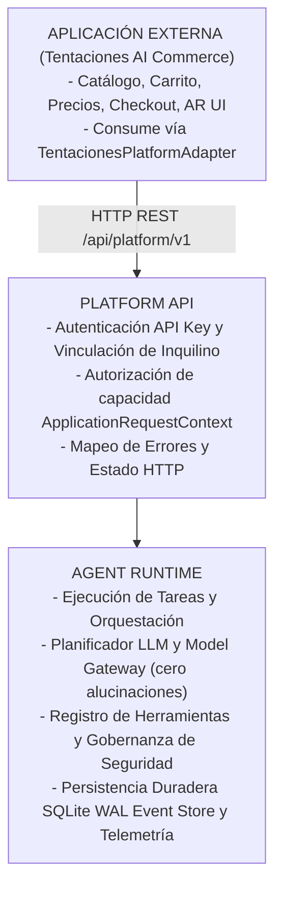

# Arquitectura de Aplicación de Extremo a Extremo y Verificación

## 1. El Paradigma Central

$$\text{CORE ENGINE} \neq \text{PLATFORM PRODUCT} \neq \text{APPLICATIONS}$$

---

## 2. Traza del Viaje de Usuario Dorado (Golden User Journey)

1. **Intención**: El usuario expresa una necesidad no estructurada en español ("Quiero zapatillas negras para maratón").
2. **Invocación de Plataforma**: El `TentacionesPlatformAdapter` llama a `POST /api/v1/tasks` con la capacidad `product.discovery`.
3. **Ejecución**: El Core Agent Runtime ejecuta un plan determinista -> extrae términos -> emite eventos de ciclo de vida.
4. **Recomendación**: Llama a `product.recommendation` -> clasifica candidatos reales sin inventar artículos.
5. **Probador AR**: Resuelve `urn:tentaciones:ar:footwear:runner-black-pro` para el avatar `Nova`.
6. **Motor de Tallas**: Evalúa las medidas del cuerpo -> recomienda la talla exacta con fundamentos de ajuste.
7. **Comparación**: Compara especificaciones de productos reales lado a lado.
8. **Asistencia de Carrito**: Calcula el umbral del carrito, califica para envío gratuito y sugiere accesorios compatibles.
9. **Observabilidad**: La traza de auditoría completa se preserva en el SQLite WAL EventStore coincidiendo con un solo `traceId` de correlación.
