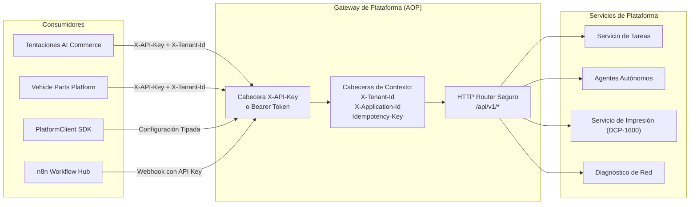

# Conectividad de Consumidores Externos (External Consumers Connectivity)

## 1. Visión General y Ecosistema de Consumidores
La **AI Operating Platform (AOP)** expone su API de forma unificada bajo `/api/v1/*` para diversos consumidores heterogéneos:
- **Tentaciones AI Commerce**: Plataforma de comercio electrónico con tienda web, catálogo dinámico, agente de ventas y tickets de comanda físicos.
- **Vehicle Parts Platform**: Sistema B2B de inventario y repuestos automotrices con compatibilidad VIN y cotizaciones automatizadas.
- **Enterprise Support Agent**: Agente de atención y soporte corporativo omnicanal.
- **PlatformClient SDK**: Librería cliente Node.js / TypeScript estándar para integración programática rápida y segura.
- **Herramientas de Automatización (n8n / Webhooks)**: Motores de flujos externos para orquestación empresarial.

---

## 2. Matriz de Integración por Consumidor



---

## 3. Especificación de Cabeceras Estándar para Consumidores

| Cabecera | Requerida | Formato / Ejemplo | Descripción |
|---|---|---|---|
| `X-API-Key` o `Authorization` | Sí (rutas protegidas) | `aop_live_cred_18e...` / `Bearer eyJ...` | Credencial criptográfica asociada al inquilino y aplicación. |
| `X-Tenant-Id` | Opcional (Recomendado) | `tenant-tentaciones` | Identificador de inquilino para verificación y aislamiento multi-tenant. |
| `X-Application-Id` | Opcional | `tentaciones-commerce` | Identificador de la aplicación emisora para auditoría y granularidad. |
| `Idempotency-Key` | Opcional (Recomendado en POST) | `uuidv4` o clave de negocio | Garantiza que solicitudes reintentadas no causen efectos secundarios duplicados. |
| `X-Correlation-Id` | Opcional | `trace-abc-123` | Identificador de trazabilidad distribuida extremo a extremo. |

---

## 4. Guía de Uso con `PlatformClient` SDK

El SDK oficial proporciona soporte nativo para resolución de inquilino, reintentos idempotentes y diagnósticos de topología:

```typescript
import { createPlatformClient } from "./src/platform-client/index.js";

// Inicialización segura del cliente
const client = createPlatformClient({
  baseUrl: process.env.AOP_BASE_URL || "https://api.empresa.com",
  apiKey: process.env.AOP_API_KEY,
  tenantId: "tenant-tentaciones",
  applicationId: "tentaciones-commerce",
  timeoutMs: 10000,
  retryPolicy: {
    maxRetries: 3,
    retryDelayMs: 250,
    backoffFactor: 2,
  },
});

// 1. Consultar diagnóstico de red y perímetro
const networkInfo = await client.diagnostics.network();
console.log("Topología de Red:", networkInfo.exposureMode);
console.log("Aislamiento de Periféricos:", networkInfo.deviceIsolation.deviceLayerIsolated);

// 2. Crear una tarea de negocio con idempotencia automática
const task = await client.createTask({
  type: "ORDER_PROCESSING",
  tenantId: "tenant-tentaciones",
  payload: { orderId: "ORD-9912", amount: 450.0 },
});
```

---

## 5. Integración con n8n y Servicios Externos vía Webhooks

Para conectar n8n u otros orquestadores externos:
1. Cree una credencial de tipo `SERVICE` en el panel de control (`#tab-security`) con scopes específicos (por ejemplo: `["tasks.create", "tasks.read"]`).
2. Configure el nodo HTTP Request en n8n:
   - **Method**: `POST`
   - **URL**: `https://<tu-dominio>/api/v1/tasks`
   - **Headers**:
     - `X-API-Key`: `aop_live_cred_...`
     - `X-Tenant-Id`: `<tenant-id>`
     - `Content-Type`: `application/json`
3. Monitoree las peticiones y diagnósticos en tiempo real desde la pestaña de Seguridad y Topología de Red del Control Plane Web.
