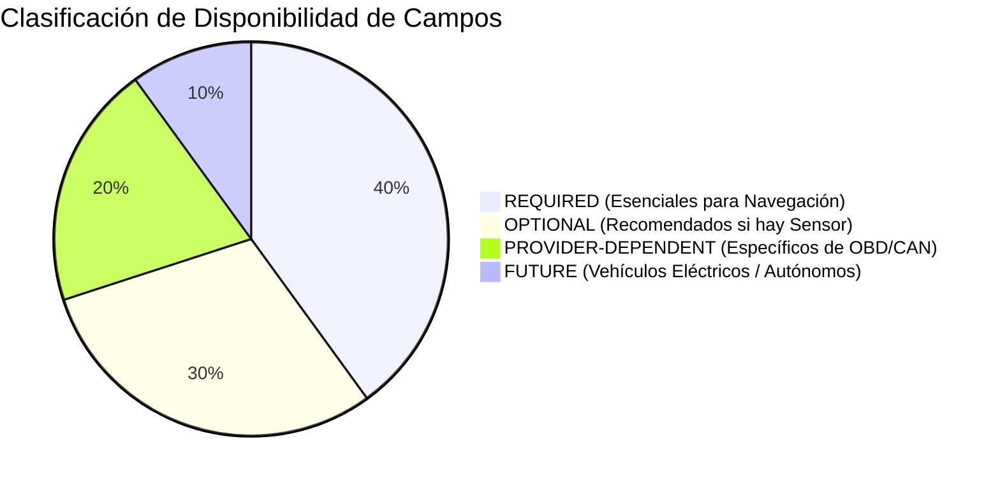
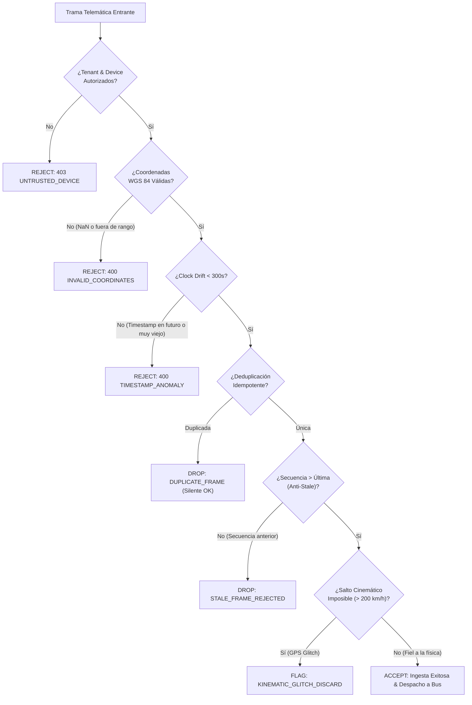

# Especificación Técnica de Telemetría IoT — PROJ-03: Fleet Management

> **Documento Canónico de Especificación Telemática**  
> **Proyecto:** `PROJ-03-FLEET` (*Fleet Management & Logistics*)  
> **Línea Base del Sistema:** v1.4.0 Baseline  
> **Fecha de Formalización:** 2026-10-05  
> **Estado:** `CANONICAL / DESIGN SPECIFICATION`  
> **Alineación:** Agnóstico a hardware específico; compatible con pasarelas telemáticas estándar OBD-II, CAN Bus y GPS móvil.

---

## 1. Propósito y Misión de la Especificación

El presente documento define la **taxonomía neutral, los esquemas de datos fuertemente tipados, las unidades de medida estandarizadas y las reglas deterministas de calidad de datos** para la ingesta, validación y propagación de telemetría vehicular en el producto satélite **`PROJ-03 Fleet Management`**.

### Invariante Fundamental:
> **La plataforma y la aplicación satélite son agnósticas al fabricante del hardware telemático.**
> Toda trama proveniente de receptores GPS comerciales, dispositivos telemáticos celulares o dongles OBD-II Bluetooth/WiFi debe ser normalizada a esta especificación canónica antes de ingresar a los motores de decisión y despacho.

---

## 2. Taxonomía de Campos y Clasificación de Disponibilidad

Para evitar la suposición irreal de que todo vehículo sensorizado reporta la totalidad de variables de telemetría, los campos se clasifican en cuatro categorías formales:



1. **`REQUIRED`:** Variables mínimas indispensables para ubicar al vehículo y validar la cinemática de la ruta. Si faltan, la trama se rechaza *fail-closed*.
2. **`OPTIONAL`:** Variables complementarias que enriquecen el análisis de conducción pero cuya ausencia no invalida la trama de navegación.
3. **`PROVIDER-DEPENDENT`:** Variables que dependen de la disponibilidad del puerto de diagnóstico de a bordo (OBD-II / J1939 CAN Bus).
4. **`FUTURE`:** Variables reservadas para telemetría avanzada de vehículos eléctricos (Batería SoC, degradación de celdas) o sensores ADAS.

---

## 3. Modelo Estructural del Envoltorio: `TelemetryEnvelope`

El envoltorio proporciona el contexto de transporte, seguridad, aislamiento multi-tenant y autenticidad del dispositivo emisor:

```typescript
export interface TelemetryEnvelope {
  /** Versión del esquema de telemetría para compatibilidad hacia atrás (ej. "1.0.0") */
  readonly schemaVersion: "1.0.0";

  /** Identificador único global de la trama telemática (UUID v4) */
  readonly envelopeId: string;

  /** Identificador del inquilino propietario del activo (Multi-Tenant Boundary) */
  readonly tenantId: string;

  /** Identificador de la aplicación satélite consumidora (PROJ-03-FLEET) */
  readonly applicationId: "PROJ-03-FLEET";

  /** Identificador del dispositivo de telemetría en borde que emitió la trama */
  readonly deviceId: string;

  /** Tipo de hardware o canal de captura en borde */
  readonly sourceType: "OBD_CELLULAR" | "MOBILE_GPS" | "CAN_GATEWAY" | "SIMULATED_TEST";

  /** Marca de tiempo de emisión en el dispositivo (UTC ISO-8601 estricto) */
  readonly sentAt: string;

  /** Marca de tiempo de recepción perimétrica en la pasarela satélite (UTC ISO-8601) */
  readonly receivedAt: string;

  /** Firma criptográfica HMAC/SHA-256 de la trama emitida por el dispositivo (Opcional) */
  readonly deviceSignatureSha256?: string;

  /** Carga útil con la instantánea telemática del vehículo */
  readonly snapshot: TelemetrySnapshot;
}
```

---

## 4. Modelo de la Instantánea Telemática: `TelemetrySnapshot`

Representa el estado puntual del vehículo en un instante discreto de tiempo $t$:

```typescript
export interface TelemetrySnapshot {
  /** Identificador del vehículo al que está asociado el dispositivo */
  readonly vehicleId: string;

  /** Número de secuencia monotónico emitido por el dispositivo emisor */
  readonly sequenceNumber: number;

  /** Marca de tiempo de la medición del sensor (UTC ISO-8601) */
  readonly timestamp: string;

  /** Coordenadas espaciales WGS 84 y altimetría */
  readonly position: TelemetryPosition;

  /** Cinemática del movimiento vehicular */
  readonly kinematics: TelemetryKinematics;

  /** Diagnósticos del motor y transmisión (PROVIDER-DEPENDENT) */
  readonly diagnostics?: VehicleDiagnostics;

  /** Estado del combustible o almacenamiento de energía (OPTIONAL / PROVIDER-DEPENDENT) */
  readonly energy?: EnergyState;

  /** Odometría acumulada y uso del motor (REQUIRED / OPTIONAL) */
  readonly usage: VehicleUsage;

  /** Alertas o condiciones críticas detectadas en borde */
  readonly activeAlerts?: TelemetryAlert[];
}
```

### 4.1. Posición y Coordenadas (`TelemetryPosition`)
* **Sistema de Coordenadas:** WGS 84 (`EPSG:4326`), el estándar internacional de GPS.
* **Unidades:** Grados decimales con un mínimo de 5 decimales (resolución $\approx 1.1\text{ m}$).

```typescript
export interface TelemetryPosition {
  /** Latitud en grados decimales [-90.0 .. +90.0] - REQUIRED */
  readonly latitude: number;

  /** Longitud en grados decimales [-180.0 .. +180.0] - REQUIRED */
  readonly longitude: number;

  /** Altitud sobre el nivel del mar en metros - OPTIONAL */
  readonly altitudeMeters?: number;

  /** Radio de incertidumbre de la posición horizontal en metros (HPE) - REQUIRED */
  readonly accuracyMeters: number;

  /** Número de satélites fijados para el cálculo de la posición - OPTIONAL */
  readonly satellitesLocked?: number;
}
```

### 4.2. Cinemática (`TelemetryKinematics`)
```typescript
export interface TelemetryKinematics {
  /** Velocidad instantánea en kilómetros por hora (km/h) [0.0 .. 250.0] - REQUIRED */
  readonly speedKmh: number;

  /** Rumbo o dirección de desplazamiento en grados [0.0 .. 360.0) respecto al Norte - REQUIRED */
  readonly headingDegrees: number;

  /** Aceleración en los ejes X, Y, Z expresada en múltiplos de g (9.81 m/s²) - OPTIONAL */
  readonly accelerationG?: {
    readonly lateral: number;     // Eje X: Curvas / Derrape
    readonly longitudinal: number;// Eje Y: Aceleración / Frenado brusco
    readonly vertical: number;    // Eje Z: Baches / Impactos
  };
}
```

### 4.3. Diagnósticos Vehiculares (`VehicleDiagnostics`)
```typescript
export interface VehicleDiagnostics {
  /** Estado del encendido del motor - REQUIRED */
  readonly engineState: "OFF" | "ACC" | "IDLE" | "RUNNING";

  /** Revoluciones por minuto del motor (RPM) [0 .. 10000] - PROVIDER-DEPENDENT */
  readonly engineRpm?: number;

  /** Temperatura del refrigerante de motor en grados Celsius [ -40 .. +150] - PROVIDER-DEPENDENT */
  readonly coolantTempCelsius?: number;

  /** Voltaje de la batería de 12V/24V en Voltios [0.0 .. 36.0] - OPTIONAL */
  readonly batteryVoltageV?: number;

  /** Lista de códigos de error de diagnóstico activos (SAE J1979 DTCs, ej. ["P0300", "P0171"]) */
  readonly dtcCodes: string[];

  /** Estado del indicador de falla del motor (Check Engine Light / MIL) */
  readonly malfunctionIndicatorOn: boolean;
}
```

### 4.4. Energía y Combustible (`EnergyState`)
```typescript
export interface EnergyState {
  /** Tipo de fuente primaria de energía del vehículo */
  readonly type: "COMBUSTION" | "ELECTRIC" | "HYBRID";

  /** Nivel de combustible residual en porcentaje [0.0 .. 100.0] */
  readonly fuelLevelPercent?: number;

  /** Volumen de combustible residual estimado en Litros */
  readonly fuelVolumeLiters?: number;

  /** Nivel de carga de la batería de tracción (SoC) en porcentaje [0.0 .. 100.0] - FUTURE */
  readonly stateOfChargePercent?: number;

  /** Consumo instantáneo en l/100km o kWh/100km - OPTIONAL */
  readonly instantConsumption?: number;
}
```

### 4.5. Uso y Odometría (`VehicleUsage`)
```typescript
export interface VehicleUsage {
  /** Odómetro total acumulado por el vehículo en kilómetros [0.0 .. 5,000,000.0] - REQUIRED */
  readonly odometerKm: number;

  /** Horas totales acumuladas de operación del motor - OPTIONAL */
  readonly engineHoursTotal?: number;
}
```

---

## 5. Reglas de Validación de Calidad Telemática (Data Quality Governance)

El adaptador de ingesta perimétrica debe validar las siguientes reglas de calidad antes de aceptar cualquier trama:



### 5.1. Matriz de Tratamiento de Anomalías

| Condición Anómala | Criterio de Detección | Acción Determinista del Adaptador | Justificación |
| :--- | :--- | :--- | :--- |
| **`stale telemetry`** | `sequenceNumber <= latestCommittedSequenceNumber` | **Rechazo / Descarte.** Código: `STALE_FRAME_REJECTED`. | Previene que tramas rezagadas sobreescriban la última posición conocida en el mapa. |
| **`duplicate telemetry`** | Mismo `deviceId` + `timestamp` + `sequenceNumber` | **Deduplicación silenciosa.** Se confirma recepción (200 OK) sin reprocesar. | Redes celulares inestables reintentan la misma trama; se evita doble cómputo de odometría. |
| **`out-of-order telemetry`** | `timestamp` anterior al último registrado en más de 60 s | **Encolado en búfer de reordenamiento** o descarte si excede la ventana de tolerancia. | Respeta la monotonicidad física de las trayectorias vehiculares. |
| **`missing telemetry`** | Silencio del dispositivo durante más de $N$ minutos en estado `IN_TRANSIT` | **Transición de telemetría a `SIGNAL_LOST`** tras 180 s; alerta al despachador tras 600 s. | Visibilidad operativa inmediata ante pérdida de cobertura o corte de alimentación del sensor. |
| **`invalid coordinates`** | $\text{lat} \notin [-90, 90]$ o $\text{lon} \notin [-180, 180]$ o $(0.0, 0.0)$ (*Null Island*) | **Rechazo fail-closed.** Código: `INVALID_COORDINATES`. | Receptores GPS en reinicio emiten `(0,0)`; contamina los cálculos de distancia y geocercas. |
| **`clock drift`** | $|t_{\text{sensor}} - t_{\text{gateway}}| > 300\text{ segundos}$ | **Rechazo de trama.** Código: `CLOCK_DRIFT_EXCEEDED`. | Evita que desincronizaciones de reloj interno en sensores baratos falseen las secuencias de auditoría. |
| **`untrusted device`** | `deviceId` no vinculado activamente al `tenantId` en `DeviceRegistry` | **Rechazo de seguridad.** Código: `403 UNTRUSTED_DEVICE`. | Defiende al sistema contra inyección maliciosa de telemetría por dispositivos no inventariados. |
| **`kinematic glitch`** | $\Delta d / \Delta t > 200\text{ km/h}$ entre dos tramas continuas | **Descarte de posición espuria**, manteniendo el último vector cinemático válido. | El rebote de señal GPS en edificios altos genera saltos irreales de varios kilómetros en un segundo. |

---

## 6. Formato de Serialización y Transporte Wire

1. **Protocolo Perimétrico:** HTTP/1.1 o HTTP/2 sobre TLS 1.3 (`POST /api/v1/fleet/telemetry/ingest` en la pasarela satélite).
2. **Formato:** JSON estricto codificado en `UTF-8`.
3. **Límite de Carga:** Tamaño máximo de payload por paquete individual: **64 KB** (permite paquetes batch de hasta 100 tramas comprimidas en caso de reconexión tras zona sin cobertura).
4. **Cabeceras Obligatorias:**
   - `Content-Type: application/json`
   - `X-Tenant-Id: <tenant-id>`
   - `X-Device-Id: <device-id>`
   - `X-Client-Trace-Id: <trace-id>`
