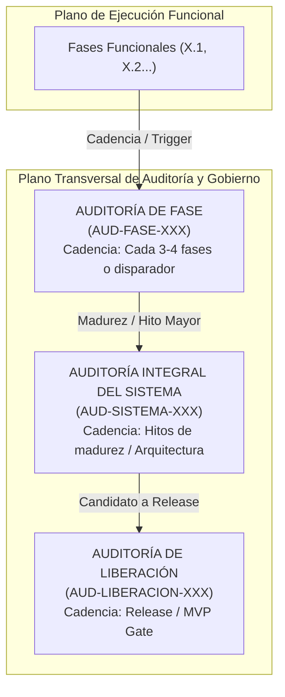

# Gobernanza de Calidad y Auditorías Transversales de Plataforma

## 1. Propósito y Misión

La **Gobernanza de Calidad y Auditorías Transversales** de la **AI Operating Platform** (`johangonzahenri/ai-operating-platform`) establece el marco institucional y metodológico para evaluar de manera continua, objetiva y reproducible la integridad arquitectónica, la seguridad perimetral, la resiliencia operacional y la no-regresión de todas las capacidades del sistema.

### Principio Fundamental:
> **La aprobación de la suite de pruebas automatizadas no equivale automáticamente a la aprobación de una auditoría de sistema, ni esta última certifica un entorno productivo.**
>
> $$\text{Test Suite PASS} \neq \text{Auditoría del Sistema Aprobada} \neq \text{Producción Certificada}$$

El propósito de una auditoría no es únicamente responder *"¿pasan los tests unitarios?"*, sino certificar:
1. ¿El sistema completo continúa operando como una plataforma cohesiva, desacoplada y predecible?
2. ¿Se mantienen vigentes todos los invariantes de seguridad (*default-deny*, aislamiento multi-tenant, zero `innerHTML`, redacción de secretos)?
3. ¿Se preserva la pureza de la Arquitectura Hexagonal sin filtraciones de dependencias externas ni acoplamientos prohibidos en el Core Engine?
4. ¿Existe paridad estricta entre los contratos OpenAPI 3.1, los clientes SDK (`@ai-platform/client`), las rutas HTTP en runtime y las aplicaciones satélite consumidoras?

---

## 2. Tipos de Controles y Auditorías

El marco define tres categorías formales e independientes de auditoría:



### 2.1. Auditoría de Fase (`AUD-FASE-XXX`)
- **Objetivo**: Detectar regresiones recientes, deriva arquitectónica (*architectural drift*), acumulación de deuda técnica y verificar la integración de las últimas 3 a 4 fases funcionales.
- **Alcance**: Delimitado a las interfaces, contratos y adaptadores impactados directamente en el ciclo reciente, más la suite de regresión completa.
- **Regla Operativa**: NO es una fase funcional ni crea nuevas funcionalidades. Se ejecuta como control transversal de estabilización.

### 2.2. Auditoría Integral del Sistema (`AUD-SISTEMA-XXX`)
- **Objetivo**: Validación holística de extremo a extremo (E2E) de la totalidad de subsistemas, contratos, capas perimetrales, persistencia, seguridad, observabilidad y aplicaciones satélite.
- **Alcance**: Plataforma completa (Core Engine, Dominio, Aplicación, Persistencia SQLite WAL, API HTTP, SSE, Seguridad, Multi-Tenancy, Multi-Agente, MCP, SATÉLITES: PROJ-01 Tentaciones, PROJ-02 Spare Parts).
- **Activación**: En hitos mayores de arquitectura, transiciones de portafolio, antes de runtime distribuido o cuando una auditoría de fase detecte una regresión transversal.

### 2.3. Auditoría de Liberación (`AUD-LIBERACION-XXX`)
- **Objetivo**: Verificación formal de un estado candidato a Release (`MVP Release`, `V1 Release`, `Production Release`, `Public Demo Release`).
- **Alcance**: Criterios de producción, despliegue, empaquetado de clientes, políticas de soporte y evidencia de cumplimiento regulatorio sellada criptográficamente.
- **Regla Operativa**: No se ejecuta como parte ordinaria del ciclo de desarrollo diario.

---

## 3. Disparadores Obligatorios y Frecuencia

Una auditoría se activará por defecto según su periodicidad base, o de forma inmediata ante la presencia de cualquiera de los siguientes disparadores técnicos:

| Disparador Técnico | Tipo de Auditoría Activada | Justificación |
| :--- | :--- | :--- |
| **Cadencia regular (3–4 fases completadas)** | `AUD-FASE-XXX` | Prevención de acumulación de deuda silenciosa. |
| **Cambio de modelo de Autenticación / Autorización** | `AUD-FASE-XXX` o `AUD-SISTEMA-XXX` | Riesgo de escalación de privilegios o brechas de tenant. |
| **Nueva superficie o versión de Platform API / OpenAPI** | `AUD-FASE-XXX` | Garantizar paridad 1:1 con SDK y aplicaciones cliente. |
| **Migración o cambio de motor de persistencia** | `AUD-FASE-XXX` | Integridad ACID, WAL, concurrencia OCC y rehidratación. |
| **Nuevo runtime de ejecución o agente** | `AUD-FASE-XXX` | Aislamiento de control plane, límites de autonomía y SoD. |
| **Integración externa crítica o protocolo (e.g. MCP)** | `AUD-FASE-XXX` | Verificación de sandboxing, taint tracking y rate limiting. |
| **Transición de producto o hito de madurez (e.g. Fases 152/156)** | `AUD-SISTEMA-XXX` | Certificación de estabilidad transversal de portafolio. |
| **Candidato formal a Release / MVP** | `AUD-LIBERACION-XXX` | Compuerta de calidad previa a distribución pública. |

---

## 4. Jerarquía de Autoridad y Fuente de la Verdad (Source of Truth)

Toda auditoría y evaluación de calidad debe someterse estrictamente a la jerarquía formal de autoridad:

$$\text{CODE} > \text{TESTS / EXECUTION EVIDENCE} > \text{GIT} > \text{OFFICIAL DOCUMENTATION} > \text{ROADMAP} > \text{EXCEL / KANBAN}$$

### Reglas de Verdad:
1. **Ninguna afirmación es válida por aparecer en un Roadmap o Excel**: Si una iniciativa figura como `DONE` en un tablero pero carece de código ejecutable en `src/` y pruebas verificables en `tests/`, la auditoría la clasificará como `NO IMPLEMENTADO` o `HALLAZGO CRÍTICO`.
2. **Si el Excel contradice el Código**: Se corrige el libro Excel para reflejar la realidad del código, jamás se muta el código para satisfacer una anotación documental errónea.
3. **Evidencia Ejecutable Real**: La evidencia válida consiste exclusivamente en salidas de terminal (`stdout`/`stderr`), suites de prueba aprobadas (`node scripts/test.js`), invocaciones HTTP en vivo (`curl` o clientes reales sobre sockets locales) y hashes SHA-256 inmutables.

---

## 5. Taxonomía Oficial de Estados de Auditoría

Toda auditoría ejecutada debe culminar en uno de los siguientes cinco estados formales:

```text
+-----------------------------------------------------------------------------------+
|                        TAXONOMÍA DE ESTADOS DE AUDITORÍA                          |
+-----------------------------------------------------------------------------------+
| 1. EN CURSO                        | Evaluación y pruebas en ejecución activa.     |
| 2. APROBADA                        | Cero hallazgos críticos/altos, E2E 100% PASS. |
| 3. APROBADA CON DEUDA TÉCNICA      | Sin bloqueos críticos; deuda documentada.     |
| 4. BLOQUEADA                       | Hallazgo crítico no resuelto o fallo de E2E.  |
| 5. NO EJECUTABLE                   | Bloqueo ambiental o dependencias ausentes.   |
+-----------------------------------------------------------------------------------+
```

> **Prohibición de Calificativos Ambiguos**: Queda estrictamente prohibido emitir veredictos como *"100% perfecto"*, *"100% terminado"* o *"sin riesgo"*.

---

## 6. Clasificación y Ciclo de Vida de Hallazgos

Todo hallazgo detectado durante un control de auditoría se documenta bajo la siguiente estructura unificada:

```text
- ID:           HAL-[TIPO]-[NÚMERO] (e.g. HAL-SISTEMA-001)
- Severidad:    CRÍTICO | ALTO | MEDIO | BAJO
- Descripción:  Explicación técnica detallada del problema o brecha
- Componente:   Ruta de archivo o subsistema afectado (e.g. src/platform/api/http-router.ts)
- Evidencia:    Comando, test o traza reproducible que demuestra el fallo
- Impacto:      Consecuencia arquitectónica, de seguridad o de estabilidad
- Acción:       Resolución requerida (corrección inmediata o registro en deuda técnica)
- Estado:       ABIERTO | CORREGIDO | MITIGADO | ACEPTADO | PENDIENTE DE ENTORNO
```

### Regla de Corrección durante la Auditoría:
- **Permitido**: Corregir regresiones, bugs, vulnerabilidades de seguridad, *drift* contractual, fallos de integración y desajustes de consistencia documental.
- **Estrictamente Prohibido**: Introducir nuevas funcionalidades, nuevas capacidades (*capabilities*), nuevos productos o dependencias de terceros no autorizadas. La auditoría tiene como misión **ESTABILIZAR**, no **CRECER**.

---

## 7. Regla de No Contaminación del Plan Maestro

1. **Invarianza de la Numeración Funcional**: El Master Work Plan mantiene su secuencia numérica funcional inmutable ($153 \to 154 \to 155 \to 156 \to 157 \dots$).
2. **Prohibición de Fases de Auditoría**: Está estrictamente prohibido crear una fase funcional para auditorías (e.g., `FASE 157 — Auditoría`).
3. **Registro Transversal Desacoplado**: Las auditorías se indexan con prefijos dedicados (`AUD-FASE-XXX`, `AUD-SISTEMA-XXX`, `AUD-LIBERACION-XXX`) y se registran en una sección transversal de gobernanza en el Master Work Plan y en `docs/REGISTRO_DE_AUDITORIAS.md`.

---

## 8. Criterios de Cierre de Auditoría

Una auditoría se considerará formalmente concluida cuando se satisfagan los siguientes requisitos:
1. Matriz de pruebas E2E ejecutada con resultado documentado paso a paso.
2. 100% de la suite de pruebas de la plataforma pasando (`npm test`).
3. 100% de consistencia documental y contractual (`scripts/docs-check.mjs`, `scripts/validate-openapi.mjs`, `scripts/master-work-plan-check.mjs`).
4. Hallazgos completamente clasificados y registrados con estados terminales o mitigaciones aprobadas.
5. Emisión del informe técnico formal `docs/AUDITORIA_[TIPO]_[NUMERO].md`.
6. Registro actualizado en `docs/REGISTRO_DE_AUDITORIAS.md` y `docs/MASTER_WORK_PLAN.md`.
7. Árbol de trabajo de Git limpio (`HEAD == origin/main`).
