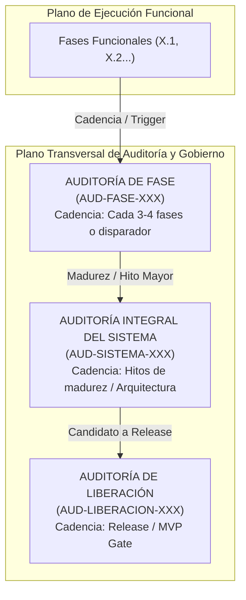

# Gobernanza de Calidad y Auditorías Transversales de Plataforma

## 1. Propósito y Misión

La **Gobernanza de Calidad y Auditorías Transversales** de la **AI Operating Platform** (`johangonzahenri/ai-operating-platform`) establece el marco institucional y metodológico para evaluar de manera continua, objetiva y reproducible la integridad arquitectónica, la seguridad perimetral, la resiliencia operacional y la no-regresión de todas las capacidades del sistema.

### Principio Fundamental:
> **La aprobación de la suite de pruebas automatizadas no equivale automáticamente a la aprobación de una auditoría de sistema, ni esta última certifica un entorno productivo.**
>
> $$\text{Test Suite PASS} \neq \text{Auditoría del Sistema Aprobada} \neq \text{Producción Certificada}$$

El propósito de una auditoría no es únicamente responder *"¿pasan los tests unitarios?"*, sino certificar:
1. ¿El sistema completo continúa operando como una plataforma cohesiva, desacoplada y predecible?
2. ¿Se mantienen vigentes todos los invariantes de seguridad (*default-deny*, aislamiento multi-tenant, zero `innerHTML`, redacción de secretos)?
3. ¿Se preserva la pureza de la Arquitectura Hexagonal sin filtraciones de dependencias externas ni acoplamientos prohibidos en el Core Engine?
4. ¿Existe paridad estricta entre los contratos OpenAPI 3.1, los clientes SDK (`@ai-platform/client`), las rutas HTTP en runtime y las aplicaciones satélite consumidoras?

---

## 2. Tipos de Controles y Auditorías

El marco define tres categorías formales e independientes de auditoría:



### 2.1. Auditoría de Fase (`AUD-FASE-XXX`)
- **Objetivo**: Detectar regresiones recientes, deriva arquitectónica (*architectural drift*), acumulación de deuda técnica y verificar la integración de las últimas 3 a 4 fases funcionales.
- **Alcance**: Delimitado a las interfaces, contratos y adaptadores impactados directamente en el ciclo reciente, más la suite de regresión completa.
- **Regla Operativa**: NO es una fase funcional ni crea nuevas funcionalidades. Se ejecuta como control transversal de estabilización.

### 2.2. Auditoría Integral del Sistema (`AUD-SISTEMA-XXX`)
- **Objetivo**: Validación holística de extremo a extremo (E2E) de la totalidad de subsistemas, contratos, capas perimetrales, persistencia, seguridad, observabilidad y aplicaciones satélite.
- **Alcance**: Plataforma completa (Core Engine, Dominio, Aplicación, Persistencia SQLite WAL, API HTTP, SSE, Seguridad, Multi-Tenancy, Multi-Agente, MCP, SATÉLITES: PROJ-01 Tentaciones, PROJ-02 Spare Parts).
- **Activación**: En hitos mayores de arquitectura, transiciones de portafolio, antes de runtime distribuido o cuando una auditoría de fase detecte una regresión transversal.

### 2.3. Auditoría de Liberación (`AUD-LIBERACION-XXX`)
- **Objetivo**: Verificación formal de un estado candidato a Release (`MVP Release`, `V1 Release`, `Production Release`, `Public Demo Release`).
- **Alcance**: Criterios de producción, despliegue, empaquetado de clientes, políticas de soporte y evidencia de cumplimiento regulatorio sellada criptográficamente.
- **Regla Operativa**: No se ejecuta como parte ordinaria del ciclo de desarrollo diario.

---

## 3. Disparadores Obligatorios y Frecuencia

Una auditoría se activará por defecto según su periodicidad base, o de forma inmediata ante la presencia de cualquiera de los siguientes disparadores técnicos:

| Disparador Técnico | Tipo de Auditoría Activada | Justificación |
| :--- | :--- | :--- |
| **Cadencia regular (3–4 fases completadas)** | `AUD-FASE-XXX` | Prevención de acumulación de deuda silenciosa. |
| **Cambio de modelo de Autenticación / Autorización** | `AUD-FASE-XXX` o `AUD-SISTEMA-XXX` | Riesgo de escalación de privilegios o brechas de tenant. |
| **Nueva superficie o versión de Platform API / OpenAPI** | `AUD-FASE-XXX` | Garantizar paridad 1:1 con SDK y aplicaciones cliente. |
| **Migración o cambio de motor de persistencia** | `AUD-FASE-XXX` | Integridad ACID, WAL, concurrencia OCC y rehidratación. |
| **Nuevo runtime de ejecución o agente** | `AUD-FASE-XXX` | Aislamiento de control plane, límites de autonomía y SoD. |
| **Integración externa crítica o protocolo (e.g. MCP)** | `AUD-FASE-XXX` | Verificación de sandboxing, taint tracking y rate limiting. |
| **Transición de producto o hito de madurez (e.g. Fases 152/156)** | `AUD-SISTEMA-XXX` | Certificación de estabilidad transversal de portafolio. |
| **Candidato formal a Release / MVP** | `AUD-LIBERACION-XXX` | Compuerta de calidad previa a distribución pública. |

---

## 4. Jerarquía de Autoridad y Fuente de la Verdad (Source of Truth)

Toda auditoría y evaluación de calidad debe someterse estrictamente a la jerarquía formal de autoridad:

$$\text{CODE} > \text{TESTS / EXECUTION EVIDENCE} > \text{GIT} > \text{OFFICIAL DOCUMENTATION} > \text{ROADMAP} > \text{EXCEL / KANBAN}$$

### Reglas de Verdad:
1. **Ninguna afirmación es válida por aparecer en un Roadmap o Excel**: Si una iniciativa figura como `DONE` en un tablero pero carece de código ejecutable en `src/` y pruebas verificables en `tests/`, la auditoría la clasificará como `NO IMPLEMENTADO` o `HALLAZGO CRÍTICO`.
2. **Si el Excel contradice el Código**: Se corrige el libro Excel para reflejar la realidad del código, jamás se muta el código para satisfacer una anotación documental errónea.
3. **Evidencia Ejecutable Real**: La evidencia válida consiste exclusivamente en salidas de terminal (`stdout`/`stderr`), suites de prueba aprobadas (`node scripts/test.js`), invocaciones HTTP en vivo (`curl` o clientes reales sobre sockets locales) y hashes SHA-256 inmutables.

---

---

## 5. Taxonomía Oficial de Niveles de Evidencia (Evidence Levels)

Para eliminar cualquier ambigüedad entre afirmaciones documentales, pruebas unitarias y entornos reales, se establece la jerarquía canónica de 8 niveles de evidencia:

```text
+----------------------------------------------------------------------------------------------------+
|                               JERARQUÍA FORMAL DE NIVELES DE EVIDENCIA                             |
+----------------------------------------------------------------------------------------------------+
| Nivel | Nombre               | Descripción y Límites del Alcance                                   |
| :---  | :---                 | :---                                                                |
| E0    | DOCUMENTAL           | Especificaciones, esquemas OpenAPI, README, ADRs y manuales.        |
| E1    | ANÁLISIS ESTÁTICO    | Análisis de AST, linters, 0 innerHTML/eval, pureza de importación.  |
| E2    | TEST UNITARIO        | Pruebas de agregados y lógica pura en memoria sin I/O externo.      |
| E3    | TEST DE INTEGRACIÓN  | Pruebas de múltiples componentes coordinados con fakes o SQLite WAL |
| E4    | E2E SIMULADO         | Flujo de extremo a extremo simulado con adaptadores in-memory.      |
| E5    | E2E LIVE HTTP        | Sockets HTTP reales sobre loopback local (127.0.0.1) con requests.   |
| E6    | ENTORNO DE STAGING   | Despliegue en infraestructura pre-productiva con red externa.       |
| E7    | PRODUCCIÓN CERTIF.   | Tráfico productivo real, certificados TLS públicos y corporativos.  |
+----------------------------------------------------------------------------------------------------+
```

### Reglas de Frontera de Reclamo de Evidencia (Evidence Claim Boundaries):
1. **Invariante E2 $\neq$ E5**: Ninguna prueba unitaria o de integración en memoria puede presentarse como "Live HTTP E2E".
2. **Invariante E5 $\neq$ E7**: Ninguna prueba sobre socket local `127.0.0.1` puede presentarse como "Producción Certificada".
3. **Invariante E0 $\neq$ Runtime**: La validación sintáctica de OpenAPI 3.1 (`scripts/validate-openapi.mjs`) certifica el contrato documental (E0), no la paridad de ejecución en runtime si la ruta no es invocada sobre socket HTTP (E5).
4. **Distinción entre Software y Entorno**: Si una capacidad está implementada en código (`src/`) y verificada con fakes (E3), pero requiere infraestructura externa para operar (e.g. IdP OIDC en nube pública o CA TLS), su estado debe reportarse como `VERIFICADO EN CÓDIGO (E3) / PENDIENTE DE ENTORNO (E6/E7)`.

---

## 6. Cobertura de Auditoría (Audit Coverage) e Inventario de Capacidades

Se establece formalmente que:

$$\text{100% Tests Passing} \neq \text{100% System Audited}$$

El resultado de las suites de prueba (`npm test`) mide la no-regresión del código existente; la **Cobertura de Auditoría** mide la proporción de capacidades del catálogo del sistema que han sido sometidas a verificación en el control activo:

$$\text{Audit Coverage (\%)} = \frac{\text{Capacidades Auditadas} + 0.5 \times \text{Capacidades Parcialmente Auditadas}}{\text{Total de Capacidades Declaradas}} \times 100$$

Cada capacidad del inventario real del sistema debe clasificarse inequívocamente en uno de los siguientes estados:
- **`AUDITADO`**: Cuenta con prueba formal asociada y evidencia del nivel requerido (E1, E3 o E5).
- **`PARCIALMENTE_AUDITADO`**: Probado en capa de integración o dominio, con aspectos de runtime o streaming pendientes.
- **`NO_AUDITADO`**: Implementado en código pero omitido en el arnés de la auditoría activa.
- **`NO_APLICA`**: Capacidad planificada o de backlog que no corresponde a la línea base actual.
- **`PENDIENTE_DE_ENTORNO`**: Implementado en software, pero bloqueado para prueba completa por falta de host o proveedor externo.

---

## 7. Golden Journeys Canónicos y Regresión entre Aplicaciones

La auditoría transversal somete a prueba recorridos críticos (*Golden Journeys*) multi-capa:

### Golden Journey A — Plataforma Central & Gateway HTTP (Level E5)
$$\text{Client / SDK} \xrightarrow{\text{HTTP}} \text{Gateway} \xrightarrow{\text{Auth 401/403}} \text{Rate Limiter} \xrightarrow{\text{Tenant Isolation}} \text{Task / Workflow} \xrightarrow{\text{Result}} \text{Audit Log}$$

### Golden Journey B — Satélite PROJ-02: Spare Parts Search & Fitment (Level E4/E5)
$$\text{HTTP Request} \xrightarrow{\text{Auth}} \text{Query Decomposition} \xrightarrow{\text{Multi-Source Search}} \text{Clustering} \xrightarrow{\text{Fitment Verification}} \text{Landed Cost}$$

### Golden Journey C — Satélite PROJ-01: Tentaciones Virtual Try-On Pipeline (Level E3/E4)
$$\text{Pose Input} \xrightarrow{\text{Landmarks}} \text{One-Euro Smoothing} \xrightarrow{\text{Anthropometrics}} \text{Garment Alignment} \xrightarrow{\text{Warp Field}} \text{Depth} \xrightarrow{\text{Occlusion}} \text{Render Input}$$

### Golden Journey D — Protocolo MCP Oficial (Level E3/E5)
$$\text{JSON-RPC Request} \xrightarrow{\text{Transport (Stdio/HTTP)}} \text{MCP Server} \xrightarrow{\text{Initialize}} \text{Tool Discovery} \xrightarrow{\text{Tool Runtime}} \text{Safe Execution}$$

### Regla para Futuras Aplicaciones Satélite (`PROJ-03`, `PROJ-04`, `PROJ-05`...):
Toda nueva aplicación o producto vertical que se incorpore al portafolio de la plataforma **DEBE** registrar su propio *Application Golden Journey* y perfil de auditoría independiente (`docs/audit-profiles/` o arnés dedicado). Los Golden Journeys centrales de plataforma jamás se modifican ni se acoplan a la lógica de negocio de satélites individuales.

---

## 8. Taxonomía Oficial de Estados de Auditoría

Toda auditoría ejecutada debe culminar en uno de los siguientes cuatro estados formales:

```text
+----------------------------------------------------------------------------------------------------+
|                               TAXONOMÍA DE ESTADOS DE AUDITORÍA                                    |
+----------------------------------------------------------------------------------------------------+
| 1. EN CURSO                        | Evaluación y pruebas en ejecución activa.                     |
| 2. APROBADA                        | Cero hallazgos críticos/altos, E2E 100% PASS, 0 deuda técnica.|
| 3. APROBADA CON DEUDA TÉCNICA      | Sin bloqueos críticos; deuda documentada y aceptada.          |
| 4. BLOQUEADA                       | Hallazgo crítico/alto no resuelto o fallo en Golden Journey.  |
| 5. NO EJECUTABLE                   | Bloqueo ambiental o dependencias ausentes.                   |
+----------------------------------------------------------------------------------------------------+
```

> **Prohibición de Calificativos Ambiguos**: Queda estrictamente prohibido emitir veredictos como *"100% perfecto"*, *"100% terminado"* o *"sin riesgo"*.

---

## 9. Clasificación y Ciclo de Vida de Hallazgos

Todo hallazgo detectado durante un control de auditoría se documenta bajo la siguiente estructura unificada:

```text
- ID:           HAL-[TIPO]-[NÚMERO] (e.g. HAL-SISTEMA-001)
- Severidad:    CRÍTICO | ALTO | MEDIO | BAJO
- Categoría:    DEFECT_BUG | TECHNICAL_DEBT | ARCHITECTURAL_RISK | EVIDENCE_OVERCLAIM | ENVIRONMENT_GAP
- Descripción:  Explicación técnica detallada del problema o brecha
- Componente:   Ruta de archivo o subsistema afectado (e.g. src/platform/api/http-router.ts)
- Nivel Evid.:  E0..E7
- Evidencia:    Comando, test o traza reproducible que demuestra el fallo
- Impacto:      Consecuencia arquitectónica, de seguridad o de estabilidad
- Acción:       Resolución requerida (corrección inmediata o registro en deuda técnica)
- Estado:       ABIERTO | CORREGIDO | MITIGADO | ACEPTADO_DEUDA | PENDIENTE DE ENTORNO
```

### Criterio de Bloqueo Automático:
Un hallazgo bloquea la auditoría (`AUDITORIA_BLOQUEADA`) si cumple simultáneamente:
1. Severidad es `CRÍTICO` o `ALTO`.
2. Su estado es `ABIERTO`.
3. Compromete el aislamiento multi-tenant, la seguridad perimetral, la integridad ACID de datos, los límites de la Arquitectura Hexagonal o la ejecución de un Golden Journey canónico.

### Regla de Corrección durante la Auditoría:
- **Permitido**: Corregir regresiones, bugs, vulnerabilidades de seguridad, *drift* contractual, fallos de integración, sobre-reclamos de evidencia (*evidence overclaims*) y desajustes de consistencia documental.
- **Estrictamente Prohibido**: Introducir nuevas funcionalidades de negocio, nuevas capacidades (*capabilities*), nuevos productos o dependencias de terceros no autorizadas. La auditoría tiene como misión **ESTABILIZAR**, no **CRECER**.

---

## 10. Regla de No Contaminación del Plan Maestro

1. **Invarianza de la Numeración Funcional**: El Master Work Plan mantiene su secuencia numérica funcional inmutable ($153 \to 154 \to 155 \to 156 \to 157 \dots$).
2. **Prohibición de Fases de Auditoría**: Está estrictamente prohibido crear una fase funcional para auditorías (e.g., `FASE 157 — Auditoría`).
3. **Registro Transversal Desacoplado**: Las auditorías se indexan con prefijos dedicados (`AUD-FASE-XXX`, `AUD-SISTEMA-XXX`, `AUD-LIBERACION-XXX`) y se registran en una sección transversal de gobernanza en el Master Work Plan y en `docs/REGISTRO_DE_AUDITORIAS.md`.

---

## 11. Criterios de Cierre de Auditoría

Una auditoría se considerará formalmente concluida cuando se satisfagan simultáneamente los siguientes 7 requisitos:
1. Matriz de pruebas y controles ejecutada con evidencia reproducible y niveles E0..E7 documentados.
2. Declaración explícita de cobertura de auditoría sobre el inventario de capacidades.
3. 100% de la suite de pruebas automatizadas del repositorio pasando (`npm test`).
4. 100% de consistencia documental y contractual (`scripts/docs-check.mjs`, `scripts/validate-openapi.mjs`, `scripts/master-work-plan-check.mjs`).
5. Hallazgos completamente clasificados y registrados con estados terminales o mitigaciones aprobadas.
6. Emisión del informe técnico formal `docs/AUDITORIA_[TIPO]_[NUMERO].md` y actualización de `docs/REGISTRO_DE_AUDITORIAS.md`.
7. Árbol de trabajo de Git limpio y sincronizado (`HEAD == origin/main`).

