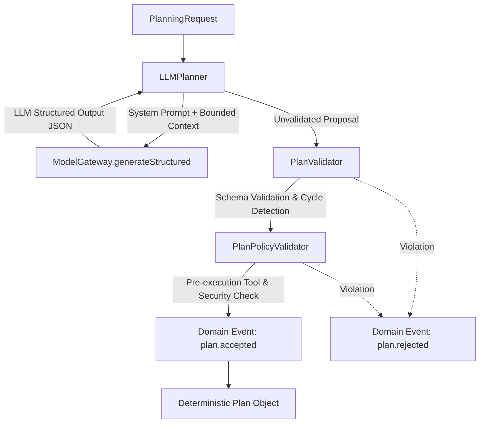

# LLM Planner & Structured Planning Architecture (Phase 15 — Real Intelligence Runtime)

## 1. Executive Summary & Foundational Principle

In the **AI Operating Platform**, artificial intelligence models operate strictly under the principle of **Separation of Planning and Execution**:

> **"The model proposes, the validator verifies, the policy authorizes, the runtime executes."**

The model **NEVER** directly executes tools, authorizes actions, overrides system configurations, modifies security contexts, or escalates permissions. The output of an LLM is treated as an untrusted, declarative proposal that must undergo deterministic structural validation, semantic DAG acyclicity checks, and multi-tenant security boundary enforcement before any execution can be scheduled.

---

## 2. Planning Pipeline Architecture

---

## 3. Core Components

### 3.1 Declarative Plan Domain Model (`src/domain/autonomy/plan.ts`)
- **`Plan`**: Aggregate root containing `schemaVersion`, monotonic `version`, `goal`, `constraints`, and an ordered, immutable list of `PlanStep` entities.
- **`PlanStep`**: Represents an individual operational step with `id`, `order` (1-indexed monotonic integer), `action`, `input` (frozen dictionary), `toolId`, `dependencies`, and `constraints`.
- **Invariants**:
  - Max plan steps: 50 (`MAX_PLAN_STEPS`)
  - Max step dependencies: 10 (`MAX_DEPENDENCIES`)
  - Max step input size: 64 KB (`MAX_STEP_INPUT_SIZE`)
  - Max metadata size: 16 KB (`MAX_PLAN_METADATA_SIZE`)

### 3.2 Structural & Semantic Validation (`src/domain/autonomy/plan-validator.ts`)
- **`PLAN_JSON_SCHEMA`**: Strict JSON Schema defining valid plan outputs.
- **Topological Sorting & Cycle Detection**:
  - Implements Kahn's algorithm over step dependencies.
  - Verifies that all referenced step dependencies strictly precede the referencing step in topological order.
  - Detects and rejects forward dependencies, self-dependencies, duplicate step IDs, and circular loops (`PlanCycleDetectedError`).
- **Input Sanitization**:
  - Validates that model inputs contain no forbidden security keys (`principal`, `roles`, `permissions`, `tenantId`, `securityLevel`).
  - Blocks prototype pollution and constructor injection attempts (`__proto__`, `constructor`, `prototype`).

### 3.3 Plan Policy Pre-Execution Validation (`src/domain/autonomy/plan-policy-validator.ts`)
- Verifies every plan step against the platform's security policies:
  - Enforces `SecurityBoundaryEnforcer.enforceToolBoundary` for every referenced tool.
  - Evaluates authorization via `PolicyGateway` with fail-closed semantics.
  - Ensures the executing agent has explicit privileges to invoke the planned actions.

### 3.4 Prompt Injection Resistance (`src/infrastructure/autonomy/llm-planner.ts`)
- Separates system instructions, tool definitions, contextual memory, and user goals.
- Treats user objective and task context as untrusted data inputs encapsulated in structured JSON.
- Ignores prompt injection attempts designed to alter the caller's role, tenant, or security level.
- Implements bounded exponential backoff retries for transient model failures (rate limits, network timeout).

---

## 4. Security Invariants Summary

| Invariant | Description | Enforcement Mechanism |
|---|---|---|
| **#1: Declarative Proposals Only** | Model cannot execute actions or trigger side effects directly | `LLMPlanner` only emits `Plan` objects |
| **#2: Schema Compliance** | Model output must conform to strict JSON Schema | `ModelGateway.generateStructured` + `PlanValidator` |
| **#3: Directed Acyclic Graph** | Steps must form an acyclic dependency graph | Kahn's algorithm in `PlanValidator` |
| **#4: Zero Security Escalation** | Model cannot inject security tokens or elevate permissions | Forbidden keys check in `PlanValidator` |
| **#5: Fail-Closed Policy Check** | Unauthorized tools reject the entire plan prior to execution | `PlanPolicyValidator` |
| **#6: Architectural Isolation** | Zero database or tool implementation coupling in Planner | Verified by automated architectural test suite |
