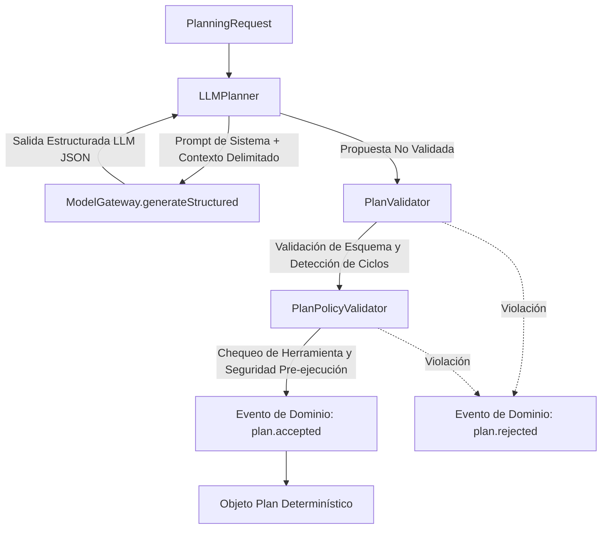

# LLM Planner y Arquitectura de Planificación Estructurada (Fase 15 — Runtime de Inteligencia Real)

## 1. Resumen Ejecutivo y Principio Fundacional

En la **AI Operating Platform**, los modelos de inteligencia artificial operan estrictamente bajo el principio de **Separación de Planificación y Ejecución**:

> **"El modelo propone, el validador verifica, la política autoriza, el runtime ejecuta."**

El modelo **NUNCA** ejecuta herramientas de manera directa, ni autoriza acciones, ni anula configuraciones del sistema, ni modifica contextos de seguridad o escala permisos. La salida de un LLM se trata como una propuesta no confiable y declarativa que debe someterse a validación estructural determinística, chequeos de aciclicidad semántica en DAG, y a la aplicación de límites de seguridad multi-tenant antes de que se pueda programar cualquier ejecución.

---

## 2. Arquitectura de Tubería (Pipeline) de Planificación

```mermaid
flowchart TD
    PR[PlanningRequest] --> LP[LLMPlanner]
    LP -->|"Prompt de Sistema + Contexto Delimitado"| MG[ModelGateway.generateStructured]
    MG -->|"Salida Estructurada LLM JSON"| LP
    LP -->|"Propuesta No Validada"| PV[PlanValidator]
    PV -->|"Validación de Esquema y Detección de Ciclos"| PPV[PlanPolicyValidator]
    PPV -->|"Chequeo de Herramienta y Seguridad Pre-ejecución"| DEC["Evento de Dominio: plan.accepted"]
    DEC --> PLAN["Objeto Plan Determinístico"]
    
    PV -.->|"Violación"| REJ["Evento de Dominio: plan.rejected"]
    PPV -.->|"Violación"| REJ
```

---

## 3. Componentes Core

### 3.1 Modelo de Dominio de Plan Declarativo (`src/domain/autonomy/plan.ts`)
- **`Plan`**: Raíz de agregado (Aggregate root) conteniendo `schemaVersion`, `version` monotónica, `goal`, `constraints`, y una lista ordenada e inmutable de entidades `PlanStep`.
- **`PlanStep`**: Representa un paso operacional individual con `id`, `order` (entero monotónico con índice 1), `action`, `input` (diccionario congelado), `toolId`, `dependencies` y `constraints`.
- **Invariantes**:
  - Max plan steps: 50 (`MAX_PLAN_STEPS`)
  - Max step dependencies: 10 (`MAX_DEPENDENCIES`)
  - Max step input size: 64 KB (`MAX_STEP_INPUT_SIZE`)
  - Max metadata size: 16 KB (`MAX_PLAN_METADATA_SIZE`)

### 3.2 Validación Estructural y Semántica (`src/domain/autonomy/plan-validator.ts`)
- **`PLAN_JSON_SCHEMA`**: JSON Schema estricto definiendo salidas válidas del plan.
- **Ordenamiento Topológico y Detección de Ciclos**:
  - Implementa el algoritmo de Kahn sobre dependencias de pasos.
  - Verifica que todas las dependencias referenciadas de los pasos precedan estrictamente al paso que las referencia en el orden topológico.
  - Detecta y rechaza dependencias futuras, autodenominadas, IDs de paso duplicados y ciclos circulares (`PlanCycleDetectedError`).
- **Sanitización de Entrada**:
  - Valida que las entradas de los modelos no contengan claves de seguridad prohibidas (`principal`, `roles`, `permissions`, `tenantId`, `securityLevel`).
  - Bloquea intentos de polución de prototipos (prototype pollution) e inyección de constructores (`__proto__`, `constructor`, `prototype`).

### 3.3 Validación de Política de Plan Pre-Ejecución (`src/domain/autonomy/plan-policy-validator.ts`)
- Verifica cada paso del plan en contra de las políticas de seguridad de la plataforma:
  - Impone `SecurityBoundaryEnforcer.enforceToolBoundary` para cada herramienta referenciada.
  - Evalúa autorización mediante `PolicyGateway` con semántica de fail-closed (cerrado por defecto).
  - Garantiza que el agente en ejecución tenga privilegios explícitos para invocar las acciones planeadas.

### 3.4 Resistencia a Inyección de Prompts (`src/infrastructure/autonomy/llm-planner.ts`)
- Separa las instrucciones de sistema, definiciones de herramientas, memoria contextual y metas del usuario.
- Trata el objetivo del usuario y el contexto de la tarea como entradas de datos no confiables encapsuladas en JSON estructurado.
- Ignora intentos de inyección de prompts diseñados para alterar el rol, tenant o nivel de seguridad del llamador.
- Implementa reintentos delimitados de retroceso exponencial (exponential backoff) para fallos transitorios de los modelos (rate limits, tiempos de espera de red).

---

## 4. Resumen de Invariantes de Seguridad

| Invariante | Descripción | Mecanismo de Aplicación |
|---|---|---|
| **#1: Solo Propuestas Declarativas** | El modelo no puede ejecutar acciones o disparar efectos secundarios directamente | `LLMPlanner` solo emite objetos `Plan` |
| **#2: Cumplimiento de Esquema** | La salida del modelo debe conformarse a un estricto JSON Schema | `ModelGateway.generateStructured` + `PlanValidator` |
| **#3: Grafo Acíclico Dirigido (DAG)** | Los pasos deben formar un grafo de dependencias acíclico | Algoritmo de Kahn en `PlanValidator` |
| **#4: Cero Escalada de Seguridad** | El modelo no puede inyectar tokens de seguridad ni elevar permisos | Chequeo de claves prohibidas en `PlanValidator` |
| **#5: Chequeo de Política Fail-Closed** | Herramientas no autorizadas rechazan todo el plan previo a la ejecución | `PlanPolicyValidator` |
| **#6: Aislamiento Arquitectónico** | Cero acoplamiento de bases de datos o implementación de herramientas en el Planner | Verificado por suite de pruebas automatizadas arquitecturales |
