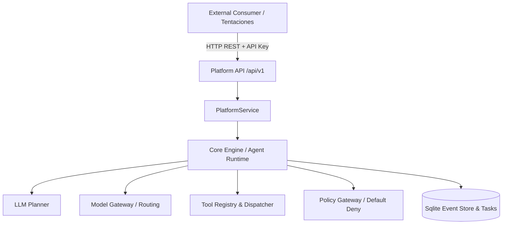

# MANUAL OFICIAL DE LA AI OPERATING PLATFORM

## 1. Executive Overview
La **AI Operating Platform** es una plataforma de orquestación de inteligencia artificial multi-agente, desacoplada, gobernada y orientada a la producción. Proporciona las capacidades centrales de planificación, enrutamiento neutral de modelos LLM, ejecución segura de herramientas, persistencia duradera en SQLite WAL, trazabilidad inmutable y una API tipada para aplicaciones consumidoras externas.

## 2. Project Vision
Construir una infraestructura de software de IA rigurosa donde la inteligencia de los modelos esté subordinada a políticas de seguridad, presupuestos deterministas y límites arquitectónicos estrictos.

## 3. Architecture Principles
- **Separación Fundamental:** `CORE ENGINE != PLATFORM PRODUCT != APPLICATIONS`.
- **Arquitectura Hexagonal:** Dominio puro con puertos e interfaces; infraestructura basada en adaptadores enchufables.
- **Default-Deny:** Toda invocación de agente o herramienta denegada por defecto hasta autorización explícita por política.
- **Cero Alucinación de Catálogo:** Los modelos LLM extraen intenciones pero nunca inventan precios, stock o identificadores reales.
- **Trazabilidad Inmutable:** Cada decisión, paso y error queda correlacionado con un `traceId` único en el Event Store duradero.

## 4. Global Architecture


## 5. Core Engine
El motor central (`src/application/runtime/core-runtime.ts`) coordina el ciclo de vida de tareas (`CREATED` -> `RUNNING` -> `COMPLETED` / `FAILED`), evaluando pre-condiciones, presupuestos y límites operativos sin acoplarse a frameworks web.

## 6. Orchestrator
El orquestador coordina DAGs multi-paso deterministas o basados en agentes, garantizando la terminación acotada y la propagación del contexto de ejecución.

## 7. Planner
El `LLMPlanner` descompone objetivos de alto nivel en planes ejecutables acotados (`Plan`, `PlanStep`), validando esquemas y transformando respuestas de modelos en intenciones estructuradas.

## 8. Agents
Entidades gobernadas con metadatos seguros (`SafeAgentMetadata`), capacidades declaradas y estados operativos administrados.

## 9. Model Gateway
Capa neutral de abstracción para proveedores de modelos (Stub, OpenAI, Anthropic, Ollama) que normaliza solicitudes, presupuestos de tokens y llamadas a herramientas estructuradas.

## 10. Memory
Abstracción de contexto y memoria (`MemoryGateway`, `TaskContext`) con aislamiento por tenant e higienización de secretos antes de cada interacción con el modelo.

## 11. Tool Layer
Registro tipado (`ToolRegistry`), validación determinista de esquemas JSON y ejecución mediante `ToolInvocationRuntime` con tokens de cancelación y aprobación para herramientas de riesgo crítico.

## 12. Security & Governance
- Identificación de principales (`Principal`: USER, SERVICE, SYSTEM, ANONYMOUS).
- Contexto de seguridad inmutable (`SecurityContext`).
- Evaluación de políticas fail-closed y aislamiento estricto multi-tenant (`tenantId`).

## 13. Observability
Emisión estructurada de eventos de auditoría y métricas con correlación unificada de `traceId` a través de todas las capas.

## 14. Durable Runtime
Persistencia persistente sobre SQLite en modo WAL con números de secuencia monotónicos y capacidad de recuperación ante caídas para tareas pendientes.

## 15. Platform API
Superficie REST canónica expuesta en `/api/v1/*` (y alias `/api/platform/v1/*`) consumida por el cliente tipado `@ai-platform/client` (`PlatformClient`).

## 16. Web Console
Centro de orquestación visual e inteligencia operativa construido con DOM nativo seguro (cero `innerHTML`, cero `eval`), mostrando el estado real del sistema y badges de Source of Truth.

## 17. Application Integration
Marco de integración de aplicaciones externas mediante `ApplicationRegistryPort`, asignación de identidades de servicio, credenciales API Key y alcance restringido de capacidades permitidas (`allowedCapabilities`).

## 18. Tentaciones AI Commerce
Primera aplicación externa de referencia que consume la plataforma para búsqueda semántica, recomendación y asistencia de compra en moda y calzado.

## 19. AI Commerce Intelligence
Capacidades de comercio:
- `product.discovery`: Extracción de términos de búsqueda sin alucinar catálogo.
- `product.recommendation`: Puntuación y explicabilidad de candidatos.
- `product.compare`: Matriz comparativa de atributos reales (precio, material, corte).
- `cart.assistance`: Evaluación de umbral de envío gratuito y sugerencias de accesorios.

## 20. AR / 3D Virtual Fitting
Gobernanza de activos 3D bajo URN `urn:tentaciones:ar:<category>:<productSlug>`, control SemVer (`v1.0.0`), perfiles de avatar (Nova, Sora, Mateo), motor de cálculo de tallas y degradación elegante a vista 2D estándar.

## 21. End-to-End Journey
Demostración del flujo completo: Intención del usuario -> Búsqueda -> Recomendación -> Probador Virtual AR -> Recomendación de Talla -> Comparación -> Asistencia de Carrito -> Trazabilidad completa en Event Store.

## 22. Testing & Verification
Suite automatizada con más de 830 pruebas unitarias, de integración, de límites de seguridad y de pureza arquitectónica (833 passing, 0 failures).

## 23. Truth Model
Gobernanza estricta de la verdad técnica:
- Estados de Implementación: `IMPLEMENTED`, `PARTIAL`, `DESIGNED`, `PLANNED`.
- Estados de Runtime: `HEALTHY`, `OPERATIONAL`, `AVAILABLE`, `NOT_CONNECTED`, `OFFLINE`, `DEGRADED`.
- Badges de Source of Truth: `Platform API`, `Core Engine`, `Architecture Specification`, `External Integration`.

## 24. Development Workflow
```bash
npm run build   # Compilación TypeScript limpia
npm test        # Ejecución de la suite completa de pruebas
npm run check   # Verificación integral
npm start       # Inicio del servidor Platform API (127.0.0.1:3000)
```

## 25. Deployment Architecture
Diseñado para ejecución local en desarrollo y pruebas, con arquitectura preparada para despliegue modular de servicios Node.js y bases de datos SQLite WAL / PostgreSQL.

## 26. Current Limitations
- **Model Gateway:** Utiliza `StubModelGateway` para pruebas deterministas locales; los conectores externos a APIs de terceros están diseñados.
- **Registros:** Registros de aplicaciones y API keys en memoria en modo desarrollo; tareas y eventos persistidos en SQLite duradero.
- **Catálogo Tentaciones:** Catálogo sintético de prueba para validar la integración de API sin acoplamiento a bases de datos de comercio propietarias.

## 27. Future Roadmap
- Soporte para streaming de eventos SSE en la Web Console.
- Integración de conectores en vivo a proveedores de modelos remotos (OpenAI, Anthropic).
- Conexión de aplicaciones adicionales (Vehicle Parts Diagnostics, Enterprise Support Desk).

---

## Cómo estudiar este proyecto (Ruta de Aprendizaje)

Para ingenieros y evaluadores técnicos que deseen estudiar esta plataforma, se recomienda seguir la siguiente secuencia:

1. **Architecture & Boundaries:** Leer `docs/MANUAL_OFICIAL.md` y los ADRs en `docs/decisions/`.
2. **Core Engine & Domain:** Inspeccionar `src/domain/` para comprender las entidades puras y puertos.
3. **Security & Policies:** Revisar `src/domain/security/` y las pruebas en `tests/unit/security-context.test.ts`.
4. **Platform API & Client:** Explorar `src/platform/api/` y `src/platform-client/`.
5. **Web Console:** Abrir `src/platform/web/index.html` y `app.js` para observar el frontend puro sin frameworks ni manipulación insegura del DOM.
6. **External Integration:** Examinar `src/application/platform/tentaciones-platform-adapter.ts` y `src/application/platform/ar-fitting-room.ts`.
7. **Golden Journey Proof:** Ejecutar y analizar `tests/unit/e2e-tentaciones-golden-journey.test.ts`.
