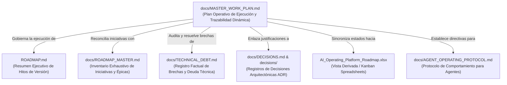
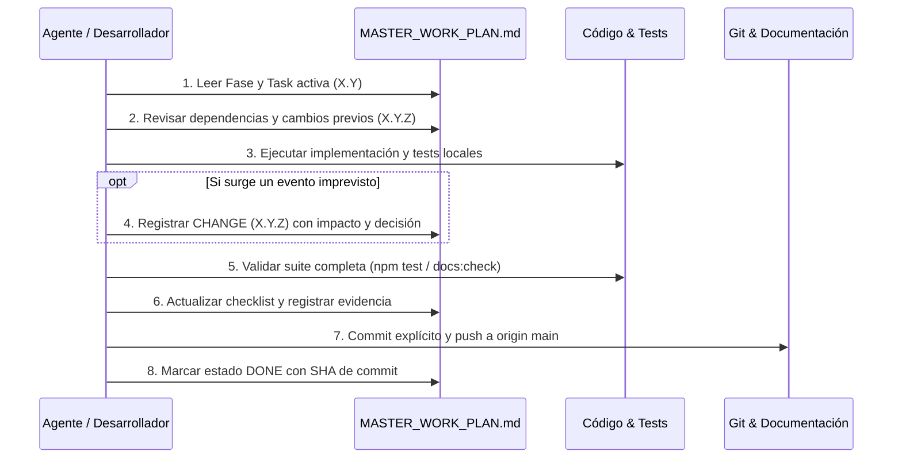
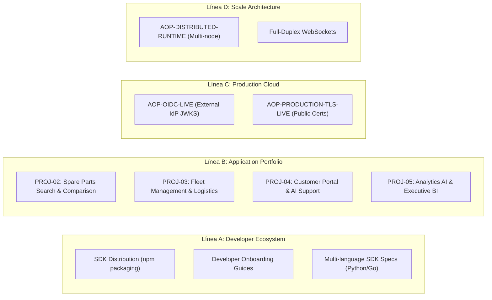

# Plan Maestro Operativo Oficial — AI Operating Platform

> **Documento Canónico de Dirección y Planificación Operativa**  
> **Autoridad:** AI Operating Platform Core Team  
> **Línea Base del Sistema:** v1.4.0 Baseline  
> **Idioma Oficial:** Español Latinoamericano (`es-419`) con identificadores técnicos canónicos en inglés  
> **Última Actualización:** 2026-09-24  

---

## 1. Misión y Propósito

El **Plan Maestro Operativo Oficial** (`docs/MASTER_WORK_PLAN.md`) es el sistema canónico de planificación, indexación, checklists y trazabilidad dinámica de la **AI Operating Platform**.

Este documento responde de forma inequívoca en todo momento:
1. **¿Qué estamos haciendo?** (Fase y Tarea activa)
2. **¿Qué sigue a continuación?** (Siguiente tarea o hito priorizado)
3. **¿Qué dependencias existen?** (Técnicas, ambientales y de artefactos)
4. **¿Qué apareció inesperadamente durante la ejecución?** (Registro de cambios `X.Y.Z`)
5. **¿Qué cambió durante la ejecución y por qué?** (Decisiones y adaptaciones)
6. **¿Qué evidencia cerró cada tarea?** (Tests, contratos, rutas, commits)

### Tarea Inesperada 1.1.1 — Hardening de Principios de Ingeniería y Gobernanza Arquitectónica
> **Identificador Canónico**: `1.1.1` (Cross-Cutting Architectural Improvement / Unexpected Governance Task)  
> **Fecha**: 2026-09-25  
> **Estado Técnico**: `DONE` | **Estado Operativo**: `DONE`  
> **Detectado durante**: Revisión de Gobernanza Arquitectónica posterior al cierre de Fase 148.  
> **Origen**: Auditoría arquitectónica tras entrega de Fase 148 detectando la necesidad de explicitar y blindar 8 principios de ingeniería no negociables en el Libro Oficial y guías de arquitectura (Arquitectura Hexagonal, Zero Third-Party en Core/Backend, Concurrencia Acotada Observable, Determinismo, Fail-Closed ante Ambigüedad Material, Dirección Unidireccional de Dependencias, Aislamiento de DevDependencies y Evidencia Estructurada).  
> **Decisión**: Formalizar los 8 principios en `LIBRO_OFICIAL_AI_OPERATING_PLATFORM.md` (raíz y `docs/`), validar consistencia criptográfica mediante `scripts/docs-check.mjs` y ratificar invariantes de plataforma.  
> **Evidencia**: `LIBRO_OFICIAL_AI_OPERATING_PLATFORM.md`, `docs/LIBRO_OFICIAL_AI_OPERATING_PLATFORM.md`, `scripts/docs-check.mjs` (SHA-256 match).

---

## 2. Separación Conceptual de Documentos

El Plan Maestro Operativo coexiste con los demás instrumentos documentales sin reemplazarlos ni duplicar sus funciones primarias:



* **`docs/MASTER_WORK_PLAN.md`**: Plan operativo de ejecución paso a paso, tareas activas, checklists y registro dinámico de eventos imprevistos.
* **`docs/AGENT_OPERATING_PROTOCOL.md`**: Guía canónica de comportamiento operativo, jerarquía de verdad y reglas para agentes de IA y desarrolladores.
* **`ROADMAP.md`**: Resumen ejecutivo de hitos de versión y estado general de la plataforma.
* **`docs/ROADMAP_MASTER.md`**: Inventario maestro de iniciativas formales con código de iniciativa (`AOP-*`).
* **`docs/TECHNICAL_DEBT.md`**: Registro factual de brechas técnicas, limitaciones conocidas y gaps ambientales.
* **`docs/DECISIONS.md`**: Catálogo inmutable de Decisiones Arquitectónicas Registradas (ADRs).
* **`AI_Operating_Platform_Roadmap.xlsx`**: Vista derivada tabular y tablero Kanban operacional.

---

## 3. Jerarquía Canónica de Autoridad (Fuente de Verdad)

De acuerdo con [`docs/SOURCE_OF_TRUTH.md`](./SOURCE_OF_TRUTH.md), la verdad técnica del proyecto se rige por la siguiente jerarquía estricta:

$$\text{Código Fuente en } \texttt{src/} > \text{Tests / Evidencia Automatizada} > \text{Historial Git} > \text{Documentación Oficial} > \text{Roadmap} > \text{Excel / Kanban}$$

> [!IMPORTANT]
> El Plan Maestro Operativo pertenece al nivel de **Documentación Oficial de Planificación Operativa**. Ninguna tarea, fase o iniciativa puede marcarse como completada (`DONE`) en este plan si el código fuente no existe y no está validado por pruebas automatizadas reproducibles.

---

## 4. Sistema Oficial de Indexación y Semántica Numérica

Para preservar el orden determinista y la inmutabilidad histórica, se establece la siguiente estructura jerárquica de 3 niveles:

```text
X         → Identificador de FASE (ej. 140)
X.Y       → Identificador de TAREA programada (ej. 140.3)
X.Y.Z     → Identificador de CAMBIO / AJUSTE / EVENTO IMPREDECIBLE (ej. 140.2.1)
```

### Reglas de Numeración:
1. **Límite de Profundidad (Máximo 3 Niveles)**: Queda terminantemente prohibido crear un cuarto nivel (e.g. `140.1.1.1`).
2. **Tareas Programadas (`X.Y`)**: Representan el desglose natural y planificado de la fase.
3. **Cambios Imprevisibles (`X.Y.Z`)**: Registran descubrimientos, desvíos, correcciones no anticipadas, discrepancias encontradas o bloqueos resueltos durante la ejecución de la tarea `X.Y`.
4. **Inmutabilidad Histórica**: Una vez creada y cerrada una fase o tarea, su número jamás se reasigna, renombra o reinterpreta retrospectivamente.

---

## 5. Taxonomía de Registros y Estados

### 5.1. Tipos de Registro Oficiales
* **`PHASE`**: Agrupador mayor de objetivos estratégicos o de release.
* **`TASK`**: Unidad de trabajo operativa programada dentro de una fase.
* **`CHANGE`**: Evento, ajuste o descubrimiento impredecible surgido durante una tarea (`X.Y.Z`).
* **`DECISION`**: Decisión técnica o arquitectónica tomada para resolver una tarea o cambio.
* **`BLOCKER`**: Impedimento que detiene el avance de una tarea o fase.
* **`EVIDENCE`**: Artefacto verificable (archivo, test, endpoint, commit) que demuestra el cumplimiento.

### 5.2. Estados Técnicos (Roadmap)
* `DONE`: Implementado en código, probado al 100%, verificado y documentado.
* `VALIDATION`: En validación de estrés, seguridad o interoperabilidad.
* `IN_PROGRESS`: Desarrollo activo con pruebas en progreso.
* `PLANNED`: Especificado y priorizado para la siguiente iteración.
* `ANALYSIS`: En diseño o evaluación técnica preliminar.
* `BACKLOG`: Aprobado para iteraciones futuras.
* `BLOCKED`: Detenido por dependencias no satisfechas.
* `DEFERRED`: Aplazado formalmente en favor de otra prioridad.
* `CANCELLED`: Descartado tras análisis.

### 5.3. Estados Operativos (Master Work Plan)
* `NOT_STARTED`: Tarea definida pero no iniciada.
* `READY`: Dependencias cumplidas, lista para comenzar.
* `IN_PROGRESS`: Trabajo en ejecución activa.
* `BLOCKED`: Trabajo detenido por bloqueo explícito.
* `WAITING_EXTERNAL`: En espera de confirmación externa o aprovisionamiento físico.
* `DONE`: Todos los criterios de aceptación y checklist cumplidos con evidencia.
* `DEFERRED`: Pospuesta para una fase posterior.
* `CANCELLED`: Cancelada con justificación explícita.

---

## 6. Protocolo de Operación para Agentes y Desarrolladores

Cualquier agente de IA o desarrollador que ejecute tareas en la plataforma **DEBE** seguir este ciclo de vida:



---

## 7. Historial Canónico de Fases Recientes

| Fase | Título | Iniciativa | Estado Técnico | Estado Operativo | Evidencia Principal | Tests Resultantes |
| :--- | :--- | :--- | :--- | :--- | :--- | :--- |
| **135** | Application Factory Developer CLI | `AOP-DEV-FACTORY-CLI` | `DONE` | `DONE` | `src/platform-client/create-aop-app.ts`, `docs/APPLICATION_FACTORY_CLI.md` | 1637 PASS |
| **136** | Platform API OpenAPI 3.1 Contract | `AOP-API-OPENAPI` | `DONE` | `DONE` | `docs/openapi.yaml`, `scripts/validate-openapi.mjs`, `docs/OPENAPI_GUIDE.md` | 1637 PASS |
| **137** | Real-Time SSE Event Streaming | `AOP-REALTIME-SSE` | `DONE` | `DONE` | `src/application/observability/event-stream-adapter.ts`, `docs/SSE_EVENT_STREAMING.md` | 1646 PASS |
| **138** | Application Integration Certification | `AOP-APP-CERTIFICATION` | `DONE` | `DONE` | `examples/reference-consumer/`, `docs/REFERENCE_APPLICATION.md` | 1656 PASS |
| **139** | Formalización del Plan Maestro Operativo | `AOP-MASTER-WORK-PLAN` | `DONE` | `DONE` | `docs/MASTER_WORK_PLAN.md`, `scripts/master-work-plan-check.mjs` | 1656 PASS |
| **140** | Sincronización del Plan y Formalización PROJ-02 | `AOP-MASTER-WORK-PLAN-V2` | `DONE` | `DONE` | `docs/AGENT_OPERATING_PROTOCOL.md`, `docs/PROJ_02_SPARE_PARTS_PRODUCT_CHARTER.md` | 1656 PASS |

---

## 8. FASE 139 — Formalización del Plan Maestro Operativo Oficial

### Objetivo
Establecer el sistema oficial de planificación, indexación jerárquica `X / X.Y / X.Y.Z`, checklists operacionales obligatorios, registro dinámico de imprevistos y automatización de validación documental para gobernar las fases subsiguientes de la **AI Operating Platform**.

* **Estado Técnico**: `DONE`
* **Estado Operativo**: `DONE`
* **Prioridad**: `CRITICAL`
* **Dependencias**: Fases 135, 136, 137, 138 cerradas y verificadas
* **Iniciativa Vinculada**: `AOP-MASTER-WORK-PLAN`

---

### Tareas de la Fase 139

#### 139.1 — Auditar arquitectura documental existente
- **Estado**: `DONE`
- **Objetivo**: Revisar todos los documentos de gobernanza, roadmaps, inventarios de deuda técnica y registros de decisiones para identificar el estado factual de la plataforma.
- **Evidencia**: Auditoría completada sobre 17 documentos canónicos, 61 ADRs y 74 suites de prueba.

#### 139.2 — Definir jerarquía de planificación
- **Estado**: `DONE`
- **Objetivo**: Formalizar la jerarquía estricta de verdad (`Código > Tests > Git > Docs > Roadmap > Excel`) y la no sustitución de documentos existentes.
- **Evidencia**: Sección 2 y 3 de `docs/MASTER_WORK_PLAN.md`.

#### 139.3 — Crear `docs/MASTER_WORK_PLAN.md`
- **Estado**: `DONE`
- **Objetivo**: Redactar el documento maestro canónico con la estructura completa de gobierno operativo.
- **Evidencia**: Archivo `docs/MASTER_WORK_PLAN.md` creado.

#### 139.4 — Definir sistema de indexación X / X.Y / X.Y.Z
- **Estado**: `DONE`
- **Objetivo**: Establecer la regla de 3 niveles de indexación con inmutabilidad histórica.
- **Evidencia**: Sección 4 de `docs/MASTER_WORK_PLAN.md`.

#### 139.5 — Definir checklists oficiales
- **Estado**: `DONE`
- **Objetivo**: Formalizar el checklist global obligatorio que debe satisfacer toda fase antes de cerrarse.
- **Evidencia**: Sección 11 de `docs/MASTER_WORK_PLAN.md`.

#### 139.6 — Crear registro de cambios impredecibles
- **Estado**: `DONE`
- **Objetivo**: Establecer la plantilla y formato oficial para registrar eventos `X.Y.Z`.
- **Evidencia**: Sección 12 de `docs/MASTER_WORK_PLAN.md`.

#### 139.7 — Reconciliar `ROADMAP.md` con `docs/ROADMAP_MASTER.md`
- **Estado**: `DONE`
- **Objetivo**: Incorporar en `docs/ROADMAP_MASTER.md` las iniciativas de las Fases 135 (`AOP-DEV-FACTORY-CLI`), 137 (`AOP-REALTIME-SSE`), 138 (`AOP-APP-CERTIFICATION`) y 139 (`AOP-MASTER-WORK-PLAN`).
- **Evidencia**: `docs/ROADMAP_MASTER.md` actualizado con 59 iniciativas.

##### Cambios surgidos durante 139.7:
- **139.7.1 — Inclusión explícita de iniciativas recientes en Roadmap Maestro**:
  - *Tipo*: `CHANGE`
  - *Fecha*: 2026-09-24
  - *Detectado durante*: Auditoría de `docs/ROADMAP_MASTER.md`.
  - *Origen*: Las iniciativas de SSE, Certification y Master Plan estaban en CHANGELOG y ROADMAP pero no tenían filas dedicadas en la tabla maestra.
  - *Decisión*: Agregar las filas `AOP-DEV-FACTORY-CLI`, `AOP-REALTIME-SSE`, `AOP-APP-CERTIFICATION` y `AOP-MASTER-WORK-PLAN`.
  - *Impacto*: 100% de coherencia entre inventario maestro y código real.
  - *Estado*: `DONE`

#### 139.8 — Auditar Technical Debt contra implementación real
- **Estado**: `DONE`
- **Objetivo**: Revisar `docs/TECHNICAL_DEBT.md` para eliminar o actualizar ítems obsoletos.
- **Evidencia**: `docs/TECHNICAL_DEBT.md` actualizado reflejando la implementación de SSE en Fase 137 y conservando WebSockets en backlog futuro.

##### Cambios surgidos durante 139.8:
- **139.8.1 — Actualización de estado de Streaming en Technical Debt**:
  - *Tipo*: `CHANGE`
  - *Fecha*: 2026-09-24
  - *Detectado durante*: Auditoría de `docs/TECHNICAL_DEBT.md` sección 3.
  - *Origen*: El ítem 1 listaba "Streaming Reactivo SSE" como mejora futura pendiente.
  - *Decisión*: Declarar Server-Sent Events como implementado (`DONE`, Fase 137) y aislar WebSockets como ítem de backlog de escala.
  - *Impacto*: Precisión absoluta en el estado de deuda técnica.
  - *Estado*: `DONE`

#### 139.9 — Auditar Application Portfolio Map
- **Estado**: `DONE`
- **Objetivo**: Comprobar el mapa de aplicaciones satélites (`PROJ-00` a `PROJ-05`) y la inclusión de la Reference Consumer Application.
- **Evidencia**: `docs/AI_APPLICATION_PORTFOLIO_MAP.md` y `docs/APPLICATION_PORTFOLIO.md` auditados.

#### 139.10 — Integrar MASTER WORK PLAN al índice oficial de documentación
- **Estado**: `DONE`
- **Objetivo**: Registrar `docs/MASTER_WORK_PLAN.md` en `docs/OFFICIAL_DOCUMENTATION_INDEX.md`, `docs/DOCUMENTATION_REGISTRY.md` y `README.md`.
- **Evidencia**: Documentos de índice actualizados y sincronizados.

#### 139.11 — Integrar validación de estructura al sistema de docs-check
- **Estado**: `DONE`
- **Objetivo**: Crear validador automatizado `scripts/master-work-plan-check.mjs` y conectarlo a `scripts/docs-check.mjs` y `npm run docs:check`.
- **Evidencia**: Script `scripts/master-work-plan-check.mjs` validado y ejecutado exitosamente.

#### 139.12 — Sincronizar vista Excel/Kanban
- **Estado**: `DONE`
- **Objetivo**: Sincronizar las planillas Excel derivadas (`AI_Operating_Platform_Roadmap.xlsx` y `DOCUMENTACION/AI_OPERATING_PLATFORM_BACKLOG_KANBAN.xlsx`) respetando la jerarquía de verdad.
- **Evidencia**: Hooks de sincronización ejecutados exitosamente con 14 pestañas validadas.

#### 139.13 — Cerrar y publicar el sistema operativo de planificación
- **Estado**: `DONE`
- **Objetivo**: Ejecutar la suite completa de pruebas, verificar consistencia documental, realizar commit atómico y push hacia `origin/main`.
- **Evidencia**: 1656 pruebas PASS, working tree clean, commit en rama `main` (`58f50fd`).

---

## 9. FASE 140 — Sincronización del Plan Maestro, Memoria de Agentes y Formalización de PROJ-02

### Objetivo
Sincronizar el Plan Maestro Operativo Oficial, formalizar el protocolo operativo persistente para agentes de IA ([`docs/AGENT_OPERATING_PROTOCOL.md`](./AGENT_OPERATING_PROTOCOL.md), `.agent/rules/agent-operating-protocol.md`, `AGENTS.md`) y formalizar la carta constitutiva del producto satélite `PROJ-02-SPAREPARTS` (*Spare Parts Search & Comparison*) para orientar las fases 141 a 149.

* **Estado Técnico**: `DONE`
* **Estado Operativo**: `DONE`
* **Prioridad**: `CRITICAL`
* **Dependencias**: Fase 139 cerrada y verificada
* **Iniciativa Vinculada**: `AOP-MASTER-WORK-PLAN-V2`

---

### Tareas de la Fase 140

#### 140.1 — Auditar arquitectura documental y repositorio
- **Estado**: `DONE`
- **Objetivo**: Realizar auditoría exhaustiva de Git, documentos de gobernanza, portfolio y roadmaps.
- **Evidencia**: Estado Git limpio en `main` verificado, coherencia con baseline v1.4.0.

#### 140.2 — Registrar cambios de sincronización
- **Estado**: `DONE`
- **Objetivo**: Documentar formalmente la evolución de alcance del `PROJ-02` y la distinción entre plataforma y aplicaciones.
- **Evidencia**: Registros `140.2.1` y `140.2.2` formalizados.

##### Cambios surgidos durante 140.2:
- **140.2.1 — Evolución de PROJ-02 a Producto Web Satélite Multi-Tienda**:
  - *Tipo*: `CHANGE`
  - *Fecha*: 2026-09-24
  - *Detectado durante*: Definición estratégica de `PROJ-02-SPAREPARTS`.
  - *Origen*: Requerimiento de usuario de formalizar un comparador inteligente multi-fuente automotriz (inspirado en SoloTodo).
  - *Decisión*: Formalizar el producto satélite en `docs/PROJ_02_SPARE_PARTS_PRODUCT_CHARTER.md` y programar fases preliminares 141-149 sin modificar la pureza del Core Engine.
  - *Impacto*: Expansión del roadmap del portafolio satélite preservando el principio "Platform as a Product".
  - *Estado*: `DONE`

- **140.2.2 — Desacoplamiento Estricto Plataforma vs Producto Satélite**:
  - *Tipo*: `CHANGE`
  - *Fecha*: 2026-09-24
  - *Detectado durante*: Auditoría de límites arquitectónicos.
  - *Origen*: Clarificación de que `PROJ-02` no modifica el motor central ni importa módulos internos.
  - *Decisión*: Establecer consumo exclusivo a través de `@ai-platform/client` y OpenAPI 3.1 REST/SSE.
  - *Impacto*: Preservación absoluta de la regla de oro arquitectónica.
  - *Estado*: `DONE`

#### 140.3 — Crear e integrar Protocolo Operativo Canónico de Agentes
- **Estado**: `DONE`
- **Objetivo**: Redactar `docs/AGENT_OPERATING_PROTOCOL.md` y configurar `.agent/rules/agent-operating-protocol.md` y `AGENTS.md` como memoria permanente.
- **Evidencia**: Archivos creados y verificados.

#### 140.4 — Formalizar alcance y propuesta de valor de PROJ-02
- **Estado**: `DONE`
- **Objetivo**: Definir la visión, dimensiones de vehículos, búsqueda multi-fuente, verificación determinista de compatibilidad y ranking transparente.
- **Evidencia**: Documentación exhaustiva en `docs/PROJ_02_SPARE_PARTS_PRODUCT_CHARTER.md`.

#### 140.5 — Crear Carta Constitutiva del Producto (Product Charter)
- **Estado**: `DONE`
- **Objetivo**: Publicar `docs/PROJ_02_SPARE_PARTS_PRODUCT_CHARTER.md` con 8 secciones completas.
- **Evidencia**: Documento `docs/PROJ_02_SPARE_PARTS_PRODUCT_CHARTER.md` creado.

#### 140.6 — Diferenciar Reference App interna vs Producto Satélite Web
- **Estado**: `DONE`
- **Objetivo**: Distinguir formalmente el arnés unitario de referencia previa (`tests/unit/vehicle-parts*`) de la futura aplicación web satélite.
- **Evidencia**: Registro `140.6.1` y actualización de `docs/APPLICATION_REGISTRY.md`.

##### Cambios surgidos durante 140.6:
- **140.6.1 — Clarificación Reference App vs Satélite Product**:
  - *Tipo*: `CHANGE`
  - *Fecha*: 2026-09-24
  - *Detectado durante*: Auditoría de `docs/APPLICATION_REGISTRY.md`.
  - *Origen*: La tabla de aplicaciones listaba `tests/unit/vehicle-parts*` como ruta local del proyecto.
  - *Decisión*: Clarificar que `tests/unit/vehicle-parts-reference-app.test.ts` constituye una prueba unitaria de referencia de compatibilidad, mientras que `PROJ-02` es el producto web independiente previsto en `spare-parts-store`.
  - *Impacto*: Precisión terminológica en el registro del portafolio.
  - *Estado*: `DONE`

#### 140.7 — Sincronizar Application Portfolio
- **Estado**: `DONE`
- **Objetivo**: Actualizar `docs/AI_APPLICATION_PORTFOLIO_MAP.md`, `docs/APPLICATION_PORTFOLIO.md` y `docs/APPLICATION_REGISTRY.md`.
- **Evidencia**: Portafolio actualizado con el nuevo producto `Spare Parts Search & Comparison`.

#### 140.8 — Sincronizar Roadmap Master
- **Estado**: `DONE`
- **Objetivo**: Agregar iniciativas `AOP-MASTER-WORK-PLAN-V2` y `AOP-SPAREPARTS-SEARCH` en `docs/ROADMAP_MASTER.md`.
- **Evidencia**: `docs/ROADMAP_MASTER.md` actualizado con 61 iniciativas.

#### 140.9 — Actualizar Master Work Plan con horizonte de Fases 141-149
- **Estado**: `DONE`
- **Objetivo**: Registrar las fases preliminares 141 a 149 en estado `PLANNED / NOT_STARTED`.
- **Evidencia**: Sección 10 de `docs/MASTER_WORK_PLAN.md`.

#### 140.10 — Sincronizar planillas Excel / Kanban
- **Estado**: `DONE`
- **Objetivo**: Sincronizar libros Excel derivados con `generate_roadmap_excel.py`.
- **Evidencia**: Planillas Excel actualizadas con 14 pestañas validadas.

#### 140.11 — Actualizar CHANGELOG
- **Estado**: `DONE`
- **Objetivo**: Registrar formalmente la Fase 140 sin atribuir funcionalidades de runtime no implementadas.
- **Evidencia**: `CHANGELOG.md` actualizado.

#### 140.12 — Actualizar Document Registry, Official Documentation Index y README
- **Estado**: `DONE`
- **Objetivo**: Catalogar `docs/AGENT_OPERATING_PROTOCOL.md` y `docs/PROJ_02_SPARE_PARTS_PRODUCT_CHARTER.md`.
- **Evidencia**: Registros documentales actualizados.

#### 140.13 — Validar con test suites, OpenAPI, checks documentales y browser
- **Estado**: `DONE`
- **Objetivo**: Ejecutar `npm run check`, verificar con scripts de integridad y comprobar estabilidad.
- **Evidencia**: 1656 tests PASS, 0 errores de compilación, checks documentales 100% PASS.

---

## 10. FASE 141 — Multi-Agent Web AI & Agent Capability Platform

### Objetivo
Construir la base arquitectónica para **Multi-Agent Web AI** como capacidad nativa de la plataforma: formalizar la taxonomía de agentes, tool proficiency, arnés determinista de evaluación, pasarela de herramientas web gobernadas (`WebToolGateway`) y pasarela desacoplada para proveedores de agentes externos (`ExternalAgentGateway` para Codex, OpenHands y Aider).

### Metadatos
- **Estado Técnico**: `DONE`
- **Estado Operativo**: `DONE`
- **Prioridad**: `CRITICAL`
- **Iniciativas Vinculadas**: `AOP-MULTI-AGENT-WEB-AI`
- **Evidencia**: 1664 tests PASS (75 suites), 0 errores TypeScript, validadores 100% compliant.

### Registro de Cambios y Ajustes Imprevistos (X.Y.Z)
#### 141.1.1 — Reorganización de Fase 141 como Capacidad Central de Plataforma
- **Tipo**: `CHANGE`
- **Fecha**: 2026-09-24
- **Detectado durante**: Tarea 141.1 (Taxonomía de Agentes)
- **Origen**: Decisión estratégica de arquitectura de plataforma
- **Motivo**: Establecer primero la capacidad de plataforma multi-agente, Web AI, evaluación y proveedores externos para beneficiar de forma horizontal a todo el portafolio (PROJ-01 a PROJ-05).
- **Impacto**: Se reasignan las fases preliminares de PROJ-02 del rango 141-149 hacia 142-150.
- **Estado**: `DONE`

### Tareas

#### 141.1 — Taxonomía de Agentes y Roles Canónicos
- **Estado**: `DONE`
- **Objetivo**: Formalizar `AgentTaxonomyType` (`NATIVE`, `MODEL`, `WEB`, `RESEARCH`, `CODE`, `AUTOMATION`, `VERIFICATION`, `EXTERNAL`).
- **Evidencia**: `src/domain/agent/agent-taxonomy.ts` y tests unitarios.

#### 141.2 — Modelo de Capacidades y Directivas de Gobernanza
- **Estado**: `DONE`
- **Objetivo**: Definir directivas de presupuesto (`budgetQuotaPerTask`), límites de handoff y requisito de procedencia de evidencia.
- **Evidencia**: `AgentPolicyDirectives` y `StructuredClaimEvidence` en `src/domain/agent/agent-taxonomy.ts`.

#### 141.3 — Nivel de Proficiencia de Herramientas (Tool Proficiency)
- **Estado**: `DONE`
- **Objetivo**: Modelar estados `DECLARED`, `VERIFIED`, `DEGRADED`, `DISABLED` para herramientas de agentes.
- **Evidencia**: `GovernedToolProficiency` en `src/domain/agent/agent-taxonomy.ts`.

#### 141.4 — Pasarela de Herramientas Web Seguras (WebToolGateway)
- **Estado**: `DONE`
- **Objetivo**: Implementar `WebToolGateway` con `allowedDomains`, `blockedDomains`, rate-limiting y herramientas `web.search` y `web.extract`.
- **Evidencia**: `src/application/tools/web-tool-gateway.ts` y `src/domain/tools/web-tools.ts`.

#### 141.5 — Pasarela de Proveedores de Agentes Externos (ExternalAgentGateway)
- **Estado**: `DONE`
- **Objetivo**: Crear abstracción desacoplada para agentes externos con adaptadores para OpenAI Codex CLI, OpenHands y Aider.
- **Evidencia**: `src/application/agent/external-agent-gateway.ts` y `src/infrastructure/agent-providers/external-agent-adapters.ts`.

#### 141.6 — Arnés de Evaluación Determinista de Agentes (AgentEvaluationHarness)
- **Estado**: `DONE`
- **Objetivo**: Implementar arnés determinista de benchmarking con scoring multidimensional y vinculación a `AgentLifecycleService`.
- **Evidencia**: `src/application/agent/agent-evaluation-harness.ts`.

#### 141.7 — Catálogo Canónico de Casos de Uso Empresariales
- **Estado**: `DONE`
- **Objetivo**: Formalizar matriz de 13 áreas de negocio con roles, herramientas, nivel de automatización y supervisión.
- **Evidencia**: `docs/BUSINESS_AGENT_USE_CASES.md`.

#### 141.8 — Documentación y Sincronización del Sistema
- **Estado**: `DONE`
- **Objetivo**: Actualizar `docs/MULTI_AGENT_PLATFORM.md`, `docs/ROADMAP_MASTER.md` y `docs/MASTER_WORK_PLAN.md`.
- **Evidencia**: Documentos oficiales actualizados y validados con `scripts/master-work-plan-check.mjs`.

---

## 11. FASE 142 — Discovery y Mapa de Fuentes Automotrices

### Objetivo
Construir la capa de inteligencia y descubrimiento de fuentes automotrices (*Automotive Source Discovery & Source Intelligence Layer*) para **PROJ-02 — Spare Parts Search & Comparison**: definir la taxonomía de fuentes, modelo canónico de datos, políticas de acceso, arnés de conectores base y catalogación de fuentes para Chile e Internacionales.

### Metadatos
- **Estado Técnico**: `DONE`
- **Estado Operativo**: `DONE`
- **Prioridad**: `HIGH`
- **Iniciativas Vinculadas**: `AOP-SPAREPARTS-SEARCH`
- **Evidencia**: 1669 tests PASS (80 suites), 0 errores TypeScript, validadores 100% compliant.

### Tareas

#### 142.1 — Modelo de Dominio de Fuente Automotriz
- **Estado**: `DONE`
- **Objetivo**: Diseñar agregados `AutomotiveSource`, `SourceDataCapabilities`, `SourceAccessPolicy`, `SourceCoverage` y `SourceTrustRating`.
- **Evidencia**: `src/domain/spareparts/automotive-source.ts`.

#### 142.2 — Taxonomía de Fuentes y Métodos de Acceso
- **Estado**: `DONE`
- **Objetivo**: Formalizar categorías (`OFFICIAL_OEM`, `MARKETPLACE`, `SPECIALIZED_RETAILER`, etc.) y métodos de adquisición (`OFFICIAL_API`, `STRUCTURED_DATA`, `WEB_PAGE`).
- **Evidencia**: `VALID_AUTOMOTIVE_SOURCE_TYPES` y `VALID_AUTOMOTIVE_ACCESS_METHODS` en `src/domain/spareparts/automotive-source.ts`.

#### 142.3 — Registro de Fuentes en Memoria (AutomotiveSourceRegistry)
- **Estado**: `DONE`
- **Objetivo**: Implementar `InMemoryAutomotiveSourceRegistry` con búsqueda y filtrado multicriterio por región, capacidades y nivel de confianza.
- **Evidencia**: `src/application/spareparts/automotive-source-registry.ts`.

#### 142.4 — Investigación y Catalogación Canónica de Fuentes (Chile & Global)
- **Estado**: `DONE`
- **Objetivo**: Investigar y catalogar fuentes reales: Mercado Libre CL, Autoplanet CL, Repuestos Boston CL, RockAuto, eBay Motors, AutoDoc EU y OEM Catalog DB.
- **Evidencia**: `src/infrastructure/spareparts/canonical-sources.ts`.

#### 142.5 — Contrato de Conector y Piloto de Búsqueda con Evidencia
- **Estado**: `DONE`
- **Objetivo**: Implementar `AutomotiveSourceConnector` y `BaseAutomotiveSourceConnector` emitiendo `SourceProductOffer` con `StructuredClaimEvidence`.
- **Evidencia**: `src/application/spareparts/automotive-source-connector.ts` y tests unitarios.

#### 142.6 — Pruebas Automatizadas y Documentación
- **Estado**: `DONE`
- **Objetivo**: Crear suite de tests `tests/unit/automotive-source-discovery.test.ts` y publicar `docs/AUTOMOTIVE_SOURCE_MAP.md`.
- **Evidencia**: 5 tests unitarios dedicados PASS, 1669 tests totales PASS.

---

## 12. FASE 143 — Modelo de Dominio Canónico de Repuestos (Vehicle, Part, Fitment, Offer)

### Objetivo
Construir el modelo de dominio canónico para **PROJ-02 — Spare Parts Search & Comparison**: formalizar agregados tipados para Vehículos (`VehicleProfile`), Repuestos (`Part`, `PartNumber`), Enlaces Cruzados (`CrossReference`), Compatibilidad (`Fitment`, `FitmentRule`, `FitmentProvenance`), Ofertas Comerciales (`Product`, `Listing`, `Seller`, `Price`, `TotalCost`, `Availability`, `Offer`), y Consultas de Búsqueda (`SparePartsSearchQuery`, `SearchCriteria`).

### Metadatos
- **Estado Técnico**: `DONE`
- **Estado Operativo**: `DONE`
- **Prioridad**: `HIGH`
- **Iniciativas Vinculadas**: `AOP-SPAREPARTS-SEARCH`
- **Evidencia**: 1688 tests PASS (91 suites), 0 errores TypeScript, validadores 100% compliant.

### Tareas

#### 143.1 — Dominio de Vehículos y Normalización
- **Estado**: `DONE`
- **Objetivo**: Diseñar agregados `VehicleSpecification`, `VehicleProfile`, identificadores (`CANONICAL`, `VIN`, etc.), normalización de marcas/modelos y generador de `canonicalVehicleId`.
- **Evidencia**: `src/domain/spareparts/vehicle.ts`.

#### 143.2 — Dominio de Números de Pieza (PartNumber)
- **Estado**: `DONE`
- **Objetivo**: Implementar tipos de identificadores (`OEM`, `MPN`, `SKU`, `EAN`, etc.), normalización estricta descartando ruido y evaluación de equivalencia.
- **Evidencia**: `src/domain/spareparts/part-number.ts`.

#### 143.3 — Dominio de Repuestos y Taxonomía de Categorías (Part)
- **Estado**: `DONE`
- **Objetivo**: Formalizar agregado `Part`, taxonomía jerárquica de 19 categorías, condiciones (`NEW`, `USED`, etc.), posiciones de instalación y separación entre `Brand` y `Manufacturer`.
- **Evidencia**: `src/domain/spareparts/part.ts`.

#### 143.4 — Dominio de Enlaces Cruzados (CrossReference)
- **Estado**: `DONE`
- **Objetivo**: Modelar relaciones de equivalencia (`EXACT`, `EQUIVALENT`, `REPLACEMENT`, `SUPERSEDES`) entre códigos OEM y Aftermarket con confianza numérica.
- **Evidencia**: `src/domain/spareparts/cross-reference.ts`.

#### 143.5 — Dominio de Compatibilidad (Fitment & Conflict Model)
- **Estado**: `DONE`
- **Objetivo**: Modelar agregados `Fitment`, evaluación de reglas paramétricas (`matchesFitmentRule`), procedencia de evidencia y estado `CONFLICT` ante datos contradictorires.
- **Evidencia**: `src/domain/spareparts/fitment.ts`.

#### 143.6 — Dominio Comercial y Ofertas (Product, Seller, Price, Offer)
- **Estado**: `DONE`
- **Objetivo**: Crear agregados `Product`, `Listing`, `Seller`, `SellerReputation`, `ProductRating`, `Price`, `Availability`, `ShippingInfo` y `Offer` con generador de `canonicalOfferId`.
- **Evidencia**: `src/domain/spareparts/product-offer.ts`.

#### 143.7 — Contratos de Búsqueda y Normalización de Entrada (SearchQuery)
- **Estado**: `DONE`
- **Objetivo**: Formalizar contratos `SparePartsSearchQuery`, `SearchCriteria` y normalizador de entradas en lenguaje natural.
- **Evidencia**: `src/domain/spareparts/search-query.ts`.

#### 143.8 — Pruebas Automatizadas y Documentación Canónica
- **Estado**: `DONE`
- **Objetivo**: Implementar suite de pruebas unitarias `tests/unit/spareparts-domain-model.test.ts` y publicar `docs/SPARE_PARTS_DOMAIN_MODEL.md`.
- **Evidencia**: 19 tests dedicados PASS, 1688 tests totales PASS.

---

## 13. FASE 144 — Búsqueda Multi-Fuente y Enrutamiento de Agentes Especializados

### Objetivo
Construir el motor de búsqueda multi-fuente paralelo para **PROJ-02 — Spare Parts Search & Comparison**: clasificar la intención de búsqueda (`SearchIntent`), descomponer consultas en tareas priorizadas (`SearchTask`), seleccionar fuentes relevantes con explicabilidad de inclusiones y exclusiones (`SourceSelectionService`), coordinar ejecución paralela con aislamiento de fallos (`MultiSourceSearchOrchestrator`), integrar compuerta de agente verificador y mapear resultados crudos al modelo de dominio canónico con captura de evidencia estructurada.

### Metadatos
- **Estado Técnico**: `DONE`
- **Estado Operativo**: `DONE`
- **Prioridad**: `HIGH`
- **Iniciativas Vinculadas**: `AOP-SPAREPARTS-SEARCH`
- **Evidencia**: 1698 tests PASS (95 suites), 0 errores TypeScript, validadores 100% compliant.

### Tareas

#### 144.1 — Clasificación de Intenciones y Descomposición de Consultas
- **Estado**: `DONE`
- **Objetivo**: Implementar `classifySearchIntent` para tipologías de búsqueda (`OEM_LOOKUP`, `PART_NUMBER_LOOKUP`, `VEHICLE_FITMENT_SEARCH`, `PRICE_DISCOVERY`), contratos de `SearchTask` y gobernanza de `SearchBudget`.
- **Evidencia**: `src/domain/spareparts/search-intent.ts`.

#### 144.2 — Servicio de Selección y Exclusión de Fuentes
- **Estado**: `DONE`
- **Objetivo**: Desarrollar `SourceSelectionService` con evaluación multicriterio por región, marcas, capacidades y rastreo explícito de razones de exclusión (`WRONG_REGION`, `NO_RELEVANT_COVERAGE`, etc.).
- **Evidencia**: `src/application/spareparts/source-selection-service.ts`.

#### 144.3 — Conectores Fixture de Prueba Deterministas
- **Estado**: `DONE`
- **Objetivo**: Implementar `TestFixtureAutomotiveConnector` para simulación controlada de éxitos, resultados vacíos, timeouts, límites de tasa y bloqueos perimetrales.
- **Evidencia**: `src/infrastructure/spareparts/fixture-connectors.ts`.

#### 144.4 — Orquestador de Búsqueda Multi-Fuente y Aislamiento de Fallos
- **Estado**: `DONE`
- **Objetivo**: Construir `MultiSourceSearchOrchestrator` ejecutando consultas en paralelo con carreras de timeout, tolerancia a fallos parciales (`PARTIAL_SUCCESS`), validación de ofertas por agente verificador y mapeo canónico.
- **Evidencia**: `src/application/spareparts/multi-source-search-orchestrator.ts`.

#### 144.5 — Pruebas Automatizadas y Documentación Canónica
- **Estado**: `DONE`
- **Objetivo**: Implementar suite de tests `tests/unit/multi-source-search-orchestrator.test.ts` y publicar `docs/SPARE_PARTS_MULTI_SOURCE_SEARCH.md`.
- **Evidencia**: 10 tests dedicados PASS, 1698 tests totales PASS.

---

## 14. FASE 145 — Motor de Normalización, Deduplicación y Referencias Cruzadas (Cross-Reference Engine)

### Objetivo
Construir el motor determinista de normalización, detección de duplicados y resolución de referencias cruzadas OEM <-> Aftermarket para **PROJ-02 — Spare Parts Search & Comparison**: estandarizar números de pieza, marcas, URLs y vendedores sin destrucción de datos originales (`PartNormalizationService`), clasificar pares de ofertas con protección fail-closed frente a falsos positivos (`DuplicateDetectionService`), resolver el grafo conexo de equivalencias y reemplazos (`CrossReferenceService`), y agrupar ofertas en clusters deterministas e idempotentes (`PartClusteringEngine`) con agregación acumulativa de evidencia estructurada (`CanonicalPartCluster`).

### Metadatos
- **Estado Técnico**: `DONE`
- **Estado Operativo**: `DONE`
- **Prioridad**: `HIGH`
- **Iniciativas Vinculadas**: `AOP-SPAREPARTS-SEARCH`
- **Evidencia**: 1709 tests PASS (96 suites), 0 errores TypeScript, validadores 100% compliant.

### Tareas

#### 145.1 — Modelo de Dominio de Clusters y Clasificación de Duplicados
- **Estado**: `DONE`
- **Objetivo**: Modelar `CanonicalPartCluster`, clasificaciones de emparejamiento (`MatchClassification`: `EXACT_DUPLICATE`, `PROBABLE_MATCH`, `DISTINCT`, `CONFLICT`, `UNRESOLVED`) y generador determinista `generateClusterId`.
- **Evidencia**: `src/domain/spareparts/part-cluster.ts`.

#### 145.2 — Servicio de Normalización Determinista de Entidades
- **Estado**: `DONE`
- **Objetivo**: Implementar `PartNormalizationService` para normalizar números de pieza (conservando `rawValue`), mapeo canónico de fabricantes/marcas con tiers, saneamiento de URLs sin tracking y estandarización de nombres de vendedores.
- **Evidencia**: `src/application/spareparts/part-normalization-service.ts`.

#### 145.3 — Servicio de Detección de Duplicados y Equivalencias
- **Estado**: `DONE`
- **Objetivo**: Implementar `DuplicateDetectionService` con evaluación basada en reglas deterministas, soporte de claves compuestas, discriminación de fabricantes en colisiones numéricas y protección fail-closed.
- **Evidencia**: `src/application/spareparts/duplicate-detection-service.ts`.

#### 145.4 — Motor de Grafo de Referencias Cruzadas (CrossReferenceService)
- **Estado**: `DONE`
- **Objetivo**: Desarrollar `CrossReferenceService` con indexación bidireccional y resolución determinista de componentes conexos (`resolveEquivalentPartNumbers`) para relaciones OEM <-> Aftermarket y reemplazos (`SUPERSEDES`).
- **Evidencia**: `src/application/spareparts/cross-reference-service.ts`.

#### 145.5 — Motor de Agrupamiento Determinista, Idempotente e Invariante al Orden
- **Estado**: `DONE`
- **Objetivo**: Construir `PartClusteringEngine` utilizando algoritmo Disjoint-Set con ordenamiento previo de ofertas, preservación ininterrumpida de evidencias y clustering sin pérdida de datos.
- **Evidencia**: `src/application/spareparts/part-clustering-engine.ts`.

#### 145.6 — Pruebas Automatizadas y Documentación Canónica
- **Estado**: `DONE`
- **Objetivo**: Crear suite de pruebas exhaustiva `tests/unit/normalization-deduplication-crossref.test.ts` cubriendo los 11 escenarios y publicar `docs/SPARE_PARTS_NORMALIZATION_DEDUP_CROSS_REFERENCE.md`.
- **Evidencia**: 11 tests dedicados PASS, 1709 tests totales PASS (96 suites).

---

## 15. FASE 146 — Motor Determinista de Verificación de Compatibilidad (Deterministic Fitment Verification Engine)

### Objetivo
Construir el motor determinista de verificación de compatibilidad pieza-vehículo para **PROJ-02 — Spare Parts Search & Comparison**: evaluar compatibilidad paramétrica atributo por atributo (`FitmentVerificationEngine`), generar claves unívocas de vehículo (`VehicleFitmentKey`), emitir veredictos estructurados (`FitmentVerdict`: `FIT`, `NOT_FIT`, `UNKNOWN`, `CONFLICT`), propagar claims de evidencia estructurada (`StructuredClaimEvidence`), aislar contradicciones entre fuentes confiables y garantizar comportamiento fail-closed ante ausencia de datos obligatorios sin recurrir a inferencias libres o LLMs.

### Metadatos
- **Estado Técnico**: `DONE`
- **Estado Operativo**: `DONE`
- **Prioridad**: `HIGH`
- **Iniciativas Vinculadas**: `AOP-SPAREPARTS-SEARCH`
- **Evidencia**: 1721 tests PASS (97 suites), 0 errores TypeScript, validadores 100% compliant.

### Tareas

#### 146.1 — Modelo de Veredictos de Fitment y Claves de Compatibilidad
- **Estado**: `DONE`
- **Objetivo**: Modelar `FitmentVerdict` (`FIT`, `NOT_FIT`, `UNKNOWN`, `CONFLICT`), resultados por parámetro `FitmentParameterResult`, detalles de conflicto `FitmentConflictDetail` y generador determinista `buildVehicleFitmentKey`.
- **Evidencia**: `src/domain/spareparts/fitment-verdict.ts`.

#### 146.2 — Motor de Verificación Paramétrica y Reglas de Compatibilidad
- **Estado**: `DONE`
- **Objetivo**: Implementar `FitmentVerificationEngine` evaluando parámetros obligatorios (`make`, `model`, `year`) y condicionales (`engine`, `generation`, `market`) con preservación de justificación individual.
- **Evidencia**: `src/application/spareparts/fitment-verification-engine.ts`.

#### 146.3 — Resolución de Conflictos y Propagación de Evidencias
- **Estado**: `DONE`
- **Objetivo**: Detectar contradicciones documentales entre fuentes y propagar acumulativamente evidencias estructuradas (`StructuredClaimEvidence`) sin sustituir reglas con scores de reputación.
- **Evidencia**: `src/application/spareparts/fitment-verification-engine.ts`.

#### 146.4 — Política Fail-Closed y Protección Contra Falsos Positivos
- **Estado**: `DONE`
- **Objetivo**: Asegurar que falta de datos derive estrictamente en `UNKNOWN` y prevenir falsos positivos entre motores diferentes (1.8L vs 2.0L), generaciones de transición (E170 vs E210) o mercados distintos (CL vs US).
- **Evidencia**: `src/application/spareparts/fitment-verification-engine.ts`.

#### 146.5 — Pruebas Automatizadas y Documentación Canónica
- **Estado**: `DONE`
- **Objetivo**: Crear suite de pruebas exhaustiva `tests/unit/fitment-verification-engine.test.ts` cubriendo los 12 escenarios requeridos y publicar `docs/SPARE_PARTS_FITMENT_VERIFICATION.md`.
- **Evidencia**: 12 tests dedicados PASS, 1721 tests totales PASS (97 suites).

---

## 16. FASE 147 — Inteligencia de Precios, Reputación y Costo Total (Price Intelligence, Reputation & Total Cost Engine)

### Objetivo
Construir el motor determinista de inteligencia de precios y reputación de vendedores para **PROJ-02 — Spare Parts Search & Comparison**: normalizar precios y monedas mediante proveedores deterministas de FX (`PriceIntelligenceEngine`), modelar el costo total de adquisición (*Total Landed Cost*) con desglose transparente de envío, impuestos y aranceles bajo el principio estricto de `UNKNOWN ≠ 0`, evaluar la confiabilidad de vendedores mediante un algoritmo explicable y ponderado (`SellerReputationService`), y proveer comparaciones multi-fuente rigurosas integrando filtros de compatibilidad vehicular (`FitmentVerdict`) y quiebres de inventario.

### Metadatos
- **Estado Técnico**: `DONE`
- **Estado Operativo**: `DONE`
- **Prioridad**: `HIGH`
- **Iniciativas Vinculadas**: `AOP-SPAREPARTS-SEARCH`
- **Evidencia**: 1735 tests PASS (98 suites), 0 errores TypeScript, validadores 100% compliant.

### Tareas

#### 147.1 — Modelo de Dominio de Precios, Costo Total y Reputación
- **Estado**: `DONE`
- **Objetivo**: Modelar `NormalizedPrice`, rubros de costo (`ShippingCostItem`, `TaxCostItem`, `ImportCostItem`), `TotalAcquisitionCost`, `SellerTrustScore` y contratos de comparación multi-fuente `TransparentPriceComparison`.
- **Evidencia**: `src/domain/spareparts/price-intelligence.ts`.

#### 147.2 — Servicio Explicable de Confianza del Vendedor (SellerReputationService)
- **Estado**: `DONE`
- **Objetivo**: Implementar `SellerReputationService` con descomposición en 5 factores ponderados (`SELLER_VERIFICATION`, `SOURCE_RELIABILITY`, `CUSTOMER_RATING`, `POLICY_TRANSPARENCY`, `EVIDENCE_COMPLETENESS`) separando la reputación de la plataforma de la del vendedor.
- **Evidencia**: `src/application/spareparts/seller-reputation-service.ts`.

#### 147.3 — Motor de Normalización de Precios y Costo Total (PriceIntelligenceEngine)
- **Estado**: `DONE`
- **Objetivo**: Implementar `PriceIntelligenceEngine` con conversión de FX trazable, normalización por cantidad/empaque (*pack size*), deducción de descuentos explícitos y cómputo de costo total garantizando que rubros desconocidos deriven en `TOTAL_UNKNOWN` (cero asunción de gratuidad).
- **Evidencia**: `src/application/spareparts/price-intelligence-engine.ts`.

#### 147.4 — Comparador Multi-Fuente Transparente e Integración con Fitment
- **Estado**: `DONE`
- **Objetivo**: Integrar comparador sobre `CanonicalPartCluster` excluyendo o señalando ofertas incompatibles (`NOT_FIT`), publicaciones agotadas (*out of stock*) y determinando de forma objetiva la mejor oferta en precio, confianza y balance global.
- **Evidencia**: `src/application/spareparts/price-intelligence-engine.ts`.

#### 147.5 — Pruebas Automatizadas y Documentación Canónica
- **Estado**: `DONE`
- **Objetivo**: Crear suite de pruebas exhaustiva `tests/unit/price-intelligence.test.ts` cubriendo los 14 escenarios clave y publicar `docs/SPARE_PARTS_PRICE_INTELLIGENCE.md`.
- **Evidencia**: 14 tests dedicados PASS, 1735 tests totales PASS (98 suites).

---

## 17. FASE 148 — UX Web: Búsqueda, Filtros y Comparador Lado a Lado (Spare Parts Web UX & Side-by-Side Comparison)

### Objetivo
Construir la experiencia de usuario web (Single-Page Application) y la fachada unificada de aplicación (`SparePartsFacade`) para **PROJ-02 — Spare Parts Search & Comparison**: implementar selector contextual de vehículo con presets rápidos, buscador multi-criterio con telemetría de conectores por fuente, filtros reactivos en sidebar (precio, compatibilidad, reputación, disponibilidad), tarjetas de clusters con badges de mejor precio/confianza/recomendado, y comparador lado a lado (*side-by-side*) de hasta 4 ofertas simultáneas bajo la regla inquebrantable de **cero `.innerHTML`** y preservación de verdad (`UNKNOWN ≠ 0`).

### Metadatos
- **Estado Técnico**: `DONE`
- **Estado Operativo**: `DONE`
- **Prioridad**: `HIGH`
- **Iniciativas Vinculadas**: `AOP-SPAREPARTS-SEARCH`
- **Evidencia**: 1744 tests PASS (99 suites), 9 tests dedicados en `tests/unit/spare-parts-web-ux.test.ts`, 0 `.innerHTML` en todo `src/platform/web/`.

### Tareas

#### 148.1 — Fachada de Aplicación y Endpoint de Búsqueda
- **Estado**: `DONE`
- **Objetivo**: Implementar `SparePartsFacade` integrando búsqueda multi-fuente, clustering canónico, fitment paramétrico y comparación de precios, exponiendo el endpoint `POST /spareparts/search` en `http-router.ts`.
- **Evidencia**: `src/application/spareparts/spare-parts-facade.ts`, `src/platform/api/http-router.ts`.

#### 148.2 — Selector de Vehículo y Búsqueda Reactiva Multi-Fuente
- **Estado**: `DONE`
- **Objetivo**: Diseñar selector vehicular (`make`, `model`, `year`, `generation`, `engine`) con presets de acceso rápido y barra de búsqueda con chips de estado y latencia por conector.
- **Evidencia**: `src/platform/web/spare-parts-view.js`, `src/platform/web/spare-parts.css`.

#### 148.3 — Filtros Reactivos en Barra Lateral
- **Estado**: `DONE`
- **Objetivo**: Implementar filtrado dinámico en memoria por rango de precio, veredicto de compatibilidad (`FIT`, `UNKNOWN`, `NOT_FIT`), puntaje mínimo de reputación del vendedor y stock disponible.
- **Evidencia**: `src/platform/web/spare-parts-view.js`.

#### 148.4 — Comparador Lado a Lado y Protección de Invariantes
- **Estado**: `DONE`
- **Objetivo**: Desarrollar tabla comparativa en cuadrícula para hasta 4 ofertas con atributos detallados, exclusión fail-closed de ofertas incompatibles (`NOT_FIT`) y renderizado transparente de costos incompletos como `TOTAL_UNKNOWN`.
- **Evidencia**: `src/platform/web/spare-parts-view.js`, `src/platform/web/app.js`, `src/platform/web/api-client.js`.

#### 148.5 — Pruebas Automatizadas, Auditoría de Seguridad y Documentación
- **Estado**: `DONE`
- **Objetivo**: Crear suite de pruebas exhaustiva `tests/unit/spare-parts-web-ux.test.ts` cubriendo 9 escenarios (incluyendo auditoría de 0 `innerHTML`) y publicar `docs/SPARE_PARTS_WEB_UX.md`.
- **Evidencia**: 9 tests dedicados PASS, 1744 tests totales PASS (99 suites), `docs/SPARE_PARTS_WEB_UX.md`.

##### Cambios surgidos durante 148.5:
- **148.5.1 — Hardening de Principios de Ingeniería y Gobernanza Arquitectónica (Tarea Inesperada 1.1.1)**:
  - *Tipo*: `CHANGE`
  - *Fecha*: 2026-09-25
  - *Detectado durante*: Tarea 148.5
  - *Origen*: Auditoría de cierre posterior a la implementación web SPA identificando la necesidad de robustecer y asentar de forma inquebrantable los 8 principios no negociables de ingeniería en el Libro Oficial y guías arquitectónicas.
  - *Motivo*: Prevenir degradación arquitectónica, fugas de abstracción en dependencias de terceros, y asentar la frontera sagrada plataforma-aplicación satélite.
  - *Impacto*: Documentación canónica actualizada (`LIBRO_OFICIAL_AI_OPERATING_PLATFORM.md` en raíz y `docs/`), 0 regresión en tests, validación de integridad 100%.
  - *Decisión*: Registrar la Tarea Inesperada de Gobernanza 1.1.1 en el Plan Maestro y actualizar la Sección 1.2 del Libro Oficial con los 8 principios hardened.
  - *Estado*: `DONE`

---

## 18. Roadmap Preliminar del Producto PROJ-02 (Fases 149 a 150)

Las siguientes fases representan el plan de construcción del producto satélite *Spare Parts Search & Comparison* (`PROJ-02-SPAREPARTS`). Se declaran oficialmente en estado **`PLANNED / NOT_STARTED`** y no deben ejecutarse automáticamente sin un prompt de inicio específico:


| Fase | Título de la Fase | Estado Técnico | Estado Operativo | Entregable Clave |
| :--- | :--- | :--- | :--- | :--- |
| **143** | Modelo de Dominio Vehicle / Part / Fitment / Offer | `DONE` | `DONE` | Esquemas de dominio tipados y contratos de identidad canónica (`src/domain/spareparts/`). |
| **144** | Motor de Búsqueda Multi-Fuente y Conectores | `DONE` | `DONE` | Conectores paralelos con rate limiting y manejo de contingencia (`src/application/spareparts/`). |
| **145** | Normalización, Deduplicación y Cross-Reference | `DONE` | `DONE` | Agente de normalización e indexación de equivalencias OEM/Aftermarket. |
| **146** | Motor Determinista de Verificación de Compatibilidad | `DONE` | `DONE` | Verificador determinista de compatibilidad pieza-vehículo con evidencia. |
| **147** | Inteligencia de Precios, Reputación y Costo Total | `DONE` | `DONE` | Algoritmo de `SellerTrustScore` y cálculo transparente de precio total. |
| **148** | UX Web: Búsqueda, Filtros y Comparador Lado a Lado | `DONE` | `DONE` | Single-Page Application (0 `innerHTML`) con tabla comparativa y `SparePartsFacade`. |
| **149** | Integración Profunda con AI Operating Platform | `PLANNED` | `NOT_STARTED` | Adaptador satélite `@ai-platform/client` y telemetría SSE reactiva. |
| **150** | Certificación de Aplicación, Seguridad y Release MVP | `PLANNED` | `NOT_STARTED` | Arnés de certificación de 9 puntos y empaquetado de producción. |

---

## 17. Checklist Global Obligatorio de Cierre de Fase

Toda fase futura debe satisfacer el siguiente checklist integral antes de ser declarada `DONE`:

```markdown
### Checklist Global de Cierre de Fase
- [ ] 1. Alcance y Objetivos confirmados contractualmente.
- [ ] 2. Auditoría inicial de código, dependencias y estado previo del repositorio.
- [ ] 3. Dependencias técnicas y ambientales verificadas.
- [ ] 4. Implementación en `src/` o `examples/` sin acoplamientos prohibidos.
- [ ] 5. Tests unitarios, de integración y de contrato pasando al 100% (`npm test`).
- [ ] 6. Seguridad verificada (default-deny, RBAC, redacción de secretos, 0 `innerHTML`, 0 `eval`).
- [ ] 7. Documentación canónica actualizada y consistente (`npm run docs:check`).
- [ ] 8. Verificación de UI / Browser cuando aplique (respetando modo bilingüe y accesibilidad).
- [ ] 9. Actualización de `docs/MASTER_WORK_PLAN.md` (Checklists, tareas y cambios `X.Y.Z`).
- [ ] 10. Reconciliación de `ROADMAP.md` y `docs/ROADMAP_MASTER.md`.
- [ ] 11. Auditoría y actualización de `docs/TECHNICAL_DEBT.md`.
- [ ] 12. Staging explícito en Git (`git add <archivos>`).
- [ ] 13. Publicación limpia en GitHub (`git push origin main`, 0 ahead, 0 behind, clean tree).
- [ ] 14. Sincronización de libros Excel / Tablero Kanban.
- [ ] 15. Emisión del Informe Técnico Oficial de Cierre.
```

---

## 18. Plantillas Oficiales de Registro

### 18.1. Plantilla de Fase Futura

```markdown
## FASE X — [Título de la Fase]

### Objetivo
[Descripción concisa del objetivo de ingeniería o negocio]

### Metadatos
- **Estado Técnico**: `PLANNED` | `IN_PROGRESS` | `DONE`
- **Estado Operativo**: `NOT_STARTED` | `READY` | `IN_PROGRESS` | `DONE`
- **Prioridad**: `CRITICAL` | `HIGH` | `MEDIUM` | `LOW`
- **Dependencias**: [Fases o componentes requeridos]
- **Iniciativas Vinculadas**: [AOP-*]

### Tareas

#### X.1 — [Nombre de la Tarea]
- **Estado**: `NOT_STARTED` | `IN_PROGRESS` | `DONE`
- **Objetivo**: [Qué resuelve la tarea]
- **Evidencia Esperada**: [Archivos, endpoints, tests]
- **Archivos Afectados**: `path/to/file.ts`
- **Criterios de Aceptación**: [Condiciones objetivas]

##### Checklist de Tarea
- [ ] Análisis previo y diseño
- [ ] Implementación de código
- [ ] Pruebas automatizadas
- [ ] Documentación técnica
- [ ] Verificación de seguridad

##### Cambios Surgidos
- X.1.1 — [Título del cambio si surge]
```

### 18.2. Plantilla de Cambio / Ajuste Impredecible (`X.Y.Z`)

```markdown
### X.Y.Z — [Nombre del Cambio Imprevisto]
- **Tipo**: `CHANGE`
- **Fecha**: YYYY-MM-DD
- **Detectado durante**: Tarea X.Y
- **Origen**: [Causa raíz o descubrimiento técnico]
- **Motivo**: [Por qué fue necesario realizar este cambio no programado]
- **Impacto**: [Alcance del efecto en código, arquitectura o contratos]
- **Decisión**: [Resolución técnica adoptada]
- **Archivos Afectados**: `path/to/file`
- **Tests Afectados**: `tests/path/test.ts`
- **Documentación Afectada**: `docs/file.md`
- **Estado**: `DONE` | `IN_PROGRESS` | `BLOCKED`
```

---

## 19. Planificación Futura y Candidatos Post-v1.4 (Horizontes Estratégicos)

Las siguientes líneas de trabajo constituyen el backlog estratégico aprobado. Se mantienen en estado `PLANNED`, `BACKLOG` o `EXPLORATORY` y no deben marcarse como `DONE` hasta contar con código y pruebas completas:



### Detalle de Líneas de Trabajo:

1. **Línea A — Developer Ecosystem & Marketplace (`PLANNED`)**:
   - Empaquetado y distribución de `@ai-platform/client` en registros de paquetes.
   - Portal de autoservicio para desarrolladores con generación guiada de API keys y webhooks.
   - Especificaciones formales para clientes SDK en Python y Go.

2. **Línea B — Expansión del Portafolio Satélite (`PLANNED / IN_PROGRESS`)**:
   - **`PROJ-01` (Tentaciones AI Commerce - `AOP-TENTACIONES-AR-3D-AI`)**: Capa de visión computacional avanzada, VTO neuronal on-device, segmentación de prendas, estimación de pose 3D (BlazePose), oclusión dinámica y orquestación multi-agente (`docs/AR_3D_AI_VISION_ARCHITECTURE.md`).
   - **`PROJ-02` (Spare Parts Search & Comparison - `AOP-SPAREPARTS-SEARCH`)**: Fases 142-150 planificadas formalmente en [`docs/PROJ_02_SPARE_PARTS_PRODUCT_CHARTER.md`](./PROJ_02_SPARE_PARTS_PRODUCT_CHARTER.md) y [`docs/AUTOMOTIVE_SOURCE_MAP.md`](./AUTOMOTIVE_SOURCE_MAP.md).
   - **`PROJ-03` (Fleet Management)**: Gestión telemática y optimización de rutas con agentes autónomos.
   - **`PROJ-04` (Customer Portal)**: Triaje de soporte omnicanal y escalamiento humano con SoD.
   - **`PROJ-05` (Analytics AI)**: Agregación de KPIs ejecutivos y pronósticos sin alucinación.

3. **Línea C — Aprovisionamiento Productivo en Nube (`WAITING_EXTERNAL`)**:
   - `AOP-OIDC-LIVE`: Conexión contra proveedor de identidad corporativo real (Microsoft Entra / Okta).
   - `AOP-PRODUCTION-TLS-LIVE`: Despliegue en host físico con certificados TLS de CA pública.

4. **Línea D — Arquitectura de Escala Horizontal (`EXPLORATORY / v2.0`)**:
   - `AOP-DISTRIBUTED-RUNTIME`: Clustering multi-nodo con consenso distribuido y leases particionados.
   - `AOP-WEBSOCKETS-STREAM`: Soporte de streaming bidireccional de baja latencia complementario a SSE.
