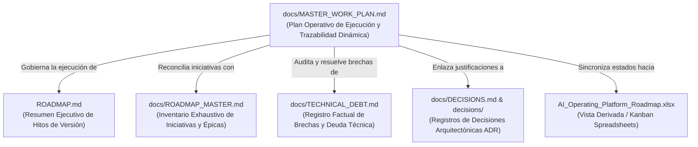
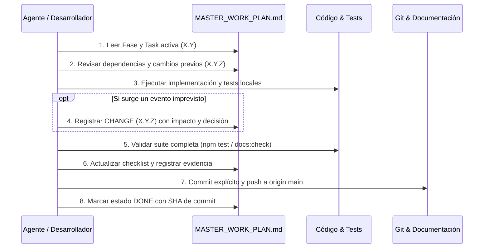
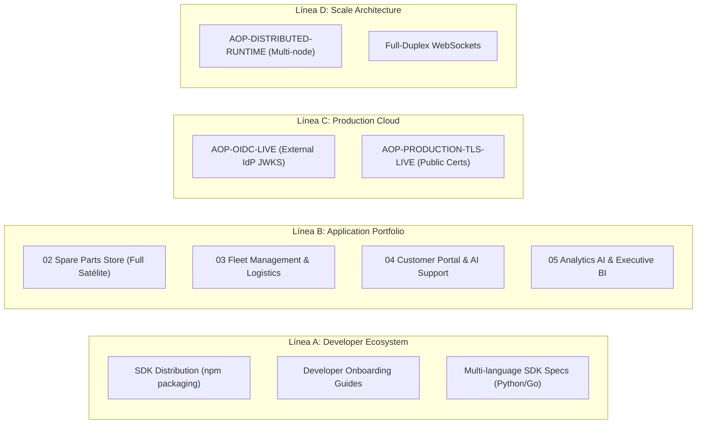

# Plan Maestro Operativo Oficial — AI Operating Platform

> **Documento Canónico de Dirección y Planificación Operativa**  
> **Autoridad:** AI Operating Platform Core Team  
> **Línea Base del Sistema:** v1.4.0 Baseline  
> **Idioma Oficial:** Español Latinoamericano (`es-419`) con identificadores técnicos canónicos en inglés  
> **Última Actualización:** 2026-09-24  

---

## 1. Misión y Propósito

El **Plan Maestro Operativo Oficial** (`docs/MASTER_WORK_PLAN.md`) es el sistema canónico de planificación, indexación, checklists y trazabilidad dinámica de la **AI Operating Platform**.

Este documento responde de forma inequívoca en todo momento:
1. **¿Qué estamos haciendo?** (Fase y Tarea activa)
2. **¿Qué sigue a continuación?** (Siguiente tarea o hito priorizado)
3. **¿Qué dependencias existen?** (Técnicas, ambientales y de artefactos)
4. **¿Qué apareció inesperadamente durante la ejecución?** (Registro de cambios `X.Y.Z`)
5. **¿Qué cambió durante la ejecución y por qué?** (Decisiones y adaptaciones)
6. **¿Qué evidencia cerró cada tarea?** (Tests, contratos, rutas, commits)

---

## 2. Separación Conceptual de Documentos

El Plan Maestro Operativo coexiste con los demás instrumentos documentales sin reemplazarlos ni duplicar sus funciones primarias:



* **`docs/MASTER_WORK_PLAN.md`**: Plan operativo de ejecución paso a paso, tareas activas, checklists y registro dinámico de eventos imprevistos.
* **`ROADMAP.md`**: Resumen ejecutivo de hitos de versión y estado general de la plataforma.
* **`docs/ROADMAP_MASTER.md`**: Inventario maestro de iniciativas formales con código de iniciativa (`AOP-*`).
* **`docs/TECHNICAL_DEBT.md`**: Registro factual de brechas técnicas, limitaciones conocidas y gaps ambientales.
* **`docs/DECISIONS.md`**: Catálogo inmutable de Decisiones Arquitectónicas Registradas (ADRs).
* **`AI_Operating_Platform_Roadmap.xlsx`**: Vista derivada tabular y tablero Kanban operacional.

---

## 3. Jerarquía Canónica de Autoridad (Fuente de Verdad)

De acuerdo con [`docs/SOURCE_OF_TRUTH.md`](./SOURCE_OF_TRUTH.md), la verdad técnica del proyecto se rige por la siguiente jerarquía estricta:

$$\text{Código Fuente en } \texttt{src/} > \text{Tests / Evidencia Automatizada} > \text{Historial Git} > \text{Documentación Oficial} > \text{Roadmap} > \text{Excel / Kanban}$$

> [!IMPORTANT]
> El Plan Maestro Operativo pertenece al nivel de **Documentación Oficial de Planificación Operativa**. Ninguna tarea, fase o iniciativa puede marcarse como completada (`DONE`) en este plan si el código fuente no existe y no está validado por pruebas automatizadas reproducibles.

---

## 4. Sistema Oficial de Indexación y Semántica Numérica

Para preservar el orden determinista y la inmutabilidad histórica, se establece la siguiente estructura jerárquica de 3 niveles:

```text
X         → Identificador de FASE (ej. 139)
X.Y       → Identificador de TAREA programada (ej. 139.1)
X.Y.Z     → Identificador de CAMBIO / AJUSTE / EVENTO IMPREDECIBLE (ej. 139.1.1)
```

### Reglas de Numeración:
1. **Límite de Profundidad (Máximo 3 Niveles)**: Queda terminantemente prohibido crear un cuarto nivel (e.g. `139.1.1.1`).
2. **Tareas Programadas (`X.Y`)**: Representan el desglose natural y planificado de la fase.
3. **Cambios Imprevisibles (`X.Y.Z`)**: Registran descubrimientos, desvíos, correcciones no anticipadas, discrepancias encontradas o bloqueos resueltos durante la ejecución de la tarea `X.Y`.
4. **Inmutabilidad Histórica**: Una vez creada y cerrada una fase o tarea, su número jamás se reasigna, renombra o reinterpreta retrospectivamente.

---

## 5. Taxonomía de Registros y Estados

### 5.1. Tipos de Registro Oficiales
* **`PHASE`**: Agrupador mayor de objetivos estratégicos o de release.
* **`TASK`**: Unidad de trabajo operativa programada dentro de una fase.
* **`CHANGE`**: Evento, ajuste o descubrimiento impredecible surgido durante una tarea (`X.Y.Z`).
* **`DECISION`**: Decisión técnica o arquitectónica tomada para resolver una tarea o cambio.
* **`BLOCKER`**: Impedimento que detiene el avance de una tarea o fase.
* **`EVIDENCE`**: Artefacto verificable (archivo, test, endpoint, commit) que demuestra el cumplimiento.

### 5.2. Estados Técnicos (Roadmap)
* `DONE`: Implementado en código, probado al 100%, verificado y documentado.
* `VALIDATION`: En validación de estrés, seguridad o interoperabilidad.
* `IN_PROGRESS`: Desarrollo activo con pruebas en progreso.
* `PLANNED`: Especificado y priorizado para la siguiente iteración.
* `ANALYSIS`: En diseño o evaluación técnica preliminar.
* `BACKLOG`: Aprobado para iteraciones futuras.
* `BLOCKED`: Detenido por dependencias no satisfechas.
* `DEFERRED`: Aplazado formalmente en favor de otra prioridad.
* `CANCELLED`: Descartado tras análisis.

### 5.3. Estados Operativos (Master Work Plan)
* `NOT_STARTED`: Tarea definida pero no iniciada.
* `READY`: Dependencias cumplidas, lista para comenzar.
* `IN_PROGRESS`: Trabajo en ejecución activa.
* `BLOCKED`: Trabajo detenido por bloqueo explícito.
* `WAITING_EXTERNAL`: En espera de confirmación externa o aprovisionamiento físico.
* `DONE`: Todos los criterios de aceptación y checklist cumplidos con evidencia.
* `DEFERRED`: Pospuesta para una fase posterior.
* `CANCELLED`: Cancelada con justificación explícita.

---

## 6. Protocolo de Operación para Agentes y Desarrolladores

Cualquier agente de IA o desarrollador que ejecute tareas en la plataforma **DEBE** seguir este ciclo de vida:



---

## 7. Historial Canónico de Fases Recientes

| Fase | Título | Iniciativa | Estado Técnico | Estado Operativo | Evidencia Principal | Tests Resultantes |
| :--- | :--- | :--- | :--- | :--- | :--- | :--- |
| **135** | Application Factory Developer CLI | `AOP-DEV-FACTORY-CLI` | `DONE` | `DONE` | `src/platform-client/create-aop-app.ts`, `docs/APPLICATION_FACTORY_CLI.md` | 1637 PASS |
| **136** | Platform API OpenAPI 3.1 Contract | `AOP-API-OPENAPI` | `DONE` | `DONE` | `docs/openapi.yaml`, `scripts/validate-openapi.mjs`, `docs/OPENAPI_GUIDE.md` | 1637 PASS |
| **137** | Real-Time SSE Event Streaming | `AOP-REALTIME-SSE` | `DONE` | `DONE` | `src/application/observability/event-stream-adapter.ts`, `docs/SSE_EVENT_STREAMING.md` | 1646 PASS |
| **138** | Application Integration Certification | `AOP-APP-CERTIFICATION` | `DONE` | `DONE` | `examples/reference-consumer/`, `docs/REFERENCE_APPLICATION.md` | 1656 PASS |
| **139** | Formalización del Plan Maestro Operativo | `AOP-MASTER-WORK-PLAN` | `DONE` | `DONE` | `docs/MASTER_WORK_PLAN.md`, `scripts/master-work-plan-check.mjs` | 1656 PASS |

---

## 8. FASE 139 — Formalización del Plan Maestro Operativo Oficial

### Objetivo
Establecer el sistema oficial de planificación, indexación jerárquica `X / X.Y / X.Y.Z`, checklists operacionales obligatorios, registro dinámico de imprevistos y automatización de validación documental para gobernar las fases subsiguientes de la **AI Operating Platform**.

* **Estado Técnico**: `DONE`
* **Estado Operativo**: `DONE`
* **Prioridad**: `CRITICAL`
* **Dependencias**: Fases 135, 136, 137, 138 cerradas y verificadas
* **Iniciativa Vinculada**: `AOP-MASTER-WORK-PLAN`

---

### Tareas de la Fase 139

#### 139.1 — Auditar arquitectura documental existente
- **Estado**: `DONE`
- **Objetivo**: Revisar todos los documentos de gobernanza, roadmaps, inventarios de deuda técnica y registros de decisiones para identificar el estado factual de la plataforma.
- **Evidencia**: Auditoría completada sobre 17 documentos canónicos, 61 ADRs y 74 suites de prueba.
- **Criterios de Aceptación**: Mapeo completo de fuentes de verdad y detección de discrepancias.

#### 139.2 — Definir jerarquía de planificación
- **Estado**: `DONE`
- **Objetivo**: Formalizar la jerarquía estricta de verdad (`Código > Tests > Git > Docs > Roadmap > Excel`) y la no sustitución de documentos existentes.
- **Evidencia**: Sección 2 y 3 de `docs/MASTER_WORK_PLAN.md`.

#### 139.3 — Crear `docs/MASTER_WORK_PLAN.md`
- **Estado**: `DONE`
- **Objetivo**: Redactar el documento maestro canónico con la estructura completa de gobierno operativo.
- **Evidencia**: Archivo `docs/MASTER_WORK_PLAN.md` creado.

#### 139.4 — Definir sistema de indexación X / X.Y / X.Y.Z
- **Estado**: `DONE`
- **Objetivo**: Establecer la regla de 3 niveles de indexación con inmutabilidad histórica.
- **Evidencia**: Sección 4 de `docs/MASTER_WORK_PLAN.md`.

#### 139.5 — Definir checklists oficiales
- **Estado**: `DONE`
- **Objetivo**: Formalizar el checklist global obligatorio que debe satisfacer toda fase antes de cerrarse.
- **Evidencia**: Sección 9 de `docs/MASTER_WORK_PLAN.md`.

#### 139.6 — Crear registro de cambios impredecibles
- **Estado**: `DONE`
- **Objetivo**: Establecer la plantilla y formato oficial para registrar eventos `X.Y.Z`.
- **Evidencia**: Sección 10 de `docs/MASTER_WORK_PLAN.md`.

#### 139.7 — Reconciliar `ROADMAP.md` con `docs/ROADMAP_MASTER.md`
- **Estado**: `DONE`
- **Objetivo**: Incorporar en `docs/ROADMAP_MASTER.md` las iniciativas de las Fases 135 (`AOP-DEV-FACTORY-CLI`), 137 (`AOP-REALTIME-SSE`), 138 (`AOP-APP-CERTIFICATION`) y 139 (`AOP-MASTER-WORK-PLAN`).
- **Evidencia**: `docs/ROADMAP_MASTER.md` actualizado con 59 iniciativas.

##### Cambios surgidos durante 139.7:
- **139.7.1 — Inclusión explícita de iniciativas recientes en Roadmap Maestro**:
  - *Tipo*: `CHANGE`
  - *Fecha*: 2026-09-24
  - *Detectado durante*: Auditoría de `docs/ROADMAP_MASTER.md`.
  - *Origen*: Las iniciativas de SSE, Certification y Master Plan estaban en CHANGELOG y ROADMAP pero no tenían filas dedicadas en la tabla maestra.
  - *Decisión*: Agregar las filas `AOP-DEV-FACTORY-CLI`, `AOP-REALTIME-SSE`, `AOP-APP-CERTIFICATION` y `AOP-MASTER-WORK-PLAN`.
  - *Impacto*: 100% de coherencia entre inventario maestro y código real.

#### 139.8 — Auditar Technical Debt contra implementación real
- **Estado**: `DONE`
- **Objetivo**: Revisar `docs/TECHNICAL_DEBT.md` para eliminar o actualizar ítems obsoletos.
- **Evidencia**: `docs/TECHNICAL_DEBT.md` actualizado reflejando la implementación de SSE en Fase 137 y conservando WebSockets en backlog futuro.

##### Cambios surgidos durante 139.8:
- **139.8.1 — Actualización de estado de Streaming en Technical Debt**:
  - *Tipo*: `CHANGE`
  - *Fecha*: 2026-09-24
  - *Detectado durante*: Auditoría de `docs/TECHNICAL_DEBT.md` sección 3.
  - *Origen*: El ítem 1 listaba "Streaming Reactivo SSE" como mejora futura pendiente.
  - *Decisión*: Declarar Server-Sent Events como implementado (`DONE`, Fase 137) y aislar WebSockets como ítem de backlog de escala.
  - *Impacto*: Precisión absoluta en el estado de deuda técnica.

#### 139.9 — Auditar Application Portfolio Map
- **Estado**: `DONE`
- **Objetivo**: Comprobar el mapa de aplicaciones satélites (`PROJ-00` a `PROJ-05`) y la inclusión de la Reference Consumer Application.
- **Evidencia**: `docs/AI_APPLICATION_PORTFOLIO_MAP.md` y `docs/APPLICATION_PORTFOLIO.md` auditados.

#### 139.10 — Integrar MASTER WORK PLAN al índice oficial de documentación
- **Estado**: `DONE`
- **Objetivo**: Registrar `docs/MASTER_WORK_PLAN.md` en `docs/OFFICIAL_DOCUMENTATION_INDEX.md`, `docs/DOCUMENTATION_REGISTRY.md` y `README.md`.
- **Evidencia**: Documentos de índice actualizados y sincronizados.

#### 139.11 — Integrar validación de estructura al sistema de docs-check
- **Estado**: `DONE`
- **Objetivo**: Crear validador automatizado `scripts/master-work-plan-check.mjs` y conectarlo a `scripts/docs-check.mjs` y `npm run docs:check`.
- **Evidencia**: Script `scripts/master-work-plan-check.mjs` validado y ejecutado exitosamente.

#### 139.12 — Sincronizar vista Excel/Kanban
- **Estado**: `DONE`
- **Objetivo**: Sincronizar las planillas Excel derivadas (`AI_Operating_Platform_Roadmap.xlsx` y `DOCUMENTACION/AI_OPERATING_PLATFORM_BACKLOG_KANBAN.xlsx`) respetando la jerarquía de verdad.
- **Evidencia**: Hooks de sincronización ejecutados exitosamente con 14 pestañas validadas.

#### 139.13 — Cerrar y publicar el sistema operativo de planificación
- **Estado**: `DONE`
- **Objetivo**: Ejecutar la suite completa de pruebas, verificar consistencia documental, realizar commit atómico y push hacia `origin/main`.
- **Evidencia**: 1656 pruebas PASS, working tree clean, commit en rama `main`.

---

## 9. Checklist Global Obligatorio de Cierre de Fase

Toda fase futura (a partir de la Fase 140) debe satisfacer el siguiente checklist integral antes de ser declarada `DONE`:

```markdown
### Checklist Global de Cierre de Fase
- [ ] 1. Alcance y Objetivos confirmados contractualmente.
- [ ] 2. Auditoría inicial de código, dependencias y estado previo del repositorio.
- [ ] 3. Dependencias técnicas y ambientales verificadas.
- [ ] 4. Implementación en `src/` o `examples/` sin acoplamientos prohibidos.
- [ ] 5. Tests unitarios, de integración y de contrato pasando al 100% (`npm test`).
- [ ] 6. Seguridad verificada (default-deny, RBAC, redacción de secretos, 0 `innerHTML`, 0 `eval`).
- [ ] 7. Documentación canónica actualizada y consistente (`npm run docs:check`).
- [ ] 8. Verificación de UI / Browser cuando aplique (respetando modo bilingüe y accesibilidad).
- [ ] 9. Actualización de `docs/MASTER_WORK_PLAN.md` (Checklists, tareas y cambios `X.Y.Z`).
- [ ] 10. Reconciliación de `ROADMAP.md` y `docs/ROADMAP_MASTER.md`.
- [ ] 11. Auditoría y actualización de `docs/TECHNICAL_DEBT.md`.
- [ ] 12. Staging explícito en Git (`git add <archivos>`).
- [ ] 13. Publicación limpia en GitHub (`git push origin main`, 0 ahead, 0 behind, clean tree).
- [ ] 14. Sincronización de libros Excel / Tablero Kanban.
- [ ] 15. Emisión del Informe Técnico Oficial de Cierre.
```

---

## 10. Plantillas Oficiales de Registro

### 10.1. Plantilla de Fase Futura

```markdown
## FASE X — [Título de la Fase]

### Objetivo
[Descripción concisa del objetivo de ingeniería o negocio]

### Metadatos
- **Estado Técnico**: `PLANNED` | `IN_PROGRESS` | `DONE`
- **Estado Operativo**: `NOT_STARTED` | `READY` | `IN_PROGRESS` | `DONE`
- **Prioridad**: `CRITICAL` | `HIGH` | `MEDIUM` | `LOW`
- **Dependencias**: [Fases o componentes requeridos]
- **Iniciativas Vinculadas**: [AOP-*]

### Tareas

#### X.1 — [Nombre de la Tarea]
- **Estado**: `NOT_STARTED` | `IN_PROGRESS` | `DONE`
- **Objetivo**: [Qué resuelve la tarea]
- **Evidencia Esperada**: [Archivos, endpoints, tests]
- **Archivos Afectados**: `path/to/file.ts`
- **Criterios de Aceptación**: [Condiciones objetivas]

##### Checklist de Tarea
- [ ] Análisis previo y diseño
- [ ] Implementación de código
- [ ] Pruebas automatizadas
- [ ] Documentación técnica
- [ ] Verificación de seguridad

##### Cambios Surgidos
- X.1.1 — [Título del cambio si surge]
```

### 10.2. Plantilla de Cambio / Ajuste Impredecible (`X.Y.Z`)

```markdown
### X.Y.Z — [Nombre del Cambio Imprevisto]
- **Tipo**: `CHANGE`
- **Fecha**: YYYY-MM-DD
- **Detectado durante**: Tarea X.Y
- **Origen**: [Causa raíz o descubrimiento técnico]
- **Motivo**: [Por qué fue necesario realizar este cambio no programado]
- **Impacto**: [Alcance del efecto en código, arquitectura o contratos]
- **Decisión**: [Resolución técnica adoptada]
- **Archivos Afectados**: `path/to/file`
- **Tests Afectados**: `tests/path/test.ts`
- **Documentación Afectada**: `docs/file.md`
- **Estado**: `DONE` | `IN_PROGRESS` | `BLOCKED`
```

---

## 11. Planificación Futura y Candidatos Post-v1.4 (Horizontes Estratégicos)

Las siguientes líneas de trabajo constituyen el backlog estratégico aprobado. Se mantienen en estado `PLANNED`, `BACKLOG` o `EXPLORATORY` y no deben marcarse como `DONE` hasta contar con código y pruebas completas:



### Detalle de Líneas de Trabajo:

1. **Línea A — Developer Ecosystem & Marketplace (`PLANNED`)**:
   - Empaquetado y distribución de `@ai-platform/client` en registros de paquetes.
   - Portal de autoservicio para desarrolladores con generación guiada de API keys y webhooks.
   - Especificaciones formales para clientes SDK en Python y Go.

2. **Línea B — Expansión del Portafolio Satélite (`BACKLOG`)**:
   - **`PROJ-02` (Spare Parts Store)**: Implementación de repositorio satélite desacoplado consumiendo SDK.
   - **`PROJ-03` (Fleet Management)**: Gestión telemática y optimización de rutas con agentes autónomos.
   - **`PROJ-04` (Customer Portal)**: Triaje de soporte omnicanal y escalamiento humano con SoD.
   - **`PROJ-05` (Analytics AI)**: Agregación de KPIs ejecutivos y pronósticos sin alucinación.

3. **Línea C — Aprovisionamiento Productivo en Nube (`WAITING_EXTERNAL`)**:
   - `AOP-OIDC-LIVE`: Conexión contra proveedor de identidad corporativo real (Microsoft Entra / Okta).
   - `AOP-PRODUCTION-TLS-LIVE`: Despliegue en host físico con certificados TLS de CA pública.

4. **Línea D — Arquitectura de Escala Horizontal (`EXPLORATORY / v2.0`)**:
   - `AOP-DISTRIBUTED-RUNTIME`: Clustering multi-nodo con consenso distribuido y leases particionados.
   - `AOP-WEBSOCKETS-STREAM`: Soporte de streaming bidireccional de baja latencia complementario a SSE.
