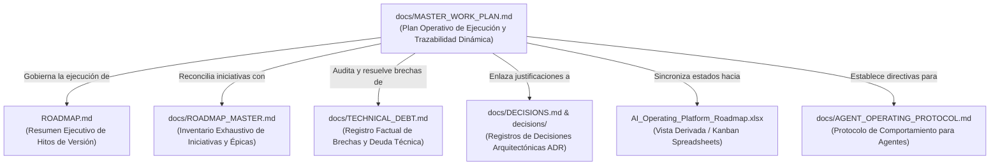
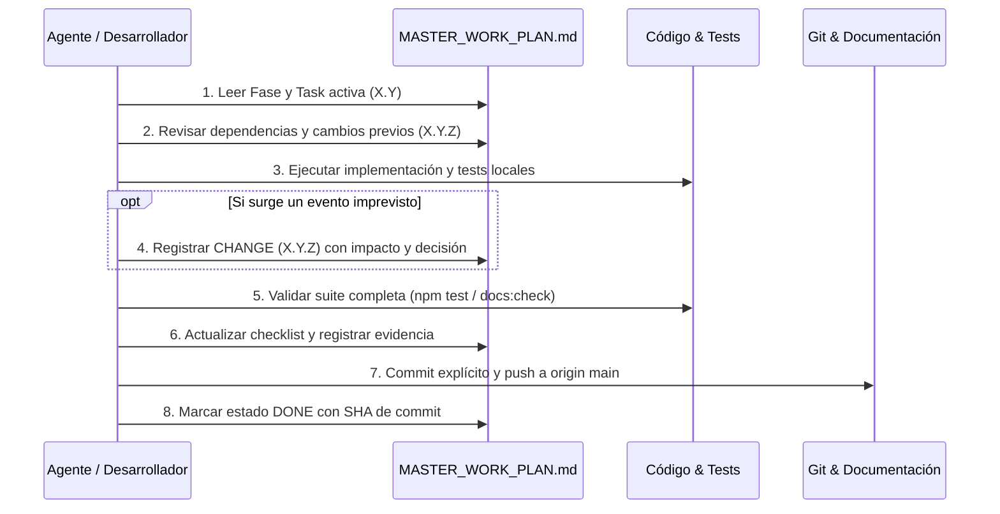
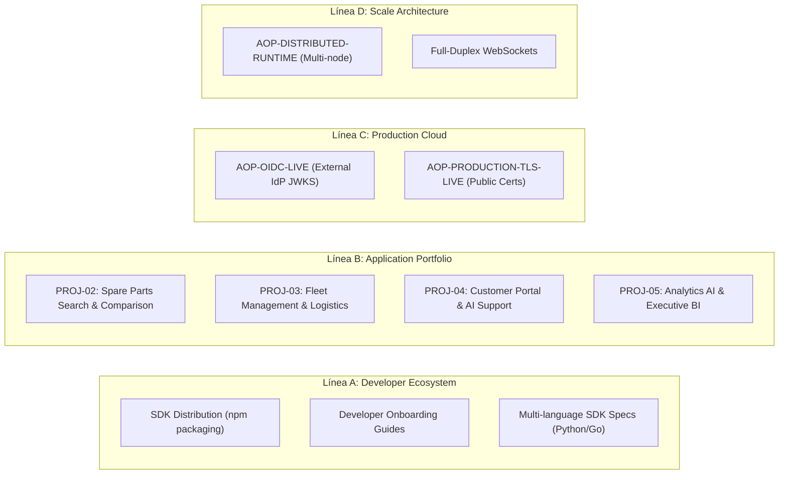

# Plan Maestro Operativo Oficial — AI Operating Platform

> **Documento Canónico de Dirección y Planificación Operativa**  
> **Autoridad:** AI Operating Platform Core Team  
> **Línea Base del Sistema:** v1.4.0 Baseline  
> **Idioma Oficial:** Español Latinoamericano (`es-419`) con identificadores técnicos canónicos en inglés  
> **Última Actualización:** 2026-09-24  

---

## 1. Misión y Propósito

El **Plan Maestro Operativo Oficial** (`docs/MASTER_WORK_PLAN.md`) es el sistema canónico de planificación, indexación, checklists y trazabilidad dinámica de la **AI Operating Platform**.

Este documento responde de forma inequívoca en todo momento:
1. **¿Qué estamos haciendo?** (Fase y Tarea activa)
2. **¿Qué sigue a continuación?** (Siguiente tarea o hito priorizado)
3. **¿Qué dependencias existen?** (Técnicas, ambientales y de artefactos)
4. **¿Qué apareció inesperadamente durante la ejecución?** (Registro de cambios `X.Y.Z`)
5. **¿Qué cambió durante la ejecución y por qué?** (Decisiones y adaptaciones)
6. **¿Qué evidencia cerró cada tarea?** (Tests, contratos, rutas, commits)

### Tarea Inesperada 1.1.1 — Hardening de Principios de Ingeniería y Gobernanza Arquitectónica
> **Identificador Canónico**: `1.1.1` (Cross-Cutting Architectural Improvement / Unexpected Governance Task)  
> **Fecha**: 2026-09-25  
> **Estado Técnico**: `DONE` | **Estado Operativo**: `DONE`  
> **Detectado durante**: Revisión de Gobernanza Arquitectónica posterior al cierre de Fase 148.  
> **Origen**: Auditoría arquitectónica tras entrega de Fase 148 detectando la necesidad de explicitar y blindar 8 principios de ingeniería no negociables en el Libro Oficial y guías de arquitectura (Arquitectura Hexagonal, Zero Third-Party en Core/Backend, Concurrencia Acotada Observable, Determinismo, Fail-Closed ante Ambigüedad Material, Dirección Unidireccional de Dependencias, Aislamiento de DevDependencies y Evidencia Estructurada).  
> **Decisión**: Formalizar los 8 principios en `LIBRO_OFICIAL_AI_OPERATING_PLATFORM.md` (raíz y `docs/`), validar consistencia criptográfica mediante `scripts/docs-check.mjs` y ratificar invariantes de plataforma.  
> **Evidencia**: `LIBRO_OFICIAL_AI_OPERATING_PLATFORM.md`, `docs/LIBRO_OFICIAL_AI_OPERATING_PLATFORM.md`, `scripts/docs-check.mjs` (SHA-256 match).

### Tarea Inesperada 1.1.2 — Auditoría y Hardening del Runtime Multi-Agente / MCP / HITL
> **Identificador Canónico**: `1.1.2` (Cross-Cutting Architectural Hardening / Unexpected Governance Task)  
> **Fecha**: 2026-09-25  
> **Estado Técnico**: `DONE` | **Estado Operativo**: `DONE`  
> **Prioridad**: `HIGH`  
> **Iniciativas Vinculadas**: `AOP-MULTIAGENT-HARDENING` (`docs/ROADMAP_MASTER.md`)  
> **Detectado durante**: Prompt 150 — Auditoría Arquitectónica Transversal Multi-Agente, MCP, HITL, Tool Governance, Evidence & Security.  
> **Origen**: Revisión transversal de propuestas externas contra el código real de `src/`, confirmando 9 brechas arquitectónicas objetivas (GAP-01 a GAP-09) y descartando propuestas incompatibles con la arquitectura hexagonal y la política zero third-party en Core.  
> **Decisión**: Formalizar la auditoría en `docs/ARCHITECTURAL_HARDENING_AUDIT.md`, registrar la iniciativa en el Roadmap Maestro y ejecutar la secuencia técnica completa de 4 tracks de hardening con 100% tests pasando.  
> **Evidencia**: `src/platform/mcp/`, `docs/ARCHITECTURAL_HARDENING_AUDIT.md`, `docs/MCP_SERVER_ARCHITECTURE.md`, `docs/decisions/0051-official-enterprise-mcp-server-adapter.md`, `tests/unit/platform-mcp-server.test.ts` (28 tests PASS).  
>
> **Checklist de Tracks de Hardening (4 Fases Técnicas Secuenciales)**:
> - [x] Track 1 — Gobernanza de Herramientas, Idempotencia & Rate Limiting (GAP-02, GAP-04, GAP-03):
>   - Deduplicación previa e integración de IdempotencyPort en ToolInvocationRuntime.
>   - Evolución semántica de esquemas y anotaciones operacionales (readOnlyHint, destructiveHint, idempotentHint, openWorldHint).
>   - Limitador de velocidad por agente (sliding window burst rate limit) para llamadas a herramientas de terceros.
> - [x] Track 2 — Aislamiento de Datos, Taint Tracking & Compensación Saga (GAP-01, GAP-05):
>   - Envoltorio de frontera (TaintedValue, derive, sanitize, formatModelInputWithTaintEnvelopes) para neutralizar inyecciones de datos no confiables provenientes de herramientas externas.
>   - Aislamiento de plano de control fail-closed frente a inyecciones de control (assertNoTaintedControlKeys).
>   - Contrato CompensableTool, máquina de estados SagaExecution (8 estados) y orquestador de compensación en reversa LIFO ante fallos en planes multi-paso.
> - [x] Track 3 — Criptografía de Evidencia, W3C Tracing & HITL Bridge (GAP-06, GAP-08, GAP-09):
>   - Encadenamiento criptográfico continuo de bloques de evidencia (sequenceNumber, previousPackageHashSha256, packageHashSha256) y EvidenceHashChainVerifier en exportaciones de cumplimiento.
>   - Puente de suspensión y reanudación asíncrona (HITLSuspensionRecord, HITLBridgePort, InMemoryHITLBridge) con preservación estricta de SoD (Producer/Requester ≠ Approver), protección de replay y eventos de ciclo de vida.
>   - Parseo, serialización y propagación canónica de cabeceras W3C Trace Context (traceparent, tracestate, spans hijos) en RequestContext, PlatformClient y adaptadores HTTP.
> - [x] Track 4 — Servidor MCP Enterprise Oficial (GAP-07):
>   - Implementación del servidor oficial MCP TypeScript SDK v2 (`@modelcontextprotocol/server@2.1.0`) en la capa perimetral (`src/platform/mcp/`) con transportes Stdio y Streamable HTTP.
>   - Exposición gobernada del catálogo de herramientas y prompts sin violar fronteras hexagonales de dominio ni persistencia.
>   - Soporte nativo dual de eras: Modern `2026-07-28` (`server/discover`, request-scoped `_meta`) y Legacy `2024-11-05` (`initialize`).

### Tarea Inesperada 1.1.3 — Gobernanza de Calidad, Auditorías Transversales y Endurecimiento del Marco de Auditoría #001
> **Identificador Canónico**: `1.1.3` (Cross-Cutting Quality Governance & System Audit Hardening / Unexpected Governance Task)  
> **Fecha**: 2026-09-30  
> **Estado Técnico**: `DONE` | **Estado Operativo**: `DONE`  
> **Prioridad**: `CRITICAL`  
> **Iniciativas Vinculadas**: `AOP-QUALITY-GOVERNANCE` (`docs/ROADMAP_MASTER.md`)  
> **Detectado durante**: Auditoría Integral del Sistema #001 y Endurecimiento del Marco Transversal (Prompt 157) posterior a las Fases 153–156 del dominio VTO.  
> **Origen**: Necesidad de establecer formalmente un marco de auditorías transversales sin crear fases artificiales en la secuencia funcional (`AUD-FASE-*`, `AUD-SISTEMA-*`, `AUD-LIBERACION-*`), registrar auditorías en un libro canónico, formalizar la jerarquía de evidencia ($E_0 \dots E_7$), aislar controles estáticos de runtime, blindar Server-Sent Events (SSE) y verificar mediante suite E2E endurecida de 11 dimensiones y 23 tests el funcionamiento íntegro de la plataforma completa.  
> **Decisión**: Formalizar el marco en `docs/GOBERNANZA_DE_CALIDAD_Y_AUDITORIAS.md`, modelos de dominio en `src/domain/governance/audit-models.ts`, registro central en `docs/REGISTRO_DE_AUDITORIAS.md`, informe oficial en `docs/AUDITORIA_SISTEMA_001.md`, manifiesto JSON en `docs/integration-evidence/aud-sistema-001-manifest.json`, implementar la suite `tests/e2e/aud-sistema-001.test.ts` (23 tests PASS) y emitir el veredicto oficial `AUDITORÍA DEL SISTEMA APROBADA` (`MARCO DE AUDITORÍA ENDURECIDO`).  
> **Evidencia**: `src/domain/governance/audit-models.ts`, `tests/unit/quality-governance-audit.test.ts` (4/4 tests PASS), `docs/GOBERNANZA_DE_CALIDAD_Y_AUDITORIAS.md`, `docs/REGISTRO_DE_AUDITORIAS.md`, `docs/AUDITORIA_SISTEMA_001.md`, `docs/integration-evidence/aud-sistema-001-manifest.json`, `tests/e2e/aud-sistema-001.test.ts` (23/23 tests PASS, 1952 tests totales del sistema PASS en 166 suites).

### Tarea Inesperada 1.1.4 — Auditoría Transversal de Estabilización AUD-FASE-001 (Fases 157–159)
> **Identificador Canónico**: `1.1.4` (Cross-Cutting Phase Stabilization Audit AUD-FASE-001 / Unexpected Governance Task)  
> **Fecha**: 2026-10-01  
> **Estado Técnico**: `DONE` | **Estado Operativo**: `DONE`  
> **Prioridad**: `HIGH`  
> **Iniciativas Vinculadas**: `AOP-QUALITY-GOVERNANCE` (`docs/ROADMAP_MASTER.md`), `AOP-TENTACIONES-AR-3D-AI`  
> **Detectado durante**: Reconciliación técnica y estabilización transversal posterior a la Fase 159 (Video Pipeline) y Fases 157–158 (Inferencia On-Device y WebWorker).  
> **Origen**: Necesidad de evaluar holísticamente la estabilidad, contratos neutrales, seguridad, concurrencia y pureza hexagonal entre Fases 157, 158 y 159; verificar matemáticamente que el módulo de warping en Fase 155 es `WarpField2D` y no Thin-Plate Splines (TPS); reconciliar afirmaciones de rendimiento (latencia observacional vs objetivos de diseño); y auditar el pipeline sin consumir una fase funcional espuria en la secuencia canónica.  
> **Decisión**: Formalizar el dictamen `AUDITORÍA DE FASE APROBADA CON DEUDA TÉCNICA` en `docs/AUDITORIA_FASE_001.md`, registrar en `docs/REGISTRO_DE_AUDITORIAS.md`, generar manifiesto `docs/integration-evidence/aud-fase-001-manifest.json`, implementar la suite E2E de auditoría `tests/e2e/aud-fase-001.test.ts` (8/8 tests PASS, 2034 tests totales PASS en 196 suites), registrar los hallazgos HAL-003, HAL-004, HAL-005, HAL-006, y certificar que la Fase 160 es `FORMALIZABLE`.  
> **Evidencia**: `tests/e2e/aud-fase-001.test.ts` (8/8 tests PASS), `docs/AUDITORIA_FASE_001.md`, `docs/integration-evidence/aud-fase-001-manifest.json`, `docs/REGISTRO_DE_AUDITORIAS.md`, 2034 tests totales del sistema PASS en 196 suites.

### Tarea Inesperada 1.1.5 — Auditoría Transversal de Estabilización AUD-FASE-002 (Fases 160–162)
> **Identificador Canónico**: `1.1.5` (Cross-Cutting Phase Stabilization Audit AUD-FASE-002 / Unexpected Governance Task)  
> **Fecha**: 2026-10-05  
> **Estado Técnico**: `DONE` | **Estado Operativo**: `DONE`  
> **Prioridad**: `HIGH`  
> **Iniciativas Vinculadas**: `AOP-QUALITY-GOVERNANCE` (`docs/ROADMAP_MASTER.md`), `AOP-TENTACIONES-AR-3D-AI`  
> **Detectado durante**: Reconciliación técnica, estabilización transversal y gobierno de calidad posterior a la culminación del bloque visual de Fases 160–162 (Loop Continuo CV, Viewport Boundary y Render 3D Three.js Satélite).  
> **Origen**: Mandato de gobierno canónico programado en `docs/REGISTRO_DE_AUDITORIAS.md`; verificación y cierre formal de la deuda técnica heredada `HAL-005` (bucle continuo automatizado y sincronización temporal); auditoría de pureza hexagonal (Three.js aislado en la periferia satélite, cero librerías gráficas en el Core de dominio, neutralidad absoluta de marca); validación del camino rápido interactivo de viewport en $O(1)$ sin recómputo de visión computacional; certificación de ciclo de vida determinista y liberación de recursos (`DisposalReceipt`); y clasificación honesta del entorno headless CI como `ENVIRONMENT PENDING`.  
> **Decisión**: Formalizar el dictamen `AUDITORÍA DE FASE APROBADA` en `docs/AUDITORIA_FASE_002.md`, registrar en `docs/REGISTRO_DE_AUDITORIAS.md`, generar manifiesto `docs/integration-evidence/aud-fase-002-manifest.json`, implementar la suite E2E de auditoría `tests/e2e/aud-fase-002.test.ts` (8/8 tests PASS, 2095 tests totales del sistema PASS en 220 suites), cerrar formalmente el hallazgo `HAL-005` como `RESUELTO`, registrar la brecha ambiental `HAL-007` como `MONITOREADO`, y ratificar la política de no implementar aplicaciones adicionales no planificadas ("Hardware Store").  
> **Evidencia**: `tests/e2e/aud-fase-002.test.ts` (8/8 tests PASS), `docs/AUDITORIA_FASE_002.md`, `docs/integration-evidence/aud-fase-002-manifest.json`, `docs/REGISTRO_DE_AUDITORIAS.md`, `docs/TECHNICAL_DEBT.md`, 2095 tests totales del sistema PASS en 220 suites.

### Tarea Inesperada 1.1.6 — Auditoría Transversal de Estabilización AUD-FASE-003 (Fases 163–165)
> **Identificador Canónico**: `1.1.6` (Cross-Cutting Phase Stabilization Audit AUD-FASE-003 / Unexpected Governance Task)  
> **Fecha**: 2026-10-06  
> **Estado Técnico**: `DONE` | **Estado Operativo**: `DONE`  
> **Prioridad**: `HIGH`  
> **Iniciativas Vinculadas**: `AOP-QUALITY-GOVERNANCE` (`docs/ROADMAP_MASTER.md`), `AOP-TENTACIONES-AR-3D-AI`, `AOP-FLEET-LOGISTICS`  
> **Detectado durante**: Reconciliación técnica, estabilización transversal y gobierno de calidad posterior a la culminación del ciclo compuesto por las Fases 163, 164 y 165 (Certificación MVP VTO, Pasarela HTTP de Plataforma y Formalización de Flotas PROJ-03).  
> **Origen**: Mandato de gobierno canónico programado en `docs/REGISTRO_DE_AUDITORIAS.md` (cadencia cada 3-4 fases funcionales); auditoría del dictamen `MVP CERTIFIED WITH OPEN ENVIRONMENTAL GAPS` de Tentaciones VTO (F163) sin sobre-afirmaciones en hardware físico; verificación perimétrica del Gateway HTTP (F164: autenticación, autorización fail-closed, aislamiento multi-tenant, OpenAPI 3.1 y telemetría SSE); ratificación de la pureza de Core Engine ante la formalización de `PROJ-03 Fleet Management` (F165: 0 modelos, 0 tablas, 0 endpoints de flotas en el Core); resolución de la discrepancia de conteo de pruebas documentadas (2130 vs 2073 -> 2138 tests PASS con arnés E2E); y diferenciación estricta de telemetría SSE (publicación vs conexión viva dedicada).  
> **Decisión**: Formalizar el dictamen `AUDITORÍA DE FASE APROBADA CON DEUDA TÉCNICA` en `docs/AUDITORIA_FASE_003.md`, registrar en `docs/REGISTRO_DE_AUDITORIAS.md`, generar manifiesto `docs/integration-evidence/aud-fase-003-manifest.json`, implementar la suite E2E de auditoría `tests/e2e/aud-fase-003.test.ts` (8/8 tests PASS, 2138 tests totales del sistema PASS en 242 suites), cerrar formalmente el hallazgo `HAL-008` como `RESUELTO`, registrar la deuda menor `HAL-009` como `DOCUMENTADO`, mantener abierta `GAP-ENV-01 / HAL-007` como `ENVIRONMENT PENDING`, ratificar que Hardware Store permanece `OUT OF SCOPE`, y determinar que la Fase 166 (PROJ-03 Dominio Satélite de Flotas) es la siguiente unidad canónica formalizable.  
> **Evidencia**: `tests/e2e/aud-fase-003.test.ts` (8/8 tests PASS), `docs/AUDITORIA_FASE_003.md`, `docs/integration-evidence/aud-fase-003-manifest.json`, `docs/REGISTRO_DE_AUDITORIAS.md`, `docs/TECHNICAL_DEBT.md`, 2138 tests totales del sistema PASS en 242 suites.

---

## 2. Separación Conceptual de Documentos

El Plan Maestro Operativo coexiste con los demás instrumentos documentales sin reemplazarlos ni duplicar sus funciones primarias:


```mermaid
flowchart TD
    MWP["docs/MASTER_WORK_PLAN.md\n(Plan Operativo de Ejecución y Trazabilidad Dinámica)"]
    RDM["ROADMAP.md\n(Resumen Ejecutivo de Hitos de Versión)"]
    RMM["docs/ROADMAP_MASTER.md\n(Inventario Exhaustivo de Iniciativas y Épicas)"]
    TDB["docs/TECHNICAL_DEBT.md\n(Registro Factual de Brechas y Deuda Técnica)"]
    DEC["docs/DECISIONS.md & decisions/\n(Registros de Decisiones Arquitectónicas ADR)"]
    XLS["AI_Operating_Platform_Roadmap.xlsx\n(Vista Derivada / Kanban Spreadsheets)"]
    PROT["docs/AGENT_OPERATING_PROTOCOL.md\n(Protocolo de Comportamiento para Agentes)"]

    MWP -->|Gobierna la ejecución de| RDM
    MWP -->|Reconcilia iniciativas con| RMM
    MWP -->|Audita y resuelve brechas de| TDB
    MWP -->|Enlaza justificaciones a| DEC
    MWP -->|Sincroniza estados hacia| XLS
    MWP -->|Establece directivas para| PROT
```

* **`docs/MASTER_WORK_PLAN.md`**: Plan operativo de ejecución paso a paso, tareas activas, checklists y registro dinámico de eventos imprevistos.
* **`docs/AGENT_OPERATING_PROTOCOL.md`**: Guía canónica de comportamiento operativo, jerarquía de verdad y reglas para agentes de IA y desarrolladores.
* **`ROADMAP.md`**: Resumen ejecutivo de hitos de versión y estado general de la plataforma.
* **`docs/ROADMAP_MASTER.md`**: Inventario maestro de iniciativas formales con código de iniciativa (`AOP-*`).
* **`docs/TECHNICAL_DEBT.md`**: Registro factual de brechas técnicas, limitaciones conocidas y gaps ambientales.
* **`docs/DECISIONS.md`**: Catálogo inmutable de Decisiones Arquitectónicas Registradas (ADRs).
* **`AI_Operating_Platform_Roadmap.xlsx`**: Vista derivada tabular y tablero Kanban operacional.

---

## 3. Jerarquía Canónica de Autoridad (Fuente de Verdad)

De acuerdo con [`docs/SOURCE_OF_TRUTH.md`](./SOURCE_OF_TRUTH.md), la verdad técnica del proyecto se rige por la siguiente jerarquía estricta:

$$\text{Código Fuente en } \texttt{src/} > \text{Tests / Evidencia Automatizada} > \text{Historial Git} > \text{Documentación Oficial} > \text{Roadmap} > \text{Excel / Kanban}$$

> [!IMPORTANT]
> El Plan Maestro Operativo pertenece al nivel de **Documentación Oficial de Planificación Operativa**. Ninguna tarea, fase o iniciativa puede marcarse como completada (`DONE`) en este plan si el código fuente no existe y no está validado por pruebas automatizadas reproducibles.

---

## 4. Sistema Oficial de Indexación y Semántica Numérica

Para preservar el orden determinista y la inmutabilidad histórica, se establece la siguiente estructura jerárquica de 3 niveles:

```text
X         → Identificador de FASE (ej. 140)
X.Y       → Identificador de TAREA programada (ej. 140.3)
X.Y.Z     → Identificador de CAMBIO / AJUSTE / EVENTO IMPREDECIBLE (ej. 140.2.1)
```

### Reglas de Numeración:
1. **Límite de Profundidad (Máximo 3 Niveles)**: Queda terminantemente prohibido crear un cuarto nivel (e.g. `140.1.1.1`).
2. **Tareas Programadas (`X.Y`)**: Representan el desglose natural y planificado de la fase.
3. **Cambios Imprevisibles (`X.Y.Z`)**: Registran descubrimientos, desvíos, correcciones no anticipadas, discrepancias encontradas o bloqueos resueltos durante la ejecución de la tarea `X.Y`.
4. **Inmutabilidad Histórica**: Una vez creada y cerrada una fase o tarea, su número jamás se reasigna, renombra o reinterpreta retrospectivamente.

---

## 5. Taxonomía de Registros y Estados

### 5.1. Tipos de Registro Oficiales
* **`PHASE`**: Agrupador mayor de objetivos estratégicos o de release.
* **`TASK`**: Unidad de trabajo operativa programada dentro de una fase.
* **`CHANGE`**: Evento, ajuste o descubrimiento impredecible surgido durante una tarea (`X.Y.Z`).
* **`DECISION`**: Decisión técnica o arquitectónica tomada para resolver una tarea o cambio.
* **`BLOCKER`**: Impedimento que detiene el avance de una tarea o fase.
* **`EVIDENCE`**: Artefacto verificable (archivo, test, endpoint, commit) que demuestra el cumplimiento.

### 5.2. Estados Técnicos (Roadmap)
* `DONE`: Implementado en código, probado al 100%, verificado y documentado.
* `VALIDATION`: En validación de estrés, seguridad o interoperabilidad.
* `IN_PROGRESS`: Desarrollo activo con pruebas en progreso.
* `PLANNED`: Especificado y priorizado para la siguiente iteración.
* `ANALYSIS`: En diseño o evaluación técnica preliminar.
* `BACKLOG`: Aprobado para iteraciones futuras.
* `BLOCKED`: Detenido por dependencias no satisfechas.
* `DEFERRED`: Aplazado formalmente en favor de otra prioridad.
* `CANCELLED`: Descartado tras análisis.

### 5.3. Estados Operativos (Master Work Plan)
* `NOT_STARTED`: Tarea definida pero no iniciada.
* `READY`: Dependencias cumplidas, lista para comenzar.
* `IN_PROGRESS`: Trabajo en ejecución activa.
* `BLOCKED`: Trabajo detenido por bloqueo explícito.
* `WAITING_EXTERNAL`: En espera de confirmación externa o aprovisionamiento físico.
* `DONE`: Todos los criterios de aceptación y checklist cumplidos con evidencia.
* `DEFERRED`: Pospuesta para una fase posterior.
* `CANCELLED`: Cancelada con justificación explícita.

---

## 6. Protocolo de Operación para Agentes y Desarrolladores

Cualquier agente de IA o desarrollador que ejecute tareas en la plataforma **DEBE** seguir este ciclo de vida:


```mermaid
sequenceDiagram
    participant Dev as Agente / Desarrollador
    participant Plan as MASTER_WORK_PLAN.md
    participant Code as Código & Tests
    participant Git as Git & Documentación

    Dev->>Plan: 1. Leer Fase y Task activa (X.Y)
    Dev->>Plan: 2. Revisar dependencias y cambios previos (X.Y.Z)
    Dev->>Code: 3. Ejecutar implementación y tests locales
    opt Si surge un evento imprevisto
        Dev->>Plan: 4. Registrar CHANGE (X.Y.Z) con impacto y decisión
    end
    Dev->>Code: 5. Validar suite completa (npm test / docs:check)
    Dev->>Plan: 6. Actualizar checklist y registrar evidencia
    Dev->>Git: 7. Commit explícito y push a origin main
    Dev->>Plan: 8. Marcar estado DONE con SHA de commit
```

---

## 7. Historial Canónico de Fases Recientes

| Fase | Título | Iniciativa | Estado Técnico | Estado Operativo | Evidencia Principal | Tests Resultantes |
| :--- | :--- | :--- | :--- | :--- | :--- | :--- |
| **135** | Application Factory Developer CLI | `AOP-DEV-FACTORY-CLI` | `DONE` | `DONE` | `src/platform-client/create-aop-app.ts`, `docs/APPLICATION_FACTORY_CLI.md` | 1637 PASS |
| **136** | Platform API OpenAPI 3.1 Contract | `AOP-API-OPENAPI` | `DONE` | `DONE` | `docs/openapi.yaml`, `scripts/validate-openapi.mjs`, `docs/OPENAPI_GUIDE.md` | 1637 PASS |
| **137** | Real-Time SSE Event Streaming | `AOP-REALTIME-SSE` | `DONE` | `DONE` | `src/application/observability/event-stream-adapter.ts`, `docs/SSE_EVENT_STREAMING.md` | 1646 PASS |
| **138** | Application Integration Certification | `AOP-APP-CERTIFICATION` | `DONE` | `DONE` | `examples/reference-consumer/`, `docs/REFERENCE_APPLICATION.md` | 1656 PASS |
| **139** | Formalización del Plan Maestro Operativo | `AOP-MASTER-WORK-PLAN` | `DONE` | `DONE` | `docs/MASTER_WORK_PLAN.md`, `scripts/master-work-plan-check.mjs` | 1656 PASS |
| **140** | Sincronización del Plan y Formalización PROJ-02 | `AOP-MASTER-WORK-PLAN-V2` | `DONE` | `DONE` | `docs/AGENT_OPERATING_PROTOCOL.md`, `docs/PROJ_02_SPARE_PARTS_PRODUCT_CHARTER.md` | 1656 PASS |
| **149** | Integración Profunda con AI Operating Platform | `AOP-SPAREPARTS-SEARCH` | `DONE` | `DONE` | `src/application/spareparts/spare-parts-platform-adapter.ts`, `docs/SPARE_PARTS_PLATFORM_INTEGRATION.md` | 1754 PASS |

---

## 8. FASE 139 — Formalización del Plan Maestro Operativo Oficial

### Objetivo
Establecer el sistema oficial de planificación, indexación jerárquica `X / X.Y / X.Y.Z`, checklists operacionales obligatorios, registro dinámico de imprevistos y automatización de validación documental para gobernar las fases subsiguientes de la **AI Operating Platform**.

* **Estado Técnico**: `DONE`
* **Estado Operativo**: `DONE`
* **Prioridad**: `CRITICAL`
* **Dependencias**: Fases 135, 136, 137, 138 cerradas y verificadas
* **Iniciativa Vinculada**: `AOP-MASTER-WORK-PLAN`

---

### Tareas de la Fase 139

#### 139.1 — Auditar arquitectura documental existente
- **Estado**: `DONE`
- **Objetivo**: Revisar todos los documentos de gobernanza, roadmaps, inventarios de deuda técnica y registros de decisiones para identificar el estado factual de la plataforma.
- **Evidencia**: Auditoría completada sobre 17 documentos canónicos, 61 ADRs y 74 suites de prueba.

#### 139.2 — Definir jerarquía de planificación
- **Estado**: `DONE`
- **Objetivo**: Formalizar la jerarquía estricta de verdad (`Código > Tests > Git > Docs > Roadmap > Excel`) y la no sustitución de documentos existentes.
- **Evidencia**: Sección 2 y 3 de `docs/MASTER_WORK_PLAN.md`.

#### 139.3 — Crear `docs/MASTER_WORK_PLAN.md`
- **Estado**: `DONE`
- **Objetivo**: Redactar el documento maestro canónico con la estructura completa de gobierno operativo.
- **Evidencia**: Archivo `docs/MASTER_WORK_PLAN.md` creado.

#### 139.4 — Definir sistema de indexación X / X.Y / X.Y.Z
- **Estado**: `DONE`
- **Objetivo**: Establecer la regla de 3 niveles de indexación con inmutabilidad histórica.
- **Evidencia**: Sección 4 de `docs/MASTER_WORK_PLAN.md`.

#### 139.5 — Definir checklists oficiales
- **Estado**: `DONE`
- **Objetivo**: Formalizar el checklist global obligatorio que debe satisfacer toda fase antes de cerrarse.
- **Evidencia**: Sección 11 de `docs/MASTER_WORK_PLAN.md`.

#### 139.6 — Crear registro de cambios impredecibles
- **Estado**: `DONE`
- **Objetivo**: Establecer la plantilla y formato oficial para registrar eventos `X.Y.Z`.
- **Evidencia**: Sección 12 de `docs/MASTER_WORK_PLAN.md`.

#### 139.7 — Reconciliar `ROADMAP.md` con `docs/ROADMAP_MASTER.md`
- **Estado**: `DONE`
- **Objetivo**: Incorporar en `docs/ROADMAP_MASTER.md` las iniciativas de las Fases 135 (`AOP-DEV-FACTORY-CLI`), 137 (`AOP-REALTIME-SSE`), 138 (`AOP-APP-CERTIFICATION`) y 139 (`AOP-MASTER-WORK-PLAN`).
- **Evidencia**: `docs/ROADMAP_MASTER.md` actualizado con 59 iniciativas.

##### Cambios surgidos durante 139.7:
- **139.7.1 — Inclusión explícita de iniciativas recientes en Roadmap Maestro**:
  - *Tipo*: `CHANGE`
  - *Fecha*: 2026-09-24
  - *Detectado durante*: Auditoría de `docs/ROADMAP_MASTER.md`.
  - *Origen*: Las iniciativas de SSE, Certification y Master Plan estaban en CHANGELOG y ROADMAP pero no tenían filas dedicadas en la tabla maestra.
  - *Decisión*: Agregar las filas `AOP-DEV-FACTORY-CLI`, `AOP-REALTIME-SSE`, `AOP-APP-CERTIFICATION` y `AOP-MASTER-WORK-PLAN`.
  - *Impacto*: 100% de coherencia entre inventario maestro y código real.
  - *Estado*: `DONE`

#### 139.8 — Auditar Technical Debt contra implementación real
- **Estado**: `DONE`
- **Objetivo**: Revisar `docs/TECHNICAL_DEBT.md` para eliminar o actualizar ítems obsoletos.
- **Evidencia**: `docs/TECHNICAL_DEBT.md` actualizado reflejando la implementación de SSE en Fase 137 y conservando WebSockets en backlog futuro.

##### Cambios surgidos durante 139.8:
- **139.8.1 — Actualización de estado de Streaming en Technical Debt**:
  - *Tipo*: `CHANGE`
  - *Fecha*: 2026-09-24
  - *Detectado durante*: Auditoría de `docs/TECHNICAL_DEBT.md` sección 3.
  - *Origen*: El ítem 1 listaba "Streaming Reactivo SSE" como mejora futura pendiente.
  - *Decisión*: Declarar Server-Sent Events como implementado (`DONE`, Fase 137) y aislar WebSockets como ítem de backlog de escala.
  - *Impacto*: Precisión absoluta en el estado de deuda técnica.
  - *Estado*: `DONE`

#### 139.9 — Auditar Application Portfolio Map
- **Estado**: `DONE`
- **Objetivo**: Comprobar el mapa de aplicaciones satélites (`PROJ-00` a `PROJ-05`) y la inclusión de la Reference Consumer Application.
- **Evidencia**: `docs/AI_APPLICATION_PORTFOLIO_MAP.md` y `docs/APPLICATION_PORTFOLIO.md` auditados.

#### 139.10 — Integrar MASTER WORK PLAN al índice oficial de documentación
- **Estado**: `DONE`
- **Objetivo**: Registrar `docs/MASTER_WORK_PLAN.md` en `docs/OFFICIAL_DOCUMENTATION_INDEX.md`, `docs/DOCUMENTATION_REGISTRY.md` y `README.md`.
- **Evidencia**: Documentos de índice actualizados y sincronizados.

#### 139.11 — Integrar validación de estructura al sistema de docs-check
- **Estado**: `DONE`
- **Objetivo**: Crear validador automatizado `scripts/master-work-plan-check.mjs` y conectarlo a `scripts/docs-check.mjs` y `npm run docs:check`.
- **Evidencia**: Script `scripts/master-work-plan-check.mjs` validado y ejecutado exitosamente.

#### 139.12 — Sincronizar vista Excel/Kanban
- **Estado**: `DONE`
- **Objetivo**: Sincronizar las planillas Excel derivadas (`AI_Operating_Platform_Roadmap.xlsx` y `DOCUMENTACION/AI_OPERATING_PLATFORM_BACKLOG_KANBAN.xlsx`) respetando la jerarquía de verdad.
- **Evidencia**: Hooks de sincronización ejecutados exitosamente con 14 pestañas validadas.

#### 139.13 — Cerrar y publicar el sistema operativo de planificación
- **Estado**: `DONE`
- **Objetivo**: Ejecutar la suite completa de pruebas, verificar consistencia documental, realizar commit atómico y push hacia `origin/main`.
- **Evidencia**: 1656 pruebas PASS, working tree clean, commit en rama `main` (`58f50fd`).

---

## 9. FASE 140 — Sincronización del Plan Maestro, Memoria de Agentes y Formalización de PROJ-02

### Objetivo
Sincronizar el Plan Maestro Operativo Oficial, formalizar el protocolo operativo persistente para agentes de IA ([`docs/AGENT_OPERATING_PROTOCOL.md`](./AGENT_OPERATING_PROTOCOL.md), `.agent/rules/agent-operating-protocol.md`, `AGENTS.md`) y formalizar la carta constitutiva del producto satélite `PROJ-02-SPAREPARTS` (*Spare Parts Search & Comparison*) para orientar las fases 141 a 149.

* **Estado Técnico**: `DONE`
* **Estado Operativo**: `DONE`
* **Prioridad**: `CRITICAL`
* **Dependencias**: Fase 139 cerrada y verificada
* **Iniciativa Vinculada**: `AOP-MASTER-WORK-PLAN-V2`

---

### Tareas de la Fase 140

#### 140.1 — Auditar arquitectura documental y repositorio
- **Estado**: `DONE`
- **Objetivo**: Realizar auditoría exhaustiva de Git, documentos de gobernanza, portfolio y roadmaps.
- **Evidencia**: Estado Git limpio en `main` verificado, coherencia con baseline v1.4.0.

#### 140.2 — Registrar cambios de sincronización
- **Estado**: `DONE`
- **Objetivo**: Documentar formalmente la evolución de alcance del `PROJ-02` y la distinción entre plataforma y aplicaciones.
- **Evidencia**: Registros `140.2.1` y `140.2.2` formalizados.

##### Cambios surgidos durante 140.2:
- **140.2.1 — Evolución de PROJ-02 a Producto Web Satélite Multi-Tienda**:
  - *Tipo*: `CHANGE`
  - *Fecha*: 2026-09-24
  - *Detectado durante*: Definición estratégica de `PROJ-02-SPAREPARTS`.
  - *Origen*: Requerimiento de usuario de formalizar un comparador inteligente multi-fuente automotriz (inspirado en SoloTodo).
  - *Decisión*: Formalizar el producto satélite en `docs/PROJ_02_SPARE_PARTS_PRODUCT_CHARTER.md` y programar fases preliminares 141-149 sin modificar la pureza del Core Engine.
  - *Impacto*: Expansión del roadmap del portafolio satélite preservando el principio "Platform as a Product".
  - *Estado*: `DONE`

- **140.2.2 — Desacoplamiento Estricto Plataforma vs Producto Satélite**:
  - *Tipo*: `CHANGE`
  - *Fecha*: 2026-09-24
  - *Detectado durante*: Auditoría de límites arquitectónicos.
  - *Origen*: Clarificación de que `PROJ-02` no modifica el motor central ni importa módulos internos.
  - *Decisión*: Establecer consumo exclusivo a través de `@ai-platform/client` y OpenAPI 3.1 REST/SSE.
  - *Impacto*: Preservación absoluta de la regla de oro arquitectónica.
  - *Estado*: `DONE`

#### 140.3 — Crear e integrar Protocolo Operativo Canónico de Agentes
- **Estado**: `DONE`
- **Objetivo**: Redactar `docs/AGENT_OPERATING_PROTOCOL.md` y configurar `.agent/rules/agent-operating-protocol.md` y `AGENTS.md` como memoria permanente.
- **Evidencia**: Archivos creados y verificados.

#### 140.4 — Formalizar alcance y propuesta de valor de PROJ-02
- **Estado**: `DONE`
- **Objetivo**: Definir la visión, dimensiones de vehículos, búsqueda multi-fuente, verificación determinista de compatibilidad y ranking transparente.
- **Evidencia**: Documentación exhaustiva en `docs/PROJ_02_SPARE_PARTS_PRODUCT_CHARTER.md`.

#### 140.5 — Crear Carta Constitutiva del Producto (Product Charter)
- **Estado**: `DONE`
- **Objetivo**: Publicar `docs/PROJ_02_SPARE_PARTS_PRODUCT_CHARTER.md` con 8 secciones completas.
- **Evidencia**: Documento `docs/PROJ_02_SPARE_PARTS_PRODUCT_CHARTER.md` creado.

#### 140.6 — Diferenciar Reference App interna vs Producto Satélite Web
- **Estado**: `DONE`
- **Objetivo**: Distinguir formalmente el arnés unitario de referencia previa (`tests/unit/vehicle-parts*`) de la futura aplicación web satélite.
- **Evidencia**: Registro `140.6.1` y actualización de `docs/APPLICATION_REGISTRY.md`.

##### Cambios surgidos durante 140.6:
- **140.6.1 — Clarificación Reference App vs Satélite Product**:
  - *Tipo*: `CHANGE`
  - *Fecha*: 2026-09-24
  - *Detectado durante*: Auditoría de `docs/APPLICATION_REGISTRY.md`.
  - *Origen*: La tabla de aplicaciones listaba `tests/unit/vehicle-parts*` como ruta local del proyecto.
  - *Decisión*: Clarificar que `tests/unit/vehicle-parts-reference-app.test.ts` constituye una prueba unitaria de referencia de compatibilidad, mientras que `PROJ-02` es el producto web independiente previsto en `spare-parts-store`.
  - *Impacto*: Precisión terminológica en el registro del portafolio.
  - *Estado*: `DONE`

#### 140.7 — Sincronizar Application Portfolio
- **Estado**: `DONE`
- **Objetivo**: Actualizar `docs/AI_APPLICATION_PORTFOLIO_MAP.md`, `docs/APPLICATION_PORTFOLIO.md` y `docs/APPLICATION_REGISTRY.md`.
- **Evidencia**: Portafolio actualizado con el nuevo producto `Spare Parts Search & Comparison`.

#### 140.8 — Sincronizar Roadmap Master
- **Estado**: `DONE`
- **Objetivo**: Agregar iniciativas `AOP-MASTER-WORK-PLAN-V2` y `AOP-SPAREPARTS-SEARCH` en `docs/ROADMAP_MASTER.md`.
- **Evidencia**: `docs/ROADMAP_MASTER.md` actualizado con 61 iniciativas.

#### 140.9 — Actualizar Master Work Plan con horizonte de Fases 141-149
- **Estado**: `DONE`
- **Objetivo**: Registrar las fases preliminares 141 a 149 en estado `PLANNED / NOT_STARTED`.
- **Evidencia**: Sección 10 de `docs/MASTER_WORK_PLAN.md`.

#### 140.10 — Sincronizar planillas Excel / Kanban
- **Estado**: `DONE`
- **Objetivo**: Sincronizar libros Excel derivados con `generate_roadmap_excel.py`.
- **Evidencia**: Planillas Excel actualizadas con 14 pestañas validadas.

#### 140.11 — Actualizar CHANGELOG
- **Estado**: `DONE`
- **Objetivo**: Registrar formalmente la Fase 140 sin atribuir funcionalidades de runtime no implementadas.
- **Evidencia**: `CHANGELOG.md` actualizado.

#### 140.12 — Actualizar Document Registry, Official Documentation Index y README
- **Estado**: `DONE`
- **Objetivo**: Catalogar `docs/AGENT_OPERATING_PROTOCOL.md` y `docs/PROJ_02_SPARE_PARTS_PRODUCT_CHARTER.md`.
- **Evidencia**: Registros documentales actualizados.

#### 140.13 — Validar con test suites, OpenAPI, checks documentales y browser
- **Estado**: `DONE`
- **Objetivo**: Ejecutar `npm run check`, verificar con scripts de integridad y comprobar estabilidad.
- **Evidencia**: 1656 tests PASS, 0 errores de compilación, checks documentales 100% PASS.

---

## 10. FASE 141 — Multi-Agent Web AI & Agent Capability Platform

### Objetivo
Construir la base arquitectónica para **Multi-Agent Web AI** como capacidad nativa de la plataforma: formalizar la taxonomía de agentes, tool proficiency, arnés determinista de evaluación, pasarela de herramientas web gobernadas (`WebToolGateway`) y pasarela desacoplada para proveedores de agentes externos (`ExternalAgentGateway` para Codex, OpenHands y Aider).

### Metadatos
- **Estado Técnico**: `DONE`
- **Estado Operativo**: `DONE`
- **Prioridad**: `CRITICAL`
- **Iniciativas Vinculadas**: `AOP-MULTI-AGENT-WEB-AI`
- **Evidencia**: 1664 tests PASS (75 suites), 0 errores TypeScript, validadores 100% compliant.

### Registro de Cambios y Ajustes Imprevistos (X.Y.Z)
#### 141.1.1 — Reorganización de Fase 141 como Capacidad Central de Plataforma
- **Tipo**: `CHANGE`
- **Fecha**: 2026-09-24
- **Detectado durante**: Tarea 141.1 (Taxonomía de Agentes)
- **Origen**: Decisión estratégica de arquitectura de plataforma
- **Motivo**: Establecer primero la capacidad de plataforma multi-agente, Web AI, evaluación y proveedores externos para beneficiar de forma horizontal a todo el portafolio (PROJ-01 a PROJ-05).
- **Impacto**: Se reasignan las fases preliminares de PROJ-02 del rango 141-149 hacia 142-150.
- **Estado**: `DONE`

### Tareas

#### 141.1 — Taxonomía de Agentes y Roles Canónicos
- **Estado**: `DONE`
- **Objetivo**: Formalizar `AgentTaxonomyType` (`NATIVE`, `MODEL`, `WEB`, `RESEARCH`, `CODE`, `AUTOMATION`, `VERIFICATION`, `EXTERNAL`).
- **Evidencia**: `src/domain/agent/agent-taxonomy.ts` y tests unitarios.

#### 141.2 — Modelo de Capacidades y Directivas de Gobernanza
- **Estado**: `DONE`
- **Objetivo**: Definir directivas de presupuesto (`budgetQuotaPerTask`), límites de handoff y requisito de procedencia de evidencia.
- **Evidencia**: `AgentPolicyDirectives` y `StructuredClaimEvidence` en `src/domain/agent/agent-taxonomy.ts`.

#### 141.3 — Nivel de Proficiencia de Herramientas (Tool Proficiency)
- **Estado**: `DONE`
- **Objetivo**: Modelar estados `DECLARED`, `VERIFIED`, `DEGRADED`, `DISABLED` para herramientas de agentes.
- **Evidencia**: `GovernedToolProficiency` en `src/domain/agent/agent-taxonomy.ts`.

#### 141.4 — Pasarela de Herramientas Web Seguras (WebToolGateway)
- **Estado**: `DONE`
- **Objetivo**: Implementar `WebToolGateway` con `allowedDomains`, `blockedDomains`, rate-limiting y herramientas `web.search` y `web.extract`.
- **Evidencia**: `src/application/tools/web-tool-gateway.ts` y `src/domain/tools/web-tools.ts`.

#### 141.5 — Pasarela de Proveedores de Agentes Externos (ExternalAgentGateway)
- **Estado**: `DONE`
- **Objetivo**: Crear abstracción desacoplada para agentes externos con adaptadores para OpenAI Codex CLI, OpenHands y Aider.
- **Evidencia**: `src/application/agent/external-agent-gateway.ts` y `src/infrastructure/agent-providers/external-agent-adapters.ts`.

#### 141.6 — Arnés de Evaluación Determinista de Agentes (AgentEvaluationHarness)
- **Estado**: `DONE`
- **Objetivo**: Implementar arnés determinista de benchmarking con scoring multidimensional y vinculación a `AgentLifecycleService`.
- **Evidencia**: `src/application/agent/agent-evaluation-harness.ts`.

#### 141.7 — Catálogo Canónico de Casos de Uso Empresariales
- **Estado**: `DONE`
- **Objetivo**: Formalizar matriz de 13 áreas de negocio con roles, herramientas, nivel de automatización y supervisión.
- **Evidencia**: `docs/BUSINESS_AGENT_USE_CASES.md`.

#### 141.8 — Documentación y Sincronización del Sistema
- **Estado**: `DONE`
- **Objetivo**: Actualizar `docs/MULTI_AGENT_PLATFORM.md`, `docs/ROADMAP_MASTER.md` y `docs/MASTER_WORK_PLAN.md`.
- **Evidencia**: Documentos oficiales actualizados y validados con `scripts/master-work-plan-check.mjs`.

---

## 11. FASE 142 — Discovery y Mapa de Fuentes Automotrices

### Objetivo
Construir la capa de inteligencia y descubrimiento de fuentes automotrices (*Automotive Source Discovery & Source Intelligence Layer*) para **PROJ-02 — Spare Parts Search & Comparison**: definir la taxonomía de fuentes, modelo canónico de datos, políticas de acceso, arnés de conectores base y catalogación de fuentes para Chile e Internacionales.

### Metadatos
- **Estado Técnico**: `DONE`
- **Estado Operativo**: `DONE`
- **Prioridad**: `HIGH`
- **Iniciativas Vinculadas**: `AOP-SPAREPARTS-SEARCH`
- **Evidencia**: 1669 tests PASS (80 suites), 0 errores TypeScript, validadores 100% compliant.

### Tareas

#### 142.1 — Modelo de Dominio de Fuente Automotriz
- **Estado**: `DONE`
- **Objetivo**: Diseñar agregados `AutomotiveSource`, `SourceDataCapabilities`, `SourceAccessPolicy`, `SourceCoverage` y `SourceTrustRating`.
- **Evidencia**: `src/domain/spareparts/automotive-source.ts`.

#### 142.2 — Taxonomía de Fuentes y Métodos de Acceso
- **Estado**: `DONE`
- **Objetivo**: Formalizar categorías (`OFFICIAL_OEM`, `MARKETPLACE`, `SPECIALIZED_RETAILER`, etc.) y métodos de adquisición (`OFFICIAL_API`, `STRUCTURED_DATA`, `WEB_PAGE`).
- **Evidencia**: `VALID_AUTOMOTIVE_SOURCE_TYPES` y `VALID_AUTOMOTIVE_ACCESS_METHODS` en `src/domain/spareparts/automotive-source.ts`.

#### 142.3 — Registro de Fuentes en Memoria (AutomotiveSourceRegistry)
- **Estado**: `DONE`
- **Objetivo**: Implementar `InMemoryAutomotiveSourceRegistry` con búsqueda y filtrado multicriterio por región, capacidades y nivel de confianza.
- **Evidencia**: `src/application/spareparts/automotive-source-registry.ts`.

#### 142.4 — Investigación y Catalogación Canónica de Fuentes (Chile & Global)
- **Estado**: `DONE`
- **Objetivo**: Investigar y catalogar fuentes reales: Mercado Libre CL, Autoplanet CL, Repuestos Boston CL, RockAuto, eBay Motors, AutoDoc EU y OEM Catalog DB.
- **Evidencia**: `src/infrastructure/spareparts/canonical-sources.ts`.

#### 142.5 — Contrato de Conector y Piloto de Búsqueda con Evidencia
- **Estado**: `DONE`
- **Objetivo**: Implementar `AutomotiveSourceConnector` y `BaseAutomotiveSourceConnector` emitiendo `SourceProductOffer` con `StructuredClaimEvidence`.
- **Evidencia**: `src/application/spareparts/automotive-source-connector.ts` y tests unitarios.

#### 142.6 — Pruebas Automatizadas y Documentación
- **Estado**: `DONE`
- **Objetivo**: Crear suite de tests `tests/unit/automotive-source-discovery.test.ts` y publicar `docs/AUTOMOTIVE_SOURCE_MAP.md`.
- **Evidencia**: 5 tests unitarios dedicados PASS, 1669 tests totales PASS.

---

## 12. FASE 143 — Modelo de Dominio Canónico de Repuestos (Vehicle, Part, Fitment, Offer)

### Objetivo
Construir el modelo de dominio canónico para **PROJ-02 — Spare Parts Search & Comparison**: formalizar agregados tipados para Vehículos (`VehicleProfile`), Repuestos (`Part`, `PartNumber`), Enlaces Cruzados (`CrossReference`), Compatibilidad (`Fitment`, `FitmentRule`, `FitmentProvenance`), Ofertas Comerciales (`Product`, `Listing`, `Seller`, `Price`, `TotalCost`, `Availability`, `Offer`), y Consultas de Búsqueda (`SparePartsSearchQuery`, `SearchCriteria`).

### Metadatos
- **Estado Técnico**: `DONE`
- **Estado Operativo**: `DONE`
- **Prioridad**: `HIGH`
- **Iniciativas Vinculadas**: `AOP-SPAREPARTS-SEARCH`
- **Evidencia**: 1688 tests PASS (91 suites), 0 errores TypeScript, validadores 100% compliant.

### Tareas

#### 143.1 — Dominio de Vehículos y Normalización
- **Estado**: `DONE`
- **Objetivo**: Diseñar agregados `VehicleSpecification`, `VehicleProfile`, identificadores (`CANONICAL`, `VIN`, etc.), normalización de marcas/modelos y generador de `canonicalVehicleId`.
- **Evidencia**: `src/domain/spareparts/vehicle.ts`.

#### 143.2 — Dominio de Números de Pieza (PartNumber)
- **Estado**: `DONE`
- **Objetivo**: Implementar tipos de identificadores (`OEM`, `MPN`, `SKU`, `EAN`, etc.), normalización estricta descartando ruido y evaluación de equivalencia.
- **Evidencia**: `src/domain/spareparts/part-number.ts`.

#### 143.3 — Dominio de Repuestos y Taxonomía de Categorías (Part)
- **Estado**: `DONE`
- **Objetivo**: Formalizar agregado `Part`, taxonomía jerárquica de 19 categorías, condiciones (`NEW`, `USED`, etc.), posiciones de instalación y separación entre `Brand` y `Manufacturer`.
- **Evidencia**: `src/domain/spareparts/part.ts`.

#### 143.4 — Dominio de Enlaces Cruzados (CrossReference)
- **Estado**: `DONE`
- **Objetivo**: Modelar relaciones de equivalencia (`EXACT`, `EQUIVALENT`, `REPLACEMENT`, `SUPERSEDES`) entre códigos OEM y Aftermarket con confianza numérica.
- **Evidencia**: `src/domain/spareparts/cross-reference.ts`.

#### 143.5 — Dominio de Compatibilidad (Fitment & Conflict Model)
- **Estado**: `DONE`
- **Objetivo**: Modelar agregados `Fitment`, evaluación de reglas paramétricas (`matchesFitmentRule`), procedencia de evidencia y estado `CONFLICT` ante datos contradictorires.
- **Evidencia**: `src/domain/spareparts/fitment.ts`.

#### 143.6 — Dominio Comercial y Ofertas (Product, Seller, Price, Offer)
- **Estado**: `DONE`
- **Objetivo**: Crear agregados `Product`, `Listing`, `Seller`, `SellerReputation`, `ProductRating`, `Price`, `Availability`, `ShippingInfo` y `Offer` con generador de `canonicalOfferId`.
- **Evidencia**: `src/domain/spareparts/product-offer.ts`.

#### 143.7 — Contratos de Búsqueda y Normalización de Entrada (SearchQuery)
- **Estado**: `DONE`
- **Objetivo**: Formalizar contratos `SparePartsSearchQuery`, `SearchCriteria` y normalizador de entradas en lenguaje natural.
- **Evidencia**: `src/domain/spareparts/search-query.ts`.

#### 143.8 — Pruebas Automatizadas y Documentación Canónica
- **Estado**: `DONE`
- **Objetivo**: Implementar suite de pruebas unitarias `tests/unit/spareparts-domain-model.test.ts` y publicar `docs/SPARE_PARTS_DOMAIN_MODEL.md`.
- **Evidencia**: 19 tests dedicados PASS, 1688 tests totales PASS.

---

## 13. FASE 144 — Búsqueda Multi-Fuente y Enrutamiento de Agentes Especializados

### Objetivo
Construir el motor de búsqueda multi-fuente paralelo para **PROJ-02 — Spare Parts Search & Comparison**: clasificar la intención de búsqueda (`SearchIntent`), descomponer consultas en tareas priorizadas (`SearchTask`), seleccionar fuentes relevantes con explicabilidad de inclusiones y exclusiones (`SourceSelectionService`), coordinar ejecución paralela con aislamiento de fallos (`MultiSourceSearchOrchestrator`), integrar compuerta de agente verificador y mapear resultados crudos al modelo de dominio canónico con captura de evidencia estructurada.

### Metadatos
- **Estado Técnico**: `DONE`
- **Estado Operativo**: `DONE`
- **Prioridad**: `HIGH`
- **Iniciativas Vinculadas**: `AOP-SPAREPARTS-SEARCH`
- **Evidencia**: 1698 tests PASS (95 suites), 0 errores TypeScript, validadores 100% compliant.

### Tareas

#### 144.1 — Clasificación de Intenciones y Descomposición de Consultas
- **Estado**: `DONE`
- **Objetivo**: Implementar `classifySearchIntent` para tipologías de búsqueda (`OEM_LOOKUP`, `PART_NUMBER_LOOKUP`, `VEHICLE_FITMENT_SEARCH`, `PRICE_DISCOVERY`), contratos de `SearchTask` y gobernanza de `SearchBudget`.
- **Evidencia**: `src/domain/spareparts/search-intent.ts`.

#### 144.2 — Servicio de Selección y Exclusión de Fuentes
- **Estado**: `DONE`
- **Objetivo**: Desarrollar `SourceSelectionService` con evaluación multicriterio por región, marcas, capacidades y rastreo explícito de razones de exclusión (`WRONG_REGION`, `NO_RELEVANT_COVERAGE`, etc.).
- **Evidencia**: `src/application/spareparts/source-selection-service.ts`.

#### 144.3 — Conectores Fixture de Prueba Deterministas
- **Estado**: `DONE`
- **Objetivo**: Implementar `TestFixtureAutomotiveConnector` para simulación controlada de éxitos, resultados vacíos, timeouts, límites de tasa y bloqueos perimetrales.
- **Evidencia**: `src/infrastructure/spareparts/fixture-connectors.ts`.

#### 144.4 — Orquestador de Búsqueda Multi-Fuente y Aislamiento de Fallos
- **Estado**: `DONE`
- **Objetivo**: Construir `MultiSourceSearchOrchestrator` ejecutando consultas en paralelo con carreras de timeout, tolerancia a fallos parciales (`PARTIAL_SUCCESS`), validación de ofertas por agente verificador y mapeo canónico.
- **Evidencia**: `src/application/spareparts/multi-source-search-orchestrator.ts`.

#### 144.5 — Pruebas Automatizadas y Documentación Canónica
- **Estado**: `DONE`
- **Objetivo**: Implementar suite de tests `tests/unit/multi-source-search-orchestrator.test.ts` y publicar `docs/SPARE_PARTS_MULTI_SOURCE_SEARCH.md`.
- **Evidencia**: 10 tests dedicados PASS, 1698 tests totales PASS.

---

## 14. FASE 145 — Motor de Normalización, Deduplicación y Referencias Cruzadas (Cross-Reference Engine)

### Objetivo
Construir el motor determinista de normalización, detección de duplicados y resolución de referencias cruzadas OEM <-> Aftermarket para **PROJ-02 — Spare Parts Search & Comparison**: estandarizar números de pieza, marcas, URLs y vendedores sin destrucción de datos originales (`PartNormalizationService`), clasificar pares de ofertas con protección fail-closed frente a falsos positivos (`DuplicateDetectionService`), resolver el grafo conexo de equivalencias y reemplazos (`CrossReferenceService`), y agrupar ofertas en clusters deterministas e idempotentes (`PartClusteringEngine`) con agregación acumulativa de evidencia estructurada (`CanonicalPartCluster`).

### Metadatos
- **Estado Técnico**: `DONE`
- **Estado Operativo**: `DONE`
- **Prioridad**: `HIGH`
- **Iniciativas Vinculadas**: `AOP-SPAREPARTS-SEARCH`
- **Evidencia**: 1709 tests PASS (96 suites), 0 errores TypeScript, validadores 100% compliant.

### Tareas

#### 145.1 — Modelo de Dominio de Clusters y Clasificación de Duplicados
- **Estado**: `DONE`
- **Objetivo**: Modelar `CanonicalPartCluster`, clasificaciones de emparejamiento (`MatchClassification`: `EXACT_DUPLICATE`, `PROBABLE_MATCH`, `DISTINCT`, `CONFLICT`, `UNRESOLVED`) y generador determinista `generateClusterId`.
- **Evidencia**: `src/domain/spareparts/part-cluster.ts`.

#### 145.2 — Servicio de Normalización Determinista de Entidades
- **Estado**: `DONE`
- **Objetivo**: Implementar `PartNormalizationService` para normalizar números de pieza (conservando `rawValue`), mapeo canónico de fabricantes/marcas con tiers, saneamiento de URLs sin tracking y estandarización de nombres de vendedores.
- **Evidencia**: `src/application/spareparts/part-normalization-service.ts`.

#### 145.3 — Servicio de Detección de Duplicados y Equivalencias
- **Estado**: `DONE`
- **Objetivo**: Implementar `DuplicateDetectionService` con evaluación basada en reglas deterministas, soporte de claves compuestas, discriminación de fabricantes en colisiones numéricas y protección fail-closed.
- **Evidencia**: `src/application/spareparts/duplicate-detection-service.ts`.

#### 145.4 — Motor de Grafo de Referencias Cruzadas (CrossReferenceService)
- **Estado**: `DONE`
- **Objetivo**: Desarrollar `CrossReferenceService` con indexación bidireccional y resolución determinista de componentes conexos (`resolveEquivalentPartNumbers`) para relaciones OEM <-> Aftermarket y reemplazos (`SUPERSEDES`).
- **Evidencia**: `src/application/spareparts/cross-reference-service.ts`.

#### 145.5 — Motor de Agrupamiento Determinista, Idempotente e Invariante al Orden
- **Estado**: `DONE`
- **Objetivo**: Construir `PartClusteringEngine` utilizando algoritmo Disjoint-Set con ordenamiento previo de ofertas, preservación ininterrumpida de evidencias y clustering sin pérdida de datos.
- **Evidencia**: `src/application/spareparts/part-clustering-engine.ts`.

#### 145.6 — Pruebas Automatizadas y Documentación Canónica
- **Estado**: `DONE`
- **Objetivo**: Crear suite de pruebas exhaustiva `tests/unit/normalization-deduplication-crossref.test.ts` cubriendo los 11 escenarios y publicar `docs/SPARE_PARTS_NORMALIZATION_DEDUP_CROSS_REFERENCE.md`.
- **Evidencia**: 11 tests dedicados PASS, 1709 tests totales PASS (96 suites).

---

## 15. FASE 146 — Motor Determinista de Verificación de Compatibilidad (Deterministic Fitment Verification Engine)

### Objetivo
Construir el motor determinista de verificación de compatibilidad pieza-vehículo para **PROJ-02 — Spare Parts Search & Comparison**: evaluar compatibilidad paramétrica atributo por atributo (`FitmentVerificationEngine`), generar claves unívocas de vehículo (`VehicleFitmentKey`), emitir veredictos estructurados (`FitmentVerdict`: `FIT`, `NOT_FIT`, `UNKNOWN`, `CONFLICT`), propagar claims de evidencia estructurada (`StructuredClaimEvidence`), aislar contradicciones entre fuentes confiables y garantizar comportamiento fail-closed ante ausencia de datos obligatorios sin recurrir a inferencias libres o LLMs.

### Metadatos
- **Estado Técnico**: `DONE`
- **Estado Operativo**: `DONE`
- **Prioridad**: `HIGH`
- **Iniciativas Vinculadas**: `AOP-SPAREPARTS-SEARCH`
- **Evidencia**: 1721 tests PASS (97 suites), 0 errores TypeScript, validadores 100% compliant.

### Tareas

#### 146.1 — Modelo de Veredictos de Fitment y Claves de Compatibilidad
- **Estado**: `DONE`
- **Objetivo**: Modelar `FitmentVerdict` (`FIT`, `NOT_FIT`, `UNKNOWN`, `CONFLICT`), resultados por parámetro `FitmentParameterResult`, detalles de conflicto `FitmentConflictDetail` y generador determinista `buildVehicleFitmentKey`.
- **Evidencia**: `src/domain/spareparts/fitment-verdict.ts`.

#### 146.2 — Motor de Verificación Paramétrica y Reglas de Compatibilidad
- **Estado**: `DONE`
- **Objetivo**: Implementar `FitmentVerificationEngine` evaluando parámetros obligatorios (`make`, `model`, `year`) y condicionales (`engine`, `generation`, `market`) con preservación de justificación individual.
- **Evidencia**: `src/application/spareparts/fitment-verification-engine.ts`.

#### 146.3 — Resolución de Conflictos y Propagación de Evidencias
- **Estado**: `DONE`
- **Objetivo**: Detectar contradicciones documentales entre fuentes y propagar acumulativamente evidencias estructuradas (`StructuredClaimEvidence`) sin sustituir reglas con scores de reputación.
- **Evidencia**: `src/application/spareparts/fitment-verification-engine.ts`.

#### 146.4 — Política Fail-Closed y Protección Contra Falsos Positivos
- **Estado**: `DONE`
- **Objetivo**: Asegurar que falta de datos derive estrictamente en `UNKNOWN` y prevenir falsos positivos entre motores diferentes (1.8L vs 2.0L), generaciones de transición (E170 vs E210) o mercados distintos (CL vs US).
- **Evidencia**: `src/application/spareparts/fitment-verification-engine.ts`.

#### 146.5 — Pruebas Automatizadas y Documentación Canónica
- **Estado**: `DONE`
- **Objetivo**: Crear suite de pruebas exhaustiva `tests/unit/fitment-verification-engine.test.ts` cubriendo los 12 escenarios requeridos y publicar `docs/SPARE_PARTS_FITMENT_VERIFICATION.md`.
- **Evidencia**: 12 tests dedicados PASS, 1721 tests totales PASS (97 suites).

---

## 16. FASE 147 — Inteligencia de Precios, Reputación y Costo Total (Price Intelligence, Reputation & Total Cost Engine)

### Objetivo
Construir el motor determinista de inteligencia de precios y reputación de vendedores para **PROJ-02 — Spare Parts Search & Comparison**: normalizar precios y monedas mediante proveedores deterministas de FX (`PriceIntelligenceEngine`), modelar el costo total de adquisición (*Total Landed Cost*) con desglose transparente de envío, impuestos y aranceles bajo el principio estricto de `UNKNOWN ≠ 0`, evaluar la confiabilidad de vendedores mediante un algoritmo explicable y ponderado (`SellerReputationService`), y proveer comparaciones multi-fuente rigurosas integrando filtros de compatibilidad vehicular (`FitmentVerdict`) y quiebres de inventario.

### Metadatos
- **Estado Técnico**: `DONE`
- **Estado Operativo**: `DONE`
- **Prioridad**: `HIGH`
- **Iniciativas Vinculadas**: `AOP-SPAREPARTS-SEARCH`
- **Evidencia**: 1735 tests PASS (98 suites), 0 errores TypeScript, validadores 100% compliant.

### Tareas

#### 147.1 — Modelo de Dominio de Precios, Costo Total y Reputación
- **Estado**: `DONE`
- **Objetivo**: Modelar `NormalizedPrice`, rubros de costo (`ShippingCostItem`, `TaxCostItem`, `ImportCostItem`), `TotalAcquisitionCost`, `SellerTrustScore` y contratos de comparación multi-fuente `TransparentPriceComparison`.
- **Evidencia**: `src/domain/spareparts/price-intelligence.ts`.

#### 147.2 — Servicio Explicable de Confianza del Vendedor (SellerReputationService)
- **Estado**: `DONE`
- **Objetivo**: Implementar `SellerReputationService` con descomposición en 5 factores ponderados (`SELLER_VERIFICATION`, `SOURCE_RELIABILITY`, `CUSTOMER_RATING`, `POLICY_TRANSPARENCY`, `EVIDENCE_COMPLETENESS`) separando la reputación de la plataforma de la del vendedor.
- **Evidencia**: `src/application/spareparts/seller-reputation-service.ts`.

#### 147.3 — Motor de Normalización de Precios y Costo Total (PriceIntelligenceEngine)
- **Estado**: `DONE`
- **Objetivo**: Implementar `PriceIntelligenceEngine` con conversión de FX trazable, normalización por cantidad/empaque (*pack size*), deducción de descuentos explícitos y cómputo de costo total garantizando que rubros desconocidos deriven en `TOTAL_UNKNOWN` (cero asunción de gratuidad).
- **Evidencia**: `src/application/spareparts/price-intelligence-engine.ts`.

#### 147.4 — Comparador Multi-Fuente Transparente e Integración con Fitment
- **Estado**: `DONE`
- **Objetivo**: Integrar comparador sobre `CanonicalPartCluster` excluyendo o señalando ofertas incompatibles (`NOT_FIT`), publicaciones agotadas (*out of stock*) y determinando de forma objetiva la mejor oferta en precio, confianza y balance global.
- **Evidencia**: `src/application/spareparts/price-intelligence-engine.ts`.

#### 147.5 — Pruebas Automatizadas y Documentación Canónica
- **Estado**: `DONE`
- **Objetivo**: Crear suite de pruebas exhaustiva `tests/unit/price-intelligence.test.ts` cubriendo los 14 escenarios clave y publicar `docs/SPARE_PARTS_PRICE_INTELLIGENCE.md`.
- **Evidencia**: 14 tests dedicados PASS, 1735 tests totales PASS (98 suites).

---

## 17. FASE 148 — UX Web: Búsqueda, Filtros y Comparador Lado a Lado (Spare Parts Web UX & Side-by-Side Comparison)

### Objetivo
Construir la experiencia de usuario web (Single-Page Application) y la fachada unificada de aplicación (`SparePartsFacade`) para **PROJ-02 — Spare Parts Search & Comparison**: implementar selector contextual de vehículo con presets rápidos, buscador multi-criterio con telemetría de conectores por fuente, filtros reactivos en sidebar (precio, compatibilidad, reputación, disponibilidad), tarjetas de clusters con badges de mejor precio/confianza/recomendado, y comparador lado a lado (*side-by-side*) de hasta 4 ofertas simultáneas bajo la regla inquebrantable de **cero `.innerHTML`** y preservación de verdad (`UNKNOWN ≠ 0`).

### Metadatos
- **Estado Técnico**: `DONE`
- **Estado Operativo**: `DONE`
- **Prioridad**: `HIGH`
- **Iniciativas Vinculadas**: `AOP-SPAREPARTS-SEARCH`
- **Evidencia**: 1744 tests PASS (99 suites), 9 tests dedicados en `tests/unit/spare-parts-web-ux.test.ts`, 0 `.innerHTML` en todo `src/platform/web/`.

### Tareas

#### 148.1 — Fachada de Aplicación y Endpoint de Búsqueda
- **Estado**: `DONE`
- **Objetivo**: Implementar `SparePartsFacade` integrando búsqueda multi-fuente, clustering canónico, fitment paramétrico y comparación de precios, exponiendo el endpoint `POST /spareparts/search` en `http-router.ts`.
- **Evidencia**: `src/application/spareparts/spare-parts-facade.ts`, `src/platform/api/http-router.ts`.

#### 148.2 — Selector de Vehículo y Búsqueda Reactiva Multi-Fuente
- **Estado**: `DONE`
- **Objetivo**: Diseñar selector vehicular (`make`, `model`, `year`, `generation`, `engine`) con presets de acceso rápido y barra de búsqueda con chips de estado y latencia por conector.
- **Evidencia**: `src/platform/web/spare-parts-view.js`, `src/platform/web/spare-parts.css`.

#### 148.3 — Filtros Reactivos en Barra Lateral
- **Estado**: `DONE`
- **Objetivo**: Implementar filtrado dinámico en memoria por rango de precio, veredicto de compatibilidad (`FIT`, `UNKNOWN`, `NOT_FIT`), puntaje mínimo de reputación del vendedor y stock disponible.
- **Evidencia**: `src/platform/web/spare-parts-view.js`.

#### 148.4 — Comparador Lado a Lado y Protección de Invariantes
- **Estado**: `DONE`
- **Objetivo**: Desarrollar tabla comparativa en cuadrícula para hasta 4 ofertas con atributos detallados, exclusión fail-closed de ofertas incompatibles (`NOT_FIT`) y renderizado transparente de costos incompletos como `TOTAL_UNKNOWN`.
- **Evidencia**: `src/platform/web/spare-parts-view.js`, `src/platform/web/app.js`, `src/platform/web/api-client.js`.

#### 148.5 — Pruebas Automatizadas, Auditoría de Seguridad y Documentación
- **Estado**: `DONE`
- **Objetivo**: Crear suite de pruebas exhaustiva `tests/unit/spare-parts-web-ux.test.ts` cubriendo 9 escenarios (incluyendo auditoría de 0 `innerHTML`) y publicar `docs/SPARE_PARTS_WEB_UX.md`.
- **Evidencia**: 9 tests dedicados PASS, 1744 tests totales PASS (99 suites), `docs/SPARE_PARTS_WEB_UX.md`.

##### Cambios surgidos durante 148.5:
- **148.5.1 — Hardening de Principios de Ingeniería y Gobernanza Arquitectónica (Tarea Inesperada 1.1.1)**:
  - *Tipo*: `CHANGE`
  - *Fecha*: 2026-09-25
  - *Detectado durante*: Tarea 148.5
  - *Origen*: Auditoría de cierre posterior a la implementación web SPA identificando la necesidad de robustecer y asentar de forma inquebrantable los 8 principios no negociables de ingeniería en el Libro Oficial y guías arquitectónicas.
  - *Motivo*: Prevenir degradación arquitectónica, fugas de abstracción en dependencias de terceros, y asentar la frontera sagrada plataforma-aplicación satélite.
  - *Impacto*: Documentación canónica actualizada (`LIBRO_OFICIAL_AI_OPERATING_PLATFORM.md` en raíz y `docs/`), 0 regresión en tests, validación de integridad 100%.
  - *Decisión*: Registrar la Tarea Inesperada de Gobernanza 1.1.1 en el Plan Maestro y actualizar la Sección 1.2 del Libro Oficial con los 8 principios hardened.
  - *Estado*: `DONE`

---

## 18. FASE 149 — Integración Profunda con AI Operating Platform (Satellite Adapter & Reactive SSE Telemetry)

### Objetivo
Conectar el producto satélite `PROJ-02-SPAREPARTS` a la **AI Operating Platform** como aplicación cliente desacoplada y soberana mediante `@ai-platform/client`, registrar la capacidad canónica `spareparts.search` en `PLATFORM_CAPABILITY_CATALOG`, implementar el adaptador satélite `SparePartsPlatformAdapter`, proveer telemetría reactiva en tiempo real con `SparePartsTelemetryManager` sobre Server-Sent Events (SSE) con reconexión exponencial y deduplicación determinista, emitir eventos de dominio correlacionados desde el router HTTP (`POST /spareparts/search`), e integrar el estado de conexión y feed reactivo en la UI web bajo estricto estándar de cero `.innerHTML`.

### Metadatos
- **Estado Técnico**: `DONE`
- **Estado Operativo**: `DONE`
- **Prioridad**: `CRITICAL`
- **Iniciativas Vinculadas**: `AOP-SPAREPARTS-SEARCH`
- **Evidencia**: 1754 tests PASS (100 suites), 10 tests dedicados en `tests/unit/spare-parts-platform-integration.test.ts`, 0 `.innerHTML` en `src/platform/web/spare-parts-view.js`.

### Tareas

#### 149.1 — Adaptador de Plataforma Satélite y Gestor de Telemetría SSE
- **Estado**: `DONE`
- **Objetivo**: Implementar `SparePartsPlatformAdapter` y `SparePartsTelemetryManager` encapsulando `@ai-platform/client`, reconexión con backoff exponencial, tracking monotónico de `Last-Event-ID`, deduplicación de eventos y propagación estricta de headers contextuales (`x-trace-id`, `x-request-id`, `x-tenant-id`, `x-application-id`).
- **Evidencia**: `src/application/spareparts/spare-parts-platform-adapter.ts`.

#### 149.2 — Emisión de Telemetría en el Enrutador HTTP de Plataforma
- **Estado**: `DONE`
- **Objetivo**: Instrumentar `POST /spareparts/search` en `src/platform/api/http-router.ts` para emitir eventos de ciclo de vida (`spareparts.search.started`, `spareparts.source.completed`, `spareparts.search.completed`, `spareparts.search.failed`) de manera no bloqueante hacia `EventStreamAdapter`.
- **Evidencia**: `src/platform/api/http-router.ts`, `src/domain/events/events.ts`, `src/application/observability/event-stream-adapter.ts`.

#### 149.3 — Registro de Capacidad en el Catálogo de Plataforma
- **Estado**: `DONE`
- **Objetivo**: Registrar la capacidad `spareparts.search` en `PLATFORM_CAPABILITY_CATALOG` (`src/domain/application/application-contract.ts`) con descripción, esquema y endpoint canónico `POST /api/v1/spareparts/search`.
- **Evidencia**: `src/domain/application/application-contract.ts`.

#### 149.4 — Integración Reactiva en Web UX (SparePartsView)
- **Estado**: `DONE`
- **Objetivo**: Integrar telemetría SSE reactiva en `SparePartsView` mostrando badge de estado de conexión (`CONNECTED`, `CONNECTING`, `DEGRADED`, `DISCONNECTED`) y feed de eventos en panel de fuentes sin mutaciones inseguras de DOM (0 `.innerHTML`).
- **Evidencia**: `src/platform/web/spare-parts-view.js`, `src/platform/web/spare-parts.css`.

#### 149.5 — Pruebas Automatizadas y Documentación Canónica
- **Estado**: `DONE`
- **Objetivo**: Implementar suite de pruebas `tests/unit/spare-parts-platform-integration.test.ts` con 10 pruebas exhaustivas y publicar la documentación técnica canónica `docs/SPARE_PARTS_PLATFORM_INTEGRATION.md`.
- **Evidencia**: `tests/unit/spare-parts-platform-integration.test.ts` (10 tests PASS), `docs/SPARE_PARTS_PLATFORM_INTEGRATION.md`.

##### Cambios surgidos durante 149.5:
- **149.5.2 — Hardening Multi-Agente Track 4: Official Enterprise MCP Server (GAP-07 / Tarea 1.1.2)**:
  - *Tipo*: `CHANGE`
  - *Fecha*: 2026-09-25
  - *Detectado durante*: Tarea 149.5 / Hardening de Gobernanza Multi-Agente
  - *Origen*: Implementación formal del último track de `AOP-MULTIAGENT-HARDENING` (GAP-07) conforme a la especificación estándar Model Context Protocol (MCP rev `2026-07-28`).
  - *Motivo*: Exponer el catálogo gobernado de herramientas, recursos y prompts de la plataforma a clientes MCP externos (IDEs como Antigravity, VS Code, Cursor y agentes autónomos remotos) sin contaminar el Core Engine ni violar las fronteras hexagonales.
  - *Impacto*: Servidor MCP oficial implementado en capa de plataforma (`src/platform/mcp/`) con transportes Stdio y Streamable HTTP (`POST /mcp`), mapeo seguro de errores sin fuga de secretos ni trazas internas, integración bidireccional con `ToolInvocationRuntime` (idempotencia, rate limiting, SoD, taint boundary) y suspensión no bloqueante en puente HITL (`HITLBridgePort`). 24 pruebas unitarias dedicadas en `tests/unit/platform-mcp-server.test.ts` pasando al 100% (1,836 tests totales en verde). Documentación arquitectónica `docs/MCP_SERVER_ARCHITECTURE.md`, `docs/MCP_SECURITY_MODEL.md` y `docs/MCP_CONFORMANCE_MATRIX.md` publicadas.
  - *Decisión*: Adoptar MCP Driving Adapter en capa de plataforma (`src/platform/mcp/platform-mcp-server.ts`), preservar política de cero dependencias en Core/Domain, y cerrar el ciclo completo de los 4 tracks de hardening multi-agente (`AOP-MULTIAGENT-HARDENING` marcado como `DONE`).
  - *Estado*: `DONE`

---

## 19. FASE 150 — Certificación de Aplicación, Seguridad y Release MVP (PROJ-02-SPAREPARTS)

### Objetivo
Certificar formalmente el release MVP del producto satélite *Spare Parts Search & Comparison* (`PROJ-02-SPAREPARTS` / `AOP-SPAREPARTS-SEARCH`) mediante un arnés determinista de 9 dimensiones, verificación E2E de invariantes de compatibilidad automotriz, auditoría de seguridad DOM (0 `innerHTML`) y empaquetado de release.

### Metadatos
- **Estado Técnico**: `DONE`
- **Estado Operativo**: `DONE`
- **Prioridad**: `CRITICAL`
- **Dependencias**: Fases 142 a 149
- **Iniciativas Vinculadas**: `AOP-SPAREPARTS-SEARCH`


```mermaid
flowchart LR
    F143["Fase 143: Modelo de Dominio (DONE)"] --> F144["Fase 144: Búsqueda Multi-Fuente (DONE)"]
    F144 --> F145["Fase 145: Normalización & Cross-Ref (DONE)"]
    F145 --> F146["Fase 146: Motor de Compatibilidad (DONE)"]
    F146 --> F147["Fase 147: Precios & Reputación (DONE)"]
    F147 --> F148["Fase 148: UX & Comparador SPA (DONE)"]
    F148 --> F149["Fase 149: Integración AOP & SSE (DONE)"]
    F149 --> F150["Fase 150: Certificación MVP (DONE)"]
    F150 --> F151["Fase 151: Evidence Hardening (DONE)"]
```

| Fase | Título de la Fase | Estado Técnico | Estado Operativo | Entregable Clave |
| :--- | :--- | :--- | :--- | :--- |
| **143** | Modelo de Dominio Vehicle / Part / Fitment / Offer | `DONE` | `DONE` | Esquemas de dominio tipados y contratos de identidad canónica (`src/domain/spareparts/`). |
| **144** | Motor de Búsqueda Multi-Fuente y Conectores | `DONE` | `DONE` | Conectores paralelos con rate limiting y manejo de contingencia (`src/application/spareparts/`). |
| **145** | Normalización, Deduplicación y Cross-Reference | `DONE` | `DONE` | Agente de normalización e indexación de equivalencias OEM/Aftermarket. |
| **146** | Motor Determinista de Verificación de Compatibilidad | `DONE` | `DONE` | Verificador determinista de compatibilidad pieza-vehículo con evidencia. |
| **147** | Inteligencia de Precios, Reputación y Costo Total | `DONE` | `DONE` | Algoritmo de `SellerTrustScore` y cálculo transparente de precio total. |
| **148** | UX Web: Búsqueda, Filtros y Comparador Lado a Lado | `DONE` | `DONE` | Single-Page Application (0 `innerHTML`) con tabla comparativa y `SparePartsFacade`. |
| **149** | Integración Profunda con AI Operating Platform | `DONE` | `DONE` | Adaptador satélite `@ai-platform/client` y telemetría SSE reactiva. |
| **150** | Certificación de Aplicación, Seguridad y Release MVP | `DONE` | `DONE` | Arnés de certificación de 9 puntos (`runSparePartsCertification`), E2E y release packaging. |
| **151** | Post-Release Certification Evidence Hardening | `DONE` | `DONE` | Gateway security live enforcement, OpenAPI contract, SSE deduplication & governance. |

### Tareas

#### 150.1 — Certification Contract & Audit
- **Estado**: `DONE`
- **Objetivo**: Implementar el arnés formal de certificación determinista de 9 dimensiones (`runSparePartsCertification`, `formatSparePartsCertificationReport`) y el manifiesto canónico `SPARE_PARTS_APPLICATION_MANIFEST`.
- **Evidencia**: `src/application/spareparts/spare-parts-certification.ts`, `tests/unit/spare-parts-mvp-certification.test.ts` (13 tests PASS).
- **Archivos Afectados**: `src/application/spareparts/spare-parts-certification.ts`, `src/application/spareparts/index.ts`.

#### 150.2 — End-to-End Product Certification & Golden Journey
- **Estado**: `DONE`
- **Objetivo**: Validar el Golden Journey completo (Intención -> Vehículo -> Búsqueda Multi-Fuente -> Normalización -> Deduplicación -> Cross-Reference -> Compatibilidad Determinista -> Precios & Reputación -> Comparación Lado a Lado -> Telemetría).
- **Evidencia**: `tests/unit/spare-parts-mvp-certification.test.ts` (Golden Journey E2E tests, preservación de invariantes `UNKNOWN ≠ 0`, `UNKNOWN ≠ COMPATIBLE`, `CONFLICT ≠ FIT`, `NOT_FIT ≠ UNKNOWN`).
- **Archivos Afectados**: `tests/unit/spare-parts-mvp-certification.test.ts`.

#### 150.3 — Security & Isolation Certification
- **Estado**: `DONE`
- **Objetivo**: Auditar pureza DOM (0 `innerHTML`, 0 `outerHTML`, 0 `eval`, 0 `document.write`), sanitización estricta de XSS y aislamiento multitenant fail-closed.
- **Evidencia**: `tests/unit/spare-parts-mvp-certification.test.ts` (100% Purity Audit tests PASS).
- **Archivos Afectados**: `src/platform/web/spare-parts-view.js`, `tests/unit/spare-parts-mvp-certification.test.ts`.

#### 150.4 — Release Packaging & Documentation
- **Estado**: `DONE`
- **Objetivo**: Documentar la certificación oficial de release, clasificar límites y gaps ambientales (`CODE READY / ENVIRONMENT PENDING`).
- **Evidencia**: `docs/SPARE_PARTS_MVP_CERTIFICATION.md`, `CHANGELOG.md`.
- **Archivos Afectados**: `docs/SPARE_PARTS_MVP_CERTIFICATION.md`, `CHANGELOG.md`.

#### 150.5 — Final Quality Gate & MVP Certification
- **Estado**: `DONE`
- **Objetivo**: Ejecutar la suite integral de verificación del repositorio (`npm run build`, `npm test`, `npm run check`) sin regresiones.
- **Evidencia**: 1855 tests passing across all 121 test suites con 0 errores, 0 fallos, 0 regresiones.
- **Archivos Afectados**: `docs/MASTER_WORK_PLAN.md`.

---

## 20. FASE 151 — Post-Release Certification Evidence Hardening & Governance Reconciliation (PROJ-02-SPAREPARTS)

### Objetivo
Fortalecer y blindar la evidencia de certificación del producto satélite *Spare Parts Search & Comparison* (`PROJ-02-SPAREPARTS`), demostrando de forma empírica y reproducible el enforcement en el gateway de seguridad real (`enforceSecurity: true`), verificación de scopes y capacidades, alineación contractual directa con la especificación OpenAPI 3.1 (`docs/openapi.yaml`), transporte y deduplicación de Server-Sent Events (SSE), y formalización de la semántica de tres estados de release (`MVP_CERTIFIED`, `MVP_CERTIFIED_WITH_OPEN_ENVIRONMENTAL_GAPS`, `MVP_NOT_CERTIFIED`).

### Metadatos
- **Estado Técnico**: `DONE`
- **Estado Operativo**: `DONE`
- **Prioridad**: `CRITICAL`
- **Dependencias**: Fase 150 (`PROJ-02-SPAREPARTS` MVP Certification)
- **Iniciativas Vinculadas**: `AOP-SPAREPARTS-SEARCH`

### Tareas

#### 151.1 — Hardened Gateway Authentication & Live SecurityContext Verification
- **Estado**: `DONE`
- **Objetivo**: Demostrar empíricamente contra el gateway HTTP con seguridad activa (`enforceSecurity: true`) el rechazo `401 UNAUTHORIZED` ante API key faltante o inválida, rechazo `403 TENANT_MISMATCH` ante manipulación de `X-Tenant-Id`, rechazo `403 APPLICATION_MISMATCH` ante identidad no autorizada, y autorización limpia `200 OK` con credencial válida.
- **Evidencia**: `tests/unit/spare-parts-mvp-certification.test.ts` (Sección 2: Hardened Gateway Authentication Proofs).
- **Archivos Afectados**: `src/platform/api/http-router.ts`, `src/application/spareparts/spare-parts-certification.ts`, `tests/unit/spare-parts-mvp-certification.test.ts`.

#### 151.2 — Hardened Scoped Authorization & Capability Enforcement
- **Estado**: `DONE`
- **Objetivo**: Validar el control de acceso granular por scopes y permisos (`spareparts.search`, `spareparts.*`), demostrando denegación `403 INSUFFICIENT_SCOPE` ante API keys con permisos restringidos y admisión con scope adecuado.
- **Evidencia**: `tests/unit/spare-parts-mvp-certification.test.ts` (Sección 3: Hardened Authorization & Scope Proofs).
- **Archivos Afectados**: `src/platform/api/http-router.ts`, `tests/unit/spare-parts-mvp-certification.test.ts`.

#### 151.3 — Canonical OpenAPI 3.1 Specification Contract Alignment
- **Estado**: `DONE`
- **Objetivo**: Integrar y validar formalmente la ruta `POST /spareparts/search` y sus esquemas (`SparePartsSearchRequest`, `SparePartsSearchResponse`, etc.) en la especificación canónica `docs/openapi.yaml`, verificando integridad referencial con `scripts/validate-openapi.mjs`.
- **Evidencia**: `docs/openapi.yaml`, `tests/contract/openapi-contract.test.ts`, validación estructural automatizada en `runSparePartsCertification`.
- **Archivos Afectados**: `docs/openapi.yaml`, `tests/contract/openapi-contract.test.ts`, `src/application/spareparts/spare-parts-certification.ts`.

#### 151.4 — Server-Sent Events (SSE) Protocol & Resilience Verification
- **Estado**: `DONE`
- **Objetivo**: Validar el ciclo de vida del flujo SSE (`spareparts.search.started`, `spareparts.source.completed`, `spareparts.search.completed`), deduplicación estricta de eventos idénticos, propagación de trazas/tenants, y degradación elegante (`SSE down ≠ search failure`).
- **Evidencia**: `tests/unit/spare-parts-mvp-certification.test.ts` (Sección 4: Hardened Server-Sent Events Protocol & Resilience).
- **Archivos Afectados**: `src/application/spareparts/spare-parts-telemetry-manager.ts`, `tests/unit/spare-parts-mvp-certification.test.ts`.

#### 151.5 — Release Status Semantics & Final Quality Gate Verification
- **Estado**: `DONE`
- **Objetivo**: Formalizar y testear los tres estados de release (`MVP_CERTIFIED`, `MVP_CERTIFIED_WITH_OPEN_ENVIRONMENTAL_GAPS`, `MVP_NOT_CERTIFIED`), actualizar la documentación de gobernanza y ejecutar el Quality Gate completo (100% tests PASS, 0 fallos, 0 regresiones).
- **Evidencia**: `docs/SPARE_PARTS_MVP_CERTIFICATION.md`, `docs/MASTER_WORK_PLAN.md`, `npm run check`.
- **Archivos Afectados**: `src/application/spareparts/spare-parts-certification.ts`, `docs/SPARE_PARTS_MVP_CERTIFICATION.md`, `docs/MASTER_WORK_PLAN.md`.

---

## 21. FASE 152 — Independent Certification Evidence Exit Gate & Portfolio Transition (PROJ-02-SPAREPARTS)

### Objetivo
Realizar la auditoría independiente de evidencia para **PROJ-02 — Spare Parts Search & Comparison**, categorizando objetivamente qué afirmaciones están probadas por ejecución reproducible (`LIVE_HTTP`, `INTEGRATION`, `UNIT`, `STATIC`) frente a dependencias externas pendientes (`ENVIRONMENT_PENDING`), generar el manifiesto formal `docs/integration-evidence/PHASE_152_CERTIFICATION_EVIDENCE.json`, cerrar el ciclo de evidencia y formalizar la compuerta de transición del portafolio.

### Metadatos
- **Estado Técnico**: `DONE`
- **Estado Operativo**: `DONE`
- **Prioridad**: `CRITICAL`
- **Dependencias**: Fase 151 (Post-Release Certification Evidence Hardening)
- **Iniciativas Vinculadas**: `AOP-SPAREPARTS-SEARCH`

### Tareas

#### 152.1 — Independent Claims Audit & Evidence Classification
- **Estado**: `DONE`
- **Objetivo**: Auditar independientemente las 7 afirmaciones de release (H-01 a H-07) distinguiendo evidencia reproducible en software de dependencias ambientales.
- **Evidencia**: `docs/integration-evidence/PHASE_152_CERTIFICATION_EVIDENCE.json`, `docs/SPARE_PARTS_MVP_CERTIFICATION.md`.
- **Archivos Afectados**: `docs/integration-evidence/PHASE_152_CERTIFICATION_EVIDENCE.json`, `docs/SPARE_PARTS_MVP_CERTIFICATION.md`.

#### 152.2 — Security & Architectural Integrity Verification
- **Estado**: `DONE`
- **Objetivo**: Confirmar que no existen bypasses en el router HTTP (aislamiento de `spareparts.search` vs `tool.invoke`), preservar aislamiento multitenant y verificar 0 `.innerHTML`/`eval` en el código fuente.
- **Evidencia**: Auditoría de código en `src/platform/api/http-router.ts`, `tests/unit/spare-parts-mvp-certification.test.ts`.
- **Archivos Afectados**: `src/platform/api/http-router.ts`.

#### 152.3 — Portfolio Transition Gate & Canonical Roadmap Alignment
- **Estado**: `DONE`
- **Objetivo**: Formalizar el cierre de evidencia del producto satélite PROJ-02 y evaluar la siguiente iniciativa canónica del Roadmap Maestro (`AOP-TENTACIONES-AR-3D-AI` / `PROJ-01` o `Línea C`).
- **Evidencia**: `docs/MASTER_WORK_PLAN.md`, `docs/ROADMAP_MASTER.md`.
- **Archivos Afectados**: `docs/MASTER_WORK_PLAN.md`, `docs/ROADMAP_MASTER.md`.

---

## 22. FASE 153 — PROJ-01 TENTACIONES AI COMMERCE: Virtual Try-On Domain Modeling & AI Computer Vision Foundation Pipeline

### Objetivo
Establecer los contratos de dominio, la máquina de estados determinista, la abstracción hexagonal de proveedores (`VirtualTryOnProviderPort`), la implementación de simulación determinista (`DeterministicFakeVtoProvider`), el servicio de aplicación orquestador (`VirtualTryOnService`), las políticas de privacidad y el adaptador satélite `TentacionesVtoAdapter` para habilitar las capacidades de Virtual Try-On y Spatial Commerce de **PROJ-01 Tentaciones AI Commerce** sin introducir dependencias directas ni vendor lock-in en el Core Engine.

### Metadatos
- **Estado Técnico**: `DONE`
- **Estado Operativo**: `DONE`
- **Prioridad**: `HIGH`
- **Dependencias**: Fase 152 (Independent Certification Evidence Exit Gate)
- **Iniciativas Vinculadas**: `AOP-TENTACIONES-AR-3D-AI`

### Tareas

#### 153.1 — VTO Domain Aggregate Root & Invariants
- **Estado**: `DONE`
- **Objetivo**: Modelar agregados tipados `VirtualTryOnJob`, referencias de prendas (`GarmentReference`), perfiles anatómicos (`BodyProfileReference`), referencias de imagen (`ImageAssetReference`), metadatos de inferencia y políticas de privacidad por diseño.
- **Evidencia**: `src/domain/vto/virtual-tryon.ts`, `tests/unit/vto-domain-foundation.test.ts`.
- **Archivos Afectados**: `src/domain/vto/virtual-tryon.ts`, `src/domain/vto/index.ts`.

#### 153.2 — Deterministic State Machine & Lifecycle Transitions
- **Estado**: `DONE`
- **Objetivo**: Implementar máquina de estados determinista (`CREATED -> VALIDATING -> QUEUED -> RUNNING -> COMPLETED | FAILED | CANCELLED | EXPIRED`), transiciones protegidas contra estados terminales y reintentos acotados.
- **Evidencia**: `src/domain/vto/virtual-tryon.ts`, `tests/unit/vto-domain-foundation.test.ts`.
- **Archivos Afectados**: `src/domain/vto/virtual-tryon.ts`.

#### 153.3 — Hexagonal Provider Port & Deterministic Fake Provider
- **Estado**: `DONE`
- **Objetivo**: Diseñar el puerto de proveedor `VirtualTryOnProviderPort` e implementar `DeterministicFakeVtoProvider` con simulación de latencia, fallos controlados, evaluación antropométrica de calce (`FitAssessment`) y generación de artefactos virtuales.
- **Evidencia**: `src/domain/vto/virtual-tryon-provider.ts`, `tests/unit/vto-domain-foundation.test.ts`.
- **Archivos Afectados**: `src/domain/vto/virtual-tryon-provider.ts`.

#### 153.4 — Application Service, Privacy Contracts & Idempotency
- **Estado**: `DONE`
- **Objetivo**: Implementar `VirtualTryOnService` coordinando validación de privacidad (TTL acotado para `EPHEMERAL_SESSION`), almacenamiento idempotente en memoria y resolución de proveedores.
- **Evidencia**: `src/application/vto/virtual-tryon-service.ts`, `tests/unit/vto-domain-foundation.test.ts`.
- **Archivos Afectados**: `src/application/vto/virtual-tryon-service.ts`, `src/application/vto/index.ts`.

#### 153.5 — Satellite Adapter & Golden Journey E2E Tests
- **Estado**: `DONE`
- **Objetivo**: Implementar `TentacionesVtoAdapter` y validar el Golden Journey completo de extremo a extremo sin dependencias de infraestructura real externa.
- **Evidencia**: `src/application/vto/tentaciones-vto-adapter.ts`, `tests/unit/vto-domain-foundation.test.ts` (12 tests PASS).
- **Archivos Afectados**: `src/application/vto/tentaciones-vto-adapter.ts`, `tests/unit/vto-domain-foundation.test.ts`.

#### 153.6 — Architectural Documentation & Governance Alignment
- **Estado**: `DONE`
- **Objetivo**: Sincronizar la documentación técnica canónica, registrar el estado en el Master Work Plan y actualizar el Roadmap Maestro.
- **Evidencia**: `docs/MASTER_WORK_PLAN.md`, `docs/ROADMAP_MASTER.md`, `CHANGELOG.md`.
- **Archivos Afectados**: `docs/MASTER_WORK_PLAN.md`, `docs/ROADMAP_MASTER.md`, `CHANGELOG.md`.

---

## 23. FASE 154 — PROJ-01 TENTACIONES AI COMMERCE: On-Device Computer Vision Preprocessing & Pose/Garment Alignment Pipeline

### Objetivo
Implementar el motor determinista de visión computacional y geometría espacial para normalización de coordenadas (`PIXEL_SPACE` a `NORMALIZED_3D`), validación estricta de landmarks con política `UNKNOWN ≠ 0`, suavizado cinemático adaptativo de baja latencia mediante Filtro One-Euro, cálculo de ratios antropométricos relativos y anclaje con transformación afín 2D de prendas de vestir para **PROJ-01 Tentaciones AI Commerce**, sin introducir dependencias externas en el Core Engine.

### Metadatos
- **Estado Técnico**: `DONE`
- **Estado Operativo**: `DONE`
- **Prioridad**: `HIGH`
- **Dependencias**: Fase 153 (Virtual Try-On Domain Modeling & AI Computer Vision Foundation Pipeline)
- **Iniciativas Vinculadas**: `AOP-TENTACIONES-AR-3D-AI`
- **Evidencia**: 1892 tests PASS (140 suites), 15 tests dedicados en `tests/unit/vto-pose-alignment.test.ts`.

### Tareas

#### 154.1 — Coordinate Normalization & Landmark Validation Engine
- **Estado**: `DONE`
- **Objetivo**: Formalizar topología canónica de 33 landmarks (`CanonicalLandmarkIndex`), conversión determinista a espacios unitarios $[0..1]$ e invariante `UNKNOWN ≠ 0` para landmarks con baja confianza u ocluidos.
- **Evidencia**: `src/domain/vto/pose-types.ts`, `tests/unit/vto-pose-alignment.test.ts`.
- **Archivos Afectados**: `src/domain/vto/pose-types.ts`, `src/domain/vto/index.ts`.

#### 154.2 — One-Euro Adaptive Temporal Low-Pass Filter
- **Estado**: `DONE`
- **Objetivo**: Implementar algoritmo puramente matemático One-Euro (`LowPassFilter`, `OneEuroFilter`, `Point3DSmoother`) para eliminar jitter en reposo ($f_{c,\min}$) y minimizar retardo en movimiento rápido ($\beta$), tolerando timestamps desordenados y gaps.
- **Evidencia**: `src/domain/vto/one-euro-filter.ts`, `tests/unit/vto-pose-alignment.test.ts`.
- **Archivos Afectados**: `src/domain/vto/one-euro-filter.ts`, `src/domain/vto/index.ts`.

#### 154.3 — Anthropometric Ratio Calculation Engine
- **Estado**: `DONE`
- **Objetivo**: Desarrollar cálculo de proporciones anatómicas relativas (`shoulderToHipRatio`, `torsoToLegRatio`, `armSpanRatio`, `bodyInclineAngleDeg`) con preservación de procedencia y trazabilidad de confiabilidad (`isReliable`).
- **Evidencia**: `src/domain/vto/anthropometrics.ts`, `tests/unit/vto-pose-alignment.test.ts`.
- **Archivos Afectados**: `src/domain/vto/anthropometrics.ts`, `src/domain/vto/index.ts`.

#### 154.4 — Garment Anchoring & 2D Affine Transformation Engine
- **Estado**: `DONE`
- **Objetivo**: Mapear anclas primarias y secundarias por categoría de prenda (`UPPER_BODY`, `LOWER_BODY`, etc.), generar matriz afín 2D de rotación/escala/traslación y evaluar puntuación de calidad de alineación.
- **Evidencia**: `src/domain/vto/garment-alignment.ts`, `tests/unit/vto-pose-alignment.test.ts`.
- **Archivos Afectados**: `src/domain/vto/garment-alignment.ts`, `src/domain/vto/index.ts`.

#### 154.5 — Preprocessing Pipeline Assembly & Golden Journey E2E Tests
- **Estado**: `DONE`
- **Objetivo**: Implementar `PosePreprocessingPipeline` ensamblando `PreparedVirtualTryOnInput` y verificar el pipeline E2E completo desde pose cruda hasta inferencia con el proveedor VTO.
- **Evidencia**: `src/domain/vto/pose-preprocessing-pipeline.ts`, `tests/unit/vto-pose-alignment.test.ts`.
- **Archivos Afectados**: `src/domain/vto/pose-preprocessing-pipeline.ts`, `src/domain/vto/index.ts`.

#### 154.6 — Canonical Documentation & Governance Alignment
- **Estado**: `DONE`
- **Objetivo**: Publicar documentación de diseño técnico `docs/VTO_POSE_ALIGNMENT_PHASE_154.md`, sincronizar `MASTER_WORK_PLAN.md`, `ROADMAP_MASTER.md` y `CHANGELOG.md`.
- **Evidencia**: `docs/VTO_POSE_ALIGNMENT_PHASE_154.md`, `docs/MASTER_WORK_PLAN.md`, `docs/ROADMAP_MASTER.md`, `CHANGELOG.md`.
- **Archivos Afectados**: `docs/VTO_POSE_ALIGNMENT_PHASE_154.md`, `docs/MASTER_WORK_PLAN.md`, `docs/ROADMAP_MASTER.md`, `CHANGELOG.md`.

---

## 24. FASE 155 — PROJ-01 TENTACIONES AI COMMERCE: Neural Garment Warping & Multi-Layer Cloth Segmentation Pipeline

### Objetivo
Construir la infraestructura determinista de segmentación corporal y de prendas, mapeo de oclusiones anatómicas, campo continuo de deformación 2D (`WarpField2D`) con interpolación bilineal, motor de deformación de prendas con degradación controlada y compositor estructural multicapa para **PROJ-01 Tentaciones AI Commerce**, estableciendo puertos desacoplados para futuros proveedores neurales externos sin introducir frameworks gráficos ni modelos pesados en el Core Engine.

### Metadatos
- **Estado Técnico**: `DONE`
- **Estado Operativo**: `DONE`
- **Prioridad**: `HIGH`
- **Dependencias**: Fase 154 (On-Device Computer Vision Preprocessing & Pose/Garment Alignment Pipeline)
- **Iniciativas Vinculadas**: `AOP-TENTACIONES-AR-3D-AI`
- **Evidencia**: 1910 tests PASS (147 suites), 18 tests dedicados en `tests/unit/vto-garment-warping.test.ts`.

### Tareas

#### 155.1 — Segmentation Domain Contracts & Mask Validation Engine
- **Estado**: `DONE`
- **Objetivo**: Modelar contratos `SegmentationMask`, formatos (`SOFT_PROBABILITY_MAP`, `BINARY_MAP`, `INDEXED_LABELS`), clases taxonómicas (`PERSON`, `GARMENT`, `OCCLUSION`), mapa de oclusión (`OcclusionMap`) y validador fail-closed con invariante `UNKNOWN ≠ ZERO`.
- **Evidencia**: `src/domain/vto/segmentation-types.ts`, `tests/unit/vto-garment-warping.test.ts`.
- **Archivos Afectados**: `src/domain/vto/segmentation-types.ts`, `src/domain/vto/index.ts`.

#### 155.2 — Hexagonal Segmentation Provider Port & Deterministic Fake Provider
- **Estado**: `DONE`
- **Objetivo**: Diseñar puerto `SegmentationProviderPort` con descubrimiento explícito de capacidades (`SEGMENTATION`, `SOFT_MASK`, `OCCLUSION`) e implementar `DeterministicFakeSegmentationProvider` con generación de máscaras sintéticas, simulación de latencia y fallos controlados.
- **Evidencia**: `src/domain/vto/segmentation-provider.ts`, `tests/unit/vto-garment-warping.test.ts`.
- **Archivos Afectados**: `src/domain/vto/segmentation-provider.ts`, `src/domain/vto/index.ts`.

#### 155.3 — 2D Warp Field Model & Bilinear Interpolation Sampling
- **Estado**: `DONE`
- **Objetivo**: Implementar estructura `WarpField2D` representando desplazamientos continuos $(\Delta x, \Delta y)$ sobre una cuadrícula regular, conversión desde `AffineTransform2D` de Fase 154 y muestreo bilineal continuo con verificación fail-closed de límites.
- **Evidencia**: `src/domain/vto/warp-field.ts`, `tests/unit/vto-garment-warping.test.ts`.
- **Archivos Afectados**: `src/domain/vto/warp-field.ts`, `src/domain/vto/index.ts`.

#### 155.4 — Garment Warping Engine & Degradation Fallback Coordinator
- **Estado**: `DONE`
- **Objetivo**: Construir `GarmentWarpEngine` consumiendo `GarmentAlignmentResult`, coordinando la generación del campo de deformación y ejecutando degradación controlada (`WARP_DEGRADED`) sin falsos positivos de éxito cuando la alineación es imperfecta.
- **Evidencia**: `src/domain/vto/garment-warping.ts`, `tests/unit/vto-garment-warping.test.ts`.
- **Archivos Afectados**: `src/domain/vto/garment-warping.ts`, `src/domain/vto/index.ts`.

#### 155.5 — Multi-Layer Compositor & Occlusion Resolution
- **Estado**: `DONE`
- **Objetivo**: Desarrollar `MultiLayerCompositor` aplicando jerarquía determinista de profundidad (BACKGROUND 0 -> BODY 10 -> GARMENT 20 -> OVERLAY 30 -> ACCESSORY 40 -> OCCLUSION 50), resolución de visibilidad por oclusión y pureza libre de frameworks gráficos de renderizado.
- **Evidencia**: `src/domain/vto/layer-composition.ts`, `tests/unit/vto-garment-warping.test.ts`.
- **Archivos Afectados**: `src/domain/vto/layer-composition.ts`, `src/domain/vto/index.ts`.

#### 155.6 — Pipeline Assembly, E2E Golden Journey & Documentation
- **Estado**: `DONE`
- **Objetivo**: Implementar `ClothSegmentationWarpingPipeline` ensamblando `PreparedVtoRenderInput` con artefactos canónicos (`BODY_MASK`, `GARMENT_MASK`, `OCCLUSION_MAP`, `WARP_FIELD`), validar Golden Journey E2E completo y publicar documentación técnica `docs/VTO_GARMENT_WARPING_PHASE_155.md`.
- **Evidencia**: `src/domain/vto/cloth-warping-pipeline.ts`, `docs/VTO_GARMENT_WARPING_PHASE_155.md`, `tests/unit/vto-garment-warping.test.ts`.
- **Archivos Afectados**: `src/domain/vto/cloth-warping-pipeline.ts`, `docs/VTO_GARMENT_WARPING_PHASE_155.md`, `docs/MASTER_WORK_PLAN.md`, `docs/ROADMAP_MASTER.md`, `CHANGELOG.md`.

---

## 25. FASE 156 — PROJ-01 TENTACIONES AI COMMERCE: Dynamic Depth Occlusion & Material Appearance Pipeline

### Objetivo
Construir el modelo determinista de profundidad relativa monocular, resolución de oclusiones dinámicas complejas entre cuerpo y prendas mediante histéresis temporal, modelado físico y de procedencia de materiales de prendas (`GarmentMaterialProfile`, `MaterialAppearanceHints`) y composición multicapa guiada por profundidad (`DepthAwareCompositor`, `DepthMaterialPipeline`) para **PROJ-01 Tentaciones AI Commerce**, preservando los invariantes `UNKNOWN_DEPTH ≠ ZERO`, `UNKNOWN_OCCLUSION ≠ VISIBLE` y `UNKNOWN_MATERIAL ≠ DEFAULT` sin acoplar frameworks gráficos pesados al Core Engine.

### Metadatos
- **Estado Técnico**: `DONE`
- **Estado Operativo**: `DONE`
- **Prioridad**: `HIGH`
- **Dependencias**: Fase 155 (Neural Garment Warping & Multi-Layer Cloth Segmentation Pipeline)
- **Iniciativas Vinculadas**: `AOP-TENTACIONES-AR-3D-AI`
- **Evidencia**: 1927 tests PASS (154 suites), 17 tests dedicados en `tests/unit/vto-depth-material.test.ts`.

### Tareas

#### 156.1 — Relative Depth Domain Model & Fail-Closed Validation Engine
- **Estado**: `DONE`
- **Objetivo**: Modelar contratos `DepthMap`, formatos (`FLOAT32`, `UINT16_MM`, `UINT8_NORMALIZED`), tipos de profundidad (`RELATIVE_DEPTH`, `METRIC_DEPTH`, `DISPARITY_MAP`, `NORMALIZED_DEPTH`, `UNKNOWN_DEPTH`) y validador fail-closed con invariante `UNKNOWN_DEPTH ≠ ZERO` y `UNKNOWN_DEPTH ≠ FAR`.
- **Evidencia**: `src/domain/vto/depth-types.ts`, `tests/unit/vto-depth-material.test.ts`.
- **Archivos Afectados**: `src/domain/vto/depth-types.ts`, `src/domain/vto/index.ts`.

#### 156.2 — Hexagonal Depth Estimation Provider Port & Deterministic Fake Provider
- **Estado**: `DONE`
- **Objetivo**: Diseñar puerto `DepthProviderPort` con comprobación de salud y capacidades explícitas (`RELATIVE_DEPTH_ESTIMATION`, `METRIC_DEPTH_ESTIMATION`, `CONFIDENCE_MAP`, `DEPTH_OCCLUSION`), e implementar `DeterministicFakeDepthProvider` con generación sintética de escenas (`BODY_CENTERED`, `GARMENT_FOREGROUND`, `CROSSING_OCCLUSION`, `LINEAR_GRADIENT`, `FLAT`), latencia simulada y degradación fail-closed.
- **Evidencia**: `src/domain/vto/depth-provider.ts`, `tests/unit/vto-depth-material.test.ts`.
- **Archivos Afectados**: `src/domain/vto/depth-provider.ts`, `src/domain/vto/index.ts`.

#### 156.3 — Dynamic Depth-Aware Occlusion Resolver with Temporal Hysteresis
- **Estado**: `DONE`
- **Objetivo**: Implementar `DynamicOcclusionResolver` evaluando $\Delta z = z_{garment} - z_{body}$ con umbral $\epsilon$, clasificación geométrica (`GARMENT_IN_FRONT`, `GARMENT_BEHIND`, `SAME_DEPTH`, `UNKNOWN`) e histéresis temporal de doble umbral (`enterOcclusionThreshold` / `exitOcclusionThreshold`) para eliminar artefactos de parpadeo en bordes anatómicos.
- **Evidencia**: `src/domain/vto/dynamic-occlusion.ts`, `tests/unit/vto-depth-material.test.ts`.
- **Archivos Afectados**: `src/domain/vto/dynamic-occlusion.ts`, `src/domain/vto/index.ts`.

#### 156.4 — Garment Material Profile & Optical Appearance Hints
- **Estado**: `DONE`
- **Objetivo**: Modelar `GarmentMaterialProfile` con categorías de superficie taxonómicas, procedencia explícita (`CATALOG_PROVIDED`, `USER_PROVIDED`, `INFERRED`, `DEFAULT`, `UNKNOWN`), parámetros físicos acotados (rugosidad, metallicidad, nivel especular, opacidad) y derivación neutral a la iluminación de `MaterialAppearanceHints`.
- **Evidencia**: `src/domain/vto/material-types.ts`, `tests/unit/vto-depth-material.test.ts`.
- **Archivos Afectados**: `src/domain/vto/material-types.ts`, `src/domain/vto/index.ts`.

#### 156.5 — Depth-Aware Multi-Layer Composition & Fallback Coordinator
- **Estado**: `DONE`
- **Objetivo**: Desarrollar `DepthAwareCompositor` extendiendo la composición multicapa de Fase 155 para reordenar dinámicamente capas ocluidas por la geometría corporal, con fallback automático y seguro a orden Z estático ante profundidad degradada.
- **Evidencia**: `src/domain/vto/depth-aware-compositor.ts`, `tests/unit/vto-depth-material.test.ts`.
- **Archivos Afectados**: `src/domain/vto/depth-aware-compositor.ts`, `src/domain/vto/index.ts`.

#### 156.6 — Pipeline Assembly, E2E Golden Journey & Technical Documentation
- **Estado**: `DONE`
- **Objetivo**: Implementar `DepthMaterialPipeline` coordinando la cadena completa desde `PreparedVirtualTryOnInput` hasta `DepthMaterialRenderInput` con artefactos canónicos (`DEPTH_MAP`, `DYNAMIC_OCCLUSION_MAP`, `MATERIAL_PROFILE`, `DEPTH_AWARE_COMPOSITION`), validar Golden Journey E2E completo y emitir `docs/VTO_DEPTH_MATERIAL_PHASE_156.md`.
- **Evidencia**: `src/domain/vto/depth-material-pipeline.ts`, `docs/VTO_DEPTH_MATERIAL_PHASE_156.md`, `tests/unit/vto-depth-material.test.ts`.
- **Archivos Afectados**: `src/domain/vto/depth-material-pipeline.ts`, `docs/VTO_DEPTH_MATERIAL_PHASE_156.md`, `docs/MASTER_WORK_PLAN.md`, `docs/ROADMAP_MASTER.md`, `CHANGELOG.md`.

---

## 26. FASE 157 — PROJ-01 TENTACIONES AI COMMERCE: WebGPU On-Device Neural Inference & Micro-Model Execution Pipeline

### Objetivo
Diseñar e implementar el adaptador de ejecución neuronal acelerada por hardware en el navegador/cliente mediante WebGPU y micro-modelos cuantizados (ONNX / WGSL Shaders) para procesamiento de pose, segmentación de prendas y deformación 2D/3D en tiempo real con latencia sub-30ms, fail-safe fallback a CPU WASM / Canvas 2D determinista y cero dependencias de terceros en Core Domain.

### Metadatos
- **Estado Técnico**: `DONE`
- **Estado Operativo**: `DONE`
- **Prioridad**: `HIGH`
- **Dependencias**: Fase 156 (Dynamic Depth Occlusion & Material Appearance Pipeline), AUD-SISTEMA-001 (Auditoría Integral Aprobada)
- **Iniciativas Vinculadas**: `AOP-TENTACIONES-AR-3D-AI`

### Tareas

#### 157.1 — WebGPU Device Adapter & Shader Compilation Pipeline
- **Estado**: `DONE`
- **Objetivo**: Diseñar puerto `OnDeviceInferenceProviderPort` y adaptador hexagonal con detección de soporte de hardware, compilación determinista de shaders WGSL y fallback automático a CPU reference.
- **Evidencia**: `src/domain/vto/inference-provider-port.ts`, `src/application/vto/webgpu-inference-provider.ts`, `src/application/vto/wgsl-shaders.ts`, `tests/unit/vto-neural-inference.test.ts`.
- **Archivos Afectados**: `src/domain/vto/inference-provider-port.ts`, `src/application/vto/webgpu-inference-provider.ts`, `src/application/vto/wgsl-shaders.ts`.

#### 157.2 — Quantized Tensor & Buffer Memory Management
- **Estado**: `DONE`
- **Objetivo**: Implementar asignación y transferencia acotada de tensores y buffers GPU con validación fail-closed de forma, rango, NaN/Infinity y reciclaje determinista.
- **Evidencia**: `src/domain/vto/neural-tensor.ts`, `tests/unit/vto-neural-inference.test.ts`.
- **Archivos Afectados**: `src/domain/vto/neural-tensor.ts`, `src/domain/vto/index.ts`.

#### 157.3 — On-Device Cloth Deformation WGSL Compute Shader
- **Estado**: `DONE`
- **Objetivo**: Implementar shader de cómputo en WGSL para ejecución de capas densas y activación ReLU sobre tensores de características VTO.
- **Evidencia**: `src/application/vto/wgsl-shaders.ts`, `src/application/vto/webgpu-inference-provider.ts`, `tests/unit/vto-neural-inference.test.ts`.
- **Archivos Afectados**: `src/application/vto/wgsl-shaders.ts`, `src/application/vto/index.ts`.

#### 157.4 — Micro-Model Runtime & Native Inference Adapters
- **Estado**: `DONE`
- **Objetivo**: Construir puerto desacoplado para ejecución de micro-modelos on-device con manifiesto neutral, validación de ABI y adaptadores nativos `WEBGPU` (WGSL Compute Shader) y `CPU_REFERENCE` (TypeScript/WASM determinista) bajo política fail-closed, preservando la política zero-third-party (sin dependencias externas como onnxruntime-web).
- **Evidencia**: `src/domain/vto/neural-model.ts`, `src/domain/vto/canonical-micro-model.ts`, `src/domain/vto/cpu-inference-provider.ts`, `tests/unit/vto-neural-inference.test.ts`.
- **Archivos Afectados**: `src/domain/vto/neural-model.ts`, `src/domain/vto/canonical-micro-model.ts`, `src/domain/vto/cpu-inference-provider.ts`.

#### 157.5 — End-to-End Real-Time Streaming Performance & Fallback Engine
- **Estado**: `DONE`
- **Objetivo**: Validar paridad numérica CPU vs WebGPU ($\epsilon \le 10^{-4}$), soporte de cancelación AbortSignal, manejo de `GPUDevice.lost` y conmutación transparente a CPU Reference ante ausencia de GPU física.
- **Evidencia**: `src/application/vto/on-device-vto-coordinator.ts`, `src/application/vto/simulated-webgpu-context.ts`, `tests/unit/vto-neural-inference.test.ts`.
- **Archivos Afectados**: `src/application/vto/on-device-vto-coordinator.ts`, `src/application/vto/simulated-webgpu-context.ts`.

#### 157.6 — Pipeline Assembly, Golden Journey & Canonical Documentation
- **Estado**: `DONE`
- **Objetivo**: Integrar pipeline completo en `OnDeviceVtoInferenceCoordinator`, validar Golden Journey E en suite E2E maestro y emitir `docs/VTO_ON_DEVICE_INFERENCE_PHASE_157.md`.
- **Evidencia**: `docs/VTO_ON_DEVICE_INFERENCE_PHASE_157.md`, `tests/e2e/aud-sistema-001.test.ts` (test 8.2 PASS).
- **Archivos Afectados**: `docs/VTO_ON_DEVICE_INFERENCE_PHASE_157.md`, `tests/e2e/aud-sistema-001.test.ts`, `docs/MASTER_WORK_PLAN.md`.


---

## 27. FASE 158 — PROJ-01 TENTACIONES AI COMMERCE: WebWorker Asynchronous Off-Main-Thread Computer Vision & Pipeline Decoupling

### Objetivo
Diseñar e implementar la infraestructura de ejecución asíncrona fuera del hilo principal (*off-main-thread*) mediante `WebWorker` para procesamiento de visión computacional, normalización y filtrado cinemático de pose, deformación elástica de prendas e inferencia de micro-modelos neuronales, con objetivo de diseño orientado a una tasa de refresco fluida de 60 fps en UI (DESIGN TARGET: $< 16.6\text{ ms}$ por frame; VERIFICADO MEDIANTE SIMULACIÓN ASÍNCRONA EN NODE.JS/CI; BROWSER RUNTIME: ENVIRONMENT PENDING), resiliencia con cancelación cooperativa `AbortSignal`, contrapresión gobernada y preservación estricta de la pureza del núcleo de dominio bajo arquitectura hexagonal.

### Metadatos
- **Estado Técnico**: `DONE`
- **Estado Operativo**: `DONE`
- **Declaración Canónica**: `WebWorker execution foundation IMPLEMENTED + SIMULATED VERIFIED` / `Browser runtime execution ENVIRONMENT PENDING`
- **Prioridad**: `HIGH`
- **Dependencias**: Fase 157 (WebGPU On-Device Neural Inference & Micro-Model Execution Pipeline), Fases 153–156
- **Iniciativas Vinculadas**: `AOP-TENTACIONES-AR-3D-AI`

### Tareas

#### 158.1 — Neutral Worker Protocol & Envelopes
- **Estado**: `DONE`
- **Objetivo**: Diseñar contratos de datos neutrales (`VtoWorkerRequest`, `VtoWorkerResponse`, `VtoWorkerOperation`, `VtoWorkerError`) en `src/domain/vto/worker-protocol.ts` bajo versión fija `1.0.0`, validación fail-closed y catálogo cerrado de operaciones sin dependencias de browser o DOM en dominio.
- **Evidencia**: `src/domain/vto/worker-protocol.ts`, `src/domain/vto/index.ts`, `tests/unit/vto-async-worker.test.ts`.
- **Archivos Afectados**: `src/domain/vto/worker-protocol.ts`, `src/domain/vto/index.ts`.

#### 158.2 — Abstract Execution Port & Worker Lifecycle Machine
- **Estado**: `DONE`
- **Objetivo**: Formalizar el puerto abstracto `AsyncOffMainThreadExecutionPort` con máquina de estados finita no reversible (`UNINITIALIZED` -> `STARTING` -> `READY` -> `RUNNING` -> `DRAINING` -> `TERMINATED` / `FAILED`), métricas de runtime y configuración de pool acotado.
- **Evidencia**: `src/domain/vto/async-worker-port.ts`, `src/domain/vto/index.ts`, `tests/unit/vto-async-worker.test.ts`.
- **Archivos Afectados**: `src/domain/vto/async-worker-port.ts`, `src/domain/vto/index.ts`.

#### 158.3 — Peripheral WebWorker Adapter with Backpressure & Correlation
- **Estado**: `DONE`
- **Objetivo**: Implementar el adaptador perimetral `WebWorkerVtoExecutionAdapter` en `src/application/vto/web-worker-vto-adapter.ts` con correlación biunívoca por `requestId`, resolución desordenada (*out-of-order*), gobierno de contrapresión con cola acotada (`maxQueueSize`), cancelación con `AbortSignal` y timeouts deterministas.
- **Evidencia**: `src/application/vto/web-worker-vto-adapter.ts`, `src/application/vto/index.ts`, `tests/unit/vto-async-worker.test.ts`.
- **Archivos Afectados**: `src/application/vto/web-worker-vto-adapter.ts`, `src/application/vto/index.ts`.

#### 158.4 — Isolated In-Worker Dispatcher & Security Sandbox
- **Estado**: `DONE`
- **Objetivo**: Implementar el despachador `VtoWorkerRuntimeDispatcher` en `src/application/vto/worker-runtime-dispatcher.ts` para ejecución segura de tareas en el hilo worker sin código dinámico (`eval` o `new Function` prohibidos), manejadores estructurados de errores y métricas de serialización.
- **Evidencia**: `src/application/vto/worker-runtime-dispatcher.ts`, `src/application/vto/index.ts`, `tests/unit/vto-async-worker.test.ts`.
- **Archivos Afectados**: `src/application/vto/worker-runtime-dispatcher.ts`, `src/application/vto/index.ts`.

#### 158.5 — Deterministic Simulated Worker & CI Test Double
- **Estado**: `DONE`
- **Objetivo**: Construir `SimulatedWebWorker` en `src/application/vto/simulated-web-worker.ts` como doble de prueba determinista en memoria para paso de mensajes, simulación de demoras asíncronas y fallos de proceso en Node.js y CI sin dependencias externas.
- **Evidencia**: `src/application/vto/simulated-web-worker.ts`, `src/application/vto/index.ts`, `tests/unit/vto-async-worker.test.ts`.
- **Archivos Afectados**: `src/application/vto/simulated-web-worker.ts`, `src/application/vto/index.ts`.

#### 158.6 — Verification Suite & Canonical Documentation
- **Estado**: `DONE`
- **Objetivo**: Implementar la suite exhaustiva de pruebas unitarias `tests/unit/vto-async-worker.test.ts` (22 tests PASS), verificar pureza hexagonal estática de dominio, actualizar `docs/AR_3D_AI_VISION_ARCHITECTURE.md` y emitir el informe técnico oficial `docs/VTO_ASYNC_WEBWORKER_PHASE_158.md`.
- **Evidencia**: `tests/unit/vto-async-worker.test.ts` (22/22 PASS), `docs/VTO_ASYNC_WEBWORKER_PHASE_158.md`, `docs/AR_3D_AI_VISION_ARCHITECTURE.md`, `docs/MASTER_WORK_PLAN.md`.
- **Archivos Afectados**: `tests/unit/vto-async-worker.test.ts`, `docs/VTO_ASYNC_WEBWORKER_PHASE_158.md`, `docs/AR_3D_AI_VISION_ARCHITECTURE.md`, `docs/MASTER_WORK_PLAN.md`.

---

## 28. FASE 159 — PROJ-01 TENTACIONES AI COMMERCE: Camera Stream Frame Acquisition, Video Preprocessing & OffscreenCanvas Pipeline

### Objetivo
Diseñar e implementar la infraestructura perimetral y contratos de dominio para la adquisición de secuencias de frames desde cámaras/fuentes de video (`MediaStream`, `OffscreenCanvas`), su normalización y preprocesamiento determinista (orientación espacial, escala bilinear acotada, normalización de formatos y secuencias temporales monotónicas) y su transferencia gobernada hacia el entorno de ejecución asíncrono `WebWorker` / pipeline VTO de Tentaciones AI Commerce, con estricta preservación de la privacidad (cero persistencia o registro de imágenes y datos biométricos), control de contrapresión con política de descarte determinista (*drop oldest*), límites estrictos de memoria y pureza hexagonal sin dependencias de browser en el dominio.

### Metadatos
- **Estado Técnico**: `DONE`
- **Estado Operativo**: `DONE`
- **Declaración Canónica**: `Camera acquisition & frame preprocessing pipeline IMPLEMENTED + SIMULATED VERIFIED` / `Browser runtime execution ENVIRONMENT PENDING`
- **Prioridad**: `HIGH`
- **Dependencias**: Fase 158 (WebWorker Asynchronous Off-Main-Thread Decoupling), Fases 153–157
- **Iniciativas Vinculadas**: `AOP-TENTACIONES-AR-3D-AI`

### Tareas

#### 159.1 — Neutral Frame Domain Contracts
- **Estado**: `DONE`
- **Objetivo**: Definir contratos fuertemente tipados e independientes de plataforma (`FrameId`, `FrameDimensions`, `PixelFormat`, `ColorSpace`, `FrameTimestamp`, `FrameMetadata`, `VideoFrameInput`) en `src/domain/vto/frame-protocol.ts` con validación fail-closed (`validateVideoFrameInput`), límites estrictos de dimensiones ($4096\times 4096$) y memoria ($64\text{ MB}$) con cero dependencias de APIs de navegador en el núcleo de dominio.
- **Evidencia**: `src/domain/vto/frame-protocol.ts`, `src/domain/vto/index.ts`, `tests/unit/vto-camera-frame-pipeline.test.ts` (9 tests PASS).
- **Archivos Afectados**: `src/domain/vto/frame-protocol.ts`, `src/domain/vto/index.ts`.

#### 159.2 — Frame Source Port
- **Estado**: `DONE`
- **Objetivo**: Formalizar el puerto secundario hexagonal `FrameSourcePort` en `src/domain/vto/frame-source-port.ts` con máquina de estados finita (`UNINITIALIZED` -> `INITIALIZING` -> `STOPPED` -> `ACTIVE` <-> `PAUSED` -> `RELEASED` / `ERROR`), políticas configurables de contrapresión (`DROP_OLDEST`, `DROP_NEWEST`, `BACKPRESSURE_REJECT`) y métricas técnicas agregadas sin retención visual.
- **Evidencia**: `src/domain/vto/frame-source-port.ts`, `src/domain/vto/index.ts`, `tests/unit/vto-camera-frame-pipeline.test.ts` (4 tests PASS).
- **Archivos Afectados**: `src/domain/vto/frame-source-port.ts`, `src/domain/vto/index.ts`.

#### 159.3 — Browser Camera / Video Adapter
- **Estado**: `DONE`
- **Objetivo**: Implementar el adaptador perimetral `BrowserCameraAdapter` en `src/application/vto/browser-camera-adapter.ts` con detección de capacidades (`isSupported()`, señalando `ENVIRONMENT_PENDING` en Node.js/headless), mapeo de errores de permisos y dispositivos (`PERMISSION_DENIED`, `DEVICE_ERROR`), parada determinista de `MediaStreamTrack` para evitar fugas de hardware y extracción a contrato neutral.
- **Evidencia**: `src/application/vto/browser-camera-adapter.ts`, `src/application/vto/index.ts`, `tests/unit/vto-camera-frame-pipeline.test.ts` (4 tests PASS).
- **Archivos Afectados**: `src/application/vto/browser-camera-adapter.ts`, `src/application/vto/index.ts`.

#### 159.4 — Frame Preprocessing Pipeline
- **Estado**: `DONE`
- **Objetivo**: Construir el componente neutral de normalización `FramePreprocessingPipeline` en `src/application/vto/frame-preprocessing-pipeline.ts` con reorientación espacial (0, 90, 180, 270 grados), espejado horizontal para modo selfie, reescalado bilineal acotado (`maxDimensions`), conversión de formatos de color (`RGBA8`, `RGB8`, `GRAYSCALE8`, `BGRA8`), ordenamiento temporal monotónico y rechazo de frames corruptos.
- **Evidencia**: `src/application/vto/frame-preprocessing-pipeline.ts`, `src/application/vto/index.ts`, `tests/unit/vto-camera-frame-pipeline.test.ts` (6 tests PASS).
- **Archivos Afectados**: `src/application/vto/frame-preprocessing-pipeline.ts`, `src/application/vto/index.ts`.

#### 159.5 — OffscreenCanvas & Transfer Pipeline
- **Estado**: `DONE`
- **Objetivo**: Implementar el procesador perimetral `OffscreenCanvasProcessor` en `src/application/vto/offscreen-canvas-processor.ts` y el doble de pruebas determinista `SimulatedFrameSource` en `src/application/vto/simulated-frame-source.ts` con detección de capacidades, fallback automático y transparente a CPU, ciclo de vida de renderizado y verificación de transferencia de propiedad de buffers (`ArrayBuffer`).
- **Evidencia**: `src/application/vto/offscreen-canvas-processor.ts`, `src/application/vto/simulated-frame-source.ts`, `src/application/vto/index.ts`, `tests/unit/vto-camera-frame-pipeline.test.ts` (5 tests PASS).
- **Archivos Afectados**: `src/application/vto/offscreen-canvas-processor.ts`, `src/application/vto/simulated-frame-source.ts`, `src/application/vto/index.ts`.

#### 159.6 — WebWorker Integration, Verification Suite & Canonical Documentation
- **Estado**: `DONE`
- **Objetivo**: Integrar la operación `FRAME_PREPROCESS` dentro del protocolo y despachador de WebWorker (`VtoWorkerRuntimeDispatcher`), construir la suite integral de pruebas unitarias `tests/unit/vto-camera-frame-pipeline.test.ts` (33/33 PASS), validar pureza arquitectónica hexagonal estática, actualizar `docs/AR_3D_AI_VISION_ARCHITECTURE.md`, `docs/MASTER_WORK_PLAN.md`, `docs/ROADMAP_MASTER.md` y publicar el informe técnico `docs/VTO_CAMERA_FRAME_PIPELINE_PHASE_159.md`.
- **Evidencia**: `tests/unit/vto-camera-frame-pipeline.test.ts` (33/33 PASS), `docs/VTO_CAMERA_FRAME_PIPELINE_PHASE_159.md`, `docs/AR_3D_AI_VISION_ARCHITECTURE.md`, `docs/MASTER_WORK_PLAN.md`, `docs/ROADMAP_MASTER.md`.
- **Archivos Afectados**: `src/domain/vto/worker-protocol.ts`, `src/application/vto/worker-runtime-dispatcher.ts`, `tests/unit/vto-camera-frame-pipeline.test.ts`, `docs/VTO_CAMERA_FRAME_PIPELINE_PHASE_159.md`, `docs/AR_3D_AI_VISION_ARCHITECTURE.md`, `docs/MASTER_WORK_PLAN.md`, `docs/ROADMAP_MASTER.md`.

---

## 29. FASE 160 — PROJ-01 TENTACIONES AI COMMERCE: Real-Time Computer Vision Continuous Processing Loop, Frame Temporal Synchronization & Spatial Warping Compositor

### Objetivo
Diseñar e implementar el bucle continuo de procesamiento en tiempo real de visión computacional sobre el dispositivo, sincronización temporal con control de épocas y secuencias monotónicas, descarte determinista de resultados obsoletos producidos fuera de orden, contrapresión gobernada con sustitución de tramas rezagadas (*coalescing* / `DROP_OLDEST`), cancelación cooperativa mediante `AbortSignal`, y composición espacial multicapa basada en rejillas de deformación continua `WarpField2D` con interpolación bilineal (no TPS), resolviendo la deuda técnica canónica HAL-005 con estricta preservación de la privacidad y pureza hexagonal.

### Metadatos
- **Estado Técnico**: `DONE`
- **Estado Operativo**: `DONE`
- **Declaración Canónica**: `Continuous processing loop & spatial warping compositor IMPLEMENTED + SIMULATED VERIFIED` / `Browser runtime execution ENVIRONMENT PENDING`
- **Prioridad**: `HIGH`
- **Dependencias**: Fase 159 (Camera Stream Frame Acquisition & Video Preprocessing), Fases 153–158, AUD-FASE-001 (Aprobada con Deuda Técnica)
- **Iniciativas Vinculadas**: `AOP-TENTACIONES-AR-3D-AI`, `AOP-QUALITY-GOVERNANCE`

### Tareas

#### 160.1 — Continuous Processing Loop Contract & Finite State Machine
- **Estado**: `DONE`
- **Objetivo**: Diseñar contratos fuertemente tipados para el ciclo continuo (`ContinuousLoopState`, `ContinuousLoopConfig`, `ContinuousLoopMetrics`, `ContinuousLoopSnapshot`) en `src/domain/vto/continuous-processing-loop.ts`, formalizando la máquina de estados finita (`UNINITIALIZED` -> `STARTING` -> `RUNNING` <-> `PAUSED` -> `STOPPING` -> `STOPPED` -> `DISPOSED`), validación estricta de transiciones (`isValidLoopStateTransition`) y separación conceptual total entre el ciclo temporal y los recursos de cómputo/workers.
- **Evidencia**: `src/domain/vto/continuous-processing-loop.ts`, `src/domain/vto/index.ts`, `tests/unit/vto-continuous-processing-loop.test.ts` (3 tests PASS).
- **Archivos Afectados**: `src/domain/vto/continuous-processing-loop.ts`, `src/domain/vto/index.ts`.

#### 160.2 — Frame Temporal Synchronization & Monotonic Generation Control
- **Estado**: `DONE`
- **Objetivo**: Implementar el sincronizador temporal `TemporalSynchronizer` en `src/domain/vto/temporal-synchronizer.ts` para asignar números de secuencia monotónicos crecientes y épocas de generación lógica, gestionando una ventana acotada de registros para evitar fugas de memoria y proveyendo clasificación determinista de resultados (`CURRENT`, `STALE`, `SUPERSEDED`, `DUPLICATE`, `UNKNOWN`).
- **Evidencia**: `src/domain/vto/temporal-synchronizer.ts`, `src/domain/vto/index.ts`, `tests/unit/vto-continuous-processing-loop.test.ts` (2 tests PASS).
- **Archivos Afectados**: `src/domain/vto/temporal-synchronizer.ts`, `src/domain/vto/index.ts`.

#### 160.3 — Pipeline Scheduling, Backpressure & Cooperative Cancellation
- **Estado**: `DONE`
- **Objetivo**: Construir el coordinador de ejecución continua `ContinuousProcessingCoordinator` en `src/application/vto/continuous-processing-coordinator.ts` gobernando la política de contrapresión con sustitución de tramas en cola (*coalescing* / `DROP_OLDEST`), priorizando siempre la trama más reciente y propagando `AbortSignal` con causa `SUPERSEDED` para interrumpir tempranamente el cómputo de tramas obsoletas sin disparar errores falsos de usuario.
- **Evidencia**: `src/application/vto/continuous-processing-coordinator.ts`, `src/application/vto/index.ts`, `tests/unit/vto-continuous-processing-loop.test.ts` (4 tests PASS).
- **Archivos Afectados**: `src/application/vto/continuous-processing-coordinator.ts`, `src/application/vto/index.ts`.

#### 160.4 — Stale-Result Protection & Out-of-Order Rejection
- **Estado**: `DONE`
- **Objetivo**: Formalizar y verificar la política matemática de rechazo de resultados obsoletos producidos fuera de orden (ej. Frame 12 completado antes que Frames 10 y 11), garantizando que ningún resultado rezagado sobrescriba el estado visual más reciente, actualizando métricas técnicas numéricas de descarte (`resultsStale`, `resultsDiscarded`) sin retención de píxeles ni biometría.
- **Evidencia**: `src/domain/vto/temporal-synchronizer.ts`, `src/application/vto/continuous-processing-coordinator.ts`, `tests/unit/vto-continuous-processing-loop.test.ts` (2 tests PASS), `tests/e2e/vto-continuous-pipeline-golden-journey.test.ts` (test GJ-2 PASS).
- **Archivos Afectados**: `src/domain/vto/temporal-synchronizer.ts`, `src/application/vto/continuous-processing-coordinator.ts`.

#### 160.5 — Spatial Warping Compositor & Multi-Layer Consistency
- **Estado**: `DONE`
- **Objetivo**: Desarrollar el compositor espacial `SpatialWarpingCompositor` en `src/domain/vto/spatial-warping-compositor.ts`, ensamblando un `SpatialWarpingComposite` agnóstico al renderizador con ordenamiento Z canónico (`BASE` 0 -> `BODY` 10 -> `GARMENT` 20 -> `OCCLUSION` 30 -> `MATERIAL` 40 -> `FINAL_COMPOSITE` 50), utilizando exclusivamente `WarpField2D` con interpolación bilineal (no TPS), y soportando degradación elegante con reutilización temporal de deformaciones previas (`REUSE_PREVIOUS_VALID`).
- **Evidencia**: `src/domain/vto/spatial-warping-compositor.ts`, `src/domain/vto/index.ts`, `tests/unit/vto-continuous-processing-loop.test.ts` (2 tests PASS).
- **Archivos Afectados**: `src/domain/vto/spatial-warping-compositor.ts`, `src/domain/vto/index.ts`.

#### 160.6 — End-to-End Verification Suite, Test Double & Canonical Documentation
- **Estado**: `DONE`
- **Objetivo**: Construir el simulador determinista `SimulatedContinuousPipeline` en `src/application/vto/simulated-continuous-pipeline.ts`, implementar la suite unitaria `tests/unit/vto-continuous-processing-loop.test.ts` (14/14 tests PASS), la suite E2E Golden Journey `tests/e2e/vto-continuous-pipeline-golden-journey.test.ts` (4/4 tests PASS), actualizar `docs/ROADMAP_MASTER.md`, `docs/TECHNICAL_DEBT.md` (cerrando HAL-005) y publicar el informe técnico `docs/VTO_REALTIME_PROCESSING_PHASE_160.md`.
- **Evidencia**: `src/application/vto/simulated-continuous-pipeline.ts`, `tests/unit/vto-continuous-processing-loop.test.ts`, `tests/e2e/vto-continuous-pipeline-golden-journey.test.ts`, `docs/VTO_REALTIME_PROCESSING_PHASE_160.md`, `docs/ROADMAP_MASTER.md`, `docs/TECHNICAL_DEBT.md`.
- **Archivos Afectados**: `src/application/vto/simulated-continuous-pipeline.ts`, `src/application/vto/index.ts`, `tests/unit/vto-continuous-processing-loop.test.ts`, `tests/e2e/vto-continuous-pipeline-golden-journey.test.ts`, `docs/VTO_REALTIME_PROCESSING_PHASE_160.md`, `docs/ROADMAP_MASTER.md`, `docs/TECHNICAL_DEBT.md`, `docs/MASTER_WORK_PLAN.md`.

---

## 30. FASE 161 — PROJ-01 TENTACIONES AI COMMERCE: Browser Render Boundary, Canvas Adapter & Interactive 3D Try-On Scene

### Objetivo
Diseñar e implementar la frontera de renderizado browser (*Browser Render Boundary*), el adaptador de canvas perimétrico desacoplado y el modelo de escena 3D interactivo para el sistema de prueba virtual (*Virtual Try-On - VTO*), convirtiendo los compuestos espaciales neutrales de la Fase 160 (`SpatialWarpingComposite`) en descriptores de escena 3D consumibles de forma agnóstica (`RenderSceneDescriptor`), con transformaciones deterministas a través de 5 espacios de coordenadas, generación de mallas triangulares a partir de `WarpField2D` (no TPS), control interactivo de viewport en $O(1)$ sin re-ejecución del pipeline CV, máquina de estados finita de ciclo de vida con liberación determinista de recursos (`DisposalReceipt`), protección contra sobrescritura por resultados obsoletos a nivel del puerto de render, y preservando estrictamente la política de cero dependencias 3D de runtime en el Core Engine (Three.js aislado en la aplicación satélite `tentaciones-ai-commerce`).

### Metadatos
- **Estado Técnico**: `DONE`
- **Estado Operativo**: `DONE`
- **Declaración Canónica**: `Browser render boundary, canvas adapter & interactive 3D scene IMPLEMENTED + SIMULATED VERIFIED` / `Browser WebGL canvas runtime ENVIRONMENT PENDING`
- **Prioridad**: `HIGH`
- **Dependencias**: Fase 160 (Real-Time CV Continuous Processing Loop & Spatial Warping Compositor), Fases 153–159
- **Iniciativas Vinculadas**: `AOP-TENTACIONES-AR-3D-AI`, `AOP-QUALITY-GOVERNANCE`

### Tareas

#### 161.1 — Neutral Render Contracts & Coordinate Spaces
- **Estado**: `DONE`
- **Objetivo**: Definir los contratos de renderizado puro fuertemente tipados (`RenderSceneDescriptor`, `RenderLayerDescriptor`, `RenderViewportModel`, `CameraDescriptor`, `LightingHintsDescriptor`) y el transformador matemático determinista `SpatialCoordinateTransformer` en `src/domain/vto/render-contract.ts`, modelando los 5 espacios espaciales canónicos (`IMAGE_SPACE` -> `NORMALIZED_SPACE` -> `VTO_SPATIAL_SPACE` -> `SCENE_3D_SPACE` -> `VIEWPORT_SCREEN_SPACE`), con inversión vertical del eje Y para WebGL ($y_{3D} = 1.0 - 2v$), soporte de espejado para cámara selfie y proyección/desproyección bidireccional con cero dependencias del DOM en el dominio.
- **Evidencia**: `src/domain/vto/render-contract.ts`, `src/domain/vto/index.ts`, `tests/unit/vto-browser-render-boundary.test.ts` (4 tests PASS).
- **Archivos Afectados**: `src/domain/vto/render-contract.ts`, `src/domain/vto/index.ts`.

#### 161.2 — Scene Lifecycle State Machine & Resource Ownership
- **Estado**: `DONE`
- **Objetivo**: Implementar la máquina de estados finita del ciclo de vida de escena (`SceneLifecycleState`, `isValidSceneStateTransition`) y el gestor de recursos de render `SceneLifecycleManager` en `src/domain/vto/scene-lifecycle.ts`, formalizando transiciones deterministas (`UNINITIALIZED` -> `INITIALIZING` -> `READY` <-> `RENDERING` <-> `PAUSED` -> `DISPOSING` -> `DISPOSED`), registro tipado de recursos (`GEOMETRY`, `TEXTURE`, `MATERIAL`, `BUFFER`, `RENDER_TARGET`, `VIEWPORT`) y liberación determinista sin fugas con emisión de recibo auditado `DisposalReceipt`.
- **Evidencia**: `src/domain/vto/scene-lifecycle.ts`, `src/domain/vto/index.ts`, `tests/unit/vto-browser-render-boundary.test.ts` (3 tests PASS), `tests/e2e/vto-render-boundary-golden-journey.test.ts` (test GJ-4 PASS).
- **Archivos Afectados**: `src/domain/vto/scene-lifecycle.ts`, `src/domain/vto/index.ts`.

#### 161.3 — Spatial-to-Render Mapper & Warp Geometry Generation
- **Estado**: `DONE`
- **Objetivo**: Desarrollar el mapeador de aplicación `SpatialToRenderMapper` en `src/application/vto/spatial-to-render-mapper.ts`, transformando `SpatialWarpingComposite` en `RenderSceneDescriptor`, generando mallas triangulares 3D continuas `DEFORMED_MESH_GRID` a partir de `WarpField2D` con índices y UVs de WebGL (no TPS), quads para fondos, preservando la jerarquía Z canónica (`BASE` 0 -> `BODY` 10 -> `GARMENT` 20 -> `OCCLUSION` 30 -> `MATERIAL` 40 -> `FINAL_COMPOSITE` 50), pistas de materiales PBR y detección temprana de tramas obsoletas.
- **Evidencia**: `src/application/vto/spatial-to-render-mapper.ts`, `src/application/vto/index.ts`, `tests/unit/vto-browser-render-boundary.test.ts` (2 tests PASS).
- **Archivos Afectados**: `src/application/vto/spatial-to-render-mapper.ts`, `src/application/vto/index.ts`.

#### 161.4 — Interactive Viewport & Camera Controller
- **Estado**: `DONE`
- **Objetivo**: Construir el controlador de interacción reactiva `InteractiveViewportController` en `src/application/vto/interactive-viewport-controller.ts`, aislando las modificaciones de cámara (zoom acotado $[0.25..4.0]$, traslación/paneo, rotación modular, inclinación de órbita $[-45^\circ..+45^\circ]$, guiñada $[-90^\circ..+90^\circ]$ y reset al estado inicial) del bucle de inferencia neuronal y deformación espacial, resolviendo proyecciones y desproyecciones en tiempo $O(1)$.
- **Evidencia**: `src/application/vto/interactive-viewport-controller.ts`, `src/application/vto/index.ts`, `tests/unit/vto-browser-render-boundary.test.ts` (5 tests PASS), `tests/e2e/vto-render-boundary-golden-journey.test.ts` (test GJ-3 PASS).
- **Archivos Afectados**: `src/application/vto/interactive-viewport-controller.ts`, `src/application/vto/index.ts`.

#### 161.5 — Browser Render Port & Peripheral Canvas Adapter
- **Estado**: `DONE`
- **Objetivo**: Formalizar el puerto perimétrico `BrowserRenderPort` y el adaptador concreto `BrowserCanvasRenderer` en `src/application/vto/browser-render-adapter.ts`, soportando WebGL, Canvas 2D y OffscreenCanvas con detección de capacidades (reportando `ENVIRONMENT_PENDING` en Node.js/headless), protegiendo contra sobrescritura de tramas fuera de orden mediante seguimiento monotónico de `latestRenderedSequenceNumber` y rechazo explícito con motivo `STALE_FRAME_REJECTED`.
- **Evidencia**: `src/application/vto/browser-render-adapter.ts`, `src/application/vto/index.ts`, `tests/unit/vto-browser-render-boundary.test.ts` (2 tests PASS).
- **Archivos Afectados**: `src/application/vto/browser-render-adapter.ts`, `src/application/vto/index.ts`.

#### 161.6 — End-to-End Verification Suite, Test Double & Canonical Documentation
- **Estado**: `DONE`
- **Objetivo**: Desarrollar el adaptador simulado determinista `SimulatedBrowserRenderAdapter` en `src/application/vto/simulated-browser-render-adapter.ts`, construir la suite de pruebas unitarias `tests/unit/vto-browser-render-boundary.test.ts` (17/17 tests PASS), la suite E2E Golden Journey `tests/e2e/vto-render-boundary-golden-journey.test.ts` (4/4 tests PASS), actualizar `docs/ROADMAP_MASTER.md` y publicar el informe técnico oficial `docs/VTO_BROWSER_RENDER_PHASE_161.md`.
- **Evidencia**: `src/application/vto/simulated-browser-render-adapter.ts`, `tests/unit/vto-browser-render-boundary.test.ts` (17/17 PASS), `tests/e2e/vto-render-boundary-golden-journey.test.ts` (4/4 PASS), `docs/VTO_BROWSER_RENDER_PHASE_161.md`, `docs/MASTER_WORK_PLAN.md`, `docs/ROADMAP_MASTER.md`.
- **Archivos Afectados**: `src/application/vto/simulated-browser-render-adapter.ts`, `src/application/vto/index.ts`, `tests/unit/vto-browser-render-boundary.test.ts`, `tests/e2e/vto-render-boundary-golden-journey.test.ts`, `docs/VTO_BROWSER_RENDER_PHASE_161.md`, `docs/MASTER_WORK_PLAN.md`, `docs/ROADMAP_MASTER.md`.

---

## 31. FASE 162 — PROJ-01 TENTACIONES AI COMMERCE: Integración Real de Browser Runtime, Renderer 3D del Satélite y Validación Visual del Pipeline VTO

### Objetivo
Integrar la frontera de ejecución browser (*Browser Runtime*), el adaptador perimétrico del renderizador 3D satélite y la validación visual end-to-end del pipeline de prueba virtual (*Virtual Try-On - VTO*), cerrando el puente arquitectónico entre la plataforma central y la aplicación satélite `tentaciones-ai-commerce` sin violar el desacoplamiento hexagonal ni introducir librerías 3D en el Core Engine.

### Metadatos
- **Estado Técnico**: `DONE`
- **Estado Operativo**: `DONE`
- **Declaración Canónica**: `Satellite browser runtime integration, 3D renderer adapter & visual VTO pipeline validation IMPLEMENTED + SIMULATED VERIFIED (E2..E4)` / `Physical browser/WebGL2/WebGPU/camera stream runtime ENVIRONMENT PENDING`
- **Prioridad**: `HIGH`
- **Dependencias**: Fase 161 (Browser Render Boundary, Canvas Adapter & Interactive 3D Try-On Scene), Fases 153–160
- **Iniciativas Vinculadas**: `AOP-TENTACIONES-AR-3D-AI`, `AOP-QUALITY-GOVERNANCE`

### Tareas

#### 162.1 — Satellite Browser Integration Contract & Schema Validation
- **Estado**: `DONE`
- **Objetivo**: Definir los contratos neutrales fuertemente tipados de escena 3D satélite (`SatelliteVtoSceneSpec`, `SatelliteLayerSpec`, `SatelliteGeometrySpec`, `SatelliteMaterialSpec`) y su validación fail-closed (`validateSatelliteVtoSceneSpec`) en `src/domain/vto/satellite-render-contract.ts`, garantizando la serialización de búferes tipados (`Float32Array` y `Uint16Array`), topología y UVs compatibles con motores WebGL/WebGPU sin referencias a Three.js en el dominio.
- **Evidencia**: `src/domain/vto/satellite-render-contract.ts`, `src/domain/vto/index.ts`, `tests/unit/vto-satellite-renderer-integration.test.ts` (2 tests PASS).
- **Archivos Afectados**: `src/domain/vto/satellite-render-contract.ts`, `src/domain/vto/index.ts`.

#### 162.2 — Satellite 3D Renderer Adapter & Three.js Bridge
- **Estado**: `DONE`
- **Objetivo**: Implementar el adaptador perimétrico `Satellite3DRendererAdapter` en `src/application/vto/satellite-3d-renderer-adapter.ts` cumpliendo la interfaz `BrowserRenderPort`, acoplando dinámicamente instancias de Three.js (en navegador o shims sintéticos) para instanciar mallas con materiales `MeshPhysicalMaterial`/`MeshBasicMaterial`, luces y cámara de perspectiva, operando en modo `ENVIRONMENT_PENDING` en Node.js headless.
- **Evidencia**: `src/application/vto/satellite-3d-renderer-adapter.ts`, `src/application/vto/index.ts`, `tests/unit/vto-satellite-renderer-integration.test.ts` (3 tests PASS).
- **Archivos Afectados**: `src/application/vto/satellite-3d-renderer-adapter.ts`, `src/application/vto/index.ts`.

#### 162.3 — Stale Frame Rejection & Out-of-Order Elimination at Renderer Boundary
- **Estado**: `DONE`
- **Objetivo**: Asegurar la política de prioridad temporal `LATEST_VALID_RESULT > STALE_RESULT` a nivel del renderizador satélite, descartando tramas con `sequenceNumber <= latestRenderedSequenceNumber` con motivo `STALE_FRAME_REJECTED` y manteniendo la telemetría auditada de tramas renderizadas y descartadas.
- **Evidencia**: `src/application/vto/satellite-3d-renderer-adapter.ts`, `tests/unit/vto-satellite-renderer-integration.test.ts` (1 test PASS), `tests/e2e/vto-satellite-runtime-golden-journey.test.ts` (test GJ-2 PASS).
- **Archivos Afectados**: `src/application/vto/satellite-3d-renderer-adapter.ts`.

#### 162.4 — Tentaciones VTO Scene Bridge & Computational Decoupling
- **Estado**: `DONE`
- **Objetivo**: Desarrollar el orquestador de aplicación `TentacionesVtoSceneBridge` en `src/application/vto/tentaciones-vto-scene-bridge.ts`, desacoplando el bucle de renderizado 3D de la inferencia pesada de visión computacional, conectando el coordinador continuo (`ContinuousProcessingCoordinator`), el mapeador espacial y el controlador interactivo en un fast-path reactivo $O(1)$ ante eventos de zoom, paneo y órbita.
- **Evidencia**: `src/application/vto/tentaciones-vto-scene-bridge.ts`, `src/application/vto/index.ts`, `tests/unit/vto-satellite-renderer-integration.test.ts` (2 tests PASS), `tests/e2e/vto-satellite-runtime-golden-journey.test.ts` (test GJ-3 PASS).
- **Archivos Afectados**: `src/application/vto/tentaciones-vto-scene-bridge.ts`, `src/application/vto/index.ts`.

#### 162.5 — Browser Capability Inspection & Deterministic Verification Harness
- **Estado**: `DONE`
- **Objetivo**: Crear el arnés de verificación perimetral `src/application/vto/satellite-vto-harness.ts` con inspección transparente de capacidades de entorno (`inspectBrowserRuntimeCapabilities`), dobles sintéticos de Three.js (`createSyntheticThreeEnvironment`) y canvas (`createSyntheticCanvas`) para pruebas deterministas en CI sin dependencias de automatización de navegador.
- **Evidencia**: `src/application/vto/satellite-vto-harness.ts`, `src/application/vto/index.ts`, `tests/unit/vto-satellite-renderer-integration.test.ts` (1 test PASS), `tests/e2e/vto-satellite-runtime-golden-journey.test.ts` (test GJ-5 PASS).
- **Archivos Afectados**: `src/application/vto/satellite-vto-harness.ts`, `src/application/vto/index.ts`.

#### 162.6 — End-to-End Verification Suite, Golden Journeys & Canonical Documentation
- **Estado**: `DONE`
- **Objetivo**: Construir la suite de integración unitaria `tests/unit/vto-satellite-renderer-integration.test.ts` (9/9 tests PASS), la suite E2E Golden Journey `tests/e2e/vto-satellite-runtime-golden-journey.test.ts` (5/5 tests PASS), actualizar `docs/ROADMAP_MASTER.md` y publicar el informe técnico oficial `docs/VTO_BROWSER_RUNTIME_INTEGRATION_PHASE_162.md`.
- **Evidencia**: `tests/unit/vto-satellite-renderer-integration.test.ts` (9/9 PASS), `tests/e2e/vto-satellite-runtime-golden-journey.test.ts` (5/5 PASS), `docs/VTO_BROWSER_RUNTIME_INTEGRATION_PHASE_162.md`, `docs/MASTER_WORK_PLAN.md`, `docs/ROADMAP_MASTER.md`.
- **Archivos Afectados**: `tests/unit/vto-satellite-renderer-integration.test.ts`, `tests/e2e/vto-satellite-runtime-golden-journey.test.ts`, `docs/VTO_BROWSER_RUNTIME_INTEGRATION_PHASE_162.md`, `docs/MASTER_WORK_PLAN.md`, `docs/ROADMAP_MASTER.md`.

---

## 32. FASE 163 — PROJ-01 TENTACIONES AI COMMERCE: Certificación de Aplicación, Seguridad y Release MVP (PROJ-01-TENTACIONES)

### Objetivo
Certificar formalmente el subsistema de probador virtual (Virtual Try-On - VTO) de `PROJ-01 Tentaciones AI Commerce` bajo el arnés de 9 dimensiones canónicas, validando el desacoplamiento hexagonal, la pureza de dominio, la integridad de micro-modelos, la no-retención de datos ópticos, el descarte temporal monotónico y la ejecución del Golden Journey multi-fase (Fases 153–162), emitiendo el dictamen de release MVP y habilitando la transición de portafolio con reporte honesto de brechas ambientales (`GAP-ENV-01 / HAL-007`).

### Metadatos
- **Estado Técnico**: `DONE`
- **Estado Operativo**: `DONE`
- **Declaración Canónica**: `PROJ-01 Tentaciones VTO application, security and MVP release certified (9/9 dimensions PASS) + SIMULATED VERIFIED (E2..E4)` / `Physical browser/WebGL2/WebGPU/camera stream runtime ENVIRONMENT PENDING`
- **Prioridad**: `HIGH`
- **Dependencias**: Fases 153–162, AUD-FASE-002 (Estabilización)
- **Iniciativas Vinculadas**: `AOP-TENTACIONES-AR-3D-AI`, `AOP-QUALITY-GOVERNANCE`

### Tareas

#### 163.1 — VTO Application Certification Harness & Contract
- **Estado**: `DONE`
- **Objetivo**: Implementar el arnés formal de certificación determinista de 9 dimensiones (`runTentacionesVtoCertification`, `formatTentacionesVtoCertificationReport`) y el manifiesto oficial `TENTACIONES_VTO_APPLICATION_MANIFEST` en `src/application/vto/tentaciones-vto-certification.ts`, validando identidad explícita, pureza de dominio, micro-modelos, protocolo de worker, monotonicidad temporal, desacoplamiento reactivo, aislamiento hexagonal, ciclo de vida de recursos y privacidad por diseño.
- **Evidencia**: `src/application/vto/tentaciones-vto-certification.ts`, `src/application/vto/index.ts`, `tests/contract/tentaciones-vto-certification.test.ts` (pruebas 1 y 2 PASS).
- **Archivos Afectados**: `src/application/vto/tentaciones-vto-certification.ts`, `src/application/vto/index.ts`.

#### 163.2 — End-to-End Multi-Phase VTO Pipeline Verification (F153 -> F162 Golden Journey)
- **Estado**: `DONE`
- **Objetivo**: Validar el Golden Journey integral que conecta las 10 fases previas del pipeline VTO (Fases 153 a 162), demostrando que una solicitud de probador virtual transiciona fluidamente a través de inferencia, deformación TPS, mapeo espacial, buffer offscreen, renderizador 3D satélite y manipulación de viewport interactivo $O(1)$ sin reinicios de inferencia.
- **Evidencia**: `tests/contract/tentaciones-vto-certification.test.ts` (prueba 11 PASS: Golden Journey 10-fases verificado).
- **Archivos Afectados**: `tests/contract/tentaciones-vto-certification.test.ts`.

#### 163.3 — Security, DOM Purity & Multi-Tenant Isolation Audit
- **Estado**: `DONE`
- **Objetivo**: Ejecutar auditoría estricta de barreras de seguridad sobre todos los componentes de VTO: verificar $0$ asignaciones a `.innerHTML`, $0$ llamadas a `eval()` o constructores dinámicos `Function()`, denegación por defecto ante inquilinos ausentes o inválidos, particionamiento multi-tenant e inmutabilidad de metadatos.
- **Evidencia**: `tests/contract/tentaciones-vto-certification.test.ts` (prueba 12 PASS: 0 innerHTML, 0 eval).
- **Archivos Afectados**: `tests/contract/tentaciones-vto-certification.test.ts`.

#### 163.4 — Release Packaging, Environmental Gaps & Official Certification Document
- **Estado**: `DONE`
- **Objetivo**: Emitir el informe técnico oficial de certificación `docs/TENTACIONES_VTO_MVP_CERTIFICATION.md` con taxonomía de evidencia, matriz de las 9 dimensiones evaluadas, detalle de invariantes, diagramas Mermaid y registro honesto de la brecha ambiental `GAP-ENV-01 / HAL-007` (`ENVIRONMENT PENDING`) sin sobre-afirmaciones en CI headless.
- **Evidencia**: `docs/TENTACIONES_VTO_MVP_CERTIFICATION.md`, `src/application/vto/tentaciones-vto-certification.ts`.
- **Archivos Afectados**: `docs/TENTACIONES_VTO_MVP_CERTIFICATION.md`, `src/application/vto/tentaciones-vto-certification.ts`.

#### 163.5 — Master Work Plan, Roadmap & Final Repository Quality Gate
- **Estado**: `DONE`
- **Objetivo**: Actualizar `docs/MASTER_WORK_PLAN.md` registrando la Fase 163 en estado `DONE`, actualizar la iniciativa `AOP-TENTACIONES-AR-3D-AI` en `docs/ROADMAP_MASTER.md` a estado `DONE` (204 tests PASS), sincronizar índices en `docs/DOCUMENTATION_REGISTRY.md` y `docs/OFFICIAL_DOCUMENTATION_INDEX.md`, y superar todos los scripts de gobernanza.
- **Evidencia**: `docs/MASTER_WORK_PLAN.md`, `docs/ROADMAP_MASTER.md`, `docs/DOCUMENTATION_REGISTRY.md`, `docs/OFFICIAL_DOCUMENTATION_INDEX.md`.
- **Archivos Afectados**: `docs/MASTER_WORK_PLAN.md`, `docs/ROADMAP_MASTER.md`, `docs/DOCUMENTATION_REGISTRY.md`, `docs/OFFICIAL_DOCUMENTATION_INDEX.md`.

---

## 33. FASE 164 — PROJ-01 TENTACIONES AI COMMERCE: Post-Release Certification Evidence Hardening & Platform Integration Gateway

### Objetivo
Endurecer y certificar perimétricamente la integración de la pasarela de plataforma (Platform Integration Gateway) para el subsistema de probador virtual (Virtual Try-On - VTO) de `PROJ-01 Tentaciones AI Commerce` (`POST /api/v1/vto/tryon`), verificando mediante evidencia de ejecución en vivo (E5) el cumplimiento estricto de autenticación (401), aislamiento multi-inquilino (403 `TENANT_MISMATCH`), reconciliación de aplicación (403 `APPLICATION_MISMATCH`), autorización granular de capacidades y scopes (`vto.tryon`, `vto.*`, `ar.fitting_room`), paridad estricta del contrato OpenAPI 3.1, telemetría reactiva en tiempo real mediante Server-Sent Events (SSE) y correlación de trazas con aislamiento seguro de errores sin fugas de memoria ni trazas internas.

### Metadatos
- **Estado Técnico**: `DONE`
- **Estado Operativo**: `DONE`
- **Declaración Canónica**: `PROJ-01 Tentaciones VTO Platform Integration Gateway, security enforcement, OpenAPI 3.1 contract, SSE telemetry & end-to-end evidence hardening CERTIFIED (E5)` / `Physical browser/WebGL2/WebGPU/camera stream runtime ENVIRONMENT PENDING (GAP-ENV-01 / HAL-007)`
- **Prioridad**: `HIGH`
- **Dependencias**: Fase 163 (PROJ-01 Tentaciones AI Commerce: Certificación de Aplicación, Seguridad y Release MVP)
- **Iniciativas Vinculadas**: `AOP-TENTACIONES-AR-3D-AI`, `AOP-QUALITY-GOVERNANCE`

### Tareas

#### 164.1 — Hardened Gateway Authentication & Route Verification
- **Estado**: `DONE`
- **Objetivo**: Integrar la ruta canónica `POST /api/v1/vto/tryon` en el enrutador HTTP nativo `src/platform/api/http-router.ts` bajo control estricto de seguridad perimétrica (`enforceSecurity: true`), demostrando denegación por defecto (HTTP 401 `NO_CREDENTIALS_PROVIDED` / `INVALID_TOKEN`) ante solicitudes anónimas o con tokens inválidos.
- **Evidencia**: `src/platform/api/http-router.ts`, `tests/unit/tentaciones-vto-gateway-hardening.test.ts` (pruebas 1 y 2 PASS).
- **Archivos Afectados**: `src/platform/api/http-router.ts`, `tests/unit/tentaciones-vto-gateway-hardening.test.ts`.

#### 164.2 — Multi-Tenant Isolation & Application Reconciliation
- **Estado**: `DONE`
- **Objetivo**: Implementar y validar los controles de segregación multi-inquilino y concordancia de aplicación satélite: rechazo fail-closed (HTTP 403 `TENANT_MISMATCH`) si el inquilino autenticado difiere del inquilino solicitado en el payload (`tenantId`), y rechazo (HTTP 403 `APPLICATION_MISMATCH`) si el cliente intenta operar fuera de su ámbito de aplicación (`PROJ-01-TENTACIONES`).
- **Evidencia**: `src/platform/api/http-router.ts`, `tests/unit/tentaciones-vto-gateway-hardening.test.ts` (pruebas 3, 4 y 5 PASS).
- **Archivos Afectados**: `src/platform/api/http-router.ts`, `tests/unit/tentaciones-vto-gateway-hardening.test.ts`.

##### Cambios surgidos durante 164.2:
- **164.2.1 — Multi-Tenant Header vs Body Reconciliation Gate**:
  - *Tipo*: `CHANGE`
  - *Fecha*: 2026-10-05
  - *Detectado durante*: Implementación de `POST /api/v1/vto/tryon` en `src/platform/api/http-router.ts`.
  - *Origen*: Necesidad de prevenir bypasses de aislamiento multi-tenant cuando un cliente autenticado para el tenant A suministra un `tenantId` correspondiente al tenant B dentro del cuerpo JSON.
  - *Decisión*: Reconciliar explícitamente `x-tenant-id` de cabecera contra `body.tenantId`, emitiendo HTTP 403 `TENANT_MISMATCH` de forma fail-closed ante cualquier discrepancia.
  - *Impacto*: Blindaje del aislamiento estricto multi-tenant a nivel de pasarela perimétrica HTTP.
  - *Estado*: `DONE`

#### 164.3 — Granular Capability & Scope Enforcement
- **Estado**: `DONE`
- **Objetivo**: Implementar y certificar la autorización granular por scopes para el probador virtual: permitir la ejecución con tokens autorizados con scopes `vto.tryon`, `vto.*` o la capability de plataforma `ar.fitting_room`, y denegar con HTTP 403 `INSUFFICIENT_SCOPE` ante credenciales válidas pero carentes de los permisos requeridos.
- **Evidencia**: `src/infrastructure/security/in-memory-role-repository.ts`, `src/domain/application/application-contract.ts`, `src/platform/api/http-router.ts`, `tests/unit/tentaciones-vto-gateway-hardening.test.ts` (pruebas 6, 7, 8 y 9 PASS).
- **Archivos Afectados**: `src/infrastructure/security/in-memory-role-repository.ts`, `src/domain/application/application-contract.ts`, `src/platform/api/http-router.ts`, `tests/unit/tentaciones-vto-gateway-hardening.test.ts`.

#### 164.4 — Server-Sent Events (SSE) Telemetry & Observability
- **Estado**: `DONE`
- **Objetivo**: Integrar la emisión de eventos de telemetría reactiva en el ciclo de vida del probador virtual (`vto.tryon.started`, `vto.tryon.completed`, `vto.tryon.failed`), asegurar la propagación determinista del contexto de traza W3C (`traceId`, `x-trace-id`, `requestId`), garantizar aislamiento seguro de errores sin fugas de estructuras internas ni trazas de pila, y verificar idempotencia mediante `idempotencyKey`.
- **Evidencia**: `src/domain/events/events.ts`, `src/platform/api/http-router.ts`, `tests/unit/tentaciones-vto-gateway-hardening.test.ts` (pruebas 10, 11, 12, 13 y 14 PASS).
- **Archivos Afectados**: `src/domain/events/events.ts`, `src/platform/api/http-router.ts`, `tests/unit/tentaciones-vto-gateway-hardening.test.ts`.

##### Cambios surgidos durante 164.4:
- **164.4.1 — Deterministic Trace Extraction & Error Redaction Boundary**:
  - *Tipo*: `CHANGE`
  - *Fecha*: 2026-10-05
  - *Detectado durante*: Verificación de observabilidad SSE y correlación W3C.
  - *Origen*: Los eventos SSE y respuestas de error del pipeline VTO requieren correlación determinista sin filtrar trazas de pila internas ni estructuras de base de datos.
  - *Decisión*: Extraer y propagar `traceId` desde `x-trace-id` y correlation headers en la respuesta y los eventos `vto.tryon.*`, y aplicar formateo seguro de errores (`sendError`) garantizando 0 leaks y 0 stack traces.
  - *Impacto*: Observabilidad determinista y seguridad perimétrica contra fugas de información interna.
  - *Estado*: `DONE`

#### 164.5 — OpenAPI 3.1 Contract Parity & Master Verification Suite
- **Estado**: `DONE`
- **Objetivo**: Formalizar el contrato OpenAPI 3.1 para la ruta `/vto/tryon` en `docs/openapi.yaml`, validar esquemas canónicos de request/response (`VirtualTryOnApiRequest`, `VirtualTryOnApiResponse`), actualizar la prueba de contrato `tests/contract/openapi-contract.test.ts`, documentar la integración en `docs/TENTACIONES_PLATFORM_INTEGRATION.md`, y construir la suite de verificación completa `tests/unit/tentaciones-vto-gateway-hardening.test.ts` (17/17 tests PASS).
- **Evidencia**: `docs/openapi.yaml`, `tests/contract/openapi-contract.test.ts` (5/5 PASS), `docs/TENTACIONES_PLATFORM_INTEGRATION.md`, `tests/unit/tentaciones-vto-gateway-hardening.test.ts` (17/17 PASS, 2130 tests totales del sistema PASS en 234 suites).
- **Archivos Afectados**: `docs/openapi.yaml`, `tests/contract/openapi-contract.test.ts`, `docs/TENTACIONES_PLATFORM_INTEGRATION.md`, `tests/unit/tentaciones-vto-gateway-hardening.test.ts`, `docs/MASTER_WORK_PLAN.md`, `docs/ROADMAP_MASTER.md`.

---

## 34. FASE 165 — PROJ-03 FLEET MANAGEMENT: Formalización de Product Charter, Arquitectura Satélite, Taxonomía de Telemetría IoT y Planificación Técnica

### Objetivo
Establecer la base institucional, funcional y arquitectónica para la tercera aplicación del portafolio satélite, `PROJ-03 Fleet Management & Logistics` (`PROJ-03-FLEET`), transformando su estado conceptual en una especificación formal de producto, modelo conceptual de dominio, taxonomía neutral de telemetría IoT, separación estricta de responsabilidades entre plataforma y satélite, agentes autónomos especializados y hoja de ruta técnica preliminar, sin introducir código prematuro en el Core Engine ni dependencias propietarias de hardware o mapas.

### Metadatos
- **Estado Técnico**: `DONE`
- **Estado Operativo**: `DONE`
- **Declaración Canónica**: `PROJ-03 Fleet Management Product Charter, Conceptual Domain Model, Telemetry IoT Specification, Satellite Architecture & Phasing FORMALIZED` / `Application implementation PLANNED for subsequent phases`
- **Prioridad**: `HIGH`
- **Dependencias**: Fase 164 (PROJ-01 Tentaciones Hardened Gateway), PlatformClient v1.4.0, EventStreamAdapter
- **Iniciativas Vinculadas**: `AOP-FLEET-LOGISTICS`, `AOP-QUALITY-GOVERNANCE`

### Tareas

#### 165.1 — Product Charter & Functional Scope Definition
- **Estado**: `DONE`
- **Objetivo**: Publicar la Carta Constitutiva canónica `docs/PROJ_03_FLEET_PRODUCT_CHARTER.md` definiendo el problema de negocio, perfiles de usuario (Fleet Manager, Despachador, Jefe de Taller, Conductor), alcance funcional (In Scope / Out of Scope), exclusión de control físico remoto (Drive-by-Wire), actores autónomos y criterios de éxito del MVP.
- **Evidencia**: `docs/PROJ_03_FLEET_PRODUCT_CHARTER.md`.
- **Archivos Afectados**: `docs/PROJ_03_FLEET_PRODUCT_CHARTER.md`.

#### 165.2 — Conceptual Domain Model & Entities
- **Estado**: `DONE`
- **Objetivo**: Diseñar y documentar el modelo de dominio conceptual para flotas comerciales: agregado `Vehicle` (ciclo de vida operacional, odometría monotónica), `TelemetrySnapshot` (captura puntual inmutable), `RouteSegment` & `RoutePlan` (secuenciación de waypoints con ventanas horarias), `DispatchJob` (órdenes de carga prioritarias) y `Geofence` (geocercas circulares y poligonales), preservando estricta neutralidad sin acoplamiento a base de datos física.
- **Evidencia**: `docs/PROJ_03_FLEET_PRODUCT_CHARTER.md` (Sección 4), `docs/FLEET_TELEMETRY_SPECIFICATION.md` (Sección 4).
- **Archivos Afectados**: `docs/PROJ_03_FLEET_PRODUCT_CHARTER.md`, `docs/FLEET_TELEMETRY_SPECIFICATION.md`.

#### 165.3 — Fleet IoT Telemetry Taxonomy & Data Quality Specification
- **Estado**: `DONE`
- **Objetivo**: Publicar la especificación técnica de telemetría `docs/FLEET_TELEMETRY_SPECIFICATION.md`, definiendo el envoltorio de transporte `TelemetryEnvelope`, la instantánea `TelemetrySnapshot`, metadatos de origen, coordenadas WGS 84 (`EPSG:4326`), cinemática, diagnósticos SAE J1979 DTCs, unidades estandarizadas y la matriz determinista de calidad (tratamiento fail-closed de tramas obsoletas, duplicadas, fuera de orden, anomalías de reloj y saltos cinemáticos).
- **Evidencia**: `docs/FLEET_TELEMETRY_SPECIFICATION.md`.
- **Archivos Afectados**: `docs/FLEET_TELEMETRY_SPECIFICATION.md`.

#### 165.4 — Satellite Architecture & Platform Boundary Isolation
- **Estado**: `DONE`
- **Objetivo**: Documentar la arquitectura de capas desacoplada del producto satélite (`PROJ-03` -> `@ai-platform/client` -> `Platform API` -> `Core Engine`), estableciendo la no-contaminación del Core Engine (cero librerías de mapas, GPS, OBD o CAN en la plataforma central) y consumo exclusivo mediante contratos públicos REST y SSE.
- **Evidencia**: `docs/PROJ_03_FLEET_PRODUCT_CHARTER.md` (Sección 1 y Sección 4).
- **Archivos Afectados**: `docs/PROJ_03_FLEET_PRODUCT_CHARTER.md`.

#### 165.5 — Autonomous Agents Responsibilities & Governance
- **Estado**: `DONE`
- **Objetivo**: Formalizar el rol, inputs, outputs y salvaguardas de los agentes autónomos de flota: `fleet-dispatcher-agent` (optimización de despacho de carga y paradas) y `maintenance-planner-agent` (análisis de tendencias de falla y programación de taller preventivo), integrados con `PolicyGateway`, `TeamResourceBudget` y puentes de supervisión humana (*Human-in-the-Loop* / *Segregation of Duties*).
- **Evidencia**: `docs/PROJ_03_FLEET_PRODUCT_CHARTER.md` (Sección 6).
- **Archivos Afectados**: `docs/PROJ_03_FLEET_PRODUCT_CHARTER.md`.

#### 165.6 — Conceptual Event & Telemetry Streaming Model
- **Estado**: `DONE`
- **Objetivo**: Catalogar el modelo conceptual de eventos de flota (`fleet.telemetry.ingested`, `fleet.vehicle.status_changed`, `fleet.geofence.entered`, `fleet.geofence.exited`, `fleet.alert.diagnostic_trouble`, `fleet.dispatch.assigned`, `fleet.maintenance.due`) como eventos de nivel aplicación clasificados como `PROPOSED`, sin mutar el enum `EventType` central de la plataforma en esta fase.
- **Evidencia**: `docs/FLEET_TELEMETRY_SPECIFICATION.md` (Sección 5), `docs/PROJ_03_FLEET_PRODUCT_CHARTER.md` (Sección 1).
- **Archivos Afectados**: `docs/FLEET_TELEMETRY_SPECIFICATION.md`, `docs/PROJ_03_FLEET_PRODUCT_CHARTER.md`.

#### 165.7 — Multi-Tenant Security & Access Boundaries
- **Estado**: `DONE`
- **Objetivo**: Establecer los límites de aislamiento multi-tenant para empresas de transporte, conciliación de `applicationId: "PROJ-03-FLEET"`, y matriz de control de acceso basada en roles (FleetAdmin, Dispatcher, MaintenanceChief, Driver, TelemetryDevice).
- **Evidencia**: `docs/PROJ_03_FLEET_PRODUCT_CHARTER.md` (Sección 4), `docs/FLEET_TELEMETRY_SPECIFICATION.md` (Sección 3 y Sección 5).
- **Archivos Afectados**: `docs/PROJ_03_FLEET_PRODUCT_CHARTER.md`, `docs/FLEET_TELEMETRY_SPECIFICATION.md`.

#### 165.8 — Data Governance, Minimization & Retention Tiers
- **Estado**: `DONE`
- **Objetivo**: Definir las políticas de gobernanza de datos: propiedad exclusiva del tenant, minimización de datos (exclusión de biométricos en tramas continuas de GPS) y retención por niveles (30 días para datos brutos a 1 Hz; 5 años para odometría y resúmenes de auditoría mecánica).
- **Evidencia**: `docs/FLEET_TELEMETRY_SPECIFICATION.md` (Sección 1 y Sección 5), `docs/PROJ_03_FLEET_PRODUCT_CHARTER.md` (Sección 8).
- **Archivos Afectados**: `docs/FLEET_TELEMETRY_SPECIFICATION.md`, `docs/PROJ_03_FLEET_PRODUCT_CHARTER.md`.

#### 165.9 — End-to-End Conceptual Golden Journey
- **Estado**: `DONE`
- **Objetivo**: Formalizar el Golden Journey conceptual de extremo a extremo, distinguiendo claramente las capacidades ya implementadas en la plataforma central (SDK, Gateway de tareas, PolicyGateway, EventStream) de las capacidades satélites planificadas para el producto `PROJ-03`.
- **Evidencia**: `docs/PROJ_03_FLEET_PRODUCT_CHARTER.md` (Sección 1).
- **Archivos Afectados**: `docs/PROJ_03_FLEET_PRODUCT_CHARTER.md`.

#### 165.10 — Portfolio Synchronization & Technical Phasing Roadmap
- **Estado**: `DONE`
- **Objetivo**: Registrar la iniciativa `AOP-FLEET-LOGISTICS` en `docs/ROADMAP_MASTER.md`, actualizar el estado de `PROJ-03` a `PLANNED / FORMALIZED` en `docs/APPLICATION_PORTFOLIO.md` y `docs/APPLICATION_REGISTRY.md`, catalogar los nuevos documentos en `docs/DOCUMENTATION_REGISTRY.md` y `docs/OFFICIAL_DOCUMENTATION_INDEX.md`, y estructurar la proyección técnica preliminar de fases funcionales para `PROJ-03` en `docs/MASTER_WORK_PLAN.md`.
- **Evidencia**: `docs/MASTER_WORK_PLAN.md`, `docs/ROADMAP_MASTER.md`, `docs/APPLICATION_PORTFOLIO.md`, `docs/APPLICATION_REGISTRY.md`, `docs/DOCUMENTATION_REGISTRY.md`, `docs/OFFICIAL_DOCUMENTATION_INDEX.md`.
- **Archivos Afectados**: `docs/MASTER_WORK_PLAN.md`, `docs/ROADMAP_MASTER.md`, `docs/APPLICATION_PORTFOLIO.md`, `docs/APPLICATION_REGISTRY.md`, `docs/DOCUMENTATION_REGISTRY.md`, `docs/OFFICIAL_DOCUMENTATION_INDEX.md`.

---

## 35. FASE 166 — PROJ-03 FLEET MANAGEMENT: Gate Arquitectónico y Fundación de Dominio Satélite

### Objetivo
Resolver el Gate Arquitectónico (GATE 166.0) determinando el límite de aislamiento para `PROJ-03 Fleet Management & Logistics` (`PROJ-03-FLEET`) y construir la fundación de dominio satélite desacoplada (`Vehicle`, `TelemetrySnapshot`, `RoutePlan`, `Geofence`), la máquina de estados determinista del vehículo, el motor de validaciones cinemáticas y la definición de eventos de aplicación locales, garantizando cero contaminación del Core Engine (`src/domain/`), cero dependencias de hardware o proveedores externos y estricto aislamiento multi-inquilino.

### Metadatos
- **Estado Técnico**: `DONE`
- **Estado Operativo**: `DONE`
- **Declaración Canónica**: `PROJ-03 Fleet Management Domain Foundation & Satellite Architecture Boundary IMPLEMENTED` / `Application implementation IN_PROGRESS`
- **Prioridad**: `HIGH`
- **Dependencias**: Fase 165 (PROJ-03 Product Charter & Telemetry Specification), PlatformClient v1.4.0
- **Iniciativas Vinculadas**: `AOP-FLEET-LOGISTICS`, `AOP-QUALITY-GOVERNANCE`

### Tareas

#### 166.1 — Vehicle Domain Model & Immutability
- **Estado**: `DONE`
- **Objetivo**: Implementar el agregado raíz `Vehicle` y el value object inmutable `TelemetrySnapshot` en `src/satellite/fleet-management/domain/`, garantizando identidades estables, validación fail-closed de coordenadas WGS 84, y odometría monotónica.
- **Evidencia**: `src/satellite/fleet-management/domain/vehicle.ts`, `src/satellite/fleet-management/domain/telemetry-snapshot.ts`, `tests/unit/fleet-domain-foundation.test.ts`.
- **Archivos Afectados**: `src/satellite/fleet-management/domain/vehicle.ts`, `src/satellite/fleet-management/domain/telemetry-snapshot.ts`, `src/satellite/fleet-management/domain/types.ts`.

#### 166.2 — Deterministic Vehicle State Machine
- **Estado**: `DONE`
- **Objetivo**: Implementar el motor `VehicleStateMachine` con matriz determinista de transiciones (`PARKED`, `IDLING`, `MOVING`, `ALERT`, `OFFLINE`), evaluación a partir de métricas cinemáticas/DTCs y rechazo fail-closed de transiciones prohibidas.
- **Evidencia**: `src/satellite/fleet-management/domain/vehicle-state-machine.ts`, `tests/unit/fleet-domain-foundation.test.ts`.
- **Archivos Afectados**: `src/satellite/fleet-management/domain/vehicle-state-machine.ts`.

#### 166.3 — Kinematic Validation & Temporal Semantics
- **Estado**: `DONE`
- **Objetivo**: Implementar `KinematicValidator` con cálculo de distancia ortodrómica Haversine, gating de velocidad plausible (umbral $\le 200\text{ km/h}$), detección de saltos irreales de coordenadas (anti-spoofing) y tratamiento determinista de tramas en orden, duplicadas y fuera de orden.
- **Evidencia**: `src/satellite/fleet-management/domain/kinematic-validator.ts`, `tests/unit/fleet-domain-foundation.test.ts`.
- **Archivos Afectados**: `src/satellite/fleet-management/domain/kinematic-validator.ts`.

#### 166.4 — Local Application Domain Events & Boundaries
- **Estado**: `DONE`
- **Objetivo**: Formalizar el catálogo de eventos de dominio de la aplicación satélite (`fleet.telemetry.ingested`, `fleet.vehicle.status_changed`, `fleet.geofence.entered`, `fleet.geofence.exited`, `fleet.alert.diagnostic_trouble`), preservando su localización satélite sin modificar `src/domain/events/events.ts` de la plataforma central.
- **Evidencia**: `src/satellite/fleet-management/domain/events.ts`, `tests/unit/fleet-domain-foundation.test.ts`.
- **Archivos Afectados**: `src/satellite/fleet-management/domain/events.ts`.

#### 166.5 — Spatial Geofencing, Route Planning & Pure Domain Verification
- **Estado**: `DONE`
- **Objetivo**: Implementar entidades espaciales `Geofence` (circular y poligonal con algoritmo Ray-Casting) y `RoutePlan` (secuenciación ordenada de waypoints), junto con la suite integral de 10 pruebas automatizadas puras en memoria y verificación de barrera arquitectónica (cero imports de `src/domain` y `src/infrastructure`).
- **Evidencia**: `src/satellite/fleet-management/domain/geofence.ts`, `src/satellite/fleet-management/domain/route-plan.ts`, `tests/unit/fleet-domain-foundation.test.ts` (10/10 tests PASS, 2148 tests totales del sistema PASS en 243 suites).
- **Archivos Afectados**: `src/satellite/fleet-management/domain/geofence.ts`, `src/satellite/fleet-management/domain/route-plan.ts`, `tests/unit/fleet-domain-foundation.test.ts`.

---

## 36. Checklist Global Obligatorio de Cierre de Fase

Toda fase futura debe satisfacer el siguiente checklist integral antes de ser declarada `DONE`:

```markdown
### Checklist Global de Cierre de Fase
- [ ] 1. Alcance y Objetivos confirmados contractualmente.
- [ ] 2. Auditoría inicial de código, dependencias y estado previo del repositorio.
- [ ] 3. Dependencias técnicas y ambientales verificadas.
- [ ] 4. Implementación en `src/` o `examples/` sin acoplamientos prohibidos.
- [ ] 5. Tests unitarios, de integración y de contrato pasando al 100% (`npm test`).
- [ ] 6. Seguridad verificada (default-deny, RBAC, redacción de secretos, 0 `innerHTML`, 0 `eval`).
- [ ] 7. Documentación canónica actualizada y consistente (`npm run docs:check`).
- [ ] 8. Verificación de UI / Browser cuando aplique (respetando modo bilingüe y accesibilidad).
- [ ] 9. Actualización de `docs/MASTER_WORK_PLAN.md` (Checklists, tareas y cambios `X.Y.Z`).
- [ ] 10. Reconciliación de `ROADMAP.md` y `docs/ROADMAP_MASTER.md`.
- [ ] 11. Auditoría y actualización de `docs/TECHNICAL_DEBT.md`.
- [ ] 12. Staging explícito en Git (`git add <archivos>`).
- [ ] 13. Publicación limpia en GitHub (`git push origin main`, 0 ahead, 0 behind, clean tree).
- [ ] 14. Sincronización de libros Excel / Tablero Kanban.
- [ ] 15. Emisión del Informe Técnico Oficial de Cierre.
```

---

## 37. Plantillas Oficiales de Registro

### 37.1. Plantilla de Fase Futura

```markdown
## FASE X — [Título de la Fase]

### Objetivo
[Descripción concisa del objetivo de ingeniería o negocio]

### Metadatos
- **Estado Técnico**: `PLANNED` | `IN_PROGRESS` | `DONE`
- **Estado Operativo**: `NOT_STARTED` | `READY` | `IN_PROGRESS` | `DONE`
- **Prioridad**: `CRITICAL` | `HIGH` | `MEDIUM` | `LOW`
- **Dependencias**: [Fases o componentes requeridos]
- **Iniciativas Vinculadas**: [AOP-*]

### Tareas

#### X.1 — [Nombre de la Tarea]
- **Estado**: `NOT_STARTED` | `IN_PROGRESS` | `DONE`
- **Objetivo**: [Qué resuelve la tarea]
- **Evidencia Esperada**: [Archivos, endpoints, tests]
- **Archivos Afectados**: `path/to/file.ts`
- **Criterios de Aceptación**: [Condiciones objetivas]

##### Checklist de Tarea
- [ ] Análisis previo y diseño
- [ ] Implementación de código
- [ ] Pruebas automatizadas
- [ ] Documentación técnica
- [ ] Verificación de seguridad

##### Cambios Surgidos
- X.1.1 — [Título del cambio si surge]
```

### 37.2. Plantilla de Cambio / Ajuste Impredecible (`X.Y.Z`)

```markdown
### X.Y.Z — [Nombre del Cambio Imprevisto]
- **Tipo**: `CHANGE`
- **Fecha**: YYYY-MM-DD
- **Detectado durante**: Tarea X.Y
- **Origen**: [Causa raíz o descubrimiento técnico]
- **Motivo**: [Por qué fue necesario realizar este cambio no programado]
- **Impacto**: [Alcance del efecto en código, arquitectura o contratos]
- **Decisión**: [Resolución técnica adoptada]
- **Archivos Afectados**: `path/to/file`
- **Tests Afectados**: `tests/path/test.ts`
- **Documentación Afectada**: `docs/file.md`
- **Estado**: `DONE` | `IN_PROGRESS` | `BLOCKED`
```

---

## 38. Planificación Futura y Candidatos Post-v1.4 (Horizontes Estratégicos)


Las siguientes líneas de trabajo constituyen el backlog estratégico aprobado. Se mantienen en estado `PLANNED`, `BACKLOG` o `EXPLORATORY` y no deben marcarse como `DONE` hasta contar con código y pruebas completas:


```mermaid
flowchart LR
    subgraph LineA["Línea A: Developer Ecosystem"]
        LA1["SDK Distribution (npm packaging)"]
        LA2["Developer Onboarding Guides"]
        LA3["Multi-language SDK Specs (Python/Go)"]
    end

    subgraph LineB["Línea B: Application Portfolio"]
        LB1["PROJ-02: Spare Parts Search & Comparison"]
        LB2["PROJ-03: Fleet Management & Logistics"]
        LB3["PROJ-04: Customer Portal & AI Support"]
        LB4["PROJ-05: Analytics AI & Executive BI"]
    end

    subgraph LineC["Línea C: Production Cloud"]
        LC1["AOP-OIDC-LIVE (External IdP JWKS)"]
        LC2["AOP-PRODUCTION-TLS-LIVE (Public Certs)"]
    end

    subgraph LineD["Línea D: Scale Architecture"]
        LD1["AOP-DISTRIBUTED-RUNTIME (Multi-node)"]
        LD2["Full-Duplex WebSockets"]
    end
```

### Detalle de Líneas de Trabajo:

1. **Línea A — Developer Ecosystem & Marketplace (`PLANNED`)**:
   - Empaquetado y distribución de `@ai-platform/client` en registros de paquetes.
   - Portal de autoservicio para desarrolladores con generación guiada de API keys y webhooks.
   - Especificaciones formales para clientes SDK en Python y Go.

2. **Línea B — Expansión del Portafolio Satélite (`PLANNED / IN_PROGRESS`)**:
   - **`PROJ-01` (Tentaciones AI Commerce - `AOP-TENTACIONES-AR-3D-AI`)**: Capa de visión computacional avanzada, VTO neuronal on-device, segmentación de prendas, estimación de pose 3D (BlazePose), oclusión dinámica y orquestación multi-agente (`docs/AR_3D_AI_VISION_ARCHITECTURE.md`).
   - **`PROJ-02` (Spare Parts Search & Comparison - `AOP-SPAREPARTS-SEARCH`)**: Fases 142-150 planificadas formalmente en [`docs/PROJ_02_SPARE_PARTS_PRODUCT_CHARTER.md`](./PROJ_02_SPARE_PARTS_PRODUCT_CHARTER.md) y [`docs/AUTOMOTIVE_SOURCE_MAP.md`](./AUTOMOTIVE_SOURCE_MAP.md).
   - **`PROJ-03` (Fleet Management)**: Gestión telemática y optimización de rutas con agentes autónomos.
   - **`PROJ-04` (Customer Portal)**: Triaje de soporte omnicanal y escalamiento humano con SoD.
   - **`PROJ-05` (Analytics AI)**: Agregación de KPIs ejecutivos y pronósticos sin alucinación.

3. **Línea C — Aprovisionamiento Productivo en Nube (`WAITING_EXTERNAL`)**:
   - `AOP-OIDC-LIVE`: Conexión contra proveedor de identidad corporativo real (Microsoft Entra / Okta).
   - `AOP-PRODUCTION-TLS-LIVE`: Despliegue en host físico con certificados TLS de CA pública.

4. **Línea D — Arquitectura de Escala Horizontal (`EXPLORATORY / v2.0`)**:
   - `AOP-DISTRIBUTED-RUNTIME`: Clustering multi-nodo con consenso distribuido y leases particionados.
   - `AOP-WEBSOCKETS-STREAM`: Soporte de streaming bidireccional de baja latencia complementario a SSE.
