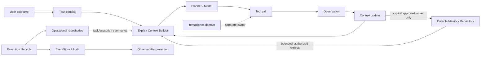

# MEMORY & CONTEXT ARCHITECTURE AUDIT

## 1. Executive findings

This audit describes the repository as it exists after Prompt 33. It does
not implement a new memory layer, add a database, or alter execution
behavior.

1. **Execution context exists and is ephemeral.** `ExecutionContext` is an
   immutable, execution-scoped carrier for correlation identifiers, input,
   metadata, and transient values. It is not automatically persisted.
2. **Multi-turn model context exists only inside one agent execution.**
   `AgentExecutionStrategy` creates a neutral `ModelMessage[]`, appends the
   assistant tool-call turn and tool observations, and sends the complete
   history on subsequent model rounds. The history is discarded when the
   strategy returns.
3. **Planner context is narrower than model context.** `LLMPlanner` receives
   objective, agent ID, budget, current step, and optional metadata. It does
   not automatically receive `ExecutionContext`, `ModelMessage[]`, memory,
   prior executions, or tool observations.
4. **A Memory boundary exists, but durable memory does not.** The repository
   contains `MemoryGateway`, `MemoryService`, and `InMemoryMemoryGateway`.
   The concrete implementation is an exact scope/key map held in process
   memory. It has no SQLite adapter, semantic retrieval, ranking, TTL,
   compaction, quota, or restart recovery.
5. **There is an implementation/documentation mismatch.** The agent runtime
   calls the gateway directly rather than `MemoryService`, so memory access
   does not consistently pass through the application boundary or publish its
   service events. It retrieves `context` but stores the last result under
   `last_execution`; the stored value is therefore not used as the next
   execution's retrieved context.
6. **Operational persistence is real but is not memory.** SQLite persists
   tasks, agents, executions, autonomous operations, plans, decisions,
   observations, and events. It does not persist `ModelMessage` or
   `MemoryItem`.
7. **Events are audit/observability data, not retrieval memory.** The event
   store is durable and queryable, but it has no memory index, relevance
   policy, compaction, or bounded context retrieval.
8. **Recovery is lifecycle recovery, not context recovery.** Restart recovery
   reconciles abandoned task, execution, and autonomous-operation states. It
   cannot rehydrate in-flight model history, `ExecutionContext`, or the
   in-memory gateway.
9. **The Platform API exposes execution operations and observability only.**
   There is no memory or conversation retrieval endpoint in the Platform API
   or Platform Client.
10. **Tentaciones remains application-domain data.** Its catalog and commerce
    state are not Core memory and must not be copied into a future memory
    store.

### Bottom line

The platform has **ephemeral execution context**, **bounded in-execution
multi-turn history**, **durable operational state**, and an **in-memory
key/value memory seam**. It does **not** yet have persistent memory in the
architectural sense required by the target model.

## 2. Current architecture

```mermaid
flowchart TD
    U[User objective] --> T[Task]
    T --> CR[CoreRuntime]
    CR --> EC[ExecutionContext<br/>trace/execution/task/input/transient values]
    CR --> S[ExecutionStrategy]
    S -->|legacy single request| ME[ModelExecutionStrategy]
    S -->|multi-turn tools| AE[AgentExecutionStrategy]
    AE --> MM[ModelMessage[]<br/>in-process only]
    MM --> MG[ModelGateway]
    MG --> P[Provider adapter]
    P -->|tool call proposal| AE
    AE --> POL[PolicyGateway]
    POL --> REG[ToolRegistry / Dispatcher]
    REG --> TOOL[Tool]
    TOOL --> OBS[Tool observation]
    OBS --> MM
    AE -->|explicit scope/key access| MEM[MemoryGateway]
    MEM --> IMG[InMemoryMemoryGateway<br/>process lifetime only]
    AE --> EV[Domain events]
    CR --> ER[Task/Execution repositories]
    CR --> ES[EventStore / audit]
    ER --> SQL[(SQLite)]
    ES --> SQL
    ES --> OP[Observability projection]
    OP --> API[Platform API]
    API --> CLIENT[Platform Client / Console]
    RR[RestartRecoveryService] --> ER
    RR --> SQL
    PL[LLMPlanner] --> MG
    PL --> PLAN[Declarative Plan]
    PLAN --> AO[AutonomousOrchestrator]
    AO --> ER
    AO --> ES
    CAT[Tentaciones catalog/domain] -. separate application ownership .-> TOOL
```

The important boundary is that the event store and execution repository are
durable operational infrastructure, while `MemoryGateway` is an independent
application seam with no durable implementation. The observability projection
is read-only and must not become an implicit memory system.

## 3. Context lifecycle audit

### Where `ModelMessage` is built

`AgentExecutionStrategy` initializes a user message from the objective/input.
For each model response it appends an assistant message containing response
content and proposed tool calls. For each dispatched tool it appends a tool
message containing the normalized observation. The next provider request
receives the accumulated neutral history. Provider adapters translate that
history into their native OpenAI, Anthropic, or Ollama protocol.

`ModelExecutionStrategy` and `SequentialOrchestrator` do not maintain a
conversation history. They issue single model requests or execute a declared
finite sequence.

### What survives between tool rounds

Within one invocation, the array survives in the local strategy call and is
bounded by execution limits (`MAX_TOOL_CALLS`, `MAX_TOOL_ROUNDS`, and
`MAX_EXECUTION_TIME`). It is not placed in `ExecutionContext`, repository
state, SQLite, `result_metadata`, memory, or the public execution contract.

### What the Planner can see

`PlanningRequest` supplies `objective`, `agentId`, budget, `currentStep`, and
optional metadata. `LLMPlanner` validates and returns a declarative plan; it
does not execute tools or retrieve memory. No automatic bridge supplies
conversation history, prior execution summaries, or current tool
observations.

### What is lost after completion

Unless a caller separately stores it, the following is lost when the process
finishes the execution strategy:

- neutral `ModelMessage[]`, including assistant tool calls and tool outputs;
- the in-flight `ExecutionContext` transient values;
- intermediate model responses and unprojected provider metadata;
- the in-memory memory map after process restart;
- autonomous orchestrator observations/decisions that were not written by its
  durable repository path.

The execution aggregate retains lifecycle timestamps, status, error, and
result metadata. Prompt 33 adds a bounded operational projection from that
metadata and events, but this is not a replayable conversation.

## 4. Component inventory and classification

### A. Ephemeral execution context

- `ExecutionContext`: correlation IDs, input, metadata, transient values.
- `ModelMessage[]`: one execution's neutral conversation and tool rounds.
- provider request/response objects;
- current strategy-local observations and loop counters;
- transient policy and dispatcher call state.

### B. Task context

- `Task.request.objective` and task input;
- task metadata and agent selection;
- planner objective, current step, and optional planning metadata;
- execution `resultMetadata`, final result, provider/model, rounds, and tool
  observations exposed by the Prompt 33 projection;
- autonomous plan, decisions, and observations when retained by the operation
  repositories.

This context is execution/task-associated. It should not automatically become
cross-task memory.

### C. Persistent memory

**Currently present only as a seam, not as durable capability:**

- `MemoryGateway`;
- `MemoryItem` with scope/key/value;
- `MemoryService` with explicit store/retrieve/delete operations;
- `InMemoryMemoryGateway`.

There is no durable implementation, query/retrieval abstraction beyond exact
scope/key lookup, relevance ranking, versioning, retention, compaction, or
memory recovery.

### D. Operational persistence

- task repository and SQLite `tasks` table;
- execution repository and SQLite `executions` table;
- agent repository;
- autonomous operation, plan, plan-step, decision, and observation
  repositories;
- restart recovery reconciliation;
- execution `result_metadata` JSON.

These components are authoritative for lifecycle and recovery, not a
conversation or memory database.

### E. Events / audit

- `EventPublisher`;
- in-memory and SQLite event stores;
- correlated lifecycle, policy, model, tool, memory, and recovery events;
- audit query ports;
- `EventObservabilitySubscriber` and metrics;
- Prompt 33 execution observability projection.

Events provide traceability and operational diagnostics. They currently may
contain input/output payloads, so event payload sensitivity and growth require
explicit policy before any future context retrieval uses them.

### F. Application domain data

- Tentaciones catalog, products, commerce state, and product-service data;
- any future external application records.

These remain owned by the external application and are not Core memory.

## 5. Capability matrix

| Component | Exists | Partial | Missing | Responsibility |
|---|---:|---:|---:|---|
| ExecutionContext | Yes |  |  | Immutable execution-scoped values and correlation |
| ModelMessage | Yes |  |  | Provider-neutral in-execution conversation |
| Multi-turn history | Yes |  |  | Tool rounds inside one strategy invocation |
| Task metadata | Yes |  |  | Task objective/input and task-associated data |
| Execution metadata | Yes |  |  | Lifecycle and result metadata, including observability |
| Planner / LLMPlanner | Yes | Yes |  | Declarative planning; no automatic memory/context retrieval |
| CoreRuntime | Yes |  |  | Task/execution lifecycle and strategy boundary |
| Coordinator/orchestrators | Yes | Yes |  | Sequential or autonomous coordination; no conversation memory |
| Agents | Yes |  |  | Model/tools/instructions/memory scope identity |
| Tool registry/dispatcher | Yes |  |  | Allow-list, schema validation, dispatch |
| Policy | Yes |  |  | Authorization before model/tool operations |
| EventStore | Yes |  |  | Durable event/audit history |
| Execution repository | Yes |  |  | Durable lifecycle and result state |
| SQLite | Yes |  |  | Operational persistence; no memory tables |
| Restart recovery | Yes |  |  | Reconcile abandoned lifecycle state |
| DTOs / Execution Contract | Yes |  |  | Public task/execution/event contract |
| Execution observability | Yes |  |  | Read-only projection from state/events |
| MemoryGateway | Yes | Yes |  | Explicit exact scope/key memory boundary |
| MemoryService | Yes | Yes |  | Application boundary and memory events |
| Durable memory repository |  |  | Yes | Persist/re-hydrate memory items |
| Memory retrieval | Yes | Yes | Yes | Exact key lookup only; no bounded relevance retrieval |
| Context compaction |  |  | Yes | Summarize or reduce long histories |
| Size/retention limits |  |  | Yes | Memory, event, metadata, and history quotas |
| Secret sanitization | Yes | Yes |  | Recursive tool observability redaction only; no uniform policy |
| Platform API memory surface |  |  | Yes | Explicit memory read/write contract |
| Platform Client memory surface |  |  | Yes | Typed client methods for memory |
| Tentaciones memory ownership |  |  | Yes | Correctly remains outside Core scope |

## 6. Reuse, modifications, and future creation

### Reuse

- `ExecutionContext` for bounded execution-local state;
- `ModelMessage` and existing provider translators for in-execution rounds;
- existing `MemoryGateway`/`MemoryService` boundary rather than introducing
  another abstraction;
- existing task/execution repositories for operational state;
- existing EventStore for audit, not retrieval;
- existing policy, tool registry, dispatcher, and correlation identifiers;
- existing execution observability projection for operator visibility;
- SQLite and restart recovery for lifecycle durability.

### Modify later

1. Route runtime memory access through `MemoryService` consistently.
2. Resolve the `context` versus `last_execution` key contract deliberately;
   do not silently reinterpret it.
3. Define a typed, bounded task-context summary separate from raw
   `ModelMessage`.
4. Add uniform redaction, payload-size, retention, and tenant/scope rules.
5. Define whether and how retry/recovery can resume a model round; current
   recovery must remain lifecycle-only until that policy is explicit.
6. Add explicit planner inputs for retrieved context rather than making
   retrieval implicit.

### Create later, only if approved by a subsequent prompt

- a durable memory repository using the existing memory boundary;
- explicit bounded retrieval criteria and provenance;
- versioning/concurrency semantics;
- retention and deletion policy;
- context compaction/summarization with observable provenance;
- contract tests and Platform API methods only after the domain contract is
  fixed.

### Do not create

- a second EventStore;
- a second database for memory without an explicit architecture decision;
- Redis, vector databases, LangChain, or LlamaIndex;
- automatic unbounded retrieval on every model call;
- implicit conversion of all events or all execution outputs into memory;
- a copy of Tentaciones catalog or commerce records in Core memory;
- a second observability source of truth.

## 7. Architectural and security risks

### Architectural risks

- The name `MemoryGateway` can suggest durability that the current adapter
  does not provide.
- Direct gateway use bypasses `MemoryService` event instrumentation.
- The current read/write key mismatch makes the demonstrated last execution
  memory effectively non-retrievable as context.
- `result_metadata` and event payloads are JSON-shaped escape hatches with no
  explicit size budget.
- Event replay cannot reconstruct model history because provider messages are
  not stored as a canonical conversation.
- Planner and runtime can evolve separate context semantics unless a typed
  task-context contract is introduced.

### Security risks

- Task input, `ExecutionContext.metadata`, planner metadata, tool inputs,
  outputs, result metadata, and event payloads do not share one uniform
  sanitization policy.
- Sensitive values can enter generic `Record<string, unknown>` fields even
  though Prompt 33 redacts selected observability payloads.
- Exact scope/key memory has no documented tenant authorization model beyond
  scope selection.
- Durable memory, if added without deletion and retention controls, could
  outlive the task or user consent that produced it.
- Reusing raw events as context could disclose credentials, personal data, or
  provider responses to a later model call.

### Context growth risks

- Model history grows with every assistant tool-call and tool-result message.
  Current round/call/time limits bound execution count but not a byte/token
  budget for the accumulated messages.
- Large tool outputs can inflate provider requests, result metadata, and event
  rows.
- Autonomous observations and plan metadata can grow independently of
  multi-turn history.
- No compaction or retention mechanism currently bounds durable operational
  payloads.

## 8. Impact analysis

### SQLite

No schema change is required for this audit. Current schema version 3 stores
operational entities and events. Adding memory later would require an explicit
schema/repository design, quotas, indexes, deletion semantics, migration
tests, and a decision about whether memory is in the same SQLite database.
`result_metadata` must not become an accidental memory table.

### Recovery

Current recovery remains correct for lifecycle state: abandoned `CREATED` and
`RUNNING` records are reconciled fail-closed/idempotently. It cannot resume
the model conversation or restore the in-memory map. A future resumable
conversation policy must be designed separately from crash reconciliation.

### Platform API and Client

The existing API correctly exposes tasks, executions, events, health, agents,
and observability. It has no memory endpoints, retrieval query, provenance
contract, or deletion contract. No API addition should be made until the
memory domain semantics and authorization boundaries are approved.

### Observability

Execution observability is useful for current activity, tool calls, errors,
duration, and final result. It is a projection and should remain read-only.
Future memory operations should emit explicit bounded events and metrics,
without treating the event stream as the memory source.

### Tentaciones

No impact should be introduced by a Core memory design. Product catalog,
commerce state, and application-specific retrieval remain Tentaciones-owned.
The Platform may retain task references and bounded results, but must not
replicate catalog data into generic Core memory.

## 9. Recommended target architecture



Recommended principles:

- Keep execution context ephemeral and immutable.
- Keep task context typed, bounded, and tied to a task/execution.
- Make memory retrieval explicit, authorized, bounded, provenance-bearing, and
  observable.
- Keep memory writes explicit; do not automatically store every model/tool
  result.
- Keep operational persistence and events separate from memory.
- Apply size, retention, redaction, and scope rules before durable storage.
- Let the planner receive a deliberately constructed context package, not
  hidden global retrieval.
- Preserve current SQLite/recovery behavior unless a later prompt defines
  resumable conversational execution.

## 10. Implementation roadmap after this audit

1. **Contract clarification:** define task-context summary, memory item
   semantics, scope/authorization, provenance, deletion, retention, and size
   limits.
2. **Boundary alignment:** route runtime calls through `MemoryService` and
   settle the context/last-execution key behavior with tests.
3. **Safe durable adapter:** implement a bounded repository behind the existing
   `MemoryGateway`, with migration and isolation tests only after approval.
4. **Explicit retrieval:** add a request-scoped context builder that accepts
   retrieval limits and returns provenance; do not retrieve implicitly.
5. **Compaction:** add bounded conversation/task summarization with a clear
   distinction between summary, raw observation, and memory.
6. **Security and retention:** add uniform redaction, quotas, TTL/deletion,
   authorization, and metrics.
7. **Recovery policy:** decide whether only lifecycle recovery is supported or
   whether resumable executions are required; implement the latter separately.
8. **Public contracts:** expose Platform API/Client memory operations only
   after the domain and security contracts stabilize.
9. **Cross-project validation:** verify that Tentaciones data remains external
   domain data and is never silently copied into Core memory.

## 11. Recommended order of subsequent prompts

1. Memory and task-context contract, boundaries, and security policy.
2. Runtime boundary alignment and explicit context-builder design.
3. Durable memory adapter on the existing gateway, if persistence is approved.
4. Bounded retrieval and provenance.
5. Context compaction and token/byte budgets.
6. Retention, deletion, sanitization, authorization, and observability.
7. Recovery/resumability policy, only if required.
8. Platform API and Client exposure.
9. Cross-project/Tentaciones integration validation.

## 12. Validation results

Executed without architectural changes:

- `npm run check` — PASS.
- `npm run build` — PASS.
- `npm test` — PASS.
- Focused tests covering execution context, memory service/gateway,
  planner, agent/runtime, execution persistence, SQLite crash recovery,
  restart recovery, and tool calling — PASS.
- `git diff --check` — PASS.

No new dependency, database, EventStore, Redis, vector database, or memory
implementation was introduced by this audit.
