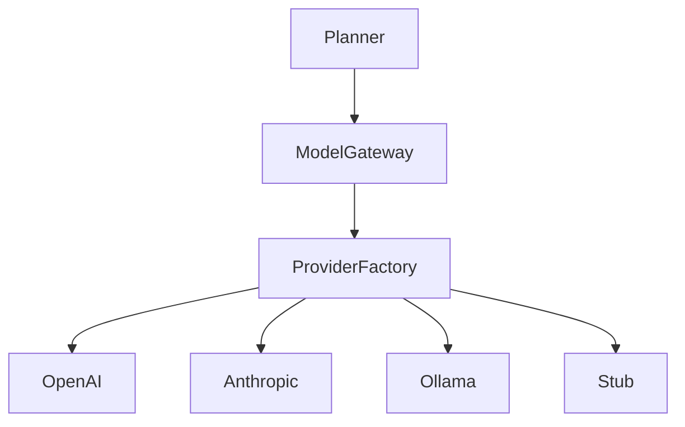

# Model Gateway

The Core depends on the provider-neutral `ModelGateway` contract in
`src/domain/model/model-gateway.ts`. Providers are selected at the composition
root; planners, agents, coordinators, Tentaciones, and the browser never
import vendor SDKs or read credentials.



## Configuration

The safe default is deterministic stub mode:

```text
MODEL_PROVIDER=stub
MODEL_NAME=stub-model
MODEL_REQUEST_TIMEOUT_MS=30000
```

Supported providers are `stub`, `openai`, `anthropic`, and `ollama`.
Provider-specific configuration is server-side only:

* `OPENAI_API_KEY`, `OPENAI_MODEL`, `OPENAI_BASE_URL`
* `ANTHROPIC_API_KEY`, `ANTHROPIC_MODEL`, `ANTHROPIC_BASE_URL`
* `OLLAMA_BASE_URL`, `OLLAMA_MODEL`

`MODEL_REQUEST_TIMEOUT_MS` bounds every remote request. Missing credentials are
reported as normalized authentication errors when that provider is selected;
stub mode never requires credentials.

## Security and errors

Keys are used only to construct outbound provider requests. They are not
included in model output, DTOs, events, logs, or browser bundles. Provider
failures normalize to the `ModelExecutionError` hierarchy:
`MODEL_AUTHENTICATION_ERROR`, `MODEL_RATE_LIMIT_ERROR`,
`MODEL_TIMEOUT_ERROR`, `MODEL_PROVIDER_ERROR`, `MODEL_INVALID_RESPONSE`, and
`MODEL_UNAVAILABLE`.

Structured requests (`json_object`/`json_schema`) are parsed at the provider
boundary. Invalid JSON is rejected before it reaches the planner. The
`LLMPlanner` then validates the resulting plan with the existing
`PlanValidator` and policy preflight; providers never execute tools.

## Local development and testing

Use `MODEL_PROVIDER=stub` for deterministic tests and CI. Ollama can be used
locally by setting `MODEL_PROVIDER=ollama` and its base URL. OpenAI and
Anthropic calls are not made by normal tests; inject a fetch double into the
provider constructors for deterministic response/error tests.
