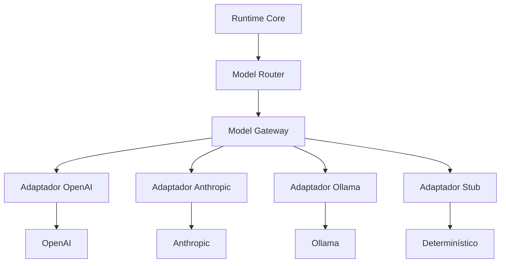

# Referencia de Arquitectura de Model Gateway

## 1. Visión General

El `ModelGateway` es el punto de entrada exclusivo para que el Core Engine de la AI Operating Platform solicite inferencia de modelos. Oculta completamente a la lógica de dominio, las estrategias de ejecución de tareas y a los agentes de conocer:
- Qué proveedor está manejando la petición (OpenAI, Anthropic, Ollama, modelos locales).
- Cómo se forman los payloads HTTP o headers de autenticación del proveedor.
- Qué SDK o biblioteca de red se utiliza.
- Cómo están estructurados los códigos de error internos del proveedor.


```mermaid
flowchart TD
    Core["Runtime Core"]
    Router["Model Router"]
    Gateway["Model Gateway"]
    OA["Adaptador OpenAI"]
    AA["Adaptador Anthropic"]
    OllA["Adaptador Ollama"]
    SA["Adaptador Stub"]
    O["OpenAI"]
    A["Anthropic"]
    Oll["Ollama"]
    D["Determinístico"]

    Core --> Router
    Router --> Gateway
    Gateway --> OA
    Gateway --> AA
    Gateway --> OllA
    Gateway --> SA
    OA --> O
    AA --> A
    OllA --> Oll
    SA --> D
```

---

## 2. Contratos Core

### `ModelCapability`
Capacidades explícitas consultadas antes de la ejecución:
- `TEXT_GENERATION`: Completado de texto estándar / conversación.
- `STRUCTURED_OUTPUT`: Generación confiable de objetos JSON conforme a un esquema.
- `TOOL_CALLING`: Llamadas a funciones / despacho de herramientas.
- `VISION`: Procesamiento de imágenes multimodal.
- `EMBEDDINGS`: Incrustaciones vectoriales.
- `STREAMING`: Entrega incremental de tokens.

Chequeo de pre-ejecución:
```typescript
const isSupported = await gateway.supports(modelId, "STRUCTURED_OUTPUT");
if (!isSupported) throw new ModelCapabilityUnsupportedError(modelId, "STRUCTURED_OUTPUT");
```

### `ModelRouter`
Evalúa las peticiones entrantes y determina el modelo y proveedor objetivo:
1. Resuelve la definición del modelo y el proveedor.
2. Evalúa `SecurityBoundaryEnforcer` contra el `SecurityContext` del llamador.
3. Verifica las capacidades requeridas.
4. Genera una cadena de fallback autorizada.

### `DefaultModelGateway`
Coordina la ejecución con:
- **Validación de Petición**: Aplica trace ID, modelo no vacío, entrada válida y tamaño delimitado de payload (límite de 1MB).
- **Reintentos Delimitados**: Los errores transitorios (`ModelRateLimitError`, `ModelTimeoutError`, `ModelUnavailableError`) se reintentan con retroceso exponencial (exponential backoff) hasta `maxRetries`. Errores de autenticación y validación fallan inmediatamente.
- **Fallback Controlado**: Si el proveedor principal falla debido a red/caída, la pasarela intenta secuencialmente con los proveedores de respaldo permitidos.
- **Validación de Salida Estructurada**: `generateStructured(request, schema)` parsea JSON de forma segura, verifica propiedades de esquema requeridas y devuelve resultados fuertemente tipados. Las respuestas del modelo no confiable no pueden evadir los límites del sistema.

---

## 3. Normalización de Errores de Proveedor

Los adaptadores de proveedor traducen los códigos de error HTTP específicos del vendedor en excepciones estandarizadas de la plataforma:

| Error de Plataforma | Código | ¿Elegible para Reintento? | Descripción |
|---|---|:---:|---|
| `ModelValidationError` | `MODEL_INVALID_REQUEST` | No | Petición malformada, campo faltante o payload excedido |
| `ModelAuthenticationError` | `MODEL_AUTHENTICATION_ERROR` | No | Credenciales de API inválidas o faltantes |
| `ModelRateLimitError` | `MODEL_RATE_LIMIT_ERROR` | Sí | HTTP 429 límite de tasa excedido |
| `ModelTimeoutError` | `MODEL_TIMEOUT_ERROR` | Sí | La petición excedió el tiempo de espera del cliente |
| `ModelUnavailableError` | `MODEL_UNAVAILABLE` | Sí | Proveedor inalcanzable, 503 o fallo de conexión |
| `ModelStructuredOutputError` | `OUTPUT_INVALID` | No | El modelo produjo un JSON inválido o falló la validación del esquema |
| `ModelCapabilityUnsupportedError` | `CAPABILITY_UNSUPPORTED` | No | Capacidad solicitada no ofrecida por el modelo seleccionado |

---

## 4. Invariantes de Seguridad y Aislamiento

1. **Aplicación de RBAC**: La invocación de modelos requiere el permiso `model.invoke` verificado a través de `SecurityBoundaryEnforcer`.
2. **Lista Blanca de Modelos**: Principales y agentes están restringidos a las listas blancas de modelos configuradas.
3. **Cero Fugas de Secretos**: Las claves API y headers de autenticación nunca se registran, ni persisten en SQLite, ni se retornan en eventos de tareas.
4. **Pruebas Offline**: Todas las suites de pruebas unitarias e integración se ejecutan estrictamente offline usando stubs determinísticos o funciones fetch simuladas (mocked).
