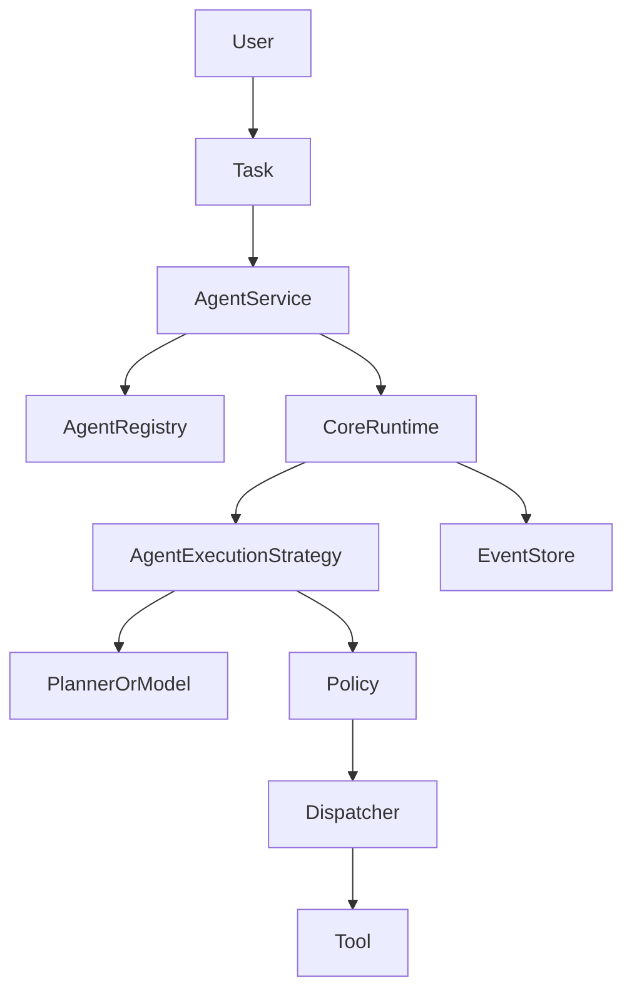

# Multi-Agent Architecture v0.1

## Current model

An `Agent` is a registered, versioned execution definition. Its identity is
validated by `AgentService` and stored through the existing `AgentRegistry`.
The definition currently owns its model, instructions, tools, status and
optional memory scope. A capability is not currently a separate runtime
contract; the existing `capabilities` field is descriptive, while tools remain
the executable allow-list.

The current execution relationship is:

One task currently names one `agentId`, and one `Execution` is owned by that
task. Multiple agents may exist in the registry and may execute separate tasks,
but the platform does not yet model multiple agent executions under one task,
agent-to-agent messages, aggregation, delegation, or agent spawning.

## Contract decision

The smallest justified v0.1 contract is the existing set of boundaries:

- `Agent`: validated identity and execution configuration;
- `AgentRegistry`: explicit register, lookup, list, update and delete;
- `AgentService`: validates selection and starts an agent execution;
- `CoreRuntime`: sole owner of task/execution lifecycle;
- `PolicyGateway`: authorizes model and tool operations;
- `AgentExecutionStrategy`: executes one selected agent;
- `EventStore`: records operational facts.

No new `AgentIdentity`, `AgentMessage`, coordination graph, or second
orchestrator is introduced yet.

## Selection and security

The caller selects an agent through `AgentService`. The registry validates
identity and existence; inactive agents cannot execute. A planner may produce
plans and actions, but it cannot select an arbitrary agent or bypass
`AgentService`, `CoreRuntime`, `PolicyGateway`, or the tool dispatcher.

An agent cannot directly invoke another agent. Cross-agent memory access is
not a coordination mechanism and remains governed by the existing Memory
boundary. Agent tools remain distinct from capabilities: capabilities describe
what an agent can do, while tools are concrete executable resources checked by
policy and dispatched through the tool layer.

## Coordination boundary for a future release

If a real use case requires multiple agents, coordination should be owned by a
single existing orchestration/application boundary and produce bounded child
task/execution requests. It must define:

- a coordinator-owned correlation identifier;
- validated agent selection through the registry;
- bounded, sanitized output handoff;
- explicit aggregation;
- per-agent and total budgets/timeouts;
- fail-closed policy checks;
- lifecycle/events through `CoreRuntime` and `EventStore`.

Coordination data is not conversation history, Memory, or an event bus.
`ModelRequest.messages` remains the canonical history for each model
execution, and `TaskContext` remains execution-scoped and bounded.

## Failure model

Existing task/execution failure, timeout, cancellation, policy denial,
durable events and restart recovery remain the only failure mechanisms. A
future coordinator must not duplicate recovery or create autonomous,
unbounded retries. Until that contract is required by a concrete use case,
multi-agent execution is intentionally not exposed.

## Decision

**NO IMPLEMENTATION REQUIRED**

The current platform has a sound single-agent execution contract and a
deterministic registry. It does not yet have a justified multi-agent use case
or coordination contract, so adding one now would be speculative
architecture.
