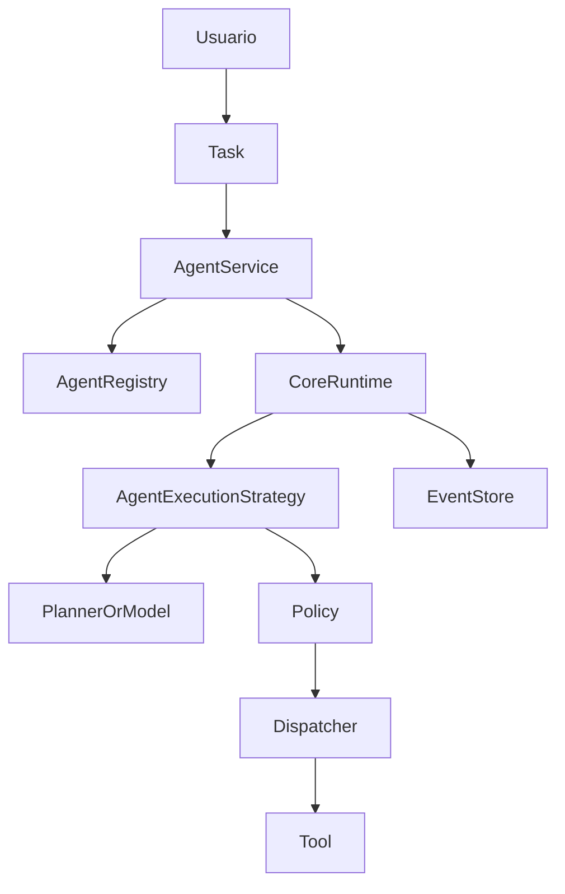

# Arquitectura Multi-Agente v0.1

## Modelo actual

Un `Agent` es una definición de ejecución registrada y versionada. Su identidad es validada por `AgentService` y almacenada a través del `AgentRegistry` existente. Actualmente, la definición posee su modelo, instrucciones, herramientas, estado y un alcance de memoria opcional. Una capacidad no es actualmente un contrato de tiempo de ejecución separado; el campo `capabilities` existente es descriptivo, mientras que las herramientas siguen siendo la lista de permitidos ejecutable.

La relación de ejecución actual es:

```mermaid
flowchart TD
  Usuario --> Task
  Task --> AgentService
  AgentService --> AgentRegistry
  AgentService --> CoreRuntime
  CoreRuntime --> AgentExecutionStrategy
  AgentExecutionStrategy --> PlannerOrModel
  AgentExecutionStrategy --> Policy
  Policy --> Dispatcher
  Dispatcher --> Tool
  CoreRuntime --> EventStore
```

Actualmente, una tarea nombra un `agentId`, y una `Execution` es propiedad de esa tarea. Múltiples agentes pueden existir en el registro y pueden ejecutar tareas separadas, pero la plataforma aún no modela múltiples ejecuciones de agentes bajo una sola tarea, mensajes de agente a agente, agregación, delegación o creación de agentes.

## Decisión de contrato

El contrato v0.1 más pequeño justificado es el conjunto existente de límites:

- `Agent`: identidad validada y configuración de ejecución;
- `AgentRegistry`: registro explícito, búsqueda, lista, actualización y eliminación;
- `AgentService`: valida la selección e inicia una ejecución de agente;
- `CoreRuntime`: propietario exclusivo del ciclo de vida de la tarea/ejecución;
- `PolicyGateway`: autoriza las operaciones del modelo y de las herramientas;
- `AgentExecutionStrategy`: ejecuta un agente seleccionado;
- `EventStore`: registra hechos operativos.

Aún no se introduce un nuevo `AgentIdentity`, `AgentMessage`, gráfico de coordinación o un segundo orquestador.

## Selección y seguridad

El llamador selecciona un agente a través de `AgentService`. El registro valida la identidad y la existencia; los agentes inactivos no pueden ejecutarse. Un planificador puede producir planes y acciones, pero no puede seleccionar un agente arbitrario ni omitir `AgentService`, `CoreRuntime`, `PolicyGateway` o el despachador de herramientas.

Un agente no puede invocar directamente a otro agente. El acceso a la memoria entre agentes no es un mecanismo de coordinación y sigue regido por el límite de Memoria existente. Las herramientas del agente siguen siendo distintas de las capacidades: las capacidades describen lo que un agente puede hacer, mientras que las herramientas son recursos ejecutables concretos verificados por la política y despachados a través de la capa de herramientas.

## Límite de coordinación para un lanzamiento futuro

Si un caso de uso real requiere múltiples agentes, la coordinación debe ser propiedad de un único límite de orquestación/aplicación existente y producir solicitudes de tarea/ejecución secundarias limitadas. Debe definir:

- un identificador de correlación propiedad del coordinador;
- selección validada de agentes a través del registro;
- traspaso (handoff) de salida limitado y sanitizado;
- agregación explícita;
- presupuestos/tiempos de espera por agente y totales;
- verificaciones de políticas de cierre seguro (fail-closed);
- ciclo de vida/eventos a través de `CoreRuntime` y `EventStore`.

Los datos de coordinación no son historial de conversación, Memoria o un bus de eventos. `ModelRequest.messages` sigue siendo el historial canónico para cada ejecución del modelo, y `TaskContext` permanece limitado y con alcance de ejecución.

## Modelo de fallas

La falla de tarea/ejecución existente, el tiempo de espera, la cancelación, la denegación de política, los eventos duraderos y la recuperación de reinicio siguen siendo los únicos mecanismos de falla. Un futuro coordinador no debe duplicar la recuperación ni crear reintentos autónomos e ilimitados. Hasta que ese contrato sea requerido por un caso de uso concreto, la ejecución multi-agente está intencionalmente no expuesta.

## Decisión

**NO SE REQUIERE IMPLEMENTACIÓN**

La plataforma actual tiene un contrato de ejecución de un solo agente sólido y un registro determinista. Aún no tiene un caso de uso multi-agente justificado o un contrato de coordinación, por lo que agregar uno ahora sería una arquitectura especulativa.
