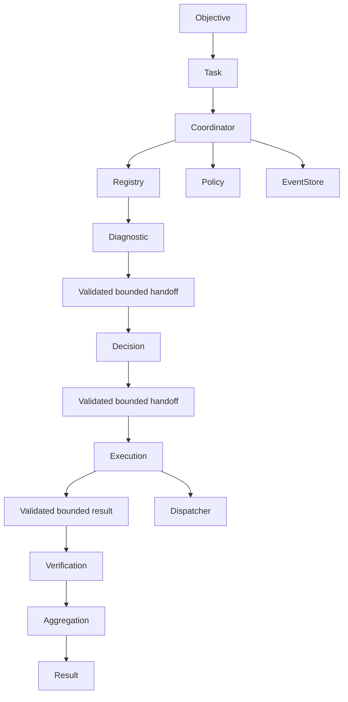

# Multi-Agent Coordination Contract v0.1

## 1. Executive Summary

The current platform has multiple registered agents, but one `Task` currently
selects one `agentId` and one `Execution` is owned by that task. There is no
agent-to-agent runtime, handoff protocol, aggregation model, or delegation
authority.

One bounded, generic candidate is justified for future evaluation:

```text
Operations diagnostic -> decision -> execution -> verification
```

This is a contract and audit only. It does not add a coordinator, endpoints,
runtime classes, persistence, or new events.

## 2. Current Architecture Findings

- `AgentService` validates agent identity, registration, model/tool references,
  active status, and starts a task.
- `AgentRegistry` is the source of truth for agent definitions.
- `CoreRuntime` owns Task and Execution lifecycle, persistence, events, timeout
  propagation, cancellation, and recovery boundaries.
- `AgentExecutionStrategy` executes one selected agent and routes tools through
  Policy and the Dispatcher.
- `TaskContext` is execution-scoped and bounded.
- `MemoryService` retains selected information; it is not a communication bus.
- `ModelRequest.messages` is the canonical conversation history for one model
  execution.
- `EventStore` records operational facts and is not a coordination channel.

## 3. Candidate Use Cases

| Case | Real specialization | Can one agent do it? | Current fit | Decision |
|---|---|---|---|---|
| Research → analysis → execution | evidence collection, reasoning, controlled action | Usually yes for bounded tasks | No research/evidence contract exists | Defer |
| Planner → specialist → validator | plan construction, domain work, independent validation | Sometimes; validation may need independence | Registry and Policy fit, but no handoff contract | Defer |
| Commerce intent → product → inventory | domain ownership split | Yes, and Tentaciones owns the domain | Would couple Core to commerce data | Reject for Core |
| Requirements → architecture → implementation → validation | distinct artifacts and review | Yes for small changes | No code-artifact contract exists | Defer |
| Diagnostic → decision → execution → verification | observe, decide, act, independently verify | Not reliably when action risk requires independent verification | Reuses existing execution, Policy, tools and events | **Primary candidate** |

The primary candidate is not an assertion that every operational task needs
four agents. It is justified only when an action has a meaningful verification
requirement or the diagnostic and execution authorities must be separated.

## 4. Use Case Comparison

The primary candidate adds real functional separation:

- Diagnostic Agent produces a bounded finding, not an authorization.
- Decision Agent converts the finding into a proposed action, not execution.
- Execution Agent invokes only authorized tools.
- Verification Agent evaluates the observed result against explicit criteria.

The coordinator, not an LLM, decides whether the chain may continue. For a
low-risk task, one agent remains preferable because coordination adds latency,
failure modes, context transfer, and operational cost.

## 5. Selected Primary Use Case

**Operations Diagnostic → Decision → Execution → Verification** is the single
candidate for a future implementation. It is generic to the platform and does
not copy Tentaciones domain data.

Example scope: inspect a bounded operational observation, propose one
allow-listed action, execute it through the existing dispatcher, and verify the
result. The example is intentionally generic; no new operational tool is
created by this contract.

## 6. Why Multi-Agent

Multi-agent is justified only where separation of authority is required:

1. Diagnosis must not itself execute a side effect.
2. Decision must be validated by Core and Policy before execution.
3. Verification must consume the bounded execution result and can reject a
   result independently of the executor.

This is a control boundary, not a claim that multiple prompts are inherently
better.

## 7. Why Not Single-Agent

A single agent can perform the sequence for low-risk operations. It is not
adequate for the primary candidate when the same model both asserts the
diagnosis, authorizes its own action, executes it, and declares success. That
combines incompatible responsibilities and weakens independent verification.
The coordinator must therefore enforce the separation and may collapse the
flow to one agent only when policy marks the operation as safe.

## 8. Conceptual Coordination Model



The Coordinator is an application/core authority. Registry selects definitions;
Core validates task and execution state; Policy authorizes each transition and
tool; Dispatcher executes tools; EventStore observes; the Coordinator performs
deterministic aggregation.

## 9. Coordinator Responsibility

The future Coordinator would own only coordination state:

- correlation and handoff identifiers;
- ordered step transitions;
- agent selection requests;
- budgets, timeout and cancellation checks;
- handoff validation;
- aggregation and terminal status.

It would not replace `CoreRuntime`, `AgentRegistry`, `PolicyGateway`,
`Dispatcher`, `TaskContext`, Memory, or EventStore.

## 10. Agent Selection Contract

Selection must be explicit and validated:

1. Coordinator submits a requested `agentId` and required capability.
2. Registry resolves the definition.
3. Core rejects unknown or inactive agents.
4. Policy authorizes the role, scope and operation.
5. Core starts the child execution through the existing lifecycle.

The LLM may propose a role or plan, but it cannot select an arbitrary agent or
start execution directly. Capability remains descriptive; tools remain concrete
executable resources.

## 11. Agent Handoff Contract

A future handoff is coordination data, not chat:

```text
handoffId
correlationId
taskId
executionId
sourceAgentId
targetAgentId
objective
input
output
metadata
createdAt
completedAt
status
failure
```

Initial conservative limits should be configuration, not hard-coded protocol
assumptions: one bounded object payload, maximum depth 4, maximum 64 object keys,
maximum 2048 characters per string, a finite handoff count per coordination,
and no arbitrary binary or infrastructure references. Inputs and outputs must
use the existing bounded sanitization principles. A handoff is accepted only
once by its target step; duplicate handoffs are rejected by `handoffId`.

## 12. Context Boundaries

- **TaskContext:** current bounded execution context for each agent execution,
  including the objective, current round, selected observations and supplied
  context.
- **Memory:** selected retained information, never a handoff bus or complete
  execution transcript.
- **EventStore:** durable operational facts about coordination and executions,
  never data retrieval for agents.
- **ModelRequest.messages:** canonical conversation history for one model round.
- **Handoff:** only the explicitly selected, bounded output needed by the next
  agent.

No shared mutable context is introduced and no handoff duplicates the full
message history.

## 13. Memory Boundary

The Coordinator must not use Memory to pass Agent A output to Agent B. If a
result should survive the coordination, the application may write a selected,
sanitized record through `MemoryService` after policy authorization. Normal
handoffs remain ephemeral coordination data.

## 14. EventStore Boundary

The EventStore records coordination facts such as start, selection, handoff
acceptance/rejection, child execution status and terminal coordination status.
It is not queried as a message bus and does not replace TaskContext or the
handoff payload.

## 15. Policy & Security

The conceptual flow is:

```text
Coordination Request
→ Core validation
→ Policy authorization
→ Registry selection
→ Child execution
```

Policy must fail closed for unknown/inactive agents, unauthorized roles or
tools, invalid scopes, oversized payloads, malformed targets, duplicate
handoffs, loops, escalation beyond the coordinator, and attempts to access
another agent's Memory. Agents cannot call agents directly or bypass Dispatcher.

## 16. Budgets & Limits

Initial values should be conservative and configurable:

- maximum agents per coordination: small finite count;
- maximum handoffs: no more than the number of planned transitions;
- maximum rounds and tool calls: reuse existing execution limits;
- global and per-agent timeout: bounded by the parent execution;
- maximum handoff payload: reuse bounded-data limits;
- maximum coordination depth: one coordinator level; no recursive spawning.

The purpose is to prevent loops, runaway cost and unbounded context, not to
promise a universal number before a real workload exists.

## 17. Failure & Recovery

- Diagnostic/decision/execution/verification failure terminates or produces an
  explicitly marked partial result according to coordinator policy.
- Handoff rejection fails closed; it is not silently retried.
- Timeout uses existing execution limits and cancellation.
- Policy denial produces a failed coordination result and observable event.
- Agent unavailable is a validated selection/execution failure.
- Restart uses existing durable Task/Execution state and EventStore recovery.
- Duplicate coordination is rejected by correlation/operation identity.

No second recovery mechanism or unlimited retry loop is introduced.

## 18. Observability

Future conceptual facts include:

`COORDINATION_STARTED`, `AGENT_SELECTED`, `HANDOFF_REQUESTED`,
`HANDOFF_ACCEPTED`, `HANDOFF_REJECTED`, `AGENT_EXECUTION_STARTED`,
`AGENT_EXECUTION_COMPLETED`, `AGENT_EXECUTION_FAILED`,
`COORDINATION_COMPLETED`, and `COORDINATION_FAILED`.

They should correlate using `taskId`, `executionId`, `correlationId`,
`agentId`, and `handoffId`, while preserving metadata-only payloads and the
existing EventStore boundary. No events are implemented in this release.

## 19. Isolation

Every child execution receives an explicit identity, scope and bounded
TaskContext. Agent A cannot see Agent B's context or Memory unless a
Coordinator-approved handoff includes selected data and Policy authorizes it.
There is no shared mutable state, implicit global context, or direct Agent →
Agent call.

## 20. Aggregation

Aggregation is deterministic Coordinator logic, not unconstrained LLM judgment:

- all required steps succeed: complete;
- verification rejects: failed or explicitly partial according to policy;
- missing/duplicate result: failed;
- conflicting results: unresolved/failed until a deterministic validator rule
  resolves them;
- partial success: returned with explicit step statuses and error metadata.

The final result must identify which steps succeeded and never present an
unverified execution as success.

## 21. Implementation Status

**HARDENED RUNTIME IMPLEMENTED**

The primary operations use case (`DIAGNOSTIC` -> `DECISION` -> `EXECUTION` -> `VERIFICATION`) is fully implemented and hardened in `src/domain/coordination/coordination.ts` and `src/application/coordination/multi-agent-coordinator.ts`.

Key architectural invariants enforced:
- `MultiAgentCoordinator` is the single coordination authority.
- `maxAgents = 4`, `maxHandoffs = 3`, `maxDepth = 1`.
- Independent verification semantics: no forced `verified: true`; verdicts evaluated explicitly (`PASS` / `FAIL` / conflict / missing).
- Runtime budget counters (`agentsExecuted`, `handoffsCreated`, `coordinationDepth`).
- Context and memory isolation across agent handoffs.
- Bounded, sanitized `AgentHandoff` payloads.
- Policy evaluated before each step.
- Full domain event observability.

**COORDINATION STATE DURABILITY: NOT YET IMPLEMENTED**
Child tasks and executions are durable and recoverable via SQLite and CoreRuntime. Top-level coordination requests and results remain ephemeral in memory.

## 22. Files Changed + Validation

Core Implementation Files:
- `src/domain/coordination/coordination.ts`
- `src/application/coordination/multi-agent-coordinator.ts`
- `tests/unit/multi-agent-coordinator.test.ts`
- `docs/MULTI_AGENT_RUNTIME.md`
- `docs/MULTI_AGENT_COORDINATION_CONTRACT.md`

Validation required:
- `npm run build`
- `npm test`
- `npm run check`
- `git diff --check`
