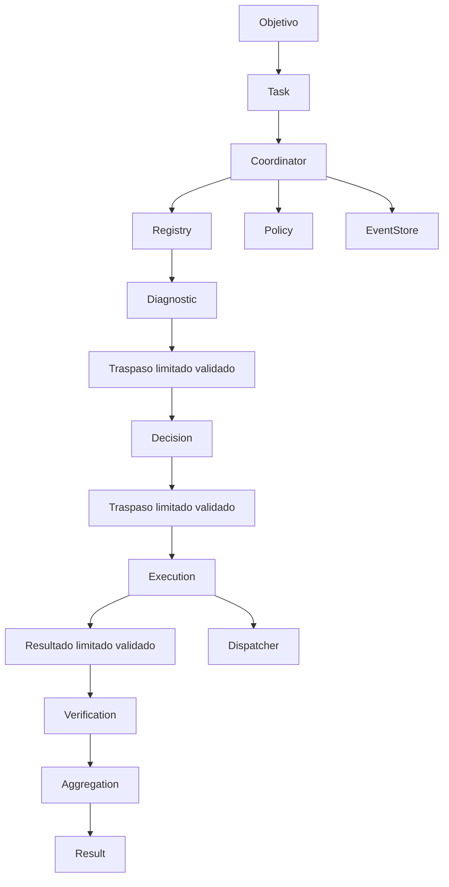

# Contrato de Coordinación Multi-Agente v0.1

## 1. Resumen Ejecutivo

La plataforma actual tiene múltiples agentes registrados, pero actualmente una `Task` selecciona un `agentId` y una `Execution` es propiedad de esa tarea. No hay tiempo de ejecución (runtime) de agente a agente, protocolo de traspaso (handoff), modelo de agregación o autoridad de delegación.

Se justifica un candidato limitado y genérico para evaluación futura:

```text
Operaciones de diagnóstico -> decisión -> ejecución -> verificación
```

Este es solo un contrato y una auditoría. No agrega un coordinador, endpoints, clases de tiempo de ejecución, persistencia ni eventos nuevos.

## 2. Hallazgos de la Arquitectura Actual

- `AgentService` valida la identidad del agente, registro, referencias de modelos/herramientas, estado activo, y comienza una tarea.
- `AgentRegistry` es la fuente de la verdad para las definiciones de agentes.
- `CoreRuntime` posee el ciclo de vida de Task y Execution, persistencia, eventos, propagación de tiempos de espera, cancelación y límites de recuperación.
- `AgentExecutionStrategy` ejecuta un agente seleccionado y enruta herramientas a través de Policy y Dispatcher.
- `TaskContext` tiene alcance de ejecución y está limitado.
- `MemoryService` retiene información seleccionada; no es un bus de comunicación.
- `ModelRequest.messages` es el historial de conversación canónico para una ejecución de modelo.
- `EventStore` registra hechos operativos y no es un canal de coordinación.

## 3. Casos de Uso Candidatos

| Caso | Especialización real | ¿Puede hacerlo un agente? | Ajuste actual | Decisión |
|---|---|---|---|---|
| Investigación → análisis → ejecución | recolección de evidencia, razonamiento, acción controlada | Usualmente sí para tareas limitadas | No existe contrato de investigación/evidencia | Diferir |
| Planificador → especialista → validador | construcción de planes, trabajo de dominio, validación independiente | A veces; la validación puede requerir independencia | Registro y Policy se ajustan, pero no hay contrato de traspaso | Diferir |
| Intención de comercio → producto → inventario | división de propiedad de dominio | Sí, y Tentaciones es dueño del dominio | Acoplaría Core a los datos de comercio | Rechazar para Core |
| Requisitos → arquitectura → implementación → validación | artefactos distintos y revisión | Sí para cambios pequeños | No existe contrato de código-artefacto | Diferir |
| Diagnóstico → decisión → ejecución → verificación | observar, decidir, actuar, verificar independientemente | No confiablemente cuando el riesgo de la acción requiere verificación independiente | Reutiliza la ejecución existente, Policy, herramientas y eventos | **Candidato principal** |

El candidato principal no es una afirmación de que cada tarea operativa necesite cuatro agentes. Está justificado solo cuando una acción tiene un requisito de verificación significativo o las autoridades de diagnóstico y ejecución deben estar separadas.

## 4. Comparación de Casos de Uso

El candidato principal agrega una separación funcional real:

- El Agente de Diagnóstico produce un hallazgo limitado, no una autorización.
- El Agente de Decisión convierte el hallazgo en una acción propuesta, no en una ejecución.
- El Agente de Ejecución invoca solo herramientas autorizadas.
- El Agente de Verificación evalúa el resultado observado frente a criterios explícitos.

El coordinador, no un LLM, decide si la cadena puede continuar. Para una tarea de bajo riesgo, un agente sigue siendo preferible porque la coordinación agrega latencia, modos de falla, transferencia de contexto y costo operativo.

## 5. Caso de Uso Principal Seleccionado

**Operaciones de Diagnóstico → Decisión → Ejecución → Verificación** es el único candidato para una implementación futura. Es genérico para la plataforma y no copia los datos de dominio de Tentaciones.

Alcance del ejemplo: inspeccionar una observación operativa limitada, proponer una acción permitida, ejecutarla a través del despachador existente y verificar el resultado. El ejemplo es intencionalmente genérico; no se crea ninguna herramienta operativa nueva con este contrato.

## 6. Por qué Multi-Agente

Multi-agente se justifica solo donde se requiere separación de autoridad:

1. El diagnóstico no debe en sí mismo ejecutar un efecto secundario.
2. La decisión debe ser validada por Core y Policy antes de la ejecución.
3. La verificación debe consumir el resultado de ejecución limitado y puede rechazar un resultado independientemente del ejecutor.

Este es un límite de control, no una afirmación de que múltiples prompts son inherentemente mejores.

## 7. Por qué no un Solo Agente

Un solo agente puede realizar la secuencia para operaciones de bajo riesgo. No es adecuado para el candidato principal cuando el mismo modelo afirma el diagnóstico, autoriza su propia acción, la ejecuta y declara el éxito. Eso combina responsabilidades incompatibles y debilita la verificación independiente. Por lo tanto, el coordinador debe hacer cumplir la separación y puede colapsar el flujo a un solo agente solo cuando la política marque la operación como segura.

## 8. Modelo de Coordinación Conceptual


```mermaid
flowchart TD
  Objetivo --> Task
  Task --> Coordinator
  Coordinator --> Registry
  Registry --> Diagnostic
  Diagnostic --> Handoff1[Traspaso limitado validado]
  Handoff1 --> Decision
  Decision --> Handoff2[Traspaso limitado validado]
  Handoff2 --> Execution
  Execution --> Handoff3[Resultado limitado validado]
  Handoff3 --> Verification
  Verification --> Aggregation
  Aggregation --> Result
  Coordinator --> Policy
  Execution --> Dispatcher
  Coordinator --> EventStore
```

El Coordinator (Coordinador) es una autoridad de aplicación/core. Registry selecciona definiciones; Core valida el estado de la tarea y ejecución; Policy autoriza cada transición y herramienta; Dispatcher ejecuta herramientas; EventStore observa; el Coordinator realiza una agregación determinista.

## 9. Responsabilidad del Coordinador

El futuro Coordinator poseería solo estado de coordinación:

- identificadores de correlación y traspaso;
- transiciones de pasos ordenadas;
- solicitudes de selección de agentes;
- presupuestos, verificación de tiempo de espera y cancelación;
- validación de traspaso;
- agregación y estado terminal.

No reemplazaría `CoreRuntime`, `AgentRegistry`, `PolicyGateway`, `Dispatcher`, `TaskContext`, Memoria ni EventStore.

## 10. Contrato de Selección de Agentes

La selección debe ser explícita y validada:

1. El Coordinator envía un `agentId` solicitado y la capacidad requerida.
2. El Registry resuelve la definición.
3. Core rechaza agentes desconocidos o inactivos.
4. Policy autoriza el rol, el alcance y la operación.
5. Core inicia la ejecución secundaria a través del ciclo de vida existente.

El LLM puede proponer un rol o plan, pero no puede seleccionar un agente arbitrario o iniciar la ejecución directamente. La capacidad sigue siendo descriptiva; las herramientas siguen siendo recursos ejecutables concretos.

## 11. Contrato de Traspaso de Agentes (Handoff)

Un traspaso futuro es datos de coordinación, no chat:

```text
handoffId
correlationId
taskId
executionId
sourceAgentId
targetAgentId
objective
input
output
metadata
createdAt
completedAt
status
failure
```

Los límites conservadores iniciales deben ser configuración, no suposiciones de protocolo codificadas: una carga útil de objeto limitada, profundidad máxima de 4, máximo de 64 claves de objeto, máximo de 2048 caracteres por cadena, un recuento de traspasos finito por coordinación y sin referencias binarias o de infraestructura arbitrarias. Las entradas y salidas deben utilizar los principios de sanitización limitados existentes. Un traspaso es aceptado solo una vez por su paso objetivo; los traspasos duplicados son rechazados por `handoffId`.

## 12. Límites de Contexto

- **TaskContext:** contexto de ejecución limitado actual para cada ejecución de agente, incluido el objetivo, la ronda actual, las observaciones seleccionadas y el contexto provisto.
- **Memoria:** información retenida seleccionada, nunca un bus de traspaso o una transcripción de ejecución completa.
- **EventStore:** hechos operativos duraderos sobre coordinación y ejecuciones, nunca recuperación de datos para agentes.
- **ModelRequest.messages:** historial de conversación canónico para una ronda de modelo.
- **Traspaso:** solo la salida limitada seleccionada explícitamente y necesaria para el próximo agente.

No se introduce un contexto mutable compartido y ningún traspaso duplica el historial completo de mensajes.

## 13. Límite de Memoria

El Coordinator no debe usar Memoria para pasar la salida del Agente A al Agente B. Si un resultado debe sobrevivir a la coordinación, la aplicación puede escribir un registro sanitizado seleccionado a través de `MemoryService` después de la autorización de la política. Los traspasos normales siguen siendo datos de coordinación efímeros.

## 14. Límite de EventStore

El EventStore registra hechos de coordinación como inicio, selección, aceptación/rechazo de traspaso, estado de ejecución secundaria y estado terminal de coordinación. No es consultado como un bus de mensajes y no reemplaza TaskContext o la carga útil del traspaso.

## 15. Política y Seguridad

El flujo conceptual es:

```text
Solicitud de Coordinación
→ Validación del Core
→ Autorización de Policy
→ Selección del Registry
→ Ejecución secundaria
```

La política debe cerrar por defecto (fail-closed) para agentes desconocidos/inactivos, roles o herramientas no autorizados, alcances inválidos, cargas útiles de gran tamaño, objetivos mal formados, traspasos duplicados, bucles, escalada más allá del coordinador e intentos de acceder a la Memoria de otro agente. Los agentes no pueden llamar a otros agentes directamente o eludir el Dispatcher.

## 16. Presupuestos y Límites

Los valores iniciales deben ser conservadores y configurables:

- agentes máximos por coordinación: cuenta finita pequeña;
- traspasos máximos: no más que el número de transiciones planeadas;
- rondas máximas y llamadas a herramientas: reutilizar límites de ejecución existentes;
- tiempo de espera global y por agente: limitado por la ejecución principal;
- carga útil máxima del traspaso: reutilizar límites de datos limitados;
- profundidad máxima de coordinación: un nivel de coordinador; sin creación recursiva (spawning).

El propósito es prevenir bucles, costos descontrolados y contexto ilimitado, no prometer un número universal antes de que exista una carga de trabajo real.

## 17. Falla y Recuperación

- La falla de diagnóstico/decisión/ejecución/verificación termina o produce un resultado parcial explícitamente marcado de acuerdo a la política del coordinador.
- El rechazo del traspaso falla de forma segura (fails closed); no se reintenta silenciosamente.
- El tiempo de espera utiliza los límites de ejecución existentes y la cancelación.
- La denegación de política produce un resultado de coordinación fallido y un evento observable.
- El agente no disponible es una falla validada de selección/ejecución.
- El reinicio utiliza el estado duradero de Task/Execution existente y la recuperación de EventStore.
- La coordinación duplicada se rechaza por correlación/identidad de operación.

No se introduce un segundo mecanismo de recuperación ni un bucle de reintento ilimitado.

## 18. Observabilidad

Los hechos conceptuales futuros incluyen:

`COORDINATION_STARTED`, `AGENT_SELECTED`, `HANDOFF_REQUESTED`,
`HANDOFF_ACCEPTED`, `HANDOFF_REJECTED`, `AGENT_EXECUTION_STARTED`,
`AGENT_EXECUTION_COMPLETED`, `AGENT_EXECUTION_FAILED`,
`COORDINATION_COMPLETED`, y `COORDINATION_FAILED`.

Deben correlacionarse utilizando `taskId`, `executionId`, `correlationId`, `agentId` y `handoffId`, preservando las cargas útiles solo de metadatos y el límite existente de EventStore. No se implementan eventos en este lanzamiento.

## 19. Aislamiento

Cada ejecución secundaria recibe una identidad explícita, alcance y TaskContext limitado. El Agente A no puede ver el contexto o la Memoria del Agente B a menos que un traspaso aprobado por el Coordinator incluya datos seleccionados y Policy lo autorice. No hay estado mutable compartido, contexto global implícito o llamada directa Agente → Agente.

## 20. Agregación

La agregación es lógica determinista del Coordinator, no un juicio ilimitado del LLM:

- todos los pasos requeridos tienen éxito: completo;
- la verificación rechaza: fallido o explícitamente parcial según la política;
- resultado faltante/duplicado: fallido;
- resultados conflictivos: no resuelto/fallido hasta que una regla de validador determinista los resuelva;
- éxito parcial: devuelto con estados de pasos explícitos y metadatos de error.

El resultado final debe identificar qué pasos tuvieron éxito y nunca presentar una ejecución no verificada como exitosa.

## 21. Estado de Implementación

**TIEMPO DE EJECUCIÓN REFORZADO IMPLEMENTADO**

El caso de uso principal de operaciones (`DIAGNOSTIC` -> `DECISION` -> `EXECUTION` -> `VERIFICATION`) está completamente implementado y reforzado en `src/domain/coordination/coordination.ts` y `src/application/coordination/multi-agent-coordinator.ts`.

Invariantes arquitectónicas clave impuestas:
- `MultiAgentCoordinator` es la única autoridad de coordinación.
- `maxAgents = 4`, `maxHandoffs = 3`, `maxDepth = 1`.
- Semántica de verificación independiente: no hay `verified: true` forzado; los veredictos se evalúan explícitamente (`PASS` / `FAIL` / conflicto / faltante).
- Contadores de presupuesto en tiempo de ejecución (`agentsExecuted`, `handoffsCreated`, `coordinationDepth`).
- Aislamiento de contexto y memoria a través de traspasos de agentes.
- Cargas útiles de `AgentHandoff` limitadas y sanitizadas.
- La política se evalúa antes de cada paso.
- Observabilidad completa de eventos de dominio.

**DURABILIDAD DEL ESTADO DE COORDINACIÓN: AÚN NO IMPLEMENTADO**
Las tareas secundarias y ejecuciones son duraderas y recuperables a través de SQLite y CoreRuntime. Las solicitudes y resultados de coordinación de nivel superior siguen siendo efímeros en la memoria.

## 22. Archivos Modificados + Validación

Archivos de Implementación Core:
- `src/domain/coordination/coordination.ts`
- `src/application/coordination/multi-agent-coordinator.ts`
- `tests/unit/multi-agent-coordinator.test.ts`
- `docs/MULTI_AGENT_RUNTIME.md`
- `docs/MULTI_AGENT_COORDINATION_CONTRACT.md`

Validación requerida:
- `npm run build`
- `npm test`
- `npm run check`
- `git diff --check`
