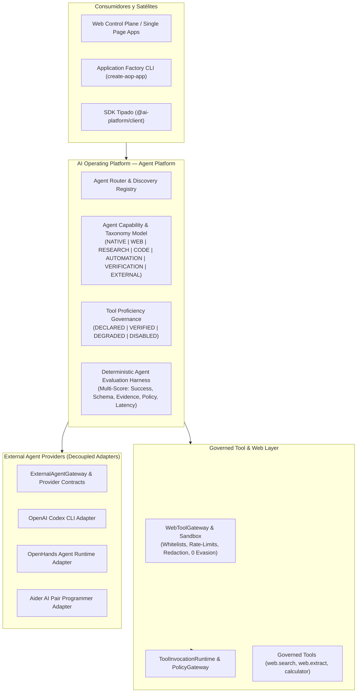

# Arquitectura de Plataforma Multi-Agente — AI Operating Platform

> **Documento Canónico de Arquitectura de Agentes, Herramientas, Navegación Web y Proveedores Externos**  
> **Línea Base:** v1.4.0 Baseline | **Fase Activa:** Fase 141 (`AOP-MULTI-AGENT-WEB-AI`)  
> **Idioma Oficial:** Español Latinoamericano (`es-419`) con identificadores técnicos canónicos en inglés  

---

## 1. Visión y Principio Arquitectónico

La **AI Operating Platform** trasciende la mera ejecución atómica de modelos para convertirse en una **Plataforma Integral de Operación y Gobernanza Multi-Agente**.

---

## 2. Taxonomía Canónica de Agentes

| Tipo de Taxonomía | Rol de Agente | Responsabilidades Primarias | Herramientas por Defecto | Directivas de Gobernanza |
| :--- | :--- | :--- | :--- | :--- |
| **`NATIVE_AGENT`** | Native Core Agent | `DIAGNOSTICS`, `EXECUTION`, `COORDINATION` | `calculator`, `system.ping` | Máx. 5 pasos, determinista, 0 dependencias externas. |
| **`MODEL_AGENT`** | Model Inference Agent | `ANALYSIS`, `EXECUTION`, `CUSTOMER_SUPPORT` | `calculator` | Enrutado por `DefaultModelRouter`, fallback a `Stub`. |
| **`WEB_AGENT`** | Web AI Navigation & Extraction | `ANALYSIS`, `CATALOG`, `INVENTORY` | `web.search`, `web.extract` | `allowedDomains`, rate limiting, evidencia requerida. |
| **`RESEARCH_AGENT`** | Market & Technical Research | `ANALYSIS`, `DIAGNOSTICS` | `web.search`, `web.extract`, `calculator` | Síntesis estructurada con puntuaciones de confianza. |
| **`CODE_AGENT`** | Engineering & Code Synthesis | `EXECUTION`, `MAINTENANCE` | `code.analyze`, `code.test_runner` | Aprobación humana obligatoria para cambios destructivos. |
| **`AUTOMATION_AGENT`** | Business Process Automation | `EXECUTION`, `INVENTORY`, `COORDINATION` | `calculator`, `device.print` | Programación continua mediante Daemons autónomos. |
| **`VERIFICATION_AGENT`**| Quality & Policy Verifier | `VERIFICATION`, `SECURITY` | `calculator` | Segregación de funciones (SoD), validación de invariantes. |
| **`EXTERNAL_AGENT`** | Sandboxed External Provider | `EXECUTION`, `ANALYSIS` | Ninguna directa (vía Gateway) | Adaptadores desacoplados con auditoría estricta. |

---

## 3. Gobernanza Web AI y Evidencia Estructurada

El `WebToolGateway` asegura que ningún agente acceda a recursos de red sin intermediación:
1. **Listas Blancas / Negras:** Validación fail-closed de `allowedDomains` y `blockedDomains`.
2. **Seguridad Web:** Prohibición estricta de evasión de CAPTCHA, scraping hostil o elusión de autenticación.
3. **Evidencia Estructurada (`StructuredClaimEvidence`):** Cada afirmación crítica reporta fuente, dominio, timestamp, confianza matemática y verificación determinista.

---

## 4. Proveedores Externos Desacoplados

Los proveedores externos (**OpenAI Codex CLI**, **OpenHands**, **Aider**) se integran mediante la pasarela desacoplada `ExternalAgentGateway` implementando `ExternalAgentProviderAdapter`:
* **Aislamiento:** No son dependencias de ejecución obligatorias en el Core (`0 runtime lock-in`).
* **Fail-Closed:** Requisito de evaluación de `PolicyGateway` y fallback transparente ante indisponibilidad.
