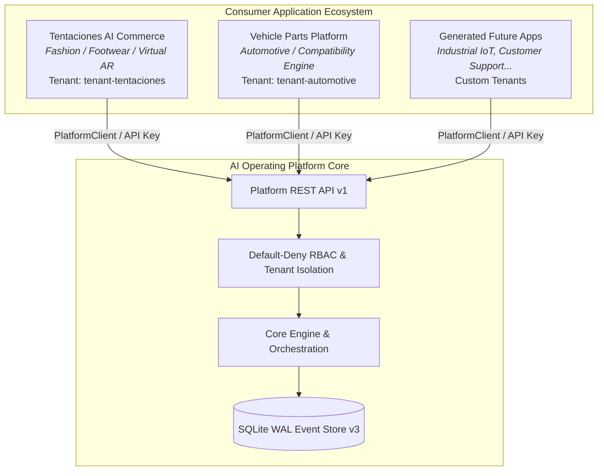

# Multi-Application Ecosystem — Architecture & Coexistence Guide

> **Demonstrating cross-application isolation, independent domain models, and unified governance over the AI Operating Platform.**

---

## 1. Multi-Application Topology

---

## 2. Hard Domain & Data Isolation

| Dimension | Tentaciones AI Commerce | Vehicle Parts Platform | Future Factory Applications |
| :--- | :--- | :--- | :--- |
| **Domain Category** | Fashion & Footwear | Automotive Machinery | Custom / Domain specific |
| **Primary Identifier** | `tentaciones-commerce` | `vehicle-parts-platform` | User defined (`[a-z0-9_-]+`) |
| **Assigned Tenant** | `tenant-tentaciones` | `tenant-automotive` | Dynamic Tenant Binding |
| **Catalog Entities** | Shoes, Dresses, Jackets, Socks | Brake pads, Oil filters, Spark plugs, Struts | Application-defined |
| **Key Invariant** | Footwear size & 3D AR avatar | Vehicle fitment & engine compatibility | Domain-specific validation |
| **Cross-Access** | **BLOCKED (Fail-Closed)** | **BLOCKED (Fail-Closed)** | **BLOCKED (Fail-Closed)** |

---

## 3. Application Lifecycle Management

Each application in the ecosystem transitions through a strictly monitored lifecycle:

1. **`DRAFT`:** Manifest created, awaiting validation.
2. **`VALIDATED`:** Manifest and capability entitlements verified.
3. **`REGISTERED`:** App persisted in Platform Application Registry.
4. **`CONNECTED`:** First authenticated handshake via PlatformClient.
5. **`OPERATIONAL`:** Actively submitting and executing tasks.
6. **`SUSPENDED`:** Temporarily disabled by admin or quota policy. *All capabilities revoked immediately.*
7. **`RETIRED`:** Permanently decommissioned.

---

## 4. Ecosystem Event Stream

All application lifecycle mutations emit durable, correlated events into the append-only SQLite WAL ledger:

- `application.registered`: Emitted upon successful registration.
- `application.connected`: Emitted upon initial client connection.
- `application.suspended`: Emitted when an application is paused.
- `application.revoked`: Emitted upon decommissioning.
- `application.execution.completed`: Emitted upon task execution completion.
- `application.execution.failed`: Emitted upon task execution failure.

---

## 5. Enterprise Portfolio Narrative

> *"We did not just build an AI app. We built an enterprise AI Operating Platform capable of running multiple independent, production-grade applications—from high-fashion virtual try-ons to precision automotive compatibility—without changing a single line of Core Engine code."*
