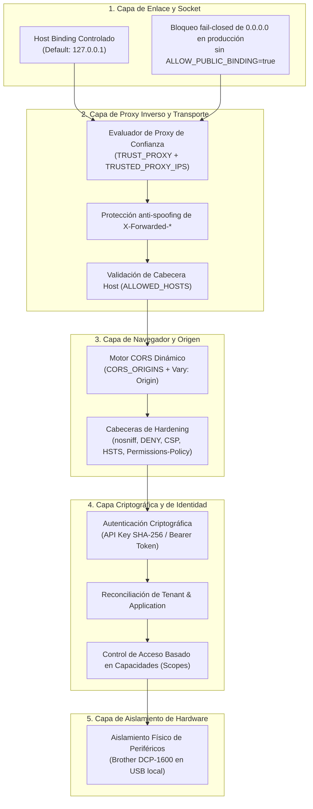

# Seguridad de Red y Transporte (Enterprise Network Security)

## 1. Modelo de Seguridad y Defensa en Profundidad
La plataforma empresarial **AI Operating Platform (AOP)** opera bajo el principio rector:

$$\text{Red} \neq \text{Identidad} \neq \text{Autoridad}$$

La capacidad de alcanzar físicamente o por TCP/IP un puerto de la plataforma no otorga ninguna presunción de confianza, autenticidad ni permiso de ejecución. Toda interacción pasa por validaciones en múltiples capas concéntricas.

---

## 2. Capas de Seguridad Perimetral y de Transporte

---

## 3. Matriz de Cabeceras de Seguridad y Políticas

| Cabecera | Valor Configurado | Propósito de Seguridad |
|---|---|---|
| `X-Content-Type-Options` | `nosniff` | Previene ataques de MIME sniffing en navegadores. |
| `X-Frame-Options` | `DENY` | Previene ataques de clickjacking y embedding en iframes. |
| `Referrer-Policy` | `strict-origin-when-cross-origin` | Protege URLs internas contra fugas en peticiones salientes. |
| `Permissions-Policy` | `camera=(), microphone=(), geolocation=(), payment=()` | Desactiva APIs de hardware de navegador no requeridas. |
| `Content-Security-Policy` | `default-src 'self'; script-src 'self'; style-src 'self' 'unsafe-inline'; img-src 'self' data:; connect-src 'self' http: https:; frame-ancestors 'none';` | Mitiga inyecciones XSS y restringe orígenes de ejecución. |
| `Strict-Transport-Security` | `max-age=31536000; includeSubDomains` | Forzado cuando la conexión es HTTPS o proviene de proxy seguro. |
| `Vary` | `Origin, Accept-Encoding` | Previene cache poisoning en CDNs y proxies intermedios. |

---

## 4. Estrategia de Enlace (Binding Policy)

- **Desarrollo y Pruebas**: Enlace por defecto a `127.0.0.1:3000`.
- **Producción (`NODE_ENV=production`)**: 
  - Si `HOST=0.0.0.0` y `ALLOW_PUBLIC_BINDING` no está explícitamente en `true`, el servidor **falla al iniciar (fail-closed)** arrojando `ConfigurationError`.
  - La exposición hacia el exterior debe realizarse a través de un Reverse Proxy / Ingress Gateway (Nginx, Caddy, Cloudflare, Traefik).

---

## 5. Mitigación de Amenazas de Red

### 5.1. Spoofing de Cabeceras `X-Forwarded-*`
Si un atacante envía cabeceras `X-Forwarded-For: 1.1.1.1` o `X-Forwarded-Proto: https`, el router evalúa la IP física del socket (`req.socket.remoteAddress`). Si la IP física no está en `TRUSTED_PROXY_IPS` o si `TRUST_PROXY=false`, las cabeceras se descartan y se utiliza la IP real del socket.

### 5.2. Envenenamiento de Cabecera Host (Host Header Poisoning)
Cuando `ALLOWED_HOSTS` está definido, toda petición con un `Host` no autorizado es rechazada inmediatamente con `400 Bad Request` (`INVALID_HOST`), evitando redirecciones maliciosas y generación incorrecta de URLs absolutas.

### 5.3. Aislamiento de Dispositivos Locales (Brother DCP-1600)
La impresora de negocio está conectada al puerto USB local `USB001` de la máquina anfitriona. La plataforma nunca expone sockets TCP/IP crudos de la impresora (como el puerto 9100 LPR/RAW). Todo trabajo de impresión pasa indefectiblemente por `POST /api/v1/devices/:id/print-jobs`, que exige autenticación de servicio, validación de inquilino y alcance `devices.write`.
