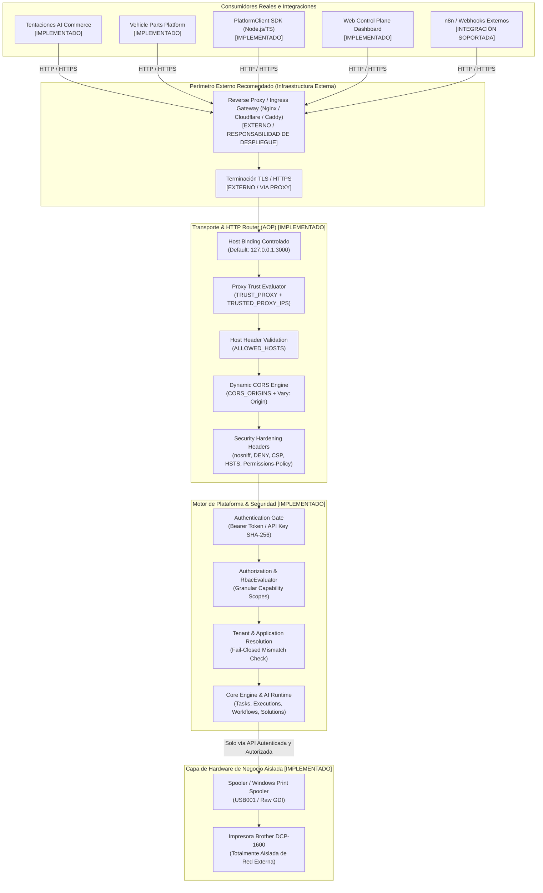

# Topología de Red Empresarial (Enterprise Network Topology)

## 1. Propósito y Visión General
La **AI Operating Platform (AOP)** implementa una arquitectura perimetral y de transporte en capas con principio de defensa en profundidad. La plataforma no asume seguridad perimetral implícita; en su lugar, todo acceso de red se somete a verificación criptográfica, resolución de confianza de proxy, validación de inquilino y control de acceso basado en capacidades.

---

## 2. Diagrama de Arquitectura y Topología Real

---

## 3. Clasificación de Componentes: Implementado vs Externo vs Futuro

| Componente | Clasificación | Ubicación / Estado |
|---|---|---|
| **Host Binding (`HOST`, `PORT`, `ALLOW_PUBLIC_BINDING`)** | `IMPLEMENTADO` | `src/infrastructure/config/config.ts`, `src/platform/server.ts` |
| **Evaluación de Confianza de Proxy (`TRUST_PROXY`, `TRUSTED_PROXY_IPS`)** | `IMPLEMENTADO` | `src/platform/api/http-router.ts` |
| **Validación de Cabecera Host (`ALLOWED_HOSTS`)** | `IMPLEMENTADO` | `src/platform/api/http-router.ts` |
| **CORS Dinámico con Lista Blanca (`CORS_ORIGINS`)** | `IMPLEMENTADO` | `src/platform/api/http-router.ts` |
| **Cabeceras de Hardening HTTP (`nosniff`, `DENY`, `CSP`, `HSTS`)** | `IMPLEMENTADO` | `src/platform/api/http-router.ts` |
| **Diagnóstico de Red (`GET /api/v1/diagnostics/network`)** | `IMPLEMENTADO` | `src/platform/api/platform-service.ts`, `http-router.ts` |
| **PlatformClient SDK Endurecido (Retries, Timeout, Tenant)** | `IMPLEMENTADO` | `src/platform-client/index.ts` |
| **Aislamiento de Impresora Brother DCP-1600** | `IMPLEMENTADO` | `src/infrastructure/devices/windows-brother-adapter.ts` |
| **Terminación TLS Directa en Proceso Node.js** | `FUTURE / OPTIONAL` | Actualmente se delega al Reverse Proxy aguas arriba. |
| **Reverse Proxy / Ingress Gateway Externo** | `EXTERNAL INFRA` | Responsabilidad del entorno de despliegue (Nginx/Caddy/Cloudflare). |
| **Service Mesh / mTLS Inter-Nodo** | `FUTURE SCOPE` | Reservado para topologías multinodo distribuidas. |

---

## 3. Invariantes de Seguridad de Red

1. **Red $\neq$ Identidad $\neq$ Autoridad**:
   La accesibilidad a nivel de red (socket TCP/IP) no otorga ninguna autoridad ni elude los controles de autenticación, autorización de capacidades o presupuestos de recursos de equipo.
2. **Bind Seguro por Defecto (`127.0.0.1`)**:
   El motor de plataforma se enlaza por defecto a la interfaz de loopback `127.0.0.1`. En entornos de producción (`NODE_ENV=production`), el enlace a `0.0.0.0` está bloqueado por defecto y requiere la bandera explícita `ALLOW_PUBLIC_BINDING=true`.
3. **Confianza Explícita de Proxy Inverso**:
   Las cabeceras `X-Forwarded-For`, `X-Forwarded-Proto` y `X-Forwarded-Host` solo se procesan cuando `TRUST_PROXY=true` y la dirección física del socket coincide con una IP en `TRUSTED_PROXY_IPS`. De lo contrario, se ignoran por completo para evitar spoofing.
4. **CORS Dinámico con Lista Blanca Estricta**:
   En producción, no se permiten orígenes comodín (`*`) con credenciales. Solo los orígenes listados en `CORS_ORIGINS` reciben cabeceras `Access-Control-Allow-Origin`, acompañadas siempre de `Vary: Origin`.
5. **Aislamiento Total de Periféricos Físicos**:
   Los dispositivos de negocio (como la impresora térmica Brother DCP-1600 conectada por USB001) residen exclusivamente detrás de la plataforma. Jamás se exponen puertos directos ni servicios de impresión crudos a internet.
