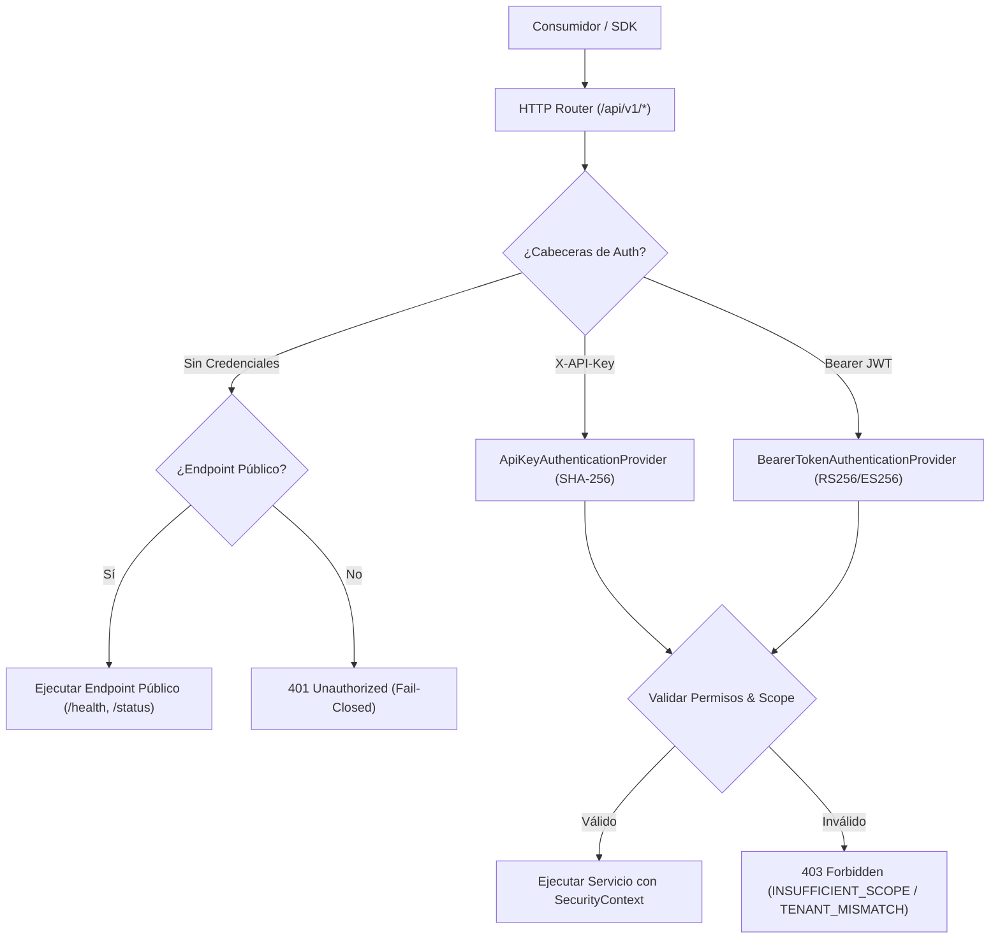

# Guía Oficial del Contrato OpenAPI 3.1 — AI Operating Platform

**AI Operating Platform — Especificación y Gobernanza del Contrato REST API**

---

## 1. Visión General y Propósito

El contrato **OpenAPI 3.1** de la **AI Operating Platform (AOP)** formaliza la superficie HTTP REST pública y operacional del sistema. Proporciona una fuente única y verificable de verdad para:
1. **Documentación interactiva y lectura humana**: Descripción exhaustiva de endpoints, esquemas de entrada/salida y códigos de estado HTTP.
2. **Compatibilidad con herramientas y SDKs**: Alineación directa 1:1 con el SDK `@ai-platform/client` y la CLI de andamiaje `create-aop-app`.
3. **Validación de contratos y prevención de regresiones**: Pruebas automáticas (`tests/contract/openapi-contract.test.ts`) y validación estructural (`npm run api:check`).
4. **Descubrimiento de capacidades y telemetría**: Mapeo estricto del catálogo de capacidades (`PLATFORM_CAPABILITY_CATALOG`) a endpoints reales.

---

## 2. Ubicación y Metadatos Canónicos

* **Archivo Canónico:** [`docs/openapi.yaml`](./openapi.yaml) (con réplica en [`docs/openapi/openapi.yaml`](./openapi/openapi.yaml))
* **Versión de Especificación:** `openapi: 3.1.0`
* **Versión del Producto:** `1.4.0`
* **Servidor de Ejecución Local:** `http://127.0.0.1:3000/api/v1`

---

## 3. Arquitectura de Autenticación y Seguridad

La API opera bajo el principio de **seguridad por defecto (*default-deny*)** y soporte multi-tenant con aislamiento estricto.



### Mecanismos de Autenticación
1. **API Keys Empresariales (`apiKeyAuth`):**
   * Cabecera: `X-API-Key: aop_live_*`
   * Validación: Hash SHA-256 contra la tabla SQLite `api_credentials`.
   * Revelación única: Las claves en texto plano se generan estrictamente una vez en la creación/rotación.
2. **Tokens JWT Asimétricos (`bearerAuth`):**
   * Cabecera: `Authorization: Bearer <jwt>`
   * Firmas: RS256 / ES256 con verificación de emisor (`iss`), expiración (`exp`) y tenant.

---

## 4. Estructura de Errores y Modelo de Respuestas

Todas las respuestas de error siguen el esquema estandarizado `components.schemas.Error`:

```json
{
  "error": "Access denied: Principal 'worker-01' lacks required scope 'tasks.create'",
  "status": 403,
  "code": "INSUFFICIENT_SCOPE",
  "requestId": "d82f3b90-1c2a-4a5e-b812-78d91f2c4109",
  "correlationId": "corr-8f12-411a-9812",
  "timestamp": "2026-09-23T21:40:00.000Z",
  "traceId": "trace-e2e-001"
}
```

### Códigos de Estado HTTP Soportados

| Código HTTP | Código Interno | Significado Operacional |
| :--- | :--- | :--- |
| **`200 OK`** | `SUCCESS` | Petición completada con éxito. |
| **`201 Created`** | `CREATED` | Recurso creado exitosamente (Tarea, Agente, Credencial). |
| **`400 Bad Request`** | `VALIDATION` / `INVALID_JSON` | Payload malformado o violación de esquema. |
| **`401 Unauthorized`** | `UNAUTHORIZED` | Credenciales ausentes, inválidas o expiradas. |
| **`403 Forbidden`** | `FORBIDDEN` / `TENANT_MISMATCH` | Permisos insuficientes o violación de frontera tenant. |
| **`404 Not Found`** | `NOT_FOUND` | Recurso o entidad solicitada no existe. |
| **`409 Conflict`** | `CONFLICT` | Conflicto de unicidad o control de concurrencia optimista (OCC). |
| **`413 Payload Too Large`**| `PAYLOAD_TOO_LARGE` | Cuerpo de la petición excede el límite de 1MB. |
| **`415 Unsupported Media`**| `UNSUPPORTED_MEDIA_TYPE`| `Content-Type` no es `application/json`. |
| **`429 Rate Limited`**| `RATE_LIMIT_EXCEEDED` | Tasa de solicitudes por minuto excedida. |
| **`500 Internal Error`**| `INTERNAL_SERVER_ERROR`| Excepción no recuperable del motor. |
| **`503 Unavailable`** | `DEPENDENCY_UNAVAILABLE`| Dispositivo o subsistema fuera de línea. |

---

## 5. Garantías de Idempotencia y Trazabilidad

### Idempotencia
* Métodos `GET`, `HEAD`, `PUT`, `DELETE` son idempotentes por diseño.
* Métodos `POST` (como `POST /api/v1/tasks` o `POST /api/v1/governance/evidence/export`) soportan la cabecera `Idempotency-Key` (o `X-Idempotency-Key`).
* Si se envía una clave de idempotencia idéntica para una operación ya procesada, el servidor retorna el resultado previo sin re-ejecutar el trabajo subyacente.

### Propagación de Identificadores de Diagnóstico
* **`X-Request-Id`**: Identificador UUID único por solicitud HTTP.
* **`X-Correlation-Id`**: Identificador correlacionador que atraviesa múltiples servicios y eventos.
* **`X-Trace-Id`**: Identificador de trazabilidad distribuida vinculado al almacén `DurableEventStore`.

---

## 6. Validación Automatizada del Contrato

Para verificar que la especificación OpenAPI 3.1 se mantenga 100% libre de referencias rotas, identificadores duplicados y desviaciones de esquemas:

```bash
# Validar estructura y resolución de referencias
npm run api:check

# Ejecutar pruebas unitarias y de contrato OpenAPI
npm test
```

---

## 7. Clasificación de Endpoints: Públicos vs. Internos

* **`PUBLIC_PLATFORM_API`**: Endpoints expuestos y documentados formalmente en `docs/openapi.yaml` consumibles por SDKs y clientes satélites.
* **`INTERNAL`**: Endpoints de administración local o diagnósticos de bajo nivel no sujetos a contratos de retrocompatibilidad pública externa.
