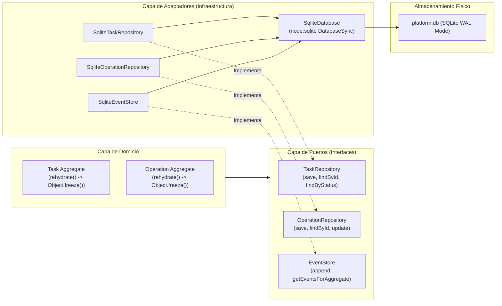
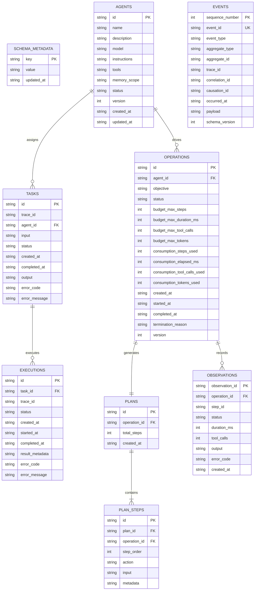

# Arquitectura de Persistencia Duradera SQLite WAL (Persistence Architecture)

Este documento describe la arquitectura de persistencia relacional duradera de **AI Operating Platform**, basada en el módulo nativo `node:sqlite` (`DatabaseSync`), modo WAL (*Write-Ahead Logging*), control de concurrencia optimista y reconstitución inmutable de agregados.

---

## 1. Principio Hexagonal de Persistencia

La persistencia respeta estrictamente la **Arquitectura Hexagonal**. La capa de dominio desconoce por completo el motor de almacenamiento subyacente.



---

## 2. Configuración del Motor SQLite (`node:sqlite`)

La clase `SqliteDatabase` (`src/infrastructure/persistence/sqlite/sqlite-database.ts`) inicializa la conexión con pragmas de alto rendimiento y confiabilidad transaccional:

```typescript
// Pragmas obligatorios configurados en tiempo de apertura
PRAGMA journal_mode = WAL;        // Escritura concurrente no bloqueante para lecturas
PRAGMA synchronous = NORMAL;       // Balance óptimo entre seguridad ACID y velocidad I/O
PRAGMA foreign_keys = ON;          // Integridad referencial estricta en cascada
PRAGMA busy_timeout = 5000;        // Espera de hasta 5 segundos ante bloqueos de escritura
```

### Características Principales:
* **Sin dependencias binarias nativas externas (`node-gyp`):** Utiliza el módulo estándar `node:sqlite` integrado en Node.js 22+.
* **Modo WAL (Write-Ahead Logging):** Permite lecturas simultáneas mientras se ejecutan transacciones de escritura sin contención.
* **Transacciones Atómicas `BEGIN IMMEDIATE`:** Garantiza la exclusión mutua durante migraciones o escrituras complejas antes de modificar el archivo.

---

## 3. Esquema Relacional de Base de Datos (Versión 3)

El esquema evoluciona mediante DDL versionado (`CURRENT_SCHEMA_VERSION = 3`):



---

## 4. Control de Concurrencia Optimista (OCC) y Rehidratación Inmutable

### 4.1 Control de Concurrencia Optimista
Para prevenir sobreescrituras silenciosas en entornos asíncronos concurrentes, las entidades con estado mutable (`Operation`, `Agent`) incorporan un campo numérico `version`.

Al ejecutar un `UPDATE`, la consulta verifica y actualiza la versión atómicamente:
```sql
UPDATE operations
SET status = ?, consumption_steps_used = ?, version = version + 1
WHERE id = ? AND version = ?;
```
Si el número de filas afectadas es `0`, el repositorio lanza un `ConcurrencyConflictError`, permitiendo al caso de uso reintentar o abortar la operación limpiamente.

### 4.2 Rehidratación Inmutable (`rehydrate()`)
Los agregados no exponen setters públicos. La reconstrucción desde la base de datos se realiza exclusivamente mediante métodos estáticos de fábrica `rehydrate()`, aplicando `Object.freeze()` a las instancias reconstituidas para blindar el estado contra mutaciones accidentales.

---

## 5. Migraciones de Esquema Transaccionales

Las migraciones de esquema se ejecutan en el arranque de la plataforma dentro de transacciones inmediatas protegidas:

```typescript
export function migrateV1ToV2(db: DatabaseSync): void {
  db.exec("BEGIN IMMEDIATE;");
  try {
    db.exec(V2_ADDITIONS_DDL);
    db.prepare("UPDATE schema_metadata SET value = '2', updated_at = ? WHERE key = 'schema_version'")
      .run(new Date().toISOString());
    db.exec("COMMIT;");
  } catch (err) {
    db.exec("ROLLBACK;");
    throw new SqlitePersistenceError("Failed to migrate SQLite schema from v1 to v2", err);
  }
}
```

---

## 6. Servicio de Recuperación ante Caídas (`RestartRecoveryService`)

El servicio `RestartRecoveryService` (`src/application/recovery/restart-recovery-service.ts`) se ejecuta al inicializar el servidor para garantizar la consistencia del estado operacional:

1. **Detección de Huérfanos:** Escanea tareas (`Task`) y operaciones (`Operation`) con estado `RUNNING` o `QUEUED`.
2. **Reconciliación de Estado:** Transiciona las operaciones interrumpidas por caída a `FAILED` o `CANCELLED` con el código de error `CRASH_RECOVERY_ABORTED`.
3. **Publicación de Eventos:** Emite eventos de dominio `operation.recovered` o `task.failed` en el `EventStore` para preservar la auditoría forense.
4. **Liberación de Recursos:** Restablece presupuestos y previene bloqueos de agentes huérfanos.
