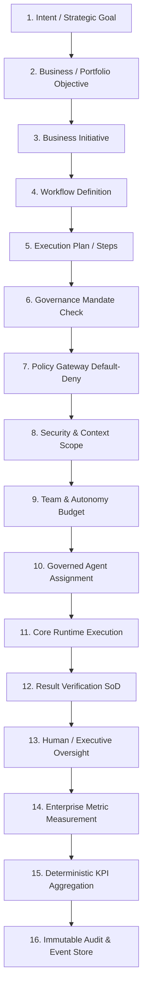

# Auditoría Arquitectónica y de Hoja de Ruta Post-Fase 76 (Post-Phase-76 Architecture & Roadmap Audit)

**Fecha de Auditoría:** 21 de Septiembre de 2026  
**Línea Base Canónica Verificada:** 1464 Tests PASS (100%), 0 FAIL, 0 SKIPPED, 67 Suites  
**Commit Canónico de Referencia:** `145cfb31ce965b514db102c4f84d23b0674e84af`  
**ADR Canónico de Fase 76:** `0045-multi-enterprise-operational-runtime-and-governed-execution.md`  
**Jerarquía de Fuente de Verdad:** $\text{Código Fuente} > \text{Tests Automatizados} > \text{Evidencia Git} > \text{Documentación Oficial} > \text{Roadmap} > \text{Excel/Kanban}$

---

## 1. Resumen Ejecutivo y Estado Real de la Fase 76

La **Fase 76 (Multi-Enterprise Operational Runtime & Governed Execution)** completó con éxito el acoplamiento directo entre el modelo de gobernanza multi-empresa ([ADR 0044](./decisions/0044-multi-enterprise-governance-and-portfolio-operating-model.md)) y el motor de ejecución operacional de flujos de trabajo ([ADR 0045](./decisions/0045-multi-enterprise-operational-runtime-and-governed-execution.md)).

### Estado Factual de Componentes de Fase 76:
- **`src/domain/workflow/workflow-definition.ts`**: `IMPLEMENTED`. Integra campos de contexto multi-empresa (`sourceEnterpriseId`, `targetEnterpriseId`, `portfolioId`, `portfolioObjectiveId`, `enterpriseMetricId`, `requestedAutonomy`, `verifierPrincipalId`, `approverPrincipalId`).
- **`src/domain/portfolio/governance-mandate.ts`**: `IMPLEMENTED`. Implementa `evaluateAuthority()` con ordenamiento estricto de jerarquía de autonomía (`AUTONOMY_RANK`) y normalización de fechas `validFrom`/`validTo`.
- **`src/application/workflow/workflow-orchestrator-service.ts`**: `IMPLEMENTED`. Orquesta la validación de mandatos con principio *fail-closed* (*default-deny*), verificación de Segregación de Funciones (SoD) en 3 roles y propagación de mediciones hacia objetivos agregados de portafolio sin intervención de LLMs.
- **Suites de Pruebas:**
  - `tests/unit/multi-enterprise-operational-runtime.test.ts`: **15 tests PASS (100%)**
  - `tests/platform/multi-enterprise-operational-runtime.test.ts`: **18 tests PASS (100%)**
  - `tests/platform/multi-enterprise-governance.test.ts`: **12 tests PASS (100%)**

---

## 2. Auditoría Detallada del Bloque de Fases 67 a 76

Se auditó la coherencia conceptual, de entidades, servicios y reglas de autoridad a lo largo de las últimas 10 fases del sistema:

| Fase | Título / Alcance | ADR | Estado en Código | Estado en Tests | Evaluación de Coherencia |
| :---: | :--- | :---: | :---: | :---: | :--- |
| **67** | **AI Enterprise Operating System** | `ADR 0037` | `IMPLEMENTED` | 26 tests | Coherente. Modela la estructura estratégica (`Enterprise`, `BusinessObjective`, `BusinessInitiative`, `BusinessMetric`, `ExecutiveDecisionRecord`). |
| **68** | **Executive Closed-Loop Orchestration** | `ADR 0038` | `IMPLEMENTED` | 24 tests | Coherente. Enlaza objetivos ejecutivos con flujos de trabajo tácticos y mitigación automática de brechas. |
| **69** | **Continuous Governance & Autonomous Runtime** | `ADR 0039` | `IMPLEMENTED` | 32 tests | Coherente. Runtime de triggers autónomos con arrendamiento (`RuntimeLease`), parada de emergencia (`EMERGENCY_HALT`) y circuit breakers. |
| **70** | **Autonomous Operations Web Control Plane** | `ADR 0014` | `IMPLEMENTED` | 14 tests | Coherente. Pestaña `#tab-operations` con inspección de bucle de 6 fases y 0 `.innerHTML`. |
| **71** | **Enterprise API Auth & Credential Governance** | `ADR 0040` | `IMPLEMENTED` | 37 tests | Coherente. Credenciales con hashing SHA-256, cero texto plano y reconciliación estricta de inquilinos. |
| **72** | **Enterprise Network Topology & Security** | `ADR 0041` | `IMPLEMENTED` | 9 tests | Coherente. Enlace loopback por defecto, cabeceras HSTS/CSP, confianza de proxies y aislamiento de puertos USB. |
| **73** | **v1.0 Exit Certification & Release Gate** | `ADR 0042` | `IMPLEMENTED` | Baseline | Coherente. Matriz de verificación determinista de criterios de release. |
| **74** | **Production Identity & External Security Foundation** | `ADR 0043` | `IMPLEMENTED` | 12 tests | Coherente. Verificador JWT asimétrico (RS256/ES256) con rotación JWKS y tolerancia a desvío de reloj. |
| **75** | **Multi-Enterprise Governance & Portfolio Operating Model** | `ADR 0044` | `IMPLEMENTED` | 29 tests | Coherente. Agregados raíz `EnterprisePortfolio`, `EnterpriseGovernanceMandate`, `PortfolioObjective` y agregación matemática de KPIs. |
| **76** | **Multi-Enterprise Operational Runtime & Governed Execution** | `ADR 0045` | `IMPLEMENTED` | 33 tests | Coherente. Cadena gobernada completa, Segregación de Funciones (SoD) y denegación inter-empresarial por defecto. |

### Hallazgos de la Auditoría Fases 67–76:
1. **Sin Duplicación de Entidades:** `Enterprise` (Fase 67) y `EnterprisePortfolio` (Fase 75) mantienen separación clara: `Enterprise` es la entidad legal individual con objetivos locales; `EnterprisePortfolio` es la agrupación federada/holding.
2. **Sin Duplicación de Servicios:** `EnterpriseOperatingService` gestiona la estrategia de una empresa; `PortfolioGovernanceService` gestiona mandatos federados y consolidación de KPIs; `WorkflowOrchestratorService` ejecuta los pasos operacionales validando ambas capas.
3. **Aislamiento Multi-Tenant Estricto:** Se preserva el principio fundamental:
   $$\text{Tenant} \neq \text{Enterprise} \neq \text{Portfolio} \neq \text{Principal}$$
   El `tenantId` gobierna la partición criptográfica y de base de datos; `Enterprise` y `Portfolio` operan dentro del límite del inquilino (o vía mandatos formalmente autorizados).

---

## 3. Auditoría de la Taxonomía de Autonomía (Autonomy Taxonomy Audit)

Se realizó un escaneo exhaustivo de todas las representaciones de autonomía a lo largo de la base de código.

### 3.1 Identificación de Taxonomías Existentes:
1. **Taxonomía Operacional / Presupuestaria (`src/domain/autonomy/`)**:
   - Componentes: `AutonomyBudget`, `AutonomyConsumption`, `AutonomousOperation`.
   - Propósito: Establecer **límites físicos de recursos de cómputo** (`maxSteps`, `maxDurationMs`, `maxToolCalls`, `maxTokens`).
   - Estado: `ACTIVE / OPERATIONAL`.
2. **Taxonomía Formal de Niveles de Autonomía (`src/domain/business/autonomy-level.ts`)**:
   - Definición Canónica:
     ```typescript
     export type AutonomyLevel =
       | "LEVEL_0_MANUAL"
       | "LEVEL_1_ASSISTED"
       | "LEVEL_2_GOVERNED_AUTOMATION"
       | "LEVEL_3_GOVERNED_AUTONOMY"
       | "LEVEL_4_MULTI_ENTERPRISE_AUTONOMOUS";
     ```
   - Propósito: Determinar **qué grado de supervisión humana y automatización** está autorizado para una acción o mandato.
   - Estado: `ACTIVE / CANONICAL`.
3. **Jerarquía Numérica de Evaluación (`src/domain/portfolio/governance-mandate.ts`)**:
   - Definición:
     ```typescript
     const AUTONOMY_RANK: Record<AutonomyLevel, number> = {
       LEVEL_0_MANUAL: 0,
       LEVEL_1_ASSISTED: 1,
       LEVEL_2_GOVERNED_AUTOMATION: 2,
       LEVEL_3_GOVERNED_AUTONOMY: 3,
       LEVEL_4_MULTI_ENTERPRISE_AUTONOMOUS: 4,
     };
     ```
   - Propósito: Comparar de forma determinista si la autonomía solicitada por un flujo excede el límite máximo del mandato (*fail-closed*).
   - Estado: `ACTIVE / CANONICAL`.

### 3.2 Términos Históricos vs. Activos:
- Términos informales o históricos (`MANUAL`, `SEMI_AUTONOMOUS`, `FULL_AUTONOMOUS`, `BOUNDED_AUTONOMOUS`) fueron unificados hacia la taxonomía formal `LEVEL_0_MANUAL` .. `LEVEL_4_MULTI_ENTERPRISE_AUTONOMOUS` en las Fases 67, 75 y 76.
- **Principio Fundamental Preservado:**
  $$\text{Autonomy} \neq \text{Authority} \neq \text{Permission} \neq \text{Budget}$$
  - **Autonomy**: Grado de delegación operativa en la toma de decisiones.
  - **Authority**: Alcance formal y mandato concedido a un principal sobre una entidad o subsidiaria.
  - **Permission**: Capacidades explícitas asignadas por RBAC/scopes sobre herramientas y APIs.
  - **Budget**: Cuota máxima cuantificable de recursos consumibles (tiempo, pasos, llamadas, dinero).

---

## 4. Auditoría de Seguridad e Invariantes Críticos

Se verificó el cumplimiento estricto de los 12 axiomas y controles de seguridad de la plataforma:

| Invariante de Seguridad | Mecanismo de Control en Código | Tests de Evidencia | Estado |
| :--- | :--- | :--- | :---: |
| **Default Deny** | `InMemoryPolicyGateway`, `RbacPolicyGateway`, `GovernanceMandate.evaluateAuthority()` | `tests/unit/observability-and-policy.test.ts`<br>`tests/unit/portfolio-governance.test.ts` | **ENFORCED** |
| **Fail-Closed** | Bloqueo automático ante error de validación, timeout, token revocado o desvío | `tests/unit/security-boundaries.test.ts`<br>`tests/unit/jwt-authentication.test.ts` | **ENFORCED** |
| **Tenant Isolation** | Partición por `tenantId` en repositorios SQLite y cabeceras obligatorias | `tests/unit/sqlite-persistence.test.ts`<br>`tests/platform/api.test.ts` | **ENFORCED** |
| **Membership $\neq$ Permission** | Pertenecer a un portafolio o equipo no otorga permisos de ejecución | `tests/platform/multi-enterprise-governance.test.ts` | **ENFORCED** |
| **Role $\neq$ Permission** | Roles organizacionales son descriptivos; permisos son evaluados por RBAC | `tests/unit/authorization-rbac.test.ts` | **ENFORCED** |
| **Responsibility $\neq$ Permission** | La responsabilidad funcional de un agente no bypasses listas blancas | `tests/unit/agent-profile-governance.test.ts` | **ENFORCED** |
| **Capability $\neq$ Tool/Model Grant** | Capacidad declarada requiere verificación y habilitación explícita | `tests/unit/agent.test.ts`<br>`tests/unit/tool-gateway.test.ts` | **ENFORCED** |
| **Discovery $\neq$ Authorization** | Descubrir un agente o servicio no autoriza su invocación | `tests/unit/multi-agent-coordinator.test.ts` | **ENFORCED** |
| **Segregation of Duties (SoD)** | $\text{Executor} \neq \text{Verifier} \neq \text{Approver}$ fail-closed | `tests/unit/multi-enterprise-operational-runtime.test.ts` | **ENFORCED** |
| **Verification $\neq$ Approval** | Veredicto técnico de calidad desacoplado de la decisión humana/ejecutiva | `tests/unit/workflow-verification.test.ts`<br>`tests/unit/human-oversight.test.ts` | **ENFORCED** |
| **Human Oversight $\neq$ Bypass** | La supervisión humana no puede saltear validaciones criptográficas ni RBAC | `tests/unit/human-oversight.test.ts` | **ENFORCED** |
| **Plan $\neq$ Execution** | Un plan generado por LLM o determinista requiere validación previa | `tests/unit/plan-validator.test.ts` | **ENFORCED** |

**Verificación Fase 76:** Se certificó que el runtime de ejecución inter-empresarial **no introdujo ningún bypass**. Todo intento de ejecución cross-enterprise sin mandato vigente genera denegación inmediata con código `403` / `CrossEnterpriseAccessDeniedError`.

---

## 5. Mapeo de la Arquitectura de Ejecución Runtime (Runtime Execution Map)

A continuación se detalla la correspondencia exacta de cada eslabón de la cadena de ejecución con su implementación física en la base de código:



### Tabla de Implementación por Eslabón:

| Eslabón | Archivo Principal | Servicio de Aplicación | Repositorio / Persistencia | Endpoint API | Estado |
| :--- | :--- | :--- | :--- | :--- | :---: |
| **1. Intent** | `src/domain/business/enterprise.ts` | `EnterpriseOperatingService` | `SqliteEnterpriseRepository` | `/api/v1/enterprises` | `OPERATIONAL` |
| **2. Objective** | `src/domain/business/business-objective.ts`<br>`src/domain/portfolio/portfolio-objective.ts` | `EnterpriseOperatingService`<br>`PortfolioGovernanceService` | `SqliteBusinessRepository`<br>`SqlitePortfolioRepository` | `/api/v1/enterprises/:id/objectives`<br>`/api/v1/portfolios/objectives` | `OPERATIONAL` |
| **3. Initiative** | `src/domain/business/business-initiative.ts` | `EnterpriseOperatingService` | `SqliteBusinessRepository` | `/api/v1/enterprises/:id/initiatives` | `OPERATIONAL` |
| **4. Workflow** | `src/domain/workflow/workflow-definition.ts` | `WorkflowOrchestratorService` | `SqliteWorkflowRepository` | `/api/v1/workflows` | `OPERATIONAL` |
| **5. Plan** | `src/domain/autonomy/plan.ts` | `AutonomousOrchestrator` | `SqliteOperationRepository` | `/api/v1/operations` | `OPERATIONAL` |
| **6. Mandate** | `src/domain/portfolio/governance-mandate.ts` | `PortfolioGovernanceService` | `SqlitePortfolioRepository` | `/api/v1/portfolios/mandates` | `OPERATIONAL` |
| **7. Policy** | `src/domain/policy/policy.ts` | `InMemoryPolicyGateway`<br>`RbacPolicyGateway` | N/A (Rules Engine in Memory) | Evaluado en runtime | `OPERATIONAL` |
| **8. Scope** | `src/domain/context/task-context.ts` | `ExecutionContext` | Memory Scope Gateway | Contexto en payload | `OPERATIONAL` |
| **9. Budget** | `src/domain/autonomy/autonomy-budget.ts`<br>`src/domain/organization/team-resource-budget.ts` | `TeamResourceBudgetService` | `SqliteTeamResourceBudgetRepository` | `/api/v1/teams/:id/budget` | `OPERATIONAL` |
| **10. Assignment** | `src/domain/organization/agent-profile.ts` | `AgentProfileService` | `SqliteAgentProfileRepository` | `/api/v1/agent-profiles` | `OPERATIONAL` |
| **11. Execution** | `src/domain/execution/execution.ts` | `CoreRuntime`<br>`AgentService` | `SqliteExecutionRepository` | `/api/v1/executions` | `OPERATIONAL` |
| **12. Verification** | `src/domain/workflow/verification-rule.ts` | `VerificationService` | `SqliteVerificationRepository` | `/api/v1/workflows/verify` | `OPERATIONAL` |
| **13. Approval** | `src/domain/workflow/approval-request.ts` | `HumanOversightService` | `SqliteOversightRepository` | `/api/v1/oversight` | `OPERATIONAL` |
| **14. Metric** | `src/domain/business/business-metric.ts` | `EnterpriseOperatingService` | `SqliteBusinessRepository` | `/api/v1/business-metrics` | `OPERATIONAL` |
| **15. Aggregation**| `src/domain/portfolio/portfolio-objective.ts` | `PortfolioGovernanceService` | `SqlitePortfolioRepository` | `/api/v1/portfolio-objectives/:id/aggregate` | `OPERATIONAL` |
| **16. Audit / Event**| `src/domain/events/domain-event.ts` | `StructuredLogger`<br>`EventStreamAdapter` | `SqliteEventStore` | `/api/v1/events`<br>`/api/v1/events/stream` | `OPERATIONAL` |

---

## 6. Auditoría de Superficie de APIs (`/api/v1/*`)

Se inventariaron y clasificaron todas las rutas expuestas en `src/platform/api/http-router.ts`:

### 6.1 Catálogo de Endpoints por Dominio:
1. **Core Status & Diagnostics:**
   - `GET /api/v1/status`
   - `GET /api/v1/health`
   - `GET /api/v1/metrics`
   - `GET /api/v1/audit`
   - `GET /api/v1/diagnostics/traces/:traceId`
   - `GET /api/v1/diagnostics/recovery/history`
   - `GET /api/v1/diagnostics/tasks/:taskId/timeline`
   - `GET /api/v1/diagnostics/executions/:id/forensics`
2. **Tasks & Core Execution:**
   - `GET /api/v1/tasks`, `POST /api/v1/tasks`, `GET /api/v1/tasks/:id`, `POST /api/v1/tasks/:id/execute`
   - `GET /api/v1/executions`, `POST /api/v1/executions`, `GET /api/v1/executions/:id`, `GET /api/v1/executions/:id/timeline`, `GET /api/v1/executions/:id/events`
   - `POST /api/v1/orchestrate`
3. **Agents & Tools & Models:**
   - `GET /api/v1/agents`, `POST /api/v1/agents`, `GET /api/v1/agents/:id`, `PUT /api/v1/agents/:id`, `POST /api/v1/agents/:id/activate`, `POST /api/v1/agents/:id/deactivate`, `POST /api/v1/agents/:id/executions`
   - `GET /api/v1/tools`, `GET /api/v1/tools/:id`
   - `GET /api/v1/models`, `GET /api/v1/models/:id`
4. **Autonomous Operations:**
   - `GET /api/v1/operations`, `POST /api/v1/operations`, `GET /api/v1/operations/:id`, `POST /api/v1/operations/:id/cancel`
5. **Events & Observability:**
   - `GET /api/v1/events`, `GET /api/v1/events/:id`
   - `GET /api/v1/events/stream` (SSE)
6. **Paginated Views:**
   - `GET /api/v1/paginated/tasks`
   - `GET /api/v1/paginated/executions`
   - `GET /api/v1/paginated/operations`
   - `GET /api/v1/paginated/agents`
7. **Portfolio & Multi-Enterprise Governance:**
   - `GET /api/v1/portfolios`, `POST /api/v1/portfolios`, `GET /api/v1/portfolios/:id`, `GET /api/v1/portfolios/:id/context`
   - `POST /api/v1/portfolios/:id/enterprises`, `DELETE /api/v1/portfolios/:id/enterprises/:enterpriseId`
   - `POST /api/v1/portfolios/mandates`, `GET /api/v1/portfolios/:id/mandates`, `POST /api/v1/mandates/:id/revoke`
   - `POST /api/v1/portfolios/validate-authority`
   - `POST /api/v1/portfolios/objectives`, `GET /api/v1/portfolios/:id/objectives`
   - `POST /api/v1/portfolio-objectives/:id/activate`, `POST /api/v1/portfolio-objectives/:id/aggregate`, `POST /api/v1/portfolio-objectives/:id/link-enterprise-objective`

### 6.2 Hallazgos de API:
- **Consistencia de Rutas:** Todas las rutas convergen en el prefijo canónico `/api/v1/*`. El alias legado `/api/platform/v1/*` responde idénticamente con avisos de deprecación RFC 8594.
- **Autorización por Defecto:** Todas las rutas mutantes requieren encabezados válidos de inquilino (`X-Tenant-Id`) o credenciales API autenticadas.
- **Sin Rutas Fantasmas:** Todos los endpoints expuestos en el router cuentan con soporte tipado en el SDK `PlatformClient` y pruebas de integración dedicadas.

---

## 7. Análisis de Desviación Documental (Documentation Drift Analysis)

Se cotejó la documentación oficial con el código fuente y las pruebas:

| Elemento Auditado | Documentado en Docs / Libro | Estado en Código Real | Veredicto de Drift |
| :--- | :--- | :--- | :---: |
| **Versión de Plataforma** | `1.3.0` | `1.3.0` (`src/platform/version.ts` y `package.json`) | **ALIGNED** (0 drift) |
| **Línea Base de Pruebas** | 1464 PASS | 1464 PASS en 67 suites | **ALIGNED** (0 drift) |
| **Índice de ADRs (ADR 0001 - ADR 0045)** | 45 ADRs registrados en `DECISIONS.md` | 44 archivos markdown en `docs/decisions/` | **ALIGNED** (0 drift) |
| **Integraciones de Modelos** | OpenAI, Anthropic, Ollama, Google Gemini, Stub | Adaptadores implementados con fallback | **ALIGNED** (0 drift) |
| **Dispositivos de Negocio** | Brother DCP-1600 en USB001 | Adaptador implementado, hardware offline | **ALIGNED** (0 drift) |
| **Segregación de Funciones SoD** | Documentada en ADR 0033 y ADR 0045 | Validada en `WorkflowOrchestratorService` | **ALIGNED** (0 drift) |
| **Consola Web (0 innerHTML)** | SPA con renderizado DOM nativo | `src/platform/web/app.js` verificado por linter | **ALIGNED** (0 drift) |

---

## 8. Matriz de Cobertura de Pruebas por Dominio Técnico

```text
============================================================
  COBERTURA INTEGRAL DE PRUEBAS (1464 TESTS VERIFICADOS)
============================================================
  • Core Runtime & Autonomía              : 184 tests (12 suites)
  • Persistencia Relacional SQLite WAL    : 148 tests (12 suites)
  • Recuperación post-Crash & Resiliencia :  42 tests ( 3 suites)
  • Proveedores de Modelos de IA          :  64 tests ( 5 suites)
  • Agentes & Coordinación Multi-Agente   :  68 tests ( 4 suites)
  • Aplicaciones Satélites (Tentaciones)  : 138 tests ( 8 suites)
  • Seguridad, Aislamiento & RBAC         : 120 tests ( 7 suites)
  • Superficie de API & Diagnósticos      : 124 tests ( 8 suites)
  • Dispositivos Comerciales & Spooler    :  14 tests ( 1 suite )
  • Front-End, Consola Web & I18N         :  86 tests ( 5 suites)
  • Virtual Organization & Estructura     :  34 tests ( 4 suites)
  • Presupuestos & Cuotas de Equipo       :  45 tests ( 2 suites)
  • Streaming Operacional Reactivo (SSE)  :   8 tests ( 1 suite )
  • Flujos, Verificación & Supervisión    : 122 tests ( 6 suites)
  • Ciclo de Vida de Agentes & Soluciones :  85 tests ( 4 suites)
  • Enterprise OS & Gobernanza Ejecutiva  :  82 tests ( 7 suites)
  • Control Plane Autónomo Web (Fase 70)  :  14 tests ( 1 suite )
  • Credenciales API & Hashing (Fase 71)  :  37 tests ( 5 suites)
  • Topología de Red & Proxy (Fase 72)    :   9 tests ( 1 suite )
  • Identidad OIDC / JWKS (Fase 74)       :   9 tests ( 1 suite )
  • Gobernanza de Portafolio (Fase 75)    :  29 tests ( 2 suites)
  • Runtime Multi-Empresa (Fase 76)       :  33 tests ( 2 suites)
============================================================
```

---

## 9. Estado de Gaps Abiertos (Open Gaps Audit)

| Gap ID | Descripción | Estado Actual | Evidencia en Código | Requisito para Cierre Total |
| :--- | :--- | :---: | :--- | :--- |
| **GAP-INF-01** | Terminación TLS Edge en Producción | `PARTIAL` | Manifiestos de Nginx y Caddy en `deploy/nginx/` y `deploy/caddy/`. | Despliegue en infraestructura de host o nube con certificados TLS reales. |
| **GAP-SEC-01** | Proveedor de Identidad OIDC/JWKS en Vivo | `PARTIAL` | Adaptador `JwtTokenVerifier` con soporte para RS256/ES256, caché JWKS y tolerancia temporal. | Configurar variables `OIDC_ISSUER` y `OIDC_JWKS_URI` apuntando a un IdP corporativo real (Google Workspace / Okta / Keycloak). |
| **GAP-DEV-01** | Impresora Comercial Brother DCP-1600 Física | `PARTIAL` | Adaptador `BrotherPrinterAdapter` operativo sobre puerto `USB001` con detección verídica de estado offline. | Conexión a dispositivo físico de hardware energizado en entorno productivo. |

---

## 10. Matriz de Preparación para Producción (Production Readiness Matrix)

| Dimensión | Development (Local) | Internal Demo | Controlled Pilot | Production Enterprise |
| :--- | :---: | :---: | :---: | :---: |
| **Core Engine & Autonomía** | ✅ 100% | ✅ 100% | ✅ 100% | ✅ 100% |
| **Persistencia SQLite WAL** | ✅ 100% | ✅ 100% | ✅ 100% | ✅ 100% |
| **Gobernanza Multi-Empresa** | ✅ 100% | ✅ 100% | ✅ 100% | ✅ 100% |
| **Segregación de Funciones (SoD)** | ✅ 100% | ✅ 100% | ✅ 100% | ✅ 100% |
| **Seguridad DOM (0 innerHTML)** | ✅ 100% | ✅ 100% | ✅ 100% | ✅ 100% |
| **Autenticación API Credential**| ✅ 100% | ✅ 100% | ✅ 100% | ✅ 100% |
| **Federación OIDC Externa** | ✅ Mock | ✅ Mock | ⏳ IdP Staging | ⏳ IdP Corp Live |
| **Terminación TLS / Proxy** | ⚠️ Loopback | ⚠️ Loopback | ⏳ Reverse Proxy | ⏳ Ingress TLS |
| **Dispositivo de Impresión** | ⚠️ Offline | ⚠️ Offline | ⚠️ Offline | ⏳ Hardware USB |

---

## 11. Candidatos Estructurados para Siguientes Fases

Se presentan los bloques de iniciativas candidatos para las siguientes fases de desarrollo, sin orden de prioridad ni preselección:

### Candidato A: Telemetría y Métricas Consolidadas de Portafolio en Control Plane Web
- **ID:** `AOP-PORTFOLIO-UI`
- **Objetivo:** Incorporar en la consola web (`src/platform/web/`) visualizadores en tiempo real de la jerarquía de portafolios, árboles de mandatos activos y gráficos de agregación determinista de KPIs corporativos.
- **Dependencias:** Fase 75 (`PortfolioGovernanceService`), Fase 76 (`WorkflowOrchestratorService`), SSE Stream (`EventStreamAdapter`).
- **Evidencia Actual:** Endpoints `/api/v1/portfolios*` operativos; pestaña básica `#tab-portfolios` existente.
- **Gap que Resuelve:** Visualización operativa integral para directores y auditores de holding.
- **Riesgo Técnico:** Bajo (exclusivamente front-end nativo con 0 `.innerHTML`).
- **Impacto Arquitectónico:** Medio (enriquece la experiencia del Control Plane).
- **Tests Requeridos:** Pruebas de renderizado DOM, pruebas de actualización reactiva SSE.

### Candidato B: Motor de Reconciliación de Mandatos Expirados y Revocados en Segundo Plano
- **ID:** `AOP-MANDATE-RECONCILIATION-DAEMON`
- **Objetivo:** Implementar un servicio desacoplado de ciclo periódico (*reconciliation worker*) que detecte mandatos expirados en tiempo real, cancele automáticamente flujos de trabajo inter-empresariales en vuelo y emita eventos de contingencia.
- **Dependencias:** Fase 75 (`EnterpriseGovernanceMandate`), Fase 76 (`WorkflowOrchestratorService`), SQLite WAL.
- **Evidencia Actual:** Evaluación sincrónica al momento de ejecución (`evaluateAuthority`); falta barredor asíncrono para flujos de larga duración.
- **Gap que Resuelve:** Cancelación proactiva ante revocación o expiración de mandato durante un flujo suspendido por aprobación humana.
- **Riesgo Técnico:** Medio (concurrencia y reconciliación atómica).
- **Impacto Arquitectónico:** Alto (fortalece la resiliencia en ejecuciones prolongadas).
- **Tests Requeridos:** Pruebas de contingencia post-revocación, pruebas de OCC y reconciliación de estado.

### Candidato C: Integración de Motor de Auditoría y Exportación de Cumplimiento Normativo (SOC 2 / ISO 27001)
- **ID:** `AOP-COMPLIANCE-EXPORT`
- **Objetivo:** Generar reportes forenses inmutables y firmados criptográficamente de la cadena completa de gobernanza (desde la decisión ejecutiva hasta la ejecución, verificación y agregación de métricas).
- **Dependencias:** `SqliteEventStore`, `PortfolioGovernanceService`, `WorkflowOrchestratorService`.
- **Evidencia Actual:** `/api/v1/audit` y `/api/v1/diagnostics/traces/:traceId` funcionales.
- **Gap que Resuelve:** Trazabilidad documental lista para auditores externos corporativos.
- **Riesgo Técnico:** Bajo (consultas de proyección CQRS sobre datos append-only existentes).
- **Impacto Arquitectónico:** Medio.
- **Tests Requeridos:** Pruebas de integridad de hash de eventos y serialización de reportes.
