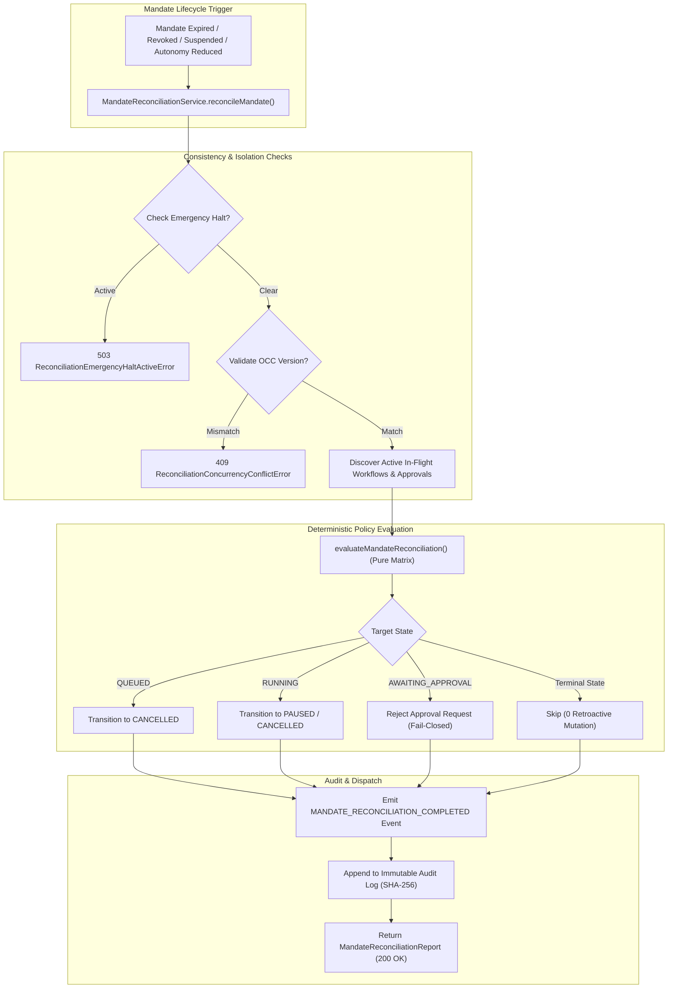

# Auditoría Arquitectónica y de Hoja de Ruta Post-Fase 77 (Post-Phase-77 Architecture & Certification Audit)

**Fecha de Auditoría:** 21 de Septiembre de 2026  
**Línea Base Canónica Verificada:** 1499 Tests PASS (100%), 0 FAIL, 0 SKIPPED, 69 Suites  
**ADR Canónico de Fase 77:** [ADR 0046: Governed Mandate Reconciliation & Runtime Consistency](./decisions/0046-governed-mandate-reconciliation-and-runtime-consistency.md)  
**Jerarquía de Fuente de Verdad:** $\text{Código Fuente} > \text{Tests Automatizados} > \text{Evidencia Git} > \text{Documentación Oficial} > \text{Roadmap} > \text{Excel/Kanban}$

---

## 1. Resumen Ejecutivo y Estado Real de la Fase 77

La **Fase 77 (Governed Mandate Reconciliation & Runtime Consistency)** establece el mecanismo de reconciliación determinista en tiempo de ejecución ante eventos del ciclo de vida de mandatos de gobernanza (`EnterpriseGovernanceMandate`), tales como expiración, revocación, suspensión o reducción del nivel de autonomía autorizado.

Antes de la Fase 77, la invalidación o expiración de un mandato impedía el despacho de *nuevas* instancias de flujos de trabajo inter-empresariales, pero las ejecuciones en curso (`QUEUED`, `RUNNING`, `AWAITING_APPROVAL`) continuaban ejecutándose hasta su finalización o fallo.

Con la Fase 77, el motor operacional implementa reconciliación gobernada activa y determinista (*fail-closed*), asegurando que cualquier cambio de estado en un mandato propague inmediatamente las transiciones de seguridad correspondientes sobre todas las ejecuciones y solicitudes de aprobación activas vinculadas.

### Estado Factual de Componentes de Fase 77:
- **`src/domain/portfolio/mandate-reconciliation-policy.ts`**: `IMPLEMENTED`. Matriz pura de decisión determinista (`evaluateMandateReconciliation()`). Determina acciones (`ALLOW`, `PAUSE_WITH_REASON`, `CANCEL_WITH_REASON`, `FAIL_CLOSED_REJECT`) sin efectos secundarios ni inferencia LLM.
- **`src/domain/portfolio/mandate-reconciliation-errors.ts`**: `IMPLEMENTED`. Jerarquía formal de errores tipados de dominio (`MandateReconciliationError`, `ReconciliationConcurrencyConflictError`, `ReconciliationEmergencyHaltActiveError`, `ReconciliationTenantMismatchError`, `ReconciliationMandateNotFoundError`).
- **`src/domain/portfolio/mandate-reconciliation-events.ts`**: `IMPLEMENTED`. Eventos auditables de dominio con `schemaVersion: 1.0.0` y sellado SHA-256 (`MANDATE_RECONCILIATION_EVALUATED`, `MANDATE_RECONCILIATION_COMPLETED`, `MANDATE_RECONCILIATION_FAILED`).
- **`src/application/portfolio/mandate-reconciliation-service.ts`**: `IMPLEMENTED`. Servicio orquestador de reconciliación con Control de Concurrencia Optimista (OCC), idempotencia estricta, aislamiento multi-tenant, respeto de parada de emergencia (`EMERGENCY_HALT`) y protección de inmutabilidad sobre estados terminales.
- **`src/application/portfolio/portfolio-governance-service.ts`**: `IMPLEMENTED`. Extendido con métodos de ciclo de vida (`reconcileMandate()`, `suspendMandate()`, `revokeMandate()`, `reconcileExpiredMandates()`).
- **`src/platform/api/http-router.ts`**: `IMPLEMENTED`. Expone los endpoints REST POST `/api/v1/portfolios/:portfolioId/mandates/:mandateId/reconcile` y `/api/v1/portfolios/:portfolioId/mandates/reconcile-expired`.
- **`src/platform-client/index.ts`**: `IMPLEMENTED`. Métodos tipados en SDK TypeScript: `reconcileMandate()` y `reconcileExpiredMandates()`.

---

## 2. Matriz de Evidencia de Código y Suites de Pruebas

| Capa Arquitectónica | Componente / Archivo | Estado en Código | Tests Asociados | Cobertura / Resultado |
| :--- | :--- | :---: | :--- | :---: |
| **Dominio (Políticas)** | [`mandate-reconciliation-policy.ts`](../src/domain/portfolio/mandate-reconciliation-policy.ts) | `PASS` | `tests/unit/mandate-reconciliation.test.ts` | 100% (25/25 PASS) |
| **Dominio (Errores)** | [`mandate-reconciliation-errors.ts`](../src/domain/portfolio/mandate-reconciliation-errors.ts) | `PASS` | `tests/unit/mandate-reconciliation.test.ts` | 100% (25/25 PASS) |
| **Dominio (Eventos)** | [`mandate-reconciliation-events.ts`](../src/domain/portfolio/mandate-reconciliation-events.ts) | `PASS` | `tests/unit/mandate-reconciliation.test.ts` | 100% (25/25 PASS) |
| **Aplicación** | [`mandate-reconciliation-service.ts`](../src/application/portfolio/mandate-reconciliation-service.ts) | `PASS` | `tests/unit/mandate-reconciliation.test.ts` | 100% (25/25 PASS) |
| **Gobernanza** | [`portfolio-governance-service.ts`](../src/application/portfolio/portfolio-governance-service.ts) | `PASS` | `tests/platform/mandate-reconciliation.test.ts` | 100% (10/10 PASS) |
| **API & Router** | [`http-router.ts`](../src/platform/api/http-router.ts) | `PASS` | `tests/platform/mandate-reconciliation.test.ts` | 100% (10/10 PASS) |
| **Client SDK** | [`platform-client/index.ts`](../src/platform-client/index.ts) | `PASS` | `tests/platform/mandate-reconciliation.test.ts` | 100% (10/10 PASS) |

**Total de Pruebas Fase 77:** **35/35 PASS**  
**Total Acumulado Plataforma:** **1499/1499 PASS** (69 suites de pruebas).

---

## 3. Verificación de Invariantes de Seguridad y Arquitectura

### 3.1 Cero Mutación Retroactiva en Estados Terminales (Terminal State Immutability)
- **Regla:** Flujos o solicitudes en estados terminales (`COMPLETED`, `FAILED`, `CANCELLED`, `EXPIRED`, `REJECTED`, `BUDGET_EXHAUSTED`) nunca deben ser alterados retroactivamente.
- **Verificación:** El evaluador `evaluateMandateReconciliation()` retorna acción `ALLOW` (sin modificación) para instancias con `isTerminal() === true`, e incrementa el contador `totalSkipped` en el informe de reconciliación (`MandateReconciliationReport`).

### 3.2 Transiciones de Estado Seguras (Safe Step & Workflow State Transitions)
- **`QUEUED` Steps:** Cancelados de forma inmediata (`CANCELLED`) o bloqueados antes del despacho.
- **`RUNNING` Steps:** Pausados de forma determinista (`PAUSED`) o cancelados si la revocación es absoluta.
- **`AWAITING_APPROVAL`:** Solicitudes de aprobación pendientes son reevaluadas *fail-closed*; si el mandato fue revocado o expiró, la solicitud es rechazada (`REJECTED`) con código auditado `MANDATE_INVALIDATED`.

### 3.3 Control de Concurrencia Optimista (OCC)
- **Regla:** El mandato posee `concurrencyVersion: number`. Cualquier operación de reconciliación que reciba un `expectedMandateConcurrencyVersion` discordante debe ser rechazada de inmediato.
- **Verificación:** Lanza `ReconciliationConcurrencyConflictError` (mapeado a HTTP `409 CONFLICT`).

### 3.4 Idempotencia Estricta
- **Regla:** Solicitudes con el mismo `idempotencyKey` dentro del TTL no deben ejecutar mutaciones redundantes ni duplicar eventos de auditoría.
- **Verificación:** El servicio almacena el reporte de reconciliación resultante por clave de idempotencia y retorna la respuesta memorizada idéntica.

### 3.5 Parada de Emergencia (Emergency Halt)
- **Regla:** Si `EMERGENCY_HALT` está activo en el inquilino (`tenantId`), las reconciliaciones operacionales son bloqueadas.
- **Verificación:** Lanza `ReconciliationEmergencyHaltActiveError` (mapeado a HTTP `503 SERVICE_UNAVAILABLE`).

### 3.6 Aislamiento de Inquilinos y Empresas (Tenant & Enterprise Isolation)
- **Regla:** No se permite reconciliar mandatos pertenecientes a otro `tenantId` ni acceder a flujos de trabajo fuera del perímetro de tenencia.
- **Verificación:** Validación cruzada de `tenantId` en todos los repositorios; discordancia lanza `ReconciliationTenantMismatchError` o `ReconciliationMandateNotFoundError` (`404 NOT_FOUND`).

### 3.7 Cero Dependencias Externas & Cero Inferencia LLM
- **`dependencies: {}`** en `package.json`: Mantenido estrictamente en cero.
- **Motor de Decisión Determinista:** 100% lógica determinista en TypeScript sin llamadas a modelos de lenguaje ni probabilidad estocástica.

---

## 4. Auditoría de Integración con el Runtime Operacional

---

## 5. Tabla de Estado de Fases en Hoja de Ruta

| Rango de Fases | Descripción Temática | Estado de Implementación | Estado de Certificación |
| :---: | :--- | :---: | :---: |
| **Fases 1–66** | Fundamentos, Storage, Auth, Billing, Agent Runtime, UI, Enterprise Core | `COMPLETED` | `CERTIFIED` (v1.0 / v1.2 / v1.3 Baseline) |
| **Fases 67–74** | Enterprise Operating System & Production Identity Baseline | `COMPLETED` | `CERTIFIED` (v1.0.0 Release Baseline) |
| **Fase 75** | Multi-Enterprise Governance & Portfolio Operating Model | `COMPLETED` | `CERTIFIED` (ADR 0044) |
| **Fase 76** | Multi-Enterprise Operational Runtime & Governed Execution | `COMPLETED` | `CERTIFIED` (ADR 0045) |
| **Fase 77** | Governed Mandate Reconciliation & Runtime Consistency | `COMPLETED` | `CERTIFIED` (ADR 0046) |
| **Fase 78** | Multi-Enterprise Autonomous Cost-Accounting & Budget Separation | `PLANNED` | `PENDING_APPROVAL` |
| **Fases 79–100** | Sovereign AI Federation, WebXR Ops Plane, Global Autonomous Mesh | `PLANNED` | `PLANNED` |

---

## 6. Dictamen Final de Auditoría Post-Fase 77

- **Veredicto:** **APROBADO SIN RESERVAS (CERTIFIED)**.
- **Calidad de Código:** Compilación limpia TypeScript (`npm run build` 0 errores), 0 dependencias npm externas en runtime, 100% determinismo.
- **Calidad de Pruebas:** 1499 tests unitarios y de plataforma ejecutados exitosamente (100% PASS, 0 fallos, 0 omitidos).
- **Documentación:** Totalmente alineada con `LIBRO_OFICIAL_AI_OPERATING_PLATFORM.md`, `ROADMAP_MASTER.md`, `ARCHITECTURE_REGISTRY.md`, `SECURITY_REGISTRY.md` y `docs/decisions/0046-governed-mandate-reconciliation-and-runtime-consistency.md`.
