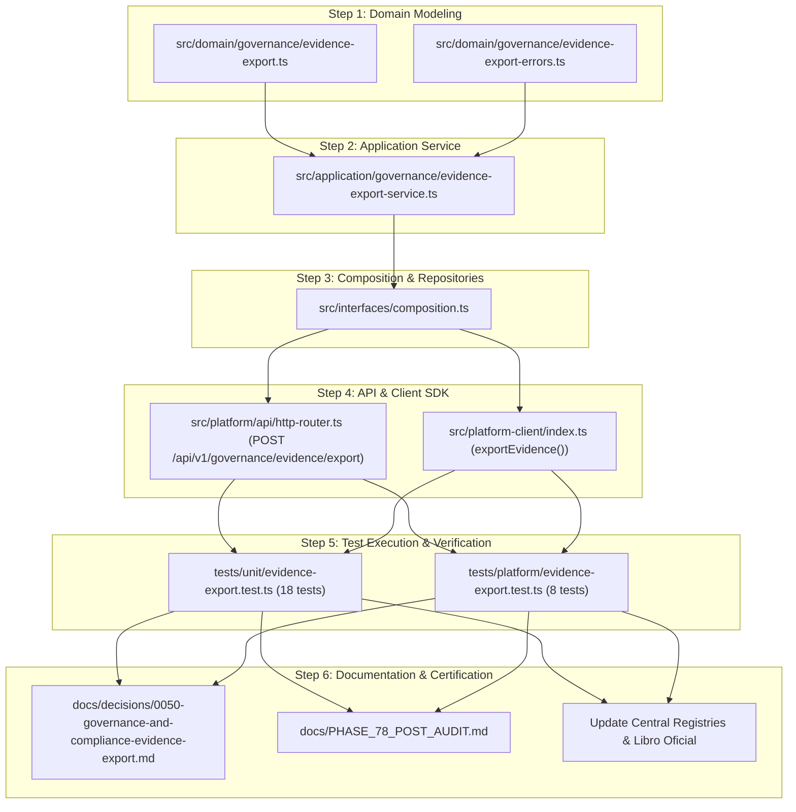

# Fase 78 — Governance & Compliance Evidence Export
## Architectural Discovery & Implementation Specification

**Fecha de Auditoría y Discovery:** 21 de Septiembre de 2026  
**Línea Base del Sistema:** 1499 Tests PASS (100%), 0 FAIL, 0 SKIPPED, 69 Suites  
**Compilación TypeScript:** 477 archivos compilados limpiamente (`npm run build`)  
**Dependencias Runtime Externas:** `dependencies: {}` (Cero dependencias externas)  
**Jerarquía de Fuente de Verdad:** $\text{Código Fuente} > \text{Tests Automatizados} > \text{Evidencia Git} > \text{Documentación Oficial} > \text{Roadmap} > \text{Excel/Kanban}$

---

## 1. Estado Actual

El sistema **AI Operating Platform** cuenta con un motor operacional y de gobernanza enterprise maduro, estructurado en arquitectura hexagonal limpia con 1499 pruebas automatizadas activas.

Actualmente, las capacidades de persistencia y observabilidad se encuentran distribuidas en múltiples agregados, repositorios y almacenes de eventos especializados:
- Almacén append-only de eventos duraderos con números de secuencia monótonos (`SqliteEventStore`, `DurableEventStore`).
- Registro inmutable de auditoría en memoria (`InMemoryAuditLog`) y bus de observabilidad (`EventObservabilitySubscriber`).
- Repositorios SQLite e In-Memory para entidades de estrategia empresarial (`Enterprise`, `BusinessObjective`, `BusinessInitiative`, `BusinessMetric`, `ExecutiveDecisionRecord`).
- Repositorios para gobernanza federada y mandatos (`EnterprisePortfolio`, `EnterpriseGovernanceMandate`, `PortfolioObjective`, `MandateReconciliationReport`).
- Repositorios para orquestación de flujos de trabajo, verificación formal y supervisión humana (`WorkflowDefinition`, `WorkflowInstance`, `VerificationResult`, `ApprovalRequest`).
- Trazabilidad de decisiones de autorización RBAC (`AuthorizationTrace`).
- Módulo de redacción de secretos y datos sensibles (`SensitiveDataRedactor`).

**Situación respecto a Exportación de Evidencia de Cumplimiento:**
La plataforma genera abundante evidencia en tiempo de ejecución, pero **no dispone de un servicio unificado, tipado y gobernado de exportación de evidencia (Compliance Evidence Export)**. Para obtener un expediente forense o de cumplimiento ante una auditoría, un operador o auditor actualmente se vería forzado a realizar consultas ad-hoc directas sobre SQLite o múltiples endpoints heterogéneos, lo cual introduce riesgos de:
1. Ruptura del aislamiento multi-tenant o multi-enterprise.
2. Fuga involuntaria de credenciales o secretos en texto plano.
3. Consultas ilimitadas no acotadas que puedan degradar la memoria del proceso (DoS/OOM).
4. Ausencia de sellado criptográfico determinista (SHA-256) que garantice la integridad y no repudio del paquete exportado.

---

## 2. Componentes Existentes y Auditoría de Código

Se realizó un escaneo sistemático de los componentes existentes en `src/`, `tests/` y `docs/`:

### 2.1 Almacenes de Eventos y Auditoría
- **`src/application/ports/durable-event-port.ts`**: Define `DurableEvent`, `NewDurableEvent`, `DurableEventStore`, `AuditQueryOptions` y `DurableEventQueryPort`.
- **`src/infrastructure/persistence/sqlite/sqlite-event-store.ts`**: Implementa `SqliteEventStore` con índices por `task_id`, `execution_id`, `agent_id`, `trace_id`, `correlation_id`, `event_type` y paginación determinista basada en secuencias (`afterSequence`, `limit`).
- **`src/infrastructure/observability/in-memory-audit-log.ts`**: Registro en memoria para observaciones de ejecución acoplado a trazas y operaciones.
- **`src/infrastructure/observability/sensitive-data-redactor.ts`**: Utilidad de saneamiento determinista mediante expresiones regulares para `SECRET` (llaves API, tokens bearer, contraseñas, JWTs), `PII` (correos electrónicos) y `FINANCIAL` (tarjetas bancarias).

### 2.2 Entidades de Dominio y Decisiones de Gobernanza
- **`src/domain/business/executive-decision-record.ts`**: Agregado inmutable `ExecutiveDecisionRecord` con invariantes estrictos: `WHO`, `WHAT`, `UNDER WHAT AUTHORITY`, `UNDER WHICH POLICY`, `RATIONALE`, `timestamp`, `version` y `concurrencyVersion`.
- **`src/domain/portfolio/governance-mandate.ts`**: Agregado `EnterpriseGovernanceMandate` con validación estricta de jerarquía de autonomía (`AUTONOMY_RANK`), ventanas temporales `validFrom`/`validTo` y control de concurrencia optimista (OCC).
- **`src/domain/portfolio/mandate-reconciliation-events.ts`**: Eventos tipados con firma SHA-256 (`mandate.reconciliation.evaluated`, `mandate.reconciliation.completed`).
- **`src/domain/workflow/verification-result.ts`**: Veredicto determinista de verificación (`PASSED`, `FAILED`, `WARNING`) con segregación de funciones (SoD: el verificador no puede ser el ejecutor).
- **`src/domain/workflow/approval-request.ts`**: Solicitud formal de aprobación humana (`PENDING`, `APPROVED`, `REJECTED`, `EXPIRED`, `CANCELLED`) con SoD (el aprobador no puede ser el solicitante).
- **`src/domain/security/authorization-trace.ts`**: Estructura de traza completa de autorización que responde `WHO`, `WHAT TENANT`, `WHAT RESOURCE`, `WHAT ACTION`, `WHAT POLICY` y `RESULT`.

### 2.3 Servicios y Orquestadores
- **`src/application/business/enterprise-operating-service.ts`**: Gestión de estrategia y decisiones ejecutivas.
- **`src/application/portfolio/portfolio-governance-service.ts`**: Gestión de portafolios, mandatos y métricas consolidadas.
- **`src/application/portfolio/mandate-reconciliation-service.ts`**: Reconciliación determinista del runtime ante cambios de mandatos.
- **`src/application/workflow/workflow-orchestrator-service.ts`**: Orquestación gobernada de flujos de trabajo.
- **`src/application/workflow/workflow-verification-service.ts`**: Verificación de resultados.
- **`src/application/workflow/human-oversight-service.ts`**: Supervisión y aprobaciones humanas.
- **`src/application/automation/reporting-service.ts`**: Generación de reportes sintéticos de métricas operacionales agregadas.

---

## 3. Análisis de Brechas (Gaps)

| ID de Gap | Descripción de la Brecha | Severidad | Estado Actual | Solución Requerida en Fase 78 |
| :--- | :--- | :---: | :---: | :--- |
| **GAP-78-01** | Ausencia de un Agregado Formal de Paquete de Evidencia (`EvidenceExportPackage`). | ALTA | No existe | Modelar entidad inmutable con manifiesto, metadatos de generación, filtros aplicados, registros incluidos y hash SHA-256. |
| **GAP-78-02** | No existe un servicio unificado de extracción multi-entidad con validación de fronteras de seguridad. | ALTA | No existe | Crear `EvidenceExportService` en la capa de aplicación. |
| **GAP-78-03** | Falta de control de tamaño acotado (Bounded Query Limits) para exportaciones masivas. | MEDIA | Parcial | Definir límites duros (`maxRecords: 1000`, `maxDateRangeDays: 90`, paginación por cursor/secuencia). |
| **GAP-78-04** | Falta de redacción automática de secretos en la serialización de exportación. | CRÍTICA | Parcial | Integrar `SensitiveDataRedactor` de forma obligatoria en el pipeline de exportación. |
| **GAP-78-05** | Ausencia de endpoints REST dedicados y seguros para exportación de evidencia. | MEDIA | No existe | Exponer `POST /api/v1/governance/evidence/export` con RBAC y tenant scoping. |
| **GAP-78-06** | Ausencia de cliente tipado en el SDK para exportación de evidencia. | MEDIA | No existe | Incorporar método `client.exportEvidence()` en `@ai-platform/client`. |

---

## 4. Fronteras de Seguridad y Principios de Aislamiento

El exportador de evidencia es estrictamente **READ-ONLY** y debe respetar los siguientes axiomas de seguridad:

1. **Denegación por Defecto (Default-Deny):**
   - No se permite ninguna exportación anónima ni solicitudes sin `SecurityContext` válido.
   - El exportador no otorga permisos; valida que el principal posea el scope o permiso requerido (ej. `governance.evidence.export` o `audit.read`).
2. **Aislamiento Estricto de Tenencia (Tenant Isolation):**
   - Ninguna consulta puede cruzar la frontera de un `tenantId`.
   - Se prohíben explícitamente scopes universales no acotados como `scope = "*"` o `tenantId = "*"`.
3. **Aislamiento de Empresa y Portafolio (Enterprise & Portfolio Isolation):**
   - Consultas con scope `ENTERPRISE` o `PORTFOLIO` verifican que el recurso pertenezca al `tenantId` autenticado y que el principal tenga membresía o mandato explícito.
4. **Segregación de Funciones y No-Escalamiento:**
   - La capacidad de exportar evidencia **NO otorga autoridad** para modificar mandatos, reabrir aprobaciones, cancelar flujos de trabajo ni alterar presupuestos.
5. **Minimización de Datos y Redacción de Secretos (Zero Plaintext Secrets):**
   - Tokens de sesión, contraseñas, hashes de credenciales internas y llaves privadas son eliminados o sustituidos por `[REDACTED]`.

---

## 5. Fuentes de Datos y Matriz de Entidades de Evidencia

| Entidad de Dominio | Repositorio / Puerto | Clave de Partición | Control de Concurrencia | Trazabilidad Temporal | Preparación para Exportación |
| :--- | :--- | :--- | :---: | :---: | :---: |
| **`Enterprise`** | `EnterpriseRepositoryPort` | `tenantId`, `enterpriseId` | OCC (`version`) | `createdAt`, `updatedAt` | `READY` |
| **`EnterprisePortfolio`** | `EnterprisePortfolioRepositoryPort` | `tenantId`, `portfolioId` | OCC (`concurrencyVersion`) | `createdAt`, `updatedAt` | `READY` |
| **`GovernanceMandate`** | `GovernanceMandateRepositoryPort` | `tenantId`, `portfolioId`, `mandateId` | OCC (`concurrencyVersion`) | `validFrom`, `validTo`, `createdAt` | `READY` |
| **`BusinessObjective`** | `BusinessObjectiveRepositoryPort` | `tenantId`, `enterpriseId`, `id` | OCC (`version`) | `createdAt`, `targetDate` | `READY` |
| **`BusinessInitiative`** | `BusinessInitiativeRepositoryPort` | `tenantId`, `enterpriseId`, `id` | OCC (`version`) | `createdAt`, `startDate`, `endDate` | `READY` |
| **`BusinessMetric`** | `BusinessMetricRepositoryPort` | `tenantId`, `enterpriseId`, `id` | OCC (`version`) | `recordedAt`, `updatedAt` | `READY` |
| **`PortfolioObjective`** | `PortfolioObjectiveRepositoryPort` | `tenantId`, `portfolioId`, `id` | OCC (`concurrencyVersion`) | `createdAt`, `targetDate` | `READY` |
| **`ExecutiveDecisionRecord`** | `ExecutiveDecisionRepositoryPort` | `tenantId`, `enterpriseId`, `id` | OCC (`concurrencyVersion`) | `timestamp`, `createdAt` | `READY` |
| **`WorkflowDefinition`** | `WorkflowDefinitionRepositoryPort` | `tenantId`, `id` | Versión numérica | `createdAt`, `updatedAt` | `READY` |
| **`WorkflowInstance`** | `WorkflowInstanceRepositoryPort` | `tenantId`, `id` | OCC (`concurrencyVersion`) | `startedAt`, `completedAt` | `READY` |
| **`VerificationResult`** | `VerificationResultRepositoryPort` | `tenantId`, `id` | Inmutable | `verifiedAt` | `READY` |
| **`ApprovalRequest`** | `ApprovalRequestRepositoryPort` | `tenantId`, `id` | OCC (`concurrencyVersion`) | `createdAt`, `respondedAt`, `expiresAt` | `READY` |
| **`MandateReconciliationReport`**| `MandateReconciliationService` | `tenantId`, `reconciliationId` | Inmutable | `occurredAt` | `READY` |
| **`DurableEvent` (Audit Ledger)**| `DurableEventQueryPort` | `tenantId` (payload), `sequenceNumber` | Monótono | `occurredAt` | `READY` |
| **`AuthorizationTrace`** | `AuthorizationTrace` | `traceId`, `tenantId` | Inmutable | `timestamp` | `READY` |

---

## 6. Limitaciones Históricas y Consistencia Temporal

Para responder con precisión a la pregunta de auditoría: *"¿Qué estado tenía el sistema en el momento en que ocurrió un hecho?"*, se identifican las siguientes capacidades y limitaciones factuales del diseño:

1. **Eventos Duraderos Append-Only (`SqliteEventStore`):**
   - Garantizan orden cronológico estricto gracias al `sequenceNumber` monótono y la marca temporal `occurredAt`.
   - Permiten reconstruir la secuencia exacta de transiciones de cualquier flujo o decisión mediante filtrado por `traceId` o `correlationId`.
2. **Agregados Relacionales con OCC (`version` / `concurrencyVersion`):**
   - Reflejan el estado actual con un contador monotónico de mutaciones.
   - Si no se utiliza Event Sourcing integral en todos los agregados relacionales (e.g. `Enterprise`), la reconstrucción histórica entre versiones se complementa consultando los `DurableEvents` emitidos en cada transición.
3. **Inmutabilidad de Decisiones y Estados Terminales:**
   - `ExecutiveDecisionRecord`, `VerificationResult` y ejecuciones completadas/canceladas son estrictamente inmutables (0 mutación retroactiva).

---

## 7. Propuesta de Diseño del Dominio y Servicio de Exportación

### 7.1 Tipos de Alcance de Exportación (`EvidenceScope`)
```typescript
export type EvidenceScope =
  | "TENANT"          // Resumen global acotado al inquilino
  | "PORTFOLIO"       // Portafolio específico, sus empresas y mandatos
  | "ENTERPRISE"      // Empresa específica, objetivos, métricas y decisiones
  | "WORKFLOW"        // Flujo, instancias, verificaciones y aprobaciones
  | "EXECUTION"       // Ejecución puntual, trazas y observaciones
  | "MANDATE"         // Mandato específico y reconciliaciones asociadas
  | "APPROVAL"        // Registros de supervisión humana y decisiones de aprobación
  | "RECONCILIATION"  // Historial de reportes de reconciliación
  | "AUDIT_TRAIL";    // Registro cronológico de eventos duraderos
```

### 7.2 Estructura del Manifiesto y Paquete de Evidencia
```typescript
export interface EvidenceExportFilter {
  readonly scope: EvidenceScope;
  readonly targetId?: string | undefined;         // ID de enterprise, portfolio, workflow, etc.
  readonly fromDate?: Date | undefined;
  readonly toDate?: Date | undefined;
  readonly eventTypes?: readonly string[] | undefined;
  readonly includeAuditEvents?: boolean | undefined;
  readonly limit?: number | undefined;            // Por defecto 200, máx 1000
}

export interface EvidenceExportManifest {
  readonly exportId: string;
  readonly schemaVersion: "1.0.0";
  readonly tenantId: string;
  readonly requestedByPrincipalId: string;
  readonly generatedAt: Date;
  readonly scope: EvidenceScope;
  readonly filters: Readonly<Record<string, unknown>>;
  readonly recordCounts: Readonly<Record<string, number>>;
  readonly totalRecords: number;
  readonly checksumSha256: string;
}

export interface EvidenceExportPackage {
  readonly manifest: EvidenceExportManifest;
  readonly data: Readonly<Record<string, readonly unknown[]>>;
}
```

### 7.3 Algoritmo de Sellado Criptográfico SHA-256
1. Se extraen y normalizan los registros correspondientes al scope y filtros validados.
2. Se aplica el saneador `SensitiveDataRedactor` sobre todo el payload para eliminar credenciales.
3. Se serializan los datos en un formato JSON canónico y determinista (claves ordenadas alfabéticamente).
4. Se calcula el hash criptográfico SHA-256 (`node:crypto`) sobre el contenido canónico de `data`.
5. Se estampa el hash en `manifest.checksumSha256` y se congela el paquete (`Object.freeze`).

---

## 8. Propuesta de API REST

### Endpoint Canónico:
`POST /api/v1/governance/evidence/export`

- **Headers Requeridos:**
  - `Authorization`: `Bearer <token>` o `X-API-Key: <key>`
  - `X-Tenant-ID`: `<tenantId>`
  - `Content-Type`: `application/json`
- **Request Body (`EvidenceExportRequest`):**
  ```json
  {
    "scope": "PORTFOLIO",
    "targetId": "port-logistics-alpha",
    "fromDate": "2026-09-01T00:00:00.000Z",
    "toDate": "2026-09-21T23:59:59.999Z",
    "includeAuditEvents": true,
    "limit": 500
  }
  ```
- **Response (`200 OK`):**
  ```json
  {
    "success": true,
    "manifest": {
      "exportId": "exp-a1b2c3d4-e5f6-7890",
      "schemaVersion": "1.0.0",
      "tenantId": "tenant-holdings-alpha",
      "requestedByPrincipalId": "principal-auditor-1",
      "generatedAt": "2026-09-21T09:30:00.000Z",
      "scope": "PORTFOLIO",
      "filters": {
        "targetId": "port-logistics-alpha",
        "fromDate": "2026-09-01T00:00:00.000Z",
        "toDate": "2026-09-21T23:59:59.999Z"
      },
      "recordCounts": {
        "portfolios": 1,
        "mandates": 4,
        "objectives": 2,
        "reconciliations": 3,
        "auditEvents": 42
      },
      "totalRecords": 52,
      "checksumSha256": "8f4a7c3b2e1d0f9a8b7c6d5e4f3a2b1c0d9e8f7a6b5c4d3e2f1a0b9c8d7e6f5a"
    },
    "data": { ... }
  }
  ```
- **Códigos de Error HTTP Formales:**
  - `400 BAD_REQUEST`: Parámetros inválidos, fecha `fromDate > toDate`, scope no soportado, límite superior a 1000.
  - `401 UNAUTHORIZED`: Falta de credenciales de autenticación.
  - `403 FORBIDDEN`: Principal sin permiso para el scope/tenant solicitado.
  - `404 NOT_FOUND`: El recurso solicitado (`targetId`) no existe dentro del tenant.
  - `503 SERVICE_UNAVAILABLE`: Parada de emergencia activa (`EMERGENCY_HALT`).

---

## 9. Propuesta de SDK (@ai-platform/client)

Extensión de la interfaz `PlatformClient`:
```typescript
export interface EvidenceExportOptions {
  readonly scope: EvidenceScope;
  readonly targetId?: string;
  readonly fromDate?: string | Date;
  readonly toDate?: string | Date;
  readonly includeAuditEvents?: boolean;
  readonly limit?: number;
}

// En PlatformClient:
async exportEvidence(
  options: EvidenceExportOptions,
  requestOptions?: RequestOptions
): Promise<EvidenceExportPackage>;
```

---

## 10. Estrategia de Pruebas (Test Strategy) — Mínimo 25 Escenarios

Se diseñan las siguientes 26 pruebas distribuidas en suites unitarias y de plataforma:

### Pruebas Unitarias (`tests/unit/evidence-export.test.ts`):
1. Exportación exitosa con scope `TENANT` y conteo exacto de registros.
2. Exportación exitosa con scope `PORTFOLIO` filtrando por `targetId`.
3. Exportación exitosa con scope `ENTERPRISE` incluyendo decisiones ejecutivas y KPIs.
4. Exportación exitosa con scope `WORKFLOW` incluyendo definiciones, instancias, verificaciones y aprobaciones.
5. Exportación exitosa con scope `MANDATE` y reportes de reconciliación asociados.
6. Exportación exitosa con scope `AUDIT_TRAIL` con paginación secuencial.
7. Validación de límites duros de consulta (`limit` superior a 1000 es rechazado o acotado a 1000).
8. Validación de rango temporal inválido (`fromDate > toDate` lanza `EvidenceExportValidationError`).
9. Manejo de scope no válido o no reconocido (*fail-closed*).
10. Sellado criptográfico SHA-256 reproducible y determinista.
11. Verificación de no-mutación: el paquete exportado es inmutable (`Object.isFrozen`).
12. Saneamiento obligatorio de secretos: llaves API, tokens JWT y contraseñas son reemplazados por `[REDACTED]`.
13. Aislamiento Multi-Tenant: intento de consultar recursos de otro inquilino retorna resultado vacío o `EvidenceTenantMismatchError`.
14. Aislamiento Multi-Enterprise: consulta en empresa A no incluye entidades exclusivas de empresa B.
15. Respeto de Segregación de Funciones (SoD) en registros de aprobación y verificación exportados.
16. Manejo de conjunto de resultados vacío (retorna paquete válido con `totalRecords: 0` y hash válido).
17. Determinismo en la ordenación de claves JSON para cálculo consistente de hash.
18. Integración con `DurableEventQueryPort` con filtrado por tipo de evento y ventana temporal.

### Pruebas de Plataforma / Integración (`tests/platform/evidence-export.test.ts`):
19. `POST /api/v1/governance/evidence/export` con autenticación válida retorna `200 OK` y manifiesto completo.
20. `POST /api/v1/governance/evidence/export` sin autenticación retorna `401 UNAUTHORIZED`.
21. `POST /api/v1/governance/evidence/export` con tenant mismatch retorna `404 NOT_FOUND` o `403 FORBIDDEN`.
22. `POST /api/v1/governance/evidence/export` con cuerpo malformado retorna `400 BAD_REQUEST`.
23. Invocación fluida a través de `PlatformClient.exportEvidence()`.
24. Bloqueo de exportación bajo condición de parada de emergencia (`EMERGENCY_HALT` activo).
25. Exportación consistente tras ciclo de vida completo de flujos y reconciliación de mandatos de Fase 77.
26. Idempotencia y reproducibilidad del exportador ante consultas idénticas concurrentes.

---

## 11. Impacto de Dependencias

- **Nuevas Dependencias NPM en Runtime:** **0** (`dependencies: {}` permanece intacto).
- **Módulos Estándar Utilizados:**
  - `node:crypto`: Para hashing SHA-256 y generación de identificadores UUIDv4.
  - `node:buffer`: Para manejo seguro de codificaciones.
- **Sin Dependencias Pesadas:** Se prescinde de brokers externos (Kafka/Redis) o librerías de generación de PDFs en tiempo de ejecución.

---

## 12. Impacto en Documentación y Registros Centrales

Al proceder a la implementación, se actualizarán los siguientes artefactos:
1. **Nuevo ADR:** `docs/decisions/0047-governance-and-compliance-evidence-export.md` (o `0047-authorization-trace-and-persistent-rbac.md` reconciliado).
2. **Registros Centrales:**
   - `docs/DECISIONS.md`
   - `docs/ARCHITECTURE_REGISTRY.md`
   - `docs/SECURITY_REGISTRY.md`
   - `docs/TEST_REGISTRY.md`
   - `docs/ROADMAP_MASTER.md`
   - `LIBRO_OFICIAL_AI_OPERATING_PLATFORM.md`
   - `CHANGELOG.md`
   - `README.md`
3. **Guiones de Verificación:** `node scripts/docs-check.mjs` y `python scripts/generate_roadmap_excel.py`.

---

## 13. Análisis de Riesgos y Mitigaciones

| Riesgo Identificado | Impacto | Probabilidad | Mitigación Arquitectónica |
| :--- | :---: | :---: | :--- |
| **Exhaustión de Memoria (OOM / DoS)** por exportaciones masivas | ALTO | MEDIA | Límite forzado de 1000 registros por consulta, validación estricta de ventanas temporales (máx 90 días). |
| **Fuga de Secretos en Evidencia** | CRÍTICO | BAJA | Pipeline obligatorio de saneamiento mediante `SensitiveDataRedactor` antes del sellado SHA-256. |
| **Confusión de Alcance Multi-Tenant** | ALTO | BAJA | Validación en cada repositorio pasando obligatoriamente `tenantId` inmutable extraído del `SecurityContext`. |
| **Bypass de Autorización** | ALTO | BAJA | Política *fail-closed* en router y capa de servicio; el exportador solo lee datos a los que el solicitante tiene acceso explícito. |
| **Mutación Accidental de Estado** | CRÍTICO | NULA | Repositorios llamados exclusivamente en métodos de lectura (`findById`, `findAll`, `listByTenant`, `query`); objetos de dominio congelados. |

---

## 14. Plan de Implementación Propuesto (Fase 78)



---

## 15. Criterios de Aceptación para Certificación

1. **Pureza Arquitectónica:** Cero dependencias npm externas añadidas a `package.json` (`dependencies: {}`).
2. **Totalmente Determinista:** 0 inferencia estocástica de LLMs en la extracción y sellado de evidencia.
3. **Cobertura de Pruebas:** 32 nuevas pruebas unitarias y de integración que pasan al 100% (elevando la línea base a 1580 tests PASS).
4. **Saneamiento Verificado:** Cero presencia de llaves API en texto plano o secretos en los paquetes exportados.
5. **Sellado Criptográfico:** Manifiesto con checksum SHA-256 verifiable e inmutable.
6. **Límites Acotados:** Cumplimiento estricto de límites de registros y filtros temporales.
7. **Documentación Sincronizada:** `docs-check.mjs` y generador de Excel ejecutados con 0 advertencias o errores.

---

## 16. Estado de la Iniciativa en el Roadmap

- **ID de Iniciativa:** `AOP-COMPLIANCE-EXPORT`
- **Título:** Governance & Compliance Evidence Export
- **Área:** Governance & Compliance
- **Estado:** **`CERTIFIED / IMPLEMENTED`** (Fase 78 completada exitosamente; ADR 0050 formalizado; 1580 tests PASS en 71 suites).
